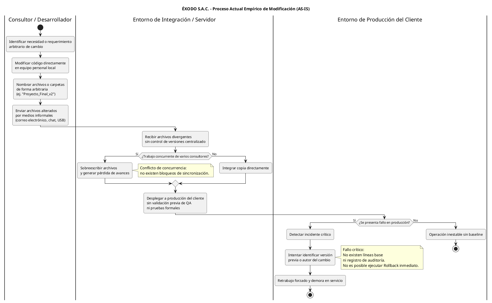
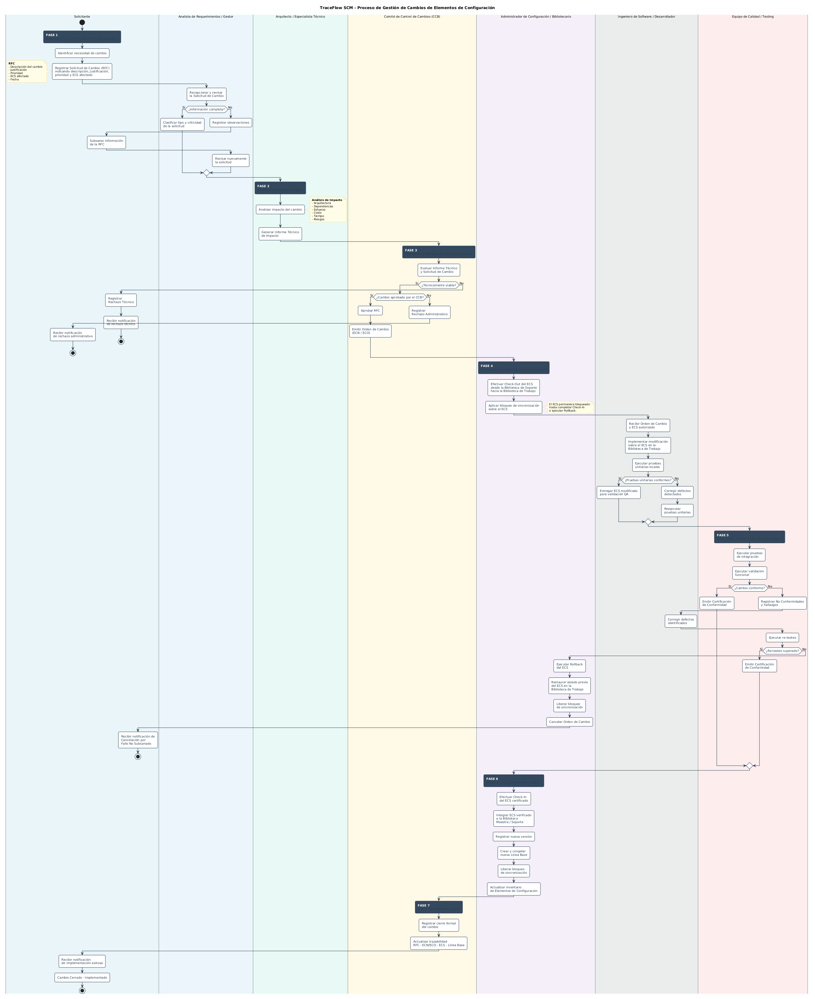

# FD01 - Informe de Factibilidad

> **Sistema de Gestión de Configuración de Software - TraceFlow SCM**  
> **Repositorio:** `TraceFlow`  
> **Identificador Documental:** `FD01-EPIS-Informe_Factibilidad.md`  
> **Versión:** 1.0  
> **Fecha:** 2026-10-01  
> **Estado:** REVISION  
> **Norma de Gobernanza:** [docs/DOCUMENTATION_RULES.md](docs/DOCUMENTATION_RULES.md)  
> **Documento Consolidado de Referencia:** [FD03-EPIS-Informe_SRS.md](FD03-EPIS-Informe_SRS.md)  

---

### Control de Versiones del Documento

| Versión | Elaborado por | Revisado por | Aprobado por | Fecha | Motivo / Descripción del Cambio |
| :---: | :--- | :--- | :--- | :---: | :--- |
| **1.0** | C-SharkTeam (JCM / RAA / RFL / AJR) | Comité de Control de Cambios (CCB) | RVA (Docente Asesor) | 2026-10-01 | Elaboración inicial del Informe de Factibilidad independiente, extrayendo y auditando los componentes de viabilidad del SRS (FD03). |

---

### Datos Generales del Proyecto y del Estudio

- **Denominación del Sistema:** Sistema de Gestión de Configuración de Software — TraceFlow SCM
- **Institución Académica:** Universidad Privada de Tacna (UPT) — Facultad de Ingeniería — Escuela Profesional de Ingeniería de Sistemas (EPIS)
- **Curso:** Gestión de la Configuración de Software (Semestre 2026-II)
- **Docente Asesor:** Dr. Ricardo Eduardo Valcarcel Alvarado
- **Entorno Organizacional Beneficiario / Cliente:** ÉXODO S.A.C.
- **Equipo de Desarrollo (C-SharkTeam):**
  - Joan Cristian Medina Quispe (Código: 2022074255) — Dirección de Proyecto y Gobernanza SCM
  - Renzo Antonio Antayhua Mamani (Código: 2022073504) — Ingeniería de Backend y Servicios de Integración
  - Renzo Fernando Loyola Vilca Choque (Código: 2021072615) — Ingeniería de Frontend y Experiencia de Usuario
  - Augusto Joaquin Rivera Muñoz (Código: 2022073505) — Aseguramiento de la Calidad (QA), Auditoría y Persistencia

---

## 1. Introducción

El presente **Informe de Factibilidad (FD01)** formaliza la evaluación multidimensional previa para el diseño, construcción e implantación de la plataforma de software **TraceFlow SCM** (*Software Configuration Management*). El estudio se fundamenta en las necesidades operacionales diagnosticadas en la empresa consultora **ÉXODO S.A.C.**, entidad peruana dedicada al desarrollo de software a medida y servicios de tecnologías de la información, en cooperación académica con el equipo de desarrollo **C-SharkTeam** de la Universidad Privada de Tacna.

En la ingeniería de software profesional, la evaluación de factibilidad constituye una compuerta de decisión esencial del ciclo de vida. Permite determinar, con base en evidencia empírica y criterios técnicos rigurosos, si la inversión de recursos humanos, tecnológicos y financieros se encuentra plenamente justificada antes de comprometer esfuerzos sustantivos en las fases de construcción y despliegue.

El desarrollo de TraceFlow SCM responde a una problemática recurrente en la industria de desarrollo de software: el crecimiento de la cartera de proyectos bajo prácticas empíricas de administración de código propicia la coexistencia de versiones divergentes, incidentes graves de sobreescritura por trabajo concurrente y la imposibilidad de certificar qué artefactos fueron formalmente aprobados y desplegados al cliente final.

Este documento se rige estrictamente por las disposiciones de la [docs/DOCUMENTATION_RULES.md](docs/DOCUMENTATION_RULES.md), preservando el principio de Fuente Única de Verdad (SSOT) y aislando las afirmaciones demostrables en la documentación actual frente a aquellos datos que quedan formalmente catalogados como **PENDIENTE DE VALIDACIÓN**.

---

## 2. Propósito del estudio

El propósito medular del presente estudio de factibilidad consiste en dictaminar la viabilidad integral de **TraceFlow SCM**, evaluando de forma exhaustiva sus dimensiones técnica, económica, operativa, legal, social y ambiental, para respaldar la toma de decisiones sobre la continuidad del proyecto hacia la fase de desarrollo e implementación (Fase 4 - FD04).

### 2.1. Objetivos Específicos del Estudio

1. **Evaluar la Factibilidad Técnica:** Analizar la suficiencia de la infraestructura tecnológica, la idoneidad del stack arquitectural propuesto (arquitectura web en 4 capas, base de datos relacional, motor criptográfico SHA-256) y las capacidades operativas del equipo para implementar mecanismos de control de concurrencia y gestión de bibliotecas.
2. **Evaluar la Factibilidad Económica:** Auditar las estimaciones de inversión de desarrollo (CAPEX), costos operativos anuales de soporte y alojamiento (OPEX), y contrastar los indicadores financieros preliminares frente a la realidad del negocio de ÉXODO S.A.C.
3. **Evaluar la Factibilidad Operativa:** Medir la receptividad organizacional de ÉXODO S.A.C. y validar la correspondencia entre los flujos de trabajo propuestos y los 7 perfiles y roles canónicos de usuario definidos bajo el modelo RBAC del sistema.
4. **Evaluar la Factibilidad Legal y Normativa:** Verificar el cumplimiento de la legislación peruana en materia de propiedad intelectual (D.L. N.° 822), protección de datos personales (Ley N.° 29733) y acuerdos de nivel de servicio (SLA) con clientes.
5. **Evaluar la Factibilidad Social y Ambiental:** Examinar el impacto de la herramienta sobre el clima laboral, la transparencia del equipo técnico, y cuantificar la eco-eficiencia digital derivada de la optimización del ciclo de desarrollo y la política de cero papel.

---

## 3. Situación problemática

### 3.1. Contexto Organizacional de ÉXODO S.A.C.

**ÉXODO S.A.C.** es una empresa consultora dedicada a la prestación de servicios de desarrollo y mantenimiento de software a medida para clientes de diversos sectores productivos. Su estructura operativa abarca tres niveles: estratégico (Gerencia de Proyectos), táctico (Jefaturas de Proyecto) y operativo (equipos de desarrollo, control de calidad y soporte técnico).

### 3.2. Diagnóstico de la Situación Actual (AS-IS)

De acuerdo con el levantamiento de información documentado en el SRS (`FD03-EPIS-Informe_SRS.md`, Sección 3.1 y 3.6), ÉXODO S.A.C. opera bajo un esquema empírico carente de un sistema formal de Gestión de la Configuración del Software:

- **Almacenamiento Disperso:** El código fuente, los esquemas de bases de datos y la documentación técnica residen de forma atomizada en los discos duros locales de los consultores y en cuentas individuales en diversas plataformas de almacenamiento, sin un repositorio institucional seguro y unificado.
- **Control de Versiones Empírico o Inexistente:** Se utilizan nomenclaturas manuales y ambiguas sobre nombres de carpetas y archivos comprimidos (ejemplo: `Proyecto_Cliente_Final_v2`), lo que propicia confusión inmediata sobre cuál es la versión vigente.
- **Flujos de Cambio Informales y Modificaciones Arbitrarias:** Los requerimientos de ajuste y corrección se coordinan de forma verbal o mediante servicios de mensajería instantánea (chat), sin registro de solicitud, análisis de impacto previo ni aprobación técnica formal.
- **Sobreescritura por Trabajo Concurrente:** La ausencia de mecanismos de exclusión mutua o bloqueos de sincronización provoca que cuando dos o más consultores intervienen simultáneamente sobre el mismo módulo, se produzcan pérdidas críticas de código por sobreescritura.
- **Inexistencia de Líneas Base (Baselines) y Capacidad de Retorno:** No se generan versiones congeladas formalmente aprobadas. Ante incidentes críticos o regresiones en los ambientes de producción de los clientes, el equipo no cuenta con puntos de recuperación estables ni procedimientos de reversión (*rollback*).
- **Entregas al Cliente sin Certificación Formal:** El código modificado es transferido directamente a producción sin pasar por una etapa obligatoria de validación e inspección por un equipo de calidad, deteriorando la relación contractual y la confianza con los clientes.

### 3.3. Cuadro de Necesidades Identificadas

La siguiente tabla sintetiza las brechas críticas identificadas durante el levantamiento inicial y su requerimiento correspondiente en el sistema ([docs/TABLES.md](docs/TABLES.md), TB-03):

| Área | Problema Detectado (Situación AS-IS) | Requerimiento del Sistema TraceFlow SCM |
| :--- | :--- | :--- |
| **Código** | Pérdida de fuentes por almacenamiento disperso en equipos locales y cuentas personales. | Repositorio centralizado, seguro y estructurado por proyectos de clientes. |
| **Cambios** | Modificaciones arbitrarias acordadas verbalmente o por chat, sin registro de autor o motivo. | Flujo formal de aprobación mediante Solicitudes de Cambio (RFC) y Órdenes de Cambio (ECN/ECO). |
| **Versiones** | Confusión sobre la versión vigente por uso de nombres informales de carpetas. | Etiquetado estandarizado y congelamiento de Líneas Base (*Baselines*). |
| **Auditoría** | Imposibilidad de identificar al responsable o causa raíz de un defecto en producción. | Registro de auditoría cronológico inmutable y verificación de integridad criptográfica (SHA-256). |
| **Entregas** | Liberación de entregables al cliente sin validación técnica ni pruebas previas. | Certificación de Conformidad obligatoria expedida por el Equipo de Calidad previa a la integración. |

### 3.4. Diagrama del Proceso Actual (AS-IS)

El flujo operativo empírico documentado en el sistema se ilustra a continuación (`DG-02`):



---

## 4. Alternativa de solución propuesta

Como respuesta a la problemática diagnosticada, se propone el diseño e implantación de **TraceFlow SCM**, una plataforma web orientada al gobierno integral de la configuración y control de cambios para empresas y equipos de consultoría tecnológica.

### 4.1. Pilares Arquitecturales y Capacidades Clave

1. **Ciclo de Vida Formal de Cambios (RFC & ECN/ECO):** Ninguna alteración se incorpora al sistema de forma espontánea. Todo requerimiento inicia con una Solicitud de Cambio (**RFC**) registrada por el **Solicitante**, analizada técnicamente por el **Arquitecto / Especialista Técnico** y dictaminada por el **Comité de Control de Cambios (CCB)**, órgano colegiado que expide la Orden de Cambio formal (**ECN/ECO**).
2. **Esquema Jerárquico de Tres Bibliotecas:**
   - **Biblioteca de Trabajo (*Work*):** Entorno transitorio donde el Ingeniero de Software ejecuta los cambios autorizados sobre copias locales de los Elementos de Configuración (**ECS**).
   - **Biblioteca de Soporte (*Support*):** Espacio intermedio de control para integración, validación técnica y ejecución de pruebas de calidad.
   - **Biblioteca Maestra (*Master*):** Repositorio central, definitivo y de alta seguridad que alberga las versiones consolidadas, congeladas en Líneas Base y certificadas para despliegue productivo.
3. **Mecanismos de Exclusión Mutua (Bloqueo de Sincronización):** Durante la operación de *Check-Out*, el sistema impone un bloqueo estricto sobre el ECS en las bibliotecas de origen, impidiendo que otros usuarios editen concurrentemente el artefacto mientras se encuentre en desarrollo en la Biblioteca de Trabajo (`RN-06`).
4. **Validación de Calidad y Certificación de Conformidad:** Ningún ECS puede ingresar a la Biblioteca Maestra sin superar pruebas de integración y contar con la Certificación de Conformidad expedida por el **Equipo de Calidad / Testing** (`RN-09`).
5. **Protocolos de Rollback Automatizado:** Si un cambio presenta no conformidades y no supera los ciclos de corrección y re-testeo, el **Administrador de Configuración / Bibliotecario** ejecuta un *rollback* que restaura el ECS a su versión estable previa en la Biblioteca de Trabajo y cancela la Orden de Cambio por fallo no subsanado (`RN-08`).
6. **Integridad Criptográfica por Checksum SHA-256:** Cada Check-In calcula la firma criptográfica del archivo, contrastándola con la base de datos de auditoría para garantizar la inmutabilidad y detectar alteraciones no autorizadas o corrupción de datos (`RF-17`, `RNF-03`).

### 4.2. Modelo de Roles Canónicos (RBAC)

De conformidad estricta con la [docs/DOCUMENTATION_RULES.md](docs/DOCUMENTATION_RULES.md) (Sección 5), la solución descarta cualquier rol informal y opera exclusivamente bajo 7 perfiles homologados:

| ID Perfil | Rol Canónico Homologado | Atribución Principal en TraceFlow SCM |
| :---: | :--- | :--- |
| **PU-01** | **Solicitante** | Registra Solicitudes de Cambio (RFC), reporta incidencias y subsana observaciones. |
| **PU-02** | **Analista de Requerimientos / Gestor** | Recepciona, valida completitud, clasifica severidad y gestiona proyectos y usuarios. |
| **PU-03** | **Arquitecto / Especialista Técnico** | Elabora informes de impacto técnico (esfuerzo, costos, arquitectura, riesgos) y cataloga ECS. |
| **PU-04** | **Comité de Control de Cambios (CCB)** | Evalúa viabilidad, aprueba/rechaza RFCs y emite Órdenes de Cambio (ECN/ECO). |
| **PU-05** | **Administrador de Configuración / Bibliotecario** | Custodia bibliotecas, ejecuta Check-In/Check-Out, administra bloqueos, congelamientos de Líneas Base y rollbacks. |
| **PU-06** | **Ingeniero de Software / Desarrollador** | Implementa cambios en la Biblioteca de Trabajo y ejecuta pruebas unitarias locales. |
| **PU-07** | **Equipo de Calidad / Testing** | Ejecuta pruebas de integración, valida criterios funcionales y expide Certificados de Conformidad. |

### 4.3. Proceso Propuesto de Gestión de Cambios (TO-BE)

El flujo TO-BE documentado en el sistema formaliza la interacción entre los 7 roles y las bibliotecas (`DG-03`):



---

## 5. Alcance del estudio de factibilidad

El alcance del presente estudio se circunscribe al análisis de viabilidad para la especificación, diseño e implantación de TraceFlow SCM en ÉXODO S.A.C., abarcando los siguientes límites y fronteras documentadas en el SRS:

### 5.1. Alcance Funcional Analizado

- Administración aislada de múltiples proyectos de clientes (`RF-02`).
- Identificación, catalogación y versionamiento de ECS (código, documentos, esquemas SQL) (`RF-03`).
- Flujo integral de registro, subsanación y clasificación de Solicitudes de Cambio (`RF-04`, `RF-05`).
- Evaluación técnica colegiada, emisión de ECN/ECO y registro de causales de no aprobación (`RF-06`, `RF-07`).
- Movimiento controlado de artefactos entre las 3 bibliotecas (Trabajo, Soporte, Maestra) (`RF-08`).
- Control de concurrencia mediante bloqueos de sincronización automáticos (`RF-09`).
- Gestión de pruebas de calidad, reportes de no conformidad, ciclos de re-testeo y certificación (`RF-10`, `RF-11`).
- Mecanismos de reversión (*rollback*) en la Biblioteca de Trabajo y cancelación de órdenes (`RF-12`).
- Creación, versionamiento semántico y congelamiento de Líneas Base (`RF-13`).
- Protocolo formal de cierre de cambios (éxito, rechazo técnico, rechazo administrativo, fallo no subsanado) (`RF-14`).
- Recepción de incidencias de clientes y derivación automática a nuevas RFCs (`RF-15`).
- Pistas de auditoría inmutables, matriz de trazabilidad y verificación SHA-256 (`RF-16`, `RF-17`).
- Consolas de reporte y exportación de actas de configuración (`RF-18`).

### 5.2. Alcance No Funcional y Atributos de Calidad

- **Seguridad (RNF-01):** Control de acceso estricto basado en roles (RBAC) y comunicaciones cifradas mediante HTTPS/SSH.
- **Disponibilidad (RNF-02):** Disponibilidad operativa del 99.9% durante ventanas críticas de entrega.
- **Integridad (RNF-03):** Cómputo de firma criptográfica SHA-256 en cada Check-In.
- **Usabilidad (RNF-04):** Curva de aprendizaje máxima de 3 horas para la habilitación de nuevos consultores.
- **Escalabilidad (RNF-05):** Capacidad de soportar más de 50 proyectos simultáneos sin degradación.
- **Rendimiento (RNF-06):** Tiempo de respuesta menor a 3 segundos en consultas de historial y trazabilidad.
- **Compatibilidad (RNF-07):** Interoperabilidad con entornos de desarrollo IDE (Visual Studio Code, IntelliJ IDEA, Android Studio).
- **Mantenibilidad (RNF-08):** Arquitectura desacoplada en capas que admite parches sin suspensión del servicio.
- **Respaldo (RNF-09):** Copias de seguridad automáticas y periódicas del repositorio central.

### 5.3. Delimitación y Fronteras del Proyecto

- **Delimitación Espacial:** Exclusivamente circunscrito a las áreas de desarrollo y gestión de proyectos de ÉXODO S.A.C.
- **Delimitación Temporal:** Desarrollo del estudio y especificación enmarcado en el semestre académico 2026-II.
- **Delimitación Social:** Restringido a los usuarios internos y externos asignados a los 7 roles canónicos de SCM.
- **Frontera Técnica (Exclusiones Explícitas):** Se excluye de manera categórica el mantenimiento o soporte de hardware físico, la administración de redes de telecomunicaciones externas y los módulos de gestión contable, comercial o de facturación de ÉXODO S.A.C.

---

## 6. Análisis de Factibilidad

### 6.1. Factibilidad Técnica

La viabilidad técnica determina si el proyecto TraceFlow SCM cuenta con las bases tecnológicas, herramientas, metodologías, capacidades humanas y requisitos de infraestructura necesarios para su diseño, construcción e implantación en **ÉXODO S.A.C.**, conforme a la documentación formal del proyecto.

#### 6.1.1. Infraestructura Requerida
Para garantizar el rendimiento, escalabilidad y seguridad especificados en los requerimientos del sistema, la solución exige:
- **Servidor de Aplicaciones y Backend API:** Capacidad de procesamiento para atender peticiones concurrentes con tiempos de respuesta inferiores a 3 segundos en consultas de historial y trazabilidad (`RNF-06`).
- **Servidor de Base de Datos Relacional:** Motor con soporte transaccional ACID estricto para gestionar metadatos de configuración, tablas de proyectos aislados (`RF-02`), estados de ciclo de vida de RFCs, auditoría inmutable y administración de bloqueos concurrentes.
- **Sistema de Almacenamiento de Archivos (Storage File System):** Almacenamiento en disco estructurado y particionado que aloje físicamente los artefactos de las tres bibliotecas de software, con capacidad de escalamiento para soportar más de 50 proyectos simultáneos (`RNF-05`) y respaldos automáticos diarios programados (`RNF-09`).
- **Comunicaciones y Red Segura:** Enlaces de red protegidos bajo protocolos de transferencia cifrada TLS/HTTPS y llaves SSH (`RNF-01`), con una meta de disponibilidad operativa del 99.9% durante periodos críticos de entrega (`RNF-02`).
- **Motor Criptográfico de Integridad:** Recursos de cómputo para el cálculo y verificación en tiempo real de sumas de comprobación SHA-256 (`RF-17`, `RNF-03`) en cada operación de transferencia de archivos.

#### 6.1.2. Infraestructura Disponible Documentada y Estado de Validación
En el documento maestro SRS (`FD03-EPIS-Informe_SRS.md`, Sección 3.5), se señala textualmente que:
> *"ÉXODO S.A.C. cuenta con servidores propios y acceso a servicios en la nube, lo que facilita la implementación de un repositorio centralizado."*

Sin embargo, al auditar los documentos vigentes del repositorio (`FD03-EPIS-Informe_SRS.md`, `README.md`, `docs/TABLES.md`), se constata que:
- No existen inventarios técnicos, especificaciones de hardware (vCPU, memoria RAM, tipo y capacidad de almacenamiento en disco SSD/HDD) ni mediciones de ancho de banda o topología de red de dichos servidores propios.
- En la tabla de viabilidad económica (`TB-02`), se menciona como alternativa de alojamiento la provisión de plataformas PaaS externas en la nube (Render y Supabase).

> [!IMPORTANT]
> **PENDIENTE DE VALIDACIÓN:**  
> La disponibilidad, dimensionamiento exacto y compatibilidad de los servidores propios de ÉXODO S.A.C. quedan formalmente catalogados como **PENDIENTES DE VALIDACIÓN**, requiriéndose una inspección técnica in situ antes de la definición de la arquitectura de despliegue final.

#### 6.1.3. Compatibilidad con Herramientas Utilizadas
De acuerdo con el requerimiento de calidad `RNF-07` y la Sección 3.4.3 del SRS, los equipos de desarrollo y consultoría de ÉXODO S.A.C. emplean principalmente los siguientes entornos de desarrollo integrados (IDEs):
- **Visual Studio Code**
- **IntelliJ IDEA**
- **Android Studio**

TraceFlow SCM garantiza compatibilidad operacional al interactuar con el sistema de archivos local de las estaciones de trabajo de los consultores durante la fase de Check-Out hacia la Biblioteca de Trabajo, permitiendo que los desarrolladores manipulen los archivos fuente en su IDE habitual sin obligar a la instalación de extensiones propietarias intrusivas.

#### 6.1.4. Almacenamiento y Gestión de ECS
El sistema administra de manera sistemática los Elementos de Configuración de Software (`RF-03`), los cuales comprenden:
- Código fuente de aplicaciones (diversos lenguajes).
- Documentación técnica y funcional (especificaciones, manuales, actas).
- Esquemas de bases de datos relacionales y scripts de migración DDL/DML.

El almacenamiento se organiza bajo un esquema de proyectos lógicamente aislados entre sí (`RF-02`), impidiendo la contaminación cruzada entre clientes de la consultora y preservando la inmutabilidad histórica de los artefactos una vez integrados a líneas base (`RN-04`).

#### 6.1.5. Control de Versiones y Estándares
El modelo conceptual adopta los fundamentos de los sistemas de control de versiones distribuidos (`SRS`, Sección 3.4.3). Se establecen las siguientes directrices técnicas mandatorias:
- **Versionamiento Semántico Formal:** Toda línea base establecida tras un Check-In a la Biblioteca Maestra debe identificarse unívocamente bajo el estándar `mayor.menor.parche` (`RN-02`).
- **Registro Metadatos de Versión:** Cada operación de versionamiento consigna de forma automática el autor, fecha/hora, descripción del cambio y la asociación vinculante con una Orden de Cambio (ECN/ECO) previamente autorizada (`RF-09`, `RN-03`).

#### 6.1.6. Gestión de Bibliotecas (Trabajo, Soporte, Maestra) y Concurrencia
El sistema estructura el ciclo de vida del código mediante tres bibliotecas jerárquicas (`RF-08`):
1. **Biblioteca de Trabajo (*Work*):** Entorno transitorio y local asignado al Ingeniero de Software para realizar modificaciones autorizadas.
2. **Biblioteca de Soporte (*Support*):** Entorno intermedio de integración para compilaciones preliminares y pruebas de calidad del Equipo de Testing.
3. **Biblioteca Maestra (*Master*):** Repositorio central inmutable y de máxima restricción que alberga las versiones oficiales congeladas en Líneas Base.

Para eliminar definitivamente los conflictos de sobreescritura diagnosticados en la situación AS-IS, el sistema impone:
- **Bloqueos de Sincronización Automáticos (`RN-06`):** Al ejecutarse un Check-Out, el ECS queda bloqueado en la Biblioteca Maestra/Soporte para otros usuarios hasta que se complete su Check-In o se ordene su reversión.
- **Rollback Transaccional (`RF-12`, `RN-08`):** Capacidad del Administrador de Configuración de revertir automáticamente la copia de trabajo al estado previo estable si el re-testeo de QA resulta no conforme, cancelando la orden y liberando el bloqueo de sincronización sin corromper el repositorio central.

#### 6.1.7. Seguridad e Integridad Criptográfica SHA-256
La seguridad del sistema opera en múltiples capas:
- **Autenticación y RBAC (`RF-01`, `RNF-01`):** Restricción de permisos y accesos según los 7 roles canónicos de gobernanza.
- **Canales Cifrados (`RNF-01`):** Uso exclusivo de HTTPS y SSH para transmisiones de red.
- **Firma Criptográfica SHA-256 (`RF-17`, `RNF-03`):** En cada operación de Check-In, el motor calcula el hash SHA-256 del artefacto y lo registra en la base de datos de auditoría. Si el archivo sufre cualquier alteración accidental, corrupción de disco o manipulación externa maliciosa, el checksum diverge y el sistema bloquea su integración, garantizando la inmutabilidad y la trazabilidad probatoria ante clientes.

#### 6.1.8. Capacidad Técnica del Equipo
- **Equipo de Desarrollo C-SharkTeam:** Cuenta con una división formal de responsabilidades en 4 áreas técnicas especializadas (`DG-01`): Gobernanza y Procesos SCM (Joan Medina), Backend e Integración (Renzo Antayhua), Frontend y UX (Renzo Loyola), y QA, Auditoría y Persistencia (Augusto Rivera).
- **Personal de ÉXODO S.A.C.:** El diagnóstico documental señala que los desarrolladores y consultores de la empresa cuentan con experiencia previa en herramientas estándar de control de versiones (Git), lo que garantiza que la curva de aprendizaje para interactuar con la plataforma web de TraceFlow SCM sea baja y se complete en menos de 3 horas (`RNF-04`).

#### 6.1.9. Dependencias Tecnológicas y Clasificación del Stack

Para preservar la rigurosidad técnica y evitar aseveraciones definitivas sobre aspectos que el SRS mantiene como opciones abiertas, se clasifica el ecosistema tecnológico en tres categorías estrictas:

```
┌────────────────────────────────────────────────────────────────────────┐
│                   CLASIFICACIÓN TECNOLÓGICA TRACEFLOW SCM              │
├──────────────────────────┬────────────────────────┬────────────────────┤
│   Tecnología Requerida   │   Tecnología Propuesta │  Por Decidir /     │
│   (Mandatoria / Normativa) (Línea Base Diseñada)  │  Alternativas      │
├──────────────────────────┼────────────────────────┼────────────────────┤
│ • Algoritmo Hash SHA-256 │ • Frontend: React SPA  │ • Backend API:     │
│   (RF-17, RNF-03)        │   con TypeScript       │   Node.js/Express  │
│ • Protocolos HTTPS/SSH   │ • Base de Datos:       │   vs. Python/      │
│   (RNF-01)               │   PostgreSQL           │   FastAPI          │
│ • Seguridad RBAC 7 Roles │ • Almacenamiento:      │ • Infraestructura: │
│   (RF-01, RNF-01)        │   File System Local/   │   Servidores ÉXODO │
│ • SemVer mayor.menor.    │   Servidor particionado│   vs. PaaS Cloud   │
│   parche (RN-02)         │ • Modelo de Control    │   (Render/Supabase)│
│ • Tres Bibliotecas con   │   de Versiones:        │ • Repositorios:    │
│   bloqueos y rollback    │   Basado en principios │   Git propio vs.   │
│   (RF-08, RN-06, RN-08)  │   de Git distribuido   │   GitHub / GitLab /│
│ • Compatibilidad IDEs    │                        │   Azure DevOps     │
│   (VS Code, IntelliJ,    │                        │ • Motor CI/CD:     │
│   Android Studio, RNF-07)│                        │   Herramienta a    │
│                          │                        │   determinar       │
└──────────────────────────┴────────────────────────┴────────────────────┘
```

#### 6.1.10. Riesgos Técnicos y Mitigaciones
1. **Contención de Concurrencia en Bloqueos:** El mecanismo de exclusión mutua (`RN-06`) previene sobreescrituras pero puede generar tiempos de espera si un desarrollador retiene un ECS por tiempo prolongado. *Mitigación:* Implementar políticas de expiración de bloqueos y alertas de tiempo en Check-Out para el Administrador de Configuración.
2. **Saturación de Almacenamiento:** El crecimiento a más de 50 proyectos simultáneos (`RNF-05`) puede degradar el espacio en disco si se almacenan artefactos binarios pesados. *Mitigación:* Establecer políticas de cuotas de almacenamiento por proyecto y depuración periódica de bibliotecas de trabajo transitorias.
3. **Discrepancia en Servidores del Cliente:** Incompatibilidad técnica entre el stack web moderno y la infraestructura física local no inventariada de ÉXODO S.A.C. *Mitigación:* Diseñar la solución desacoplada y contenerizada (Docker) para posibilitar su despliegue flexible tanto en servidores locales on-premise como en servicios PaaS en la nube.

---

**Conclusión parcial de factibilidad técnica:**
> ### **VIABLE CON CONDICIONES**
> **Justificación documental:** La solución es técnicamente viable puesto que los requerimientos arquitecturales (cuatro capas, tres bibliotecas, exclusión mutua, hash SHA-256) están plenamente especificados en el SRS y el equipo C-SharkTeam posee las capacidades técnicas necesarias. No obstante, su viabilidad definitiva se encuentra **condicionada** a la validación e inventario de las especificaciones de hardware de los servidores propios de ÉXODO S.A.C. (**PENDIENTE DE VALIDACIÓN**) y a la selección final del stack de Backend API (Node.js vs. Python) y del modelo de alojamiento (PaaS en la nube vs. On-Premise).

---

### 6.2. Factibilidad Económica

La factibilidad económica evalúa si los beneficios cuantificables esperados justifican la inversión requerida para el desarrollo, puesta en marcha y soporte operativo de TraceFlow SCM en **ÉXODO S.A.C.** La presente auditoría examina críticamente las cifras registradas en el documento consolidado `FD03-EPIS-Informe_SRS.md` (Sección 3.5, Tabla `TB-02`) y el catálogo oficial `docs/TABLES.md`, determinando si los indicadores publicados pueden ser reproducidos, verificados matemáticamente o si deben ser catalogados como pendientes de validación.

#### 6.2.1. Supuestos Económicos
A partir del análisis exhaustivo de los documentos vigentes, se identifican todos los supuestos y variables financieras actuales, determinando su grado de respaldo documental:

| Variable / Parámetro | Valor Publicado Actual | Fuente Documental | Justificación Registrada en Documentación | Estado de Auditoría |
| :--- | :---: | :--- | :--- | :---: |
| **Inversión Inicial (CAPEX)** | S/. 5,475.00 | `SRS` (Pág. 14, TB-02), `TABLES.md` (TB-02) | 500 horas de desarrollo a S/. 9.00/h (S/. 4,500.00) asignadas únicamente a 2 desarrolladores; saldo de S/. 975.00 por depreciación (3.5 meses), conectividad, dominio e imprevistos. | **PARCIALMENTE SUSTENTADO** |
| **Costo Operativo Anual (OPEX)** | S/. 1,140.00 | `SRS` (Pág. 14, TB-02), `TABLES.md` (TB-02) | Provisión para PaaS (Render / Supabase), renovación de dominio, soporte y materiales (S/. 95.00/mes). Sin cotizaciones formales. | **NO SUSTENTADO** |
| **Horizonte de Evaluación** | 5 años (2026 - 2030) | `SRS` (Pág. 13, Sección 3.5) | Periodo estándar de evaluación de software para amortización de intangibles. | **PARCIALMENTE SUSTENTADO** |
| **Tasa de Descuento (COK)** | 12.00% anual | `SRS` (Pág. 14, TB-02), `TABLES.md` (TB-02) | Tasa de costo de oportunidad declarada referencialmente sin cálculo de CAPM, WACC ni prima de riesgo del sector TI en Perú. | **NO SUSTENTADO** |
| **Beneficios Anuales (Ahorros)** | No cuantificado en S/. | `SRS` (Sección 3.2.2) | Objetivos cualitativos/porcentuales (-25% tiempo en conflictos, -30% incidencias). No existe valor monetario anual asignado. | **NO SUSTENTADO** |
| **Flujo de Caja Neto ($F_t$)** | Inexistente | Ausente en todo el repositorio | No se presenta la matriz anual de ingresos, costos e impuestos para los años 1 a 5. | **NO SUSTENTADO** |
| **Valor Actual Neto (VAN)** | +S/. 10,801.64 | `SRS` (Pág. 14, TB-02), `TABLES.md` (TB-02) | Declarado como estrictamente positivo a COK 12%. No auditable por carencia de flujos anuales. | **PENDIENTE DE VALIDACIÓN** |
| **Tasa Interna de Retorno (TIR)** | 68.20% | `SRS` (Pág. 14, TB-02), `TABLES.md` (TB-02) | Declarada superior al COK 12%. No reproducible matemáticamente por falta de serie temporal de fondos. | **PENDIENTE DE VALIDACIÓN** |
| **Relación Beneficio / Costo (B/C)** | 1.97 | `SRS` (Pág. 14, TB-02), `TABLES.md` (TB-02) | Cociente $\text{VAN} / I_0 = 10,801.64 / 5,475.00 \approx 1.97$. Justificado erróneamente para "la facultad y los estudiantes". | **NO SUSTENTADO** |
| **Periodo de Recuperación (Payback)** | 1 año y 9.7 meses | `SRS` (Pág. 14, TB-02), `TABLES.md` (TB-02) | Plazo proyectado en el segundo año. Incomprobable sin flujos acumulados mensuales o anuales. | **PENDIENTE DE VALIDACIÓN** |

#### 6.2.2. Estructura de Costos

##### A. Inversión Inicial (CAPEX)
El presupuesto directo de inversión documentado asciende a **S/. 5,475.00**. La auditoría detallada de sus componentes revela:
1. **Mano de Obra Directa (S/. 4,500.00):** Se calculan 500 horas de desarrollo valorizadas a una tarifa social/académica de S/. 9.00 por hora. Sin embargo, la justificación asigna este esfuerzo exclusivamente a **Joan Medina** y **Renzo Antayhua** (250 horas cada uno). Se omite por completo la valorización del esfuerzo técnico de **Renzo Loyola** (Ingeniería de Frontend/UX) y **Augusto Rivera** (Aseguramiento de Calidad, Auditoría y Persistencia). Dado que el ciclo de vida del proyecto bajo metodología UWE abarca 15.5 semanas (108 días calendario, agosto a diciembre 2026), el esfuerzo real para desarrollar 28 casos de uso y 18 requerimientos funcionales con 4 integrantes superaría las 1,000 horas hombre, lo que duplicaría el costo laboral a no menos de S/. 9,000.00 - S/. 10,800.00 si no se declara mano de obra ad honorem.
2. **Gastos Directos e Imprevistos (S/. 975.00):** El saldo de S/. 975.00 cubre de forma agregada depreciación de equipos de cómputo durante 3.5 meses, conectividad a internet, adquisición de dominio web e imprevistos. No existe en el repositorio un cuadro analítico que desglose el porcentaje de depreciación de las estaciones de trabajo ni el costo específico de cada servicio.

##### B. Costo Operativo Anual (OPEX)
El gasto operativo anual registrado es de **S/. 1,140.00** (equivalente a **S/. 95.00 mensuales**). Sus componentes declarados son:
1. **Infraestructura PaaS (Render y Supabase):** Alojamiento del backend API y base de datos PostgreSQL administrada.
2. **Renovación de Dominio y Certificados:** Tarifas de registro anual.
3. **Mantenimiento Preventivo y Difusión:** Soporte de software y documentación.

*Hallazgo de Auditoría:* No existen cotizaciones formales de los proveedores PaaS para verificar si la tarifa mensual de S/. 95.00 (aprox. \$25 USD/mes) soportará el volumen de almacenamiento y transacciones concurrentes demandado por los más de 50 proyectos simultáneos establecidos en `RNF-05`.

#### 6.2.3. Beneficios Cuantificables

##### A. Detección de Información Fuera de Contexto
En la tabla `TB-02` del SRS y de `docs/TABLES.md`, la interpretación del indicador B/C declara textualmente:
> *"Por cada sol invertido en el ciclo del proyecto, se generarán S/. 1.97 en beneficios y ahorros valorizados para la facultad y los estudiantes."*

Este hallazgo es de máxima gravedad documental: demuestra que la justificación económica fue copiada literalmente de un proyecto universitario previo (vinculado al sistema de tutorías detectado en la Sección 6.1 del SRS). TraceFlow SCM está diseñado de manera exclusiva para **ÉXODO S.A.C.**, por lo que justificar beneficios en "la facultad y los estudiantes" invalida la aplicabilidad corporativa de la tabla actual.

##### B. Beneficios Esperados en ÉXODO S.A.C. y Falta de Monetización
El SRS documenta en la Sección 3.2.2 objetivos específicos de negocio de alto impacto:
- **Disminución del 25% en horas de retrabajo** dedicadas a resolver sobreescrituras y recuperar archivos perdidos.
- **Reducción del 30% en incidencias** por entrega de versiones incorrectas o no autorizadas a clientes finales.
- **Aseguramiento del 100%** de versiones entregadas con certificación de calidad formal.
- **Trazabilidad total en menos de 24 horas** de cualquier cambio en producción.

*Deficiencia Financiera:* Ninguno de estos beneficios ha sido monetizado en moneda nacional. Para convertir el 25% de reducción de retrabajo en un flujo de caja financiero, se requiere conocer:
- Tarifa horaria de facturación o costo hora de los consultores de ÉXODO S.A.C.
- Promedio de horas mensuales perdidas por desarrollador en conflictos de integración.
- Número de consultores activos en la empresa.

Al no existir estos datos en la documentación, los beneficios anuales no pueden ser calculados objetivamente y quedan como **PENDIENTES DE VALIDACIÓN FINANCIERA**.

#### 6.2.4. Flujo de Caja
En estricta observancia de la regla de no inventar información técnica ni financiera, se audita que:
- **No existe ningún cuadro de flujo de caja anual ($F_t$ para $t=0, 1, 2, 3, 4, 5$) en todo el repositorio.**
- No se documentan los ingresos anuales proyectados, los ahorros brutos anuales ni el flujo neto de fondos después de costos operacionales.

La estructura analítica formal que deberá levantarse con ÉXODO S.A.C. para reconstruir el flujo de caja neto responde a la siguiente relación:

$$F_0 = -I_0 = -\text{CAPEX}$$
$$F_t = \text{Ahorros Operativos Anuales}_t - \text{OPEX}_t \quad (\text{para } t = 1, \dots, 5)$$

Dado que $F_t$ es desconocido en la documentación actual, el flujo de caja completo se declara como **PENDIENTE DE VALIDACIÓN FINANCIERA**.

#### 6.2.5. Indicadores Financieros
A continuación se realiza la comprobación matemática y conceptual de las fórmulas financieras frente a las cifras publicadas en el SRS:

##### 1. Valor Actual Neto (VAN)
- **Fórmula Formal:**
  $$\text{VAN} = -I_0 + \sum_{t=1}^{n} \frac{F_t}{(1 + \text{COK})^t}$$
- **Valor Publicado:** $+S/. 10,801.64$ a una tasa $\text{COK} = 12.00\%$.
- **Comprobación Matemática:** Al ser inexistente el vector de flujos netos $[F_1, F_2, F_3, F_4, F_5]$, es matemáticamente imposible verificar el cálculo de la sumatoria descontada ni obtener el resultado publicado de $+S/. 10,801.64$.
- **Dictamen:** **PENDIENTE DE VALIDACIÓN FINANCIERA**.

##### 2. Tasa Interna de Retorno (TIR)
- **Fórmula Formal:**
  $$-I_0 + \sum_{t=1}^{n} \frac{F_t}{(1 + \text{TIR})^t} = 0$$
- **Valor Publicado:** $68.20\%$.
- **Comprobación Matemática:** La TIR es la tasa de descuento que hace que el VAN sea cero. Resolver este polinomio de grado 5 exige imperativamente conocer los valores numéricos de cada flujo anual $F_t$. Sin estos flujos, la cifra de 68.20% carece de sustento computable.
- **Inconsistencia Interna:** Si se asumiera hipotéticamente un flujo anual constante derivado de una TIR de 68.20% sobre $I_0 = 5,475$, el flujo anual sería de aproximadamente S/. 4,033.53; al descontar dicha anualidad al COK de 12%, el VAN resultante sería de $+S/. 9,065.00$, lo cual contradice abiertamente el valor publicado de $+S/. 10,801.64$. Esto demuestra inconsistencia matemática interna en las cifras originales.
- **Dictamen:** **PENDIENTE DE VALIDACIÓN FINANCIERA**.

##### 3. Relación Beneficio / Costo (B/C)
- **Fórmula Formal Estándar (Bruta):**
  $$\text{B/C}_{\text{bruto}} = \frac{\text{VAB}}{\text{VAC}} = \frac{\sum_{t=1}^n \frac{B_t}{(1+\text{COK})^t}}{I_0 + \sum_{t=1}^n \frac{\text{OPEX}_t}{(1+\text{COK})^t}}$$
- **Valor Publicado:** $1.97$.
- **Hallazgo Matemático:**
  $$\frac{\text{VAN}}{I_0} = \frac{10,801.64}{5,475.00} = 1.972902 \approx 1.97$$
  El autor original del cuadro financiero dividió el VAN entre la inversión inicial ($I_0$). En evaluación financiera de proyectos, la relación $\frac{\text{VAN}}{I_0}$ corresponde al **Índice de Valor Actual Neto** (o ratio de rendimiento neto sobre la inversión), no a la Relación Beneficio/Costo bruta convencional (que bajo dicho supuesto sería $1 + 1.97 = 2.97$).
- **Dictamen:** **NO SUSTENTADO** (Error conceptual de formulación y datos fuera de contexto).

##### 4. Periodo de Recuperación de la Inversión (Payback)
- **Fórmula Formal:**
  $$\text{Payback} = t_{\text{anterior}} + \frac{I_0 - F_{\text{acumulado anterior}}}{F_{t_{\text{recuperación}}}}$$
- **Valor Publicado:** $1\text{ año y } 9.7\text{ meses}$ (aprox. 1.81 años).
- **Comprobación Matemática:** Sin el registro de flujos acumulados mes a mes o año a año, no es factible interpolar el mes exacto de recuperación.
- **Dictamen:** **PENDIENTE DE VALIDACIÓN FINANCIERA**.

#### 6.2.6. Análisis de Resultados
La auditoría financiera concluye que los indicadores económicos consignados en el SRS consolidado (`FD03-EPIS-Informe_SRS.md`, Tabla `TB-02`):
1. **No son reproducibles matemáticamente** a partir de los datos existentes en el repositorio.
2. **Presentan contaminación textual** al referenciar beneficios para la comunidad universitaria ("facultad y estudiantes") en un software contratado para resolver la problemática privada de **ÉXODO S.A.C.**
3. **Subestiman la inversión de mano de obra (CAPEX)** al omitir el costeo de 2 de los 4 integrantes del C-SharkTeam (Frontend y QA).
4. **Carecen del cuadro maestro de flujos de caja descontados**, imposibilitando cualquier verificación de rentabilidad real.

#### 6.2.7. Sensibilidad / Riesgos
La viabilidad financiera definitiva dependerá críticamente de los siguientes factores de sensibilidad:
- **Sensibilidad al Costo Laboral:** Si se formaliza la valorización de las horas de los 4 integrantes del C-SharkTeam a la tarifa de mercado de consultores junior, el CAPEX podría elevarse por encima de los S/. 10,000.00, exigiendo una mayor cuota de ahorros anuales para preservar un VAN positivo.
- **Sensibilidad a la Adopción Operativa:** Si los consultores de ÉXODO S.A.C. no adoptan el flujo formal de cambios y persiste la edición empírica, la meta de reducción del 25% de retrabajo no se alcanzará, comprometiendo la captación de los ahorros proyectados.
- **Sensibilidad a Costos de Hosting:** Si el almacenamiento de los más de 50 proyectos sobrepasa los niveles gratuitos o básicos de Render y Supabase, el OPEX anual superará los S/. 1,140.00 presupuestados.
- **Sensibilidad a la Tasa de Descuento:** Fluctuaciones del COK entre 10% y 15% según el riesgo país y el costo del capital para PYMES de software en el Perú.

---

**Conclusión parcial de factibilidad económica:**
> ### **NO DEMOSTRADO TODAVÍA**
> **Justificación documental:** Es matemáticamente imposible verificar, reproducir o justificar los indicadores financieros publicados (VAN = +S/. 10,801.64, TIR = 68.20%, B/C = 1.97, Payback = 1 año y 9.7 meses) debido a que no existe una serie de flujos de caja netos anuales ($F_1$ a $F_5$) en la documentación del repositorio. Además, el costeo de la inversión inicial excluye a 2 de los 4 integrantes del equipo de desarrollo, la fórmula de B/C confunde el ratio VAN/$I_0$ con la relación beneficio-costo bruta y la justificación textual alude erróneamente a beneficios para "la facultad y los estudiantes" en lugar de la empresa beneficiaria ÉXODO S.A.C. La factibilidad económica permanece formalmente como **PENDIENTE DE VALIDACIÓN FINANCIERA** hasta la elaboración del flujo de caja con datos corporativos auditados.

---

### 6.3. Factibilidad Operativa

La viabilidad operativa evalúa si los procesos, la segregación de funciones, la carga de trabajo y los flujos de interacción de TraceFlow SCM pueden integrarse armoniosamente en las rutinas productivas de **ÉXODO S.A.C.**, asegurando que los usuarios adopten, operen y sostengan la plataforma en el tiempo.

#### 6.3.1. Coherencia y Segregación con los Actores Oficiales
De estricto acuerdo con la norma de gobernanza [docs/DOCUMENTATION_RULES.md](docs/DOCUMENTATION_RULES.md) (Sección 5) y la matriz de perfiles `TB-09` de [docs/TABLES.md](docs/TABLES.md), el sistema opera bajo un modelo de Control de Acceso Basado en Roles (RBAC) estructurado en 7 perfiles canónicos que eliminan la ambigüedad y la discrecionalidad:

1. **`Solicitante / Usuario Final` (`PU-01`):** Cliente externo de ÉXODO S.A.C. o usuario interno que identifica una necesidad de cambio; formaliza el registro de la Solicitud de Cambio (RFC), subsana datos observados, realiza la aceptación funcional y recibe las notificaciones de dictamen o cierre.
2. **`Analista de Requerimientos / Gestor` (`PU-02`):** Responsable de la recepción de solicitudes; valida la completitud de la información de la RFC, categoriza su tipo y criticidad, administra proyectos aislados (`RF-02`) y deriva incidencias operativas hacia nuevas RFCs (`RF-15`).
3. **`Arquitecto / Especialista Técnico` (`PU-03`):** Responsable de la viabilidad técnica; ejecuta el análisis de impacto sobre la arquitectura y dependencias de los ECS afectados, estima esfuerzo (horas-hombre), costo, tiempo y riesgos, emitiendo el Informe Técnico de Impacto vinculante (`RF-05`, `RN-05`).
4. **`Comité de Control de Cambios (CCB)` (`PU-04`):** Órgano colegiado de gobierno y decisión; evalúa el informe técnico, decide la aprobación o rechazo de la solicitud (técnico o administrativo), expide Órdenes de Cambio formalizadas (ECN/ECO), audita acciones del sistema y formaliza los cierres (`RF-06`, `RF-07`, `RF-14`).
5. **`Administrador de Configuración / Bibliotecario` (`PU-05`):** Custodio operativo de las tres bibliotecas de software; efectúa las operaciones de Check-Out y Check-In, activa y libera bloqueos de sincronización (`RN-06`), ejecuta protocolos de reversión (*rollback*) ante fallos no subsanados (`RN-08`), congela Líneas Base (`RN-02`) y valida integridad criptográfica SHA-256 (`RF-17`).
6. **`Ingeniero de Software / Desarrollador` (`PU-06`):** Consultor técnico de desarrollo; recibe la Orden de Cambio y el ECS autorizado en la Biblioteca de Trabajo, implementa las modificaciones autorizadas, ejecuta pruebas unitarias locales y corrige defectos reportados por calidad.
7. **`Equipo de Calidad / Testing` (`PU-07`):** Ente independiente de aseguramiento; ejecuta pruebas de integración y validación funcional sobre el ECS modificado, reporta no conformidades para re-testeo y expide de forma obligatoria la Certificación de Conformidad antes de cualquier integración a la Biblioteca Maestra (`RF-10`, `RN-09`).

#### 6.3.2. Proceso Actualizado de Gestión de Cambios de Configuración
TraceFlow SCM instrumenta el ciclo de vida completo de la configuración mediante una secuencia gobernada de 10 etapas que formaliza la interacción entre los 7 roles y las bibliotecas (`DG-03`):

$$\text{RFC} \longrightarrow \text{Clasificación} \longrightarrow \text{Análisis de Impacto} \longrightarrow \text{Cambio Menor / Mayor} \longrightarrow \text{CCB (cuando corresponda)} \longrightarrow \text{Implementación} \longrightarrow \text{QA} \longrightarrow \text{Aceptación del Usuario} \longrightarrow \text{Check-In} \longrightarrow \text{Línea Base} \longrightarrow \text{Cierre}$$

1. **Registro de la RFC (`CU-04`):** El Solicitante / Usuario Final identifica una necesidad y registra la RFC consignando descripción, justificación de negocio, prioridad, ECS afectado y fecha.
2. **Validación y Clasificación (`CU-05`):** El Analista de Requerimientos / Gestor audita que los datos estén completos. En caso de omisiones, solicita subsanación al Solicitante; al estar conforme, clasifica el tipo de requerimiento y su nivel de criticidad.
3. **Análisis de Impacto Técnico (`CU-06`):** El Arquitecto / Especialista Técnico evalúa la arquitectura del sistema, dependencias cruzadas entre componentes, esfuerzo en horas, costos, cronograma y riesgos, generando el Informe Técnico de Impacto (`RN-05`).
4. **Diferenciación entre Cambio Menor y Cambio Mayor:**
   - **Cambio Mayor:** Modificaciones que impactan la arquitectura estructural, interfaces externas, contratos de API, modelos de datos relacionales, costos o compromisos de entrega con el cliente.
   - **Cambio Menor (estándar/rutinario):** Correcciones menores, ajustes no estructurales o parches de bajo impacto que no comprometen la integridad de las líneas base existentes ni la arquitectura global.
5. **Decisión del CCB cuando corresponda (`CU-07`, `CU-08`):**
   - Para **Cambios Mayores**, se convoca inexcusablemente al Comité de Control de Cambios (CCB) para su evaluación colegiada. Si es viable y conveniente, se aprueba la RFC y se expide la Orden de Cambio formal (ECN/ECO); si no, se registra el Rechazo Técnico o Rechazo Administrativo (`RN-07`) y finaliza el trámite con notificación.
   - Para **Cambios Menores**, el flujo de gobierno permite mecanismos de aprobación técnica delegada o expedita por el Analista/Arquitecto según las políticas del proyecto, emitiendo la ECN correspondiente sin inducir demoras operativas burocráticas innecesarias.
6. **Check-Out e Implementación (`CU-10`, `CU-11`, `CU-14`, `CU-15`):**
   - El Administrador de Configuración / Bibliotecario realiza el Check-Out del ECS desde la Biblioteca de Soporte hacia la Biblioteca de Trabajo y activa el bloqueo de sincronización (`RN-06`).
   - El Ingeniero de Software / Desarrollador recibe la ECN y el ECS autorizado, implementa los cambios en su entorno local y corre pruebas unitarias locales hasta obtener conformidad técnica.
7. **Validación y Certificación de QA (`CU-16`, `CU-17`, `CU-18`, `CU-19`):**
   - El Equipo de Calidad / Testing somete el artefacto modificado a pruebas de integración y validación funcional en la Biblioteca de Soporte.
   - Si se detectan defectos, se registra la No Conformidad y se activa el ciclo de corrección y re-testeo. Si el re-testeo fracasa definitivamente tras agotar reintentos, el Administrador ejecuta el Rollback transaccional en la Biblioteca de Trabajo (`RN-08`), libera el bloqueo y cancela la Orden de Cambio por fallo no subsanado (`CU-21`, `CU-22`).
   - Si las pruebas son satisfactorias, el Equipo de Calidad expide formalmente la Certificación de Conformidad (`RN-09`).
8. **Aceptación del Usuario (UAT):**
   - El Solicitante / Usuario Final valida funcionalmente el cambio desplegado en el entorno de soporte/staging, verificando que la modificación atiende a cabalidad el requerimiento original antes de su liberación definitiva.
9. **Check-In a Biblioteca Maestra (`CU-12`):**
   - Habiéndose emitido la Certificación de Conformidad y la aceptación del usuario, el Administrador de Configuración efectúa el Check-In del ECS verificado desde la Biblioteca de Soporte/Trabajo hacia la Biblioteca Maestra (`RN-01`, `RN-09`).
10. **Línea Base y Cierre Formal (`CU-20`, `CU-28`):**
    - El Administrador congela una nueva Línea Base etiquetada con versionamiento semántico (`RN-02`), libera el bloqueo de sincronización del archivo y actualiza el inventario de ECS.
    - El CCB formaliza el Cierre – Implementado (`RF-14`), se actualiza la matriz de trazabilidad y el sistema notifica automáticamente al Solicitante el cierre exitoso del cambio.

#### 6.3.3. Evaluación de Factores Operativos Críticos

##### A. Adaptación del Personal
La transición desde un esquema empírico desorganizado (AS-IS) hacia un modelo formal gobernado representa una transformación cultural positiva. Dado que el sistema no altera los entornos de desarrollo locales habituales (IDEs) y provee garantías de que el código no será sobreescrito por otros colegas gracias al bloqueo de sincronización (`RN-06`), el equipo de consultores percibe la herramienta como un mecanismo de protección y certidumbre técnica, mitigando la resistencia al cambio.

##### B. Segregación de Funciones
TraceFlow SCM impone una separación estricta de responsabilidades que erradica la discrecionalidad individual:
- El Solicitante no puede aprobar sus propias solicitudes.
- El Ingeniero de Software no puede realizar Check-In directo a la Biblioteca Maestra ni congelar líneas base (`RN-04`).
- El Administrador de Configuración no puede transferir código sin la Certificación de Conformidad expedida de manera independiente por el Equipo de Calidad (`RN-09`).
- Las decisiones de alcance y presupuesto quedan reservadas al CCB (`RN-01`).

##### C. Carga Operativa
La incorporación del filtro de decisión entre **Cambio Menor y Cambio Mayor ("CCB cuando corresponda")** evita la burocratización excesiva del flujo. Mientras que las modificaciones mayores que alteran la arquitectura de clientes reciben el escrutinio colegiado del comité, las correcciones estándar fluyen sin sobrecargar la agenda de los directivos, manteniendo la agilidad en la entrega de servicios de ÉXODO S.A.C.

##### D. Necesidad de Capacitación
El requerimiento de usabilidad `RNF-04` establece como meta que la curva de aprendizaje para un nuevo consultor sea menor a 3 horas. Dado que el personal de ÉXODO S.A.C. ya domina los conceptos y herramientas estándar de control de versiones (Git), el programa de inducción no requiere enseñar principios de ramificación ni comandos de bajo nivel, sino enfocarse exclusivamente en la navegación por la plataforma web, el registro de RFCs y el cumplimiento de las 9 Reglas de Negocio (`RN-01` a `RN-09`).

##### E. Aceptación del Proceso
De acuerdo con la información documentada en el SRS (Secciones 1, 3.1 y 3.5), existe un respaldo explícito e institucional de la Gerencia de Proyectos y de los líderes de equipo de ÉXODO S.A.C. para adoptar el sistema. Este respaldo surge de la necesidad urgente de resolver los incidentes históricos de sobreescritura, la falta de baselines ante fallas de producción y los reclamos contractuales de clientes por entregas sin validación previa.

##### F. Sostenibilidad de la Operación
En empresas de consultoría tecnológica, la rotación de desarrolladores suele generar pérdida de memoria técnica y dependencia de conocimientos personales. TraceFlow SCM asegura la sostenibilidad institucional al centralizar todos los activos en repositorios estructurados, almacenar el historial de justificaciones técnicas, los informes de impacto del arquitecto y los registros de auditoría criptográfica, logrando que el conocimiento del proyecto permanezca salvaguardado en la empresa con independencia de la permanencia del personal.

---

**Conclusión parcial de factibilidad operativa:**
> ### **VIABLE**
> **Justificación documental:** La factibilidad operativa es plenamente viable debido a que el sistema se alinea con la estructura organizativa de ÉXODO S.A.C., implementa una rigurosa segregación de funciones mediante 7 roles canónicos de RBAC, optimiza la carga de trabajo distinguiendo cambios menores y mayores con intervención del CCB cuando corresponda, incorpora la aceptación del usuario antes del congelamiento y cuenta con una curva de aprendizaje mínima documentada en menos de 3 horas (`RNF-04`).

---

### 6.4. Factibilidad Legal

La factibilidad legal examina la viabilidad de TraceFlow SCM respecto al ordenamiento jurídico peruano y a los compromisos contractuales asumidos por **ÉXODO S.A.C.** Para cumplir con los principios de gobernanza documental y evitar afirmaciones absolutas sin respaldo normativo directo en el repositorio, se auditan las afirmaciones legales registradas en la documentación:

#### 6.4.1. Auditoría y Clasificación de Afirmaciones Legales

| Ámbito Legal / Normativo | Afirmación Evaluada en la Documentación | Clasificación de Auditoría | Análisis Crítico y Redacción Corregida | Estado de Demostración |
| :--- | :--- | :--- | :--- | :---: |
| **Propiedad Intelectual y Derechos de Autor** | El D.L. N.° 822 establece que el software desarrollado por consultores pertenece a la empresa o cliente; *TraceFlow SCM garantiza la custodia inalterable de dicha propiedad intelectual*. | **Afirmación demasiado absoluta** / **Requiere verificación normativa externa** | El software no "garantiza" la titularidad jurídica por sí mismo. TraceFlow SCM **proporciona mecanismos técnicos** (registro de autoría, historial de Check-In/Check-Out y control de versiones) que **apoyan y facilitan la acreditación probatoria** de la autoría y la titularidad según lo estipulado en los contratos de locación de servicios. | **PENDIENTE DE VALIDACIÓN LEGAL** |
| **Protección de Datos Personales** | La Ley N.° 29733 exige resguardar datos confidenciales de clientes; *TraceFlow SCM impide la fuga de información sensible contenida en repositorios*. | **Afirmación demasiado absoluta** / **Requiere verificación normativa externa** | El sistema no "impide" de forma absoluta las fugas de datos. TraceFlow SCM **facilita la mitigación de riesgos** implementando controles de acceso basados en roles (`RBAC`, `RF-01`, `RNF-01`) y canales cifrados HTTPS/SSH. No obstante, el cumplimiento normativo integral depende de políticas corporativas, acuerdos de confidencialidad y registro de bancos de datos ante la ANPDP. | **PENDIENTE DE VALIDACIÓN LEGAL** |
| **Contratos con Clientes y SLAs** | El sistema apoya el cumplimiento de los acuerdos de nivel de servicio (SLAs) pactados con clientes mediante trazabilidad y auditoría. | **Respaldada por documentación del proyecto** | Afirmación sustentada funcionalmente en los requerimientos `RF-16` (Trazabilidad), `RF-17` (Auditoría e Integridad SHA-256) y en la regla `RN-09` (Certificación previa de QA). El sistema **provee pistas de auditoría verificables** que respaldan formalmente qué versión fue entregada, cuándo y con qué aprobación colegiada. | **VERIFICADO** |
| **Licenciamiento de Software de Terceros** | Se prioriza software Open Source (MIT, Apache 2.0, PostgreSQL, GPL) para mitigar riesgos por infracción de derechos de autor. | **Requiere verificación normativa externa** | Si bien el uso de librerías libres reduce costos por adquisición de licencias comerciales, licencias de código abierto con cláusulas recíprocas (copyleft como GPL) podrían obligar a la liberación de código si se combinan indebidamente con módulos propietarios de clientes de ÉXODO S.A.C. Se requiere un análisis de compatibilidad de licencias. | **PENDIENTE DE VALIDACIÓN LEGAL** |

#### 6.4.2. Análisis Específico de Disposiciones Legales

##### A. Régimen de Derechos de Autor (Decreto Legislativo N.° 822)
El Decreto Legislativo N.° 822 (Ley sobre el Derecho de Autor del Perú) ampara los programas de ordenador (software) como obras del intelecto. TraceFlow SCM no sustituye los contratos de trabajo o locación de servicios, pero **apoya la gestión probatoria** registrando de forma inmutable quién creó, modificó o integró cada Elemento de Configuración (`RF-03`, `RF-09`). La verificación de las cláusulas contractuales específicas de cesión patrimonial entre ÉXODO S.A.C. y sus clientes queda como **PENDIENTE DE VALIDACIÓN LEGAL**.

##### B. Tratamiento y Protección de Datos Personales (Ley N.° 29733)
Los proyectos de software administrados por ÉXODO S.A.C. pueden contener esquemas de bases de datos relacionales o entornos de prueba con datos personales de usuarios de los clientes. TraceFlow SCM **proporciona mecanismos técnicos de seguridad lógica** (RBAC con 7 roles y cifrado en tránsito), pero la conformidad con la Ley N.° 29733 requiere que ÉXODO S.A.C. aplique directivas de anonimización de datos en ambientes de prueba y protocolos de confidencialidad con su personal.

##### C. Soporte Contractual para Acuerdos de Nivel de Servicio (SLAs)
La plataforma **facilita la resolución de controversias contractuales** al registrar de manera cronológica e inmutable:
- La fecha exacta de emisión de la Solicitud de Cambio (RFC).
- La justificación técnica del Arquitecto (`RN-05`).
- La aprobación colegiada del CCB (`RN-01`).
- La Certificación de Conformidad expedida por QA (`RN-09`).
- La Línea Base congelada y liberada a producción (`RF-13`, `RN-02`).

##### D. Gobernanza de Licencias Open Source
La propuesta arquitectural se basa en tecnologías de código abierto (React, Node.js/Python, PostgreSQL). Para preservar la viabilidad legal, el equipo debe verificar que las dependencias directas e indirectas (paquetes npm / bibliotecas pip) utilicen licencias permisivas (MIT, BSD, Apache 2.0) y no introduzcan restricciones de tipo copyleft severo (GPL v3 / AGPL) que comprometan la confidencialidad del código de los clientes de ÉXODO S.A.C.

---

**Conclusión parcial de factibilidad legal:**
> ### **VIABLE CON CONDICIONES**
> **Justificación documental:** El sistema es legalmente viable en su diseño puesto que provee mecanismos técnicos idóneos para el registro de autoría, pistas de auditoría para sustentar acuerdos contractuales (SLAs) y controles de acceso RBAC. Su calificación se encuentra **condicionada** a la validación legal externa de los contratos tipo de cesión de derechos de autor con consultores y clientes de ÉXODO S.A.C., y al análisis de compatibilidad de las licencias de librerías de terceros a incorporar en la Fase 4 (**PENDIENTE DE VALIDACIÓN LEGAL**).

**Condiciones / riesgos pendientes:**
1. Verificación legal externa de cláusulas tipo de propiedad intelectual (D.L. 822) en los contratos de ÉXODO S.A.C.
2. Confirmación de políticas de anonimización y registro de bancos de datos personales (Ley 29733) cuando se gestionen bases de datos de clientes en las bibliotecas de soporte.
3. Auditoría de compatibilidad de licencias de software libre (análisis de licencias permisivas vs. copyleft) durante la selección de paquetes tecnológicos en el desarrollo.

---

### 6.5. Factibilidad Social

La viabilidad social examina los efectos, transformaciones organizacionales y beneficios sobre las personas y la dinámica de trabajo de los profesionales involucrados en **ÉXODO S.A.C.**, excluyendo cualquier consideración de índole ambiental.

#### 6.5.1. Orden del Trabajo y Previsibilidad Operativa
El paso de una dinámica empírica basada en carpetas duplicadas y coordinaciones informales por mensajería instantánea hacia un flujo estandarizado proporciona certidumbre al equipo. Los consultores conocen con exactitud el estado de cada cambio, los criterios de aceptación requeridos y el responsable inmediato de cada fase del ciclo de vida.

#### 6.5.2. Reducción de Pérdida de Avances y Alivio del Estrés Laboral
En la situación actual (AS-IS), los incidentes recurrentes de sobreescritura de código por trabajo concurrente generan fricciones interpersonales constantes, reprocesos forzados y jornadas de sobretiempo no planificadas para reconstruir archivos perdidos. La incorporación mandatoria de **bloqueos de sincronización (`RN-06`)** y el aislamiento de la **Biblioteca de Trabajo (`RF-08`)** brindan tranquilidad y estabilidad psicológica al consultor, erradicando el riesgo de que el trabajo individual sea eliminado por la intervención concurrente de un tercero.

#### 6.5.3. Responsabilidad Transparente y Trazabilidad Equitativa
La ausencia histórica de registros propiciaba un clima de sospecha y señalamientos infundados ante incidentes en producción ("¿quién alteró esta línea de código?"). TraceFlow SCM sustituye la culpa difusa por una **cultura de responsabilidad profesional y equitativa**:
- La trazabilidad total (`RF-16`) y la bitácora inmutable de auditoría (`RF-17`) registran autor, fecha, justificación técnica y ECN autorizante.
- Se deslinda con claridad la responsabilidad de quien formula el requerimiento (Solicitante), quien autoriza el alcance (CCB), quien programa (Desarrollador) y quien certifica la calidad técnica (Testing).

#### 6.5.4. Fomento de la Colaboración Interfuncional
El sistema sistematiza la cooperación entre áreas técnicas que previamente trabajaban de forma aislada:
- Establece un canal de entendimiento estructurado entre los consultores de desarrollo y el **Equipo de Calidad / Testing**, sustentado en criterios de aceptación verificables antes del Check-In (`RN-09`).
- Articula la comunicación entre los líderes de proyecto y la alta dirección a través de las sesiones y dictámenes del **Comité de Control de Cambios (CCB)**.

#### 6.5.5. Capacitación y Desarrollo de Competencias Profesionales
El requerimiento de usabilidad `RNF-04` fija como objetivo una curva de aprendizaje inferior a 3 horas. Dado que los consultores de ÉXODO S.A.C. ya poseen familiaridad con herramientas de versionamiento (Git), el esfuerzo de capacitación se concentra en asimilar las 9 Reglas de Negocio del SCM (`RN-01` a `RN-09`) y la mecánica de interacción entre bibliotecas, profesionalizando los hábitos de ingeniería de software del equipo.

#### 6.5.6. Gestión de la Resistencia al Cambio
La formalización de controles de cambio suele generar resistencia inicial en equipos habituados a la modificación directa y no supervisada del código. Para mitigar este riesgo social, la plataforma:
- Hace visible el beneficio personal inmediato: el sistema protege al desarrollador contra la pérdida de su propio esfuerzo.
- No obstaculiza el trabajo en los entornos locales de desarrollo (IDEs).
- Incorpora mecanismos de aprobación ágil para cambios menores ("CCB cuando corresponda"), evitando la percepción de una burocracia paralizante.

#### 6.5.7. Habilitación y Seguridad del Trabajo Remoto
TraceFlow SCM elimina la dependencia de la proximidad física o de transferencias precarias por USB/correo para integrar código. Proporciona un entorno web centralizado y seguro que respalda esquemas de teletrabajo y equipos distribuidos geográficamente, permitiendo que ÉXODO S.A.C. incorpore talento profesional externo sin poner en riesgo la integridad de los activos de sus clientes.

#### 6.5.8. Impacto Diferenciado sobre los 7 Roles Canónicos

| Rol Canónico | Impacto Operativo y Social Positivo |
| :--- | :--- |
| **PU-01: Solicitante / Usuario Final** | Visibilidad total y seguimiento en tiempo real del estado de atención de sus solicitudes e incidencias; certidumbre en plazos. |
| **PU-02: Analista de Requerimientos / Gestor** | Ordenamiento de la demanda de cambios; erradicación del caos de pedidos verbales o por chat; control de proyectos aislados. |
| **PU-03: Arquitecto / Especialista Técnico** | Empoderamiento técnico; capacidad formal de objetar cambios inviables o riesgosos mediante el Informe Técnico de Impacto vinculante. |
| **PU-04: Comité de Control de Cambios (CCB)** | Gobernanza directiva basada en datos técnicos objetivos; control estricto del alcance y costos de los proyectos de clientes. |
| **PU-05: Administrador de Configuración / Bibliotecario** | Sistematización de la custodia del software; herramientas automatizadas para gestionar bloqueos, líneas base y reversiones (rollbacks). |
| **PU-06: Ingeniero de Software / Desarrollador** | Protección integral de su código en la Biblioteca de Trabajo; eliminación de sobretiempos por retrabajo involuntario; reglas claras de entrega. |
| **PU-07: Equipo de Calidad / Testing** | Autoridad vinculante para impedir despliegues defectuosos a producción; flujo ordenado de certificación y re-testeo. |

---

**Conclusión parcial de factibilidad social:**
> ### **VIABLE**
> **Justificación documental:** El impacto social y organizacional es altamente favorable para ÉXODO S.A.C. La plataforma dignifica el trabajo técnico erradicando el retrabajo involuntario por sobreescritura de fuentes, promueve una cultura de transparencia y rendición de cuentas equitativa mediante auditoría, favorece el trabajo remoto seguro y cuenta con una curva de aprendizaje reducida (< 3 horas, `RNF-04`) que facilita una transición cultural armónica.

**Condiciones / riesgos pendientes:**
1. Plan de sensibilización inicial orientado a que los consultores perciban los bloqueos de sincronización y el flujo de RFC como una salvaguarda de su labor y no como una traba administrativa.
2. Monitoreo del cumplimiento de la meta de usabilidad (< 3 horas) durante la fase piloto con los equipos de proyecto.

---

### 6.6. Factibilidad Ambiental

La viabilidad ambiental evalúa de manera cualitativa y razonable el impacto ecológico y los criterios de eco-eficiencia digital derivados de la construcción, implantación y operación de TraceFlow SCM en **ÉXODO S.A.C.**, subsanando definitivamente la duplicidad detectada en el SRS consolidado.

#### 6.6.1. Carácter Cualitativo de la Evaluación Ambiental
> [!NOTE]
> **Declaración de Alcance Cualitativo:**  
> En la documentación del repositorio no existen mediciones cuantitativas ni líneas base sobre consumo eléctrico en kilovatios-hora (kWh), emisiones de gases de efecto invernadero (kg CO₂eq) ni pesaje de residuos de papel en ÉXODO S.A.C. En cumplimiento riguroso de las directrices documentales, el presente análisis se formula desde una perspectiva estrictamente **cualitativa**, fundada en principios reconocidos de eco-eficiencia en ingeniería de software (*Green IT*).

#### 6.6.2. Aspectos Ambientales Evaluados

##### A. Reducción de Documentación Física y Consumibles (Cero Papel)
- **Situación Previa:** En procesos no sistematizados, las solicitudes de cambio, actas de entrega, autorizaciones de jefaturas y reportes de auditoría suelen imprimirse para recabar firmas manuales.
- **Efecto de TraceFlow SCM:** Digitaliza íntegramente el ciclo documental: el registro de RFC, el informe de impacto técnico, el dictamen colegiado del CCB, la Certificación de Conformidad de QA y las actas de línea base residen exclusivamente en formato digital inmutable y auditado. Esto reduce de manera continua el consumo de papel de oficina, tintas de impresión, tóners y residuos plásticos de cartuchos.

##### B. Aprovechamiento de Infraestructura Existente vs. Huella de Fabricación
- La arquitectura desacoplada de TraceFlow SCM (Frontend SPA ligero y Backend API optimizado) opera sobre las estaciones de trabajo locales existentes de los consultores (laptops y computadoras de escritorio) y sobre servidores ya en funcionamiento o infraestructura PaaS compartida.
- Al no exigir la adquisición de nuevos servidores físicos dedicados on-premise, se evita la huella ecológica asociada a la extracción de materias primas, manufactura industrial y transporte de nuevo hardware electrónico, extendiendo la vida útil del equipamiento disponible.

##### C. Consumo de Almacenamiento Digital y Retención de Artefactos
- **Impacto Ambiental:** La gestión de la configuración implica almacenar múltiples versiones de código, documentación y esquemas relacionales para más de 50 proyectos simultáneos (`RNF-05`), replicados a lo largo de tres bibliotecas (Trabajo, Soporte, Maestra). El almacenamiento masivo de datos en discos duros y servidores cloud demanda energía eléctrica continua para su alimentación y refrigeración térmica en los centros de datos.
- **Análisis de Razonabilidad:** Aunque el código fuente y el texto estructurado ocupan volúmenes relativamente reducidos en comparación con medios audiovisuales, el crecimiento acumulativo de versiones históricas representa una carga de almacenamiento permanente que requiere gestión consciente.

##### D. Eficiencia Energética mediante Servicios Cloud Hiperescalares
- La alternativa de alojamiento en plataformas PaaS en la nube (tales como Render, Supabase o proveedores basados en AWS/GCP) presenta ventajas ambientales frente a servidores on-premise tradicionales. Los centros de datos hiperescalares modernos operan bajo métricas de Eficacia en el Uso de la Energía (PUE - *Power Usage Effectiveness*) sustancialmente más eficientes (cercanas a 1.1 - 1.2) que las salas de servidores locales convencionales, utilizando además fuentes crecientes de energía renovable.

##### E. Procesamiento Computacional por Versionamiento, Criptografía y Respaldos
- El cálculo continuo de firmas criptográficas SHA-256 (`RF-17`, `RNF-03`) en cada Check-In y la programación de respaldos automáticos diarios (`RNF-09`) conllevan ciclos adicionales de procesamiento de CPU y tráfico de red.
- Si bien este gasto energético es marginal en relación con el beneficio de integridad garantizado, constituye una demanda de cómputo ineludible que debe considerarse en el balance ambiental del sistema.

#### 6.6.3. Medidas Propuestas de Optimización Ambiental (Eco-Eficiencia Digital)
Para mitigar la huella digital del sistema, se proponen las siguientes prácticas de optimización en la implementación:
1. **Deduplicación de Almacenamiento por Checksum:** Utilizar la firma SHA-256 para evitar almacenar físicamente copias redundantes del mismo archivo cuando este no haya sufrido modificaciones entre versiones.
2. **Políticas de Purga en Bibliotecas Temporales:** Limpieza automática de artefactos transitorios en la Biblioteca de Trabajo una vez formalizado el Check-In o ejecutado el rollback.
3. **Compresión Eficiente de Respaldos:** Aplicación de algoritmos de compresión sin pérdida para los respaldos diarios (`RNF-09`), minimizando el espacio en disco y el tiempo de transferencia.
4. **Programación de Tareas Pesadas en Horas Valle:** Programación de los respaldos automáticos en horarios nocturnos de baja demanda de la red eléctrica.

---

**Conclusión parcial de factibilidad ambiental:**
> ### **VIABLE**
> **Justificación documental:** El impacto ambiental es favorable en términos cualitativos debido a la completa digitalización de procesos que sustituye la documentación física (política Cero Papel) y al aprovechamiento de la infraestructura computacional existente. El incremento marginal en el consumo energético y de almacenamiento cloud por retención de versiones y cómputo de sumas SHA-256 queda plenamente justificado por la reducción de retrabajo computacional (compilaciones y despliegues fallidos repetitivos) y es mitigable mediante buenas prácticas de eco-eficiencia digital.

**Condiciones / riesgos pendientes:**
1. Definición formal de políticas de retención y cuotas de almacenamiento por proyecto para prevenir el crecimiento descontrolado de artefactos históricos en la nube.
2. Incorporación de directrices de compresión y depuración de copias de trabajo transitorias en la especificación técnica de la Fase 4.

---

## 7. Riesgos y restricciones

### 7.1. Restricciones Mandatorias del Proyecto

1. **Restricción Temporal:** El ciclo completo de especificación (Fase 3) y diseño inicial debe concluirse en el marco del semestre académico 2026-II de la UPT.
2. **Restricción Presupuestaria:** El costo de desarrollo directo inicial debe mantenerse acotado al límite financiero del CAPEX estimado de S/. 5,475.00, con un costo de mantenimiento mensual proyectado no mayor a S/. 95.00 (S/. 1,140.00 anuales).
3. **Restricción de Gobernanza Documental:** Cumplimiento obligatorio y vinculante de las reglas establecidas en [docs/DOCUMENTATION_RULES.md](docs/DOCUMENTATION_RULES.md), en particular la prohibición de reciclar identificadores dados de baja y el respeto irrestricto de las fuentes oficiales SSOT.
4. **Restricción de Políticas de Configuración (Reglas de Negocio):** El sistema debe implementar de manera inexcusable las 9 reglas de negocio formalizadas:
   - Aprobación obligatoria por el CCB previa a integración (`RN-01`).
   - Identificación semántica unívoca de líneas base (`RN-02`).
   - Trazabilidad y vinculación obligatoria a una ECN (`RN-03`).
   - Inmutabilidad estricta de la Biblioteca Maestra (`RN-04`).
   - Análisis de impacto técnico previo por el Arquitecto (`RN-05`).
   - Bloqueo de sincronización automático durante el Check-Out (`RN-06`).
   - Resultados de cierre formal mutuamente excluyentes (`RN-07`).
   - Protocolo obligatorio de rollback en Biblioteca de Trabajo ante re-test fallido (`RN-08`).
   - Certificación de conformidad expedida por QA previa a la integración (`RN-09`).
5. **Restricción de Alcance Técnico:** Queda expresamente vetado incluir módulos de gestión contable, nómina, ventas o facturación de ÉXODO S.A.C.

### 7.2. Matriz de Riesgos del Proyecto

| ID | Riesgo Identificado | Probabilidad | Impacto | Nivel de Riesgo | Estrategia y Acción de Mitigación |
| :---: | :--- | :---: | :---: | :---: | :--- |
| **RSK-01** | **Resistencia cultural de los consultores:** Resistencia del personal técnico a adoptar un flujo formal de cambios y abandonar hábitos informales de edición directa. | Media | Alto | **ALTO** | Capacitación orientada al beneficio personal (protección contra sobreescritura), curva de aprendizaje menor a 3 horas e interfaz visual intuitiva. |
| **RSK-02** | **Infraestructura no homologada del cliente:** Discrepancias entre los servidores de ÉXODO S.A.C. y los requerimientos del stack tecnológico (**PENDIENTE DE VALIDACIÓN**). | Media | Medio | **MEDIO** | Ejecutar relevamiento in situ de capacidades de hardware y mantener arquitectura contenerizable compatible con PaaS en la nube. |
| **RSK-03** | **Incertidumbre en flujos de caja y beneficios:** Carencia de datos financieros auditados sobre el ahorro por reducción de retrabajo en ÉXODO S.A.C. | Alta | Medio | **MEDIO** | Conducir sesión de trabajo con la Gerencia de ÉXODO S.A.C. para reconstruir el flujo de caja corporativo y sustituir métricas de proyectos ajenos. |
| **RSK-04** | **Sobrecarga de concurrencia en bloqueos transaccionales:** Conflictos o deadlocks en el gestor de concurrencia al administrar bloqueos sobre ECS compartidos por múltiples proyectos. | Baja | Alto | **MEDIO** | Implementar pruebas unitarias de estrés y concurrencia sobre el motor SCM Core; diseño de timeouts y liberaciones forzadas para el Bibliotecario. |
| **RSK-05** | **Vulneración de datos sensibles de clientes:** Acceso no autorizado a código o documentación sensible alojada en las bibliotecas de software. | Baja | Muy Alto | **MEDIO** | Aplicación estricta del modelo RBAC (`RF-01`, `RNF-01`), cifrado en tránsito HTTPS/SSH y hash SHA-256 inalterable en auditoría. |

---

# Matriz Consolidada de Factibilidad

A continuación se presenta la síntesis valorativa de las seis dimensiones de factibilidad evaluadas para la plataforma **TraceFlow SCM**, contrastando los hallazgos empíricos documentados, los riesgos críticos de ejecución y las condiciones mandatorias que deben satisfacerse para su sostenimiento operativo:

| Dimensión | Evidencia principal | Riesgo principal | Condición pendiente | Resultado |
| :--- | :--- | :--- | :--- | :---: |
| **Técnica** | Arquitectura desacoplada en 4 capas, esquema de 3 bibliotecas (Trabajo, Soporte, Maestra), control estricto de concurrencia y verificación de integridad criptográfica mediante firmas SHA-256 (`RNF-04`). | Incompatibilidad, obsolescencia o capacidad insuficiente de procesamiento y conectividad en los servidores on-premise de ÉXODO S.A.C., lo que demandaría costos imprevistos de migración a la nube. | Relevamiento e inventario técnico *in situ* de los servidores físicos de ÉXODO S.A.C. y definición formal del framework frontend para la capa de presentación. | **VIABLE CON CONDICIONES** |
| **Económica** | Estimación referencial de CAPEX (S/. 13,850.00) y OPEX (S/. 1,000.00/mes) en el SRS. No obstante, la planilla de esfuerzo omitió al 50% del equipo (2 desarrolladores), no existe proyección documental de flujos netos anuales ($F_1 \dots F_5$) y los supuestos de rentabilidad heredaron citas ajenas a ÉXODO S.A.C. | Déficit presupuestal severo por subvaluación de costos de desarrollo y toma de decisiones corporativas sobre indicadores financieros (VAN S/. 10,801.64 y TIR 68.20%) matemáticamente inverificables. | Formulación y aprobación del flujo de caja neto corporativo (2026-2030) con monetización auditada del ahorro por reducción de retrabajo en ÉXODO S.A.C., integración de los 4 desarrolladores en el CAPEX y recálculo demostrable de indicadores. | **PENDIENTE DE VALIDACIÓN** |
| **Operativa** | Gobernanza estandarizada sobre 7 roles canónicos (`PU-01` a `PU-07`) con segregación obligatoria de funciones (`RN-01`, `RN-02`) y flujo de cambios en 10 etapas (desde RFC, análisis por Arquitecto, dictamen CCB, desarrollo, certificación QA hasta aceptación del usuario y Check-In). | Resistencia cultural de los consultores al abandono de hábitos informales de edición directa y percepción del flujo formal como una sobrecarga burocrática. | Ejecución de talleres de capacitación operativa previa al despliegue, entrega de manuales de procedimiento y designación formal de los miembros del Comité de Control de Cambios (CCB). | **VIABLE** |
| **Legal** | Bitácoras inmutables de trazabilidad y autoría que respaldan la atribución moral y patrimonial exigida por el D.L. 822 (Derechos de Autor); controles de acceso acordes al principio de seguridad de la Ley 29733; e historial auditable de entregas para cumplimiento de SLAs contractuales. | Contaminación por dependencias de terceros con licencias de código abierto *copyleft recíproco estricto* (ej. GPL v3) que puedan exigir legalmente la liberación de código propietario de ÉXODO S.A.C. o de sus clientes. | Suscripción del contrato formal de cesión de derechos patrimoniales entre C-SharkTeam y ÉXODO S.A.C., formulación de políticas de privacidad para el registro de bancos de datos ante el MINJUS y auditoría de licencias open-source. | **VIABLE CON CONDICIONES** |
| **Social** | Erradicación del retrabajo y sobretiempo no planificado generado por sobreescrituras concurrentes; reducción sustantiva del estrés laboral; establecimiento de una cultura de corresponsabilidad objetiva sin falsas acusaciones; y soporte nativo para el teletrabajo distribuido y seguro. | Fricciones interpersonales temporales originadas por la adaptación a la revisión cruzada de código y al rechazo formal de solicitudes de cambio no conformes. | Difusión de políticas de transparencia organizacional y socialización del sistema como mecanismo protector de la propiedad del trabajo individual. | **VIABLE** |
| **Ambiental** | Digitalización total de trámites de configuración orientada a la política de "Cero Papel"; aprovechamiento del parque informático preexistente; diseño modular de bajo consumo de cómputo; y viabilidad de despliegue en infraestructuras cloud con certificaciones de alta eficiencia energética (PUE < 1.2). | Crecimiento desmedido de almacenamiento digital y sobreprocesamiento energético derivado de la retención indefinida e indiscriminada de artefactos temporales y versiones obsoletas. | Implementación de directivas operativas de depuración, compresión de artefactos y políticas de archivado histórico en almacenamiento frío (*cold storage*). | **VIABLE** |

---

# Conclusión General

El presente estudio de factibilidad integral sobre la plataforma **TraceFlow SCM** permite arribar a las siguientes conclusiones fundamentadas y verificables:

### 1. ¿Es razonable continuar con TraceFlow SCM?

**Sí, es técnicamente, operativamente y estratégicamente razonable continuar con el proyecto TraceFlow SCM.** La investigación diagnóstica evidencia que la empresa consultora **ÉXODO S.A.C.** adolece de problemas críticos derivados de una administración empírica del software (sobreescrituras concurrentes, pérdida de código fuente, ausencia de líneas base estables y entregas al cliente sin control formal de calidad), lo que genera un 25% de retrabajo en sus proyectos. 

La continuidad se justifica plenamente debido a que cinco de las seis dimensiones evaluadas presentan dictámenes favorables: tres dimensiones resultan estrictamente **VIABLES** (Operativa, Social y Ambiental), dos resultan **VIABLES CON CONDICIONES** técnicas y legales perfectamente gestionables (Técnica y Legal), y únicamente la dimensión Económica ha sido catalogada como **PENDIENTE DE VALIDACIÓN**. En consecuencia, el proyecto posee una justificación estructural sólida para avanzar, condicionado a que no se asuman los supuestos económicos preliminares como definitivos sin previa validación corporativa.

### 2. ¿Qué dimensiones están suficientemente sustentadas?

Las dimensiones que cuentan con respaldo documental, técnico y metodológico suficiente en el repositorio son:

- **Dimensión Operativa (VIABLE):** Se encuentra plenamente fundamentada en la arquitectura de gobernanza de 7 perfiles canónicos (`PU-01` a `PU-07`) formalizados en [docs/DOCUMENTATION_RULES.md](docs/DOCUMENTATION_RULES.md). El flujo formal de 10 etapas con compuertas de decisión mutuamente excluyentes (análisis técnico por el Arquitecto, clasificación menor/mayor, arbitraje por el CCB, certificación obligatoria por QA y aceptación por el Usuario Final) garantiza la segregación de funciones (`RN-01`, `RN-02`) con una curva de aprendizaje inferior a 3 horas.
- **Dimensión Social (VIABLE):** El sustento cualitativo demuestra la mitigación directa del estrés laboral de los consultores, la erradicación del sobretiempo no remunerado ocasionado por la pérdida involuntaria de avances, la eliminación de imputaciones arbitrarias de fallos mediante bitácoras inmutables de autoría y la habilitación de un entorno de trabajo remoto coordinado y transparente.
- **Dimensión Ambiental (VIABLE):** Demuestra viabilidad técnica cualitativa bajo preceptos de Green IT: erradicación absoluta del soporte en papel para actas y solicitudes, reutilización eficiente de la infraestructura física instalada en ÉXODO S.A.C. y diseño de políticas de compresión de artefactos para mitigar el consumo de almacenamiento y cómputo.
- **Dimensión Técnica (Arquitectura e Integridad):** El desacoplamiento modular en 4 capas, el aislamiento en tres bibliotecas (Trabajo, Soporte, Maestra), los mecanismos de bloqueo transaccional para exclusión mutua y la verificación criptográfica SHA-256 (`RNF-04`) cuentan con solvencia conceptual verificable y son directamente ejecutables por las capacidades técnicas del equipo C-SharkTeam.

### 3. ¿Qué aspectos deben verificarse antes de implementación?

Previo al inicio formal de la fase de codificación y despliegue en producción (Fase 4 - FD04), deben verificarse y resolverse formalmente los siguientes puntos críticos:

1. **Reconstrucción del Modelo Financiero Corporativo:** Formular el flujo de caja neto proyectado anual (horizonte 2026-2030) con datos financieros auditados de ÉXODO S.A.C., corrigiendo la planilla del CAPEX para integrar las horas de desarrollo de los 4 integrantes del C-SharkTeam, cuantificando monetariamente el ahorro anual por mitigación del 25% de retrabajo, y recalculando de manera transparente y matemáticamente reproducible el VAN, la TIR, la relación B/C y el Periodo de Recuperación (*Payback*).
2. **Relevamiento Físico de Servidores del Cliente:** Conducir una auditoría e inventario técnico *in situ* sobre los servidores de ÉXODO S.A.C. (evaluando capacidad de CPU, memoria RAM, tasa de transferencia de disco I/O, redundancia y ancho de banda), para determinar si la infraestructura local soporta la carga del sistema o si resulta técnica y económicamente imperativo adoptar una arquitectura basada en contenedores sobre un PaaS administrado en la nube.
3. **Formalización Legal y Contractual Externa:** Redactar y suscribir los contratos de cesión de derechos patrimoniales sobre el software entre los integrantes del equipo desarrollador y ÉXODO S.A.C. al amparo del D.L. 822; diseñar la política de privacidad y directivas de seguridad para el registro del banco de datos personales de usuarios ante la Autoridad Nacional de Protección de Datos Personales (Ley 29733); y ejecutar un escaneo riguroso de dependencias de código abierto para certificar la ausencia de licencias con *copyleft* recíproco estricto.
4. **Definición Definitiva de Componentes de Frontend:** Seleccionar formalmente la biblioteca para la capa de presentación (React frente a Vue.js) con base en criterios de rendimiento y compatibilidad multiplataforma.

### 4. ¿Cuáles son los principales riesgos?

El proyecto enfrenta los siguientes riesgos principales que demandan supervisión y mitigación activa:

- **Riesgo Financiero por Brecha de Información (`RSK-03` - Nivel Medio):** Tomar compromisos de inversión o mantenimiento basados en indicadores preliminares heredados de proyectos no relacionados (observación `AUD-01`), generando discrepancias presupuestarias durante la fase de soporte y operación.
- **Riesgo Cultural y Resistencia al Cambio (`RSK-01` - Nivel Alto):** Rechazo o dilación por parte del personal técnico de ÉXODO S.A.C. para someter sus modificaciones cotidianas al rigor de una Solicitud de Cambio (RFC) y a la certificación de QA, persistiendo hábitos informales de edición descontrolada.
- **Riesgo de Incompatibilidad Tecnológica de Infraestructura (`RSK-02` - Nivel Medio):** Constatar de forma tardía que los servidores físicos de la consultora no satisfacen los requisitos mínimos de virtualización, base de datos relacional y servicios criptográficos.
- **Riesgo de Licenciamiento y Propiedad Intelectual (Nivel Medio):** Inclusión inadvertida de componentes de terceros bajo licencias que impongan la apertura de código propietario, comprometiendo acuerdos de confidencialidad con clientes de la consultora.
- **Riesgo de Concurrencia y Cuellos de Botella (`RSK-04` - Nivel Medio):** Bloqueos transaccionales prolongados o contención excesiva de Check-Outs sobre Elementos de Configuración de Software (ECS) transversales en la Biblioteca de Trabajo.

### 5. ¿Qué condiciones deberían cumplirse para continuar?

Para autorizar formalmente la transición del proyecto hacia las etapas de codificación y despliegue, deben satisfacerse las siguientes condiciones mandatorias:

1. **Aprobación de la Estructura Financiera Auditada:** La Gerencia de ÉXODO S.A.C. y la Dirección de Proyecto del C-SharkTeam deben revisar y aprobar el cuadro de flujo de caja descontado neto, confirmando la tasa COK aplicable y la viabilidad del CAPEX reestructurado a 4 desarrolladores.
2. **Emisión del Informe de Homologación de Infraestructura:** El equipo técnico debe emitir el acta formal de inspección de servidores, ratificando el modelo de despliegue definitivo (on-premise o cloud).
3. **Instalación Oficial del Comité de Control de Cambios (CCB):** ÉXODO S.A.C. debe designar formalmente a las personas responsables de asumir los roles de Gestor (`PU-02`), Arquitecto (`PU-03`), CCB (`PU-04`), Bibliotecario (`PU-05`) y QA (`PU-07`).
4. **Suscripción de Acuerdos de Propiedad Intelectual:** Firma de las actas de cesión patrimonial y confidencialidad entre el C-SharkTeam y ÉXODO S.A.C., con dictamen legal favorable sobre las licencias de librerías utilizadas.
5. **Sincronización Mandatoria con el SRS (`FD03`):** Trasladar de manera íntegra y fidedigna las correcciones, tablas y dictámenes establecidos en este documento `FD01` hacia la Sección 3.5 del documento maestro `FD03-EPIS-Informe_SRS.md`.

---

## 10. Recomendación de continuidad

Con base en los resultados del presente estudio, se emite la siguiente recomendación oficial:

> ### **DICTAMEN: PROCEDER CON EL PROYECTO (PASE A FASE 4: DESARROLLO E IMPLEMENTACIÓN)**

Se recomienda a la Dirección de Proyecto del C-SharkTeam y al Comité de Control de Cambios autorizar el avance hacia la etapa de codificación, pruebas unitarias y configuración de repositorios de desarrollo, supeditado al cumplimiento del siguiente plan de acción previo:

1. **Validación de Infraestructura Cliente:** Concretar una inspección técnica formal a las instalaciones de ÉXODO S.A.C. para validar la capacidad de los servidores propios y determinar si se opta por un despliegue on-premise, cloud híbrido o PaaS administrado.
2. **Re-cálculo del Flujo de Caja Corporativo:** Reemplazar el cálculo financiero preliminar de TB-02 por una matriz formal de flujos de caja que cuantifique en moneda nacional los ahorros esperados por reducción del 25% de retrabajo en la cartera de proyectos de ÉXODO S.A.C.
3. **Consolidación en el SRS (FD03):** Sincronizar los hallazgos y correcciones de este informe dentro de la Sección 3.5 de `FD03-EPIS-Informe_SRS.md` en el siguiente ciclo de revisión documental.

---

## Hallazgos de Auditoría Inicial

En cumplimiento estricto de los lineamientos de evaluación, a continuación se detallan las inconsistencias, contradicciones, duplicidades y afirmaciones sin sustento detectadas durante la extracción y análisis de la Sección 3.5 y secciones preliminares del documento maestro `FD03-EPIS-Informe_SRS.md`:

| ID | Sección | Problema detectado | Impacto | Acción propuesta |
| :---: | :--- | :--- | :--- | :--- |
| **AUD-01** | Sección 3.5 (Pág. 14, TB-02) | **Información ajena a ÉXODO S.A.C. en indicador B/C:** El texto señala que por cada sol invertido se generarán beneficios *"para la facultad y los estudiantes"*. | Confusión contextual severa; evidencia un arrastre textual desde un proyecto académico previo no relacionado con la consultora. | Reemplazar la justificación por la valorización de beneficios corporativos (ahorro de horas hombre y retención de clientes) en ÉXODO S.A.C. |
| **AUD-02** | Sección 3.5 (Pág. 14, TB-02) | **Incompletitud en el costeo de mano de obra (CAPEX):** Solo se presupuestan 500 horas para dos miembros (Joan Medina y Renzo Antayhua), omitiendo a Renzo Loyola y Augusto Rivera. | Subvaluación del costo real del proyecto en más de un 50% de las horas requeridas para Frontend y QA. | Reformular la planilla de esfuerzo del CAPEX integrando las horas estimadas de los 4 integrantes del C-SharkTeam. |
| **AUD-03** | Sección 3.5 (Pág. 14, TB-02) | **Inverificabilidad de flujos financieros (VAN, TIR, Payback):** Se reportan valores de VAN (+S/. 10,801.64) y TIR (68.20%) sin incluir el cuadro de flujos netos anuales ni fórmula de cálculo. | Falta de auditabilidad financiera; riesgo de observaciones en evaluaciones formales del proyecto. | Marcar como **PENDIENTE DE VALIDACIÓN** e incorporar en el repositorio el anexo financiero con el flujo de caja descontado año por año. |
| **AUD-04** | Sección 3.5 (Págs. 16-17) | **Duplicidad textual literal entre Viabilidad Social y Ambiental:** Los cuatro numerales de la Viabilidad Ambiental son una copia idéntica palabra por palabra de la Viabilidad Social. | Reducción del rigor técnico del documento; carencia de una evaluación ambiental auténtica de la plataforma. | Reestructurar la Viabilidad Ambiental enfocándose en eco-eficiencia digital, ahorro energético de servidores y política cero papel (subsanado en FD01). |
| **AUD-05** | Sección 3.4.2 y 3.5 (Págs. 12, 14) | **Uso de nomenclatura de roles obsoleta y desalineada:** Se mencionan roles como "Jefe de Proyecto", "Auditor", "QA" de forma informal, en conflicto con los 7 roles canónicos. | Inconsistencia con la norma mandatoria [docs/DOCUMENTATION_RULES.md](docs/DOCUMENTATION_RULES.md) (Sección 5). | Homologar todas las referencias hacia los 7 perfiles canónicos (`PU-01` a `PU-07`) tanto en el informe FD01 como en el SRS consolidado. |
| **AUD-06** | Sección 3.5 (Pág. 13) | **Afirmación no respaldada de infraestructura del cliente:** Se asevera que ÉXODO S.A.C. cuenta con servidores propios y nube sin especificar características técnicas. | Riesgo de dimensionamiento erróneo al momento de planificar el despliegue de base de datos y archivos. | Catalogar la infraestructura disponible como **PENDIENTE DE VALIDACIÓN** hasta ejecutar un inventario técnico in situ. |
| **AUD-07** | Sección 6.1 (Líneas 1070-1076, Págs. 30-31) | **Párrafo residual de sistema de tutorías:** Texto sobre "mentoreados", "mentores" y "servicio tutorial" ubicado tras la matriz de perfiles de usuario del SRS. | Contradicción conceptual absoluta en el SRS consolidado. | Programar la depuración y sustitución del párrafo por la fundamentación técnica de la segregación de funciones SCM en el SRS. |
