<!-- Conversión a Markdown del documento PDF original. -->

# Sistema de Gestión de Configuración de Software - TraceFlow SCM

> Documento de Especificación de Requerimientos de Software (SRS) - Versión 1.0

<!-- Página 1 del PDF original -->

UNIVERSIDAD PRIVADA DE TACNA FACULTAD DE INGENIERÍA ESCUELA DE INGENIERÍA DE SISTEMAS “Sistema de Gestión de Configuración de Software - TraceFlow SCM”

**Curso:**

Gestión de la Configuración de Software

**Docente:**

Dr. RICARDO EDUARDO VALCARCEL ALVARADO

**AUTOR:**

ANTAYHUA MAMANI, Renzo Antonio (2022073504) MEDINA QUISPE, Joan Cristian (2022074255) LOYOLA VILCA CHOQUE, Renzo Fernando (2021072615) RIVERA MUÑOZ, Augusto Joaquin (2022073505) TACNA – PERÚ 2026

<!-- Página 2 del PDF original -->

| CONTROL DE VERSIONES |  |  |  |  |  |
| --- | --- | --- | --- | --- | --- |
| Versión | Hecha por | Revisada por | Aprobada por | Fecha | Motivo |
| 1.0 | JCM/RAA/ RFL/AJR | RVA | RVA | 16/09/2026 | Versión 1.0 |

Sistema de Gestión de Configuración de Software - TraceFlow SCM Documento de Especificación de Requerimientos de Software Versión 1.0

<!-- Página 3 del PDF original -->

| CONTROL DE VERSIONES |  |  |  |  |  |
| --- | --- | --- | --- | --- | --- |
| Versión | Hecha por | Revisada por | Aprobada por | Fecha | Motivo |
| 1.0 | JCM/RAA/ RFL/AJR | RVA | RVA | 16/09/2026 | Versión 1.0 |

## Índice general

# 1. Introducción 5

# 2. Generalidades de la Empresa 6

## 2.1. Nombre de la Empresa 6

## 2.2. Visión 6

## 2.3. Misión 6

## 2.4. Organigrama 7

# 3. Visionamiento de la Empresa 8

## 3.1. Descripción del Problema 8

## 3.2. Objetivos de Negocios 9

### 3.2.1. Objetivo General de Negocio 9

### 3.2.2. Objetivos Específicos de Negocio 9

## 3.3. Objetivos de Diseño 10

### 3.3.1. Objetivo General de Negocio 10

### 3.3.2. Objetivos Específicos de Negocio 10

## 3.4. Alcance del proyecto 10

### 3.4.1. Alcance Funcional 11

### 3.4.2. Alcance No Funcional 11

### 3.4.3. Alcance Tecnológico 11

### 3.4.4. Delimitación del Proyecto 12

## 3.5. Viabilidad del Sistema 12

## 3.6. Información obtenida del Levantamiento de Información 16

# 4. Análisis de Procesos 17

## 4.1. Diagrama del Proceso Actual - Diagrama de actividades 17

## 4.2. Diagrama del Proceso Propuesto - Diagrama de actividades Inicial 18

# 5. Especificación de Requerimientos de Software 22

## 5.1. Cuadro de Requerimientos Funcionales 22

## 5.2. Cuadro de Requerimientos No funcionales 24

## 5.3. Reglas de Negocio 25

# 6. Fase de Desarrollo 28

## 6.1. Perfiles de Usuario 29

### 6.1.1. Diagrama de Paquetes 31

### 6.1.2. Diagrama de Casos de Uso 33

### 6.1.3. Escenarios de Caso de Uso (narrativa) 35

## 6.2. Modelo Lógico 94

### 6.2.1. Diagrama de Secuencia 95

<!-- Página 4 del PDF original -->

### 6.2.2. Diagrama de Clases 114
## 6.3. Matrices de Trazabilidad SCM 116

Conclusiones 115 Bibliografía 117

<!-- Página 5 del PDF original -->

# Informe de Especificación de Requisitos de Software

# 1. Introducción

El presente documento contiene la especificación de requerimientos de software (SRS) para el desarrollo del Sistema de Gestión de Configuración de Software - TraceFlow SCM, concebido para optimizar y formalizar los procesos operativos de la empresa consultora ÉXODO S.A.C. en el marco del semestre académico 2026-II en la EPIS-UPT. En el contexto productivo de ÉXODO S.A.C., la prestación de servicios de desarrollo y mantenimiento de software a medida se realiza actualmente sin un sistema formal ni centralizado de Gestión de la Configuración del Software (SCM). El código fuente, los esquemas de bases de datos y la documentación técnica de los proyectos se encuentran dispersos entre los equipos locales de los consultores y cuentas personales en diversas plataformas, careciendo de un estándar estricto de versionamiento e identificación de artefactos. Esta desarticulación operativa ocasiona la coexistencia de múltiples copias divergentes, pérdidas críticas de avances por sobreescritura durante el trabajo concurrente y la ausencia de líneas base (baselines) estables a las cuales retornar ante incidentes imprevistos en los entornos de producción de los clientes. Para resolver esta brecha y mitigar los riesgos de retrabajo y pérdida de información, el equipo de desarrollo C-Shark Team formula la presente especificación de requisitos con la finalidad de diseñar e implementar una solución integral . TraceFlow SCM provee una plataforma web centralizada que automatiza y estandariza el flujo integral de Solicitudes de Cambio (RFC) bajo la supervisión del Comité de Control de Cambios (CCB), gestiona la transferencia controlada de Elementos de Configuración (ECS) entre las bibliotecas de Trabajo, Soporte y Maestra mediante Check-Out/Check-In, impone bloqueos de sincronización para evitar conflictos de concurrencia y garantiza la trazabilidad e integridad criptográfica (SHA-256) de todos los activos de software liberados.

<!-- Página 6 del PDF original -->

# 2. Generalidades de la Empresa

## 2.1. Nombre de la Empresa

La empresa objeto del presente proyecto es ÉXODO S.A.C., una consultora peruana dedicada al desarrollo de software a medida, mantenimiento de sistemas y prestación de servicios de tecnologías de la información para clientes de distintos sectores productivos.

## 2.2. Visión

ÉXODO S.A.C. tiene como visión consolidarse como una empresa referente en desarrollo de software en la región sur del Perú, reconocida por la calidad, la trazabilidad y la confiabilidad de las soluciones tecnológicas que entrega a sus clientes.

## 2.3. Misión

Brindar soluciones de software a medida que resuelvan problemas reales de negocio, aplicando buenas prácticas de ingeniería de software, control de calidad y gestión de configuración, garantizando la satisfacción y confianza de nuestros clientes.

<!-- Página 7 del PDF original -->

## 2.4. Organigrama

ÉXODO S.A.C. presenta una estructura organizacional funcional orientada a la ejecución de proyectos de software. En el contexto del sistema TraceFlow SCM, los actores relevantes se ubican en los niveles estratégico (Gerencia de Proyectos), táctico (Jefaturas de Proyecto) y operativo (equipos de desarrollo, control de calidad y soporte).

**Organigrama del C-SharkTeam**

Nota: Elaboración Propia

**Estructura del Equipo de Desarrollo**

Para el análisis, especificación y construcción del sistema TraceFlow SCM, el equipo de desarrollo se estructura de manera especializada asignando

**responsabilidades técnicas a sus cuatro integrantes:**

Dirección de Proyecto y Gobernanza SCM: Liderada por Joan Cristian Medina Quispe, responsable de la coordinación general del ciclo de vida del software, modelado de procesos de control de cambios (RFC/ECN), definición de políticas de bibliotecas (Trabajo, Soporte y Maestra) y arquitectura de seguridad basada en roles (RBAC). Ingeniería de Backend y Servicios de Integración: A cargo de Renzo Antonio Antayhua Mamani, responsable del desarrollo de la lógica de negocio centralizada, microservicios para el motor de versionamiento, algoritmos de validación de integridad criptográfica (SHA-256) y mecanismos de bloqueo de concurrencia para evitar sobreescrituras en la Biblioteca de Trabajo.

**Diagrama DG-01: Organigrama del C-SharkTeam y Entorno Cliente**

#### Código PlantUML del Diagrama

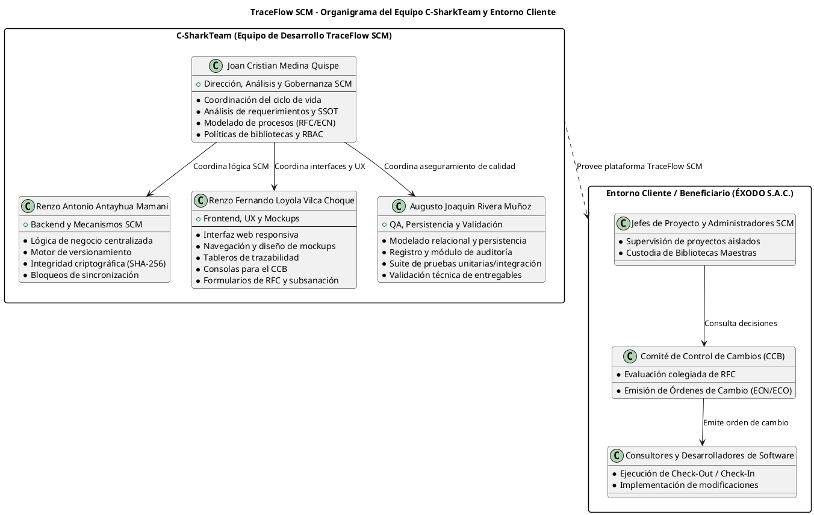
```plantuml
@startuml
skinparam shadowing false
skinparam roundcorner 8
skinparam defaultFontName Arial
skinparam packageStyle rectangle

title <b>TraceFlow SCM - Organigrama del Equipo C-SharkTeam y Entorno Cliente</b>

package "C-SharkTeam (Equipo de Desarrollo TraceFlow SCM)" as DEV {
    class "Joan Cristian Medina Quispe" as JCM {
        + Dirección, Análisis y Gobernanza SCM
        --
        * Coordinación del ciclo de vida
        * Análisis de requerimientos y SSOT
        * Modelado de procesos (RFC/ECN)
        * Políticas de bibliotecas y RBAC
    }

    class "Renzo Antonio Antayhua Mamani" as RAA {
        + Backend y Mecanismos SCM
        --
        * Lógica de negocio centralizada
        * Motor de versionamiento
        * Integridad criptográfica (SHA-256)
        * Bloqueos de sincronización
    }

    class "Renzo Fernando Loyola Vilca Choque" as RFL {
        + Frontend, UX y Mockups
        --
        * Interfaz web responsiva
        * Navegación y diseño de mockups
        * Tableros de trazabilidad
        * Consolas para el CCB
        * Formularios de RFC y subsanación
    }

    class "Augusto Joaquin Rivera Muñoz" as AJR {
        + QA, Persistencia y Validación
        --
        * Modelado relacional y persistencia
        * Registro y módulo de auditoría
        * Suite de pruebas unitarias/integración
        * Validación técnica de entregables
    }

    JCM --> RAA : Coordina lógica SCM
    JCM --> RFL : Coordina interfaces y UX
    JCM --> AJR : Coordina aseguramiento de calidad
}

package "Entorno Cliente / Beneficiario (ÉXODO S.A.C.)" as CLIENT {
    class "Jefes de Proyecto y Administradores SCM" as ADM {
        * Supervisión de proyectos aislados
        * Custodia de Bibliotecas Maestras
    }

    class "Comité de Control de Cambios (CCB)" as CCB {
        * Evaluación colegiada de RFC
        * Emisión de Órdenes de Cambio (ECN/ECO)
    }

    class "Consultores y Desarrolladores de Software" as DEV_CLI {
        * Ejecución de Check-Out / Check-In
        * Implementación de modificaciones
    }

    ADM --> CCB : Consulta decisiones
    CCB --> DEV_CLI : Emite orden de cambio
}

DEV ..> CLIENT : Provee plataforma TraceFlow SCM
@enduml
```

<!-- Página 8 del PDF original -->

Ingeniería de Frontend y Experiencia de Usuario (UI/UX): Liderada por Renzo Fernando Loyola Vilca Choque, responsable de la construcción de la interfaz web responsiva, tableros de control para la trazabilidad de cambios, consolas de gestión para el Comité de Control de Cambios (CCB) y formularios dinámicos para el registro y subsanación de solicitudes. Aseguramiento de la Calidad (QA), Auditoría y Persistencia: A cargo de Augusto Joaquin Rivera Muñoz, responsable del diseño y modelado de persistencia de datos relacionales, administración de esquemas de trazabilidad histórica, implementación del módulo de registro de auditoría de acciones del sistema y definición de la suite de pruebas unitarias y de integración. Entorno Cliente / Beneficiario (ÉXODO S.A.C.):Jefes de Proyecto y Administradores SCM: Supervisión de proyectos aislados y custodia de las Bibliotecas Maestras.Comité de Control de Cambios (CCB): Evaluación colegiada y emisión de Órdenes de Cambio.Consultores y Desarrolladores de Software: Usuarios operativos que ejecutan Check-Out/Check-In e implementan las modificaciones asignadas.

<!-- Página 9 del PDF original -->

# 3. Visionamiento de la Empresa

## 3.1. Descripción del Problema

Actualmente, ÉXODO S.A.C. gestiona el desarrollo de software para sus clientes sin un sistema formal de Gestión de la Configuración. El código fuente, la documentación y los artefactos de cada proyecto se encuentran dispersos entre los equipos de cómputo de los consultores y cuentas personales en distintas plataformas, sin un repositorio centralizado ni un estándar de identificación de versiones. Esta situación provoca la coexistencia de múltiples copias de un mismo componente sin un registro histórico confiable, generando conflictos al integrar el trabajo de distintos desarrolladores, pérdida de avances por sobreescritura de archivos y retrasos en la entrega de los proyectos comprometidos con los clientes. Asimismo, la ausencia de un flujo formal de control de cambios y de líneas base claramente definidas impide identificar con certeza qué versión de un producto se encuentra en producción, quién autorizó una modificación específica o cómo revertir un cambio que introdujo un defecto crítico, comprometiendo la calidad del servicio y la relación de confianza con los clientes de ÉXODO S.A.C.

<!-- Página 10 del PDF original -->

## 3.2. Objetivos de Negocios

### 3.2.1. Objetivo General de Negocio

Optimizar la calidad y la continuidad de los servicios de desarrollo de software que ÉXODO S.A.C. entrega a sus clientes, mediante la implementación de un sistema de gestión de configuración que reduzca los riesgos de pérdida de información y los costos asociados a la corrección de errores por versiones conflictivas.

### 3.2.2. Objetivos Específicos de Negocio

- Reducción de Retrabajo: Disminuir en un 25% el tiempo invertido por

los equipos de desarrollo en la resolución de conflictos de código y en la recuperación de archivos perdidos.

- Garantía de Integridad: Asegurar que el 100% de las versiones

entregadas a los clientes correspondan a versiones validadas y aprobadas mediante el flujo formal de control de cambios.

- Mejora de la Transparencia: Establecer una trazabilidad total que permita

identificar el origen, autor y justificación de cualquier cambio realizado en un proyecto en menos de 24 horas.

- Estandarización de Procesos: Unificar los flujos de trabajo de los

distintos equipos de proyecto de ÉXODO S.A.C. bajo una única política de control de cambios.

- Satisfacción del Cliente: Reducir en un 30% las incidencias relacionadas

con entregas de versiones incorrectas o no autorizadas al cliente.

## 3.3. Objetivos de Diseño

### 3.3.1. Objetivo General de Negocio

Definir la arquitectura lógica y funcional de TraceFlow SCM, un sistema robusto de gestión de configuración que centralice, proteja y organice los artefactos de software de los proyectos de ÉXODO S.A.C., asegurando una estructura escalable que facilite el control de cambios sin afectar la productividad de los equipos de desarrollo.

<!-- Página 11 del PDF original -->

### 3.3.2. Objetivos Específicos de Negocio

- Diseño de Repositorio Centralizado: Definir una estructura de

almacenamiento jerárquica que permita organizar el código fuente, la documentación técnica y los recursos de cada proyecto de cliente.

- Establecimiento de Líneas Base (Baselines): Diseñar mecanismos de

control para identificar y congelar versiones estables del software, garantizando puntos de recuperación confiables.

- Modelado del Flujo de Cambios: Estructurar un proceso formal de

solicitud, evaluación y aprobación de cambios que garantice que ninguna modificación sea integrada sin previa validación técnica.

- Definición de Roles y Permisos: Diseñar un esquema de seguridad

basado en roles que restrinja el acceso a los repositorios críticos y asegure que solo el personal autorizado libere versiones oficiales.

- Trazabilidad y Auditoría: Diseñar mecanismos de registro e integridad

que permitan reconstruir el historial completo de un elemento de configuración.

## 3.4. Alcance del proyecto

El presente proyecto abarca el análisis y definición funcional de TraceFlow SCM, un Sistema de Gestión de Configuración de Software diseñado específicamente para las necesidades de ÉXODO S.A.C. El alcance se centra en establecer las reglas, procesos y controles necesarios para administrar el ciclo de vida de los artefactos digitales de los proyectos de la empresa y de sus clientes.

### 3.4.1. Alcance Funcional

- Identificación de Elementos de Configuración (ECS): registro y

catalogación de los componentes de software (código fuente, documentación, esquemas de base de datos) de cada proyecto.

- Gestión de Versiones: mantenimiento de un historial completo de

cambios mediante operaciones de Check-in y Check-out, con posibilidad de retorno a estados anteriores.

<!-- Página 12 del PDF original -->

- Control de Cambios: flujo formal para solicitar, evaluar y aprobar

modificaciones antes de su integración al proyecto.

- Gestión de Líneas Base: funcionalidad para crear y congelar versiones

estables destinadas a la entrega o despliegue oficial al cliente.

- Gestión de Incidencias y Soporte: registro y seguimiento de incidencias

reportadas por los equipos internos o por los clientes.

- Generación de Reportes y Auditoría: emisión de informes sobre el estado

de la configuración y trazabilidad de las acciones realizadas.

### 3.4.2. Alcance No Funcional

- Seguridad y Acceso: restricción de permisos basada en roles

(Administrador SCM, Jefe de Proyecto, Desarrollador, QA, Auditor).

- Disponibilidad: el sistema debe operar con un tiempo de actividad

objetivo del 99.9% durante los periodos críticos de desarrollo y entrega.

- Integridad de Datos: garantía de que los artefactos almacenados no

sufran corrupciones durante transferencias, fusiones o respaldos.

- Escalabilidad: capacidad de soportar el crecimiento de la cartera de

proyectos de ÉXODO S.A.C. (más de 50 proyectos simultáneos).

- Usabilidad: curva de aprendizaje mínima para los nuevos consultores o

practicantes que se incorporen a los equipos de proyecto.

### 3.4.3. Alcance Tecnológico

- Arquitectura de Repositorios: análisis basado en sistemas de control de

versiones distribuidos (Git).

- Entornos de Desarrollo: compatibilidad con las herramientas utilizadas

por los equipos de ÉXODO S.A.C. (Visual Studio Code, IntelliJ IDEA, Android Studio).

- Integración: compatibilidad con herramientas de automatización de

compilación, pruebas y despliegue (CI/CD).

- Almacenamiento: evaluación de necesidades de almacenamiento en

servidores propios o servicios en la nube (GitHub, GitLab, Azure DevOps).

<!-- Página 13 del PDF original -->

### 3.4.4. Delimitación del Proyecto

- Delimitación Espacial: el proyecto se circunscribe a las áreas de

desarrollo y gestión de proyectos de ÉXODO S.A.C.

- Delimitación Temporal: el análisis abarca el ciclo académico

correspondiente al semestre 2026-II.

- Delimitación Social: el sistema está dirigido al personal de desarrollo,

jefes de proyecto, personal de control de calidad y auditores de ÉXODO S.A.C.

- Frontera Técnica: se excluye explícitamente el soporte de hardware, la

administración de redes externas y la gestión comercial o contable de la empresa.

## 3.5. Viabilidad del Sistema

La evaluación de viabilidad analiza la factibilidad técnica, económica,

**operativa, legal, social y ambiental del software antes de iniciar su construcción:**

1. Viabilidad Técnica

Infraestructura: ÉXODO S.A.C. cuenta con servidores propios y acceso a servicios en la nube, lo que facilita la implementación de un repositorio centralizado. Capacidad Técnica: los equipos de desarrollo manejan herramientas estándar de control de versiones (Git), por lo que la curva de aprendizaje para adoptar TraceFlow SCM es baja. Compatibilidad: es técnicamente viable integrar las políticas de control de cambios con los entornos de desarrollo actuales sin interrumpir los proyectos en curso.

2. Viabilidad Económica

El análisis financiero se calculó para un horizonte de evaluación a 5 años (2026-2030) con una tasa de descuento (COK) del 12.00%, considerando los costos reales de desarrollo asumidos por el equipo C-SharkTeam durante el

**semestre 2026-II:**

<!-- Página 14 del PDF original -->

**Tabla TB-02: Indicadores Financieros de Viabilidad Económica**

| Indicador Financiero | Valor Proyectado | Interpretación Técnica / Financiera |
| :--- | :--- | :--- |
| Inversión Inicial (CAPEX) | S/. 5,475.00 | Cubre 500 horas de desarrollo agregadas para el equipo C-SharkTeam (Joan Medina, Renzo Antayhua, Renzo Loyola y Augusto Rivera a razón referencial de S/. 9.00/hr; **PENDIENTE DE VALIDACIÓN DE ESFUERZO** individual), depreciación de equipos (3.5 meses), conectividad, dominio web e imprevistos. |
| Costo Operativo Anual (OPEX) | S/. 1,140.00 | Mantenimiento de infraestructura PaaS (Render/Supabase), renovación de dominio, soporte preventivo y materiales de difusión. |
| Valor Actual Neto (VAN) | +S/. 10,801.64 | Estrictamente positivo (VAN > 0), ratificando que el proyecto generará valor económico y retención institucional por encima de la tasa exigida (COK 12.00%). |
| Tasa Interna de Retorno (TIR) | 68.20% | Supera ampliamente el COK referencial (12.00%), otorgando un margen de seguridad amplio frente a variaciones de costos. |
| Relación Beneficio / Costo (B/C) | 1.97 | Por cada sol invertido en el ciclo del proyecto, se generarán S/. 1.97 en beneficios y ahorros valorizados para la facultad y los estudiantes. |
| Periodo de Recuperación (Payback) | 1 año y 9.7 meses | La inversión inicial se recuperará plenamente durante el transcurso del segundo año de operación. |
3. Viabilidad Operativa

Apoyo Institucional: existe respaldo de la Gerencia de Proyectos de ÉXODO S.A.C. para formalizar el control de sus activos digitales.

<!-- Página 15 del PDF original -->

Facilidad de Integración: el flujo propuesto se adapta a las rutinas actuales de los consultores, quienes percibirán el sistema como una herramienta de protección de su trabajo. Sostenibilidad: la definición de roles claros (Jefe de Proyecto, Desarrollador, QA, Auditor) permite que el sistema se mantenga vigente ante la rotación de personal.

4. Viabilidad Legal

1. Propiedad Intelectual y Derechos de Autor: de acuerdo con el Decreto

Legislativo N.° 822 (Ley sobre el Derecho de Autor), el software desarrollado por los consultores de ÉXODO S.A.C. en el ejercicio de sus funciones pertenece a la empresa o al cliente contratante según lo pactado contractualmente. TraceFlow SCM garantiza que dicha propiedad intelectual quede debidamente registrada, versionada y resguardada.

2. Protección de Datos Personales: el análisis del sistema considera el

cumplimiento de la Ley N.° 29733 (Ley de Protección de Datos Personales), dado que los proyectos gestionados por ÉXODO S.A.C. pueden incluir información sensible de los clientes finales, por lo que el acceso al código y a la documentación debe restringirse únicamente al personal autorizado.

3. Contratos con Clientes: el sistema apoya el cumplimiento de los acuerdos de

nivel de servicio (SLA) pactados con los clientes, al permitir demostrar mediante trazabilidad y auditoría qué versión fue entregada, cuándo y bajo qué aprobación.

4. Uso de Software y Licenciamiento: el análisis prioriza el uso de

herramientas bajo licencias de código abierto (GPL, MIT) para el control de versiones, evitando el uso de software no licenciado y mitigando riesgos de sanciones por infracción de derechos de autor.

<!-- Página 16 del PDF original -->

5. Viabilidad Social

1. Optimización de Recursos de Hardware: la centralización del desarrollo en

repositorios institucionales evita la necesidad de adquirir nuevo hardware, extendiendo la vida útil de los equipos actuales.

2. Reducción de la Huella de Carbono Digital: un flujo de trabajo ordenado

reduce compilaciones fallidas y procesos redundantes, disminuyendo el consumo energético de los servidores.

3. Digitalización y Cero Papel: la automatización de solicitudes de cambio,

actas y reportes elimina la necesidad de documentación impresa.

4. Promoción del Trabajo Remoto: un sistema de configuración robusto

facilita el trabajo colaborativo a distancia entre los equipos de ÉXODO S.A.C. y sus clientes, reduciendo desplazamientos innecesarios.

5. Viabilidad Ambiental

<!-- PENDIENTE DE VALIDACION: La Viabilidad Ambiental duplica literalmente los cuatro puntos de la Viabilidad Social. Pendiente de redacción técnica diferenciada enfocada en métricas energéticas y de centros de datos en la nube. -->

1. Optimización de Recursos de Hardware: la centralización del desarrollo en

repositorios institucionales evita la necesidad de adquirir nuevo hardware, extendiendo la vida útil de los equipos actuales.

2. Reducción de la Huella de Carbono Digital: un flujo de trabajo ordenado

reduce compilaciones fallidas y procesos redundantes, disminuyendo el consumo energético de los servidores.

3. Digitalización y Cero Papel: la automatización de solicitudes de cambio, actas

y reportes elimina la necesidad de documentación impresa.

4. Promoción del Trabajo Remoto: un sistema de configuración robusto facilita

el trabajo colaborativo a distancia entre los equipos de ÉXODO S.A.C. y sus clientes, reduciendo desplazamientos innecesarios.

<!-- Página 17 del PDF original -->

## 3.6. Información obtenida del Levantamiento de Información

# 1. Diagnóstico de la Situación Actual:

- Almacenamiento: el código de los proyectos está disperso en equipos

locales y cuentas personales, sin un repositorio institucional centralizado.

- Control de Versiones: es inexistente o empírico; se emplean nombres de

carpetas (por ejemplo, “Proyecto_Cliente_Final_v2”) en lugar de un estándar de versionamiento.

- Flujo de Cambios: las modificaciones se coordinan de forma verbal o por

chat, sin registro de quién, cuándo o por qué se alteró un componente.

- Sincronización: existe un alto índice de pérdida de avances por

sobreescritura de archivos al trabajar varios consultores en un mismo proyecto.

# 2. Necesidades Identificadas (Requerimiento)

**Cuadro de Necesidades Identificadas**

**Tabla TB-03: Cuadro de Necesidades Identificadas**

| Área | Problema Detectado | Requerimiento del Sistema |
| :--- | :--- | :--- |
| Código | Pérdida de fuentes | Repositorio centralizado y seguro. |
| Cambios | Modificaciones arbitrarias | Flujo de aprobación (Solicitudes de Cambio). |
| Versiones | Confusión sobre la versión vigente | Etiquetado de Líneas Base (Baselines). |
| Auditoría | No se identifica al responsable de una falla | Registro de auditoría y trazabilidad total. |
| Entregas | Entregas al cliente sin validación previa | Aprobación formal antes de la liberación. |
Nota: Elaboración Propia

<!-- Página 18 del PDF original -->

# 4. Análisis de Procesos

## 4.1. Diagrama del Proceso Actual - Diagrama de actividades

El proceso actual es empírico y desorganizado, pues el código reside en equipos personales sin estándares de versionamiento. La integración se realiza por medios informales (correo, chat, USB), lo que provoca pérdida de avances por sobreescritura. Al no existir líneas base, ante una falla en producción no es posible identificar ni recuperar de forma inmediata una versión estable anterior, afectando la calidad del servicio entregado a los clientes de ÉXODO S.A.C.

**Diagrama de Actividades del Proceso Actual**

Nota: Elaboración Propia

**Diagrama DG-02: Diagrama de Actividades del Proceso Actual (AS-IS)**

#### Código PlantUML del Diagrama

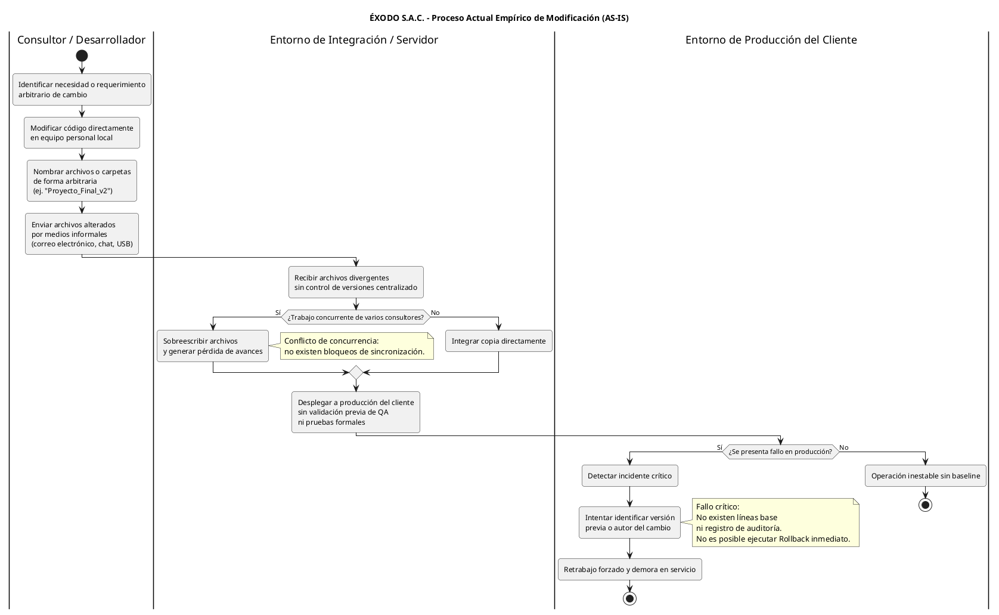
```plantuml
@startuml
skinparam shadowing false
skinparam roundcorner 8
skinparam defaultFontName Arial
skinparam ActivityMaxWidth 220
skinparam conditionStyle inside

title <b>ÉXODO S.A.C. - Proceso Actual Empírico de Modificación (AS-IS)</b>

|Consultor / Desarrollador|
start
:Identificar necesidad o requerimiento
arbitrario de cambio;

:Modificar código directamente
en equipo personal local;

:Nombrar archivos o carpetas
de forma arbitraria
(ej. "Proyecto_Final_v2");

:Enviar archivos alterados
por medios informales
(correo electrónico, chat, USB);

|Entorno de Integración / Servidor|
:Recibir archivos divergentes
sin control de versiones centralizado;

if (¿Trabajo concurrente de varios consultores?) then (Sí)
    :Sobreescribir archivos
    y generar pérdida de avances;
    note right
        Conflicto de concurrencia:
        no existen bloqueos de sincronización.
    end note
else (No)
    :Integrar copia directamente;
endif

:Desplegar a producción del cliente
sin validación previa de QA
ni pruebas formales;

|Entorno de Producción del Cliente|
if (¿Se presenta fallo en producción?) then (Sí)
    :Detectar incidente crítico;
    
    :Intentar identificar versión
    previa o autor del cambio;
    
    note right
        Fallo crítico:
        No existen líneas base
        ni registro de auditoría.
        No es posible ejecutar Rollback inmediato.
    end note
    
    :Retrabajo forzado y demora en servicio;
    stop
else (No)
    :Operación inestable sin baseline;
    stop
endif
@enduml
```

<!-- Página 19 del PDF original -->

## 4.2. Diagrama del Proceso Propuesto - Diagrama de actividades Inicial

El proceso propuesto (TO-BE v2) formaliza el ciclo de vida completo de una Solicitud de Cambio (RFC) mediante siete roles especializados estructurados en diez fases operativas. El Solicitante identifica la necesidad de cambio y registra la RFC indicando justificación, prioridad y ECS afectado (CU-04). El Analista de Requerimientos / Gestor recepciona la solicitud, valida que la información esté completa y sea consistente (CU-05); si presenta omisiones se abre un ciclo de subsanación y, de no subsanarse o resultar inviable, la solicitud concluye en el estado terminal **Desestimada**. Una vez clasificada, el Arquitecto / Especialista Técnico elabora el Informe Técnico de Impacto (CU-06) evaluando exhaustivamente la afectación a la Triple Restricción (alcance, tiempo y costo). Si el cambio no afecta ninguna dimensión de la triple restricción, se clasifica como **Cambio Menor** y se canaliza hacia la Autoridad Operativa Delegada compartida entre el Analista de Requerimientos y el Arquitecto (CU-30); si afecta al menos una dimensión, se clasifica como **Cambio Mayor** y se eleva a evaluación colegiada del Comité de Control de Cambios (CCB) (CU-07). Si la evaluación resulta desfavorable por motivos técnicos o administrativos, la RFC pasa al estado terminal **Rechazada** con notificación motivada al solicitante. Si el cambio es autorizado por la autoridad correspondiente, pasa al estado **Autorizada** y se formaliza mediante la emisión obligatoria de una Orden de Cambio (ECN/ECO) (CU-08), la cual puede ser emitida por el CCB (Cambios Mayores) o bajo autoridad operativa delegada (Cambios Menores), pasando al estado **Orden Emitida**.

Con la ECN/ECO formalmente vigente, el Administrador de Configuración / Bibliotecario verifica su validez y efectúa el Check-Out del ECS desde la Biblioteca de Soporte hacia la Biblioteca de Trabajo (CU-10), aplicando un bloqueo de sincronización exclusivo que evita sobreescrituras concurrentes (CU-11), situando la RFC en estado **En Implementación**. El Ingeniero de Software / Desarrollador ejecuta las modificaciones autorizadas (CU-14) y valida sus cambios mediante pruebas unitarias locales (CU-15). Concluidas las pruebas unitarias, el ECS modificado se remite al Equipo de Calidad / Testing situando la RFC en estado **En Pruebas** para la ejecución de pruebas de integración y validación técnica funcional (CU-16). Si se presentan no conformidades, se reportan los defectos (CU-18) para su corrección y re-testeo (CU-19); de subsistir fallos técnicos no subsanables, el Administrador ejecuta el Rollback en la Biblioteca de Trabajo (CU-21), libera los bloqueos y cancela la orden de cambio (CU-22), derivando al estado terminal **Cancelada**. Si la validación de QA es satisfactoria, se emite la Certificación Técnica de Conformidad (CU-17) y el cambio se pone a disposición del Solicitante / Usuario Final en estado **En Aceptación**. El Solicitante ejecuta las pruebas de aceptación de usuario (UAT) (CU-29) y, tras validar plenamente el comportamiento y la cobertura de la necesidad, suscribe el acta de aceptación formal. Con la doble validación superada (Certificación QA y Aceptación UAT), el Administrador de Configuración realiza el Check-In del ECS hacia la Biblioteca Maestra y de Soporte (CU-12), registra la nueva versión unívoca, crea y congela una nueva Línea Base (CU-20), libera el bloqueo de sincronización y actualiza el inventario. Finalmente, el CCB registra el cierre administrativo formal del cambio y consolida la trazabilidad integral (RF-14), alcanzando el estado terminal **Implementada** y notificando formalmente al Solicitante y a los interesados.

<!-- Página 20 del PDF original -->

**Diagrama DG-03: Proceso de Gestión de Cambios de Elementos de Configuración (TO-BE v2)**

#### Código PlantUML del Diagrama

```plantuml
@startuml
title <b>TraceFlow SCM - Proceso de Gestión de Cambios de Elementos de Configuración (TO-BE v2)</b>

' =========================================================
' CONFIGURACIÓN GENERAL
' =========================================================
skinparam ActivityMaxWidth 220
skinparam ranksep 22
skinparam nodesep 18
skinparam defaultFontName Arial
skinparam defaultFontSize 11
skinparam roundCorner 8
skinparam shadowing false
skinparam conditionStyle inside

skinparam arrowColor #2C3E50
skinparam arrowThickness 1.2
skinparam swimlaneBorderColor #7F8C8D
skinparam swimlaneBorderThickness 1.2

skinparam activity {
    BackgroundColor #FFFFFF
    BorderColor #34495E
    BorderThickness 1.2
    FontColor #2C3E50
}

skinparam note {
    BackgroundColor #FFFDE7
    BorderColor #FBC02D
    FontSize 10
}

' =========================================================
' ACTORES / SWIMLANES CANÓNICOS
' =========================================================
|#E8F4F8|Solicitante|
|#EBF5FB|Analista de Requerimientos / Gestor|
|#E8F8F5|Arquitecto / Especialista Técnico|
|#FEF9E7|Comité de Control de Cambios (CCB)|
|#F5EEF8|Administrador de Configuración / Bibliotecario|
|#EAEDED|Ingeniero de Software / Desarrollador|
|#FDEDEC|Equipo de Calidad / Testing|

' =========================================================
' FASE 1 - REGISTRO DE LA RFC
' =========================================================
|Solicitante|
start
:<color:white><b>FASE 1
Registro de Solicitud de Cambio (RFC)</b></color>; <<#34495E>>

:Identificar necesidad o defecto;

:Registrar RFC con justificación,
prioridad y ECS afectado (CU-04);

note left
<b>RFC [Estado: Registrada]</b>
- Descripción de necesidad
- Justificación de negocio
- Nivel de prioridad inicial
- ECS y versión base afectada
end note

' =========================================================
' FASE 2 - VALIDACIÓN Y CLASIFICACIÓN INICIAL
' =========================================================
|Analista de Requerimientos / Gestor|
:<color:white><b>FASE 2
Validación y Clasificación Inicial</b></color>; <<#34495E>>

:Recepcionar y evaluar completitud
de la RFC (CU-05);

if (¿Información suficiente y consistente?) then (No)
    :Registrar observaciones (CU-05);
    note right: RFC pasa a [En Subsanación]

    |Solicitante|
    if (¿Solicitante subsana dentro del plazo?) then (Sí)
        :Subsanar información requerida;
        |Analista de Requerimientos / Gestor|
        :Reevaluar información subsanada;
    else (No)
        |Analista de Requerimientos / Gestor|
        :Emitir dictamen de no conformidad
        inicial y desestimar solicitud;
        
        |Solicitante|
        :Recibir notificación de desestimación;
        note left
            <b>Estado Terminal 1:</b>
            <b>DESESTIMADA</b>
            (Filtro inicial no superado)
        end note
        stop
    endif
endif

|Analista de Requerimientos / Gestor|
:Validar consistencia de la RFC;
note right: RFC pasa a [Clasificada]

' =========================================================
' FASE 3 - ANÁLISIS DE IMPACTO TÉCNICO
' =========================================================
|Arquitecto / Especialista Técnico|
:<color:white><b>FASE 3
Análisis de Impacto Técnico</b></color>; <<#34495E>>
note right: RFC pasa a [En Análisis Técnico]

:Analizar impacto sobre arquitectura,
dependencias y trazabilidad (CU-06);

:Evaluar afectación a la Triple Restricción
(Alcance, Tiempo y Costo);

:Elaborar Informe Técnico de Impacto (CU-06);

if (¿Afecta alcance, tiempo o costo?) then (Sí)
    :Clasificar como <b>CAMBIO MAYOR</b>;
    note right
        <b>Criterio Normativo:</b>
        Afecta al menos 1 dimensión
        de la Triple Restricción.
        Requiere aprobación del CCB.
    end note
    
    ' =========================================================
    ' FASE 4A - EVALUACIÓN COLEGIADA CCB (CAMBIO MAYOR)
    ' =========================================================
    |Comité de Control de Cambios (CCB)|
    :<color:white><b>FASE 4A
Evaluación Colegiada en CCB (Cambio Mayor)</b></color>; <<#34495E>>
    note right: RFC pasa a [En Evaluación]

    :Evaluar Informe Técnico, riesgos,
    viabilidad y conveniencia (CU-07);

    if (¿Cambio Mayor Aprobado por CCB?) then (Sí)
        :Aprobar formalmente el cambio (CU-07);
        note right: RFC pasa a [Autorizada]

        :Emitir Orden de Cambio
        formal (ECN / ECO) (CU-08);
        note right: RFC pasa a [Orden Emitida]
    else (No)
        :Registrar dictamen formal
        de rechazo (técnico o de gestión);

        |Solicitante|
        :Recibir notificación con fundamentación;
        note left
            <b>Estado Terminal 2:</b>
            <b>RECHAZADA</b>
            (Dictamen formal negativo del CCB)
        end note
        stop
    endif

else (No)
    :Clasificar como <b>CAMBIO MENOR</b>;
    note right
        <b>Criterio Normativo:</b>
        NO afecta alcance, tiempo ni costo.
        Ruta operativa delegada sin CCB.
    end note

    ' =========================================================
    ' FASE 4B - AUTORIZACIÓN OPERATIVA DELEGADA (CAMBIO MENOR)
    ' =========================================================
    |Analista de Requerimientos / Gestor|
    :<color:white><b>FASE 4B
Autorización Operativa Delegada (Cambio Menor)</b></color>; <<#34495E>>
    note right: RFC pasa a [En Evaluación]

    :Revisar impacto operativo del Cambio Menor (CU-30);

    |Arquitecto / Especialista Técnico|
    :Revisar viabilidad técnica del Cambio Menor (CU-30);

    if (¿Conformidad de ambas autoridades delegadas?) then (Sí)
        :Autorizar Cambio Menor conjuntamente (CU-30);
        note right: RFC pasa a [Autorizada]

        :Emitir Orden de Cambio (ECN/ECO)
        bajo autoridad operativa delegada (CU-08/CU-30);
        note right: RFC pasa a [Orden Emitida]
    else (No)
        :Registrar dictamen de no autorización;

        |Solicitante|
        :Recibir notificación de rechazo operativo;
        note left
            <b>Estado Terminal 2:</b>
            <b>RECHAZADA</b>
            (Rechazo bajo autoridad delegada)
        end note
        stop
    endif
endif

' =========================================================
' FASE 5 - CHECK-OUT Y CONTROL DE CONCURRENCIA
' =========================================================
|Administrador de Configuración / Bibliotecario|
:<color:white><b>FASE 5
Check-Out y Bloqueo de Sincronización</b></color>; <<#34495E>>

:Verificar validez formal de la ECN/ECO;

:Efectuar Check-Out del ECS desde
Biblioteca de Soporte hacia Trabajo (CU-10);

:Aplicar bloqueo de sincronización
exclusivo sobre el ECS (CU-11);
note right: RFC pasa a [En Implementación]

' =========================================================
' FASE 6 - IMPLEMENTACIÓN Y PRUEBAS UNITARIAS
' =========================================================
|Ingeniero de Software / Desarrollador|
:<color:white><b>FASE 6
Implementación y Pruebas Unitarias</b></color>; <<#34495E>>

:Recibir ECN/ECO y espacio en
Biblioteca de Trabajo;

:Modificar ECS según especificación (CU-14);

:Ejecutar pruebas unitarias locales (CU-15);

if (¿Pruebas unitarias conformes?) then (No)
    :Corregir defectos en código local;
    :Reejecutar pruebas unitarias locales;
endif

:Poner ECS a disposición para validación QA;

' =========================================================
' FASE 7 - VALIDACIÓN TÉCNICA DE CALIDAD (QA)
' =========================================================
|Equipo de Calidad / Testing|
:<color:white><b>FASE 7
Validación Técnica de Calidad (QA)</b></color>; <<#34495E>>
note right: RFC pasa a [En Pruebas]

:Ejecutar pruebas de integración
y verificación técnica funcional (CU-16);

if (¿Defectos o no conformidades identificadas?) then (Sí)
    :Registrar reporte de no conformidad (CU-18);

    |Ingeniero de Software / Desarrollador|
    :Corregir defectos reportados;

    |Equipo de Calidad / Testing|
    :Reevaluar y re-testear (CU-19);

    if (¿Fallo técnico no subsanado?) then (Sí)
        |Administrador de Configuración / Bibliotecario|
        :Ejecutar Rollback en Biblioteca de Trabajo (CU-21);
        :Liberar bloqueo de sincronización;
        :Cancelar Orden de Cambio (ECN/ECO) (CU-22);

        |Solicitante|
        :Recibir notificación de cancelación;
        note left
            <b>Estado Terminal 3:</b>
            <b>CANCELADA</b>
            (Rollback por fallo no subsanado)
        end note
        stop
    endif
endif

|Equipo de Calidad / Testing|
:Emitir Certificación Técnica
de Conformidad (CU-17);

' =========================================================
' FASE 8 - VALIDACIÓN Y ACEPTACIÓN POR EL USUARIO (UAT)
' =========================================================
|Solicitante|
:<color:white><b>FASE 8
Validación y Aceptación por el Usuario (UAT)</b></color>; <<#34495E>>
note left: RFC pasa a [En Aceptación]

:Ejecutar pruebas de aceptación en
entorno de validación (CU-29);

if (¿Comportamiento y necesidad plenamente conformes?) then (No)
    :Registrar observaciones de aceptación;
    |Ingeniero de Software / Desarrollador|
    :Ajustar implementación según observaciones;
    |Equipo de Calidad / Testing|
    :Revalidar técnicamente la corrección;
    |Solicitante|
    :Reejecutar pruebas de aceptación (CU-29);
endif

:Emitir y suscribir Aceptación
Formal del Usuario (CU-29);

' =========================================================
' FASE 9 - CHECK-IN, LÍNEA BASE Y DESBLOQUEO
' =========================================================
|Administrador de Configuración / Bibliotecario|
:<color:white><b>FASE 9
Check-In, Nueva Línea Base y Desbloqueo</b></color>; <<#34495E>>

:Verificar Certificación QA y Aceptación UAT;

:Efectuar Check-In del ECS hacia
Biblioteca Maestra y de Soporte (CU-12);

:Registrar nueva versión identificada unívocamente;

:Crear y congelar nueva Línea Base (CU-20);

:Liberar bloqueo de sincronización del ECS;

:Actualizar catálogo e inventario de configuración;

' =========================================================
' FASE 10 - CIERRE FORMAL Y NOTIFICACIÓN
' =========================================================
|Comité de Control de Cambios (CCB)|
:<color:white><b>FASE 10
Cierre Formal Administrativo</b></color>; <<#34495E>>

:Registrar cierre administrativo formal (RF-14);

:Consolidar trazabilidad completa
(RFC - ECN/ECO - ECS - QA - UAT - Baseline);

|Solicitante|
:Recibir notificación de cambio implementado y cerrado;

note left
    <b>Estado Terminal 4:</b>
    <b>IMPLEMENTADA</b>
    (Cambio validado, promovido a Maestra,
    congelado en Baseline y cerrado formalmente)
end note

stop
@enduml
```

<!-- Página 22 del PDF original -->

# 5. Especificación de Requerimientos de Software

## 5.1. Cuadro de Requerimientos Funcionales

A continuación se detalla el cuadro de Requerimientos Funcionales (RF-01 a RF-18) de TraceFlow SCM, elaborado a partir del levantamiento de información y de los escenarios de caso de uso descritos previamente. Cada requerimiento especifica el módulo funcional al que pertenece, una descripción de la capacidad que el sistema debe ofrecer y su nivel de prioridad, sirviendo como base para la definición de los casos de uso y del alcance de la implementación.

**Tabla: Cuadro de Requerimientos Funcionales**

**Tabla TB-04: Cuadro de Requerimientos Funcionales (RF-01 a RF-18)**

| ID | Requerimiento Funcional | Descripción | Prioridad |
| :--- | :--- | :--- | :--- |
| RF-01 | Gestión de Usuarios y Roles | El sistema debe permitir registrar usuarios y asignar los roles del flujo de cambios (Solicitante, Analista de Requerimientos/Gestor, Arquitecto/Especialista Técnico, CCB, Administrador de Configuración/Bibliotecario, Ingeniero de Software/Desarrollador, Equipo de Calidad/Testing), restringiendo las acciones disponibles según el rol. | Alta |
| RF-02 | Gestión de Proyectos | El sistema debe permitir crear y administrar múltiples proyectos de clientes de ÉXODO S.A.C. de forma aislada entre sí. | Alta |
| RF-03 | Identificación de ECS | El sistema debe permitir registrar y clasificar los Elementos de Configuración (código, documentos, esquemas de BD) de cada proyecto. | Alta |
| RF-04 | Registro de Solicitudes de Cambio (RFC) | El sistema debe permitir al Solicitante registrar una Solicitud de Cambio indicando descripción, justificación, prioridad, ECS afectado y fecha, y permitir su subsanación cuando la información esté incompleta. | Alta |
| RF-05 | Clasificación y Análisis de Impacto | El sistema debe permitir al Arquitecto/Especialista Técnico registrar el análisis de impacto técnico (arquitectura, dependencias, riesgos, esfuerzo, tiempo y costo), evaluando la afectación de la Triple Restricción para emitir el dictamen formal de clasificación en Cambio Menor o Cambio Mayor. | Alta |
| RF-06 | Evaluación y Aprobación de Cambios Mayores por el CCB | El sistema debe permitir al Comité de Control de Cambios (CCB) evaluar colegiadamente las solicitudes clasificadas como Cambios Mayores, deliberar sobre su viabilidad técnica y de gestión, registrar la votación y aprobarlas o rechazarlas fundamentando las causales en acta formal. | Alta |
| RF-07 | Gestión y Emisión de Órdenes de Cambio (ECN/ECO) | El sistema debe permitir generar y formalizar la Orden de Cambio (ECN/ECO) una vez autorizada la solicitud, sea mediante resolución colegiada del CCB para Cambios Mayores o mediante autoridad operativa delegada compartida (Analista de Requerimientos/Gestor y Arquitecto/Especialista Técnico) para Cambios Menores, actualizando el plan del proyecto asociado. | Media |
| RF-08 | Gestión de Bibliotecas de Software | El sistema debe administrar al menos tres bibliotecas por proyecto (Biblioteca de Trabajo, Biblioteca de Soporte y Biblioteca Maestra), permitiendo mover un ECS entre ellas mediante operaciones de Check-Out y Check-In. | Alta |
| RF-09 | Control de Versiones y Bloqueos de Sincronización | El sistema debe registrar cada Check-in/Check-out de un ECS con autor, fecha y descripción del cambio, y aplicar/liberar bloqueos de sincronización que impidan la edición concurrente del mismo ECS en la Biblioteca de Trabajo. | Alta |
| RF-10 | Gestión de Pruebas, Certificación QA y Aceptación del Usuario | El sistema debe permitir al Equipo de Calidad registrar los resultados de pruebas de integración y validación funcional emitiendo la Certificación de Conformidad técnica, y permitir al Solicitante/Usuario Final registrar las pruebas de aceptación y suscribir el Acta de Aceptación formal en el entorno controlado de validación previo a la liberación. | Alta |
| RF-11 | Reevaluación y Re-testeo | El sistema debe permitir registrar ciclos de corrección de defectos y re-testeo sobre un cambio no conforme, hasta su certificación o hasta agotar los reintentos permitidos. | Media |
| RF-12 | Rollback y Cancelación de Órdenes de Cambio | El sistema debe permitir al Administrador de Configuración ejecutar un rollback del ECS en la Biblioteca de Trabajo y cancelar la Orden de Cambio cuando el re-test no sea superado exitosamente o ante rechazo formal insubsanable en la aceptación del usuario. | Alta |
| RF-13 | Gestión de Líneas Base | El sistema debe permitir crear y congelar líneas base a partir de un ECS verificado al momento del Check-In a la Biblioteca Maestra/Soporte, registrando la versión resultante tras contar con la certificación de QA y la aceptación del usuario. | Alta |
| RF-14 | Cierre Formal del Cambio y Notificaciones | El sistema debe registrar el cierre formal de una Solicitud de Cambio bajo uno de cuatro estados terminales mutuamente excluyentes (Cerrado – Implementado, Rechazado Técnico, Rechazado Administrativo o Cancelado – Fallo No Subsanado), consolidar la trazabilidad completa del expediente y notificar formalmente al Solicitante y a las partes interesadas. | Alta |
| RF-15 | Gestión de Incidencias y Soporte | El sistema debe permitir registrar, dar seguimiento y derivar incidencias reportadas por consultores o clientes hacia una nueva Solicitud de Cambio. | Media |
| RF-16 | Trazabilidad de Configuración | El sistema debe permitir visualizar las relaciones entre los ECS, las Solicitudes de Cambio, las Órdenes de Cambio y las líneas base a lo largo del tiempo. | Alta |
| RF-17 | Auditoría e Integridad | El sistema debe registrar las acciones críticas de los usuarios en cada etapa del flujo y validar la integridad de los artefactos mediante checksums (SHA-256). | Alta |
| RF-18 | Generación de Reportes | El sistema debe permitir generar reportes de estado del flujo de cambios, inventario de ECS y actas de cambios, con posibilidad de exportación. | Media |

## 5.2. Cuadro de Requerimientos No funcionales

El siguiente cuadro presenta los Requerimientos No Funcionales (RNF-01 a RNF-09) que establecen los atributos de calidad exigidos a TraceFlow SCM, tales como seguridad, disponibilidad, integridad, usabilidad, escalabilidad, rendimiento, compatibilidad, mantenibilidad y respaldo. Estos requerimientos condicionan las decisiones de arquitectura y diseño técnico que se adoptarán en las siguientes fases del proyecto, y se derivan directamente de los objetivos de negocio y de diseño planteados por ÉXODO S.A.C.

**Tabla: Cuadro de Requerimientos No Funcionales**

**Tabla TB-05: Cuadro de Requerimientos No Funcionales (RNF-01 a RNF-09)**

| ID | Atributo de Calidad | Descripción | Prioridad |
| :--- | :--- | :--- | :--- |
| RNF-01 | Seguridad | El sistema debe utilizar protocolos de transferencia segura (HTTPS/SSH) y control de acceso basado en roles (RBAC). | Alta |
| RNF-02 | Disponibilidad | El sistema debe garantizar un tiempo de actividad (uptime) del 99.9% durante los periodos críticos de proyecto. | Alta |
| RNF-03 | Integridad | El sistema debe verificar la integridad de los artefactos almacenados mediante checksums (SHA-256). | Alta |
| RNF-04 | Usabilidad | La interfaz debe permitir que un nuevo consultor se familiarice con el flujo de trabajo en menos de 3 horas. | Media |
| RNF-05 | Escalabilidad | El sistema debe soportar más de 50 proyectos simultáneos sin degradar el rendimiento de las operaciones. | Media |
| RNF-06 | Rendimiento | Las operaciones de consulta de historial o comparación de versiones no deben exceder los 3 segundos de respuesta. | Baja |
| RNF-07 | Compatibilidad | El sistema debe ser compatible con entornos de desarrollo de uso común (Visual Studio Code, IntelliJ IDEA, Android Studio). | Alta |
| RNF-08 | Mantenibilidad | La arquitectura debe permitir actualizaciones y parches sin requerir la detención total del servicio. | Media |
| RNF-09 | Respaldo | El sistema debe programar copias de seguridad automáticas diarias del repositorio central. | Alta |
Nota: Elaboración Propia

<!-- Página 25 del PDF original -->

## 5.3. Reglas de Negocio

Las Reglas de Negocio (RN-01 a RN-09) formalizan las políticas y restricciones que TraceFlow SCM debe hacer cumplir de manera obligatoria dentro del flujo de gestión de configuración, tales como la aprobación previa del CCB, la identificación unívoca de versiones, el bloqueo de sincronización y la validación de QA antes de integrar un ECS a la Biblioteca Maestra. Cada regla identifica la autoridad responsable de su cumplimiento y la situación problemática que motivó su definición, evidenciando la trazabilidad entre el diagnóstico inicial de ÉXODO S.A.C. y las restricciones incorporadas al sistema.

**Cuadro de las Reglas de Negocio**

**Tabla TB-06: Cuadro de Reglas de Negocio (RN-01 a RN-09)**

<!-- PENDIENTE DE VALIDACION: La autoridad asignada a RN-03 en el SRS original es Analista de Requerimientos / Gestor, pero la operación de Check-In con ECN es ejecutada operativamente por el Administrador de Configuración / Bibliotecario. -->

| ID | Nombre de la Regla | Descripción | Autoridad | Situación Actual (Problemática) |
| :--- | :--- | :--- | :--- | :--- |
| RN-01 | Aprobación Obligatoria Previa a Modificación e Integración | Ningún ECS puede ser modificado ni transferido a la Biblioteca de Trabajo sin una Orden de Cambio (ECN/ECO) emitida formalmente por el CCB (para Cambios Mayores) o bajo autoridad operativa delegada compartida entre el Analista de Requerimientos/Gestor y el Arquitecto/Especialista Técnico (para Cambios Menores). Asimismo, la integración definitiva a la Biblioteca Maestra exige las debidas certificaciones de calidad y aceptación del usuario. | Comité de Control de Cambios (CCB) / Autoridad Operativa Delegada | Se modificaban e integraban cambios directamente sin autorización formal. |
| RN-02 | Identificación Unívoca de Versiones | Toda línea base establecida tras un Check-In a la Biblioteca Maestra debe estar identificada con un estándar de versionamiento (mayor.menor.parche). | Administrador de Configuración / Bibliotecario | Se usaban nombres de carpetas y archivos comprimidos con nombres arbitrarios. |
| RN-03 | Trazabilidad de Cambios | Todo Check-in registrado debe incluir un mensaje descriptivo y estar asociado a una Orden de Cambio (ECN/ECO) previamente emitida. | Analista de Requerimientos / Gestor *(ver nota en Inconsistencias)* | No existía registro de quién ni por qué se modificaba el código. |
| RN-04 | Restricción de Bibliotecas Congeladas | Un ECS almacenado en la Biblioteca Maestra no puede modificarse directamente; cualquier corrección exige un nuevo ciclo completo de RFC, Check-Out y Check-In. | Administrador de Configuración / Bibliotecario | Los consultores editaban directamente los archivos entregados al cliente. |
| RN-05 | Evaluación Técnica y Clasificación Obligatoria | Ninguna Solicitud de Cambio puede ser autorizada (por vía delegada o por el CCB) sin contar previamente con un Informe Técnico de Impacto elaborado por el Arquitecto/Especialista Técnico que evalúe arquitectura, dependencias, riesgos y el impacto sobre la Triple Restricción (alcance, tiempo y costo), dictaminando si clasifica como Cambio Menor o Mayor. | Arquitecto / Especialista Técnico | Los cambios se aprobaban sin análisis técnico documentado ni evaluación de impacto en la triple restricción. |
| RN-06 | Bloqueo de Sincronización Obligatorio | Todo ECS que ingresa a la Biblioteca de Trabajo mediante Check-Out debe quedar bloqueado para otros usuarios hasta su Check-In o rollback. | Administrador de Configuración / Bibliotecario | Varios consultores editaban el mismo archivo de forma simultánea, generando sobreescrituras. |
| RN-07 | Diferenciación de Resultados Formales de Cierre | Toda Solicitud de Cambio debe cerrarse formalmente bajo uno de cuatro resultados terminales y mutuamente excluyentes: Cerrado – Implementado (Check-In y Línea Base conformes tras QA y UAT), Rechazado Técnico (inviabilidad dictaminada por el CCB), Rechazado Administrativo (decisión del CCB o de la autoridad delegada por alcance/costo/prioridad) o Cancelado por Fallo No Subsanado (fallo en re-test de QA o rechazo insubsanable en UAT con rollback ejecutado). | Comité de Control de Cambios (CCB) / Autoridad Operativa Delegada / Administrador de Configuración | No existía distinción formal entre los motivos de cierre ni cobertura para el cierre exitoso. |
| RN-08 | Reversión Obligatoria ante Fallo No Subsanado | Si el re-test posterior a una corrección no es superado exitosamente, o si se formula rechazo insubsanable en la aceptación del usuario, el Administrador de Configuración debe ejecutar un rollback del ECS en la Biblioteca de Trabajo antes de cancelar la Orden de Cambio. | Administrador de Configuración / Bibliotecario | El código con errores permanecía en el entorno de trabajo sin reversión formal. |
| RN-09 | Doble Validación Previa al Check-In a Biblioteca Maestra | Ningún ECS modificado puede ser transferido a la Biblioteca Maestra ni congelado en una nueva Línea Base sin contar concurrentemente con la Certificación de Conformidad técnica emitida por el Equipo de Calidad/Testing y el Acta de Aceptación formal suscrita por el Solicitante/Usuario Final en el entorno controlado de validación previo a la liberación. | Equipo de Calidad / Testing y Solicitante / Usuario Final | El código se integraba y entregaba al cliente sin pruebas formales ni aceptación documentada. |

Nota: Elaboración Propia

**Estados del Ciclo de Vida de una Solicitud de Cambio**

En concordancia con el flujo de gestión de cambios adoptado por TraceFlow

**SCM, toda Solicitud de Cambio transita por los siguientes estados principales:**

**Tabla TB-07: Estados Oficiales del Ciclo de Vida de una RFC**

| N.º | Nombre del Estado | Actor / Responsable Principal | Tipo de Estado | Descripción y Criterio de Transición |
| :---: | :--- | :--- | :--- | :--- |
| 1 | **Registrada** | Solicitante | Inicial | La Solicitud de Cambio (RFC) ha sido creada y registrada en el sistema mediante CU-04, quedando pendiente de revisión inicial de completitud. |
| 2 | **En Subsanación** | Solicitante | Intermedio (Bucle) | El Analista de Requerimientos identificó datos incompletos o inconsistentes (CU-05); el Solicitante dispone de un plazo reglamentario para subsanar observaciones. |
| 3 | **Clasificada** | Analista de Requerimientos / Gestor | Intermedio | La solicitud superó el filtro inicial de completitud (CU-05), se categorizó preliminarmente y queda formalmente admitida para análisis técnico de impacto. |
| 4 | **En Análisis Técnico** | Arquitecto / Especialista Técnico | Intermedio | El Arquitecto elabora el Informe Técnico de Impacto (CU-06), evaluando arquitectura, dependencias y la afectación a la Triple Restricción (Alcance, Tiempo, Costo) para determinar si es Cambio Menor o Mayor. |
| 5 | **En Evaluación** | CCB / Autoridad Operativa Delegada | Intermedio | La solicitud y su informe de impacto son deliberados colegiadamente por el CCB (Cambio Mayor, CU-07) o evaluados conjuntamente por la Autoridad Delegada (Cambio Menor, CU-30). |
| 6 | **Autorizada** | CCB / Autoridad Operativa Delegada | Intermedio | El cambio recibió dictamen aprobatorio formal (CU-07 o CU-30), habilitando la emisión de la orden de cambio y la asignación de recursos. |
| 7 | **Orden Emitida** | CCB / Autoridad Operativa Delegada | Intermedio | Se emitió y formalizó la Orden de Cambio (ECN/ECO) mediante CU-08, autorizando el Check-Out del ECS y el inicio de los trabajos en la Biblioteca de Trabajo. |
| 8 | **En Implementación** | Ingeniero de Software / Desarrollador | Intermedio | El Administrador ejecutó el Check-Out (CU-10) con bloqueo de sincronización (CU-11) y el Desarrollador efectúa las modificaciones y pruebas unitarias locales (CU-14, CU-15). |
| 9 | **En Pruebas** | Equipo de Calidad / Testing | Intermedio | El ECS modificado fue entregado a QA para ejecución de pruebas de integración y funcionales (CU-16), incluyendo posibles ciclos de corrección y re-testeo (CU-18, CU-19). |
| 10 | **En Aceptación** | Solicitante / Usuario Final | Intermedio | Habiéndose emitido la Certificación Técnica de Conformidad por QA (CU-17), el Solicitante evalúa el comportamiento del cambio en entorno de validación (CU-29, UAT). |
| 11 | **Desestimada** | Analista de Requerimientos / Gestor | Terminal | Cierre formal anticipado debido a que la solicitud fue declarada inviable/improcedente en revisión inicial o no se subsanaron las observaciones requeridas en el plazo establecido (CU-05). |
| 12 | **Rechazada** | CCB / Autoridad Operativa Delegada | Terminal | Cierre formal por dictamen colegiado negativo del CCB (por inviabilidad técnica o motivos de gestión/alcance, CU-07) o rechazo de la Autoridad Delegada (CU-30). Se notifica al Solicitante con fundamentación. |
| 13 | **Cancelada** | Administrador de Configuración / Bibliotecario | Terminal | Cierre formal por fallo técnico no subsanado tras re-testeo en QA o desistimiento justificado; el Administrador ejecuta rollback del ECS en la Biblioteca de Trabajo (CU-21) y cancela la ECN/ECO (CU-22). |
| 14 | **Implementada** | Administrador de Configuración / CCB | Terminal | Cierre formal exitoso: con la doble conformidad (QA + UAT), el Administrador ejecutó Check-In a Biblioteca Maestra (CU-12), congeló la nueva Línea Base (CU-20), liberó el bloqueo y el CCB formalizó el cierre (RF-14). |

**Diagrama DG-11: Diagrama de Estados del Ciclo de Vida de la RFC**

#### Código PlantUML del Diagrama

```plantuml
@startuml
skinparam shadowing false
skinparam roundcorner 8
skinparam defaultFontName Arial

title <b>TraceFlow SCM - Diagrama de Estados del Ciclo de Vida de una RFC (14 Estados Oficiales)</b>

[*] --> Registrada : Solicitante registra RFC (CU-04)

state Registrada {
    Registrada : Esperando validación de completitud
}

Registrada --> EnSubsanacion : Analista detecta datos incompletos (CU-05)
EnSubsanacion --> Registrada : Solicitante entrega datos subsanados
EnSubsanacion --> Desestimada : Plazo vencido sin subsanación

Registrada --> Clasificada : Analista valida consistencia y completitud (CU-05)
Registrada --> Desestimada : Solicitud inviable o improcedente (CU-05)

state Clasificada {
    Clasificada : Lista para análisis de impacto técnico
}

Clasificada --> EnAnalisisTecnico : Asignada a Arquitecto (CU-06)

state EnAnalisisTecnico {
    EnAnalisisTecnico : Evaluación de impacto y Triple Restricción
}

EnAnalisisTecnico --> EnEvaluacion : Informe Técnico generado (CU-06)

state EnEvaluacion {
    state "Ruta Cambio Mayor (CCB)" as S_MAYOR
    state "Ruta Cambio Menor (Delegada)" as S_MENOR
}

EnEvaluacion --> Rechazada : CCB rechaza Mayor (CU-07) o Autoridad Delegada rechaza Menor (CU-30)
EnEvaluacion --> Autorizada : CCB aprueba Mayor (CU-07) o Autoridad Delegada autoriza Menor (CU-30)

state Autorizada {
    Autorizada : Dictamen formal aprobatorio registrado
}

Autorizada --> OrdenEmitida : Emisión formal de ECN/ECO (CU-08 / CU-30)

state OrdenEmitida {
    OrdenEmitida : ECN/ECO formalmente vigente
}

OrdenEmitida --> EnImplementacion : Administrador ejecuta Check-Out y aplica bloqueo (CU-10, CU-11)

state EnImplementacion {
    EnImplementacion : Desarrollador modifica ECS en Biblioteca de Trabajo
y ejecuta pruebas unitarias (CU-14, CU-15)
}

EnImplementacion --> EnPruebas : Pruebas unitarias conformes;
entrega a QA (CU-16)

state EnPruebas {
    state "Validación de Integración" as S_INTEG
    state "Re-testeo por Corrección" as S_RETEST
    [*] --> S_INTEG
    S_INTEG --> S_RETEST : Defectos reportados (CU-18) y subsanados
    S_RETEST --> S_INTEG : Reevaluación (CU-19)
}

EnPruebas --> Cancelada : Fallo no subsanado; Rollback y cancelación (CU-21, CU-22)
EnPruebas --> EnAceptacion : QA emite Certificación Técnica de Conformidad (CU-17)

state EnAceptacion {
    EnAceptacion : Solicitante ejecuta pruebas de aceptación UAT (CU-29)
}

EnAceptacion --> EnImplementacion : Hallazgo o disconformidad UAT; requiere ajuste
EnAceptacion --> Implementada : Solicitante valida UAT (CU-29); Administrador ejecuta Check-In a Maestra (CU-12),
congela Línea Base (CU-20), libera bloqueo y CCB formaliza cierre (RF-14)

' =========================================================
' ESTADOS TERMINALES (4 Estados Normativos)
' =========================================================
state Desestimada #FFCDD2 {
    Desestimada : Terminal 1: Filtro inicial no superado
}

state Rechazada #FFCDD2 {
    Rechazada : Terminal 2: Dictamen formal negativo (CCB o Delegado)
}

state Cancelada #FFCDD2 {
    Cancelada : Terminal 3: Rollback por fallo técnico o desistimiento
}

state Implementada #C8E6C9 {
    Implementada : Terminal 4: Promovida a Maestra, congelada en Baseline y cerrada con éxito
}

Desestimada --> [*] : Cierre formal y notificación
Rechazada --> [*] : Cierre formal y notificación
Cancelada --> [*] : Cierre formal y notificación
Implementada --> [*] : Cierre formal exitoso y trazabilidad total
@enduml
```

# 6. Fase de Desarrollo

El ciclo de vida del proyecto TraceFlow SCM adopta la metodología UWE (UML-Based Web Engineering), orientada a aplicaciones web adaptativas, ejecutándose en un periodo intensivo de 15.5 semanas (108 días calendario) correspondiente al semestre académico 2026-II (del 29 de agosto al 14 de diciembre de 2026). Se estructura en 5 fases secuenciales e iterativas que cubren desde el análisis de requisitos hasta el despliegue en la nube y la prueba piloto con los equipos de ÉXODO S.A.C. El desglose de fases organiza el avance técnico del equipo de TraceFlow SCM, articulando el modelado conceptual (RFC, ECS, bibliotecas y líneas base) y la arquitectura en la etapa inicial para respaldar la implementación del motor de control de cambios en Node.js/TypeScript y de la interfaz web en React, culminando con la validación de usabilidad (SUS) y una prueba piloto sobre un proyecto real de la cartera de clientes de ÉXODO S.A.C.

**Tabla TB-08: Fases del Ciclo de Vida del Desarrollo (Metodología UWE)**

| Fase | Duración | Periodo | Enfoque UWE | Entregables Principales |
| :--- | :--- | :--- | :--- | :--- |
| 1. Análisis de Requisitos y Modelado Conceptual | 3 semanas | 29 ago – 18 sep 2026 | Modelo Conceptual (clases de dominio, casos de uso) | SRS, escenarios de caso de uso, modelo lógico, diagrama de clases preliminar. |
| 2. Diseño (Navegación, Presentación y Arquitectura) | 3.5 semanas | 19 sep – 9 oct 2026 | Modelo de Navegación y de Presentación | SAD, diagramas de secuencia, prototipos de interfaz, modelo de navegación web. |
| 3. Implementación | 5 semanas | 10 oct – 13 nov 2026 | Construcción del sistema | Módulos de RFC, ECS/bibliotecas, líneas base, auditoría; repositorio versionado. |
| 4. Pruebas y Validación | 2.5 semanas | 14 nov – 30 nov 2026 | Verificación funcional y de usabilidad | Casos de prueba ejecutados, informe de defectos, evaluación de usabilidad (SUS). |
| 5. Despliegue Cloud y Prueba Piloto | 1.5 semanas | 1 dic – 14 dic 2026 | Despliegue e implantación | Ambiente productivo desplegado, informe de prueba piloto, acta de cierre. |

Nota: Elaboración Propia Cada fase conserva un carácter iterativo respecto de la anterior: los hallazgos obtenidos durante la Implementación pueden retroalimentar ajustes menores al Modelo Conceptual o al Modelo de Navegación, y los defectos detectados en la fase de Pruebas y Validación son corregidos antes de avanzar al Despliegue Cloud y Prueba Piloto, replicando así el ciclo formal de control de cambios (RFC → análisis de impacto → aprobación → implementación → validación QA → liberación) que el propio sistema TraceFlow SCM está diseñado para gestionar.

## 6.1. Perfiles de Usuario

El siguiente cuadro describe los siete perfiles de usuario (PU-01 a PU-07) que interactúan con TraceFlow SCM, correspondientes a los actores identificados en los casos de uso: Solicitante, Analista de Requerimientos/Gestor, Arquitecto/Especialista Técnico, Comité de Control de Cambios (CCB), Administrador de Configuración/Bibliotecario, Ingeniero de Software/Desarrollador y Equipo de Calidad/Testing. Para cada perfil se especifica su nivel técnico esperado y las funciones concretas que puede ejecutar en el sistema, información que sustenta la definición de los permisos y del control de acceso basado en roles (RBAC).

<!-- Página 30 del PDF original -->

**Tabla: Matriz de Perfiles y Roles de Usuario del Sistema**

**Tabla TB-09: Matriz de Perfiles y Roles de Usuario del Sistema (PU-01 a PU-07)**

| ID | Tipo de Usuario / Actor | Descripción | Nivel Técnico | Funciones en el Sistema TraceFlow SCM |
| :--- | :--- | :--- | :--- | :--- |
| PU-01 | Solicitante | Persona (interna o del cliente) que identifica una necesidad de cambio y origina el trámite mediante un RFC. | Básico | Registrar Solicitudes de Cambio (RFC), subsanar información observada, consultar el estado de tickets/solicitudes y recibir notificaciones de cierre o rechazo. |
| PU-02 | Analista de Requerimientos / Gestor | Responsable de la recepción, validación formal y clasificación inicial de las solicitudes de cambio. | Avanzado | Registrar y validar RFC, solicitar subsanación de datos, clasificar tipo y criticidad, registrar causales de no aprobación, actualizar el plan de gestión del proyecto y derivar incidencias a RFC. |
| PU-03 | Arquitecto / Especialista Técnico | Responsable del análisis de impacto técnico de los cambios propuestos. | Experto | Realizar análisis de impacto en arquitectura y dependencias, estimar esfuerzo/costo/tiempo, generar el Informe Técnico de Impacto y registrar/clasificar nuevos ECS. |
| PU-04 | Comité de Control de Cambios (CCB) | Grupo colegiado de decisión que evalúa la viabilidad técnica y aprueba o rechaza formalmente los cambios. | Avanzado | Evaluar el informe técnico y solicitudes, aprobar o rechazar RFC, emitir Órdenes de Cambio (ECN/ECO), auditar acciones del sistema y formalizar cierres. |
| PU-05 | Administrador de Configuración / Bibliotecario | Responsable de administrar las bibliotecas (Trabajo, Soporte, Maestra), los bloqueos y las líneas base. | Experto | Ejecutar Check-Out/Check-In entre bibliotecas, aplicar y liberar bloqueos de sincronización, ejecutar rollback, establecer y congelar líneas base, validar integridad (SHA-256) y generar reportes. |
| PU-06 | Ingeniero de Software / Desarrollador | Consultor técnico que implementa el cambio aprobado sobre el ECS en la Biblioteca de Trabajo. | Medio | Recibir Orden de Cambio y ECS autorizado, implementar modificaciones, ejecutar pruebas unitarias locales y corregir defectos reportados por QA. |
| PU-07 | Equipo de Calidad / Testing | Responsable de validar funcional y técnicamente el cambio antes de su integración a la Biblioteca Maestra. | Medio | Ejecutar pruebas de integración y validación funcional, emitir Certificación de Conformidad, reportar no conformidades y hallazgos, y re-testear correcciones. |
Nota: Elaboración Propia <!-- PENDIENTE DE VALIDACION: El siguiente texto sobre tutorías universitarias ("mentoreado", "mentor", "servicio tutorial") no corresponde a TraceFlow SCM y está pendiente de sustitución formal por la descripción de segregación de funciones entre los 7 roles canónicos. -->
La delimitación de perfiles asegura una adecuada segregación de funciones, donde el mentoreado resuelve dudas temáticas, el mentor gestiona y dicta las

<!-- Página 31 del PDF original -->

clases acumulando horas, y la administración supervisa la calidad del servicio tutorial y formaliza las certificaciones.

### 6.1.1. Diagrama de Paquetes

El sistema se organiza en ocho paquetes principales: Gobernanza y Seguridad, Gestión de Proyectos, Gestión de Configuración (ECS), Gestión de Bibliotecas (Trabajo, Soporte y Maestra), Control de Cambios, Soporte e Incidencias, Trazabilidad y Auditoría, y Reportes. El paquete de Gestión de Bibliotecas administra los ECS y es orquestado por Control de Cambios mediante las operaciones de Check-Out y Check-In descritas en el flujo de gestión de cambios; los paquetes de negocio dependen de Gobernanza y Seguridad para la autenticación y el control de acceso, mientras que Trazabilidad y Auditoría recibe eventos desde Control de Cambios y desde la Gestión de Configuración

**Diagrama DG-04: Diagrama de Paquetes Arquitecturales**

#### Código PlantUML del Diagrama

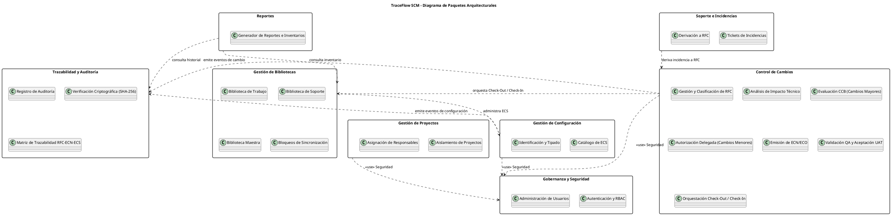
```plantuml
@startuml
skinparam shadowing false
skinparam roundcorner 8
skinparam defaultFontName Arial
skinparam packageStyle rectangle

title <b>TraceFlow SCM - Diagrama de Paquetes Arquitecturales</b>

package "Gobernanza y Seguridad" as PKG_GOB {
    class "Autenticación y RBAC" as MOD_RBAC
    class "Administración de Usuarios" as MOD_USER
}

package "Gestión de Proyectos" as PKG_PROJ {
    class "Aislamiento de Proyectos" as MOD_PROJ
    class "Asignación de Responsables" as MOD_RESP
}

package "Gestión de Configuración" as PKG_ECS {
    class "Catálogo de ECS" as MOD_ECS
    class "Identificación y Tipado" as MOD_TYPE
}

package "Gestión de Bibliotecas" as PKG_LIB {
    class "Biblioteca de Trabajo" as LIB_WRK
    class "Biblioteca de Soporte" as LIB_SUP
    class "Biblioteca Maestra" as LIB_MST
    class "Bloqueos de Sincronización" as MOD_LOCK
}

package "Control de Cambios" as PKG_CHG {
    class "Gestión y Clasificación de RFC" as MOD_RFC
    class "Análisis de Impacto Técnico" as MOD_IMP
    class "Evaluación CCB (Cambios Mayores)" as MOD_CCB
    class "Autorización Delegada (Cambios Menores)" as MOD_AUTH_MIN
    class "Emisión de ECN/ECO" as MOD_ECN
    class "Validación QA y Aceptación UAT" as MOD_QA_UAT
    class "Orquestación Check-Out / Check-In" as MOD_ORQ
}

package "Soporte e Incidencias" as PKG_SUPP {
    class "Tickets de Incidencias" as MOD_TCK
    class "Derivación a RFC" as MOD_DERIV
}

package "Trazabilidad y Auditoría" as PKG_AUD {
    class "Registro de Auditoría" as MOD_LOG
    class "Verificación Criptográfica (SHA-256)" as MOD_SHA
    class "Matriz de Trazabilidad RFC-ECN-ECS" as MOD_TRAC
}

package "Reportes" as PKG_REP {
    class "Generador de Reportes e Inventarios" as MOD_RPT
}

' Relaciones de dependencia descritas en la sección 6.1.1 del SRS
PKG_PROJ ..> PKG_GOB : <<use>> Seguridad
PKG_ECS ..> PKG_GOB : <<use>> Seguridad
PKG_CHG ..> PKG_GOB : <<use>> Seguridad

PKG_LIB ..> PKG_ECS : administra ECS
PKG_CHG ..> PKG_LIB : orquesta Check-Out / Check-In

PKG_SUPP ..> PKG_CHG : deriva incidencia a RFC
PKG_AUD <.. PKG_CHG : emite eventos de cambio
PKG_AUD <.. PKG_ECS : emite eventos de configuración

PKG_REP ..> PKG_AUD : consulta historial
PKG_REP ..> PKG_LIB : consulta inventario
@enduml
```

<!-- Página 33 del PDF original -->

### 6.1.2. Diagrama de Casos de Uso

Se identifican los siete roles definidos en el flujo de gestión de cambios de TraceFlow SCM (Solicitante, Analista de Requerimientos/Gestor, Arquitecto/Especialista Técnico, Comité de Control de Cambios, Administrador de Configuración/Bibliotecario, Ingeniero de Software/Desarrollador y Equipo de Calidad/Testing), que interactúan con los casos de uso agrupados en seis paquetes funcionales: Gestión de Usuarios y Proyectos, Registro y Evaluación de la RFC, Gestión de ECS y Bibliotecas, Implementación y Validación, Líneas Base y Rollback, e Incidencias/Trazabilidad/Reportes.

**Diagrama de Casos de Uso General - Sistema TraceFlow SCM**

Nota: Elaboración Propia

**Diagrama DG-05: Diagrama General de Casos de Uso**

#### Código PlantUML del Diagrama

```plantuml
@startuml
skinparam shadowing false
skinparam roundcorner 8
skinparam defaultFontName Arial
left to right direction

title <b>TraceFlow SCM - Diagrama General de Casos de Uso</b>

' =========================================================
' ACTORES CANÓNICOS
' =========================================================
actor "Solicitante" as ACT_SOL
actor "Analista de Requerimientos / Gestor" as ACT_ANA
actor "Arquitecto / Especialista Técnico" as ACT_ARQ
actor "Comité de Control de Cambios (CCB)" as ACT_CCB
actor "Administrador de Configuración / Bibliotecario" as ACT_ADM
actor "Ingeniero de Software / Desarrollador" as ACT_DEV
actor "Equipo de Calidad / Testing" as ACT_QA

' =========================================================
' PAQUETES FUNCIONALES
' =========================================================
rectangle "TraceFlow SCM" {
    package "Gestión de Usuarios y Proyectos" {
        usecase "CU-01: Gestionar usuarios y roles" as UC01
        usecase "CU-02: Crear y administrar proyectos" as UC02
        usecase "CU-03: Consultar proyecto" as UC03
    }

    package "Registro y Evaluación de la RFC" {
        usecase "CU-04: Registrar Solicitud de Cambio (RFC)" as UC04
        usecase "CU-05: Validar y clasificar la solicitud" as UC05
        usecase "CU-06: Realizar análisis de impacto técnico" as UC06
        usecase "CU-07: Evaluar viabilidad y aprobar/rechazar" as UC07
        usecase "CU-08: Emitir Orden de Cambio (ECN/ECO)" as UC08
        usecase "CU-30: Autorizar Cambio Menor" as UC30
    }

    package "Gestión de ECS y Bibliotecas" {
        usecase "CU-09: Registrar ECS" as UC09
        usecase "CU-10: Efectuar Check-Out (Soporte → Trabajo)" as UC10
        usecase "CU-11: Aplicar bloqueo de sincronización" as UC11
        usecase "CU-12: Efectuar Check-In (Trabajo → Maestra/Soporte)" as UC12
        usecase "CU-13: Consultar historial de versiones" as UC13
    }

    package "Implementación y Validación" {
        usecase "CU-14: Implementar cambio en el ECS" as UC14
        usecase "CU-15: Ejecutar pruebas unitarias locales" as UC15
        usecase "CU-16: Ejecutar pruebas de integración" as UC16
        usecase "CU-17: Certificar conformidad del cambio" as UC17
        usecase "CU-18: Reportar no conformidad" as UC18
        usecase "CU-19: Reevaluar y re-testear" as UC19
        usecase "CU-29: Validar aceptación del cambio por el usuario (UAT)" as UC29
    }

    package "Líneas Base y Rollback" {
        usecase "CU-20: Crear y congelar línea base" as UC20
        usecase "CU-21: Ejecutar rollback en Biblioteca de Trabajo" as UC21
        usecase "CU-22: Cancelar Orden de Cambio" as UC22
    }

    package "Incidencias, Trazabilidad y Reportes" {
        usecase "CU-23: Registrar incidencia" as UC23
        usecase "CU-24: Consultar estado de ticket" as UC24
        usecase "CU-25: Derivar incidencia a RFC" as UC25
        usecase "CU-26: Validar integridad (checksum)" as UC26
        usecase "CU-27: Auditar acciones del sistema" as UC27
        usecase "CU-28: Generar reportes de estado" as UC28
    }
}

' Asociaciones Principales
ACT_ADM --> UC01
ACT_ANA --> UC02
ACT_ANA --> UC03

ACT_SOL --> UC04
ACT_ANA --> UC05
ACT_ARQ --> UC06
ACT_CCB --> UC07
ACT_CCB --> UC08

ACT_ANA --> UC30
ACT_ARQ --> UC30

ACT_ARQ --> UC09
ACT_ADM --> UC10
ACT_ADM --> UC11
ACT_ADM --> UC12
ACT_ADM --> UC13

ACT_DEV --> UC14
ACT_DEV --> UC15
ACT_QA --> UC16
ACT_QA --> UC17
ACT_QA --> UC18
ACT_QA --> UC19
ACT_SOL --> UC29

ACT_ADM --> UC20
ACT_ADM --> UC21
ACT_ADM --> UC22

ACT_SOL --> UC23
ACT_SOL --> UC24
ACT_ANA --> UC25
ACT_ADM --> UC26
ACT_CCB --> UC27
ACT_ADM --> UC28
@enduml
```

<!-- Página 34 del PDF original -->

**Diagrama DG-06: Casos de Uso: Administración de Usuarios y Proyectos**

#### Código PlantUML del Diagrama

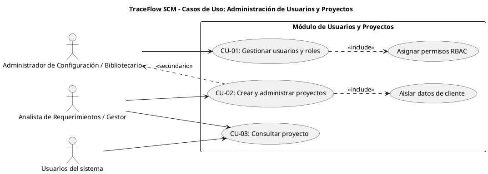
```plantuml
@startuml
skinparam shadowing false
skinparam roundcorner 8
skinparam defaultFontName Arial
left to right direction

title <b>TraceFlow SCM - Casos de Uso: Administración de Usuarios y Proyectos</b>

actor "Administrador de Configuración / Bibliotecario" as ACT_ADM
actor "Analista de Requerimientos / Gestor" as ACT_ANA
actor "Usuarios del sistema" as ACT_USR

rectangle "Módulo de Usuarios y Proyectos" {
    usecase "CU-01: Gestionar usuarios y roles" as UC01
    usecase "CU-02: Crear y administrar proyectos" as UC02
    usecase "CU-03: Consultar proyecto" as UC03

    usecase "Asignar permisos RBAC" as UC_RBAC
    usecase "Aislar datos de cliente" as UC_ISOLATE
}

ACT_ADM --> UC01
UC01 ..> UC_RBAC : <<include>>

ACT_ANA --> UC02
ACT_ANA --> UC03
ACT_USR --> UC03

UC02 ..> UC_ISOLATE : <<include>>
UC02 ..> ACT_ADM : <<secundario>>
@enduml
```

**Diagrama DG-07: Casos de Uso: Registro y Evaluación de RFC e Incidencias**

#### Código PlantUML del Diagrama

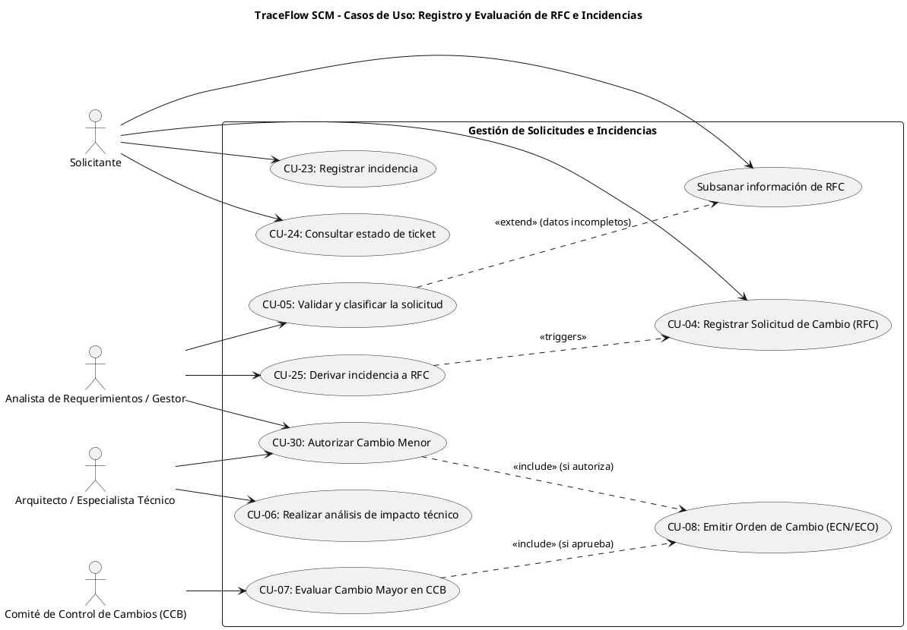
```plantuml
@startuml
skinparam shadowing false
skinparam roundcorner 8
skinparam defaultFontName Arial
left to right direction

title <b>TraceFlow SCM - Casos de Uso: Registro y Evaluación de RFC e Incidencias</b>

actor "Solicitante" as ACT_SOL
actor "Analista de Requerimientos / Gestor" as ACT_ANA
actor "Arquitecto / Especialista Técnico" as ACT_ARQ
actor "Comité de Control de Cambios (CCB)" as ACT_CCB

rectangle "Gestión de Solicitudes e Incidencias" {
    usecase "CU-23: Registrar incidencia" as UC23
    usecase "CU-24: Consultar estado de ticket" as UC24
    usecase "CU-25: Derivar incidencia a RFC" as UC25

    usecase "CU-04: Registrar Solicitud de Cambio (RFC)" as UC04
    usecase "CU-05: Validar y clasificar la solicitud" as UC05
    usecase "CU-06: Realizar análisis de impacto técnico" as UC06
    usecase "CU-07: Evaluar Cambio Mayor en CCB" as UC07
    usecase "CU-30: Autorizar Cambio Menor" as UC30
    usecase "CU-08: Emitir Orden de Cambio (ECN/ECO)" as UC08

    usecase "Subsanar información de RFC" as UC_SUBSANAR
}

ACT_SOL --> UC23
ACT_SOL --> UC24
ACT_ANA --> UC25

UC25 ..> UC04 : <<triggers>>

ACT_SOL --> UC04
ACT_ANA --> UC05
UC05 ..> UC_SUBSANAR : <<extend>> (datos incompletos)
ACT_SOL --> UC_SUBSANAR

ACT_ARQ --> UC06

' Evaluación y Decisión: Ruta Mayor (CCB) vs Menor (Delegada)
ACT_CCB --> UC07
UC07 ..> UC08 : <<include>> (si aprueba)

ACT_ANA --> UC30
ACT_ARQ --> UC30
UC30 ..> UC08 : <<include>> (si autoriza)
@enduml
```

**Diagrama DG-08: Casos de Uso: SCM Core (ECS, Bibliotecas y Líneas Base)**

#### Código PlantUML del Diagrama

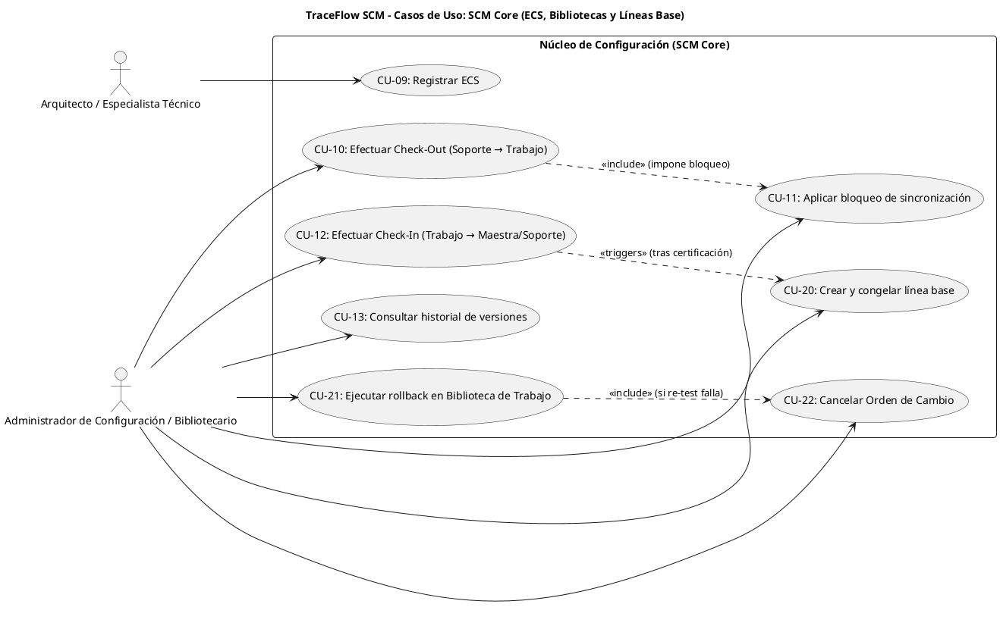
```plantuml
@startuml
skinparam shadowing false
skinparam roundcorner 8
skinparam defaultFontName Arial
left to right direction

title <b>TraceFlow SCM - Casos de Uso: SCM Core (ECS, Bibliotecas y Líneas Base)</b>

actor "Arquitecto / Especialista Técnico" as ACT_ARQ
actor "Administrador de Configuración / Bibliotecario" as ACT_ADM

rectangle "Núcleo de Configuración (SCM Core)" {
    usecase "CU-09: Registrar ECS" as UC09
    usecase "CU-10: Efectuar Check-Out (Soporte → Trabajo)" as UC10
    usecase "CU-11: Aplicar bloqueo de sincronización" as UC11
    usecase "CU-12: Efectuar Check-In (Trabajo → Maestra/Soporte)" as UC12
    usecase "CU-13: Consultar historial de versiones" as UC13
    usecase "CU-20: Crear y congelar línea base" as UC20
    usecase "CU-21: Ejecutar rollback en Biblioteca de Trabajo" as UC21
    usecase "CU-22: Cancelar Orden de Cambio" as UC22
}

ACT_ARQ --> UC09
ACT_ADM --> UC10
ACT_ADM --> UC11
ACT_ADM --> UC12
ACT_ADM --> UC13
ACT_ADM --> UC20
ACT_ADM --> UC21
ACT_ADM --> UC22

UC10 ..> UC11 : <<include>> (impone bloqueo)
UC12 ..> UC20 : <<triggers>> (tras certificación)
UC21 ..> UC22 : <<include>> (si re-test falla)
@enduml
```

**Diagrama DG-09: Casos de Uso: Implementación y Validación de Calidad**

#### Código PlantUML del Diagrama

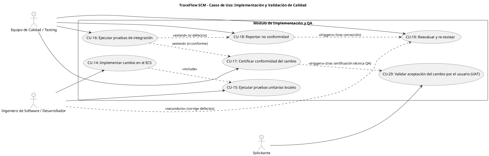
```plantuml
@startuml
skinparam shadowing false
skinparam roundcorner 8
skinparam defaultFontName Arial
left to right direction

title <b>TraceFlow SCM - Casos de Uso: Implementación y Validación de Calidad</b>

actor "Ingeniero de Software / Desarrollador" as ACT_DEV
actor "Equipo de Calidad / Testing" as ACT_QA
actor "Solicitante" as ACT_SOL

rectangle "Módulo de Implementación y QA" {
    usecase "CU-14: Implementar cambio en el ECS" as UC14
    usecase "CU-15: Ejecutar pruebas unitarias locales" as UC15
    usecase "CU-16: Ejecutar pruebas de integración" as UC16
    usecase "CU-17: Certificar conformidad del cambio" as UC17
    usecase "CU-18: Reportar no conformidad" as UC18
    usecase "CU-19: Reevaluar y re-testear" as UC19
    usecase "CU-29: Validar aceptación del cambio por el usuario (UAT)" as UC29
}

ACT_DEV --> UC14
ACT_DEV --> UC15
UC14 ..> UC15 : <<include>>

ACT_QA --> UC16
ACT_QA --> UC17
ACT_QA --> UC18
ACT_QA --> UC19

UC16 ..> UC17 : <<extend>> (si conforme)
UC16 ..> UC18 : <<extend>> (si defectos)
UC18 ..> UC19 : <<triggers>> (tras corrección)
ACT_DEV ..> UC19 : <<secundario>> (corrige defectos)

' Validación UAT del Solicitante / Usuario Final
ACT_SOL --> UC29
UC17 ..> UC29 : <<triggers>> (tras certificación técnica QA)
@enduml
```

**Diagrama DG-10: Casos de Uso: Trazabilidad, Auditoría e Integridad**

#### Código PlantUML del Diagrama

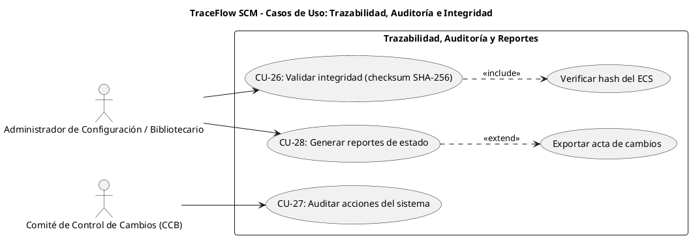
```plantuml
@startuml
skinparam shadowing false
skinparam roundcorner 8
skinparam defaultFontName Arial
left to right direction

title <b>TraceFlow SCM - Casos de Uso: Trazabilidad, Auditoría e Integridad</b>

actor "Administrador de Configuración / Bibliotecario" as ACT_ADM
actor "Comité de Control de Cambios (CCB)" as ACT_CCB

rectangle "Trazabilidad, Auditoría y Reportes" {
    usecase "CU-26: Validar integridad (checksum SHA-256)" as UC26
    usecase "CU-27: Auditar acciones del sistema" as UC27
    usecase "CU-28: Generar reportes de estado" as UC28

    usecase "Verificar hash del ECS" as UC_HASH
    usecase "Exportar acta de cambios" as UC_EXP
}

ACT_ADM --> UC26
ACT_CCB --> UC27
ACT_ADM --> UC28

UC26 ..> UC_HASH : <<include>>
UC28 ..> UC_EXP : <<extend>>
@enduml
```

### 6.1.3. Escenarios de Caso de Uso (narrativa)

El sistema TraceFlow SCM articula su alcance funcional mediante un catálogo canónico de 30 casos de uso (`CU-01` a `CU-30`). Esta estructura conserva la numeración histórica de los 28 casos de uso originales (`CU-01` a `CU-28`), incorporando explícitamente las dos capacidades normativas del proceso TO-BE v2: `CU-29: Validar aceptación del cambio por el usuario (UAT)` a cargo del actor Solicitante, y `CU-30: Autorizar Cambio Menor` a cargo de la Autoridad Operativa Delegada compartida entre el Analista de Requerimientos y el Arquitecto. A continuación se presenta el catálogo general consolidado (TB-10) y la especificación detallada de cada escenario:

**Tabla TB-10: Catálogo General de Casos de Uso del Sistema TraceFlow SCM**

| Cód. Orig. | ID Estándar | Nombre del Caso de Uso | Tipo | Actor Principal | Actores Secundarios | Módulo Relacionado | Requerimiento Asociado Explícito |
| :--- | :--- | :--- | :--- | :--- | :--- | :--- | :--- |
| CUS01 | CU-01 | Gestionar usuarios y roles | Secundario, administrativo | Administrador de Configuración / Bibliotecario | Usuarios del sistema | Gestión de Usuarios y Proyectos | RF-01 – Gestión de Usuarios y Roles |
| CUS02 | CU-02 | Crear y administrar proyectos | Primario, administrativo | Analista de Requerimientos / Gestor | Administrador de Configuración / Bibliotecario | Gestión de Usuarios y Proyectos | RF-02 – Gestión de Proyectos |
| CUS03 | CU-03 | Consultar proyecto | Secundario, de consulta | Analista de Requerimientos / Gestor | Usuarios autorizados | Gestión de Usuarios y Proyectos | RF-02 – Gestión de Proyectos |
| CUS04 | CU-04 | Registrar Solicitud de Cambio (RFC) | Primario, operativo | Solicitante | Analista de Requerimientos / Gestor | Registro y Evaluación de la RFC | RF-04 – Registro de Solicitudes de Cambio (RFC) |
| — | CU-04.1 | Subsanar Solicitud de Cambio (RFC) | Secundario, correctivo (Extensión <<extend>> de CU-04) | Solicitante | Analista de Requerimientos / Gestor | Registro y Evaluación de la RFC | RF-04 – Registro de Solicitudes de Cambio (RFC) |
| CUS05 | CU-05 | Validar y clasificar la solicitud | Primario, operativo | Analista de Requerimientos / Gestor | Solicitante | Registro y Evaluación de la RFC | RF-04, RF-05 – Registro, Clasificación y Análisis de Impacto |
| CUS06 | CU-06 | Realizar análisis de impacto técnico | Primario, analítico | Arquitecto / Especialista Técnico | Analista de Requerimientos / Gestor | Registro y Evaluación de la RFC | RF-05 – Clasificación y Análisis de Impacto |
| CUS07 | CU-07 | Evaluar viabilidad y aprobar/rechazar | Primario, decisional | Comité de Control de Cambios (CCB) | Solicitante, Analista de Requerimientos | Registro y Evaluación de la RFC | RF-06 – Evaluación y Aprobación de Cambios Mayores por el CCB |
| CUS08 | CU-08 | Emitir Orden de Cambio (ECN/ECO) | Primario, formalización | Comité de Control de Cambios (CCB) / Analista de Requerimientos / Gestor | Administrador de Configuración / Bibliotecario | Registro y Evaluación de la RFC | RF-07 – Gestión y Emisión de Órdenes de Cambio (ECN/ECO) |
| CUS09 | CU-09 | Registrar ECS | Primario, configuración | Arquitecto / Especialista Técnico | Administrador de Configuración / Bibliotecario | Gestión de ECS y Bibliotecas | RF-03 – Identificación de ECS |
| CUS10 | CU-10 | Efectuar Check-Out (Soporte → Trabajo) | Primario, operación SCM | Administrador de Configuración / Bibliotecario | Ingeniero de Software / Desarrollador | Gestión de ECS y Bibliotecas | RF-08, RF-09 – Gestión de Bibliotecas y Control de Versiones |
| CUS11 | CU-11 | Aplicar bloqueo de sincronización | Secundario, soporte SCM | Administrador de Configuración / Bibliotecario | Sistema TraceFlow SCM | Gestión de ECS y Bibliotecas | RF-09 – Control de Versiones y Bloqueos de Sincronización |
| CUS12 | CU-12 | Efectuar Check-In (Trabajo → Maestra/Soporte) | Primario, operación SCM | Administrador de Configuración / Bibliotecario | Equipo de Calidad / Testing, Solicitante | Gestión de ECS y Bibliotecas | RF-08, RF-09, RF-10 – Gestión de Bibliotecas, Control de Versiones y Aceptación |
| CUS13 | CU-13 | Consultar historial de versiones | Secundario, auditoría | Administrador de Configuración / Bibliotecario | Usuarios autorizados | Gestión de ECS y Bibliotecas | RF-09, RF-16 – Control de Versiones y Trazabilidad |
| CUS14 | CU-14 | Implementar cambio en el ECS | Primario, desarrollo | Ingeniero de Software / Desarrollador | Administrador de Configuración / Bibliotecario | Implementación y Validación | RF-07, RF-09 – Orden de Cambio y Control de Versiones |
| CUS15 | CU-15 | Ejecutar pruebas unitarias locales | Secundario, verificación | Ingeniero de Software / Desarrollador | Sistema de Pruebas Unitarias | Implementación y Validación | RF-10 – Gestión de Pruebas y Certificación de Conformidad |
| CUS16 | CU-16 | Ejecutar pruebas de integración | Primario, validación QA | Equipo de Calidad / Testing | Ingeniero de Software / Desarrollador | Implementación y Validación | RF-10 – Gestión de Pruebas y Certificación de Conformidad |
| CUS17 | CU-17 | Certificar conformidad del cambio | Primario, certificación | Equipo de Calidad / Testing | Administrador de Configuración / Bibliotecario | Implementación y Validación | RF-10 – Gestión de Pruebas y Certificación de Conformidad |
| CUS18 | CU-18 | Reportar no conformidad | Alternativo, QA | Equipo de Calidad / Testing | Ingeniero de Software / Desarrollador | Implementación y Validación | RF-10 – Gestión de Pruebas y Certificación de Conformidad |
| CUS19 | CU-19 | Reevaluar y re-testear | Alternativo, esencial | Equipo de Calidad / Testing | Ingeniero de Software / Desarrollador | Implementación y Validación | RF-11 – Reevaluación y Re-testeo |
| CUS20 | CU-20 | Crear y congelar línea base | Primario, esencial | Administrador de Configuración / Bibliotecario | Equipo de Calidad / Testing, Solicitante | Líneas Base y Rollback | RF-13 – Gestión de Líneas Base |
| CUS21 | CU-21 | Ejecutar rollback en Biblioteca de Trabajo | Alternativo, correctivo | Administrador de Configuración / Bibliotecario | Ingeniero de Software / Desarrollador | Líneas Base y Rollback | RF-12 – Rollback y Cancelación de Órdenes de Cambio |
| CUS22 | CU-22 | Cancelar Orden de Cambio | Alternativo, cierre fallido | Administrador de Configuración / Bibliotecario | Solicitante, CCB | Líneas Base y Rollback | RF-12, RF-14 – Rollback, Cancelación y Cierre Formal |
| CUS23 | CU-23 | Registrar incidencia | Primario, soporte | Solicitante | Analista de Requerimientos / Gestor | Incidencias y Soporte | RF-15 – Gestión de Incidencias y Soporte |
| CUS24 | CU-24 | Consultar estado de ticket | Secundario, consulta | Solicitante | Analista de Requerimientos / Gestor | Incidencias y Soporte | RF-15 – Gestión de Incidencias y Soporte |
| CUS25 | CU-25 | Derivar incidencia a RFC | Primario, transición | Analista de Requerimientos / Gestor | Solicitante | Incidencias y Soporte | RF-15 – Gestión de Incidencias y Soporte |
| CUS26 | CU-26 | Validar integridad (checksum) | Secundario, seguridad | Administrador de Configuración / Bibliotecario | Sistema TraceFlow SCM | Trazabilidad, Auditoría y Reportes | RF-17, RNF-03 – Auditoría e Integridad |
| CUS27 | CU-27 | Auditar acciones del sistema | Secundario, control | Comité de Control de Cambios (CCB) | Administrador de Configuración / Bibliotecario | Trazabilidad, Auditoría y Reportes | RF-16, RF-17 – Trazabilidad de Configuración y Auditoría |
| CUS28 | CU-28 | Generar reportes de estado | Secundario, reporte | Administrador de Configuración / Bibliotecario | Gestores y Dirección de Proyecto | Trazabilidad, Auditoría y Reportes | RF-18 – Generación de Reportes |
| CUS29 | CU-29 | Validar aceptación del cambio por el usuario (UAT) | Primario, validación usuario | Solicitante | Administrador de Configuración / Bibliotecario | Implementación y Validación | RF-10 – Gestión de Pruebas, Certificación QA y Aceptación del Usuario |
| CUS30 | CU-30 | Autorizar Cambio Menor | Primario, decisional | Analista de Requerimientos / Gestor, Arquitecto / Especialista Técnico | Solicitante, Ingeniero de Software / Desarrollador | Registro y Evaluación de la RFC | RF-05, RF-07 – Clasificación, Análisis de Impacto y Gestión de Órdenes de Cambio |

---

## CU-01 — Gestionar usuarios y roles

| Campo | Descripción |
| :--- | :--- |
| **Código** | CU-01 |
| **Nombre** | Gestionar usuarios y roles |
| **Tipo** | Secundario, administrativo |
| **Actor principal** | Administrador de Configuración / Bibliotecario |
| **Actores secundarios** | Usuarios del sistema |
| **Paquete / Módulo** | Gestión de Usuarios y Proyectos |
| **RF asociados** | RF-01 — Gestión de Usuarios y Roles |
| **RN asociadas** | RN-01 — Aprobación Obligatoria Previa a Modificación e Integración |
| **Objetivo** | Registrar, actualizar, asignar roles canónicos y dar de baja cuentas de usuario en TraceFlow SCM, restringiendo las funcionalidades operativas disponibles según la matriz de control de acceso basado en roles (RBAC). |
| **Disparador** | Solicitud administrativa de alta, modificación o baja de personal en el equipo de desarrollo, calidad o gestión. |
| **Precondiciones** | El Administrador de Configuración / Bibliotecario ha iniciado sesión con privilegios administrativos en el sistema. |
| **Postcondiciones** | La cuenta de usuario queda registrada, actualizada o desactivada en el directorio del sistema con su perfil y permisos RBAC formalmente asociados. |
| **Entradas** | Datos de identidad del usuario (nombres, apellidos, correo corporativo, código de colaborador) y rol oficial seleccionado de la lista canónica de 7 roles. |
| **Salidas / Entregables** | Cuenta de usuario habilitada en el sistema, credenciales de acceso iniciales emitidas y registro de asignación de rol en auditoría. |

### Flujo Principal

1. El Administrador de Configuración / Bibliotecario selecciona la opción de gestión de usuarios y roles en el panel de administración.
2. TraceFlow SCM presenta el directorio de cuentas de usuario activas y el catálogo de los siete roles canónicos oficiales.
3. El Administrador de Configuración / Bibliotecario ingresa los datos de identidad del colaborador y selecciona uno de los roles oficiales de la gobernanza documental.
4. TraceFlow SCM valida que todos los campos requeridos contengan información válida, que el correo corporativo no se encuentre duplicado y que el rol asignado corresponda a la nomenclatura oficial.
5. TraceFlow SCM registra al usuario en el directorio del sistema, asocia los privilegios de acceso basados en roles (RBAC) correspondientes al rol asignado y activa la cuenta para operaciones del proyecto.
6. TraceFlow SCM emite confirmación de registro exitoso en pantalla y remite una notificación formal con las instrucciones de acceso seguro al colaborador.

### Flujos Alternativos

- **A1 — Modificación de rol a un usuario registrado**  
  - **Origen:** Paso 3 del Flujo Principal.  
  - **Condición de activación:** Un colaborador cambia de funciones en el flujo de gestión de configuración.  
  - **Secuencia:**  
    1. El Administrador selecciona la cuenta existente y modifica el rol asignado.  
    2. TraceFlow SCM actualiza los permisos RBAC asociados conservando la trazabilidad histórica de acciones previas del usuario.  
  - **Convergencia:** Retorna al Paso 6 del Flujo Principal.

- **A2 — Desactivación lógica de una cuenta de usuario**  
  - **Origen:** Paso 3 del Flujo Principal.  
  - **Condición de activación:** Desvinculación de un colaborador o retiro temporal de acceso.  
  - **Secuencia:**  
    1. El Administrador selecciona la opción de desactivar cuenta.  
    2. TraceFlow SCM bloquea el acceso al sistema sin eliminar los registros históricos ni firmas de auditoría generadas por el usuario.  
  - **Convergencia:** Retorna al Paso 6 del Flujo Principal.

### Excepciones

- **E1 — Correo corporativo o identificador ya registrado**  
  - **Origen:** Paso 4 del Flujo Principal.  
  - **Condición de fallo:** Los datos de correo o colaborador coinciden con una cuenta preexistente.  
  - **Respuesta del sistema:** TraceFlow SCM rechaza el registro e informa que la cuenta ya existe en el sistema.  
  - **Resultado:** Retorna al Paso 3 del Flujo Principal; no se altera el directorio de usuarios.

- **E2 — Intento de asignación de rol informal o no canónico**  
  - **Origen:** Paso 4 del Flujo Principal.  
  - **Condición de fallo:** Selección de un rol no admitido por la directriz de gobernanza documental.  
  - **Respuesta del sistema:** TraceFlow SCM restringe la asignación únicamente a los 7 roles canónicos de DOCUMENTATION_RULES.md §5.  
  - **Resultado:** Retorna al Paso 3 para seleccionar un rol oficial válido.

### Reglas aplicadas

- **RN-01 (Aprobación Obligatoria Previa a Modificación e Integración):** Gobierna la asignación de facultades al garantizar que solo los usuarios con perfiles acreditados (CCB o Autoridad Delegada) puedan ejercer acciones resolutivas de cambio.

### Estados afectados

- **Estado inicial:** N/A (Administración de identidades; no interviene directamente en el ciclo de vida de una RFC).
- **Transición:** Registro o actualización de credenciales y permisos RBAC.
- **Estado final:** N/A (Usuario en estado `Activo` o `Desactivado`).

### Entregables

- Ficha de usuario habilitada en el directorio corporativo con perfil y privilegios RBAC asignados.

### Trazabilidad
- **RF:** RF-01
- **RN:** RN-01
- **Estado(s):** N/A
- **DG relacionado:** DG-04, DG-05

---

## CU-02 — Crear y administrar proyectos

| Campo | Descripción |
| :--- | :--- |
| **Código** | CU-02 |
| **Nombre** | Crear y administrar proyectos |
| **Tipo** | Primario, administrativo |
| **Actor principal** | Analista de Requerimientos / Gestor |
| **Actores secundarios** | Administrador de Configuración / Bibliotecario |
| **Paquete / Módulo** | Gestión de Usuarios y Proyectos |
| **RF asociados** | RF-02 — Gestión de Proyectos |
| **RN asociadas** | RN-01 — Aprobación Obligatoria Previa a Modificación e Integración |
| **Objetivo** | Registrar y mantener los proyectos de clientes de ÉXODO S.A.C., delimitando sus espacios lógicos de trabajo, asignando responsables y garantizando el aislamiento estricto de los datos entre clientes. |
| **Disparador** | Apertura contractual de un nuevo proyecto de software o necesidad de reconfiguración de un proyecto en curso. |
| **Precondiciones** | El Analista de Requerimientos / Gestor cuenta con sesión activa y permisos administrativos para apertura de proyectos. |
| **Postcondiciones** | El proyecto queda formalmente registrado en el catálogo del sistema con un espacio de configuración lógico aislado, bibliotecas inicializadas y equipo de trabajo asignado. |
| **Entradas** | Nombre del proyecto, cliente destinatario, descripción de objetivos, fecha de inicio, plazos contractuales y equipo técnico asignado. |
| **Salidas / Entregables** | Expediente de proyecto formalmente registrado con espacio de configuración aislado y bibliotecas inicializadas. |

### Flujo Principal

1. El Analista de Requerimientos / Gestor selecciona la opción de registrar un nuevo proyecto de software.
2. TraceFlow SCM presenta el formulario de configuración de proyecto y el directorio corporativo de clientes.
3. El Analista de Requerimientos / Gestor ingresa los datos generales del proyecto, cliente, objetivos contractuales y selecciona al equipo técnico asignado.
4. TraceFlow SCM valida que el nombre del proyecto sea unívoco en el sistema y que los plazos contractuales guarden coherencia temporal.
5. TraceFlow SCM crea el proyecto estableciendo un espacio lógico independiente, garantizando el aislamiento estricto de los datos del cliente respecto a otros proyectos y aprovisionando las estructuras iniciales de Biblioteca Maestra, Soporte y Trabajo.
6. TraceFlow SCM emite confirmación de creación del proyecto en pantalla y notifica al Administrador de Configuración / Bibliotecario para la inicialización formal del catálogo de ECS.

### Flujos Alternativos

- **A1 — Actualización de parámetros o equipo de un proyecto existente**  
  - **Origen:** Paso 3 del Flujo Principal.  
  - **Condición de activación:** Modificación de fechas, asignación de nuevos consultores o ampliación de alcance.  
  - **Secuencia:**  
    1. El Analista selecciona el proyecto existente y edita los parámetros autorizados.  
    2. TraceFlow SCM valida los cambios y actualiza el registro del proyecto manteniendo la integridad del historial.  
  - **Convergencia:** Retorna al Paso 6 del Flujo Principal.

- **A2 — Archivado o cierre formal de un proyecto culminado**  
  - **Origen:** Paso 3 del Flujo Principal.  
  - **Condición de activación:** Culminación del contrato y entrega final aceptada.  
  - **Secuencia:**  
    1. El Analista selecciona la opción de archivado de proyecto.  
    2. TraceFlow SCM congela el acceso de modificación, conserva las líneas base y coloca el proyecto en estado `Archivado`.  
  - **Convergencia:** Finaliza el trámite de cierre de proyecto.

### Excepciones

- **E1 — Nombre de proyecto duplicado en el catálogo**  
  - **Origen:** Paso 4 del Flujo Principal.  
  - **Condición de fallo:** El identificador o denominación ingresada coincide con un proyecto registrado previamente.  
  - **Respuesta del sistema:** TraceFlow SCM rechaza el registro e instruye especificar una denominación unívoca.  
  - **Resultado:** Retorna al Paso 3 del Flujo Principal sin crear el espacio lógico.

### Reglas aplicadas

- **RN-01 (Aprobación Obligatoria Previa a Modificación e Integración):** Asegura que todo flujo de cambios opere únicamente dentro del marco delimitado de un proyecto formalmente aprobado.

### Estados afectados

- **Estado inicial:** N/A (Gestión de proyectos; no altera directamente el ciclo de vida de una RFC).
- **Transición:** Creación y aprovisionamiento de espacio lógico de configuración.
- **Estado final:** N/A (Proyecto en estado `Activo`).

### Entregables

- Registro formal de proyecto activo con espacio lógico independiente y bibliotecas de configuración inicializadas.

### Trazabilidad
- **RF:** RF-02
- **RN:** RN-01
- **Estado(s):** N/A
- **DG relacionado:** DG-04, DG-05

---

## CU-03 — Consultar proyecto

| Campo | Descripción |
| :--- | :--- |
| **Código** | CU-03 |
| **Nombre** | Consultar proyecto |
| **Tipo** | Secundario, de consulta |
| **Actor principal** | Analista de Requerimientos / Gestor |
| **Actores secundarios** | Usuarios autorizados (cualquiera de los 7 roles canónicos con acceso al proyecto) |
| **Paquete / Módulo** | Gestión de Usuarios y Proyectos |
| **RF asociados** | RF-02 — Gestión de Proyectos |
| **RN asociadas** | RN-01 — Aprobación Obligatoria Previa a Modificación e Integración |
| **Objetivo** | Visualizar la ficha integral de un proyecto, consultando sus datos generales, equipo asignado, estado de avance, catálogo de ECS asociados y resumen de solicitudes de cambio activas. |
| **Disparador** | Consulta operativa del actor para verificar el estado de avance o configuración de un proyecto. |
| **Precondiciones** | El usuario se encuentra autenticado en el sistema y posee permisos de acceso asignados sobre el proyecto a consultar. |
| **Postcondiciones** | TraceFlow SCM presenta el panel informativo consolidado del proyecto sin alterar su configuración ni sus registros. |
| **Entradas** | Criterios de búsqueda (denominación del proyecto, cliente o identificador). |
| **Salidas / Entregables** | Ficha consolidada de consulta de proyecto presentada en pantalla. |

### Flujo Principal

1. El Analista de Requerimientos / Gestor (o usuario autorizado) selecciona la opción de consulta de proyectos.
2. TraceFlow SCM presenta el catálogo de proyectos a los cuales el usuario tiene acceso concedido según su perfil.
3. El actor selecciona el proyecto específico que desea inspeccionar.
4. TraceFlow SCM valida los permisos de visualización del usuario sobre el proyecto seleccionado según la matriz RBAC.
5. TraceFlow SCM consolida la información general, el equipo asignado, el inventario de ECS y el resumen de estado de las solicitudes de cambio en curso.
6. TraceFlow SCM presenta el panel de detalle del proyecto permitiendo la navegación hacia sus artefactos de configuración asociados.

### Flujos Alternativos

- **A1 — Búsqueda y filtrado avanzado de proyectos**  
  - **Origen:** Paso 2 del Flujo Principal.  
  - **Condición de activación:** El usuario administra múltiples proyectos y requiere filtrar por cliente o estado.  
  - **Secuencia:**  
    1. El actor aplica filtros por cliente, rango de fechas o estado.  
    2. TraceFlow SCM actualiza la lista mostrando únicamente los proyectos coincidentes.  
  - **Convergencia:** Retorna al Paso 3 del Flujo Principal.

### Excepciones

- **E1 — Intento de acceso a proyecto no asignado al usuario**  
  - **Origen:** Paso 4 del Flujo Principal.  
  - **Condición de fallo:** El usuario intenta acceder a la ficha de un proyecto sobre el cual no cuenta con asignación.  
  - **Respuesta del sistema:** TraceFlow SCM bloquea la visualización e informa la restricción de acceso según RBAC.  
  - **Resultado:** No se despliega información; el usuario permanece en el listado general.

### Reglas aplicadas

- **RN-01 (Aprobación Obligatoria Previa a Modificación e Integración):** Gobierna el control de acceso y visibilidad de los proyectos del sistema.

### Estados afectados

- **Estado inicial:** N/A (Operación de sólo lectura).
- **Transición:** N/A
- **Estado final:** N/A

### Entregables

- Vista consolidada de la ficha de proyecto y estado del flujo de configuración.

### Trazabilidad
- **RF:** RF-02
- **RN:** RN-01
- **Estado(s):** N/A
- **DG relacionado:** DG-04, DG-05

---

## CU-04 — Registrar Solicitud de Cambio (RFC)

| Campo | Descripción |
| :--- | :--- |
| **Código** | CU-04 |
| **Nombre** | Registrar Solicitud de Cambio (RFC) |
| **Tipo** | Primario, operativo |
| **Actor principal** | Solicitante |
| **Actores secundarios** | Analista de Requerimientos / Gestor |
| **Paquete / Módulo** | Registro y Clasificación de Cambios |
| **RF asociados** | RF-04 — Registro de Solicitudes de Cambio (RFC) |
| **RN asociadas** | RN-01 — Aprobación Obligatoria Previa a Modificación e Integración |
| **Objetivo** | Permitir al Solicitante formalizar en el sistema la necesidad de modificación sobre un Elemento de Configuración de Software (ECS) del proyecto. |
| **Disparador** | El Solicitante identifica un defecto, una necesidad de mejora o una adaptación funcional en el software del proyecto. |
| **Precondiciones** | 1. El Solicitante cuenta con sesión activa y rol asignado en el proyecto. 2. El proyecto se encuentra en estado activo. 3. Existe al menos un ECS registrado en el catálogo del proyecto. |
| **Postcondiciones** | 1. La RFC queda registrada con identificador unívoco (RFC-YYYY-NNNN) en estado oficial **`Registrada`**. 2. Se notifica al Analista de Requerimientos / Gestor para la revisión de completitud. |
| **Entradas** | Título, descripción del cambio, justificación operativa, prioridad propuesta y selección del ECS afectado. |
| **Salidas / Entregables** | Expediente digital de RFC creado en estado `Registrada` y comprobante de registro con código correlativo formal. |

### Flujo Principal

1. El Solicitante selecciona la opción de registrar una nueva Solicitud de Cambio (RFC) en el proyecto asignado.
2. TraceFlow SCM presenta el formulario de captura cargando el catálogo de ECS activos del proyecto.
3. El Solicitante ingresa el título, descripción de la modificación, justificación operativa, prioridad propuesta y selecciona el ECS afectado.
4. TraceFlow SCM valida que todos los campos mandatorios contengan información sustantiva y que el ECS seleccionado pertenezca al proyecto activo.
5. TraceFlow SCM registra formalmente la solicitud asignándole un código correlativo unívoco y estableciendo su estado oficial en **`Registrada`**.
6. TraceFlow SCM emite el comprobante de recepción al Solicitante y envía una notificación automática al Analista de Requerimientos / Gestor para su revisión de completitud.

### Flujos Alternativos

- **A1 — Adjuntar documentación técnica o probatoria de respaldo**  
  - **Origen:** Paso 3 del Flujo Principal.  
  - **Condición de activación:** El Solicitante cuenta con informes de error, actas de cliente o especificaciones complementarias.  
  - **Secuencia:**  
    1. El Solicitante adjunta los archivos de sustento a la solicitud.  
    2. TraceFlow SCM valida el formato y tamaño permitido de los documentos, vinculándolos al expediente de la RFC.  
  - **Convergencia:** Retorna al Paso 4 del Flujo Principal.

- **A2 — Cancelación voluntaria del registro**  
  - **Origen:** Paso 3 del Flujo Principal.  
  - **Condición de activación:** El Solicitante decide no enviar la solicitud.  
  - **Secuencia:**  
    1. El Solicitante selecciona la opción cancelar.  
    2. TraceFlow SCM solicita confirmación de descarte.  
    3. El Solicitante confirma el descarte.  
    4. TraceFlow SCM descarta los datos ingresados sin persistir transacciones.  
  - **Convergencia:** Finaliza el caso de uso sin generar registros.

### Excepciones

- **E1 — Información mandatoria incompleta**  
  - **Origen:** Paso 4 del Flujo Principal.  
  - **Condición de fallo:** Omisión de campos requeridos (justificación vacía o ECS no seleccionado).  
  - **Respuesta del sistema:** TraceFlow SCM bloquea el registro, resalta los campos observados y solicita la corrección al Solicitante.  
  - **Resultado:** Retorna al Paso 3 del Flujo Principal; no se crea ninguna RFC.

- **E2 — ECS seleccionado inactivo o no disponible**  
  - **Origen:** Paso 4 del Flujo Principal.  
  - **Condición de fallo:** El ECS seleccionado fue dado de baja o archivado en el catálogo.  
  - **Respuesta del sistema:** TraceFlow SCM informa que el elemento no admite solicitudes y bloquea el guardado.  
  - **Resultado:** Retorna al Paso 3 del Flujo Principal para seleccionar un ECS válido.

### Reglas aplicadas

- **RN-01 (Aprobación Obligatoria Previa a Modificación e Integración):** Asegura que ninguna alteración a un ECS se inicie sin el registro formal previo de una RFC en el sistema.

### Estados afectados

- **Estado inicial:** Ninguno (Creación de nuevo expediente)
- **Transición:** Registro formal de la solicitud
- **Estado final:** **`Registrada`** (Estado 1 de TB-07)

### Entregables

- Expediente formal de Solicitud de Cambio (RFC) en estado oficial `Registrada`.

### Trazabilidad
- **RF:** RF-04
- **RN:** RN-01
- **Estado(s):** Registrada
- **DG relacionado:** DG-03, DG-04, DG-05, DG-11

---

## CU-04.1 — Subsanar Solicitud de Cambio (RFC)

| Campo | Descripción |
| :--- | :--- |
| **Código** | CU-04.1 |
| **Nombre** | Subsanar Solicitud de Cambio (RFC) |
| **Tipo** | Secundario, correctivo (`<<extend>>` de CU-04) |
| **Actor principal** | Solicitante |
| **Actores secundarios** | Analista de Requerimientos / Gestor |
| **Paquete / Módulo** | Registro y Clasificación de Cambios |
| **RF asociados** | RF-04 — Registro de Solicitudes de Cambio (RFC) |
| **RN asociadas** | RN-01 — Aprobación Obligatoria Previa a Modificación e Integración |
| **Objetivo** | Permitir al Solicitante corregir, completar o aclarar la información y sustentos de una RFC observada en la revisión inicial, reactivando su ciclo de evaluación. |
| **Disparador** | El Solicitante recibe una notificación de observación formal emitida por el Analista de Requerimientos / Gestor. |
| **Precondiciones** | La RFC se encuentra en estado oficial **`En Subsanación`** y dentro del plazo reglamentario establecido por el proyecto. |
| **Postcondiciones** | La RFC queda actualizada con la información requerida y transiciona a estado oficial **`Registrada`** para una nueva verificación formal. |
| **Entradas** | Pliego de modificaciones, campos corregidos, justificaciones ampliadas y nuevos anexos técnicos. |
| **Salidas / Entregables** | Expediente de RFC subsanado y comprobante de reingreso formal emitido. |

### Flujo Principal

1. El Solicitante selecciona en su bandeja de solicitudes la RFC en estado "En Subsanación".
2. TraceFlow SCM presenta el formulario de subsanación mostrando los datos de la solicitud y el pliego formal de observaciones registrado por el Analista.
3. El Solicitante modifica los campos requeridos, amplía la justificación y adjunta los documentos aclaratorios solicitados.
4. TraceFlow SCM valida que las modificaciones atiendan las observaciones registradas y que no existan campos mandatorios pendientes.
5. TraceFlow SCM actualiza el expediente de la RFC y transiciona su estado oficial a **`Registrada`**.
6. TraceFlow SCM emite confirmación de subsanación al Solicitante y envía una notificación automática al Analista de Requerimientos / Gestor para su reevaluación.

### Flujos Alternativos

- **A1 — Desistimiento voluntario de la solicitud observada**  
  - **Origen:** Paso 3 del Flujo Principal.  
  - **Condición de activación:** El Solicitante decide no subsanar la solicitud y retira el pedido.  
  - **Secuencia:**  
    1. El Solicitante confirma el desistimiento formal de la RFC.  
    2. TraceFlow SCM solicita el motivo de desistimiento.  
    3. TraceFlow SCM transiciona el estado de la RFC a `Desestimada`.  
  - **Convergencia:** Finaliza el trámite de la solicitud.

### Excepciones

- **E1 — Vencimiento del plazo reglamentario de subsanación**  
  - **Origen:** Paso 1 del Flujo Principal.  
  - **Condición de fallo:** El Solicitante intenta acceder a la subsanación fuera de la ventana de tiempo autorizada.  
  - **Respuesta del sistema:** TraceFlow SCM bloquea la edición, informa que el plazo expiró y declara la solicitud en estado `Desestimada`.  
  - **Resultado:** No se admiten cambios; el expediente se archiva como desestimado por abandono.

### Reglas aplicadas

- **RN-01 (Aprobación Obligatoria Previa a Modificación e Integración):** Exige que cualquier avance hacia evaluación técnica cuente con un expediente de solicitud formalmente admitido y sin omisiones.

### Estados afectados

- **Estado inicial:** **`En Subsanación`** (Estado 2 de TB-07)
- **Transición:** Subsanación de observaciones formales
- **Estado final:** **`Registrada`** (Estado 1 de TB-07)

### Entregables

- Expediente de RFC subsanado en estado oficial `Registrada`.

### Trazabilidad
- **RF:** RF-04
- **RN:** RN-01
- **Estado(s):** En Subsanación $
ightarrow$ Registrada
- **DG relacionado:** DG-03, DG-05, DG-11

---

## CU-05 — Validar y clasificar la solicitud

| Campo | Descripción |
| :--- | :--- |
| **Código** | CU-05 |
| **Nombre** | Validar y clasificar la solicitud |
| **Tipo** | Primario, operativo |
| **Actor principal** | Analista de Requerimientos / Gestor |
| **Actores secundarios** | Solicitante, Arquitecto / Especialista Técnico |
| **Paquete / Módulo** | Registro y Clasificación de Cambios |
| **RF asociados** | RF-04 — Registro de Solicitudes de Cambio (RFC) RF-05 — Clasificación y Análisis de Impacto |
| **RN asociadas** | RN-01 — Aprobación Obligatoria Previa a Modificación e Integración RN-07 — Diferenciación de Resultados Formales de Cierre |
| **Objetivo** | Efectuar la revisión formal de completitud, consistencia de alcance y procedencia de la RFC registrada, admitiéndola para análisis técnico, devolviéndola para subsanación o desestimándola por improcedencia. |
| **Disparador** | Recepción de una notificación de nueva RFC registrada o reingresada tras subsanación. |
| **Precondiciones** | La RFC se encuentra en estado oficial **`Registrada`**. |
| **Postcondiciones** | La RFC transiciona a: **`Clasificada`** (admitida a análisis técnico), **`En Subsanación`** (observada) o **`Desestimada`** (cierre formal anticipado). |
| **Entradas** | Expediente de la RFC, catálogo de requerimientos del proyecto, catálogo de ECS y criterios de admisibilidad formal. |
| **Salidas / Entregables** | Dictamen formal de admisión/categorización preliminar, pliego de observaciones de subsanación o acta de desestimación formal. |

### Flujo Principal

1. El Analista de Requerimientos / Gestor selecciona una RFC en estado "Registrada" desde su bandeja de evaluación inicial.
2. TraceFlow SCM presenta el expediente de la solicitud incluyendo descripción, justificación, prioridad propuesta, ECS asociado y anexos.
3. El Analista de Requerimientos / Gestor revisa la completitud de los datos, la coherencia con el alcance del proyecto y la procedencia de la solicitud.
4. El Analista de Requerimientos / Gestor emite el dictamen de admisión formal asignando la categorización preliminar del requerimiento.
5. TraceFlow SCM valida la consistencia del dictamen de admisibilidad y actualiza el estado oficial de la RFC a **`Clasificada`**.
6. TraceFlow SCM notifica al Arquitecto / Especialista Técnico que la RFC ha sido admitida formalmente y queda habilitada para el análisis de impacto técnico.

### Flujos Alternativos

- **A1 — Información incompleta o insuficiente (Observación de RFC)**  
  - **Origen:** Paso 3 del Flujo Principal.  
  - **Condición de activación:** La solicitud carece de justificación clara, no identifica con precisión el comportamiento esperado o faltan anexos críticos.  
  - **Secuencia:**  
    1. El Analista de Requerimientos / Gestor redacta el pliego de observaciones indicando los requisitos a subsanar.  
    2. TraceFlow SCM valida el pliego y actualiza el estado oficial de la RFC a `En Subsanación`.  
    3. TraceFlow SCM notifica al Solicitante otorgándole el plazo reglamentario para corregir mediante CU-04.1.  
  - **Convergencia:** Finaliza la revisión inicial quedando a la espera de la subsanación.

- **A2 — Solicitud improcedente, duplicada o fuera del alcance contractual**  
  - **Origen:** Paso 3 del Flujo Principal.  
  - **Condición de activación:** La solicitud replica un cambio ya atendido, contradice los objetivos del proyecto o no es aplicable.  
  - **Secuencia:**  
    1. El Analista de Requerimientos / Gestor formula el dictamen de desestimación fundamentando las causales.  
    2. TraceFlow SCM registra el motivo de improcedencia y transiciona el estado oficial de la RFC a `Desestimada` (estado terminal).  
    3. TraceFlow SCM notifica el cierre anticipado al Solicitante según RN-07.  
  - **Convergencia:** Finaliza el trámite de la RFC como estado terminal.

### Excepciones

- **E1 — Expediente con anexos corruptos o ilegibles**  
  - **Origen:** Paso 2 del Flujo Principal.  
  - **Condición de fallo:** Los archivos de respaldo adjuntos por el Solicitante no pueden visualizarse o presentan fallas de formato.  
  - **Respuesta del sistema:** TraceFlow SCM alerta sobre la falla en los documentos adjuntos.  
  - **Resultado:** El Analista deriva la solicitud al flujo alternativo A1 para requerir la recarga íntegra de anexos.

### Reglas aplicadas

- **RN-01 (Aprobación Obligatoria Previa a Modificación e Integración):** Impide que una solicitud no admitida formalmente pase a etapas técnicas de ingeniería.
- **RN-07 (Diferenciación de Resultados Formales de Cierre):** Establece el estado `Desestimada` como un resultado de cierre formal anticipado para solicitudes inviables desde el análisis inicial.

### Estados afectados

- **Estado inicial:** **`Registrada`** (Estado 1 de TB-07)
- **Transición:** Validación formal de admisibilidad y completitud
- **Estado final:** **`Clasificada`** (Estado 3 de TB-07) / **`En Subsanación`** (Estado 2 de TB-07) / **`Desestimada`** (Estado 11 de TB-07)

### Entregables

- Dictamen formal de admisión preliminar en estado `Clasificada` (o pliego de observaciones / acta de desestimación).

### Trazabilidad
- **RF:** RF-04, RF-05
- **RN:** RN-01, RN-07
- **Estado(s):** Registrada $
ightarrow$ Clasificada (o En Subsanación / Desestimada)
- **DG relacionado:** DG-03, DG-04, DG-05, DG-11

---

## CU-06 — Realizar análisis de impacto técnico

| Campo | Descripción |
| :--- | :--- |
| **Código** | CU-06 |
| **Nombre** | Realizar análisis de impacto técnico |
| **Tipo** | Primario, analítico |
| **Actor principal** | Arquitecto / Especialista Técnico |
| **Actores secundarios** | Analista de Requerimientos / Gestor |
| **Paquete / Módulo** | Registro y Clasificación de Cambios |
| **RF asociados** | RF-05 — Clasificación y Análisis de Impacto |
| **RN asociadas** | RN-01 — Aprobación Obligatoria Previa a Modificación e Integración RN-05 — Evaluación Técnica y Clasificación Obligatoria |
| **Objetivo** | Evaluar las implicancias técnicas, arquitecturales y operativas del cambio sobre el software, estimando riesgos, dependencias, esfuerzo, tiempo, costo y afectación a la Triple Restricción, para dictaminar formalmente si clasifica como Cambio Menor o Cambio Mayor. |
| **Disparador** | Notificación de RFC en estado oficial `Clasificada` disponible para análisis técnico. |
| **Precondiciones** | La RFC se encuentra en estado oficial **`Clasificada`**. |
| **Postcondiciones** | 1. Se emite y suscribe el Informe Técnico de Impacto. 2. La RFC transiciona a estado oficial **`En Evaluación`** habilitando la ruta correspondiente (CU-30 para Cambio Menor o CU-07 para Cambio Mayor). |
| **Entradas** | Expediente de la RFC clasificada, arquitectura del sistema, mapa de dependencias de ECS, estimación de esfuerzo en horas-hombre y matriz de riesgos técnicos. |
| **Salidas / Entregables** | Informe Técnico de Impacto formalmente suscrito con dictamen de clasificación (Cambio Menor o Cambio Mayor). |

### Flujo Principal

1. El Arquitecto / Especialista Técnico selecciona una RFC en estado "Clasificada" desde su bandeja de análisis de ingeniería.
2. TraceFlow SCM presenta el expediente de la solicitud y actualiza su estado oficial a **`En Análisis Técnico`**.
3. El Arquitecto / Especialista Técnico analiza el impacto en la arquitectura de software, dependencias entre ECS, riesgos técnicos, estimando el esfuerzo en horas-hombre, el tiempo de ejecución y el costo proyectado.
4. El Arquitecto / Especialista Técnico evalúa la afectación sobre la Triple Restricción (alcance, tiempo y costo) y formula el dictamen de clasificación técnica en Cambio Menor o Cambio Mayor.
5. TraceFlow SCM registra el Informe Técnico de Impacto vinculándolo de forma inmutable al expediente de la RFC conforme a RN-05.
6. TraceFlow SCM transiciona el estado oficial de la RFC a **`En Evaluación`** y enruta la solicitud hacia la instancia de deliberación que corresponda según la clasificación dictaminada.

### Flujos Alternativos

- **A1 — Solicitud de aclaración técnica al Analista o Solicitante**  
  - **Origen:** Paso 3 del Flujo Principal.  
  - **Condición de activación:** El Arquitecto identifica ambigüedad técnica sobre el comportamiento esperado del ECS.  
  - **Secuencia:**  
    1. El Arquitecto registra una consulta técnica formal asociada a la RFC.  
    2. TraceFlow SCM notifica al Analista de Requerimientos / Gestor para responder la precisión requerida.  
    3. El Analista ingresa la aclaración técnica en el sistema.  
  - **Convergencia:** Retorna al Paso 3 del Flujo Principal para proseguir con el análisis.

### Excepciones

- **E1 — Dictamen de inviabilidad técnica absoluta**  
  - **Origen:** Paso 4 del Flujo Principal.  
  - **Condición de fallo:** El Arquitecto dictamina que el cambio es técnica o arquitecturalmente inviable o incompatible con la estabilidad del sistema.  
  - **Respuesta del sistema:** TraceFlow SCM registra el dictamen de inviabilidad en el Informe Técnico de Impacto.  
  - **Resultado:** La RFC clasifica como Cambio Mayor con recomendación formal de rechazo para tratamiento colegiado en el CCB (CU-07).

### Reglas aplicadas

- **RN-05 (Evaluación Técnica y Clasificación Obligatoria):** Mandata que ninguna RFC pueda autorizarse sin contar previamente con el Informe Técnico de Impacto que evalúe arquitectura, riesgos y la afectación a la Triple Restricción.
- **RN-01 (Aprobación Obligatoria Previa a Modificación e Integración):** Garantiza que la clasificación sea el insumo previo y obligatorio para cualquier resolución de cambio.

### Estados afectados

- **Estado inicial:** **`Clasificada`** (Estado 3 de TB-07)
- **Transición:** Elaboración del Informe Técnico de Impacto y clasificación formal
- **Estado final:** **`En Evaluación`** (Estado 5 de TB-07), habiendo transitado interinamente por **`En Análisis Técnico`** (Estado 4 de TB-07)

### Entregables

- Informe Técnico de Impacto formalmente suscrito con dictamen vinculante de clasificación técnica (Cambio Menor / Mayor).

### Trazabilidad
- **RF:** RF-05
- **RN:** RN-01, RN-05
- **Estado(s):** Clasificada $
ightarrow$ En Análisis Técnico $
ightarrow$ En Evaluación
- **DG relacionado:** DG-03, DG-05, DG-11

---

## CU-07 — Evaluar Cambio Mayor en CCB

| Campo | Descripción |
| :--- | :--- |
| **Código** | CU-07 |
| **Nombre** | Evaluar Cambio Mayor en CCB |
| **Tipo** | Primario, decisional |
| **Actor principal** | Comité de Control de Cambios (CCB) |
| **Actores secundarios** | Solicitante, Analista de Requerimientos / Gestor, Arquitecto / Especialista Técnico |
| **Paquete / Módulo** | Evaluación y Aprobación de Cambios |
| **RF asociados** | RF-06 — Evaluación y Aprobación de Cambios Mayores por el CCB |
| **RN asociadas** | RN-01 — Aprobación Obligatoria Previa a Modificación e Integración RN-05 — Evaluación Técnica y Clasificación Obligatoria RN-07 — Diferenciación de Resultados Formales de Cierre |
| **Objetivo** | Deliberar colegiadamente en el seno del CCB sobre la procedencia estratégica, técnica, presupuestal y contractual de una RFC clasificada como Cambio Mayor, dictaminando formalmente su aprobación o rechazo en acta resolutiva. |
| **Disparador** | Convocatoria a sesión de CCB ante la presencia de una o más RFC en estado `En Evaluación` con clasificación de Cambio Mayor. |
| **Precondiciones** | 1. La RFC se encuentra en estado oficial **`En Evaluación`**. 2. Cuenta con Informe Técnico de Impacto formalmente emitido que dictamina clasificación como **Cambio Mayor** (RN-05). |
| **Postcondiciones** | La RFC transiciona a estado oficial **`Autorizada`** (si se aprueba) o a **`Rechazada`** (estado terminal, si no se aprueba). |
| **Entradas** | Expediente de la RFC, Informe Técnico de Impacto, análisis de la Triple Restricción, cuórum de miembros del CCB y votos registrados. |
| **Salidas / Entregables** | Acta Resolutiva de Sesión del CCB formalizada con registro de votos y dictamen colegiado vinculante. |

### Flujo Principal

1. El Comité de Control de Cambios (CCB) accede al expediente de la RFC clasificada como Cambio Mayor en estado "En Evaluación".
2. TraceFlow SCM presenta el expediente integral, el Informe Técnico de Impacto, la evaluación de la Triple Restricción y la estimación de riesgos.
3. El Comité de Control de Cambios (CCB) delibera colegiadamente sobre la viabilidad técnica, el impacto contractual, presupuestal y estratégico del cambio.
4. El Comité de Control de Cambios (CCB) formula la votación formal de los miembros y emite el acta resolutiva con dictamen aprobatorio.
5. TraceFlow SCM valida el cuórum legal, registra el acta formal de deliberación y actualiza el estado oficial de la RFC a **`Autorizada`**.
6. TraceFlow SCM notifica formalmente la resolución aprobatoria al Solicitante, al Analista de Requerimientos / Gestor y al Administrador de Configuración / Bibliotecario para la emisión de la orden de cambio.

### Flujos Alternativos

- **A1 — Dictamen de rechazo colegiado del Cambio Mayor**  
  - **Origen:** Paso 4 del Flujo Principal.  
  - **Condición de activación:** El CCB determina que el cambio es inviable por costos, plazos contractuales, riesgos excesivos o desalineación con el cliente.  
  - **Secuencia:**  
    1. El Comité de Control de Cambios (CCB) registra la votación denegatoria y fundamenta formalmente las causales de rechazo en el acta.  
    2. TraceFlow SCM registra el acta resolutiva y transiciona el estado oficial de la RFC a `Rechazada` (estado terminal).  
    3. TraceFlow SCM notifica el rechazo fundamentado al Solicitante y a las partes interesadas según RN-07.  
  - **Convergencia:** Concluye el ciclo de vida de la RFC como expediente archivado.

- **A2 — Solicitud de ampliación de información técnica por el CCB**  
  - **Origen:** Paso 3 del Flujo Principal.  
  - **Condición de activación:** El CCB considera insuficiente la evaluación de impacto para tomar una decisión informada.  
  - **Secuencia:**  
    1. El CCB solicita una reevaluación o ampliación del análisis técnico al Arquitecto.  
    2. TraceFlow SCM mantiene el estado `En Evaluación` y notifica al Arquitecto los puntos a profundizar.  
  - **Convergencia:** El expediente queda a la espera de la actualización del Informe de Impacto.

### Excepciones

- **E1 — Falta de cuórum reglamentario en la votación del CCB**  
  - **Origen:** Paso 5 del Flujo Principal.  
  - **Condición de fallo:** No se cuenta con el número mínimo de integrantes autorizados para emitir resolución válida.  
  - **Respuesta del sistema:** TraceFlow SCM bloquea la formalización de la votación e indica la falta de cuórum.  
  - **Resultado:** La solicitud permanece en estado `En Evaluación` hasta convocar una nueva sesión válida.

### Reglas aplicadas

- **RN-01 (Aprobación Obligatoria Previa a Modificación e Integración):** Restringe toda afectación de software sin la debida resolución previa del CCB para Cambios Mayores.
- **RN-05 (Evaluación Técnica y Clasificación Obligatoria):** Asegura que el CCB fundamente su decisión en el Informe Técnico de Impacto previo.
- **RN-07 (Diferenciación de Resultados Formales de Cierre):** Garantiza que ante un dictamen desfavorable la RFC transicione formalmente a `Rechazada`.

### Estados afectados

- **Estado inicial:** **`En Evaluación`** (Estado 5 de TB-07)
- **Transición:** Deliberación y resolución colegiada del CCB
- **Estado final:** **`Autorizada`** (Estado 6 de TB-07) o **`Rechazada`** (Estado 12 de TB-07)

### Entregables

- Acta Resolutiva de Sesión del CCB formalizada con registro de votos y dictamen vinculante en estado `Autorizada` o `Rechazada`.

### Trazabilidad
- **RF:** RF-06
- **RN:** RN-01, RN-05, RN-07
- **Estado(s):** En Evaluación $
ightarrow$ Autorizada (o Rechazada)
- **DG relacionado:** DG-03, DG-04, DG-07, DG-11

---

## CU-08 — Emitir Orden de Cambio (ECN/ECO)

| Campo | Descripción |
| :--- | :--- |
| **Código** | CU-08 |
| **Nombre** | Emitir Orden de Cambio (ECN/ECO) |
| **Tipo** | Primario, formalización |
| **Actor principal** | Comité de Control de Cambios (CCB) / Analista de Requerimientos / Gestor (según tipo de cambio) |
| **Actores secundarios** | Administrador de Configuración / Bibliotecario, Ingeniero de Software / Desarrollador |
| **Paquete / Módulo** | Control de Cambios y Órdenes |
| **RF asociados** | RF-07 — Gestión y Emisión de Órdenes de Cambio (ECN/ECO) |
| **RN asociadas** | RN-01 — Aprobación Obligatoria Previa a Modificación e Integración |
| **Objetivo** | Formalizar, numerar y expedir la Orden formal de Cambio (ECN/ECO) sobre una RFC previamente autorizada, asignando responsables y plazos técnicos para habilitar el Check-Out del ECS. |
| **Disparador** | Registro de dictamen favorable que posiciona la RFC en estado oficial `Autorizada`. |
| **Precondiciones** | La RFC se encuentra en estado oficial **`Autorizada`** (mediante CU-07 o CU-30). El caso de uso NO aprueba el cambio, únicamente formaliza su orden de ejecución. |
| **Postcondiciones** | 1. La ECN/ECO queda formalmente expedida con código correlativo único (ECN-YYYY-NNNN). 2. La RFC transiciona a estado oficial **`Orden Emitida`**. 3. Se habilita al Administrador de Configuración para ejecutar el Check-Out (CU-10). |
| **Entradas** | Expediente de la RFC autorizada, desarrollador asignado, cronograma de desarrollo y alcance técnico a intervenir. |
| **Salidas / Entregables** | Documento formal de Orden de Cambio (ECN/ECO) registrado en el sistema. |

### Flujo Principal

1. La autoridad competente (CCB para Cambio Mayor o Autoridad Delegada para Cambio Menor) selecciona una RFC en estado "Autorizada".
2. TraceFlow SCM presenta el formulario de formalización de Orden de Cambio precargando los antecedentes técnicos y la resolución aprobatoria.
3. El emisor ingresa la asignación del Ingeniero de Software / Desarrollador responsable, los plazos máximos de ejecución y el alcance específico de modificación sobre el ECS.
4. TraceFlow SCM valida que la RFC cuente con autorización formal vigente y que el desarrollador asignado posea rol activo en el proyecto según RN-01.
5. TraceFlow SCM expide formalmente la Orden de Cambio (ECN/ECO) con numeración unívoca correlativa y actualiza el estado oficial de la RFC a **`Orden Emitida`**.
6. TraceFlow SCM notifica formalmente la emisión de la orden al Administrador de Configuración / Bibliotecario y al Ingeniero de Software / Desarrollador para proceder con el Check-Out.

### Flujos Alternativos

- **A1 — Corrección de datos de asignación de la orden antes de expedir**  
  - **Origen:** Paso 3 del Flujo Principal.  
  - **Condición de activación:** Se identifica indisponibilidad del desarrollador seleccionado antes de la emisión final.  
  - **Secuencia:**  
    1. El emisor reasigna la orden a un desarrollador alternativo calificado.  
    2. TraceFlow SCM actualiza la asignación técnica en el borrador de la orden.  
  - **Convergencia:** Retorna al Paso 4 del Flujo Principal.

### Excepciones

- **E1 — Intento de emisión sobre RFC no autorizada**  
  - **Origen:** Paso 4 del Flujo Principal.  
  - **Condición de fallo:** La solicitud no cuenta con estado oficial Autorizada o el dictamen previo fue revocado.  
  - **Respuesta del sistema:** TraceFlow SCM bloquea la generación de la orden e informa la inconsistencia de estado según RN-01.  
  - **Resultado:** No se emite la orden; el flujo se cancela de forma inmediata.

### Reglas aplicadas

- **RN-01 (Aprobación Obligatoria Previa a Modificación e Integración):** Dispone que ningún ECS puede ser extraído ni modificado sin contar con una ECN/ECO debidamente emitida tras la autorización formal del cambio.

### Estados afectados

- **Estado inicial:** **`Autorizada`** (Estado 6 de TB-07)
- **Transición:** Expedición y formalización de la ECN/ECO
- **Estado final:** **`Orden Emitida`** (Estado 7 de TB-07)

### Entregables

- Orden formal de Cambio (ECN/ECO) expedida con código correlativo en estado `Orden Emitida`.

### Trazabilidad
- **RF:** RF-07
- **RN:** RN-01
- **Estado(s):** Autorizada $
ightarrow$ Orden Emitida
- **DG relacionado:** DG-03, DG-04, DG-07, DG-11

---

## CU-09 — Registrar ECS

| Campo | Descripción |
| :--- | :--- |
| **Código** | CU-09 |
| **Nombre** | Registrar ECS |
| **Tipo** | Primario, configuración |
| **Actor principal** | Arquitecto / Especialista Técnico |
| **Actores secundarios** | Administrador de Configuración / Bibliotecario |
| **Paquete / Módulo** | Gestión de ECS y Bibliotecas |
| **RF asociados** | RF-03 — Identificación de ECS |
| **RN asociadas** | RN-01 — Aprobación Obligatoria Previa a Modificación e Integración RN-02 — Identificación Unívoca de Versiones RN-04 — Restricción de Bibliotecas Congeladas |
| **Objetivo** | Identificar, clasificar e incorporar formalmente un nuevo Elemento de Configuración de Software (código fuente, esquema de base de datos o especificación técnica) en el inventario del proyecto, asignándole identificador unívoco y depositándolo en la biblioteca correspondiente. |
| **Disparador** | Creación de nuevos módulos de código, especificaciones de diseño, esquemas o librerías que deben quedar bajo control formal de versiones. |
| **Precondiciones** | 1. El proyecto se encuentra en estado activo. 2. El actor cuenta con rol de Arquitecto o Administrador de Configuración con permisos de catalogación. |
| **Postcondiciones** | El ECS queda registrado en el inventario oficial del proyecto con código unívoco, versión inicial (1.0.0) y firma de integridad depositado en la biblioteca designada. |
| **Entradas** | Denominación del ECS, clasificación del artefacto (código, documento, esquema BD), descripción funcional, versión inicial, dependencias técnicas y archivo base. |
| **Salidas / Entregables** | Ficha técnica de ECS registrada en el catálogo con código unívoco y registro de integridad inicial. |

### Flujo Principal

1. El Arquitecto / Especialista Técnico selecciona la opción de registrar un nuevo Elemento de Configuración de Software (ECS) en el proyecto activo.
2. TraceFlow SCM presenta el formulario de catalogación de ECS y la estructura jerárquica de componentes del sistema.
3. El Arquitecto / Especialista Técnico ingresa el nombre del artefacto, selecciona su tipología, define la versión inicial, especifica las dependencias con otros componentes y adjunta el archivo base.
4. TraceFlow SCM valida que la denominación sea unívoca en el proyecto, que la versión cumpla el estándar mayor.menor.parche (RN-02) y verifica la integridad del archivo mediante comprobación de suma (checksum).
5. TraceFlow SCM registra formalmente el ECS en el catálogo, genera su código correlativo unívoco y lo deposita en la biblioteca designada bajo control de versiones.
6. TraceFlow SCM emite confirmación de catalogación y notifica al Administrador de Configuración / Bibliotecario la disponibilidad del nuevo ECS para el flujo de cambios.

### Flujos Alternativos

- **A1 — Registro de ECS de especificación documental o manual de usuario**  
  - **Origen:** Paso 3 del Flujo Principal.  
  - **Condición de activación:** El elemento a incorporar es un documento formal y no código ejecutable.  
  - **Secuencia:**  
    1. El Arquitecto selecciona la categoría documental y consigna los metadatos de formato y aprobación.  
  - **Convergencia:** Retorna al Paso 4 del Flujo Principal.

### Excepciones

- **E1 — Denominación de ECS duplicada en el proyecto**  
  - **Origen:** Paso 4 del Flujo Principal.  
  - **Condición de fallo:** Ya existe un elemento registrado con idéntica denominación y ruta lógica en el proyecto.  
  - **Respuesta del sistema:** TraceFlow SCM rechaza el registro e instruye asignar un identificador unívoco según RN-02.  
  - **Resultado:** Retorna al Paso 3 del Flujo Principal; no se incorpora el elemento.

- **E2 — Estándar de versión inicial no conforme**  
  - **Origen:** Paso 4 del Flujo Principal.  
  - **Condición de fallo:** La versión ingresada no respeta la nomenclatura mayor.menor.parche.  
  - **Respuesta del sistema:** TraceFlow SCM exige corregir la versión según la regla oficial RN-02.  
  - **Resultado:** Retorna al Paso 3 del Flujo Principal para su subsanación.

### Reglas aplicadas

- **RN-01 (Aprobación Obligatoria Previa a Modificación e Integración):** Dispone que todo artefacto sujeto a cambios deba estar formalmente catalogado como ECS.
- **RN-02 (Identificación Unívoca de Versiones):** Impone el estándar numérico mayor.menor.parche para el versionamiento del artefacto.
- **RN-04 (Restricción de Bibliotecas Congeladas):** Protege los ECS catalogados prohibiendo su edición directa fuera del flujo de control de cambios.

### Estados afectados

- **Estado inicial:** N/A (Catalogación de inventario; no es un expediente de RFC).
- **Transición:** Incorporación formal de artefacto al repositorio de configuración.
- **Estado final:** N/A (ECS en estado `Vigente` en biblioteca).

### Entregables

- Ficha técnica de ECS catalogada en el inventario del proyecto con identificador unívoco.

### Trazabilidad
- **RF:** RF-03
- **RN:** RN-01, RN-02, RN-04
- **Estado(s):** N/A
- **DG relacionado:** DG-04, DG-07

---

## CU-10 — Efectuar Check-Out

| Campo | Descripción |
| :--- | :--- |
| **Código** | CU-10 |
| **Nombre** | Efectuar Check-Out |
| **Tipo** | Primario, operación SCM |
| **Actor principal** | Administrador de Configuración / Bibliotecario |
| **Actores secundarios** | Ingeniero de Software / Desarrollador |
| **Paquete / Módulo** | Gestión de ECS y Bibliotecas |
| **RF asociados** | RF-08 — Gestión de Bibliotecas de Software RF-09 — Control de Versiones y Bloqueos de Sincronización |
| **RN asociadas** | RN-01 — Aprobación Obligatoria Previa a Modificación e Integración RN-06 — Bloqueo de Sincronización Obligatorio |
| **Objetivo** | Transferir de forma controlada una copia del ECS desde la Biblioteca de Soporte hacia la Biblioteca de Trabajo asignada al Desarrollador, activando la protección de edición exclusiva. |
| **Disparador** | Recepción de la notificación de ECN/ECO en estado oficial `Orden Emitida`. |
| **Precondiciones** | 1. La RFC se encuentra en estado oficial **`Orden Emitida`** con ECN/ECO formalmente vigente (RN-01). 2. El ECS existe y se encuentra accesible en la Biblioteca de Soporte. 3. El ECS no cuenta con bloqueo de sincronización activo por otra orden (RN-06). |
| **Postcondiciones** | 1. La copia de trabajo del ECS queda disponible en la Biblioteca de Trabajo del Desarrollador asignado. 2. Se aplica el bloqueo de sincronización sobre el ECS (CU-11). 3. La RFC transiciona a estado oficial **`En Implementación`**. |
| **Entradas** | Identificador de ECN/ECO, identificador de ECS y credenciales del Desarrollador asignado. |
| **Salidas / Entregables** | Copia de trabajo del ECS transferida a la Biblioteca de Trabajo y constancia de Check-Out registrada en auditoría. |

### Flujo Principal

1. El Administrador de Configuración / Bibliotecario selecciona la Orden de Cambio en estado "Orden Emitida" para transferir el artefacto.
2. TraceFlow SCM presenta los datos de la ECN/ECO, el ECS asociado en la Biblioteca de Soporte y el Desarrollador asignado.
3. El Administrador de Configuración / Bibliotecario confirma la operación de Check-Out hacia la Biblioteca de Trabajo.
4. TraceFlow SCM valida que el ECS no presente bloqueo de sincronización activo y verifica su integridad mediante comprobación de suma (checksum) según RN-06.
5. TraceFlow SCM transfiere la copia del ECS a la Biblioteca de Trabajo, aplica el bloqueo de sincronización exclusivo y actualiza el estado oficial de la RFC a **`En Implementación`**.
6. TraceFlow SCM genera el registro histórico de Check-Out en la bitácora y notifica al Ingeniero de Software / Desarrollador la disponibilidad del artefacto para inicio de actividades técnicas.

### Flujos Alternativos

- **A1 — Verificación y reintento por retardo en la transferencia de repositorio**  
  - **Origen:** Paso 4 del Flujo Principal.  
  - **Condición de activación:** Se produce una inconsistencia temporal en la lectura de la Biblioteca de Soporte.  
  - **Secuencia:**  
    1. TraceFlow SCM reintenta la lectura de integridad del artefacto.  
    2. El sistema confirma la integridad del archivo de origen.  
  - **Convergencia:** Retorna al Paso 5 del Flujo Principal.

### Excepciones

- **E1 — ECS bloqueado concurrentemente por otra orden de cambio**  
  - **Origen:** Paso 4 del Flujo Principal.  
  - **Condición de fallo:** El ECS se encuentra retenido bajo bloqueo de sincronización por otro desarrollo en curso según RN-06.  
  - **Respuesta del sistema:** TraceFlow SCM deniega el Check-Out, muestra los datos del usuario que mantiene el bloqueo y registra la colisión en auditoría.  
  - **Resultado:** La operación se detiene sin transferir archivos; la orden permanece en espera de liberación del bloqueo.

### Reglas aplicadas

- **RN-01 (Aprobación Obligatoria Previa a Modificación e Integración):** Impide el Check-Out si la solicitud no cuenta con una ECN/ECO formalmente emitida.
- **RN-06 (Bloqueo de Sincronización Obligatorio):** Exige que el Check-Out active de inmediato el bloqueo exclusivo impidiendo colisiones de edición.

### Estados afectados

- **Estado inicial:** **`Orden Emitida`** (Estado 7 de TB-07)
- **Transición:** Ejecución de Check-Out y asignación a Biblioteca de Trabajo
- **Estado final:** **`En Implementación`** (Estado 8 de TB-07)

### Entregables

- Constancia de Check-Out registrada con copia de trabajo alojada en la Biblioteca de Trabajo.

### Trazabilidad
- **RF:** RF-08, RF-09
- **RN:** RN-01, RN-06
- **Estado(s):** Orden Emitida $
ightarrow$ En Implementación
- **DG relacionado:** DG-03, DG-04, DG-07, DG-11

---

## CU-11 — Aplicar bloqueo de sincronización

| Campo | Descripción |
| :--- | :--- |
| **Código** | CU-11 |
| **Nombre** | Aplicar bloqueo de sincronización |
| **Tipo** | Secundario, soporte SCM |
| **Actor principal** | Administrador de Configuración / Bibliotecario |
| **Actores secundarios** | Sistema TraceFlow SCM |
| **Paquete / Módulo** | Gestión de ECS y Bibliotecas |
| **RF asociados** | RF-09 — Control de Versiones y Bloqueos de Sincronización |
| **RN asociadas** | RN-06 — Bloqueo de Sincronización Obligatorio |
| **Objetivo** | Establecer una restricción de concurrencia a nivel de catálogo sobre un ECS en Check-Out, impidiendo su edición simultánea o extracción por otros usuarios hasta su Check-In o Rollback. |
| **Disparador** | Ejecución de la operación de Check-Out (CU-10) o solicitud administrativa de aseguramiento de concurrencia. |
| **Precondiciones** | El ECS se encuentra registrado en el proyecto y sin bloqueo activo previo a nombre de otra orden. |
| **Postcondiciones** | El ECS queda registrado en estado bloqueado ("Locked") vinculado unívocamente al Desarrollador asignado y a la ECN/ECO vigente. |
| **Entradas** | Identificador del ECS, identificador de la ECN/ECO y usuario beneficiario del bloqueo. |
| **Salidas / Entregables** | Registro de bloqueo activo en el catálogo de configuración y marca de exclusividad en el inventario de ECS. |

### Flujo Principal

1. El Administrador de Configuración / Bibliotecario (o TraceFlow SCM durante el Check-Out) solicita la aplicación del bloqueo de sincronización sobre el ECS.
2. TraceFlow SCM consulta el estado actual de concurrencia del ECS en el catálogo del proyecto.
3. TraceFlow SCM valida que el ECS no cuente con un bloqueo activo preexistente según RN-06.
4. TraceFlow SCM registra el bloqueo exclusivo asociando el identificador del Desarrollador asignado, la ECN/ECO y la marca temporal de aplicación.
5. TraceFlow SCM actualiza el catálogo impidiendo nuevas operaciones de Check-Out o modificación sobre el ECS por terceros consultores.
6. TraceFlow SCM confirma la aplicación del bloqueo y asienta la transacción en la bitácora de control de concurrencia.

### Flujos Alternativos

- **A1 — Consulta de estado de bloqueo previo**  
  - **Origen:** Paso 2 del Flujo Principal.  
  - **Condición de activación:** El Administrador verifica si un ECS ya posee bloqueo antes de planificar una asignación.  
  - **Secuencia:**  
    1. TraceFlow SCM presenta el detalle del bloqueo vigente (usuario, fecha y orden asociada).  
  - **Convergencia:** Concluye la consulta sin modificar el catálogo.

### Excepciones

- **E1 — Conflicto de bloqueo por concurrencia simultánea**  
  - **Origen:** Paso 3 del Flujo Principal.  
  - **Condición de fallo:** Otra transacción estableció el bloqueo milisegundos antes sobre el mismo ECS.  
  - **Respuesta del sistema:** TraceFlow SCM rechaza la solicitud de bloqueo y notifica la colisión de concurrencia.  
  - **Resultado:** La operación se cancela salvaguardando la integridad del repositorio.

### Reglas aplicadas

- **RN-06 (Bloqueo de Sincronización Obligatorio):** Establece como regla mandatoria que todo ECS transferido a la Biblioteca de Trabajo quede estrictamente bloqueado para evitar sobrescrituras de código o documentos.

### Estados afectados

- **Estado inicial:** Mantiene el estado del flujo activo (típicamente durante **`Orden Emitida`** / **`En Implementación`**)
- **Transición:** Aseguramiento de concurrencia por Check-Out
- **Estado final:** Mantiene el estado activo (**`En Implementación`**)

### Entregables

- Asiento de bloqueo de sincronización activo registrado en la bitácora de control de configuración.

### Trazabilidad
- **RF:** RF-09
- **RN:** RN-06
- **Estado(s):** Mantiene En Implementación
- **DG relacionado:** DG-03, DG-07

---

## CU-12 — Efectuar Check-In

| Campo | Descripción |
| :--- | :--- |
| **Código** | CU-12 |
| **Nombre** | Efectuar Check-In |
| **Tipo** | Primario, operación SCM |
| **Actor principal** | Administrador de Configuración / Bibliotecario |
| **Actores secundarios** | Equipo de Calidad / Testing, Solicitante |
| **Paquete / Módulo** | Gestión de ECS y Bibliotecas |
| **RF asociados** | RF-08 — Gestión de Bibliotecas de Software RF-09 — Control de Versiones y Bloqueos de Sincronización RF-10 — Gestión de Pruebas, Certificación QA y Aceptación del Usuario |
| **RN asociadas** | RN-01 — Aprobación Obligatoria Previa a Modificación e Integración RN-02 — Identificación Unívoca de Versiones RN-04 — Restricción de Bibliotecas Congeladas RN-06 — Bloqueo de Sincronización Obligatorio RN-09 — Doble Validación Previa al Check-In a Biblioteca Maestra |
| **Objetivo** | Transferir e integrar formalmente el ECS verificado y aceptado desde la Biblioteca de Soporte hacia la Biblioteca Maestra, generando el nuevo número de versión y liberando el bloqueo de sincronización. |
| **Disparador** | Notificación de cumplimiento concurrente de la Certificación Técnica de QA y del Acta de Aceptación UAT del Solicitante. |
| **Precondiciones** | 1. Orden de Cambio formalmente emitida (ECN/ECO vigente). 2. Certificación Técnica de Conformidad emitida por QA (CU-17). 3. Acta de Aceptación UAT formalmente suscrita por el Solicitante (CU-29). 4. ECS válido con integridad comprobada mediante suma de verificación. 5. Bloqueo de sincronización vigente sobre el ECS a nombre de la orden. |
| **Postcondiciones** | 1. El ECS queda integrado de forma inmutable en la Biblioteca Maestra. 2. Se asigna la nueva versión oficial según estándar mayor.menor.parche (RN-02). 3. Se libera el bloqueo de sincronización del ECS (RN-06). 4. Se habilita la congelación de la nueva Línea Base (CU-20). |
| **Entradas** | Copia verificada del ECS, constancia de doble validación (QA + UAT) y metadatos de versión. |
| **Salidas / Entregables** | Registro formal de Check-In en la Biblioteca Maestra y constancia de liberación de bloqueo de sincronización. |

### Flujo Principal

1. El Administrador de Configuración / Bibliotecario selecciona la RFC con doble validación aprobada para proceder al Check-In.
2. TraceFlow SCM presenta el expediente técnico consolidando la ECN/ECO, el Certificado Técnico de QA y el Acta de Aceptación UAT.
3. El Administrador de Configuración / Bibliotecario confirma la transferencia formal del ECS hacia la Biblioteca Maestra.
4. TraceFlow SCM valida la concurrencia de la Orden Emitida, la Certificación de QA, el Acta de Aceptación UAT, la integridad del archivo (checksum SHA-256) y la vigencia del bloqueo según RN-09.
5. TraceFlow SCM transfiere e integra el ECS en la Biblioteca Maestra, asigna la nueva versión según estándar oficial (RN-02) y libera el bloqueo de sincronización según RN-06.
6. TraceFlow SCM registra el asiento histórico de Check-In en la bitácora de auditoría y notifica la integración exitosa al CCB y a los interesados, habilitando la creación y congelamiento de la nueva Línea Base.

### Flujos Alternativos

- **A1 — Check-In intermedio hacia Biblioteca de Soporte para pruebas**  
  - **Origen:** Paso 3 del Flujo Principal.  
  - **Condición de activación:** La transferencia corresponde al paso de desarrollo a pruebas en el ciclo de integración.  
  - **Secuencia:**  
    1. El Administrador transfiere el ECS a la Biblioteca de Soporte sin levantar el bloqueo exclusivo de desarrollo.  
  - **Convergencia:** Permite la ejecución de pruebas de integración en CU-16.

### Excepciones

- **E1 — Incumplimiento de la regla de doble validación (Falta QA o UAT)**  
  - **Origen:** Paso 4 del Flujo Principal.  
  - **Condición de fallo:** Se intenta ejecutar el Check-In hacia la Biblioteca Maestra faltando la Certificación de QA o el Acta UAT.  
  - **Respuesta del sistema:** TraceFlow SCM bloquea categóricamente la operación e indica la ausencia de la doble validación según RN-09.  
  - **Resultado:** El ECS permanece en la biblioteca intermedia; no se realiza la integración a la Biblioteca Maestra.

- **E2 — Inconsistencia en la comprobación de integridad (Checksum alterado)**  
  - **Origen:** Paso 4 del Flujo Principal.  
  - **Condición de fallo:** La suma de verificación del archivo no coincide con el artefacto certificado.  
  - **Respuesta del sistema:** TraceFlow SCM alerta sobre alteración no autorizada de integridad y aborta la transferencia.  
  - **Resultado:** Se cancela la operación y se genera una alerta de seguridad en la bitácora de auditoría.

### Reglas aplicadas

- **RN-09 (Doble Validación Previa al Check-In a Biblioteca Maestra):** Prohíbe de forma absoluta la integración a la Biblioteca Maestra sin contar concurrentemente con la certificación técnica de QA y el acta formal de UAT.
- **RN-04 (Restricción de Bibliotecas Congeladas):** Protege la Biblioteca Maestra asegurando que solo ingresen artefactos debidamente aprobados.
- **RN-06 (Bloqueo de Sincronización Obligatorio):** Dispone la liberación formal del bloqueo únicamente cuando el Check-In ha sido perfeccionado.

### Estados afectados

- **Estado inicial:** **`En Aceptación`** (Estado 10 de TB-07)
- **Transición:** Check-In formal a la Biblioteca Maestra con doble conformidad
- **Estado final:** **`En Aceptación`** (Estado 10 de TB-07, fase final previa a congelación de Línea Base)

### Entregables

- Asiento formal de Check-In a la Biblioteca Maestra y constancia de versión actualizada en el repositorio central.

### Trazabilidad
- **RF:** RF-08, RF-09, RF-10
- **RN:** RN-01, RN-02, RN-04, RN-06, RN-09
- **Estado(s):** Mantiene En Aceptación (inmediato anterior a Implementada)
- **DG relacionado:** DG-03, DG-04, DG-07, DG-09, DG-11

---

## CU-13 — Consultar historial de versiones

| Campo | Descripción |
| :--- | :--- |
| **Código** | CU-13 |
| **Nombre** | Consultar historial de versiones |
| **Tipo** | Secundario, auditoría |
| **Actor principal** | Administrador de Configuración / Bibliotecario |
| **Actores secundarios** | Usuarios autorizados |
| **Paquete / Módulo** | Gestión de ECS y Bibliotecas |
| **RF asociados** | RF-09 — Control de Versiones y Bloqueos de Sincronización RF-16 — Trazabilidad de Configuración |
| **RN asociadas** | RN-02 — Identificación Unívoca de Versiones RN-03 — Trazabilidad de Cambios |
| **Objetivo** | Inspeccionar la línea temporal de versiones, operaciones de Check-In, Check-Out, autores, marcas de tiempo, memorias descriptivas y Órdenes de Cambio (ECN/ECO) asociadas a un ECS a lo largo de su ciclo de vida. |
| **Disparador** | Necesidad técnica o de auditoría de verificar la evolución histórica de un componente de software o comparar versiones. |
| **Precondiciones** | El ECS se encuentra formalmente registrado en el catálogo del proyecto; el usuario cuenta con credenciales de lectura. |
| **Postcondiciones** | TraceFlow SCM presenta la bitácora cronológica y árbol de versiones del ECS sin modificar su estado ni sus archivos. |
| **Entradas** | Identificador del ECS y criterios de filtrado temporal o de versión. |
| **Salidas / Entregables** | Reporte visual cronológico del historial de versiones y trazabilidad de operaciones Check-In/Check-Out. |

### Flujo Principal

1. El Administrador de Configuración / Bibliotecario selecciona un ECS en el catálogo del proyecto y solicita consultar su historial.
2. TraceFlow SCM recupera el historial de versiones y la bitácora de transacciones del elemento desde el repositorio de configuración.
3. TraceFlow SCM presenta la lista cronológica de versiones registradas indicando código de versión, autor, fecha, ECN/ECO asociada y biblioteca de residencia.
4. El Administrador de Configuración / Bibliotecario selecciona una versión específica para inspeccionar sus detalles.
5. TraceFlow SCM presenta la memoria descriptiva de los cambios, las firmas de auditoría y la firma de integridad de la versión seleccionada según RN-03.
6. TraceFlow SCM habilita la comparación conceptual de diferencias respecto a la versión previa o respecto a la versión activa en la Biblioteca Maestra.

### Flujos Alternativos

- **A1 — Comparación de diferencias entre dos versiones históricas del ECS**  
  - **Origen:** Paso 4 del Flujo Principal.  
  - **Condición de activación:** El actor requiere auditar qué modificaciones específicas se aplicaron entre dos versiones distintas.  
  - **Secuencia:**  
    1. El Administrador selecciona dos versiones del historial y solicita comparación.  
    2. TraceFlow SCM presenta la vista comparativa de diferencias conceptuales entre ambos estados del artefacto.  
  - **Convergencia:** Retorna al Paso 6 del Flujo Principal.

### Excepciones

- **E1 — ECS sin historial de modificaciones (versión inicial sin cambios)**  
  - **Origen:** Paso 2 del Flujo Principal.  
  - **Condición de fallo:** El elemento únicamente cuenta con su versión de catalogación base sin operaciones de cambio posteriores.  
  - **Respuesta del sistema:** TraceFlow SCM informa que el ECS se encuentra en su versión inicial sin transacciones de Check-In adicionales.  
  - **Resultado:** Se muestra únicamente la ficha de creación base.

### Reglas aplicadas

- **RN-02 (Identificación Unívoca de Versiones):** Garantiza que cada hito del historial exhiba una nomenclatura estandarizada.
- **RN-03 (Trazabilidad de Cambios):** Asegura que cada versión del historial se encuentre inexorablemente vinculada a una ECN/ECO y a un mensaje descriptivo.

### Estados afectados

- **Estado inicial:** N/A (Operación de sólo lectura).
- **Transición:** N/A
- **Estado final:** N/A

### Entregables

- Vista de historial cronológico y trazabilidad de versiones del ECS presentada en pantalla.

### Trazabilidad
- **RF:** RF-09, RF-16
- **RN:** RN-02, RN-03
- **Estado(s):** N/A
- **DG relacionado:** DG-04, DG-07

---

## CU-14 — Implementar cambio en el ECS

| Campo | Descripción |
| :--- | :--- |
| **Código** | CU-14 |
| **Nombre** | Implementar cambio en el ECS |
| **Tipo** | Primario, desarrollo |
| **Actor principal** | Ingeniero de Software / Desarrollador |
| **Actores secundarios** | Administrador de Configuración / Bibliotecario |
| **Paquete / Módulo** | Implementación y Validación |
| **RF asociados** | RF-07 — Gestión y Emisión de Órdenes de Cambio (ECN/ECO) RF-09 — Control de Versiones y Bloqueos de Sincronización |
| **RN asociadas** | RN-01 — Aprobación Obligatoria Previa a Modificación e Integración RN-03 — Trazabilidad de Cambios |
| **Objetivo** | Efectuar las modificaciones técnicas y codificación sobre la copia de trabajo del ECS alojada en la Biblioteca de Trabajo, circunscribiéndose estrictamente al alcance de la ECN/ECO. |
| **Disparador** | Notificación de disponibilidad del ECS en la Biblioteca de Trabajo tras el Check-Out. |
| **Precondiciones** | 1. La RFC se encuentra en estado oficial **`En Implementación`**. 2. La copia de trabajo del ECS está alojada en la Biblioteca de Trabajo con bloqueo exclusivo a nombre del Desarrollador (RN-06). |
| **Postcondiciones** | Las modificaciones técnicas quedan consolidadas en el espacio de trabajo local preparadas para la verificación unitaria. |
| **Entradas** | Copia de trabajo del ECS, especificaciones técnicas de la ECN/ECO y pautas de diseño del proyecto. |
| **Salidas / Entregables** | Artefacto de software modificado en la Biblioteca de Trabajo con memoria técnica descriptiva del cambio. |

### Flujo Principal

1. El Ingeniero de Software / Desarrollador accede a su espacio en la Biblioteca de Trabajo y visualiza la ECN/ECO asignada.
2. TraceFlow SCM presenta el alcance técnico de la orden, los criterios de aceptación y el ECS desbloqueado exclusivamente para su usuario.
3. El Ingeniero de Software / Desarrollador realiza las modificaciones, adaptaciones o correcciones sobre la copia de trabajo del ECS.
4. TraceFlow SCM registra el progreso de los cambios efectuados asociándolos inmutablemente al identificador de la ECN/ECO según RN-03.
5. El Ingeniero de Software / Desarrollador formula la memoria descriptiva de los cambios aplicados detallando los componentes modificados.
6. TraceFlow SCM consolida la versión de trabajo del ECS dejándola dispuesta para la ejecución de pruebas unitarias locales.

### Flujos Alternativos

- **A1 — Solicitud de ajuste de alcance técnico durante la implementación**  
  - **Origen:** Paso 3 del Flujo Principal.  
  - **Condición de activación:** El Desarrollador identifica una dependencia imprevista que requiere alterar el alcance de la orden.  
  - **Secuencia:**  
    1. El Desarrollador registra una consulta de alcance formal dirigida al Arquitecto.  
    2. El Arquitecto evalúa si la consulta requiere una ampliación formal o se resuelve dentro de los parámetros de la ECN/ECO vigente.  
  - **Convergencia:** Retorna al Paso 3 con la instrucción técnica clarificada.

### Excepciones

- **E1 — Pérdida de integridad de la copia de trabajo local**  
  - **Origen:** Paso 4 del Flujo Principal.  
  - **Condición de fallo:** Corrupción accidental del espacio de trabajo del desarrollador.  
  - **Respuesta del sistema:** TraceFlow SCM permite reestablecer una copia limpia desde la Biblioteca de Soporte respetando el bloqueo vigente.  
  - **Resultado:** Se reanuda la implementación en el Paso 3 sin vulnerar el repositorio central.

### Reglas aplicadas

- **RN-01 (Aprobación Obligatoria Previa a Modificación e Integración):** Limita la modificación técnica únicamente a los ECS que cuenten con ECN/ECO formalmente emitida.
- **RN-03 (Trazabilidad de Cambios):** Exige que cada modificación realizada cuente con una descripción técnica asociada formalmente a la orden de cambio.

### Estados afectados

- **Estado inicial:** **`En Implementación`** (Estado 8 de TB-07)
- **Transición:** Desarrollo y aplicación técnica del cambio
- **Estado final:** **`En Implementación`** (Estado 8 de TB-07)

### Entregables

- Copia de trabajo del ECS modificada con memoria descriptiva en la Biblioteca de Trabajo.

### Trazabilidad
- **RF:** RF-07, RF-09
- **RN:** RN-01, RN-03
- **Estado(s):** Mantiene En Implementación
- **DG relacionado:** DG-03, DG-07

---

## CU-15 — Ejecutar pruebas unitarias locales

| Campo | Descripción |
| :--- | :--- |
| **Código** | CU-15 |
| **Nombre** | Ejecutar pruebas unitarias locales |
| **Tipo** | Secundario, verificación |
| **Actor principal** | Ingeniero de Software / Desarrollador |
| **Actores secundarios** | Sistema de Pruebas Unitarias |
| **Paquete / Módulo** | Implementación y Validación |
| **RF asociados** | RF-10 — Gestión de Pruebas, Certificación QA y Aceptación del Usuario |
| **RN asociadas** | RN-01 — Aprobación Obligatoria Previa a Modificación e Integración RN-03 — Trazabilidad de Cambios |
| **Objetivo** | Verificar de forma temprana y automatizada que los componentes modificados del ECS funcionen correctamente de forma aislada, previo a su entrega a control de calidad. |
| **Disparador** | Culminación de las tareas de codificación en la Biblioteca de Trabajo (CU-14). |
| **Precondiciones** | El ECS ha sido modificado y consolidado en la Biblioteca de Trabajo del Desarrollador. |
| **Postcondiciones** | Reporte de pruebas unitarias registrado con 100% de casos críticos superados, habilitando la solicitud de pruebas de integración. |
| **Entradas** | ECS modificado, suites de pruebas unitarias y datos de prueba locales. |
| **Salidas / Entregables** | Reporte formal de resultados de pruebas unitarias vinculado al expediente de la ECN/ECO. |

### Flujo Principal

1. El Ingeniero de Software / Desarrollador solicita la ejecución del conjunto de pruebas unitarias sobre el ECS modificado.
2. TraceFlow SCM presenta el entorno de verificación unitaria cargando los casos de prueba asociados al componente intervenido.
3. El Ingeniero de Software / Desarrollador dispara la ejecución de la batería de pruebas en la Biblioteca de Trabajo.
4. TraceFlow SCM valida que la totalidad de los casos de prueba unitarios se ejecuten sin errores y satisfagan los criterios de cobertura.
5. TraceFlow SCM registra el reporte de resultados unitarios vinculándolo a la bitácora de la Orden de Cambio.
6. TraceFlow SCM confirma el éxito de la verificación y habilita la opción de promover el artefacto para pruebas de integración con QA.

### Flujos Alternativos

- **A1 — Corrección inmediata de fallo unitario menor**  
  - **Origen:** Paso 4 del Flujo Principal.  
  - **Condición de activación:** Uno o más casos de prueba unitarios arrojan fallo en lógica local.  
  - **Secuencia:**  
    1. El Desarrollador ajusta la codificación local.  
    2. El Desarrollador reinicia la suite de pruebas unitarias.  
  - **Convergencia:** Retorna al Paso 4 del Flujo Principal.

### Excepciones

- **E1 — Fallo persistente en casos de prueba unitarios**  
  - **Origen:** Paso 4 del Flujo Principal.  
  - **Condición de fallo:** La suite no logra aprobarse tras múltiples ejecuciones locales.  
  - **Respuesta del sistema:** TraceFlow SCM bloquea la promoción del ECS hacia pruebas de integración.  
  - **Resultado:** El Desarrollador debe continuar la labor de depuración en CU-14; no se permite el paso a QA.

### Reglas aplicadas

- **RN-01 (Aprobación Obligatoria Previa a Modificación e Integración):** Asegura que no se promuevan cambios inestables hacia entornos compartidos de prueba.
- **RN-03 (Trazabilidad de Cambios):** Garantiza que los resultados de las pruebas queden asentados como evidencia técnica de la orden.

### Estados afectados

- **Estado inicial:** **`En Implementación`** (Estado 8 de TB-07)
- **Transición:** Verificación unitaria local satisfactoria
- **Estado final:** **`En Implementación`** (Estado 8 de TB-07, habilitado para entrega a QA)

### Entregables

- Reporte formal de pruebas unitarias con dictamen aprobatorio registrado en la ECN/ECO.

### Trazabilidad
- **RF:** RF-10
- **RN:** RN-01, RN-03
- **Estado(s):** Mantiene En Implementación
- **DG relacionado:** DG-03, DG-07

---

## CU-16 — Ejecutar pruebas de integración

| Campo | Descripción |
| :--- | :--- |
| **Código** | CU-16 |
| **Nombre** | Ejecutar pruebas de integración |
| **Tipo** | Primario, validación QA |
| **Actor principal** | Equipo de Calidad / Testing |
| **Actores secundarios** | Ingeniero de Software / Desarrollador |
| **Paquete / Módulo** | Implementación y Validación |
| **RF asociados** | RF-10 — Gestión de Pruebas, Certificación QA y Aceptación del Usuario |
| **RN asociadas** | RN-01 — Aprobación Obligatoria Previa a Modificación e Integración RN-09 — Doble Validación Previa al Check-In a Biblioteca Maestra |
| **Objetivo** | Ejecutar el plan integral de pruebas funcionales, de regresión y de integración en la Biblioteca de Soporte, verificando que el cambio cumpla las especificaciones sin alterar otros módulos. |
| **Disparador** | Entrega del ECS a control de calidad y transición de la RFC a estado oficial `En Pruebas`. |
| **Precondiciones** | 1. La RFC se encuentra en estado oficial **`En Pruebas`**. 2. El ECS modificado ha sido desplegado en el entorno controlado de la Biblioteca de Soporte con pruebas unitarias aprobadas. |
| **Postcondiciones** | Resultados de pruebas de integración registrados con matrices de ejecución y evidencias adjuntas en el expediente. |
| **Entradas** | Plan de pruebas de integración, casos de prueba del proyecto, ECS desplegado en Biblioteca de Soporte y datos de prueba. |
| **Salidas / Entregables** | Matriz de ejecución de pruebas de integración con registro de conformidades o fallos identificados. |

### Flujo Principal

1. El Equipo de Calidad / Testing selecciona la RFC en estado "En Pruebas" desde su panel de control de calidad.
2. TraceFlow SCM presenta el expediente de la solicitud, la ECN/ECO, el ECS en la Biblioteca de Soporte y el plan de pruebas de integración asignado.
3. El Equipo de Calidad / Testing ejecuta los casos de prueba funcionales, de integración entre módulos y de regresión en el entorno de soporte.
4. TraceFlow SCM registra los resultados de cada caso de prueba (aprobado o fallido) junto con las evidencias capturadas.
5. TraceFlow SCM consolida el informe de ejecución determinando si se alcanzaron los criterios de cobertura y calidad requeridos por el proyecto.
6. TraceFlow SCM confirma el cierre de la batería de pruebas y presenta el resumen consolidado para emitir la certificación técnica (CU-17) o reportar no conformidad (CU-18).

### Flujos Alternativos

- **A1 — Detección de fallas durante la ejecución de integración**  
  - **Origen:** Paso 4 del Flujo Principal.  
  - **Condición de activación:** Uno o más casos de prueba críticos arrojan defectos o no conformidades.  
  - **Secuencia:**  
    1. El Equipo de Calidad suspende la ejecución regular de la suite.  
    2. TraceFlow SCM deriva el flujo hacia el caso de uso CU-18 (Reportar no conformidad).  
  - **Convergencia:** Concluye la ejecución con registro de defectos pendientes de corrección.

### Excepciones

- **E1 — Inconsistencia en el entorno de despliegue de la Biblioteca de Soporte**  
  - **Origen:** Paso 3 del Flujo Principal.  
  - **Condición de fallo:** Falla en la disponibilidad del entorno de integración o datos de prueba desactualizados.  
  - **Respuesta del sistema:** TraceFlow SCM alerta sobre la anomalía del entorno y preserva el estado de la batería.  
  - **Resultado:** Se coordina el reajuste del ambiente de pruebas sin alterar la trazabilidad del cambio.

### Reglas aplicadas

- **RN-01 (Aprobación Obligatoria Previa a Modificación e Integración):** Impide promover cambios sin verificación rigurosa en entorno intermedio controlado.
- **RN-09 (Doble Validación Previa al Check-In a Biblioteca Maestra):** Constituye el prerrequisito técnico mandatorio que debe completarse antes de cualquier consideración de entrega final.

### Estados afectados

- **Estado inicial:** **`En Pruebas`** (Estado 9 de TB-07)
- **Transición:** Ejecución integral de la suite de pruebas de integración
- **Estado final:** **`En Pruebas`** (Estado 9 de TB-07)

### Entregables

- Matriz de resultados de pruebas de integración debidamente suscrita con evidencias técnicas.

### Trazabilidad
- **RF:** RF-10
- **RN:** RN-01, RN-09
- **Estado(s):** Mantiene En Pruebas
- **DG relacionado:** DG-03, DG-04, DG-09, DG-11

---

## CU-17 — Certificar conformidad del cambio

| Campo | Descripción |
| :--- | :--- |
| **Código** | CU-17 |
| **Nombre** | Certificar conformidad del cambio |
| **Tipo** | Primario, certificación |
| **Actor principal** | Equipo de Calidad / Testing |
| **Actores secundarios** | Administrador de Configuración / Bibliotecario, Solicitante |
| **Paquete / Módulo** | Implementación y Validación |
| **RF asociados** | RF-10 — Gestión de Pruebas, Certificación QA y Aceptación del Usuario |
| **RN asociadas** | RN-01 — Aprobación Obligatoria Previa a Modificación e Integración RN-09 — Doble Validación Previa al Check-In a Biblioteca Maestra |
| **Objetivo** | Expedir el dictamen formal de Certificación Técnica de Conformidad tras constatar la superación exitosa de las pruebas de integración en la Biblioteca de Soporte, habilitando de forma exclusiva la fase de validación y aceptación por el usuario (UAT). |
| **Disparador** | Ejecución conforme de la totalidad de las pruebas de integración requeridas (CU-16). |
| **Precondiciones** | 1. La RFC se encuentra en estado oficial **`En Pruebas`**. 2. Se cuenta con el informe de pruebas de integración con 100% de casos críticos aprobados y sin defectos abiertos de severidad alta o crítica. El CU solo emite certificación técnica de QA; no sustituye la aceptación del usuario (UAT). |
| **Postcondiciones** | 1. La Certificación Técnica de Conformidad queda suscrita y anexada al expediente. 2. La RFC transiciona a estado oficial **`En Aceptación`** para la validación por el Solicitante (CU-29). |
| **Entradas** | Matriz de pruebas de integración aprobada, métricas de cobertura y dictamen técnico de calidad. |
| **Salidas / Entregables** | Certificado Técnico de Conformidad de QA registrado formalmente en el sistema. |

### Flujo Principal

1. El Equipo de Calidad / Testing selecciona la RFC con pruebas de integración conformes en estado "En Pruebas".
2. TraceFlow SCM presenta el consolidado de resultados, el informe de cobertura y la ausencia de defectos bloqueantes.
3. El Equipo de Calidad / Testing suscribe formalmente el dictamen técnico de Certificación de Conformidad.
4. TraceFlow SCM valida que se cumpla la totalidad de los criterios técnicos de aceptación y la ausencia de incidencias pendientes según RN-09.
5. TraceFlow SCM registra el Certificado Técnico de Conformidad y actualiza el estado oficial de la RFC a **`En Aceptación`**.
6. TraceFlow SCM notifica formalmente al Solicitante para que proceda con la validación de aceptación funcional (UAT) y al Administrador de Configuración.

### Flujos Alternativos

- **A1 — Emisión de certificación técnica con observaciones menores no bloqueantes**  
  - **Origen:** Paso 3 del Flujo Principal.  
  - **Condición de activación:** Existen observaciones estéticas o de documentación que no afectan la funcionalidad ni la estabilidad.  
  - **Secuencia:**  
    1. El Equipo de Calidad asienta las observaciones como compromisos menores en el certificado.  
    2. TraceFlow SCM registra las notas de conformidad condicionada sin detener el flujo.  
  - **Convergencia:** Retorna al Paso 4 del Flujo Principal.

### Excepciones

- **E1 — Detección tardía de incidencia crítica no resuelta**  
  - **Origen:** Paso 4 del Flujo Principal.  
  - **Condición de fallo:** El sistema identifica que un caso de prueba crítico fue marcado como fallido o quedó pendiente de ejecución.  
  - **Respuesta del sistema:** TraceFlow SCM bloquea la emisión del certificado e indica el defecto no cerrado según RN-09.  
  - **Resultado:** No se emite la certificación técnica; la solicitud permanece en estado `En Pruebas`.

### Reglas aplicadas

- **RN-09 (Doble Validación Previa al Check-In a Biblioteca Maestra):** Exige como primer componente obligatorio de la doble validación la Certificación Técnica de Conformidad emitida formalmente por QA.
- **RN-01 (Aprobación Obligatoria Previa a Modificación e Integración):** Asegura que ningún cambio avance hacia la integración sin el respaldo explícito de calidad.

### Estados afectados

- **Estado inicial:** **`En Pruebas`** (Estado 9 de TB-07)
- **Transición:** Expedición formal de la Certificación Técnica de Conformidad de QA
- **Estado final:** **`En Aceptación`** (Estado 10 de TB-07)

### Entregables

- Certificado Técnico de Conformidad expedido por QA en estado oficial `En Aceptación`.

### Trazabilidad
- **RF:** RF-10
- **RN:** RN-01, RN-09
- **Estado(s):** En Pruebas $
ightarrow$ En Aceptación
- **DG relacionado:** DG-03, DG-04, DG-09, DG-11

---

## CU-18 — Reportar no conformidad

| Campo | Descripción |
| :--- | :--- |
| **Código** | CU-18 |
| **Nombre** | Reportar no conformidad |
| **Tipo** | Alternativo, QA |
| **Actor principal** | Equipo de Calidad / Testing |
| **Actores secundarios** | Ingeniero de Software / Desarrollador |
| **Paquete / Módulo** | Implementación y Validación |
| **RF asociados** | RF-10 — Gestión de Pruebas, Certificación QA y Aceptación del Usuario RF-11 — Reevaluación y Re-testeo |
| **RN asociadas** | RN-08 — Reversión Obligatoria ante Fallo No Subsanado |
| **Objetivo** | Documentar, categorizar y notificar formalmente los defectos o discrepancias identificadas durante las pruebas de integración en la Biblioteca de Soporte, requiriendo su subsanación técnica. |
| **Disparador** | Detección de uno o más fallos funcionales o técnicos durante la ejecución de pruebas (CU-16). |
| **Precondiciones** | La RFC se encuentra en estado oficial **`En Pruebas`** con pruebas de integración fallidas. |
| **Postcondiciones** | Informe de No Conformidad registrado en el expediente, suspensión de la certificación y notificación al Desarrollador con incremento del contador de ciclos. |
| **Entradas** | Casos de prueba fallidos, evidencias de error, severidad del defecto y pasos para reproducirlo. |
| **Salidas / Entregables** | Informe formal de No Conformidad registrado con pliego de defectos asociados a la ECN/ECO. |

### Flujo Principal

1. El Equipo de Calidad / Testing selecciona la opción de reportar no conformidad sobre la RFC en estado "En Pruebas".
2. TraceFlow SCM presenta el formulario de registro de defectos precargando los casos de prueba no conformes.
3. El Equipo de Calidad / Testing detalla la descripción del error, la severidad (Crítica, Mayor, Menor), los pasos de reproducción y adjunta evidencias.
4. TraceFlow SCM valida la consistencia del reporte, asienta el defecto en la bitácora técnica e incrementa el contador de ciclos de prueba según RN-08.
5. TraceFlow SCM registra el Informe de No Conformidad en el expediente de la orden y suspende cualquier trámite de certificación.
6. TraceFlow SCM notifica formalmente al Ingeniero de Software / Desarrollador asignado para que efectúe las correcciones requeridas en la Biblioteca de Trabajo.

### Flujos Alternativos

- **A1 — Clasificación del defecto como observación subsanable en línea**  
  - **Origen:** Paso 3 del Flujo Principal.  
  - **Condición de activación:** El defecto se debe únicamente a un parámetro de configuración corregible de forma inmediata.  
  - **Secuencia:**  
    1. El Equipo de Calidad coordina la corrección del parámetro.  
    2. Se asienta la incidencia sin requerir nuevo empaquetado de software.  
  - **Convergencia:** Retorna a ejecución de pruebas en CU-16.

### Excepciones

- **E1 — Agotamiento de ciclos máximos de corrección permitidos**  
  - **Origen:** Paso 4 del Flujo Principal.  
  - **Condición de fallo:** El contador de ciclos de prueba acumulados excede el límite contractual o reglamentario del proyecto.  
  - **Respuesta del sistema:** TraceFlow SCM declara la no conformidad como fallo técnico insubsanable y bloquea nuevos ciclos de desarrollo según RN-08.  
  - **Resultado:** Se cancela la vía de re-testeo y se activa de forma obligatoria el flujo de Rollback (CU-21) y Cancelación (CU-22).

### Reglas aplicadas

- **RN-08 (Reversión Obligatoria ante Fallo No Subsanado):** Gobierna el control de los ciclos de corrección e impone el límite a partir del cual el fallo se considera definitivo requiriendo rollback.

### Estados afectados

- **Estado inicial:** **`En Pruebas`** (Estado 9 de TB-07)
- **Transición:** Registro de no conformidad técnica y notificación de re-trabajo
- **Estado final:** **`En Pruebas`** (Estado 9 de TB-07, con retorno a labores de corrección)

### Entregables

- Informe de No Conformidad registrado formalmente con pliego de defectos técnicos.

### Trazabilidad
- **RF:** RF-10, RF-11
- **RN:** RN-08
- **Estado(s):** Mantiene En Pruebas
- **DG relacionado:** DG-03, DG-04, DG-09

---

## CU-19 — Reevaluar y re-testear

| Campo | Descripción |
| :--- | :--- |
| **Código** | CU-19 |
| **Nombre** | Reevaluar y re-testear |
| **Tipo** | Alternativo, esencial |
| **Actor principal** | Equipo de Calidad / Testing |
| **Actores secundarios** | Ingeniero de Software / Desarrollador |
| **Paquete / Módulo** | Implementación y Validación |
| **RF asociados** | RF-11 — Reevaluación y Re-testeo |
| **RN asociadas** | RN-08 — Reversión Obligatoria ante Fallo No Subsanado |
| **Objetivo** | Ejecutar una nueva verificación técnica focalizada en los defectos reportados y una prueba de regresión sobre el ECS corregido por el Desarrollador, resolviendo si se alcanza la conformidad o si se procede a la reversión definitiva. |
| **Disparador** | Notificación de entrega de correcciones por parte del Desarrollador tras un reporte de no conformidad previo. |
| **Precondiciones** | 1. Existencia de un Informe de No Conformidad registrado (CU-18). 2. El Desarrollador entregó la versión corregida del ECS en la Biblioteca de Soporte. 3. No haberse superado el límite de ciclos de corrección del proyecto (RN-08). |
| **Postcondiciones** | Se dictamina formalmente la superación del re-testeo (habilitando CU-17) o se ratifica el fallo insubsanable (desencadenando CU-21 y CU-22). |
| **Entradas** | Versión corregida del ECS, pliego de defectos previos, casos de prueba focalizados y suite de regresión. |
| **Salidas / Entregables** | Dictamen de re-testeo registrado en la bitácora de aseguramiento de calidad. |

### Flujo Principal

1. El Equipo de Calidad / Testing selecciona la RFC con correcciones aplicadas en estado "En Pruebas".
2. TraceFlow SCM presenta el pliego de defectos previos y las memorias técnicas de corrección registradas por el Desarrollador.
3. El Equipo de Calidad / Testing reejecuta los casos de prueba focalizados sobre los módulos corregidos y la suite de regresión en la Biblioteca de Soporte.
4. TraceFlow SCM valida los resultados del re-testeo y constata el levantamiento satisfactorio de la totalidad de las observaciones según RN-08.
5. TraceFlow SCM consolida el dictamen de re-testeo aprobatorio y actualiza el expediente técnico del cambio.
6. TraceFlow SCM deriva el flujo hacia la emisión de la Certificación Técnica de Conformidad (CU-17) y notifica el resultado favorable a los interesados.

### Flujos Alternativos

- **A1 — Persistencia de defectos en el re-testeo dentro del margen de reintentos**  
  - **Origen:** Paso 4 del Flujo Principal.  
  - **Condición de activación:** La corrección no solucionó integralmente el fallo, pero aún restan ciclos de corrección autorizados.  
  - **Secuencia:**  
    1. El Equipo de Calidad registra las fallas residuales.  
    2. TraceFlow SCM actualiza el pliego de defectos en CU-18.  
  - **Convergencia:** Retorna a corrección en la Biblioteca de Trabajo.

### Excepciones

- **E1 — Fallo definitivo de re-testeo por agotamiento de instancias**  
  - **Origen:** Paso 4 del Flujo Principal.  
  - **Condición de fallo:** El re-testeo arroja fallos bloqueantes y se ha alcanzado el límite de ciclos de prueba permitido por el proyecto.  
  - **Respuesta del sistema:** TraceFlow SCM dictamina formalmente el fallo no subsanado y bloquea cualquier nueva entrega de código según RN-08.  
  - **Resultado:** Se cancela la vía de pruebas y se activa de forma obligatoria la ejecución del Rollback (CU-21) y la Cancelación de la ECN/ECO (CU-22).

### Reglas aplicadas

- **RN-08 (Reversión Obligatoria ante Fallo No Subsanado):** Regula el régimen de re-testeo técnico y la transición vinculante a reversión ante la no superación de las pruebas.

### Estados afectados

- **Estado inicial:** **`En Pruebas`** (Estado 9 de TB-07)
- **Transición:** Reevaluación técnica de calidad
- **Estado final:** **`En Aceptación`** (vía CU-17 si aprueba) o inicio de transición terminal a **`Cancelada`** (vía CU-21/CU-22 si falla definitivamente)

### Entregables

- Dictamen formal de re-testeo asentado en el expediente de control de calidad.

### Trazabilidad
- **RF:** RF-11
- **RN:** RN-08
- **Estado(s):** En Pruebas $
ightarrow$ En Aceptación (o vía a Cancelada)
- **DG relacionado:** DG-03, DG-04, DG-09, DG-11

---

## CU-20 — Crear y congelar línea base

| Campo | Descripción |
| :--- | :--- |
| **Código** | CU-20 |
| **Nombre** | Crear y congelar línea base |
| **Tipo** | Primario, esencial |
| **Actor principal** | Administrador de Configuración / Bibliotecario |
| **Actores secundarios** | Comité de Control de Cambios (CCB), Solicitante |
| **Paquete / Módulo** | Líneas Base y Rollback |
| **RF asociados** | RF-13 — Gestión de Líneas Base RF-14 — Cierre Formal del Cambio y Notificaciones |
| **RN asociadas** | RN-02 — Identificación Unívoca de Versiones RN-04 — Restricción de Bibliotecas Congeladas RN-07 — Diferenciación de Resultados Formales de Cierre RN-09 — Doble Validación Previa al Check-In a Biblioteca Maestra |
| **Objetivo** | Establecer, etiquetar y congelar formalmente una nueva Línea Base (Baseline) en la Biblioteca Maestra a partir de los ECS integrados tras el Check-In conforme, formalizando el cierre exitoso del cambio en estado `Implementada`. |
| **Disparador** | Culminación exitosa de la operación de Check-In en la Biblioteca Maestra (CU-12). |
| **Precondiciones** | 1. Check-In conforme ejecutado en la Biblioteca Maestra (CU-12) con doble validación aprobada (RN-09). 2. Inventario de ECS del proyecto consistente y auditado. |
| **Postcondiciones** | 1. Nueva Línea Base congelada y etiquetada en la Biblioteca Maestra bajo estándar mayor.menor.parche (RN-02). 2. La RFC transiciona a estado terminal oficial **`Implementada`**. 3. Expediente cerrado formalmente y archivado con trazabilidad histórica completa. |
| **Entradas** | Catálogo de ECS en Biblioteca Maestra, etiqueta formal de versión y resolución de cierre. |
| **Salidas / Entregables** | Certificado formal de Línea Base congelada y expediente de RFC cerrado en estado `Implementada`. |

### Flujo Principal

1. El Administrador de Configuración / Bibliotecario accede al módulo de Líneas Base y selecciona los ECS integrados en la Biblioteca Maestra tras el Check-In.
2. TraceFlow SCM presenta el inventario de configuración con las versiones integradas y la acreditación de doble conformidad.
3. El Administrador de Configuración / Bibliotecario asigna la etiqueta formal de versionamiento y solicita el congelamiento de la nueva Línea Base.
4. TraceFlow SCM valida el cumplimiento del estándar unívoco de versiones (RN-02) y verifica que todos los elementos pertenezcan a la Biblioteca Maestra según RN-04.
5. TraceFlow SCM congela la Línea Base bloqueándola contra modificaciones directas, genera la firma de auditoría y transiciona el estado oficial de la RFC a **`Implementada`**.
6. TraceFlow SCM expide el Certificado formal de Línea Base y notifica el cierre exitoso del cambio al CCB, al Solicitante y a la gerencia del proyecto conforme a RF-14 y RN-07.

### Flujos Alternativos

- **A1 — Generación de Línea Base intermedia de desarrollo o pruebas**  
  - **Origen:** Paso 3 del Flujo Principal.  
  - **Condición de activación:** Se requiere congelar un hito intermedio de integración en la Biblioteca de Soporte.  
  - **Secuencia:**  
    1. El Administrador etiqueta una línea base de soporte identificada como preliminar.  
    2. TraceFlow SCM registra el hito sin cerrar la RFC.  
  - **Convergencia:** Concluye el hito intermedio sin transicionar la RFC a estado terminal.

### Excepciones

- **E1 — Intento de congelamiento con ECS pendientes de integración en Biblioteca Maestra**  
  - **Origen:** Paso 4 del Flujo Principal.  
  - **Condición de fallo:** Uno de los artefactos componentes aún se encuentra en la Biblioteca de Trabajo o no completó el Check-In.  
  - **Respuesta del sistema:** TraceFlow SCM cancela el congelamiento e informa la inconsistencia en el catálogo de bibliotecas según RN-04.  
  - **Resultado:** No se crea la Línea Base; se preserva la integridad del repositorio central.

### Reglas aplicadas

- **RN-02 (Identificación Unívoca de Versiones):** Dispone que toda línea base establecida tras un Check-In a la Biblioteca Maestra deba identificarse con el estándar oficial de versionamiento.
- **RN-04 (Restricción de Bibliotecas Congeladas):** Garantiza que una vez congelada, la Línea Base no pueda alterarse de forma directa.
- **RN-07 (Diferenciación de Resultados Formales de Cierre):** Establece `Implementada` como el único resultado terminal de cierre exitoso del cambio.

### Estados afectados

- **Estado inicial:** **`En Aceptación`** (Estado 10 de TB-07)
- **Transición:** Congelamiento de Línea Base y formalización de cierre exitoso
- **Estado final:** **`Implementada`** (Estado 14 de TB-07, Estado Terminal Exitoso)

### Entregables

- Certificado formal de nueva Línea Base congelada y expediente de RFC cerrado en estado `Implementada`.

### Trazabilidad
- **RF:** RF-13, RF-14
- **RN:** RN-02, RN-04, RN-07, RN-09
- **Estado(s):** En Aceptación $
ightarrow$ Implementada
- **DG relacionado:** DG-03, DG-04, DG-09, DG-11

---

## CU-21 — Ejecutar rollback

| Campo | Descripción |
| :--- | :--- |
| **Código** | CU-21 |
| **Nombre** | Ejecutar rollback |
| **Tipo** | Alternativo, correctivo |
| **Actor principal** | Administrador de Configuración / Bibliotecario |
| **Actores secundarios** | Ingeniero de Software / Desarrollador |
| **Paquete / Módulo** | Líneas Base y Rollback |
| **RF asociados** | RF-12 — Rollback y Cancelación de Órdenes de Cambio |
| **RN asociadas** | RN-06 — Bloqueo de Sincronización Obligatorio RN-08 — Reversión Obligatoria ante Fallo No Subsanado |
| **Objetivo** | Revertir de forma segura las modificaciones técnicas realizadas sobre la copia del ECS en la Biblioteca de Trabajo (o entorno intermedio de prueba), restaurando el espacio de trabajo al estado estable previo antes de cancelar la orden. El rollback se ejecuta exclusivamente sobre la Biblioteca de Trabajo o estado controlado previo, jamás sobre una Línea Base ya modificada. |
| **Disparador** | Dictamen de fallo técnico insubsanable en re-testeo de QA (CU-19) o rechazo definitivo en aceptación de usuario (CU-29). |
| **Precondiciones** | 1. Existencia de dictamen formal de inviabilidad técnica o rechazo insubsanable de usuario. 2. El cambio NO ha sido transferido a la Biblioteca Maestra ni incorporado a una Línea Base congelada. 3. Bloqueo de sincronización vigente sobre el ECS. |
| **Postcondiciones** | 1. Modificaciones en la Biblioteca de Trabajo descartadas y espacio de trabajo restaurado a la versión estable previa. 2. Bloqueo de sincronización liberado (RN-06). 3. Habilitación obligatoria para la cancelación de la ECN/ECO (CU-22). |
| **Entradas** | Identificador de ECN/ECO no superada, copia de respaldo estable de origen y dictamen de reversión. |
| **Salidas / Entregables** | Constancia formal de Rollback ejecutado en la Biblioteca de Trabajo y asiento de liberación de bloqueo. |

### Flujo Principal

1. El Administrador de Configuración / Bibliotecario selecciona la orden no conforme sujeta a reversión en la Biblioteca de Trabajo.
2. TraceFlow SCM presenta el historial de versiones del ECS y la versión de origen estable en la Biblioteca de Soporte.
3. El Administrador de Configuración / Bibliotecario confirma la ejecución del procedimiento de reversión (rollback) sobre la copia de trabajo.
4. TraceFlow SCM valida que el ECS no haya ingresado a la Biblioteca Maestra y constata que la operación se restrinja estrictamente a la Biblioteca de Trabajo según RN-08.
5. TraceFlow SCM descarta las modificaciones no conformes, restituye el espacio de trabajo a la versión estable previa y libera el bloqueo de sincronización del ECS conforme a RN-06.
6. TraceFlow SCM asienta el acta de reversión en la bitácora de auditoría y notifica al Desarrollador y al CCB, habilitando la cancelación formal de la orden (CU-22).

### Flujos Alternativos

- **A1 — Respaldo de evidencias técnicas previas a la purga de trabajo**  
  - **Origen:** Paso 3 del Flujo Principal.  
  - **Condición de activación:** El Desarrollador o el Administrador solicitan archivar los logs de fallo para análisis forense posterior.  
  - **Secuencia:**  
    1. TraceFlow SCM empaqueta los archivos de trabajo no conformes en un repositorio de auditoría aislado.  
  - **Convergencia:** Retorna al Paso 4 del Flujo Principal.

### Excepciones

- **E1 — Intento inválido de rollback sobre artefacto integrado en Biblioteca Maestra**  
  - **Origen:** Paso 4 del Flujo Principal.  
  - **Condición de fallo:** La solicitud pretende revertir un cambio que ya fue consolidado en la Biblioteca Maestra.  
  - **Respuesta del sistema:** TraceFlow SCM bloquea categóricamente la acción e informa que un artefacto en Biblioteca Maestra solo puede corregirse mediante un nuevo ciclo formal de RFC según RN-04.  
  - **Resultado:** Se cancela la operación de rollback directo protegiendo el repositorio congelado.

### Reglas aplicadas

- **RN-08 (Reversión Obligatoria ante Fallo No Subsanado):** Impone como mandato que ante un fallo técnico no resuelto se restablezca obligatoriamente el ECS en la Biblioteca de Trabajo a su estado previo estable.
- **RN-06 (Bloqueo de Sincronización Obligatorio):** Regula la liberación formal del bloqueo tras haberse concretado la reversión.

### Estados afectados

- **Estado inicial:** Mantiene el estado activo previo al cierre (**`En Pruebas`** o **`En Aceptación`**)
- **Transición:** Reversión técnica y liberación de bloqueo en Biblioteca de Trabajo
- **Estado final:** Mantiene el estado activo (habilitando la transición inmediata a **`Cancelada`** mediante CU-22)

### Entregables

- Constancia formal de Rollback ejecutado y registro de liberación de bloqueo en la Biblioteca de Trabajo.

### Trazabilidad
- **RF:** RF-12
- **RN:** RN-06, RN-08
- **Estado(s):** Mantiene estado (habilita transición a Cancelada)
- **DG relacionado:** DG-03, DG-04, DG-09, DG-11

---

## CU-22 — Cancelar Orden de Cambio

| Campo | Descripción |
| :--- | :--- |
| **Código** | CU-22 |
| **Nombre** | Cancelar Orden de Cambio |
| **Tipo** | Alternativo, cierre fallido |
| **Actor principal** | Administrador de Configuración / Bibliotecario |
| **Actores secundarios** | Solicitante, Comité de Control de Cambios (CCB) |
| **Paquete / Módulo** | Líneas Base y Rollback |
| **RF asociados** | RF-12 — Rollback y Cancelación de Órdenes de Cambio RF-14 — Cierre Formal del Cambio y Notificaciones |
| **RN asociadas** | RN-07 — Diferenciación de Resultados Formales de Cierre RN-08 — Reversión Obligatoria ante Fallo No Subsanado |
| **Objetivo** | Formalizar el cierre definitivo fallido de una Orden de Cambio (ECN/ECO) y su RFC asociada tras haberse ejecutado satisfactoriamente el rollback en la Biblioteca de Trabajo, transicionando el expediente al estado oficial `Cancelada`. |
| **Disparador** | Notificación de culminación exitosa de la operación de Rollback (CU-21). |
| **Precondiciones** | 1. Rollback ejecutado y verificado en la Biblioteca de Trabajo con bloqueo liberado (CU-21). 2. Existencia de informe de fallo no subsanado en re-testeo o rechazo definitivo en UAT. |
| **Postcondiciones** | 1. La ECN/ECO queda revocada y formalmente cancelada. 2. La RFC transiciona a estado terminal oficial **`Cancelada`**. 3. Se notifica formalmente el cierre fallido al Solicitante, al CCB y a las partes interesadas. |
| **Entradas** | Expediente de la ECN/ECO, constancia de rollback ejecutado y sustento formal del motivo de cancelación. |
| **Salidas / Entregables** | Resolución de Cancelación formal de Orden de Cambio y expediente de RFC cerrado en estado `Cancelada`. |

### Flujo Principal

1. El Administrador de Configuración / Bibliotecario selecciona la Orden de Cambio sujeta a cancelación definitiva.
2. TraceFlow SCM presenta la constancia de rollback ejecutado en la Biblioteca de Trabajo y el informe de fallos no subsanados.
3. El Administrador de Configuración / Bibliotecario registra la fundamentación administrativa y técnica de la cancelación.
4. TraceFlow SCM valida que se haya completado previamente el rollback del ECS en la Biblioteca de Trabajo y que el bloqueo se encuentre liberado según RN-08.
5. TraceFlow SCM revoca formalmente la ECN/ECO y actualiza el estado oficial de la RFC a **`Cancelada`** (estado terminal).
6. TraceFlow SCM emite la Resolución de Cancelación y notifica el cierre formal por fallo no subsanado al Solicitante y al CCB conforme a RF-14 y RN-07.

### Flujos Alternativos

- **A1 — Registro de lecciones aprendidas técnicas en la cancelación**  
  - **Origen:** Paso 3 del Flujo Principal.  
  - **Condición de activación:** La gerencia solicita anexar un dictamen de lecciones aprendidas para evitar fallos futuros en el ECS.  
  - **Secuencia:**  
    1. El Administrador adjunta el informe de análisis de causas raíz al expediente.  
  - **Convergencia:** Retorna al Paso 4 del Flujo Principal.

### Excepciones

- **E1 — Intento de cancelación sin constancia de rollback previo**  
  - **Origen:** Paso 4 del Flujo Principal.  
  - **Condición de fallo:** Se intenta cancelar la orden manteniendo modificaciones activas o el bloqueo sin liberar en la Biblioteca de Trabajo.  
  - **Respuesta del sistema:** TraceFlow SCM bloquea la cancelación e instruye la ejecución obligatoria del rollback según RN-08.  
  - **Resultado:** No se cancela la orden; se deriva al usuario a completar CU-21.

### Reglas aplicadas

- **RN-07 (Diferenciación de Resultados Formales de Cierre):** Establece `Cancelada` como el resultado terminal obligatorio ante fallos técnicos no subsanados en QA o rechazo insubsanable en UAT con reversión ejecutada.
- **RN-08 (Reversión Obligatoria ante Fallo No Subsanado):** Prohíbe la cancelación formal sin haber restaurado previamente el espacio de trabajo.

### Estados afectados

- **Estado inicial:** **`En Pruebas`** o **`En Aceptación`** (Estados 9 o 10 de TB-07)
- **Transición:** Cancelación formal de la orden tras reversión técnica
- **Estado final:** **`Cancelada`** (Estado 13 de TB-07, Estado Terminal de Cierre Fallido)

### Entregables

- Resolución formal de Cancelación de Orden de Cambio y expediente de RFC cerrado en estado `Cancelada`.

### Trazabilidad
- **RF:** RF-12, RF-14
- **RN:** RN-07, RN-08
- **Estado(s):** En Pruebas / En Aceptación $
ightarrow$ Cancelada
- **DG relacionado:** DG-03, DG-04, DG-09, DG-11

---

## CU-23 — Registrar incidencia

| Campo | Descripción |
| :--- | :--- |
| **Código** | CU-23 |
| **Nombre** | Registrar incidencia |
| **Tipo** | Primario, soporte |
| **Actor principal** | Solicitante |
| **Actores secundarios** | Analista de Requerimientos / Gestor |
| **Paquete / Módulo** | Incidencias y Soporte |
| **RF asociados** | RF-15 — Gestión de Incidencias y Soporte |
| **RN asociadas** | RN-01 — Aprobación Obligatoria Previa a Modificación e Integración |
| **Objetivo** | Registrar formalmente un ticket de reporte de error operacional, comportamiento anómalo o solicitud de asistencia técnica en el uso del sistema, iniciando la atención de soporte. |
| **Disparador** | El usuario experimenta una falla en la operación del software o requiere asistencia técnica formal. |
| **Precondiciones** | El usuario cuenta con sesión activa y rol de Solicitante asignado en el proyecto. |
| **Postcondiciones** | La incidencia queda registrada con ticket unívoco (INC-YYYY-NNNN) en estado oficial `Abierta`, y se notifica al Analista de Requerimientos / Gestor. |
| **Entradas** | Título del problema, módulo o función afectada, descripción detallada del error, pasos para reproducirlo, severidad propuesta y evidencias adjuntas. |
| **Salidas / Entregables** | Ticket digital de incidencia registrado con identificador correlativo formal y comprobante de reporte emitido. |

### Flujo Principal

1. El Solicitante selecciona la opción de registrar un nuevo reporte de incidencia en el módulo de soporte del proyecto.
2. TraceFlow SCM presenta el formulario de captura de ticket de incidencia.
3. El Solicitante ingresa el título del fallo, descripción del comportamiento anómalo, pasos para su reproducción, severidad sugerida y adjunta capturas de pantalla o documentos de sustento.
4. TraceFlow SCM valida que todos los campos requeridos contengan información sustantiva y que los archivos adjuntos satisfagan los formatos autorizados.
5. TraceFlow SCM registra el ticket de soporte asignándole un código correlativo unívoco y estableciendo su estado oficial en "Abierta".
6. TraceFlow SCM emite el comprobante de recepción al Solicitante y remite una notificación automática al Analista de Requerimientos / Gestor para su evaluación y atención.

### Flujos Alternativos

- **A1 — Descarte voluntario del registro del ticket**  
  - **Origen:** Paso 3 del Flujo Principal.  
  - **Condición de activación:** El usuario desiste de formular el reporte.  
  - **Secuencia:**  
    1. El Solicitante selecciona la opción cancelar.  
    2. TraceFlow SCM limpia el formulario sin registrar datos.  
  - **Convergencia:** Concluye la interacción sin persistir transacciones.

### Excepciones

- **E1 — Omisión de descripción o pasos de reproducción**  
  - **Origen:** Paso 4 del Flujo Principal.  
  - **Condición de fallo:** El usuario no ingresa la explicación suficiente para reproducir el fallo.  
  - **Respuesta del sistema:** TraceFlow SCM bloquea la creación del ticket e instruye detallar el error.  
  - **Resultado:** Retorna al Paso 3 del Flujo Principal para completar los datos requeridos.

### Reglas aplicadas

- **RN-01 (Aprobación Obligatoria Previa a Modificación e Integración):** Dispone que los tickets de soporte sirvan como insumo de atención, pero no autoricen modificaciones directas sobre el software sin derivar a una RFC.

### Estados afectados

- **Estado inicial:** N/A en ciclo de RFC (Ciclo de soporte: creación de ticket).
- **Transición:** Registro formal de ticket de soporte.
- **Estado final:** N/A en RFC (Ticket de soporte en estado oficial `Abierta`).

### Entregables

- Ticket formal de incidencia registrado en estado `Abierta` con código correlativo.

### Trazabilidad
- **RF:** RF-15
- **RN:** RN-01
- **Estado(s):** N/A (Ticket: Abierta)
- **DG relacionado:** DG-04

---

## CU-24 — Consultar estado de ticket

| Campo | Descripción |
| :--- | :--- |
| **Código** | CU-24 |
| **Nombre** | Consultar estado de ticket |
| **Tipo** | Secundario, consulta |
| **Actor principal** | Solicitante |
| **Actores secundarios** | Analista de Requerimientos / Gestor |
| **Paquete / Módulo** | Incidencias y Soporte |
| **RF asociados** | RF-15 — Gestión de Incidencias y Soporte |
| **RN asociadas** | RN-01 — Aprobación Obligatoria Previa a Modificación e Integración |
| **Objetivo** | Verificar el estado de atención, comentarios técnicos, avances y resolución de un ticket de soporte, así como acceder al enlace directo de la Solicitud de Cambio si el ticket fue derivado a RFC. |
| **Disparador** | Consulta operativa del usuario para dar seguimiento al estado de una incidencia previamente reportada. |
| **Precondiciones** | Existencia del ticket registrado en el sistema; usuario con credenciales válidas y acceso al proyecto. |
| **Postcondiciones** | TraceFlow SCM presenta el detalle actualizado del ticket y el enlace a la RFC derivada si corresponde, sin alterar registros. |
| **Entradas** | Identificador del ticket de incidencia o criterios de búsqueda por rango de fecha o estado. |
| **Salidas / Entregables** | Ficha de consulta de ticket presentada en pantalla con bitácora de atención y enlace a RFC asociada. |

### Flujo Principal

1. El Solicitante accede a la bandeja de tickets de soporte del proyecto asignado.
2. TraceFlow SCM presenta el listado de tickets registrados por el usuario con sus estados de atención actuales (Abierta, En Análisis, Derivada, Resuelta, Cerrada).
3. El Solicitante selecciona el ticket de incidencia que desea inspeccionar.
4. TraceFlow SCM recupera la bitácora de seguimiento, los comentarios de soporte y el estado de atención del ticket.
5. TraceFlow SCM presenta el detalle completo del ticket y, si la incidencia motivó una Solicitud de Cambio, despliega el enlace directo hacia la RFC vinculada.
6. El Solicitante visualiza la evolución del caso y puede agregar aclaraciones complementarias si el ticket permanece en trámite.

### Flujos Alternativos

- **A1 — Incorporación de comentarios adicionales al ticket en atención**  
  - **Origen:** Paso 6 del Flujo Principal.  
  - **Condición de activación:** El usuario aporta nuevos antecedentes solicitados por el equipo de soporte.  
  - **Secuencia:**  
    1. El Solicitante ingresa el comentario y adjunta nuevas evidencias.  
    2. TraceFlow SCM registra el comentario en la bitácora del ticket y notifica al Analista.  
  - **Convergencia:** Concluye la actualización del ticket.

### Excepciones

- **E1 — Ticket de soporte inexistente o perteneciente a otro proyecto no autorizado**  
  - **Origen:** Paso 3 del Flujo Principal.  
  - **Condición de fallo:** Búsqueda de un código erróneo o restringido.  
  - **Respuesta del sistema:** TraceFlow SCM informa que el ticket no existe o no se tienen privilegios de consulta según RBAC.  
  - **Resultado:** No se despliega información; el usuario retorna a la bandeja general.

### Reglas aplicadas

- **RN-01 (Aprobación Obligatoria Previa a Modificación e Integración):** Asegura la transparencia y trazabilidad en la atención de solicitudes de los usuarios.

### Estados afectados

- **Estado inicial:** N/A (Operación de sólo lectura).
- **Transición:** N/A
- **Estado final:** N/A

### Entregables

- Panel de estado y trazabilidad del ticket de incidencia presentado en pantalla.

### Trazabilidad
- **RF:** RF-15
- **RN:** RN-01
- **Estado(s):** N/A
- **DG relacionado:** DG-04

---

## CU-25 — Derivar incidencia a RFC

| Campo | Descripción |
| :--- | :--- |
| **Código** | CU-25 |
| **Nombre** | Derivar incidencia a RFC |
| **Tipo** | Primario, transición |
| **Actor principal** | Analista de Requerimientos / Gestor |
| **Actores secundarios** | Solicitante |
| **Paquete / Módulo** | Incidencias y Soporte |
| **RF asociados** | RF-15 — Gestión de Incidencias y Soporte RF-04 — Registro de Solicitudes de Cambio (RFC) |
| **RN asociadas** | RN-01 — Aprobación Obligatoria Previa a Modificación e Integración |
| **Objetivo** | Canalizar un ticket de soporte cuya solución exige modificar Elementos de Configuración de Software (ECS) hacia el flujo formal de control de cambios, enlazando directamente el registro de la nueva RFC en CU-04 sin duplicar la lógica de captura y garantizando la trazabilidad bidireccional. |
| **Disparador** | El Analista de Requerimientos / Gestor concluye la evaluación del ticket determinando que no es un problema de soporte operacional sino un defecto o adaptación que requiere cambios en el software. |
| **Precondiciones** | El ticket de soporte se encuentra en estado oficial `Abierta` o `En Análisis` y no ha sido derivado previamente. |
| **Postcondiciones** | 1. El ticket de soporte transiciona a estado oficial `Derivada` enlazado formalmente con la nueva RFC. 2. Se inicia el expediente de la RFC en estado oficial **`Registrada`** mediante CU-04. |
| **Entradas** | Ticket de soporte evaluado, dictamen técnico de derivación y selección del ECS preliminarmente afectado. |
| **Salidas / Entregables** | Asiento formal de derivación registrado en el ticket y expediente de RFC iniciado con vínculo de trazabilidad. |

### Flujo Principal

1. El Analista de Requerimientos / Gestor selecciona una incidencia abierta en el panel de soporte y dictamina que su resolución exige modificar el software del proyecto.
2. TraceFlow SCM presenta la opción de derivación formal hacia el flujo de Solicitudes de Cambio.
3. El Analista de Requerimientos / Gestor confirma la derivación identificando el ECS preliminarmente afectado y fundamentando la causal.
4. TraceFlow SCM valida que el ticket no haya sido derivado previamente a otra orden y pre-pobla los datos de la nueva solicitud (título, descripción del error y evidencias del ticket) enlazando al caso de uso CU-04.
5. TraceFlow SCM ejecuta el registro formal de la RFC conforme al flujo de CU-04, asignándole un código correlativo unívoco y posicionándola en estado oficial **`Registrada`**.
6. TraceFlow SCM actualiza el estado del ticket de soporte a "Derivada", asienta el vínculo bidireccional entre ambos expedientes y notifica al Solicitante el código de la nueva RFC asignada.

### Flujos Alternativos

- **A1 — Ajuste de datos pre-cargados antes de formalizar la RFC**  
  - **Origen:** Paso 4 del Flujo Principal.  
  - **Condición de activación:** El Analista requiere redactar con mayor precisión técnica la justificación de cambio respecto al reporte original del usuario.  
  - **Secuencia:**  
    1. El Analista complementa la descripción y justificación en el formulario pre-cargado.  
  - **Convergencia:** Retorna al Paso 5 del Flujo Principal para proseguir con el registro de CU-04.

### Excepciones

- **E1 — Ticket de soporte ya derivado previamente**  
  - **Origen:** Paso 4 del Flujo Principal.  
  - **Condición de fallo:** El ticket ya cuenta con una RFC vinculada en el historial.  
  - **Respuesta del sistema:** TraceFlow SCM deniega la operación e informa el identificador de la RFC preexistente.  
  - **Resultado:** No se duplica la solicitud; el caso de uso finaliza.

### Reglas aplicadas

- **RN-01 (Aprobación Obligatoria Previa a Modificación e Integración):** Asegura que ninguna atención de soporte altere artefactos de software sin ingresar al proceso formal de RFC gobernado por TraceFlow SCM.

### Estados afectados

- **Estado inicial:** Ticket en estado `Abierta` / RFC: Ninguno (Creación).
- **Transición:** Derivación formal de soporte hacia control de configuración.
- **Estado final:** Ticket en estado `Derivada` / RFC en estado oficial **`Registrada`** (Estado 1 de TB-07).

### Entregables

- Asiento de derivación en el ticket de soporte y expediente de RFC registrado en estado `Registrada` con vínculo de trazabilidad.

### Trazabilidad
- **RF:** RF-04, RF-15
- **RN:** RN-01
- **Estado(s):** Inicia RFC en Registrada
- **DG relacionado:** DG-03, DG-04

---

## CU-26 — Validar integridad (checksum)

| Campo | Descripción |
| :--- | :--- |
| **Código** | CU-26 |
| **Nombre** | Validar integridad (checksum) |
| **Tipo** | Secundario, seguridad |
| **Actor principal** | Administrador de Configuración / Bibliotecario |
| **Actores secundarios** | Sistema TraceFlow SCM |
| **Paquete / Módulo** | Trazabilidad, Auditoría y Reportes |
| **RF asociados** | RF-17 — Auditoría e Integridad RNF-03 — Integridad |
| **RN asociadas** | RN-04 — Restricción de Bibliotecas Congeladas RN-09 — Doble Validación Previa al Check-In a Biblioteca Maestra |
| **Objetivo** | Validar la integridad del artefacto de software en cualquiera de las bibliotecas, comparando su firma digital de integridad con el registro oficial almacenado para detectar corrupciones o modificaciones no autorizadas fuera del flujo SCM. |
| **Disparador** | Ejecución de operaciones de Check-Out, Check-In, auditorías periódicas o solicitud manual de aseguramiento de integridad. |
| **Precondiciones** | El ECS se encuentra depositado en una de las bibliotecas del proyecto y cuenta con una firma de integridad de referencia registrada formalmente en el catálogo. |
| **Postcondiciones** | TraceFlow SCM dictamina la conformidad de integridad del artefacto y registra el resultado en la bitácora de auditoría y seguridad. |
| **Entradas** | Identificador del ECS, biblioteca donde reside y firma de comprobación oficial almacenada. |
| **Salidas / Entregables** | Certificado de validación de integridad del artefacto registrado en la bitácora de seguridad. |

### Flujo Principal

1. El Administrador de Configuración / Bibliotecario (o TraceFlow SCM durante operaciones de repositorio) solicita validar la integridad del artefacto.
2. TraceFlow SCM recupera el artefacto desde la biblioteca correspondiente y consulta la firma oficial de integridad almacenada en el catálogo de configuración.
3. TraceFlow SCM calcula la firma de comprobación actual sobre el contenido del artefacto.
4. TraceFlow SCM valida la equivalencia exacta entre la firma calculada y la firma oficial registrada para la versión correspondiente.
5. TraceFlow SCM dictamina formalmente la conformidad de integridad del artefacto y registra la estampa temporal y resultado en la bitácora de auditoría.
6. TraceFlow SCM confirma la integridad del ECS al operador, autorizando la prosecución de las operaciones de Check-In, Check-Out o auditoría.

### Flujos Alternativos

- **A1 — Verificación integral masiva sobre todos los ECS de una Línea Base**  
  - **Origen:** Paso 1 del Flujo Principal.  
  - **Condición de activación:** Auditoría periódica de integridad sobre la Biblioteca Maestra.  
  - **Secuencia:**  
    1. El Administrador selecciona la Línea Base completa para verificación.  
    2. TraceFlow SCM ejecuta la comprobación de integridad secuencial sobre cada ECS componente.  
  - **Convergencia:** Presenta el reporte consolidado de integridad en el Paso 6.

### Excepciones

- **E1 — Discrepancia en la validación de integridad (Firma alterada)**  
  - **Origen:** Paso 4 del Flujo Principal.  
  - **Condición de fallo:** La firma calculada sobre el archivo no coincide con la firma oficial registrada en el catálogo.  
  - **Respuesta del sistema:** TraceFlow SCM declara la no conformidad por alteración o corrupción del archivo, bloquea de inmediato su extracción o integración y genera una alerta crítica de seguridad en auditoría.  
  - **Resultado:** La operación en curso se cancela protegiendo el repositorio contra artefactos adulterados según RN-04.

### Reglas aplicadas

- **RN-04 (Restricción de Bibliotecas Congeladas):** Protege la Biblioteca Maestra exigiendo comprobación de integridad ante cualquier lectura o transferencia.
- **RN-09 (Doble Validación Previa al Check-In a Biblioteca Maestra):** Impone la verificación de integridad como control técnico previo a la integración definitiva.

### Estados afectados

- **Estado inicial:** N/A (Operación de aseguramiento de integridad).
- **Transición:** Verificación y validación de firma de integridad.
- **Estado final:** N/A

### Entregables

- Dictamen formal de validación de integridad del artefacto registrado en la bitácora de seguridad.

### Trazabilidad
- **RF:** RF-17
- **RN:** RN-04, RN-09
- **Estado(s):** N/A
- **DG relacionado:** DG-04

---

## CU-27 — Auditar acciones del sistema

| Campo | Descripción |
| :--- | :--- |
| **Código** | CU-27 |
| **Nombre** | Auditar acciones del sistema |
| **Tipo** | Secundario, control |
| **Actor principal** | Comité de Control de Cambios (CCB) |
| **Actores secundarios** | Administrador de Configuración / Bibliotecario |
| **Paquete / Módulo** | Trazabilidad, Auditoría y Reportes |
| **RF asociados** | RF-16 — Trazabilidad de Configuración RF-17 — Auditoría e Integridad |
| **RN asociadas** | RN-01 — Aprobación Obligatoria Previa a Modificación e Integración RN-07 — Diferenciación de Resultados Formales de Cierre |
| **Objetivo** | Inspeccionar, filtrar y analizar la bitácora cronológica de eventos y transacciones críticas registradas en TraceFlow SCM (cambios de estado de RFC, autorizaciones, Check-In, Check-Out, rollbacks y accesos), garantizando la transparencia y no repudio de las operaciones desde la perspectiva del actor. |
| **Disparador** | Sesión de control y fiscalización del CCB o auditoría periódica de cumplimiento de gobernanza SCM. |
| **Precondiciones** | El usuario cuenta con credenciales activas y rol de CCB o Administrador de Configuración con permisos de auditoría. |
| **Postcondiciones** | TraceFlow SCM presenta el registro inmutable de transacciones críticas y permite la emisión del informe de auditoría. |
| **Entradas** | Criterios de filtrado de auditoría (rango de fechas, usuario responsable, proyecto, tipo de acción crítica o identificador de RFC/ECS). |
| **Salidas / Entregables** | Reporte visual de auditoría con detalle cronológico de transacciones, estampas de tiempo, usuarios y firmas de seguridad. |

### Flujo Principal

1. El Comité de Control de Cambios (CCB) accede al panel de auditoría y trazabilidad del sistema.
2. TraceFlow SCM presenta las opciones de consulta y filtrado de la bitácora histórica de eventos.
3. El Comité de Control de Cambios (CCB) define los criterios de inspección seleccionando el proyecto, rango temporal, actor interviniente o tipo de operación crítica.
4. TraceFlow SCM valida los privilegios del usuario para la visualización de registros confidenciales de auditoría según la matriz RBAC.
5. TraceFlow SCM recupera y presenta la secuencia cronológica de transacciones críticas, mostrando autor, rol oficial, estampa de tiempo, acción ejecutada, justificación y los estados anterior y posterior del artefacto.
6. El Comité de Control de Cambios (CCB) analiza el expediente de auditoría y puede emitir el informe formal de trazabilidad y cumplimiento normativo.

### Flujos Alternativos

- **A1 — Rastreo específico de la cadena de trazabilidad de una Solicitud de Cambio**  
  - **Origen:** Paso 3 del Flujo Principal.  
  - **Condición de activación:** El CCB requiere inspeccionar el ciclo de vida completo de una RFC particular desde su registro hasta su cierre.  
  - **Secuencia:**  
    1. El CCB ingresa el código de la RFC.  
    2. TraceFlow SCM presenta la línea de vida completa de la solicitud enlazando la RFC, los informes de impacto, actas, órdenes, operaciones de biblioteca y certificaciones.  
  - **Convergencia:** Retorna al Paso 6 del Flujo Principal.

### Excepciones

- **E1 — Intento de acceso a registros de auditoría por usuario sin privilegios**  
  - **Origen:** Paso 4 del Flujo Principal.  
  - **Condición de fallo:** Un usuario con rol no autorizado intenta consultar la bitácora general de auditoría.  
  - **Respuesta del sistema:** TraceFlow SCM bloquea la consulta, registra el intento no autorizado en la bitácora de seguridad y notifica al Administrador.  
  - **Resultado:** No se despliega información confidencial; el acceso queda denegado.

### Reglas aplicadas

- **RN-01 (Aprobación Obligatoria Previa a Modificación e Integración):** Permite verificar que cada intervención técnica haya contado con la debida resolución aprobatoria previa.
- **RN-07 (Diferenciación de Resultados Formales de Cierre):** Asegura que todos los cierres documentados correspondan a uno de los cuatro resultados oficiales.

### Estados afectados

- **Estado inicial:** N/A (Operación de inspección y control).
- **Transición:** N/A
- **Estado final:** N/A

### Entregables

- Informe formal de auditoría y trazabilidad de eventos del sistema presentado en pantalla y disponible para exportación.

### Trazabilidad
- **RF:** RF-16, RF-17
- **RN:** RN-01, RN-07
- **Estado(s):** N/A
- **DG relacionado:** DG-04

---

## CU-28 — Generar reportes de estado

| Campo | Descripción |
| :--- | :--- |
| **Código** | CU-28 |
| **Nombre** | Generar reportes de estado |
| **Tipo** | Secundario, reporte |
| **Actor principal** | Administrador de Configuración / Bibliotecario |
| **Actores secundarios** | Analista de Requerimientos / Gestor, Comité de Control de Cambios (CCB) |
| **Paquete / Módulo** | Trazabilidad, Auditoría y Reportes |
| **RF asociados** | RF-18 — Generación de Reportes |
| **RN asociadas** | RN-01 — Aprobación Obligatoria Previa a Modificación e Integración RN-07 — Diferenciación de Resultados Formales de Cierre |
| **Objetivo** | Generar, visualizar y exportar los reportes formales del sistema respaldados exclusivamente por RF-18: (1) Reporte de estado del flujo de cambios, (2) Reporte de inventario de ECS y (3) Reporte consolidado de actas de cambios. |
| **Disparador** | Requerimiento de la gerencia, cliente o del CCB de disponer de información consolidada para la toma de decisiones o rendición de cuentas. |
| **Precondiciones** | El usuario cuenta con credenciales activas y permisos de generación de reportes en el proyecto seleccionado. |
| **Postcondiciones** | El reporte oficial seleccionado queda compilado, presentado en pantalla y disponible para exportación en formatos documentales estándar. |
| **Entradas** | Tipo de reporte seleccionado (Flujo de Cambios, Inventario de ECS o Actas de Cambios), proyecto a evaluar y parámetros de corte de fecha. |
| **Salidas / Entregables** | Documento formal de reporte emitido en pantalla y exportable (PDF / formato estructurado). |

### Flujo Principal

1. El Administrador de Configuración / Bibliotecario selecciona la opción de generación de reportes en el panel de control.
2. TraceFlow SCM presenta el catálogo oficial de reportes respaldados por RF-18: (1) Reporte de Estado del Flujo de Cambios, (2) Reporte de Inventario de ECS y (3) Reporte Consolidado de Actas de Cambios.
3. El Administrador de Configuración / Bibliotecario selecciona el tipo de reporte requerido y define los parámetros de corte temporal y el proyecto asociado.
4. TraceFlow SCM valida los parámetros de consulta y compila la información requerida desde los registros oficiales del proyecto.
5. TraceFlow SCM genera el reporte estructurado consolidando métricas cuantitativas, tablas de estado, firmas formales de responsabilidad y resúmenes ejecutivos.
6. TraceFlow SCM presenta el reporte en pantalla y habilita la opción de exportación documental formal para su entrega a la dirección de proyecto o al CCB.

### Flujos Alternativos

- **A1 — Generación del Reporte de Inventario de ECS**  
  - **Origen:** Paso 3 del Flujo Principal.  
  - **Condición de activación:** El usuario requiere auditar el estado de los componentes por biblioteca y versiones activas.  
  - **Secuencia:**  
    1. El Administrador selecciona "Reporte de Inventario de ECS".  
    2. TraceFlow SCM compila los ECS clasificados por biblioteca (Trabajo, Soporte, Maestra), versiones vigentes, bloqueos activos y líneas base.  
  - **Convergencia:** Retorna al Paso 5 del Flujo Principal.

- **A2 — Generación del Reporte Consolidado de Actas de Cambios**  
  - **Origen:** Paso 3 del Flujo Principal.  
  - **Condición de activación:** El usuario requiere compilar las actas de deliberación del CCB y autorizaciones delegadas del periodo.  
  - **Secuencia:**  
    1. El Administrador selecciona "Reporte Consolidado de Actas de Cambios".  
    2. TraceFlow SCM compila las resoluciones aprobatorias, actas de rechazo, ECN/ECO expedidas y actas de aceptación UAT.  
  - **Convergencia:** Retorna al Paso 5 del Flujo Principal.

### Excepciones

- **E1 — Inexistencia de transacciones en el periodo o proyecto consultado**  
  - **Origen:** Paso 4 del Flujo Principal.  
  - **Condición de fallo:** Los parámetros de fecha ingresados no registran movimientos en el sistema.  
  - **Respuesta del sistema:** TraceFlow SCM informa que no existen datos que cumplan los criterios seleccionados.  
  - **Resultado:** No se genera el reporte; se instruye ajustar los parámetros de búsqueda en el Paso 3.

### Reglas aplicadas

- **RN-01 (Aprobación Obligatoria Previa a Modificación e Integración):** Asegura que los reportes reflejen fielmente el estatus de las autorizaciones formales.
- **RN-07 (Diferenciación de Resultados Formales de Cierre):** Garantiza que las estadísticas de cierre clasifiquen las solicitudes estrictamente en los cuatro resultados terminales oficiales.

### Estados afectados

- **Estado inicial:** N/A (Operación de compilación y exportación de información).
- **Transición:** N/A
- **Estado final:** N/A

### Entregables

- Documento formal de reporte emitido (Estado del Flujo de Cambios, Inventario de ECS o Actas de Cambios) disponible para exportación.

### Trazabilidad
- **RF:** RF-18
- **RN:** RN-01, RN-07
- **Estado(s):** N/A
- **DG relacionado:** DG-04

---

## CU-29 — Validar aceptación del cambio por el usuario (UAT)

| Campo | Descripción |
| :--- | :--- |
| **Código** | CU-29 |
| **Nombre** | Validar aceptación del cambio por el usuario (UAT) |
| **Tipo** | Primario, validación de usuario |
| **Actor principal** | Solicitante (Usuario Final) |
| **Actores secundarios** | Administrador de Configuración / Bibliotecario, Equipo de Calidad / Testing |
| **Paquete / Módulo** | Implementación y Validación |
| **RF asociados** | RF-10 — Gestión de Pruebas, Certificación QA y Aceptación del Usuario |
| **RN asociadas** | RN-01 — Aprobación Obligatoria Previa a Modificación e Integración RN-09 — Doble Validación Previa al Check-In a Biblioteca Maestra |
| **Objetivo** | Permitir al Solicitante / Usuario Final comprobar en un entorno de validación controlado que el cambio implementado responde fielmente a la necesidad funcional y de negocio que motivó la RFC original, suscribiendo el Acta de Aceptación formal. |
| **Disparador** | Emisión de la Certificación Técnica de Conformidad por QA y transición de la RFC a estado oficial `En Aceptación`. |
| **Precondiciones** | 1. La RFC se encuentra en estado oficial **`En Aceptación`**. 2. Cuenta con la Certificación Técnica de Conformidad de QA debidamente suscrita (CU-17). 3. El software se encuentra desplegado y accesible en el entorno de validación para el usuario. |
| **Postcondiciones** | 1. El Acta formal de Aceptación UAT queda debidamente suscrita e incorporada al expediente. 2. Se cumple la regla de doble validación (QA + UAT) según RN-09, habilitando el Check-In a la Biblioteca Maestra (CU-12) y la congelación de la nueva Línea Base (CU-20). |
| **Entradas** | Entorno de validación desplegado, criterios de aceptación funcionales del usuario y necesidad original documentada en la RFC. |
| **Salidas / Entregables** | Acta formal de Aceptación del Usuario (UAT) suscrita en el sistema. |

### Flujo Principal

1. El Solicitante accede a su bandeja de seguimiento y selecciona la RFC en estado "En Aceptación" certificada por QA.
2. TraceFlow SCM presenta el entorno de pruebas de aceptación del usuario y el resumen de la necesidad funcional original documentada en la RFC.
3. El Solicitante ejecuta las pruebas de aceptación de usuario verificando la satisfacción de las necesidades operativas y de negocio.
4. El Solicitante confirma que la solución implementada satisface los requerimientos solicitados y suscribe formalmente el Acta de Aceptación UAT.
5. TraceFlow SCM valida la suscripción del acta, constata la concurrencia de la certificación técnica de QA y anexa el documento al expediente según RN-09.
6. TraceFlow SCM emite constancia de conformidad al Solicitante y notifica al Administrador de Configuración / Bibliotecario que el cambio cuenta con la doble validación aprobada para efectuar el Check-In definitivo.

### Flujos Alternativos

- **A1 — Formulación de observaciones funcionales menores de usuario**  
  - **Origen:** Paso 4 del Flujo Principal.  
  - **Condición de activación:** El Solicitante requiere ajustes estéticos o aclaraciones funcionales no estructurales.  
  - **Secuencia:**  
    1. El Solicitante asienta las observaciones en el acta de validación.  
    2. El sistema remite las notas a la gestión del proyecto para su programación coordinada.  
  - **Convergencia:** Si no impiden la aceptación, el Solicitante suscribe el acta conforme.

### Excepciones

- **E1 — Rechazo funcional de usuario por insatisfacción de la necesidad original**  
  - **Origen:** Paso 4 del Flujo Principal.  
  - **Condición de fallo:** El Solicitante dictamina que la solución no resuelve el requerimiento planteado o altera negativamente la operación.  
  - **Respuesta del sistema:** TraceFlow SCM registra el Acta de No Aceptación UAT detallando las discrepancias de negocio.  
  - **Resultado:** Si el rechazo es insubsanable, se bloquea el Check-In a Biblioteca Maestra conforme a RN-09 y se activa el flujo de Rollback (CU-21) y Cancelación de la ECN/ECO (CU-22).

### Reglas aplicadas

- **RN-09 (Doble Validación Previa al Check-In a Biblioteca Maestra):** Establece como requisito indispensable y concurrente el Acta de Aceptación formal del usuario para autorizar la integración definitiva del software.
- **RN-01 (Aprobación Obligatoria Previa a Modificación e Integración):** Asegura que ninguna funcionalidad ingrese a producción sin la verificación directa del solicitante.

### Estados afectados

- **Estado inicial:** **`En Aceptación`** (Estado 10 de TB-07)
- **Transición:** Validación de aceptación por el usuario final (UAT)
- **Estado final:** **`En Aceptación`** (Estado 10 de TB-07, con habilitación de doble conformidad para pase a **`Implementada`** tras CU-12 y CU-20)

### Entregables

- Acta formal de Aceptación del Usuario (UAT) debidamente suscrita y anexada al expediente.

### Trazabilidad
- **RF:** RF-10
- **RN:** RN-01, RN-09
- **Estado(s):** Mantiene En Aceptación (habilita transición a Implementada)
- **DG relacionado:** DG-03, DG-04, DG-09, DG-11

---

## CU-30 — Autorizar Cambio Menor

| Campo | Descripción |
| :--- | :--- |
| **Código** | CU-30 |
| **Nombre** | Autorizar Cambio Menor |
| **Tipo** | Primario, decisional |
| **Actor principal** | Analista de Requerimientos / Gestor, Arquitecto / Especialista Técnico (Autoridad Operativa Delegada Compartida) |
| **Actores secundarios** | Solicitante, Ingeniero de Software / Desarrollador |
| **Paquete / Módulo** | Evaluación y Aprobación de Cambios |
| **RF asociados** | RF-05 — Clasificación y Análisis de Impacto RF-07 — Gestión y Emisión de Órdenes de Cambio (ECN/ECO) |
| **RN asociadas** | RN-01 — Aprobación Obligatoria Previa a Modificación e Integración RN-05 — Evaluación Técnica y Clasificación Obligatoria RN-07 — Diferenciación de Resultados Formales de Cierre |
| **Objetivo** | Resolver de forma ágil y compartida la aprobación o rechazo de una RFC clasificada técnicamente como Cambio Menor, asegurando la no afectación a la Triple Restricción. |
| **Disparador** | Notificación de RFC en estado oficial `En Evaluación` con dictamen técnico de Cambio Menor. |
| **Precondiciones** | 1. La RFC se encuentra en estado oficial **`En Evaluación`**. 2. Cuenta con Informe Técnico de Impacto formal que dictamina clasificación como **Cambio Menor** (RN-05). |
| **Postcondiciones** | La RFC transiciona a estado oficial **`Autorizada`** (si ambos actores otorgan visto bueno) o a **`Rechazada`** / reescalada (si se deniega o excede límites). |
| **Entradas** | Expediente de la RFC, Informe Técnico de Impacto de Cambio Menor, visto bueno del Analista y visto bueno del Arquitecto. |
| **Salidas / Entregables** | Resolución de Autorización Delegada compartida registrada formalmente en el expediente. |

### Flujo Principal

1. La Autoridad Operativa Delegada (Analista de Requerimientos y Arquitecto) accede a la RFC clasificada como Cambio Menor en estado "En Evaluación".
2. TraceFlow SCM presenta el Informe Técnico de Impacto acreditando que el cambio no altera la Triple Restricción (alcance, tiempo y costo).
3. El Analista de Requerimientos / Gestor revisa la viabilidad operativa y emite su visto bueno funcional en el sistema.
4. El Arquitecto / Especialista Técnico valida la viabilidad arquitectural y emite su visto bueno técnico en el sistema.
5. TraceFlow SCM valida la concurrencia obligatoria de ambas autorizaciones compartidas y actualiza el estado oficial de la RFC a **`Autorizada`**.
6. TraceFlow SCM notifica la autorización al Solicitante, al Administrador de Configuración / Bibliotecario y a los evaluadores, habilitando la emisión de la orden formal de cambio.

### Flujos Alternativos

- **A1 — Rechazo por rebasamiento de límites delegados o impacto no previsto**  
  - **Origen:** Paso 3 o 4 del Flujo Principal.  
  - **Condición de activación:** Alguno de los dos actores detecta que el cambio afectará plazos contractuales o costos, superando el marco de cambio menor.  
  - **Secuencia:**  
    1. El actor deniega el visto bueno delegado fundamentando el motivo en el sistema.  
    2. TraceFlow SCM reescala formalmente la RFC reclasificándola a Cambio Mayor para tratamiento por el CCB (CU-07), o transiciona a `Rechazada` si resulta improcedente.  
  - **Convergencia:** Se canaliza por la vía colegiada del CCB o finaliza como rechazo según corresponda.

### Excepciones

- **E1 — Aprobación unilateral incompleta**  
  - **Origen:** Paso 5 del Flujo Principal.  
  - **Condición de fallo:** Solo uno de los dos roles requeridos registró su visto bueno en el sistema.  
  - **Respuesta del sistema:** TraceFlow SCM bloquea la transición a Autorizada e informa que la aprobación requiere autorización compartida obligatoria según RN-01.  
  - **Resultado:** La solicitud permanece en estado `En Evaluación` hasta registrarse la segunda conformidad requerida.

### Reglas aplicadas

- **RN-01 (Aprobación Obligatoria Previa a Modificación e Integración):** Dispone que los Cambios Menores puedan autorizarse bajo autoridad operativa delegada compartida entre el Analista y el Arquitecto.
- **RN-05 (Evaluación Técnica y Clasificación Obligatoria):** Exige que la autorización delegada se fundamente estrictamente en el Informe Técnico de Impacto previo.
- **RN-07 (Diferenciación de Resultados Formales de Cierre):** Establece el cierre formal en `Rechazada` en caso de denegación definitiva.

### Estados afectados

- **Estado inicial:** **`En Evaluación`** (Estado 5 de TB-07)
- **Transición:** Resolución conjunta de la Autoridad Operativa Delegada
- **Estado final:** **`Autorizada`** (Estado 6 de TB-07) o **`Rechazada`** (Estado 12 de TB-07)

### Entregables

- Resolución de Autorización Delegada debidamente suscrita de forma compartida en estado `Autorizada`.

### Trazabilidad
- **RF:** RF-05, RF-07
- **RN:** RN-01, RN-05, RN-07
- **Estado(s):** En Evaluación $
ightarrow$ Autorizada (o Rechazada)
- **DG relacionado:** DG-03, DG-04, DG-07, DG-11

---

## 6.2. Modelo Lógico

**Diagrama DG-13: Modelo Lógico de la Arquitectura TraceFlow SCM**

#### Código PlantUML del Diagrama

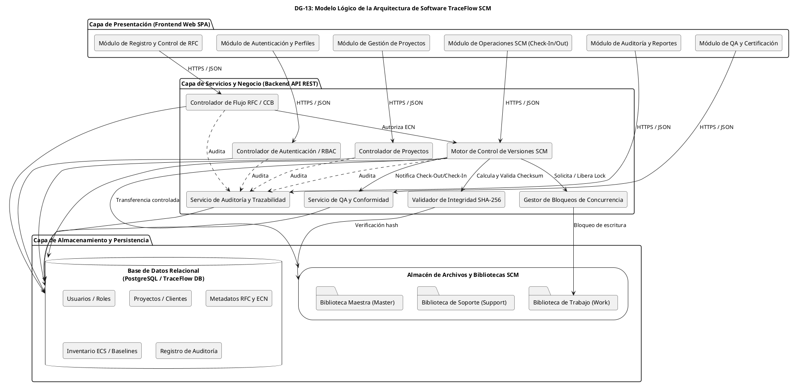
```plantuml
@startuml
skinparam shadowing false
skinparam roundcorner 8
skinparam defaultFontName Arial
skinparam componentStyle rectangle

title <b>DG-13: Modelo Lógico de la Arquitectura de Software TraceFlow SCM</b>

package "Capa de Presentación (Frontend Web SPA)" {
    component [Módulo de Autenticación y Perfiles] as UI_AUTH
    component [Módulo de Gestión de Proyectos] as UI_PROJ
    component [Módulo de Registro y Control de RFC] as UI_RFC
    component [Módulo de Operaciones SCM (Check-In/Out)] as UI_SCM
    component [Módulo de QA y Certificación] as UI_QA
    component [Módulo de Auditoría y Reportes] as UI_AUDIT
}

package "Capa de Servicios y Negocio (Backend API REST)" {
    component [Controlador de Autenticación / RBAC] as CTRL_AUTH
    component [Controlador de Proyectos] as CTRL_PROJ
    component [Controlador de Flujo RFC / CCB] as CTRL_RFC
    component [Motor de Control de Versiones SCM] as SCM_ENGINE
    component [Gestor de Bloqueos de Concurrencia] as LOCK_MGR
    component [Servicio de QA y Conformidad] as QA_SRV
    component [Validador de Integridad SHA-256] as HASH_VAL
    component [Servicio de Auditoría y Trazabilidad] as AUDIT_SRV
}

package "Capa de Almacenamiento y Persistencia" {
    database "Base de Datos Relacional\n(PostgreSQL / TraceFlow DB)" as DB {
        [Usuarios / Roles]
        [Proyectos / Clientes]
        [Metadatos RFC y ECN]
        [Inventario ECS / Baselines]
        [Registro de Auditoría]
    }
    
    storage "Almacén de Archivos y Bibliotecas SCM" as STORAGE {
        folder "Biblioteca de Trabajo (Work)" as LIB_WORK
        folder "Biblioteca de Soporte (Support)" as LIB_SUPPORT
        folder "Biblioteca Maestra (Master)" as LIB_MASTER
    }
}

UI_AUTH --> CTRL_AUTH : HTTPS / JSON
UI_PROJ --> CTRL_PROJ : HTTPS / JSON
UI_RFC --> CTRL_RFC : HTTPS / JSON
UI_SCM --> SCM_ENGINE : HTTPS / JSON
UI_QA --> QA_SRV : HTTPS / JSON
UI_AUDIT --> AUDIT_SRV : HTTPS / JSON

CTRL_RFC --> SCM_ENGINE : Autoriza ECN
SCM_ENGINE --> LOCK_MGR : Solicita / Libera Lock
SCM_ENGINE --> HASH_VAL : Calcula y Valida Checksum
SCM_ENGINE --> QA_SRV : Notifica Check-Out/Check-In

CTRL_AUTH ..> AUDIT_SRV : Audita
CTRL_PROJ ..> AUDIT_SRV : Audita
CTRL_RFC ..> AUDIT_SRV : Audita
SCM_ENGINE ..> AUDIT_SRV : Audita

CTRL_AUTH --> DB
CTRL_PROJ --> DB
CTRL_RFC --> DB
QA_SRV --> DB
AUDIT_SRV --> DB
SCM_ENGINE --> DB

SCM_ENGINE --> STORAGE : Transferencia controlada
LOCK_MGR --> LIB_WORK : Bloqueo de escritura
HASH_VAL --> STORAGE : Verificación hash

@enduml
```

<!-- Página 96 del PDF original -->

### 6.2.1. Diagrama de Secuencia

A continuación se presentan los diagramas de secuencia del modelo lógico de TraceFlow SCM, correspondientes a los escenarios de caso de uso detallados en la sección 6.1.3 y catalogados en `TB-11`:

**Diagrama DG-SEQ-01: Gestionar usuarios y roles (CU-01)**

#### Código PlantUML del Diagrama

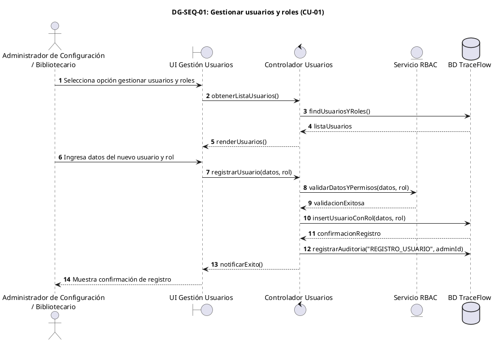
```plantuml
@startuml
skinparam shadowing false
skinparam roundcorner 8
skinparam defaultFontName Arial
autonumber

title <b>DG-SEQ-01: Gestionar usuarios y roles (CU-01)</b>

actor "Administrador de Configuración\n/ Bibliotecario" as ACT
boundary "UI Gestión Usuarios" as UI
control "Controlador Usuarios" as CTRL
entity "Servicio RBAC" as SRV
database "BD TraceFlow" as DB

ACT -> UI : Selecciona opción gestionar usuarios y roles
UI -> CTRL : obtenerListaUsuarios()
CTRL -> DB : findUsuariosYRoles()
DB --> CTRL : listaUsuarios
CTRL --> UI : renderUsuarios()

ACT -> UI : Ingresa datos del nuevo usuario y rol
UI -> CTRL : registrarUsuario(datos, rol)
CTRL -> SRV : validarDatosYPermisos(datos, rol)
SRV --> CTRL : validacionExitosa
CTRL -> DB : insertUsuarioConRol(datos, rol)
DB --> CTRL : confirmacionRegistro
CTRL -> DB : registrarAuditoria("REGISTRO_USUARIO", adminId)
CTRL --> UI : notificarExito()
UI --> ACT : Muestra confirmación de registro
@enduml
```

**Diagrama DG-SEQ-02: Crear y administrar proyectos (CU-02)**

#### Código PlantUML del Diagrama

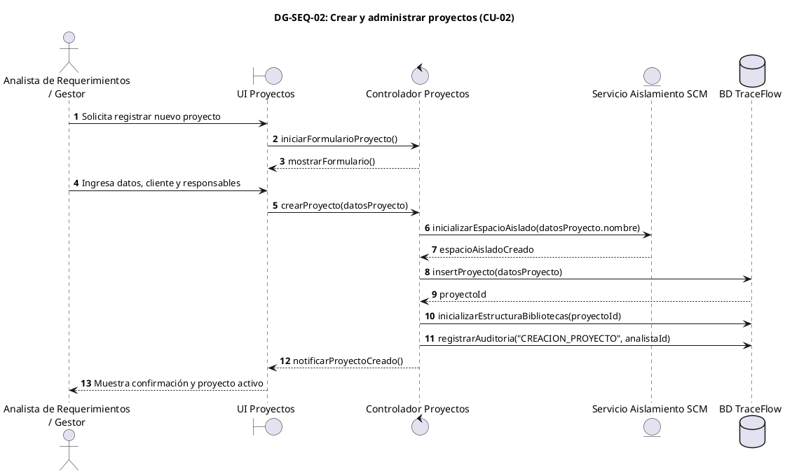
```plantuml
@startuml
skinparam shadowing false
skinparam roundcorner 8
skinparam defaultFontName Arial
autonumber

title <b>DG-SEQ-02: Crear y administrar proyectos (CU-02)</b>

actor "Analista de Requerimientos\n/ Gestor" as ACT
boundary "UI Proyectos" as UI
control "Controlador Proyectos" as CTRL
entity "Servicio Aislamiento SCM" as SRV
database "BD TraceFlow" as DB

ACT -> UI : Solicita registrar nuevo proyecto
UI -> CTRL : iniciarFormularioProyecto()
CTRL --> UI : mostrarFormulario()

ACT -> UI : Ingresa datos, cliente y responsables
UI -> CTRL : crearProyecto(datosProyecto)
CTRL -> SRV : inicializarEspacioAislado(datosProyecto.nombre)
SRV --> CTRL : espacioAisladoCreado
CTRL -> DB : insertProyecto(datosProyecto)
DB --> CTRL : proyectoId
CTRL -> DB : inicializarEstructuraBibliotecas(proyectoId)
CTRL -> DB : registrarAuditoria("CREACION_PROYECTO", analistaId)
CTRL --> UI : notificarProyectoCreado()
UI --> ACT : Muestra confirmación y proyecto activo
@enduml
```

**Diagrama DG-SEQ-03: Secuencia: Consultar proyecto (CU-03)**

#### Código PlantUML del Diagrama

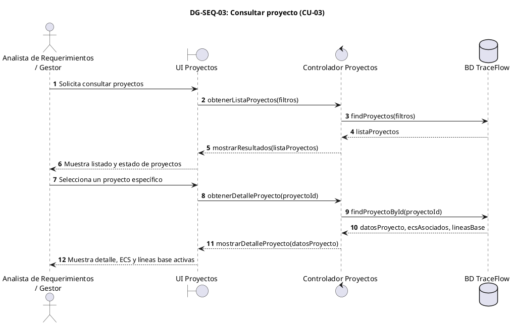
```plantuml
@startuml
skinparam shadowing false
skinparam roundcorner 8
skinparam defaultFontName Arial
autonumber

title <b>DG-SEQ-03: Consultar proyecto (CU-03)</b>

actor "Analista de Requerimientos\n/ Gestor" as ACT
boundary "UI Proyectos" as UI
control "Controlador Proyectos" as CTRL
database "BD TraceFlow" as DB

ACT -> UI : Solicita consultar proyectos
UI -> CTRL : obtenerListaProyectos(filtros)
CTRL -> DB : findProyectos(filtros)
DB --> CTRL : listaProyectos
CTRL --> UI : mostrarResultados(listaProyectos)
UI --> ACT : Muestra listado y estado de proyectos

ACT -> UI : Selecciona un proyecto específico
UI -> CTRL : obtenerDetalleProyecto(proyectoId)
CTRL -> DB : findProyectoById(proyectoId)
DB --> CTRL : datosProyecto, ecsAsociados, lineasBase
CTRL --> UI : mostrarDetalleProyecto(datosProyecto)
UI --> ACT : Muestra detalle, ECS y líneas base activas
@enduml
```

**Diagrama DG-SEQ-04: Registrar Solicitud de Cambio (RFC) (CU-04)**

#### Código PlantUML del Diagrama

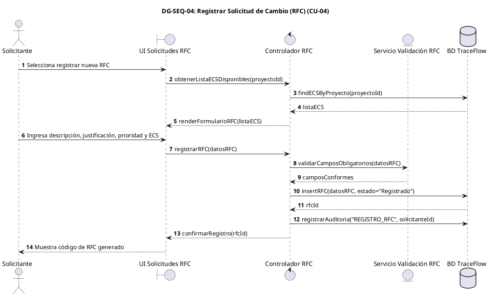
```plantuml
@startuml
skinparam shadowing false
skinparam roundcorner 8
skinparam defaultFontName Arial
autonumber

title <b>DG-SEQ-04: Registrar Solicitud de Cambio (RFC) (CU-04)</b>

actor "Solicitante" as ACT
boundary "UI Solicitudes RFC" as UI
control "Controlador RFC" as CTRL
entity "Servicio Validación RFC" as SRV
database "BD TraceFlow" as DB

ACT -> UI : Selecciona registrar nueva RFC
UI -> CTRL : obtenerListaECSDisponibles(proyectoId)
CTRL -> DB : findECSByProyecto(proyectoId)
DB --> CTRL : listaECS
CTRL --> UI : renderFormularioRFC(listaECS)

ACT -> UI : Ingresa descripción, justificación, prioridad y ECS
UI -> CTRL : registrarRFC(datosRFC)
CTRL -> SRV : validarCamposObligatorios(datosRFC)
SRV --> CTRL : camposConformes
CTRL -> DB : insertRFC(datosRFC, estado="Registrado")
DB --> CTRL : rfcId
CTRL -> DB : registrarAuditoria("REGISTRO_RFC", solicitanteId)
CTRL --> UI : confirmarRegistro(rfcId)
UI --> ACT : Muestra código de RFC generado
@enduml
```

**Diagrama DG-SEQ-05: Validar y clasificar la solicitud (CU-05)**

#### Código PlantUML del Diagrama

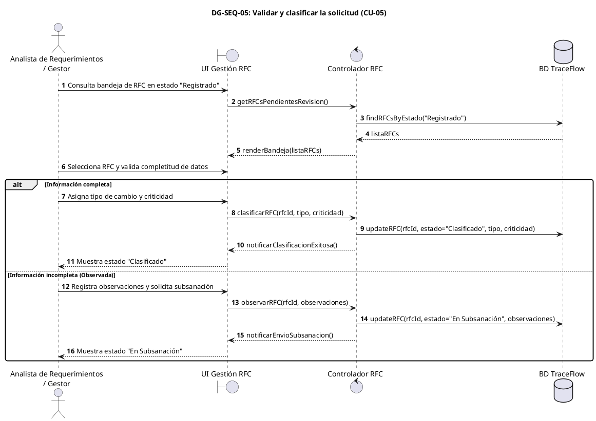
```plantuml
@startuml
skinparam shadowing false
skinparam roundcorner 8
skinparam defaultFontName Arial
autonumber

title <b>DG-SEQ-05: Validar y clasificar la solicitud (CU-05)</b>

actor "Analista de Requerimientos\n/ Gestor" as ACT
boundary "UI Gestión RFC" as UI
control "Controlador RFC" as CTRL
database "BD TraceFlow" as DB

ACT -> UI : Consulta bandeja de RFC en estado "Registrado"
UI -> CTRL : getRFCsPendientesRevision()
CTRL -> DB : findRFCsByEstado("Registrado")
DB --> CTRL : listaRFCs
CTRL --> UI : renderBandeja(listaRFCs)

ACT -> UI : Selecciona RFC y valida completitud de datos
alt Información completa
    ACT -> UI : Asigna tipo de cambio y criticidad
    UI -> CTRL : clasificarRFC(rfcId, tipo, criticidad)
    CTRL -> DB : updateRFC(rfcId, estado="Clasificado", tipo, criticidad)
    CTRL --> UI : notificarClasificacionExitosa()
    UI --> ACT : Muestra estado "Clasificado"
else Información incompleta (Observada)
    ACT -> UI : Registra observaciones y solicita subsanación
    UI -> CTRL : observarRFC(rfcId, observaciones)
    CTRL -> DB : updateRFC(rfcId, estado="En Subsanación", observaciones)
    CTRL --> UI : notificarEnvioSubsanacion()
    UI --> ACT : Muestra estado "En Subsanación"
end
@enduml
```

**Diagrama DG-SEQ-06: Realizar análisis de impacto técnico (CU-06)**

#### Código PlantUML del Diagrama

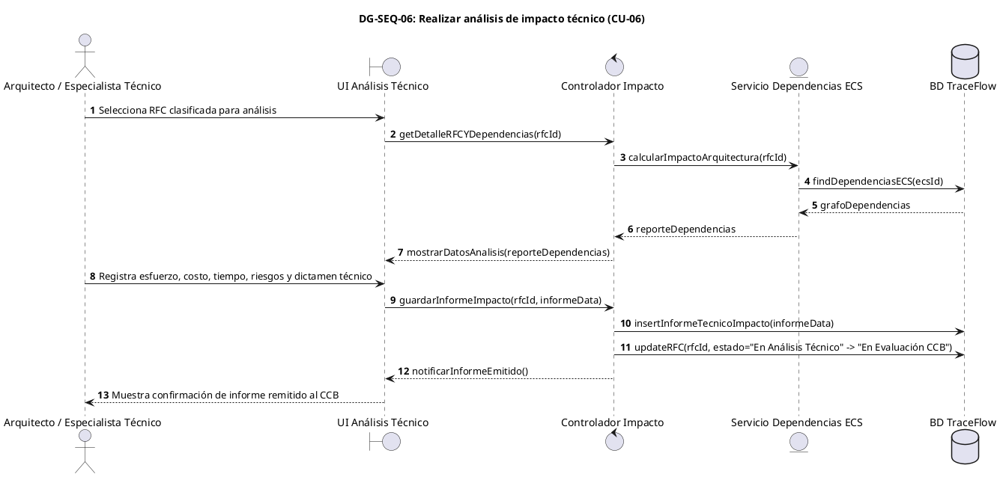
```plantuml
@startuml
skinparam shadowing false
skinparam roundcorner 8
skinparam defaultFontName Arial
autonumber

title <b>DG-SEQ-06: Realizar análisis de impacto técnico (CU-06)</b>

actor "Arquitecto / Especialista Técnico" as ACT
boundary "UI Análisis Técnico" as UI
control "Controlador Impacto" as CTRL
entity "Servicio Dependencias ECS" as SRV
database "BD TraceFlow" as DB

ACT -> UI : Selecciona RFC clasificada para análisis
UI -> CTRL : getDetalleRFCYDependencias(rfcId)
CTRL -> SRV : calcularImpactoArquitectura(rfcId)
SRV -> DB : findDependenciasECS(ecsId)
DB --> SRV : grafoDependencias
SRV --> CTRL : reporteDependencias
CTRL --> UI : mostrarDatosAnalisis(reporteDependencias)

ACT -> UI : Registra esfuerzo, costo, tiempo, riesgos y dictamen técnico
UI -> CTRL : guardarInformeImpacto(rfcId, informeData)
CTRL -> DB : insertInformeTecnicoImpacto(informeData)
CTRL -> DB : updateRFC(rfcId, estado="En Análisis Técnico" -> "En Evaluación CCB")
CTRL --> UI : notificarInformeEmitido()
UI --> ACT : Muestra confirmación de informe remitido al CCB
@enduml
```

**Diagrama DG-SEQ-07: Evaluar viabilidad y aprobación por el CCB (CU-07)**

#### Código PlantUML del Diagrama

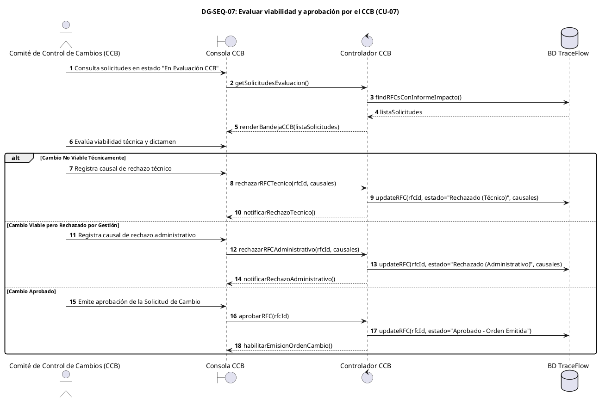
```plantuml
@startuml
skinparam shadowing false
skinparam roundcorner 8
skinparam defaultFontName Arial
autonumber

title <b>DG-SEQ-07: Evaluar viabilidad y aprobación por el CCB (CU-07)</b>

actor "Comité de Control de Cambios (CCB)" as ACT
boundary "Consola CCB" as UI
control "Controlador CCB" as CTRL
database "BD TraceFlow" as DB

ACT -> UI : Consulta solicitudes en estado "En Evaluación CCB"
UI -> CTRL : getSolicitudesEvaluacion()
CTRL -> DB : findRFCsConInformeImpacto()
DB --> CTRL : listaSolicitudes
CTRL --> UI : renderBandejaCCB(listaSolicitudes)

ACT -> UI : Evalúa viabilidad técnica y dictamen
alt Cambio No Viable Técnicamente
    ACT -> UI : Registra causal de rechazo técnico
    UI -> CTRL : rechazarRFCTecnico(rfcId, causales)
    CTRL -> DB : updateRFC(rfcId, estado="Rechazado (Técnico)", causales)
    CTRL --> UI : notificarRechazoTecnico()
else Cambio Viable pero Rechazado por Gestión
    ACT -> UI : Registra causal de rechazo administrativo
    UI -> CTRL : rechazarRFCAdministrativo(rfcId, causales)
    CTRL -> DB : updateRFC(rfcId, estado="Rechazado (Administrativo)", causales)
    CTRL --> UI : notificarRechazoAdministrativo()
else Cambio Aprobado
    ACT -> UI : Emite aprobación de la Solicitud de Cambio
    UI -> CTRL : aprobarRFC(rfcId)
    CTRL -> DB : updateRFC(rfcId, estado="Aprobado - Orden Emitida")
    CTRL --> UI : habilitarEmisionOrdenCambio()
end
@enduml
```

**Diagrama DG-SEQ-08: Emitir Orden de Cambio (ECN/ECO) (CU-08)**

#### Código PlantUML del Diagrama

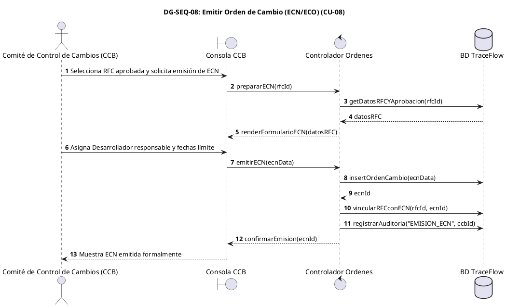
```plantuml
@startuml
skinparam shadowing false
skinparam roundcorner 8
skinparam defaultFontName Arial
autonumber

title <b>DG-SEQ-08: Emitir Orden de Cambio (ECN/ECO) (CU-08)</b>

actor "Comité de Control de Cambios (CCB)" as ACT
boundary "Consola CCB" as UI
control "Controlador Ordenes" as CTRL
database "BD TraceFlow" as DB

ACT -> UI : Selecciona RFC aprobada y solicita emisión de ECN
UI -> CTRL : prepararECN(rfcId)
CTRL -> DB : getDatosRFCYAprobacion(rfcId)
DB --> CTRL : datosRFC
CTRL --> UI : renderFormularioECN(datosRFC)

ACT -> UI : Asigna Desarrollador responsable y fechas límite
UI -> CTRL : emitirECN(ecnData)
CTRL -> DB : insertOrdenCambio(ecnData)
DB --> CTRL : ecnId
CTRL -> DB : vincularRFCconECN(rfcId, ecnId)
CTRL -> DB : registrarAuditoria("EMISION_ECN", ccbId)
CTRL --> UI : confirmarEmision(ecnId)
UI --> ACT : Muestra ECN emitida formalmente
@enduml
```

**Diagrama DG-SEQ-09: Registrar ECS (CU-09)**

#### Código PlantUML del Diagrama

```plantuml
@startuml
skinparam shadowing false
skinparam roundcorner 8
skinparam defaultFontName Arial
autonumber

title <b>DG-SEQ-09: Registrar ECS (CU-09)</b>

actor "Arquitecto / Especialista Técnico" as ACT
boundary "UI Gestión ECS" as UI
control "Controlador ECS" as CTRL
database "BD TraceFlow" as DB

ACT -> UI : Selecciona registrar nuevo Elemento de Configuración
UI -> CTRL : getProyectosYTiposECS()
CTRL -> DB : findTiposECS()
DB --> CTRL : tiposECS
CTRL --> UI : renderFormularioECS(tiposECS)

ACT -> UI : Ingresa nombre, tipo (código/doc/bd), proyecto y ruta
UI -> CTRL : registrarECS(datosECS)
CTRL -> DB : insertECS(datosECS, estado="Identificado")
DB --> CTRL : ecsId
CTRL -> DB : inicializarHistorialVersiones(ecsId, version="1.0.0")
CTRL --> UI : notificarRegistroExitoso(ecsId)
UI --> ACT : Muestra confirmación de ECS catalogado
@enduml
```

**Diagrama DG-SEQ-10: Efectuar Check-Out y bloqueo (CU-10)**

#### Código PlantUML del Diagrama

```plantuml
@startuml
skinparam shadowing false
skinparam roundcorner 8
skinparam defaultFontName Arial
autonumber

title <b>DG-SEQ-10: Efectuar Check-Out y aplicar bloqueo (CU-10)</b>

actor "Administrador de Configuración\n/ Bibliotecario" as ACT
boundary "UI Gestión Bibliotecas" as UI
control "Controlador Bibliotecas" as CTRL
entity "Servicio Bloqueos SCM" as SRV
database "BD TraceFlow" as DB

ACT -> UI : Selecciona ECN autorizada y solicita Check-Out del ECS
UI -> CTRL : ejecutarCheckOut(ecnId, ecsId)
CTRL -> SRV : verificarDisponibilidadBloqueo(ecsId)
alt ECS ya se encuentra bloqueado
    SRV --> CTRL : error("ECS bloqueado por otro usuario")
    CTRL --> UI : mostrarErrorBloqueoActivo()
    UI --> ACT : Informa que el ECS está en edición concurrente
else ECS disponible
    SRV -> DB : insertBloqueoSincronizacion(ecsId, ecnId, devId)
    CTRL -> DB : transferirECS(ecsId, "Biblioteca Soporte", "Biblioteca Trabajo")
    CTRL -> DB : updateEstadoRFC(rfcId, "En Implementación")
    CTRL -> DB : registrarAuditoria("CHECK_OUT", ecsId, adminId)
    CTRL --> UI : confirmarCheckOutExitoso()
    UI --> ACT : Muestra ECS transferido con bloqueo activo
end
@enduml
```

**Diagrama DG-SEQ-11: Aplicar bloqueo de sincronización (CU-11)**

#### Código PlantUML del Diagrama

```plantuml
@startuml
skinparam shadowing false
skinparam roundcorner 8
skinparam defaultFontName Arial
autonumber

title <b>DG-SEQ-11: Aplicar bloqueo de sincronización (CU-11)</b>

actor "Administrador de Configuración\n/ Bibliotecario" as ACT
boundary "UI Bloqueos SCM" as UI
control "Controlador Bloqueos" as CTRL
database "BD TraceFlow" as DB

ACT -> UI : Consulta estado de bloqueos del ECS
UI -> CTRL : getEstadoBloqueo(ecsId)
CTRL -> DB : findBloqueoByECS(ecsId)
DB --> CTRL : estadoBloqueo
CTRL --> UI : mostrarDetalleBloqueo(estadoBloqueo)

ACT -> UI : Confirma imposición / verificación de bloqueo
UI -> CTRL : aplicarBloqueo(ecsId, motivo)
CTRL -> DB : updateBloqueo(ecsId, estado="ACTIVO", motivo)
CTRL -> DB : registrarAuditoria("BLOQUEO_APLICADO", ecsId)
CTRL --> UI : notificarBloqueoActivo()
UI --> ACT : Muestra bloqueo activo en Biblioteca de Trabajo
@enduml
```

**Diagrama DG-SEQ-12: Efectuar Check-In a Biblioteca Maestra (CU-12)**

#### Código PlantUML del Diagrama

```plantuml
@startuml
skinparam shadowing false
skinparam roundcorner 8
skinparam defaultFontName Arial
autonumber

title <b>DG-SEQ-12: Efectuar Check-In a Biblioteca Maestra (CU-12)</b>

actor "Administrador de Configuración\n/ Bibliotecario" as ACT
boundary "UI Gestión Bibliotecas" as UI
control "Controlador Bibliotecas" as CTRL
entity "Servicio Certificación QA" as SRV_QA
database "BD TraceFlow" as DB

ACT -> UI : Selecciona ECS certificado para Check-In
UI -> CTRL : solicitarCheckIn(ecsId, ecnId, mensajeVersion)
CTRL -> SRV_QA : verificarCertificacionConformidad(ecnId)
SRV_QA -> DB : findCertificacionByECN(ecnId)
DB --> SRV_QA : certificacionValida
SRV_QA --> CTRL : autorizacionConforme

CTRL -> DB : transferirECS(ecsId, "Biblioteca Trabajo", "Biblioteca Maestra")
CTRL -> DB : releaseBloqueoSincronizacion(ecsId)
CTRL -> DB : insertVersionHistorial(ecsId, mensajeVersion)
CTRL -> DB : registrarAuditoria("CHECK_IN_MAESTRA", ecsId, adminId)
CTRL --> UI : notificarCheckInCompletado()
UI --> ACT : Muestra ECS integrado y bloqueo liberado
@enduml
```

**Diagrama DG-SEQ-13: Consultar historial de versiones (CU-13)**

#### Código PlantUML del Diagrama

```plantuml
@startuml
skinparam shadowing false
skinparam roundcorner 8
skinparam defaultFontName Arial
autonumber

title <b>DG-SEQ-13: Consultar historial de versiones (CU-13)</b>

actor "Administrador de Configuración\n/ Bibliotecario" as ACT
boundary "UI Trazabilidad Versiones" as UI
control "Controlador Historial" as CTRL
database "BD TraceFlow" as DB

ACT -> UI : Selecciona ECS y solicita ver historial
UI -> CTRL : getHistorialVersiones(ecsId)
CTRL -> DB : findVersionesByECS(ecsId)
DB --> CTRL : listaVersionesConHashYAutor
CTRL --> UI : renderHistorial(listaVersiones)

ACT -> UI : Selecciona versión específica para comparar
UI -> CTRL : compararVersiones(versionA, versionB)
CTRL -> DB : getDiffEntreVersiones(versionA, versionB)
DB --> CTRL : diffData
CTRL --> UI : renderComparador(diffData)
UI --> ACT : Muestra diferencias y trazabilidad de cambios
@enduml
```

**Diagrama DG-SEQ-14: Implementar cambio en el ECS (CU-14)**

#### Código PlantUML del Diagrama

```plantuml
@startuml
skinparam shadowing false
skinparam roundcorner 8
skinparam defaultFontName Arial
autonumber

title <b>DG-SEQ-14: Implementar cambio en el ECS (CU-14)</b>

actor "Ingeniero de Software\n/ Desarrollador" as ACT
boundary "UI Espacio de Trabajo" as UI
control "Controlador Trabajo" as CTRL
database "Biblioteca de Trabajo" as LIB_WRK

ACT -> UI : Accede al ECS autorizado bajo Check-Out
UI -> CTRL : obtenerCopiaTrabajo(ecsId, ecnId)
CTRL -> LIB_WRK : getArchivoECS(ecsId)
LIB_WRK --> CTRL : archivoFuente
CTRL --> UI : cargarEntornoEdicion(archivoFuente)

ACT -> UI : Realiza modificaciones requeridas por la ECN
ACT -> UI : Guarda avances intermedios
UI -> CTRL : guardarCambiosEnTrabajo(ecsId, contenidoModificado)
CTRL -> LIB_WRK : updateArchivoTrabajo(ecsId, contenidoModificado)
LIB_WRK --> CTRL : guardadoExitoso
CTRL --> UI : notificarGuardado()
UI --> ACT : Confirma actualización local en Biblioteca de Trabajo
@enduml
```

**Diagrama DG-SEQ-15: Ejecutar pruebas unitarias locales (CU-15)**

#### Código PlantUML del Diagrama

```plantuml
@startuml
skinparam shadowing false
skinparam roundcorner 8
skinparam defaultFontName Arial
autonumber

title <b>DG-SEQ-15: Ejecutar pruebas unitarias locales (CU-15)</b>

actor "Ingeniero de Software\n/ Desarrollador" as ACT
boundary "UI Pruebas Locales" as UI
control "Runner Pruebas Unitarias" as RUNNER
database "Biblioteca de Trabajo" as LIB_WRK

ACT -> UI : Solicita ejecución de suite unitaria local
UI -> RUNNER : ejecutarPruebasUnitarias(ecsId)
RUNNER -> LIB_WRK : cargarModuloModificado(ecsId)
RUNNER -> RUNNER : ejecutarTests()
RUNNER --> UI : reporteResultados(testsPasados, fallos)

alt Pruebas aprobadas (100% éxito)
    UI --> ACT : Muestra resultado conforme; habilita entrega a QA
else Pruebas con fallos
    UI --> ACT : Muestra fallos y líneas con errores para corrección
end
@enduml
```

**Diagrama DG-SEQ-16: Ejecutar pruebas de integración (CU-16)**

#### Código PlantUML del Diagrama

```plantuml
@startuml
skinparam shadowing false
skinparam roundcorner 8
skinparam defaultFontName Arial
autonumber

title <b>DG-SEQ-16: Ejecutar pruebas de integración (CU-16)</b>

actor "Equipo de Calidad / Testing" as ACT
boundary "UI Calidad y Pruebas" as UI
control "Controlador QA" as CTRL
database "Biblioteca de Soporte" as LIB_SUP

ACT -> UI : Selecciona cambio entregado para validación
UI -> CTRL : iniciarValidacionIntegracion(ecnId)
CTRL -> LIB_SUP : desplegarEntornoPruebas(ecnId)
CTRL -> CTRL : ejecutarBateriaIntegracionYFuncional()
CTRL --> UI : reporteQA(casosPrueba, conformidades, noConformidades)
UI --> ACT : Visualiza matriz de resultados de pruebas
@enduml
```

**Diagrama DG-SEQ-17: Certificar conformidad del cambio (CU-17)**

#### Código PlantUML del Diagrama

```plantuml
@startuml
skinparam shadowing false
skinparam roundcorner 8
skinparam defaultFontName Arial
autonumber

title <b>DG-SEQ-17: Certificar conformidad del cambio (CU-17)</b>

actor "Equipo de Calidad / Testing" as ACT
boundary "UI Calidad y Pruebas" as UI
control "Controlador QA" as CTRL
database "BD TraceFlow" as DB

ACT -> UI : Confirma aprobación de todas las pruebas QA
UI -> CTRL : certificarCambio(ecnId, actaPruebas)
CTRL -> DB : insertCertificacionConformidad(ecnId, actaPruebas, qaId)
CTRL -> DB : updateEstadoRFC(rfcId, "En Validación QA" -> "Certificado")
CTRL -> DB : registrarAuditoria("CERTIFICACION_CONFORMIDAD", ecnId)
CTRL --> UI : notificarCertificacionExitosa()
UI --> ACT : Muestra Certificado de Conformidad emitido
@enduml
```

<!-- PENDIENTE DE VALIDACION: El mensaje updateEstadoRFC(..., 'Certificado') utiliza un estado que no pertenece a la máquina de estados de la RFC de la sección 5.3. -->

**Diagrama DG-SEQ-18: Reportar no conformidad (CU-18)**

#### Código PlantUML del Diagrama

```plantuml
@startuml
skinparam shadowing false
skinparam roundcorner 8
skinparam defaultFontName Arial
autonumber

title <b>DG-SEQ-18: Reportar no conformidad (CU-18)</b>

actor "Equipo de Calidad / Testing" as ACT
boundary "UI Hallazgos QA" as UI
control "Controlador Hallazgos" as CTRL
database "BD TraceFlow" as DB

ACT -> UI : Registra defectos encontrados en validación
UI -> CTRL : reportarNoConformidad(ecnId, hallazgos, severidad)
CTRL -> DB : insertNoConformidad(ecnId, hallazgos, severidad)
CTRL -> DB : updateEstadoRFC(rfcId, "En Corrección")
CTRL -> DB : notificarDesarrollador(ecnId, hallazgos)
CTRL --> UI : confirmarRegistroNoConformidad()
UI --> ACT : Muestra no conformidad registrada y asignada
@enduml
```

**Diagrama DG-SEQ-19: Reevaluar y re-testear (CU-19)**

#### Código PlantUML del Diagrama

```plantuml
@startuml
skinparam shadowing false
skinparam roundcorner 8
skinparam defaultFontName Arial
autonumber

title <b>DG-SEQ-19: Reevaluar y re-testear (CU-19)</b>

actor "Equipo de Calidad / Testing" as ACT
boundary "UI Re-testeo QA" as UI
control "Controlador ReTest" as CTRL
database "BD TraceFlow" as DB

ACT -> UI : Selecciona corrección entregada por Desarrollador
UI -> CTRL : iniciarReTest(noConformidadId)
CTRL -> CTRL : ejecutarPruebasAfectadas()

alt Defecto corregido satisfactoriamente
    CTRL -> DB : updateNoConformidad(id, estado="SUBSANADA")
    CTRL --> UI : habilitarCertificacion()
    UI --> ACT : Muestra prueba superada
else Defecto persiste y se agotaron reintentos
    CTRL -> DB : updateNoConformidad(id, estado="FALLO_PERSISTENTE")
    CTRL -> DB : dispararAlertaRollback(ecnId)
    CTRL --> UI : notificarDerivacionRollback()
    UI --> ACT : Muestra alerta de fallo no subsanado
end
@enduml
```

**Diagrama DG-SEQ-20: Crear y congelar línea base (CU-20)**

#### Código PlantUML del Diagrama

```plantuml
@startuml
skinparam shadowing false
skinparam roundcorner 8
skinparam defaultFontName Arial
autonumber

title <b>DG-SEQ-20: Crear y congelar línea base (CU-20)</b>

actor "Administrador de Configuración\n/ Bibliotecario" as ACT
boundary "UI Líneas Base" as UI
control "Controlador Líneas Base" as CTRL
database "BD TraceFlow" as DB

ACT -> UI : Selecciona ECS certificado en Biblioteca Maestra
UI -> CTRL : solicitarCreacionLineaBase(proyectoId, ecsId)
CTRL --> UI : mostrarFormularioLineaBase()

ACT -> UI : Ingresa versión (mayor.menor.parche) y descripción
UI -> CTRL : congelarLineaBase(proyectoId, version, ecsLista)
CTRL -> DB : validarFormatoVersion(version)
CTRL -> DB : insertLineaBase(proyectoId, version, estado="CONGELADA")
DB --> CTRL : lineaBaseId
CTRL -> DB : vincularECSaLineaBase(lineaBaseId, ecsLista)
CTRL -> DB : registrarAuditoria("LINEA_BASE_CONGELADA", lineaBaseId, adminId)
CTRL --> UI : confirmarLineaBaseCongelada()
UI --> ACT : Muestra nueva Línea Base registrada y protegida
@enduml
```

**Diagrama DG-SEQ-21: Ejecutar rollback en Biblioteca de Trabajo (CU-21)**

#### Código PlantUML del Diagrama

```plantuml
@startuml
skinparam shadowing false
skinparam roundcorner 8
skinparam defaultFontName Arial
autonumber

title <b>DG-SEQ-21: Ejecutar rollback en Biblioteca de Trabajo (CU-21)</b>

actor "Administrador de Configuración\n/ Bibliotecario" as ACT
boundary "UI Gestión Rollback" as UI
control "Controlador Rollback" as CTRL
database "Biblioteca de Trabajo" as LIB_WRK
database "Biblioteca de Soporte" as LIB_SUP
database "BD TraceFlow" as DB

ACT -> UI : Confirma ejecución de Rollback por fallo persistente
UI -> CTRL : ejecutarRollbackTrabajo(ecsId, ecnId)
CTRL -> LIB_SUP : getCopiaOriginalPrevia(ecsId)
LIB_SUP --> CTRL : archivoOriginal
CTRL -> LIB_WRK : sobreescribirConOriginal(ecsId, archivoOriginal)
LIB_WRK --> CTRL : restauradoExitoso

CTRL -> DB : releaseBloqueoSincronizacion(ecsId)
CTRL -> DB : registrarAuditoria("ROLLBACK_TRABAJO", ecsId, ecnId)
CTRL --> UI : notificarRollbackCompletado()
UI --> ACT : Muestra estado previo restaurado y bloqueo liberado
@enduml
```

**Diagrama DG-SEQ-22: Cancelar Orden de Cambio (CU-22)**

#### Código PlantUML del Diagrama

```plantuml
@startuml
skinparam shadowing false
skinparam roundcorner 8
skinparam defaultFontName Arial
autonumber

title <b>DG-SEQ-22: Cancelar Orden de Cambio (CU-22)</b>

actor "Administrador de Configuración\n/ Bibliotecario" as ACT
boundary "UI Cancelación SCM" as UI
control "Controlador Cierre" as CTRL
database "BD TraceFlow" as DB

ACT -> UI : Selecciona ECN tras ejecución de Rollback
UI -> CTRL : cancelarOrdenCambio(ecnId, causa="Fallo No Subsanado")
CTRL -> DB : updateECN(ecnId, estado="CANCELADA")
CTRL -> DB : updateRFC(rfcId, estado="Cancelado (Fallo No Subsanado)")
CTRL -> DB : notificarSolicitante(rfcId, "Cancelado por Fallo No Subsanado")
CTRL -> DB : registrarAuditoria("CANCELACION_ECN", ecnId)
CTRL --> UI : confirmarCancelacionFormal()
UI --> ACT : Muestra ECN cancelada y trámite cerrado
@enduml
```

**Diagrama DG-SEQ-23: Registrar incidencia (CU-23)**

#### Código PlantUML del Diagrama

```plantuml
@startuml
skinparam shadowing false
skinparam roundcorner 8
skinparam defaultFontName Arial
autonumber

title <b>DG-SEQ-23: Registrar incidencia (CU-23)</b>

actor "Solicitante" as ACT
boundary "UI Mesa de Ayuda" as UI
control "Controlador Tickets" as CTRL
database "BD TraceFlow" as DB

ACT -> UI : Ingresa al portal de soporte y selecciona nueva incidencia
UI -> CTRL : getProyectosDisponibles()
CTRL -> DB : findProyectosCliente(solicitanteId)
DB --> CTRL : listaProyectos
CTRL --> UI : mostrarFormularioTicket(listaProyectos)

ACT -> UI : Ingresa título, descripción de falla y severidad
UI -> CTRL : crearTicket(ticketData)
CTRL -> DB : insertTicketIncidencia(ticketData, estado="Abierto")
DB --> CTRL : ticketId
CTRL --> UI : notificarTicketCreado(ticketId)
UI --> ACT : Muestra confirmación con número de ticket
@enduml
```

**Diagrama DG-SEQ-24: Consultar estado de ticket (CU-24)**

#### Código PlantUML del Diagrama

```plantuml
@startuml
skinparam shadowing false
skinparam roundcorner 8
skinparam defaultFontName Arial
autonumber

title <b>DG-SEQ-24: Consultar estado de ticket (CU-24)</b>

actor "Solicitante" as ACT
boundary "UI Mesa de Ayuda" as UI
control "Controlador Tickets" as CTRL
database "BD TraceFlow" as DB

ACT -> UI : Ingresa número de ticket o consulta historial
UI -> CTRL : getEstadoTicket(ticketId)
CTRL -> DB : findTicketById(ticketId)
DB --> CTRL : ticketDetalleYHistorial
CTRL --> UI : renderEstadoTicket(ticketDetalleYHistorial)
UI --> ACT : Muestra estado actual, respuestas y RFC asociada
@enduml
```

**Diagrama DG-SEQ-25: Derivar incidencia a RFC (CU-25)**

#### Código PlantUML del Diagrama

```plantuml
@startuml
skinparam shadowing false
skinparam roundcorner 8
skinparam defaultFontName Arial
autonumber

title <b>DG-SEQ-25: Derivar incidencia a RFC (CU-25)</b>

actor "Analista de Requerimientos\n/ Gestor" as ACT
boundary "UI Soporte / Analista" as UI
control "Controlador Incidencias" as CTRL
database "BD TraceFlow" as DB

ACT -> UI : Evalúa ticket de incidencia abierto
UI -> CTRL : analizarTicket(ticketId)
CTRL --> UI : mostrarDatosTicket()

ACT -> UI : Selecciona opción "Derivar a Solicitud de Cambio"
UI -> CTRL : derivarTicketARFC(ticketId, datosRFC)
CTRL -> DB : insertRFC(datosRFC, origen="TICKET", ticketId)
DB --> CTRL : rfcId
CTRL -> DB : updateTicket(ticketId, estado="Derivado", rfcId)
CTRL -> DB : registrarAuditoria("DERIVACION_INCIDENCIA_A_RFC", ticketId, rfcId)
CTRL --> UI : notificarDerivacionExitosa(rfcId)
UI --> ACT : Muestra RFC generada vinculada al ticket
@enduml
```

**Diagrama DG-SEQ-26: Validar integridad SHA-256 (CU-26)**

#### Código PlantUML del Diagrama

```plantuml
@startuml
skinparam shadowing false
skinparam roundcorner 8
skinparam defaultFontName Arial
autonumber

title <b>DG-SEQ-26: Validar integridad mediante checksum SHA-256 (CU-26)</b>

actor "Administrador de Configuración\n/ Bibliotecario" as ACT
boundary "UI Auditoría SCM" as UI
control "Controlador Integridad" as CTRL
entity "Motor Criptográfico" as HASH
database "Repositorio ECS" as REPO
database "BD TraceFlow" as DB

ACT -> UI : Solicita verificación de integridad de un ECS
UI -> CTRL : validarChecksum(ecsId, version)
CTRL -> REPO : leerArchivo(ecsId, version)
REPO --> CTRL : streamBytes
CTRL -> HASH : calcularSHA256(streamBytes)
HASH --> CTRL : hashCalculado

CTRL -> DB : getChecksumRegistrado(ecsId, version)
DB --> CTRL : hashAlmacenado

alt Hash idéntico
    CTRL --> UI : reporteIntegridad("INTEGRO", hashCalculado)
    UI --> ACT : Muestra verificación exitosa
else Hash divergente
    CTRL -> DB : registrarAlertaSeguridad("INTEGRIDAD_COMPROMETIDA", ecsId)
    CTRL --> UI : reporteIntegridad("ALTERADO", hashCalculado, hashAlmacenado)
    UI --> ACT : Alerta de corrupción o alteración no autorizada
end
@enduml
```

**Diagrama DG-SEQ-27: Auditar acciones del sistema (CU-27)**

#### Código PlantUML del Diagrama

```plantuml
@startuml
skinparam shadowing false
skinparam roundcorner 8
skinparam defaultFontName Arial
autonumber

title <b>DG-SEQ-27: Auditar acciones del sistema (CU-27)</b>

actor "Comité de Control de Cambios (CCB)" as ACT
boundary "UI Auditoría" as UI
control "Controlador Auditoría" as CTRL
database "BD TraceFlow (Logs)" as DB

ACT -> UI : Define filtros de auditoría (fechas, usuario, ECS, acción)
UI -> CTRL : consultarLogsAuditoria(filtros)
CTRL -> DB : findLogsAudit(filtros)
DB --> CTRL : registrosAuditoria
CTRL --> UI : renderResultadosAuditoria(registrosAuditoria)

ACT -> UI : Solicita exportación de pista de auditoría
UI -> CTRL : exportarPistaAuditoria(filtros)
CTRL --> UI : archivoDescarga (PDF/CSV)
UI --> ACT : Entrega reporte formal de auditoría
@enduml
```

**Diagrama DG-SEQ-28: Generar reportes de estado (CU-28)**

#### Código PlantUML del Diagrama

```plantuml
@startuml
skinparam shadowing false
skinparam roundcorner 8
skinparam defaultFontName Arial
autonumber

title <b>DG-SEQ-28: Generar reportes de estado (CU-28)</b>

actor "Administrador de Configuración\n/ Bibliotecario" as ACT
boundary "UI Reportes" as UI
control "Controlador Reportes" as CTRL
database "BD TraceFlow" as DB

ACT -> UI : Selecciona tipo de reporte (inventario ECS, estado RFC, actas)
UI -> CTRL : generarReporte(tipoReporte, proyectoId)
CTRL -> DB : consolidarDatosReporte(tipoReporte, proyectoId)
DB --> CTRL : datosConsolidados
CTRL -> CTRL : compilarDocumentoReporte(datosConsolidados)
CTRL --> UI : mostrarVistaPreviaReporte()
UI --> ACT : Presenta vista previa y botón de descarga
@enduml
```

### 6.2.2. Diagrama de Clases

Nota: Elaboración Propia

**Diagrama DG-12: Diagrama de Clases del Dominio TraceFlow SCM**

#### Código PlantUML del Diagrama

```plantuml
@startuml
skinparam shadowing false
skinparam roundcorner 8
skinparam defaultFontName Arial
skinparam classAttributeIconSize 0

title <b>DG-12: Diagrama de Clases del Dominio TraceFlow SCM</b>

class Usuario {
    - id: Long
    - nombre: String
    - email: String
    - passwordHash: String
    - rol: RolUsuario
    - estado: EstadoUsuario
    + registrar()
    + autenticar()
    + asignarRol(rol: RolUsuario)
}

enum RolUsuario {
    SOLICITANTE
    ANALISTA_REQUERIMIENTOS
    ARQUITECTO
    CCB
    ADMIN_CONFIGURACION
    INGENIERO_SOFTWARE
    EQUIPO_CALIDAD
}

class Proyecto {
    - id: Long
    - codigo: String
    - nombre: String
    - descripcion: String
    - cliente: String
    - estado: EstadoProyecto
    - fechaCreacion: DateTime
    + crearProyecto()
    + consultarProyecto()
}

class ElementoConfiguracion {
    - id: Long
    - codigo: String
    - nombre: String
    - tipo: TipoECS
    - rutaArchivo: String
    - versionActual: String
    - checksumSHA256: String
    - estadoBloqueo: EstadoBloqueo
    - bibliotecaActual: TipoBiblioteca
    + registrarECS()
    + verificarIntegridad(): Boolean
    + bloquear(ordenId: Long)
    + liberarBloqueo()
}

enum TipoBiblioteca {
    TRABAJO
    SOPORTE
    MAESTRA
}

class SolicitudCambio {
    - id: Long
    - codigo: String
    - descripcion: String
    - justificacion: String
    - prioridad: Prioridad
    - estado: EstadoRFC
    - fechaRegistro: DateTime
    + registrarRFC()
    + validar()
    + subsanar()
    + evaluarCCB()
}

class InformeImpacto {
    - id: Long
    - impactoArquitectura: String
    - esfuerzoHoras: Integer
    - costoEstimado: Decimal
    - tiempoEstimadoDias: Integer
    - nivelRiesgo: NivelRiesgo
    - fechaElaboracion: DateTime
    + registrarInforme()
}

class OrdenCambio {
    - id: Long
    - codigo: String
    - fechaEmision: DateTime
    - estado: EstadoOrden
    + emitirOrden()
    + cancelarOrden(motivo: String)
    + cerrarOrden()
}

class CertificadoConformidad {
    - id: Long
    - resultado: ResultadoPrueba
    - observaciones: String
    - fechaCertificacion: DateTime
    + emitirCertificado()
}

class NoConformidad {
    - id: Long
    - hallazgos: String
    - severidad: Severidad
    - fechaRegistro: DateTime
    + registrarNoConformidad()
}

class LineaBase {
    - id: Long
    - codigo: String
    - nombre: String
    - version: String
    - estado: EstadoLineaBase
    - fechaCongelacion: DateTime
    + crearLineaBase()
    + congelar()
}

class TicketIncidencia {
    - id: Long
    - codigo: String
    - titulo: String
    - descripcion: String
    - estado: EstadoTicket
    - fechaRegistro: DateTime
    + registrarTicket()
    + derivarARFC(): SolicitudCambio
}

class RegistroAuditoria {
    - id: Long
    - accion: String
    - modulo: String
    - ipOrigen: String
    - timestamp: DateTime
    - hashRegistro: String
    + registrarEvento()
}

Usuario "1" --> "*" Proyecto : administra / participa
Proyecto "1" *-- "*" ElementoConfiguracion : contiene
Usuario "1" --> "*" SolicitudCambio : solicita
SolicitudCambio "1" --> "1" ElementoConfiguracion : afecta
SolicitudCambio "1" --> "0..1" InformeImpacto : tiene
SolicitudCambio "1" --> "0..1" OrdenCambio : genera
OrdenCambio "1" --> "0..1" CertificadoConformidad : valida
OrdenCambio "1" --> "*" NoConformidad : registra
Proyecto "1" *-- "*" LineaBase : define
LineaBase "1" o-- "1..*" ElementoConfiguracion : congela
TicketIncidencia "0..1" --> "0..1" SolicitudCambio : deriva en
RegistroAuditoria "*" --> "1" Usuario : generado por

@enduml
```

<!-- Página 116 del PDF original -->

## 6.3. Matrices de Trazabilidad SCM

En cumplimiento del estándar de gobernanza documental definido en docs/DOCUMENTATION_RULES.md, a continuación se presentan las matrices de trazabilidad oficiales del proyecto TraceFlow SCM extraídas de la fuente oficial docs/TABLES.md, garantizando la relación bidireccional entre requerimientos, reglas de negocio, casos de uso y actores responsables:

# TB-12 — Matriz de Trazabilidad: Requerimientos Funcionales vs Casos de Uso

**Estado:** APROBADO  
**Fuente:** Derivada de las narrativas explícitas en `FD03-EPIS-Informe_SRS.md`, Sección 6.1.3 y actualización TO-BE v2  

| ID RF | Nombre del Requerimiento Funcional | Casos de Uso que lo Instrumentan (Código Oficial / Original) | Sustento Documental (Campo Requerimiento Asociado en CU) |
| :--- | :--- | :--- | :--- |
| RF-01 | Gestión de Usuarios y Roles | CU-01 (CUS01) | Explícito en CUS01 |
| RF-02 | Gestión de Proyectos | CU-02 (CUS02), CU-03 (CUS03) | Explícito en CUS02 y CUS03 |
| RF-03 | Identificación de ECS | CU-09 (CUS09) | Explícito en CUS09 |
| RF-04 | Registro de Solicitudes de Cambio (RFC) | CU-04 (CUS04), CU-05 (CUS05) | Explícito en CUS04 y CUS05 |
| RF-05 | Clasificación y Análisis de Impacto | CU-05 (CUS05), CU-06 (CUS06), CU-30 | Explícito en CUS05, CUS06 y CU-30 (Evaluación de triple restricción y bifurcación Menor/Mayor) |
| RF-06 | Evaluación y Aprobación por el CCB | CU-07 (CUS07) | Explícito en CUS07 (Exclusivo para Cambios Mayores) |
| RF-07 | Gestión de Órdenes de Cambio | CU-08 (CUS08), CU-14 (CUS14), CU-30 | Explícito en CUS08 (Emisión formal ECN/ECO), CUS14 y CU-30 (Autorización y habilitación de emisión delegada) |
| RF-08 | Gestión de Bibliotecas de Software | CU-10 (CUS10), CU-12 (CUS12) | Explícito en CUS10 y CUS12 |
| RF-09 | Control de Versiones y Bloqueos de Sincronización | CU-10 (CUS10), CU-11 (CUS11), CU-12 (CUS12), CU-13 (CUS13), CU-14 (CUS14) | Explícito en CUS10, CUS11, CUS12, CUS13 y CUS14 |
| RF-10 | Gestión de Pruebas y Certificación de Conformidad | CU-15 (CUS15), CU-16 (CUS16), CU-17 (CUS17), CU-18 (CUS18), CU-29 | Explícito en CUS15, CUS16, CUS17, CUS18 y CU-29 (Validación y aceptación del usuario - UAT) |
| RF-11 | Reevaluación y Re-testeo | CU-19 (CUS19) | Explícito en CUS19 |
| RF-12 | Rollback y Cancelación de Órdenes de Cambio | CU-21 (CUS21), CU-22 (CUS22) | Explícito en CUS21 y CUS22 |
| RF-13 | Gestión de Líneas Base | CU-20 (CUS20) | Explícito en CUS20 |
| RF-14 | Cierre Formal del Cambio y Notificaciones | CU-05 (CUS05), CU-07 (CUS07), CU-20 (CUS20), CU-22 (CUS22), CU-30 | Instrumenta los 4 estados terminales: Desestimado (CU-05), Rechazado (CU-07/CU-30), Cancelado (CU-22) e Implementado (CU-20 tras UAT) |
| RF-15 | Gestión de Incidencias y Soporte | CU-23 (CUS23), CU-24 (CUS24), CU-25 (CUS25) | Explícito en CUS23, CUS24 y CUS25 |
| RF-16 | Trazabilidad de Configuración | CU-13 (CUS13), CU-27 (CUS27) | Explícito en CUS13 y CUS27 |
| RF-17 | Auditoría e Integridad | CU-26 (CUS26), CU-27 (CUS27) | Explícito en CUS26 y CUS27 |
| RF-18 | Generación de Reportes | CU-28 (CUS28) | Explícito en CUS28 |

---

# TB-13 — Matriz de Trazabilidad: Reglas de Negocio vs Casos de Uso

**Estado:** APROBADO  
**Fuente:** Derivada de las definiciones de políticas en `FD03-EPIS-Informe_SRS.md`, Sección 5.3 y de los flujos de la Sección 6.1.3 actualizados con TO-BE v2  

> [!NOTE]
> Las relaciones directas se sustentan en los flujos principales, alternativos y de excepción de cada caso de uso conforme a la gobernanza TO-BE v2.

| ID RN | Regla de Negocio | Autoridad Responsable | Casos de Uso Directamente Vinculados | Casos de Uso con Afectación Operativa Directa | Estado de Trazabilidad |
| :--- | :--- | :--- | :--- | :--- | :--- |
| RN-01 | Aprobación Obligatoria de Integración | Comité de Control de Cambios (CCB) / Autoridad Operativa Delegada | CU-07 (Evaluar Cambio Mayor en CCB), CU-30 (Autorizar Cambio Menor), CU-12 (Check-In) | CU-08 (Emitir ECN/ECO) | APROBADO |
| RN-02 | Identificación Unívoca de Versiones | Administrador de Configuración / Bibliotecario | CU-20 (Crear y congelar línea base), CU-12 (Check-In) | CU-13 (Consultar historial de versiones) | APROBADO |
| RN-03 | Trazabilidad de Cambios | Administrador de Configuración / Bibliotecario y Analista | CU-08 (Emitir ECN/ECO), CU-12 (Check-In), CU-14 (Implementar cambio) | CU-27 (Auditar acciones) | APROBADO |
| RN-04 | Restricción de Bibliotecas Congeladas | Administrador de Configuración / Bibliotecario | CU-04 (Registrar RFC), CU-10 (Check-Out), CU-12 (Check-In), CU-20 (Línea Base) | CU-09 (Registrar ECS) | APROBADO |
| RN-05 | Evaluación Técnica Obligatoria y Clasificación | Arquitecto / Especialista Técnico | CU-06 (Análisis de impacto técnico), CU-07 (Evaluar Cambio Mayor), CU-30 (Autorizar Cambio Menor) | CU-05 (Validar y clasificar solicitud) | APROBADO |
| RN-06 | Bloqueo de Sincronización Obligatorio | Administrador de Configuración / Bibliotecario | CU-10 (Check-Out), CU-11 (Aplicar bloqueo), CU-12 (Check-In), CU-21 (Rollback) | CU-14 (Implementar cambio en ECS) | APROBADO |
| RN-07 | Diferenciación de Resultados y Estados de Cierre | Comité de Control de Cambios (CCB) / Autoridad Delegada / Administrador | CU-05 (Desestimar RFC), CU-07 (Rechazar Mayor), CU-30 (Rechazar Menor), CU-20 (Línea base - Implementado), CU-22 (Cancelar Orden) | CU-29 (Validar aceptación del cambio - UAT), CU-28 (Reportes) | APROBADO |
| RN-08 | Reversión Obligatoria ante Fallo No Subsanado | Administrador de Configuración / Bibliotecario | CU-19 (Reevaluar y re-testear), CU-21 (Rollback en Trabajo), CU-22 (Cancelar Orden) | CU-18 (Reportar no conformidad) | APROBADO |
| RN-09 | Validación Técnica de QA y Aceptación de Usuario (UAT) Previas a Biblioteca Maestra | Equipo de Calidad / Testing y Solicitante | CU-16 (Pruebas de integración), CU-17 (Certificar conformidad QA), CU-29 (Validar aceptación usuario - UAT), CU-12 (Check-In) | CU-18 (Reportar no conformidad), CU-19 (Reevaluar y re-testear) | APROBADO |

---

# TB-14 — Matriz General de Trazabilidad SCM

**Estado:** APROBADO  
**Fuente:** Consolidada a partir de `TB-03`, `TB-04`, `TB-06`, `TB-09` y `TB-10`  

| Necesidad Detectada (TB-03) | Requerimiento Funcional (TB-04) | Regla de Negocio Asociada (TB-06) | Casos de Uso Instrumentadores (TB-10) | Actor / Rol Responsable Principal (TB-09) |
| :--- | :--- | :--- | :--- | :--- |
| Pérdida de fuentes (Código disperso sin control) | RF-02 (Gestión de Proyectos) RF-03 (Identificación de ECS) RF-08 (Gestión de Bibliotecas) | RN-04 (Restricción de Bibliotecas Congeladas) RN-06 (Bloqueo de Sincronización) | CU-02, CU-03, CU-09, CU-10, CU-12 | Administrador de Configuración / Bibliotecario Arquitecto / Especialista Técnico |
| Modificaciones arbitrarias (Cambios informales) | RF-04 (Registro de RFC) RF-05 (Clasificación e Impacto) RF-06 (Evaluación por CCB) RF-07 (Gestión de ECN/ECO) | RN-01 (Aprobación Obligatoria) RN-05 (Evaluación Técnica Obligatoria) RN-07 (Diferenciación de Estados de Cierre) | CU-04, CU-05, CU-06, CU-07, CU-08, CU-14, CU-30 | Solicitante Analista de Requerimientos / Gestor Arquitecto / Especialista Técnico Comité de Control de Cambios (CCB) |
| Confusión sobre la versión vigente (Sin baselines) | RF-09 (Control de Versiones / Bloqueos) RF-13 (Gestión de Líneas Base) | RN-02 (Identificación Unívoca de Versiones) RN-04 (Restricción de Bibliotecas Congeladas) | CU-10, CU-11, CU-12, CU-13, CU-20 | Administrador de Configuración / Bibliotecario |
| No se identifica al responsable de una falla | RF-01 (Usuarios y Roles RBAC) RF-16 (Trazabilidad de Configuración) RF-17 (Auditoría e Integridad) | RN-03 (Trazabilidad de Cambios) | CU-01, CU-13, CU-26, CU-27 | Administrador de Configuración / Bibliotecario Comité de Control de Cambios (CCB) |
| Entregas al cliente sin validación previa | RF-10 (Gestión de Pruebas y Certificación de Conformidad y Aceptación) RF-11 (Reevaluación y Re-test) RF-12 (Rollback y Cancelación) RF-14 (Cierre Formal del Cambio) | RN-08 (Reversión ante Fallo No Subsanado) RN-09 (Validación Técnica de QA y UAT Previas a Maestra) | CU-15, CU-16, CU-17, CU-18, CU-19, CU-21, CU-22, CU-29 | Equipo de Calidad / Testing Solicitante Ingeniero de Software / Desarrollador Administrador de Configuración / Bibliotecario |
| Gestión de fallas de clientes hacia cambios | RF-15 (Gestión de Incidencias y Soporte) | *PENDIENTE DE VALIDACION* (Sin regla de negocio exclusiva para incidencias en SRS) | CU-23, CU-24, CU-25 | Solicitante Analista de Requerimientos / Gestor |
| Transparencia y reportería de gestión | RF-18 (Generación de Reportes) | *PENDIENTE DE VALIDACION* (Sin regla de negocio exclusiva para reportes en SRS) | CU-28 | Administrador de Configuración / Bibliotecario |

---

## Inconsistencias Detectadas

Las siguientes inconsistencias y discrepancias fueron identificadas durante la extracción minuciosa del documento consolidado `FD03-EPIS-Informe_SRS.md`. No fueron corregidas silenciosamente y se registran aquí para su tratamiento y decisión formal:

### 1. Inconsistencia de Contexto en Perfiles de Usuario
- **Elemento:** Párrafo explicativo posterior a la tabla de perfiles de usuario.
- **Ubicación Aproximada:** `FD03-EPIS-Informe_SRS.md`, Sección 6.1 (Líneas 1070 a 1076, Págs. 30-31).
- **Descripción:** El texto menciona literalmente: *"...donde el mentoreado resuelve dudas temáticas, el mentor gestiona y dicta las clases acumulando horas, y la administración supervisa la calidad del servicio tutorial y formaliza las certificaciones."* Estos términos corresponden a un sistema de tutorías universitarias y no guardan ninguna relación funcional con el proyecto TraceFlow SCM.
- **Impacto:** Confusión conceptual severa en la documentación de perfiles de usuario y RBAC.
- **Recomendación de Revisión:** Sustituir dicho párrafo por una justificación técnica alineada a la segregación de responsabilidades entre los 7 roles canónicos de SCM (*Solicitante*, *Analista*, *Arquitecto*, *CCB*, *Administrador*, *Desarrollador*, *QA*).

### 2. Discrepancia en la Convención de Nomenclatura de Casos de Uso
- **Elemento:** Identificadores de casos de uso.
- **Ubicación Aproximada:** `FD03-EPIS-Informe_SRS.md`, Sección 6.1.3 (Págs. 35-94) y 6.2.1 (Págs. 95-114).
- **Descripción:** El SRS utiliza el código `CUS01` a `CUS28` (sin guion), mientras que `docs/DOCUMENTATION_RULES.md` establece como convención oficial mandatoria el formato `CU-XX`.
- **Impacto:** Ambigüedad en la referencia cruzada entre diagramas, matrices y especificaciones de casos de uso.
- **Recomendación de Revisión:** Adoptar `CU-XX` como identificador canónico en `TABLES.md` y `DIAGRAMS.md`, manteniendo `CUSXX` en una columna de compatibilidad transitoria hasta que el SRS consolidado sea refactorizado.

### 3. Omisión del Diagrama de Secuencia para CUS03 (Consultar proyecto)
- **Elemento:** Diagramas de secuencia del modelo lógico.
- **Ubicación Aproximada:** `FD03-EPIS-Informe_SRS.md`, Sección 6.2.1 (Págs. 97-98).
- **Descripción:** Existen diagramas de secuencia documentados para CUS01, CUS02 y luego salta directamente a CUS04. El caso de uso CUS03 ("Consultar proyecto") no cuenta con diagrama de secuencia en el documento original.
- **Impacto:** Laguna de cobertura en el modelado dinámico de las interacciones del sistema.
- **Estado de Resolución:** Subsanado e integrado formalmente mediante el diagrama `DG-SEQ-03: Secuencia: Consultar proyecto (CU-03)`, compilado a código PlantUML y gráfico renderizado en `assets/DG-SEQ-03.png`.

### 4. Malformación de Sintaxis Markdown en Encabezados de CUS19 y CUS20
- **Elemento:** Tablas narrativas de CUS19 y CUS20.
- **Ubicación Aproximada:** `FD03-EPIS-Informe_SRS.md`, Sección 6.1.3 (Líneas 2012 y 2060, Págs. 74 y 76).
- **Descripción:** Por efecto de la conversión desde PDF, los metadatos iniciales de CUS19 y CUS20 quedaron renderizados como texto corrido (`Campo Descripción Código CUS19` y `Campo Descripción Código CUS20`) antes de los saltos de página, en lugar de conservar la cabecera tabular `| Campo | Descripción |`.
- **Impacto:** Dificultad para el parseo automatizado de los escenarios de casos de uso.
- **Recomendación de Revisión:** Corregir la sintaxis Markdown en el SRS consolidado asegurando la estructura tabular estándar en todos los 28 casos de uso.

### 5. Autoridad de la Regla de Negocio RN-03 (Trazabilidad de Cambios)
- **Elemento:** Campo *Autoridad* en la tabla de Reglas de Negocio.
- **Ubicación Aproximada:** `FD03-EPIS-Informe_SRS.md`, Sección 5.3 (Línea 946, Pág. 25).
- **Descripción:** La tabla asigna la autoridad de la regla RN-03 al *"Analista de Requerimientos / Gestor"*, a pesar de que el texto de la regla establece que *"Todo Check-in registrado debe incluir un mensaje descriptivo y estar asociado a una Orden de Cambio (ECN/ECO)"*, siendo el Check-In una función estrictamente técnica y operativa del *Administrador de Configuración / Bibliotecario*.
- **Impacto:** Atribución incorrecta de responsabilidades de cumplimiento en la biblioteca de software.
- **Recomendación de Revisión:** Modificar la autoridad de RN-03 a *"Administrador de Configuración / Bibliotecario"* o declararla compartida con el Analista de Requerimientos (quien verifica la existencia de la ECN).

### 6. Duplicidad Literal entre Viabilidad Social y Viabilidad Ambiental
- **Elemento:** Secciones de Viabilidad Social y Ambiental.
- **Ubicación Aproximada:** `FD03-EPIS-Informe_SRS.md`, Sección 3.5 (Líneas 414-450, Págs. 16-17).
- **Descripción:** Los cuatro numerales de la Viabilidad Ambiental (*Optimización de Recursos de Hardware*, *Reducción de la Huella de Carbono Digital*, *Digitalización y Cero Papel*, *Promoción del Trabajo Remoto*) son una réplica exacta palabra por palabra de los cuatro numerales de la Viabilidad Social.
- **Impacto:** Redundancia que reduce el rigor técnico de la evaluación de viabilidad del sistema.
- **Recomendación de Revisión:** Reescribir la Viabilidad Ambiental enfocándose en métricas energéticas de servidores, centros de datos en la nube y consumo de red.

### 7. Cobertura del Cierre Exitoso en la Matriz RF-14
- **Elemento:** Requerimiento RF-14 (Cierre Formal del Cambio y Notificaciones).
- **Ubicación Aproximada:** `FD03-EPIS-Informe_SRS.md`, Sección 5.1 y 6.1.3.
- **Descripción:** En la narrativa de los casos de uso, el RF-14 solo aparece referenciado de manera explícita en el caso de uso CUS22 ("Cancelar Orden de Cambio"), correspondiente a cierres no exitosos o cancelaciones. El cierre formal por implementación exitosa ocurre dentro de CUS20 ("Crear y congelar línea base") o de manera complementaria en el flujo de gestión de cambios sin un caso de uso denominado exclusivamente "Cerrar cambio implementado".
- **Impacto:** Asimetría en la trazabilidad formal del cierre exitoso frente a los cierres por rechazo o cancelación.
- **Recomendación de Revisión:** Documentar explícitamente en el caso de uso CUS20 la asociación complementaria a RF-14 o crear un caso de uso específico para el cierre administrativo exitoso por parte del CCB.

# Conclusiones

Estructuración Formal del Alcance y Gobernanza SCM: Se consolidó con precisión la especificación de requerimientos funcionales (RF) y no funcionales (RNF) bajo los lineamientos del estándar internacional ISO/IEC/IEEE 29148 e ISO/IEC 25010. Esta delimitación erradica la informalidad y la dispersión operativa previa en ÉXODO S.A.C., proporcionando un marco formal para la administración controlada del ciclo de vida de los Elementos de Configuración de Software (ECS) . Estandarización del Flujo de Control de Cambios y Segregación de Roles: La definición del flujo formal de Solicitudes de Cambio (RFC), desde su registro y clasificación hasta la evaluación técnica y aprobación por el Comité de Control de Cambios (CCB), asegura que ninguna modificación sea integrada de forma arbitraria . La posterior emisión de Órdenes de Cambio (ECN/ECO) y la asignación rigurosa de responsabilidades (Solicitante, Analista, Arquitecto, CCB, Administrador SCM, Desarrollador y QA) garantizan una estricta segregación de funciones . Control de Concurrencia, Gestión de Bibliotecas e Integridad: Se estableció el esquema de tres niveles de bibliotecas (Trabajo, Soporte y Maestra) operado mediante transiciones estrictas de Check-Out y Check-In. La incorporación obligatoria de bloqueos de sincronización elimina definitivamente los incidentes de sobreescritura y pérdida de código causados por modificaciones concurrentes , mientras que el cálculo de sumas de verificación criptográficas (SHA-256) garantiza la inalterabilidad e integridad técnica de los artefactos liberados. Trazabilidad Total, Gestión de Líneas Base y Capacidad de Rollback: El sistema proporciona mecanismos robustos para congelar versiones estables como Líneas Base (baselines) identificadas unívocamente tras la certificación de conformidad de QA. Asimismo, la formalización de protocolos de reversión (rollback) en la Biblioteca de Trabajo permite mitigar oportunamente fallos no subsanados en etapas de prueba antes de comprometer los entornos en producción, reduciendo drásticamente el retrabajo y las fallas operativas. Cumplimiento Normativo y Preparación para el Diseño Lógico: La especificación resguarda los derechos de propiedad intelectual de ÉXODO S.A.C. y de sus clientes

<!-- Página 117 del PDF original -->

conforme al Decreto Legislativo N° 822 (Ley sobre el Derecho de Autor) y asegura la confidencialidad de la información gestionada en cumplimiento de la Ley N° 29733 . El modelado detallado de los casos de uso (CUS01 al CUS28) con sus respectivos flujos principales, alternativos y de excepción minimiza ambigüedades funcionales, sirviendo de base sólida para las etapas de arquitectura lógica, diseño de persistencia e implementación .

<!-- Página 118 del PDF original -->

# Bibliografía

- Congreso de la República del Perú. (2011). Ley N° 29733: Ley de Protección

de Datos Personales. Diario Oficial El Peruano, 3 de julio de 2011.

- IEEE Computer Society. (1998). IEEE Std 830-1998: IEEE Recommended

Practice for Software Requirements Specifications. IEEE Standards Association.

- ISO/IEC/IEEE. (2018). ISO/IEC/IEEE 29148:2018 Systems and software

engineering - Life cycle processes - Requirements engineering. International Organization for Standardization.

- Pressman, R. S., & Maxim, B. R. (2020). Ingeniería del software: Un enfoque

práctico (9.ª ed.). McGraw-Hill Interamericana.

- Sommerville, I. (2016). Software Engineering (10.ª ed.). Pearson Education.

- Stallings, W. (2017). Cryptography and Network Security: Principles and

Practice (7.ª ed.). Pearson.