<!-- Conversión a Markdown del documento PDF original. -->

# Sistema de Gestión de Configuración de Software - TraceFlow SCM

> Documento de Especificación de Requerimientos de Software (SRS) - Versión 1.0

<!-- Página 1 del PDF original -->

UNIVERSIDAD PRIVADA DE TACNA FACULTAD DE INGENIERÍA ESCUELA DE INGENIERÍA DE SISTEMAS “Sistema de Gestión de Configuración de Software - TraceFlow SCM”

**Curso:**

Gestión de la Configuración de Software

**Docente:**

Dr. RICARDO EDUARDO VALCARCEL ALVARADO

**AUTOR:**

ANTAYHUA MAMANI, Renzo Antonio (2022073504) MEDINA QUISPE, Joan Cristian (2022074255) LOYOLA VILCA CHOQUE, Renzo Fernando (2021072615) RIVERA MUÑOZ, Augusto Joaquin (2022073505) TACNA – PERÚ 2026

<!-- Página 2 del PDF original -->

| CONTROL DE VERSIONES |  |  |  |  |  |
| --- | --- | --- | --- | --- | --- |
| Versión | Hecha por | Revisada por | Aprobada por | Fecha | Motivo |
| 1.0 | JCM/RAA/ RFL/AJR | RVA | RVA | 16/09/2026 | Versión 1.0 |

Sistema de Gestión de Configuración de Software - TraceFlow SCM Documento de Especificación de Requerimientos de Software Versión 1.0

<!-- Página 3 del PDF original -->

| CONTROL DE VERSIONES |  |  |  |  |  |
| --- | --- | --- | --- | --- | --- |
| Versión | Hecha por | Revisada por | Aprobada por | Fecha | Motivo |
| 1.0 | JCM/RAA/ RFL/AJR | RVA | RVA | 16/09/2026 | Versión 1.0 |

## Índice general

# 1. Introducción 5

# 2. Generalidades de la Empresa 6

## 2.1. Nombre de la Empresa 6

## 2.2. Visión 6

## 2.3. Misión 6

## 2.4. Organigrama 7

# 3. Visionamiento de la Empresa 8

## 3.1. Descripción del Problema 8

## 3.2. Objetivos de Negocios 9

### 3.2.1. Objetivo General de Negocio 9

### 3.2.2. Objetivos Específicos de Negocio 9

## 3.3. Objetivos de Diseño 10

### 3.3.1. Objetivo General de Negocio 10

### 3.3.2. Objetivos Específicos de Negocio 10

## 3.4. Alcance del proyecto 10

### 3.4.1. Alcance Funcional 11

### 3.4.2. Alcance No Funcional 11

### 3.4.3. Alcance Tecnológico 11

### 3.4.4. Delimitación del Proyecto 12

## 3.5. Viabilidad del Sistema 12

## 3.6. Información obtenida del Levantamiento de Información 16

# 4. Análisis de Procesos 17

## 4.1. Diagrama del Proceso Actual - Diagrama de actividades 17

## 4.2. Diagrama del Proceso Propuesto - Diagrama de actividades Inicial 18

# 5. Especificación de Requerimientos de Software 22

## 5.1. Cuadro de Requerimientos Funcionales 22

## 5.2. Cuadro de Requerimientos No funcionales 24

## 5.3. Reglas de Negocio 25

# 6. Fase de Desarrollo 28

## 6.1. Perfiles de Usuario 29

### 6.1.1. Diagrama de Paquetes 31

### 6.1.2. Diagrama de Casos de Uso 33

### 6.1.3. Escenarios de Caso de Uso (narrativa) 35

## 6.2. Modelo Lógico 94

### 6.2.1. Diagrama de Secuencia 95

<!-- Página 4 del PDF original -->

### 6.2.2. Diagrama de Clases 114
## 6.3. Matrices de Trazabilidad SCM 116

Conclusiones 115 Bibliografía 117

<!-- Página 5 del PDF original -->

# Informe de Especificación de Requisitos de Software

# 1. Introducción

El presente documento contiene la especificación de requerimientos de software (SRS) para el desarrollo del Sistema de Gestión de Configuración de Software - TraceFlow SCM, concebido para optimizar y formalizar los procesos operativos de la empresa consultora ÉXODO S.A.C. en el marco del semestre académico 2026-II en la EPIS-UPT. En el contexto productivo de ÉXODO S.A.C., la prestación de servicios de desarrollo y mantenimiento de software a medida se realiza actualmente sin un sistema formal ni centralizado de Gestión de la Configuración del Software (SCM). El código fuente, los esquemas de bases de datos y la documentación técnica de los proyectos se encuentran dispersos entre los equipos locales de los consultores y cuentas personales en diversas plataformas, careciendo de un estándar estricto de versionamiento e identificación de artefactos. Esta desarticulación operativa ocasiona la coexistencia de múltiples copias divergentes, pérdidas críticas de avances por sobreescritura durante el trabajo concurrente y la ausencia de líneas base (baselines) estables a las cuales retornar ante incidentes imprevistos en los entornos de producción de los clientes. Para resolver esta brecha y mitigar los riesgos de retrabajo y pérdida de información, el equipo de desarrollo C-Shark Team formula la presente especificación de requisitos con la finalidad de diseñar e implementar una solución integral . TraceFlow SCM provee una plataforma web centralizada que automatiza y estandariza el flujo integral de Solicitudes de Cambio (RFC) bajo la supervisión del Comité de Control de Cambios (CCB), gestiona la transferencia controlada de Elementos de Configuración (ECS) entre las bibliotecas de Trabajo, Soporte y Maestra mediante Check-Out/Check-In, impone bloqueos de sincronización para evitar conflictos de concurrencia y garantiza la trazabilidad e integridad criptográfica (SHA-256) de todos los activos de software liberados.

<!-- Página 6 del PDF original -->

# 2. Generalidades de la Empresa

## 2.1. Nombre de la Empresa

La empresa objeto del presente proyecto es ÉXODO S.A.C., una consultora peruana dedicada al desarrollo de software a medida, mantenimiento de sistemas y prestación de servicios de tecnologías de la información para clientes de distintos sectores productivos.

## 2.2. Visión

ÉXODO S.A.C. tiene como visión consolidarse como una empresa referente en desarrollo de software en la región sur del Perú, reconocida por la calidad, la trazabilidad y la confiabilidad de las soluciones tecnológicas que entrega a sus clientes.

## 2.3. Misión

Brindar soluciones de software a medida que resuelvan problemas reales de negocio, aplicando buenas prácticas de ingeniería de software, control de calidad y gestión de configuración, garantizando la satisfacción y confianza de nuestros clientes.

<!-- Página 7 del PDF original -->

## 2.4. Organigrama

ÉXODO S.A.C. presenta una estructura organizacional funcional orientada a la ejecución de proyectos de software. En el contexto del sistema TraceFlow SCM, los actores relevantes se ubican en los niveles estratégico (Gerencia de Proyectos), táctico (Jefaturas de Proyecto) y operativo (equipos de desarrollo, control de calidad y soporte).

**Organigrama del C-SharkTeam**

Nota: Elaboración Propia

**Estructura del Equipo de Desarrollo**

Para el análisis, especificación y construcción del sistema TraceFlow SCM, el equipo de desarrollo se estructura de manera especializada asignando

**responsabilidades técnicas a sus cuatro integrantes:**

Dirección de Proyecto y Gobernanza SCM: Liderada por Joan Cristian Medina Quispe, responsable de la coordinación general del ciclo de vida del software, modelado de procesos de control de cambios (RFC/ECN), definición de políticas de bibliotecas (Trabajo, Soporte y Maestra) y arquitectura de seguridad basada en roles (RBAC). Ingeniería de Backend y Servicios de Integración: A cargo de Renzo Antonio Antayhua Mamani, responsable del desarrollo de la lógica de negocio centralizada, microservicios para el motor de versionamiento, algoritmos de validación de integridad criptográfica (SHA-256) y mecanismos de bloqueo de concurrencia para evitar sobreescrituras en la Biblioteca de Trabajo.

**Diagrama DG-01: Organigrama del C-SharkTeam y Entorno Cliente**

#### Código PlantUML del Diagrama

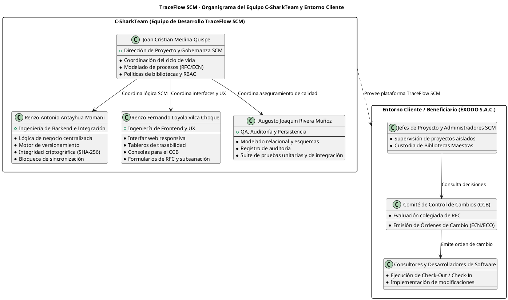
```plantuml
@startuml
skinparam shadowing false
skinparam roundcorner 8
skinparam defaultFontName Arial
skinparam packageStyle rectangle

title <b>TraceFlow SCM - Organigrama del Equipo C-SharkTeam y Entorno Cliente</b>

package "C-SharkTeam (Equipo de Desarrollo TraceFlow SCM)" as DEV {
    class "Joan Cristian Medina Quispe" as JCM {
        + Dirección de Proyecto y Gobernanza SCM
        --
        * Coordinación del ciclo de vida
        * Modelado de procesos (RFC/ECN)
        * Políticas de bibliotecas y RBAC
    }

    class "Renzo Antonio Antayhua Mamani" as RAA {
        + Ingeniería de Backend e Integración
        --
        * Lógica de negocio centralizada
        * Motor de versionamiento
        * Integridad criptográfica (SHA-256)
        * Bloqueos de sincronización
    }

    class "Renzo Fernando Loyola Vilca Choque" as RFL {
        + Ingeniería de Frontend y UX
        --
        * Interfaz web responsiva
        * Tableros de trazabilidad
        * Consolas para el CCB
        * Formularios de RFC y subsanación
    }

    class "Augusto Joaquin Rivera Muñoz" as AJR {
        + QA, Auditoría y Persistencia
        --
        * Modelado relacional y esquemas
        * Registro de auditoría
        * Suite de pruebas unitarias y de integración
    }

    JCM --> RAA : Coordina lógica SCM
    JCM --> RFL : Coordina interfaces y UX
    JCM --> AJR : Coordina aseguramiento de calidad
}

package "Entorno Cliente / Beneficiario (ÉXODO S.A.C.)" as CLIENT {
    class "Jefes de Proyecto y Administradores SCM" as ADM {
        * Supervisión de proyectos aislados
        * Custodia de Bibliotecas Maestras
    }

    class "Comité de Control de Cambios (CCB)" as CCB {
        * Evaluación colegiada de RFC
        * Emisión de Órdenes de Cambio (ECN/ECO)
    }

    class "Consultores y Desarrolladores de Software" as DEV_CLI {
        * Ejecución de Check-Out / Check-In
        * Implementación de modificaciones
    }

    ADM --> CCB : Consulta decisiones
    CCB --> DEV_CLI : Emite orden de cambio
}

DEV ..> CLIENT : Provee plataforma TraceFlow SCM
@enduml
```

<!-- Página 8 del PDF original -->

Ingeniería de Frontend y Experiencia de Usuario (UI/UX): Liderada por Renzo Fernando Loyola Vilca Choque, responsable de la construcción de la interfaz web responsiva, tableros de control para la trazabilidad de cambios, consolas de gestión para el Comité de Control de Cambios (CCB) y formularios dinámicos para el registro y subsanación de solicitudes. Aseguramiento de la Calidad (QA), Auditoría y Persistencia: A cargo de Augusto Joaquin Rivera Muñoz, responsable del diseño y modelado de persistencia de datos relacionales, administración de esquemas de trazabilidad histórica, implementación del módulo de registro de auditoría de acciones del sistema y definición de la suite de pruebas unitarias y de integración. Entorno Cliente / Beneficiario (ÉXODO S.A.C.):Jefes de Proyecto y Administradores SCM: Supervisión de proyectos aislados y custodia de las Bibliotecas Maestras.Comité de Control de Cambios (CCB): Evaluación colegiada y emisión de Órdenes de Cambio.Consultores y Desarrolladores de Software: Usuarios operativos que ejecutan Check-Out/Check-In e implementan las modificaciones asignadas.

<!-- Página 9 del PDF original -->

# 3. Visionamiento de la Empresa

## 3.1. Descripción del Problema

Actualmente, ÉXODO S.A.C. gestiona el desarrollo de software para sus clientes sin un sistema formal de Gestión de la Configuración. El código fuente, la documentación y los artefactos de cada proyecto se encuentran dispersos entre los equipos de cómputo de los consultores y cuentas personales en distintas plataformas, sin un repositorio centralizado ni un estándar de identificación de versiones. Esta situación provoca la coexistencia de múltiples copias de un mismo componente sin un registro histórico confiable, generando conflictos al integrar el trabajo de distintos desarrolladores, pérdida de avances por sobreescritura de archivos y retrasos en la entrega de los proyectos comprometidos con los clientes. Asimismo, la ausencia de un flujo formal de control de cambios y de líneas base claramente definidas impide identificar con certeza qué versión de un producto se encuentra en producción, quién autorizó una modificación específica o cómo revertir un cambio que introdujo un defecto crítico, comprometiendo la calidad del servicio y la relación de confianza con los clientes de ÉXODO S.A.C.

<!-- Página 10 del PDF original -->

## 3.2. Objetivos de Negocios

### 3.2.1. Objetivo General de Negocio

Optimizar la calidad y la continuidad de los servicios de desarrollo de software que ÉXODO S.A.C. entrega a sus clientes, mediante la implementación de un sistema de gestión de configuración que reduzca los riesgos de pérdida de información y los costos asociados a la corrección de errores por versiones conflictivas.

### 3.2.2. Objetivos Específicos de Negocio

- Reducción de Retrabajo: Disminuir en un 25% el tiempo invertido por

los equipos de desarrollo en la resolución de conflictos de código y en la recuperación de archivos perdidos.

- Garantía de Integridad: Asegurar que el 100% de las versiones

entregadas a los clientes correspondan a versiones validadas y aprobadas mediante el flujo formal de control de cambios.

- Mejora de la Transparencia: Establecer una trazabilidad total que permita

identificar el origen, autor y justificación de cualquier cambio realizado en un proyecto en menos de 24 horas.

- Estandarización de Procesos: Unificar los flujos de trabajo de los

distintos equipos de proyecto de ÉXODO S.A.C. bajo una única política de control de cambios.

- Satisfacción del Cliente: Reducir en un 30% las incidencias relacionadas

con entregas de versiones incorrectas o no autorizadas al cliente.

## 3.3. Objetivos de Diseño

### 3.3.1. Objetivo General de Negocio

Definir la arquitectura lógica y funcional de TraceFlow SCM, un sistema robusto de gestión de configuración que centralice, proteja y organice los artefactos de software de los proyectos de ÉXODO S.A.C., asegurando una estructura escalable que facilite el control de cambios sin afectar la productividad de los equipos de desarrollo.

<!-- Página 11 del PDF original -->

### 3.3.2. Objetivos Específicos de Negocio

- Diseño de Repositorio Centralizado: Definir una estructura de

almacenamiento jerárquica que permita organizar el código fuente, la documentación técnica y los recursos de cada proyecto de cliente.

- Establecimiento de Líneas Base (Baselines): Diseñar mecanismos de

control para identificar y congelar versiones estables del software, garantizando puntos de recuperación confiables.

- Modelado del Flujo de Cambios: Estructurar un proceso formal de

solicitud, evaluación y aprobación de cambios que garantice que ninguna modificación sea integrada sin previa validación técnica.

- Definición de Roles y Permisos: Diseñar un esquema de seguridad

basado en roles que restrinja el acceso a los repositorios críticos y asegure que solo el personal autorizado libere versiones oficiales.

- Trazabilidad y Auditoría: Diseñar mecanismos de registro e integridad

que permitan reconstruir el historial completo de un elemento de configuración.

## 3.4. Alcance del proyecto

El presente proyecto abarca el análisis y definición funcional de TraceFlow SCM, un Sistema de Gestión de Configuración de Software diseñado específicamente para las necesidades de ÉXODO S.A.C. El alcance se centra en establecer las reglas, procesos y controles necesarios para administrar el ciclo de vida de los artefactos digitales de los proyectos de la empresa y de sus clientes.

### 3.4.1. Alcance Funcional

- Identificación de Elementos de Configuración (ECS): registro y

catalogación de los componentes de software (código fuente, documentación, esquemas de base de datos) de cada proyecto.

- Gestión de Versiones: mantenimiento de un historial completo de

cambios mediante operaciones de Check-in y Check-out, con posibilidad de retorno a estados anteriores.

<!-- Página 12 del PDF original -->

- Control de Cambios: flujo formal para solicitar, evaluar y aprobar

modificaciones antes de su integración al proyecto.

- Gestión de Líneas Base: funcionalidad para crear y congelar versiones

estables destinadas a la entrega o despliegue oficial al cliente.

- Gestión de Incidencias y Soporte: registro y seguimiento de incidencias

reportadas por los equipos internos o por los clientes.

- Generación de Reportes y Auditoría: emisión de informes sobre el estado

de la configuración y trazabilidad de las acciones realizadas.

### 3.4.2. Alcance No Funcional

- Seguridad y Acceso: restricción de permisos basada en roles

(Administrador SCM, Jefe de Proyecto, Desarrollador, QA, Auditor).

- Disponibilidad: el sistema debe operar con un tiempo de actividad

objetivo del 99.9% durante los periodos críticos de desarrollo y entrega.

- Integridad de Datos: garantía de que los artefactos almacenados no

sufran corrupciones durante transferencias, fusiones o respaldos.

- Escalabilidad: capacidad de soportar el crecimiento de la cartera de

proyectos de ÉXODO S.A.C. (más de 50 proyectos simultáneos).

- Usabilidad: curva de aprendizaje mínima para los nuevos consultores o

practicantes que se incorporen a los equipos de proyecto.

### 3.4.3. Alcance Tecnológico

- Arquitectura de Repositorios: análisis basado en sistemas de control de

versiones distribuidos (Git).

- Entornos de Desarrollo: compatibilidad con las herramientas utilizadas

por los equipos de ÉXODO S.A.C. (Visual Studio Code, IntelliJ IDEA, Android Studio).

- Integración: compatibilidad con herramientas de automatización de

compilación, pruebas y despliegue (CI/CD).

- Almacenamiento: evaluación de necesidades de almacenamiento en

servidores propios o servicios en la nube (GitHub, GitLab, Azure DevOps).

<!-- Página 13 del PDF original -->

### 3.4.4. Delimitación del Proyecto

- Delimitación Espacial: el proyecto se circunscribe a las áreas de

desarrollo y gestión de proyectos de ÉXODO S.A.C.

- Delimitación Temporal: el análisis abarca el ciclo académico

correspondiente al semestre 2026-II.

- Delimitación Social: el sistema está dirigido al personal de desarrollo,

jefes de proyecto, personal de control de calidad y auditores de ÉXODO S.A.C.

- Frontera Técnica: se excluye explícitamente el soporte de hardware, la

administración de redes externas y la gestión comercial o contable de la empresa.

## 3.5. Viabilidad del Sistema

La evaluación de viabilidad analiza la factibilidad técnica, económica,

**operativa, legal, social y ambiental del software antes de iniciar su construcción:**

1. Viabilidad Técnica

Infraestructura: ÉXODO S.A.C. cuenta con servidores propios y acceso a servicios en la nube, lo que facilita la implementación de un repositorio centralizado. Capacidad Técnica: los equipos de desarrollo manejan herramientas estándar de control de versiones (Git), por lo que la curva de aprendizaje para adoptar TraceFlow SCM es baja. Compatibilidad: es técnicamente viable integrar las políticas de control de cambios con los entornos de desarrollo actuales sin interrumpir los proyectos en curso.

2. Viabilidad Económica

El análisis financiero se calculó para un horizonte de evaluación a 5 años (2026-2030) con una tasa de descuento (COK) del 12.00%, considerando los costos reales de desarrollo asumidos por el equipo C-SharkTeam durante el

**semestre 2026-II:**

<!-- Página 14 del PDF original -->

**Tabla TB-02: Indicadores Financieros de Viabilidad Económica**

| Indicador Financiero | Valor Proyectado | Interpretación Técnica / Financiera |
| :--- | :--- | :--- |
| Inversión Inicial (CAPEX) | S/. 5,475.00 | Cubre 500 horas de desarrollo (Joan Medina y Renzo Antayhua a razón de S/. 9.00/hr), depreciación de equipos (3.5 meses), conectividad, dominio web e imprevistos. |
| Costo Operativo Anual (OPEX) | S/. 1,140.00 | Mantenimiento de infraestructura PaaS (Render/Supabase), renovación de dominio, soporte preventivo y materiales de difusión. |
| Valor Actual Neto (VAN) | +S/. 10,801.64 | Estrictamente positivo (VAN > 0), ratificando que el proyecto generará valor económico y retención institucional por encima de la tasa exigida (COK 12.00%). |
| Tasa Interna de Retorno (TIR) | 68.20% | Supera ampliamente el COK referencial (12.00%), otorgando un margen de seguridad amplio frente a variaciones de costos. |
| Relación Beneficio / Costo (B/C) | 1.97 | Por cada sol invertido en el ciclo del proyecto, se generarán S/. 1.97 en beneficios y ahorros valorizados para la facultad y los estudiantes. |
| Periodo de Recuperación (Payback) | 1 año y 9.7 meses | La inversión inicial se recuperará plenamente durante el transcurso del segundo año de operación. |
3. Viabilidad Operativa

Apoyo Institucional: existe respaldo de la Gerencia de Proyectos de ÉXODO S.A.C. para formalizar el control de sus activos digitales.

<!-- Página 15 del PDF original -->

Facilidad de Integración: el flujo propuesto se adapta a las rutinas actuales de los consultores, quienes percibirán el sistema como una herramienta de protección de su trabajo. Sostenibilidad: la definición de roles claros (Jefe de Proyecto, Desarrollador, QA, Auditor) permite que el sistema se mantenga vigente ante la rotación de personal.

4. Viabilidad Legal

1. Propiedad Intelectual y Derechos de Autor: de acuerdo con el Decreto

Legislativo N.° 822 (Ley sobre el Derecho de Autor), el software desarrollado por los consultores de ÉXODO S.A.C. en el ejercicio de sus funciones pertenece a la empresa o al cliente contratante según lo pactado contractualmente. TraceFlow SCM garantiza que dicha propiedad intelectual quede debidamente registrada, versionada y resguardada.

2. Protección de Datos Personales: el análisis del sistema considera el

cumplimiento de la Ley N.° 29733 (Ley de Protección de Datos Personales), dado que los proyectos gestionados por ÉXODO S.A.C. pueden incluir información sensible de los clientes finales, por lo que el acceso al código y a la documentación debe restringirse únicamente al personal autorizado.

3. Contratos con Clientes: el sistema apoya el cumplimiento de los acuerdos de

nivel de servicio (SLA) pactados con los clientes, al permitir demostrar mediante trazabilidad y auditoría qué versión fue entregada, cuándo y bajo qué aprobación.

4. Uso de Software y Licenciamiento: el análisis prioriza el uso de

herramientas bajo licencias de código abierto (GPL, MIT) para el control de versiones, evitando el uso de software no licenciado y mitigando riesgos de sanciones por infracción de derechos de autor.

<!-- Página 16 del PDF original -->

5. Viabilidad Social

1. Optimización de Recursos de Hardware: la centralización del desarrollo en

repositorios institucionales evita la necesidad de adquirir nuevo hardware, extendiendo la vida útil de los equipos actuales.

2. Reducción de la Huella de Carbono Digital: un flujo de trabajo ordenado

reduce compilaciones fallidas y procesos redundantes, disminuyendo el consumo energético de los servidores.

3. Digitalización y Cero Papel: la automatización de solicitudes de cambio,

actas y reportes elimina la necesidad de documentación impresa.

4. Promoción del Trabajo Remoto: un sistema de configuración robusto

facilita el trabajo colaborativo a distancia entre los equipos de ÉXODO S.A.C. y sus clientes, reduciendo desplazamientos innecesarios.

5. Viabilidad Ambiental

<!-- PENDIENTE DE VALIDACION: La Viabilidad Ambiental duplica literalmente los cuatro puntos de la Viabilidad Social. Pendiente de redacción técnica diferenciada enfocada en métricas energéticas y de centros de datos en la nube. -->

1. Optimización de Recursos de Hardware: la centralización del desarrollo en

repositorios institucionales evita la necesidad de adquirir nuevo hardware, extendiendo la vida útil de los equipos actuales.

2. Reducción de la Huella de Carbono Digital: un flujo de trabajo ordenado

reduce compilaciones fallidas y procesos redundantes, disminuyendo el consumo energético de los servidores.

3. Digitalización y Cero Papel: la automatización de solicitudes de cambio, actas

y reportes elimina la necesidad de documentación impresa.

4. Promoción del Trabajo Remoto: un sistema de configuración robusto facilita

el trabajo colaborativo a distancia entre los equipos de ÉXODO S.A.C. y sus clientes, reduciendo desplazamientos innecesarios.

<!-- Página 17 del PDF original -->

## 3.6. Información obtenida del Levantamiento de Información

# 1. Diagnóstico de la Situación Actual:

- Almacenamiento: el código de los proyectos está disperso en equipos

locales y cuentas personales, sin un repositorio institucional centralizado.

- Control de Versiones: es inexistente o empírico; se emplean nombres de

carpetas (por ejemplo, “Proyecto_Cliente_Final_v2”) en lugar de un estándar de versionamiento.

- Flujo de Cambios: las modificaciones se coordinan de forma verbal o por

chat, sin registro de quién, cuándo o por qué se alteró un componente.

- Sincronización: existe un alto índice de pérdida de avances por

sobreescritura de archivos al trabajar varios consultores en un mismo proyecto.

# 2. Necesidades Identificadas (Requerimiento)

**Cuadro de Necesidades Identificadas**

**Tabla TB-03: Cuadro de Necesidades Identificadas**

| Área | Problema Detectado | Requerimiento del Sistema |
| :--- | :--- | :--- |
| Código | Pérdida de fuentes | Repositorio centralizado y seguro. |
| Cambios | Modificaciones arbitrarias | Flujo de aprobación (Solicitudes de Cambio). |
| Versiones | Confusión sobre la versión vigente | Etiquetado de Líneas Base (Baselines). |
| Auditoría | No se identifica al responsable de una falla | Registro de auditoría y trazabilidad total. |
| Entregas | Entregas al cliente sin validación previa | Aprobación formal antes de la liberación. |
Nota: Elaboración Propia

<!-- Página 18 del PDF original -->

# 4. Análisis de Procesos

## 4.1. Diagrama del Proceso Actual - Diagrama de actividades

El proceso actual es empírico y desorganizado, pues el código reside en equipos personales sin estándares de versionamiento. La integración se realiza por medios informales (correo, chat, USB), lo que provoca pérdida de avances por sobreescritura. Al no existir líneas base, ante una falla en producción no es posible identificar ni recuperar de forma inmediata una versión estable anterior, afectando la calidad del servicio entregado a los clientes de ÉXODO S.A.C.

**Diagrama de Actividades del Proceso Actual**

Nota: Elaboración Propia

**Diagrama DG-02: Diagrama de Actividades del Proceso Actual (AS-IS)**

#### Código PlantUML del Diagrama

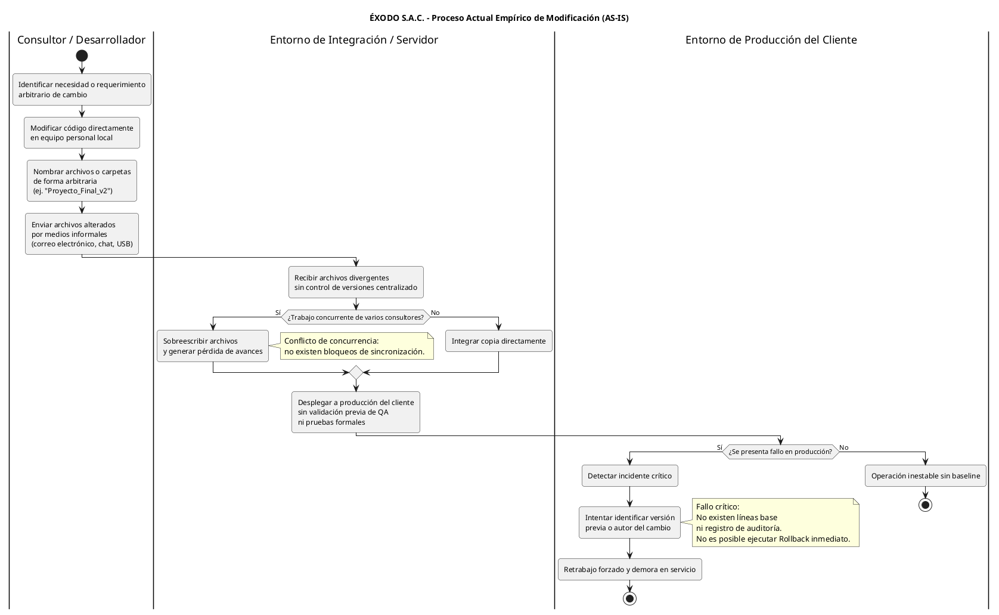
```plantuml
@startuml
skinparam shadowing false
skinparam roundcorner 8
skinparam defaultFontName Arial
skinparam ActivityMaxWidth 220
skinparam conditionStyle inside

title <b>ÉXODO S.A.C. - Proceso Actual Empírico de Modificación (AS-IS)</b>

|Consultor / Desarrollador|
start
:Identificar necesidad o requerimiento
arbitrario de cambio;

:Modificar código directamente
en equipo personal local;

:Nombrar archivos o carpetas
de forma arbitraria
(ej. "Proyecto_Final_v2");

:Enviar archivos alterados
por medios informales
(correo electrónico, chat, USB);

|Entorno de Integración / Servidor|
:Recibir archivos divergentes
sin control de versiones centralizado;

if (¿Trabajo concurrente de varios consultores?) then (Sí)
    :Sobreescribir archivos
    y generar pérdida de avances;
    note right
        Conflicto de concurrencia:
        no existen bloqueos de sincronización.
    end note
else (No)
    :Integrar copia directamente;
endif

:Desplegar a producción del cliente
sin validación previa de QA
ni pruebas formales;

|Entorno de Producción del Cliente|
if (¿Se presenta fallo en producción?) then (Sí)
    :Detectar incidente crítico;
    
    :Intentar identificar versión
    previa o autor del cambio;
    
    note right
        Fallo crítico:
        No existen líneas base
        ni registro de auditoría.
        No es posible ejecutar Rollback inmediato.
    end note
    
    :Retrabajo forzado y demora en servicio;
    stop
else (No)
    :Operación inestable sin baseline;
    stop
endif
@enduml
```

<!-- Página 19 del PDF original -->

## 4.2. Diagrama del Proceso Propuesto - Diagrama de actividades Inicial

El proceso propuesto formaliza el ciclo de vida completo de una Solicitud de Cambio (RFC) mediante siete roles especializados. El Solicitante identifica la necesidad de cambio y completa el formulario de RFC. El Analista de Requerimientos / Gestor recepciona la solicitud, valida que la información esté completa (solicitando subsanación en caso contrario) y clasifica su tipo y criticidad. El Arquitecto / Especialista Técnico realiza el análisis de impacto y genera el Informe Técnico correspondiente. El Comité de Control de Cambios (CCB) evalúa la viabilidad técnica y decide la aprobación; si el cambio es rechazado por inviabilidad o por decisión del comité, se notifica formalmente al solicitante y el trámite se cierra. Una vez aprobado, se emite la Orden de Cambio (ECN/ECO) y el Administrador de Configuración / Bibliotecario efectúa el Check-Out del Elemento de Configuración (ECS) desde la Biblioteca de Soporte hacia la Biblioteca de Trabajo, aplicando un bloqueo de sincronización que evita sobreescrituras. El Ingeniero de Software / Desarrollador implementa el cambio y ejecuta pruebas unitarias locales, tras lo cual el Equipo de Calidad / Testing ejecuta pruebas de integración y validación funcional. Si la validación no es conforme, se habilita un ciclo de corrección y re-testeo; si el re-test también falla, se ejecuta un Rollback en la Biblioteca de Trabajo, se restaura el estado previo del ECS y se cancela la Orden de Cambio por fallo no subsanado. Si la validación es conforme, el Administrador de Configuración realiza el Check-In del ECS verificado hacia la Biblioteca Maestra / Soporte, establece una nueva Línea Base, libera el bloqueo de sincronización y registra el cierre formal del cambio, notificando al solicitante la implementación exitosa

<!-- Página 20 del PDF original -->

**Diagrama DG-03: Proceso de Gestión de Cambios de Elementos de Configuración (TO-BE)**

#### Código PlantUML del Diagrama

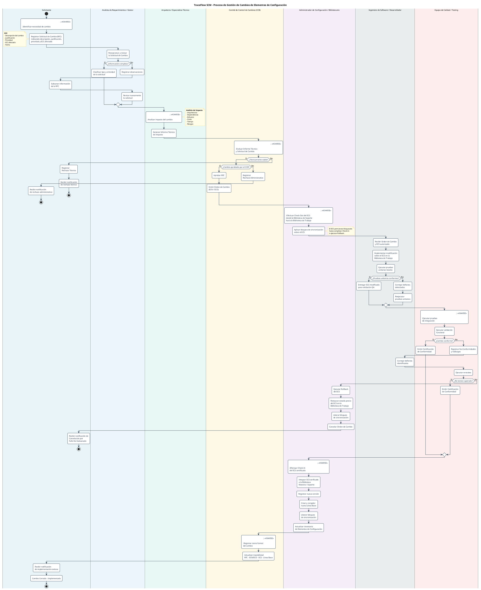
```plantuml
@startuml
title <b>TraceFlow SCM - Proceso de Gestión de Cambios de Elementos de Configuración</b>

' =========================================================
' CONFIGURACIÓN GENERAL
' =========================================================

skinparam ActivityMaxWidth 220
skinparam ranksep 22
skinparam nodesep 18
skinparam defaultFontName Arial
skinparam defaultFontSize 11
skinparam roundCorner 8
skinparam shadowing false
skinparam conditionStyle inside

skinparam arrowColor #2C3E50
skinparam arrowThickness 1.2

skinparam swimlaneBorderColor #7F8C8D
skinparam swimlaneBorderThickness 1.2

skinparam activity {
    BackgroundColor #FFFFFF
    BorderColor #34495E
    BorderThickness 1.2
    FontColor #2C3E50
}

skinparam note {
    BackgroundColor #FFFDE7
    BorderColor #FBC02D
    FontSize 10
}

' =========================================================
' ACTORES / SWIMLANES
' =========================================================

|#E8F4F8|Solicitante|
|#EBF5FB|Analista de Requerimientos / Gestor|
|#E8F8F5|Arquitecto / Especialista Técnico|
|#FEF9E7|Comité de Control de Cambios (CCB)|
|#F5EEF8|Administrador de Configuración / Bibliotecario|
|#EAEDED|Ingeniero de Software / Desarrollador|
|#FDEDEC|Equipo de Calidad / Testing|

' =========================================================
' FASE 1 - REGISTRO Y CLASIFICACIÓN
' =========================================================

|Solicitante|

start

:<color:white><b>FASE 1\nRegistro y Clasificación de la RFC</b></color>; <<#34495E>>

:Identificar necesidad de cambio;

:Registrar Solicitud de Cambio (RFC)
indicando descripción, justificación,
prioridad y ECS afectado;

note left
<b>RFC</b>
- Descripción del cambio
- Justificación
- Prioridad
- ECS afectado
- Fecha
end note


|Analista de Requerimientos / Gestor|

:Recepcionar y revisar
la Solicitud de Cambio;

if (¿Información completa?) then (Sí)

    :Clasificar tipo y criticidad
    de la solicitud;

else (No)

    :Registrar observaciones;

    |Solicitante|

    :Subsanar información
    de la RFC;

    |Analista de Requerimientos / Gestor|

    :Revisar nuevamente
    la solicitud;

endif


' =========================================================
' FASE 2 - ANÁLISIS TÉCNICO
' =========================================================

|Arquitecto / Especialista Técnico|

:<color:white><b>FASE 2\nAnálisis Técnico</b></color>; <<#34495E>>

:Analizar impacto del cambio;

note right
<b>Análisis de Impacto</b>
- Arquitectura
- Dependencias
- Esfuerzo
- Costo
- Tiempo
- Riesgos
end note

:Generar Informe Técnico
de Impacto;


' =========================================================
' FASE 3 - DECISIÓN DEL CCB
' =========================================================

|Comité de Control de Cambios (CCB)|

:<color:white><b>FASE 3\nEvaluación y Decisión del CCB</b></color>; <<#34495E>>

:Evaluar Informe Técnico
y Solicitud de Cambio;

if (¿Técnicamente viable?) then (Sí)

    if (¿Cambio aprobado por el CCB?) then (Sí)

        :Aprobar RFC;

        :Emitir Orden de Cambio
        (ECN / ECO);

    else (No)

        :Registrar
        Rechazo Administrativo;

        |Solicitante|

        :Recibir notificación
        de rechazo administrativo;

        stop

    endif

else (No)

    :Registrar
    Rechazo Técnico;

    |Solicitante|

    :Recibir notificación
    de rechazo técnico;

    stop

endif


' =========================================================
' FASE 4 - CHECK-OUT E IMPLEMENTACIÓN
' =========================================================

|Administrador de Configuración / Bibliotecario|

:<color:white><b>FASE 4\nCheck-Out e Implementación</b></color>; <<#34495E>>

:Efectuar Check-Out del ECS
desde la Biblioteca de Soporte
hacia la Biblioteca de Trabajo;

:Aplicar bloqueo de sincronización
sobre el ECS;

note right
El ECS permanece bloqueado
hasta completar Check-In
o ejecutar Rollback.
end note


|Ingeniero de Software / Desarrollador|

:Recibir Orden de Cambio
y ECS autorizado;

:Implementar modificación
sobre el ECS en la
Biblioteca de Trabajo;

:Ejecutar pruebas
unitarias locales;

if (¿Pruebas unitarias conformes?) then (Sí)

    :Entregar ECS modificado
    para validación QA;

else (No)

    :Corregir defectos
    detectados;

    :Reejecutar
    pruebas unitarias;

endif


' =========================================================
' FASE 5 - QA
' =========================================================

|Equipo de Calidad / Testing|

:<color:white><b>FASE 5\nValidación y Certificación QA</b></color>; <<#34495E>>

:Ejecutar pruebas
de integración;

:Ejecutar validación
funcional;

if (¿Cambio conforme?) then (Sí)

    :Emitir Certificación
    de Conformidad;

else (No)

    :Registrar No Conformidades
    y hallazgos;

    |Ingeniero de Software / Desarrollador|

    :Corregir defectos
    identificados;

    |Equipo de Calidad / Testing|

    :Ejecutar re-testeo;

    if (¿Re-testeo superado?) then (Sí)

        :Emitir Certificación
        de Conformidad;

    else (No)

        |Administrador de Configuración / Bibliotecario|

        :Ejecutar Rollback
        del ECS;

        :Restaurar estado previo
        del ECS en la
        Biblioteca de Trabajo;

        :Liberar bloqueo
        de sincronización;

        :Cancelar Orden de Cambio;

        |Solicitante|

        :Recibir notificación de
        Cancelación por
        Fallo No Subsanado;

        stop

    endif

endif


' =========================================================
' FASE 6 - CHECK-IN Y LÍNEA BASE
' =========================================================

|Administrador de Configuración / Bibliotecario|

:<color:white><b>FASE 6\nCheck-In y Línea Base</b></color>; <<#34495E>>

:Efectuar Check-In
del ECS certificado;

:Integrar ECS verificado
a la Biblioteca
Maestra / Soporte;

:Registrar nueva versión;

:Crear y congelar
nueva Línea Base;

:Liberar bloqueo
de sincronización;

:Actualizar inventario
de Elementos de Configuración;


' =========================================================
' FASE 7 - CIERRE
' =========================================================

|Comité de Control de Cambios (CCB)|

:<color:white><b>FASE 7\nCierre Formal</b></color>; <<#34495E>>

:Registrar cierre formal
del cambio;

:Actualizar trazabilidad
RFC - ECN/ECO - ECS - Línea Base;


|Solicitante|

:Recibir notificación
de implementación exitosa;

:Cambio Cerrado - Implementado;

stop

@enduml
```

<!-- Página 22 del PDF original -->

# 5. Especificación de Requerimientos de Software

## 5.1. Cuadro de Requerimientos Funcionales

A continuación se detalla el cuadro de Requerimientos Funcionales (RF-01 a RF-18) de TraceFlow SCM, elaborado a partir del levantamiento de información y de los escenarios de caso de uso descritos previamente. Cada requerimiento especifica el módulo funcional al que pertenece, una descripción de la capacidad que el sistema debe ofrecer y su nivel de prioridad, sirviendo como base para la definición de los casos de uso y del alcance de la implementación.

**Tabla: Cuadro de Requerimientos Funcionales**

**Tabla TB-04: Cuadro de Requerimientos Funcionales (RF-01 a RF-18)**

| ID | Requerimiento Funcional | Descripción | Prioridad |
| :--- | :--- | :--- | :--- |
| RF-01 | Gestión de Usuarios y Roles | El sistema debe permitir registrar usuarios y asignar los roles del flujo de cambios (Solicitante, Analista de Requerimientos/Gestor, Arquitecto/Especialista Técnico, CCB, Administrador de Configuración/Bibliotecario, Ingeniero de Software/Desarrollador, Equipo de Calidad/Testing), restringiendo las acciones disponibles según el rol. | Alta |
| RF-02 | Gestión de Proyectos | El sistema debe permitir crear y administrar múltiples proyectos de clientes de ÉXODO S.A.C. de forma aislada entre sí. | Alta |
| RF-03 | Identificación de ECS | El sistema debe permitir registrar y clasificar los Elementos de Configuración (código, documentos, esquemas de BD) de cada proyecto. | Alta |
| RF-04 | Registro de Solicitudes de Cambio (RFC) | El sistema debe permitir al Solicitante registrar una Solicitud de Cambio indicando descripción, justificación, prioridad, ECS afectado y fecha, y permitir su subsanación cuando la información esté incompleta. | Alta |
| RF-05 | Clasificación y Análisis de Impacto | El sistema debe permitir al Analista de Requerimientos clasificar el tipo y criticidad de la solicitud, y al Arquitecto/Especialista Técnico registrar el análisis de impacto (arquitectura, esfuerzo, costo, tiempo y riesgos) en un Informe Técnico de Impacto. | Alta |
| RF-06 | Evaluación y Aprobación por el CCB | El sistema debe permitir al Comité de Control de Cambios evaluar la viabilidad técnica de una solicitud, aprobarla o rechazarla, y registrar las causales de no aprobación cuando corresponda. | Alta |
| RF-07 | Gestión de Órdenes de Cambio | El sistema debe permitir generar la Orden de Cambio (ECN/ECO) una vez aprobada una solicitud por el CCB, y actualizar el plan de gestión del proyecto asociado. | Media |
| RF-08 | Gestión de Bibliotecas de Software | El sistema debe administrar al menos tres bibliotecas por proyecto (Biblioteca de Trabajo, Biblioteca de Soporte y Biblioteca Maestra), permitiendo mover un ECS entre ellas mediante operaciones de Check-Out y Check-In. | Alta |
| RF-09 | Control de Versiones y Bloqueos de Sincronización | El sistema debe registrar cada Check-in/Check-out de un ECS con autor, fecha y descripción del cambio, y aplicar/liberar bloqueos de sincronización que impidan la edición concurrente del mismo ECS en la Biblioteca de Trabajo. | Alta |
| RF-10 | Gestión de Pruebas y Certificación de Conformidad | El sistema debe permitir al Equipo de Calidad registrar los resultados de pruebas de integración y validación funcional, certificar la conformidad de un cambio o reportar no conformidades con hallazgos asociados. | Alta |
| RF-11 | Reevaluación y Re-testeo | El sistema debe permitir registrar ciclos de corrección de defectos y re-testeo sobre un cambio no conforme, hasta su certificación o hasta agotar los reintentos permitidos. | Media |
| RF-12 | Rollback y Cancelación de Órdenes de Cambio | El sistema debe permitir al Administrador de Configuración ejecutar un rollback del ECS en la Biblioteca de Trabajo y cancelar la Orden de Cambio cuando el re-test no sea superado exitosamente. | Alta |
| RF-13 | Gestión de Líneas Base | El sistema debe permitir crear y congelar líneas base a partir de un ECS verificado al momento del Check-In a la Biblioteca Maestra/Soporte, registrando la versión resultante. | Alta |
| RF-14 | Cierre Formal del Cambio y Notificaciones | El sistema debe registrar el cierre formal de una Solicitud de Cambio (por implementación exitosa, rechazo técnico, rechazo administrativo o cancelación) y notificar automáticamente al Solicitante el resultado. | Alta |
| RF-15 | Gestión de Incidencias y Soporte | El sistema debe permitir registrar, dar seguimiento y derivar incidencias reportadas por consultores o clientes hacia una nueva Solicitud de Cambio. | Media |
| RF-16 | Trazabilidad de Configuración | El sistema debe permitir visualizar las relaciones entre los ECS, las Solicitudes de Cambio, las Órdenes de Cambio y las líneas base a lo largo del tiempo. | Alta |
| RF-17 | Auditoría e Integridad | El sistema debe registrar las acciones críticas de los usuarios en cada etapa del flujo y validar la integridad de los artefactos mediante checksums (SHA-256). | Alta |
| RF-18 | Generación de Reportes | El sistema debe permitir generar reportes de estado del flujo de cambios, inventario de ECS y actas de cambios, con posibilidad de exportación. | Media |

## 5.2. Cuadro de Requerimientos No funcionales

El siguiente cuadro presenta los Requerimientos No Funcionales (RNF-01 a RNF-09) que establecen los atributos de calidad exigidos a TraceFlow SCM, tales como seguridad, disponibilidad, integridad, usabilidad, escalabilidad, rendimiento, compatibilidad, mantenibilidad y respaldo. Estos requerimientos condicionan las decisiones de arquitectura y diseño técnico que se adoptarán en las siguientes fases del proyecto, y se derivan directamente de los objetivos de negocio y de diseño planteados por ÉXODO S.A.C.

**Tabla: Cuadro de Requerimientos No Funcionales**

**Tabla TB-05: Cuadro de Requerimientos No Funcionales (RNF-01 a RNF-09)**

| ID | Atributo de Calidad | Descripción | Prioridad |
| :--- | :--- | :--- | :--- |
| RNF-01 | Seguridad | El sistema debe utilizar protocolos de transferencia segura (HTTPS/SSH) y control de acceso basado en roles (RBAC). | Alta |
| RNF-02 | Disponibilidad | El sistema debe garantizar un tiempo de actividad (uptime) del 99.9% durante los periodos críticos de proyecto. | Alta |
| RNF-03 | Integridad | El sistema debe verificar la integridad de los artefactos almacenados mediante checksums (SHA-256). | Alta |
| RNF-04 | Usabilidad | La interfaz debe permitir que un nuevo consultor se familiarice con el flujo de trabajo en menos de 3 horas. | Media |
| RNF-05 | Escalabilidad | El sistema debe soportar más de 50 proyectos simultáneos sin degradar el rendimiento de las operaciones. | Media |
| RNF-06 | Rendimiento | Las operaciones de consulta de historial o comparación de versiones no deben exceder los 3 segundos de respuesta. | Baja |
| RNF-07 | Compatibilidad | El sistema debe ser compatible con entornos de desarrollo de uso común (Visual Studio Code, IntelliJ IDEA, Android Studio). | Alta |
| RNF-08 | Mantenibilidad | La arquitectura debe permitir actualizaciones y parches sin requerir la detención total del servicio. | Media |
| RNF-09 | Respaldo | El sistema debe programar copias de seguridad automáticas diarias del repositorio central. | Alta |
Nota: Elaboración Propia

<!-- Página 25 del PDF original -->

## 5.3. Reglas de Negocio

Las Reglas de Negocio (RN-01 a RN-09) formalizan las políticas y restricciones que TraceFlow SCM debe hacer cumplir de manera obligatoria dentro del flujo de gestión de configuración, tales como la aprobación previa del CCB, la identificación unívoca de versiones, el bloqueo de sincronización y la validación de QA antes de integrar un ECS a la Biblioteca Maestra. Cada regla identifica la autoridad responsable de su cumplimiento y la situación problemática que motivó su definición, evidenciando la trazabilidad entre el diagnóstico inicial de ÉXODO S.A.C. y las restricciones incorporadas al sistema.

**Cuadro de las Reglas de Negocio**

**Tabla TB-06: Cuadro de Reglas de Negocio (RN-01 a RN-09)**

<!-- PENDIENTE DE VALIDACION: La autoridad asignada a RN-03 en el SRS original es Analista de Requerimientos / Gestor, pero la operación de Check-In con ECN es ejecutada operativamente por el Administrador de Configuración / Bibliotecario. -->

| ID | Nombre de la Regla | Descripción | Autoridad | Situación Actual (Problemática) |
| :--- | :--- | :--- | :--- | :--- |
| RN-01 | Aprobación Obligatoria de Integración | Ningún ECS puede integrarse a la Biblioteca Maestra/Soporte de un proyecto sin la revisión y aprobación de una Solicitud de Cambio por el CCB. | Comité de Control de Cambios (CCB) | Se integraban cambios directamente sin revisión previa. |
| RN-02 | Identificación Unívoca de Versiones | Toda línea base establecida tras un Check-In a la Biblioteca Maestra debe estar identificada con un estándar de versionamiento (mayor.menor.parche). | Administrador de Configuración / Bibliotecario | Se usaban nombres de carpetas y archivos comprimidos con nombres arbitrarios. |
| RN-03 | Trazabilidad de Cambios | Todo Check-in registrado debe incluir un mensaje descriptivo y estar asociado a una Orden de Cambio (ECN/ECO) previamente emitida. | Analista de Requerimientos / Gestor *(ver nota en Inconsistencias)* | No existía registro de quién ni por qué se modificaba el código. |
| RN-04 | Restricción de Bibliotecas Congeladas | Un ECS almacenado en la Biblioteca Maestra no puede modificarse directamente; cualquier corrección exige un nuevo ciclo completo de RFC, Check-Out y Check-In. | Administrador de Configuración / Bibliotecario | Los consultores editaban directamente los archivos entregados al cliente. |
| RN-05 | Evaluación Técnica Obligatoria | Ninguna Solicitud de Cambio puede pasar a evaluación del CCB sin contar previamente con un Informe Técnico de Impacto elaborado por el Arquitecto/Especialista Técnico. | Arquitecto / Especialista Técnico | Los cambios se aprobaban sin un análisis técnico documentado. |
| RN-06 | Bloqueo de Sincronización Obligatorio | Todo ECS que ingresa a la Biblioteca de Trabajo mediante Check-Out debe quedar bloqueado para otros usuarios hasta su Check-In o rollback. | Administrador de Configuración / Bibliotecario | Varios consultores editaban el mismo archivo de forma simultánea, generando sobreescrituras. |
| RN-07 | Diferenciación de Resultados de Cierre | Toda Solicitud de Cambio debe cerrarse con uno de tres resultados formales y mutuamente excluyentes: Rechazo Técnico (inviabilidad detectada por el CCB), Rechazo Administrativo (decisión del CCB pese a viabilidad técnica) o Cancelación por Fallo No Subsanado (re-test fallido tras corrección). | Comité de Control de Cambios (CCB) / Administrador de Configuración | No existía distinción entre los motivos de cierre de un cambio no exitoso. |
| RN-08 | Reversión Obligatoria ante Fallo No Subsanado | Si el re-test posterior a una corrección no es superado exitosamente, el Administrador de Configuración debe ejecutar un rollback del ECS en la Biblioteca de Trabajo antes de cancelar la Orden de Cambio. | Administrador de Configuración / Bibliotecario | El código con errores permanecía en el entorno de trabajo sin reversión formal. |
| RN-09 | Validación de QA Previa al Check-In a Biblioteca Maestra | Ningún ECS puede pasar de la Biblioteca de Trabajo a la Biblioteca Maestra/Soporte sin la certificación de conformidad del Equipo de Calidad/Testing. | Equipo de Calidad / Testing | El código se entregaba al cliente sin pruebas formales previas. |

Nota: Elaboración Propia

**Estados del Ciclo de Vida de una Solicitud de Cambio**

En concordancia con el flujo de gestión de cambios adoptado por TraceFlow

**SCM, toda Solicitud de Cambio transita por los siguientes estados principales:**

**Tabla TB-07: Estados Oficiales del Ciclo de Vida de una RFC**

| N.º | Nombre del Estado | Actor / Responsable Principal | Tipo de Estado | Descripción y Criterio de Transición |
| :---: | :--- | :--- | :--- | :--- |
| 1 | **Registrado** | Solicitante / Analista de Requerimientos | Inicial | La solicitud fue creada por el Solicitante y recepcionada por el Analista de Requerimientos. |
| 2 | **En Subsanación** | Solicitante | Intermedio (Bucle) | La información de la solicitud está incompleta y se encuentra en espera de datos adicionales subsanados. |
| 3 | **Clasificado** | Analista de Requerimientos / Gestor | Intermedio | El Analista de Requerimientos validó la información completa y definió el tipo y la criticidad del cambio. |
| 4 | **En Análisis Técnico** | Arquitecto / Especialista Técnico | Intermedio | El Arquitecto está elaborando el Informe Técnico de Impacto (arquitectura, dependencias, esfuerzo, costo, tiempo, riesgos). |
| 5 | **En Evaluación CCB** | Comité de Control de Cambios (CCB) | Intermedio | El Comité de Control de Cambios está evaluando la viabilidad técnica y decidiendo la aprobación del cambio. |
| 6 | **Rechazado (Técnico)** | Comité de Control de Cambios (CCB) | Terminal | El CCB determinó que el cambio no es técnicamente viable. Se notifica al Solicitante y el trámite finaliza. |
| 7 | **Rechazado (Administrativo)** | Comité de Control de Cambios (CCB) | Terminal | El CCB decidió no aprobar el cambio por razones de gestión, alcance o costo, pese a ser técnicamente viable. Se notifica al Solicitante y finaliza. |
| 8 | **Aprobado – Orden Emitida** | Comité de Control de Cambios (CCB) | Intermedio | El CCB aprobó la RFC y emitió la Orden de Cambio (ECN/ECO), autorizando la transferencia del ECS hacia la Biblioteca de Trabajo. |
| 9 | **En Implementación** | Ingeniero de Software / Desarrollador | Intermedio | El Desarrollador recibió el ECS bajo Check-Out con bloqueo activo y ejecuta las modificaciones y pruebas unitarias locales. |
| 10 | **En Validación QA** | Equipo de Calidad / Testing | Intermedio | El Equipo de Calidad está ejecutando pruebas de integración y validación funcional sobre el ECS modificado. |
| 11 | **En Corrección** | Ingeniero de Software / Desarrollador | Intermedio (Bucle) | QA detectó no conformidades y el cambio se encuentra en ciclo de corrección de defectos y re-testeo. |
| 12 | **Cancelado (Fallo No Subsanado)** | Administrador de Configuración / Bibliotecario | Terminal | El re-testeo no fue superado tras los reintentos permitidos; el Administrador ejecuta rollback del ECS en la Biblioteca de Trabajo y cancela la Orden de Cambio. |
| 13 | **Cerrado – Implementado** | Administrador de Configuración / CCB | Terminal | El ECS certificado completó Check-In en la Biblioteca Maestra, se congeló una nueva Línea Base, se liberó el bloqueo y se formalizó el cierre exitoso. |

**Diagrama DG-11: Diagrama de Estados del Ciclo de Vida de la RFC**

#### Código PlantUML del Diagrama

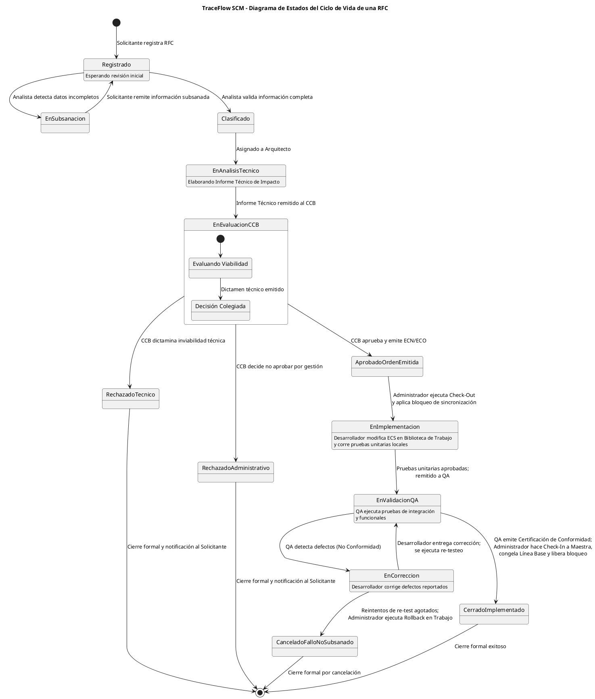
```plantuml
@startuml
skinparam shadowing false
skinparam roundcorner 8
skinparam defaultFontName Arial

title <b>TraceFlow SCM - Diagrama de Estados del Ciclo de Vida de una RFC</b>

[*] --> Registrado : Solicitante registra RFC

state Registrado {
    Registrado : Esperando revisión inicial
}

Registrado --> EnSubsanacion : Analista detecta datos incompletos
EnSubsanacion --> Registrado : Solicitante remite información subsanada

Registrado --> Clasificado : Analista valida información completa
Clasificado --> EnAnalisisTecnico : Asignado a Arquitecto

state EnAnalisisTecnico {
    EnAnalisisTecnico : Elaborando Informe Técnico de Impacto
}

EnAnalisisTecnico --> EnEvaluacionCCB : Informe Técnico remitido al CCB

state EnEvaluacionCCB {
    state "Evaluando Viabilidad" as S_EVAL
    state "Decisión Colegiada" as S_DEC
    [*] --> S_EVAL
    S_EVAL --> S_DEC : Dictamen técnico emitido
}

EnEvaluacionCCB --> RechazadoTecnico : CCB dictamina inviabilidad técnica
EnEvaluacionCCB --> RechazadoAdministrativo : CCB decide no aprobar por gestión

RechazadoTecnico --> [*] : Cierre formal y notificación al Solicitante
RechazadoAdministrativo --> [*] : Cierre formal y notificación al Solicitante

EnEvaluacionCCB --> AprobadoOrdenEmitida : CCB aprueba y emite ECN/ECO

AprobadoOrdenEmitida --> EnImplementacion : Administrador ejecuta Check-Out\ny aplica bloqueo de sincronización

state EnImplementacion {
    EnImplementacion : Desarrollador modifica ECS en Biblioteca de Trabajo\ny corre pruebas unitarias locales
}

EnImplementacion --> EnValidacionQA : Pruebas unitarias aprobadas;\nremitido a QA

state EnValidacionQA {
    EnValidacionQA : QA ejecuta pruebas de integración\ny funcionales
}

EnValidacionQA --> EnCorreccion : QA detecta defectos (No Conformidad)

state EnCorreccion {
    EnCorreccion : Desarrollador corrige defectos reportados
}

EnCorreccion --> EnValidacionQA : Desarrollador entrega corrección;\nse ejecuta re-testeo

EnCorreccion --> CanceladoFalloNoSubsanado : Reintentos de re-test agotados;\nAdministrador ejecuta Rollback en Trabajo

CanceladoFalloNoSubsanado --> [*] : Cierre formal por cancelación

EnValidacionQA --> CerradoImplementado : QA emite Certificación de Conformidad;\nAdministrador hace Check-In a Maestra,\ncongela Línea Base y libera bloqueo

CerradoImplementado --> [*] : Cierre formal exitoso
@enduml
```

# 6. Fase de Desarrollo

El ciclo de vida del proyecto TraceFlow SCM adopta la metodología UWE (UML-Based Web Engineering), orientada a aplicaciones web adaptativas, ejecutándose en un periodo intensivo de 15.5 semanas (108 días calendario) correspondiente al semestre académico 2026-II (del 29 de agosto al 14 de diciembre de 2026). Se estructura en 5 fases secuenciales e iterativas que cubren desde el análisis de requisitos hasta el despliegue en la nube y la prueba piloto con los equipos de ÉXODO S.A.C. El desglose de fases organiza el avance técnico del equipo de TraceFlow SCM, articulando el modelado conceptual (RFC, ECS, bibliotecas y líneas base) y la arquitectura en la etapa inicial para respaldar la implementación del motor de control de cambios en Node.js/TypeScript y de la interfaz web en React, culminando con la validación de usabilidad (SUS) y una prueba piloto sobre un proyecto real de la cartera de clientes de ÉXODO S.A.C.

**Tabla TB-08: Fases del Ciclo de Vida del Desarrollo (Metodología UWE)**

| Fase | Duración | Periodo | Enfoque UWE | Entregables Principales |
| :--- | :--- | :--- | :--- | :--- |
| 1. Análisis de Requisitos y Modelado Conceptual | 3 semanas | 29 ago – 18 sep 2026 | Modelo Conceptual (clases de dominio, casos de uso) | SRS, escenarios de caso de uso, modelo lógico, diagrama de clases preliminar. |
| 2. Diseño (Navegación, Presentación y Arquitectura) | 3.5 semanas | 19 sep – 9 oct 2026 | Modelo de Navegación y de Presentación | SAD, diagramas de secuencia, prototipos de interfaz, modelo de navegación web. |
| 3. Implementación | 5 semanas | 10 oct – 13 nov 2026 | Construcción del sistema | Módulos de RFC, ECS/bibliotecas, líneas base, auditoría; repositorio versionado. |
| 4. Pruebas y Validación | 2.5 semanas | 14 nov – 30 nov 2026 | Verificación funcional y de usabilidad | Casos de prueba ejecutados, informe de defectos, evaluación de usabilidad (SUS). |
| 5. Despliegue Cloud y Prueba Piloto | 1.5 semanas | 1 dic – 14 dic 2026 | Despliegue e implantación | Ambiente productivo desplegado, informe de prueba piloto, acta de cierre. |

Nota: Elaboración Propia Cada fase conserva un carácter iterativo respecto de la anterior: los hallazgos obtenidos durante la Implementación pueden retroalimentar ajustes menores al Modelo Conceptual o al Modelo de Navegación, y los defectos detectados en la fase de Pruebas y Validación son corregidos antes de avanzar al Despliegue Cloud y Prueba Piloto, replicando así el ciclo formal de control de cambios (RFC → análisis de impacto → aprobación → implementación → validación QA → liberación) que el propio sistema TraceFlow SCM está diseñado para gestionar.

## 6.1. Perfiles de Usuario

El siguiente cuadro describe los siete perfiles de usuario (PU-01 a PU-07) que interactúan con TraceFlow SCM, correspondientes a los actores identificados en los casos de uso: Solicitante, Analista de Requerimientos/Gestor, Arquitecto/Especialista Técnico, Comité de Control de Cambios (CCB), Administrador de Configuración/Bibliotecario, Ingeniero de Software/Desarrollador y Equipo de Calidad/Testing. Para cada perfil se especifica su nivel técnico esperado y las funciones concretas que puede ejecutar en el sistema, información que sustenta la definición de los permisos y del control de acceso basado en roles (RBAC).

<!-- Página 30 del PDF original -->

**Tabla: Matriz de Perfiles y Roles de Usuario del Sistema**

**Tabla TB-09: Matriz de Perfiles y Roles de Usuario del Sistema (PU-01 a PU-07)**

| ID | Tipo de Usuario / Actor | Descripción | Nivel Técnico | Funciones en el Sistema TraceFlow SCM |
| :--- | :--- | :--- | :--- | :--- |
| PU-01 | Solicitante | Persona (interna o del cliente) que identifica una necesidad de cambio y origina el trámite mediante un RFC. | Básico | Registrar Solicitudes de Cambio (RFC), subsanar información observada, consultar el estado de tickets/solicitudes y recibir notificaciones de cierre o rechazo. |
| PU-02 | Analista de Requerimientos / Gestor | Responsable de la recepción, validación formal y clasificación inicial de las solicitudes de cambio. | Avanzado | Registrar y validar RFC, solicitar subsanación de datos, clasificar tipo y criticidad, registrar causales de no aprobación, actualizar el plan de gestión del proyecto y derivar incidencias a RFC. |
| PU-03 | Arquitecto / Especialista Técnico | Responsable del análisis de impacto técnico de los cambios propuestos. | Experto | Realizar análisis de impacto en arquitectura y dependencias, estimar esfuerzo/costo/tiempo, generar el Informe Técnico de Impacto y registrar/clasificar nuevos ECS. |
| PU-04 | Comité de Control de Cambios (CCB) | Grupo colegiado de decisión que evalúa la viabilidad técnica y aprueba o rechaza formalmente los cambios. | Avanzado | Evaluar el informe técnico y solicitudes, aprobar o rechazar RFC, emitir Órdenes de Cambio (ECN/ECO), auditar acciones del sistema y formalizar cierres. |
| PU-05 | Administrador de Configuración / Bibliotecario | Responsable de administrar las bibliotecas (Trabajo, Soporte, Maestra), los bloqueos y las líneas base. | Experto | Ejecutar Check-Out/Check-In entre bibliotecas, aplicar y liberar bloqueos de sincronización, ejecutar rollback, establecer y congelar líneas base, validar integridad (SHA-256) y generar reportes. |
| PU-06 | Ingeniero de Software / Desarrollador | Consultor técnico que implementa el cambio aprobado sobre el ECS en la Biblioteca de Trabajo. | Medio | Recibir Orden de Cambio y ECS autorizado, implementar modificaciones, ejecutar pruebas unitarias locales y corregir defectos reportados por QA. |
| PU-07 | Equipo de Calidad / Testing | Responsable de validar funcional y técnicamente el cambio antes de su integración a la Biblioteca Maestra. | Medio | Ejecutar pruebas de integración y validación funcional, emitir Certificación de Conformidad, reportar no conformidades y hallazgos, y re-testear correcciones. |
Nota: Elaboración Propia <!-- PENDIENTE DE VALIDACION: El siguiente texto sobre tutorías universitarias ("mentoreado", "mentor", "servicio tutorial") no corresponde a TraceFlow SCM y está pendiente de sustitución formal por la descripción de segregación de funciones entre los 7 roles canónicos. -->
La delimitación de perfiles asegura una adecuada segregación de funciones, donde el mentoreado resuelve dudas temáticas, el mentor gestiona y dicta las

<!-- Página 31 del PDF original -->

clases acumulando horas, y la administración supervisa la calidad del servicio tutorial y formaliza las certificaciones.

### 6.1.1. Diagrama de Paquetes

El sistema se organiza en ocho paquetes principales: Gobernanza y Seguridad, Gestión de Proyectos, Gestión de Configuración (ECS), Gestión de Bibliotecas (Trabajo, Soporte y Maestra), Control de Cambios, Soporte e Incidencias, Trazabilidad y Auditoría, y Reportes. El paquete de Gestión de Bibliotecas administra los ECS y es orquestado por Control de Cambios mediante las operaciones de Check-Out y Check-In descritas en el flujo de gestión de cambios; los paquetes de negocio dependen de Gobernanza y Seguridad para la autenticación y el control de acceso, mientras que Trazabilidad y Auditoría recibe eventos desde Control de Cambios y desde la Gestión de Configuración

**Diagrama DG-04: Diagrama de Paquetes Arquitecturales**

#### Código PlantUML del Diagrama

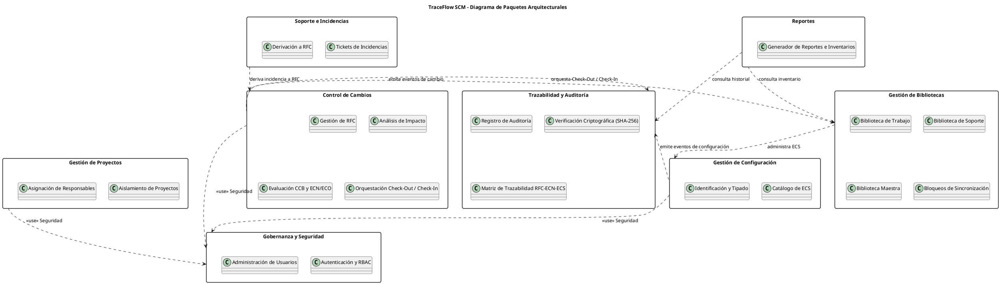
```plantuml
@startuml
skinparam shadowing false
skinparam roundcorner 8
skinparam defaultFontName Arial
skinparam packageStyle rectangle

title <b>TraceFlow SCM - Diagrama de Paquetes Arquitecturales</b>

package "Gobernanza y Seguridad" as PKG_GOB {
    class "Autenticación y RBAC" as MOD_RBAC
    class "Administración de Usuarios" as MOD_USER
}

package "Gestión de Proyectos" as PKG_PROJ {
    class "Aislamiento de Proyectos" as MOD_PROJ
    class "Asignación de Responsables" as MOD_RESP
}

package "Gestión de Configuración" as PKG_ECS {
    class "Catálogo de ECS" as MOD_ECS
    class "Identificación y Tipado" as MOD_TYPE
}

package "Gestión de Bibliotecas" as PKG_LIB {
    class "Biblioteca de Trabajo" as LIB_WRK
    class "Biblioteca de Soporte" as LIB_SUP
    class "Biblioteca Maestra" as LIB_MST
    class "Bloqueos de Sincronización" as MOD_LOCK
}

package "Control de Cambios" as PKG_CHG {
    class "Gestión de RFC" as MOD_RFC
    class "Análisis de Impacto" as MOD_IMP
    class "Evaluación CCB y ECN/ECO" as MOD_CCB
    class "Orquestación Check-Out / Check-In" as MOD_ORQ
}

package "Soporte e Incidencias" as PKG_SUPP {
    class "Tickets de Incidencias" as MOD_TCK
    class "Derivación a RFC" as MOD_DERIV
}

package "Trazabilidad y Auditoría" as PKG_AUD {
    class "Registro de Auditoría" as MOD_LOG
    class "Verificación Criptográfica (SHA-256)" as MOD_SHA
    class "Matriz de Trazabilidad RFC-ECN-ECS" as MOD_TRAC
}

package "Reportes" as PKG_REP {
    class "Generador de Reportes e Inventarios" as MOD_RPT
}

' Relaciones de dependencia descritas en la sección 6.1.1 del SRS
PKG_PROJ ..> PKG_GOB : <<use>> Seguridad
PKG_ECS ..> PKG_GOB : <<use>> Seguridad
PKG_CHG ..> PKG_GOB : <<use>> Seguridad

PKG_LIB ..> PKG_ECS : administra ECS
PKG_CHG ..> PKG_LIB : orquesta Check-Out / Check-In

PKG_SUPP ..> PKG_CHG : deriva incidencia a RFC
PKG_AUD <.. PKG_CHG : emite eventos de cambio
PKG_AUD <.. PKG_ECS : emite eventos de configuración

PKG_REP ..> PKG_AUD : consulta historial
PKG_REP ..> PKG_LIB : consulta inventario
@enduml
```

<!-- Página 33 del PDF original -->

### 6.1.2. Diagrama de Casos de Uso

Se identifican los siete roles definidos en el flujo de gestión de cambios de TraceFlow SCM (Solicitante, Analista de Requerimientos/Gestor, Arquitecto/Especialista Técnico, Comité de Control de Cambios, Administrador de Configuración/Bibliotecario, Ingeniero de Software/Desarrollador y Equipo de Calidad/Testing), que interactúan con los casos de uso agrupados en seis paquetes funcionales: Gestión de Usuarios y Proyectos, Registro y Evaluación de la RFC, Gestión de ECS y Bibliotecas, Implementación y Validación, Líneas Base y Rollback, e Incidencias/Trazabilidad/Reportes.

**Diagrama de Casos de Uso General - Sistema TraceFlow SCM**

Nota: Elaboración Propia

**Diagrama DG-05: Diagrama General de Casos de Uso**

#### Código PlantUML del Diagrama

```plantuml
@startuml
skinparam shadowing false
skinparam roundcorner 8
skinparam defaultFontName Arial
left to right direction

title <b>TraceFlow SCM - Diagrama General de Casos de Uso</b>

' =========================================================
' ACTORES CANÓNICOS
' =========================================================
actor "Solicitante" as ACT_SOL
actor "Analista de Requerimientos / Gestor" as ACT_ANA
actor "Arquitecto / Especialista Técnico" as ACT_ARQ
actor "Comité de Control de Cambios (CCB)" as ACT_CCB
actor "Administrador de Configuración / Bibliotecario" as ACT_ADM
actor "Ingeniero de Software / Desarrollador" as ACT_DEV
actor "Equipo de Calidad / Testing" as ACT_QA

' =========================================================
' PAQUETES FUNCIONALES
' =========================================================
rectangle "TraceFlow SCM" {
    package "Gestión de Usuarios y Proyectos" {
        usecase "CU-01: Gestionar usuarios y roles" as UC01
        usecase "CU-02: Crear y administrar proyectos" as UC02
        usecase "CU-03: Consultar proyecto" as UC03
    }

    package "Registro y Evaluación de la RFC" {
        usecase "CU-04: Registrar Solicitud de Cambio (RFC)" as UC04
        usecase "CU-05: Validar y clasificar la solicitud" as UC05
        usecase "CU-06: Realizar análisis de impacto técnico" as UC06
        usecase "CU-07: Evaluar viabilidad y aprobar/rechazar" as UC07
        usecase "CU-08: Emitir Orden de Cambio (ECN/ECO)" as UC08
    }

    package "Gestión de ECS y Bibliotecas" {
        usecase "CU-09: Registrar ECS" as UC09
        usecase "CU-10: Efectuar Check-Out (Soporte → Trabajo)" as UC10
        usecase "CU-11: Aplicar bloqueo de sincronización" as UC11
        usecase "CU-12: Efectuar Check-In (Trabajo → Maestra/Soporte)" as UC12
        usecase "CU-13: Consultar historial de versiones" as UC13
    }

    package "Implementación y Validación" {
        usecase "CU-14: Implementar cambio en el ECS" as UC14
        usecase "CU-15: Ejecutar pruebas unitarias locales" as UC15
        usecase "CU-16: Ejecutar pruebas de integración" as UC16
        usecase "CU-17: Certificar conformidad del cambio" as UC17
        usecase "CU-18: Reportar no conformidad" as UC18
        usecase "CU-19: Reevaluar y re-testear" as UC19
    }

    package "Líneas Base y Rollback" {
        usecase "CU-20: Crear y congelar línea base" as UC20
        usecase "CU-21: Ejecutar rollback en Biblioteca de Trabajo" as UC21
        usecase "CU-22: Cancelar Orden de Cambio" as UC22
    }

    package "Incidencias, Trazabilidad y Reportes" {
        usecase "CU-23: Registrar incidencia" as UC23
        usecase "CU-24: Consultar estado de ticket" as UC24
        usecase "CU-25: Derivar incidencia a RFC" as UC25
        usecase "CU-26: Validar integridad (checksum)" as UC26
        usecase "CU-27: Auditar acciones del sistema" as UC27
        usecase "CU-28: Generar reportes de estado" as UC28
    }
}

' Asociaciones Principales
ACT_ADM --> UC01
ACT_ANA --> UC02
ACT_ANA --> UC03

ACT_SOL --> UC04
ACT_ANA --> UC05
ACT_ARQ --> UC06
ACT_CCB --> UC07
ACT_CCB --> UC08

ACT_ARQ --> UC09
ACT_ADM --> UC10
ACT_ADM --> UC11
ACT_ADM --> UC12
ACT_ADM --> UC13

ACT_DEV --> UC14
ACT_DEV --> UC15
ACT_QA --> UC16
ACT_QA --> UC17
ACT_QA --> UC18
ACT_QA --> UC19

ACT_ADM --> UC20
ACT_ADM --> UC21
ACT_ADM --> UC22

ACT_SOL --> UC23
ACT_SOL --> UC24
ACT_ANA --> UC25
ACT_ADM --> UC26
ACT_CCB --> UC27
ACT_ADM --> UC28
@enduml
```

<!-- Página 34 del PDF original -->

**Diagrama DG-06: Casos de Uso: Administración de Usuarios y Proyectos**

#### Código PlantUML del Diagrama

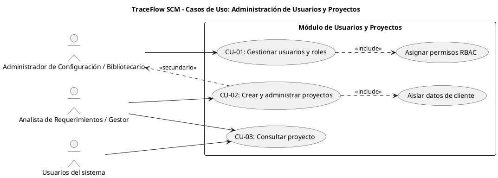
```plantuml
@startuml
skinparam shadowing false
skinparam roundcorner 8
skinparam defaultFontName Arial
left to right direction

title <b>TraceFlow SCM - Casos de Uso: Administración de Usuarios y Proyectos</b>

actor "Administrador de Configuración / Bibliotecario" as ACT_ADM
actor "Analista de Requerimientos / Gestor" as ACT_ANA
actor "Usuarios del sistema" as ACT_USR

rectangle "Módulo de Usuarios y Proyectos" {
    usecase "CU-01: Gestionar usuarios y roles" as UC01
    usecase "CU-02: Crear y administrar proyectos" as UC02
    usecase "CU-03: Consultar proyecto" as UC03

    usecase "Asignar permisos RBAC" as UC_RBAC
    usecase "Aislar datos de cliente" as UC_ISOLATE
}

ACT_ADM --> UC01
UC01 ..> UC_RBAC : <<include>>

ACT_ANA --> UC02
ACT_ANA --> UC03
ACT_USR --> UC03

UC02 ..> UC_ISOLATE : <<include>>
UC02 ..> ACT_ADM : <<secundario>>
@enduml
```

**Diagrama DG-07: Casos de Uso: Registro y Evaluación de RFC e Incidencias**

#### Código PlantUML del Diagrama

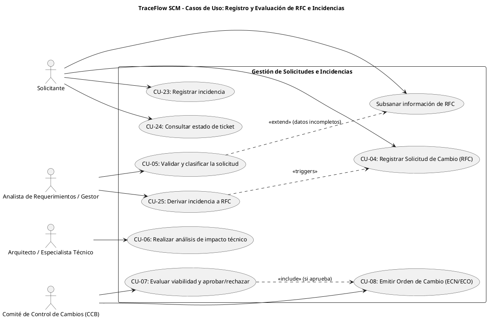
```plantuml
@startuml
skinparam shadowing false
skinparam roundcorner 8
skinparam defaultFontName Arial
left to right direction

title <b>TraceFlow SCM - Casos de Uso: Registro y Evaluación de RFC e Incidencias</b>

actor "Solicitante" as ACT_SOL
actor "Analista de Requerimientos / Gestor" as ACT_ANA
actor "Arquitecto / Especialista Técnico" as ACT_ARQ
actor "Comité de Control de Cambios (CCB)" as ACT_CCB

rectangle "Gestión de Solicitudes e Incidencias" {
    usecase "CU-23: Registrar incidencia" as UC23
    usecase "CU-24: Consultar estado de ticket" as UC24
    usecase "CU-25: Derivar incidencia a RFC" as UC25

    usecase "CU-04: Registrar Solicitud de Cambio (RFC)" as UC04
    usecase "CU-05: Validar y clasificar la solicitud" as UC05
    usecase "CU-06: Realizar análisis de impacto técnico" as UC06
    usecase "CU-07: Evaluar viabilidad y aprobar/rechazar" as UC07
    usecase "CU-08: Emitir Orden de Cambio (ECN/ECO)" as UC08

    usecase "Subsanar información de RFC" as UC_SUBSANAR
}

ACT_SOL --> UC23
ACT_SOL --> UC24
ACT_ANA --> UC25

UC25 ..> UC04 : <<triggers>>

ACT_SOL --> UC04
ACT_ANA --> UC05
UC05 ..> UC_SUBSANAR : <<extend>> (datos incompletos)
ACT_SOL --> UC_SUBSANAR

ACT_ARQ --> UC06
ACT_CCB --> UC07
ACT_CCB --> UC08

UC07 ..> UC08 : <<include>> (si aprueba)
@enduml
```

**Diagrama DG-08: Casos de Uso: SCM Core (ECS, Bibliotecas y Líneas Base)**

#### Código PlantUML del Diagrama

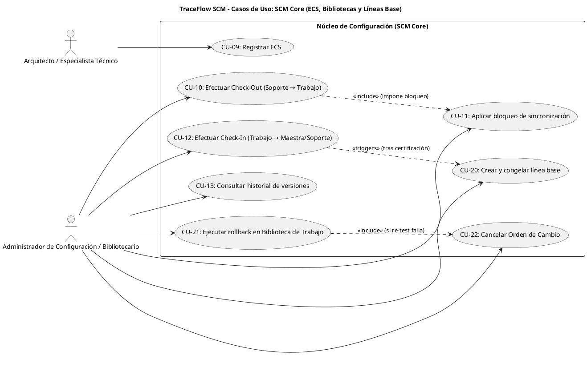
```plantuml
@startuml
skinparam shadowing false
skinparam roundcorner 8
skinparam defaultFontName Arial
left to right direction

title <b>TraceFlow SCM - Casos de Uso: SCM Core (ECS, Bibliotecas y Líneas Base)</b>

actor "Arquitecto / Especialista Técnico" as ACT_ARQ
actor "Administrador de Configuración / Bibliotecario" as ACT_ADM

rectangle "Núcleo de Configuración (SCM Core)" {
    usecase "CU-09: Registrar ECS" as UC09
    usecase "CU-10: Efectuar Check-Out (Soporte → Trabajo)" as UC10
    usecase "CU-11: Aplicar bloqueo de sincronización" as UC11
    usecase "CU-12: Efectuar Check-In (Trabajo → Maestra/Soporte)" as UC12
    usecase "CU-13: Consultar historial de versiones" as UC13
    usecase "CU-20: Crear y congelar línea base" as UC20
    usecase "CU-21: Ejecutar rollback en Biblioteca de Trabajo" as UC21
    usecase "CU-22: Cancelar Orden de Cambio" as UC22
}

ACT_ARQ --> UC09
ACT_ADM --> UC10
ACT_ADM --> UC11
ACT_ADM --> UC12
ACT_ADM --> UC13
ACT_ADM --> UC20
ACT_ADM --> UC21
ACT_ADM --> UC22

UC10 ..> UC11 : <<include>> (impone bloqueo)
UC12 ..> UC20 : <<triggers>> (tras certificación)
UC21 ..> UC22 : <<include>> (si re-test falla)
@enduml
```

**Diagrama DG-09: Casos de Uso: Implementación y Validación de Calidad**

#### Código PlantUML del Diagrama

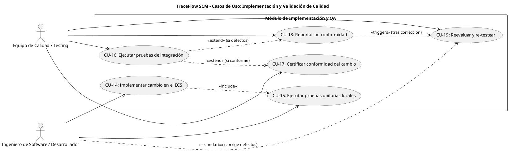
```plantuml
@startuml
skinparam shadowing false
skinparam roundcorner 8
skinparam defaultFontName Arial
left to right direction

title <b>TraceFlow SCM - Casos de Uso: Implementación y Validación de Calidad</b>

actor "Ingeniero de Software / Desarrollador" as ACT_DEV
actor "Equipo de Calidad / Testing" as ACT_QA

rectangle "Módulo de Implementación y QA" {
    usecase "CU-14: Implementar cambio en el ECS" as UC14
    usecase "CU-15: Ejecutar pruebas unitarias locales" as UC15
    usecase "CU-16: Ejecutar pruebas de integración" as UC16
    usecase "CU-17: Certificar conformidad del cambio" as UC17
    usecase "CU-18: Reportar no conformidad" as UC18
    usecase "CU-19: Reevaluar y re-testear" as UC19
}

ACT_DEV --> UC14
ACT_DEV --> UC15
UC14 ..> UC15 : <<include>>

ACT_QA --> UC16
ACT_QA --> UC17
ACT_QA --> UC18
ACT_QA --> UC19

UC16 ..> UC17 : <<extend>> (si conforme)
UC16 ..> UC18 : <<extend>> (si defectos)
UC18 ..> UC19 : <<triggers>> (tras corrección)
ACT_DEV ..> UC19 : <<secundario>> (corrige defectos)
@enduml
```

**Diagrama DG-10: Casos de Uso: Trazabilidad, Auditoría e Integridad**

#### Código PlantUML del Diagrama

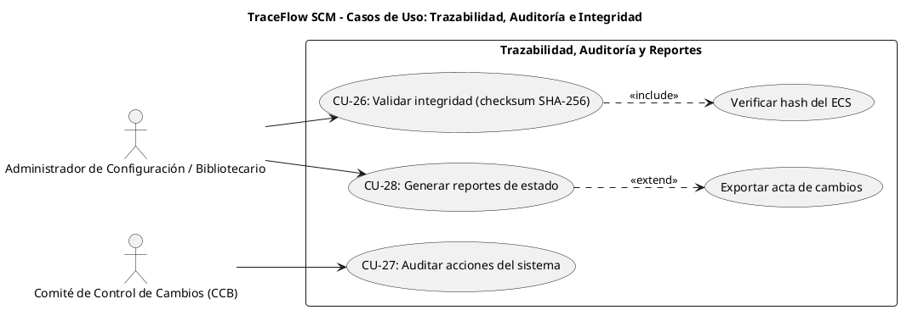
```plantuml
@startuml
skinparam shadowing false
skinparam roundcorner 8
skinparam defaultFontName Arial
left to right direction

title <b>TraceFlow SCM - Casos de Uso: Trazabilidad, Auditoría e Integridad</b>

actor "Administrador de Configuración / Bibliotecario" as ACT_ADM
actor "Comité de Control de Cambios (CCB)" as ACT_CCB

rectangle "Trazabilidad, Auditoría y Reportes" {
    usecase "CU-26: Validar integridad (checksum SHA-256)" as UC26
    usecase "CU-27: Auditar acciones del sistema" as UC27
    usecase "CU-28: Generar reportes de estado" as UC28

    usecase "Verificar hash del ECS" as UC_HASH
    usecase "Exportar acta de cambios" as UC_EXP
}

ACT_ADM --> UC26
ACT_CCB --> UC27
ACT_ADM --> UC28

UC26 ..> UC_HASH : <<include>>
UC28 ..> UC_EXP : <<extend>>
@enduml
```

### 6.1.3. Escenarios de Caso de Uso (narrativa)

| Campo | Descripción |
| --- | --- |
| Código | CU-01 (CUS01) |
| Nombre | Gestionar usuarios y roles |
| Tipo | Secundario, administrativo |
| Requerimiento asociado | RF-01 – Gestión de Usuarios y Roles |
| Actor principal | Administrador de Configuración / Bibliotecario |
| Actores secundarios | Usuarios del sistema |
| Módulo relacionado | Gestión de Usuarios y Proyectos |
| Propósito | Permitir administrar las cuentas de usuario y asignar los roles correspondientes dentro de TraceFlow SCM. |
| Descripción | El Administrador registra usuarios, modifica sus datos y asigna uno de los roles definidos en el flujo de gestión de configuración. El sistema restringe las funcionalidades |

<!-- Página 37 del PDF original -->

disponibles de acuerdo con el rol asignado. Resultado esperado El usuario queda registrado o actualizado con los permisos correspondientes a su rol.

**Flujo Principal:**

| N.º | Acción del actor | Respuesta del sistema |
| --- | --- | --- |
| 1 | El Administrador selecciona la opción “Gestionar usuarios y roles”. | El sistema muestra el listado de usuarios registrados y las opciones de administración. |
| 2 | Selecciona la opción para registrar un nuevo usuario. | El sistema muestra el formulario de registro de usuario. |
| 3 | Ingresa los datos requeridos y selecciona el rol correspondiente. | El sistema valida los datos y determina los permisos asociados al rol seleccionado. |
| 4 | Confirma el registro. | El sistema registra al usuario y habilita las funcionalidades correspondientes a su rol. |

**Flujos Alternativos:**

| Código | Situación | Acción del actor | Respuesta del sistema |
| --- | --- | --- | --- |
| FA01 | Se requiere modificar el rol de un usuario existente. | El Administrador selecciona al usuario y cambia el rol asignado. | El sistema actualiza los permisos conservando la trazabilidad del usuario. |
| FA02 | Se requiere desactivar una cuenta sin eliminar su historial. | El Administrador selecciona la opción de desactivación. | El sistema bloquea el acceso de la cuenta y conserva sus acciones |

<!-- Página 38 del PDF original -->

históricas.

**Eventos de Excepción:**

| Código | Evento de excepción | Respuesta del sistema |
| --- | --- | --- |
| E01 | Existen datos obligatorios incompletos. | El sistema no registra al usuario e indica los campos pendientes. |
| E02 | El correo o identificador ingresado ya está registrado. | El sistema rechaza el registro e informa que el usuario ya existe. |
| E03 | El usuario que realiza la operación no posee permisos suficientes. | El sistema bloquea la operación y registra el intento en auditoría. |

| Campo | Descripción |
| --- | --- |
| Código | CU-02 (CUS02) |
| Nombre | Crear y administrar proyectos |
| Tipo | Primario, administrativo |
| Requerimiento asociado | RF-02 – Gestión de Proyectos |
| Actor principal | Analista de Requerimientos / Gestor |
| Actores secundarios | Administrador de Configuración / Bibliotecario |
| Módulo relacionado | Gestión de Usuarios y Proyectos |
| Propósito | Permitir crear y mantener los proyectos de clientes que serán gestionados de forma independiente en TraceFlow SCM. |
| Descripción | El Analista registra un proyecto indicando sus datos principales, cliente y responsables. El sistema crea un espacio lógico |

<!-- Página 39 del PDF original -->

independiente para administrar sus ECS, solicitudes de cambio, órdenes y líneas base. Resultado esperado El proyecto queda registrado y disponible para la gestión de configuración de forma aislada respecto de los demás proyectos.

**Flujo Principal:**

| N.º | Acción del actor | Respuesta del sistema |
| --- | --- | --- |
| 1 | El Analista selecciona la opción “Crear proyecto”. | El sistema muestra el formulario de registro del proyecto. |
| 2 | Ingresa el nombre, cliente, descripción y responsables del proyecto. | El sistema valida que la información obligatoria esté completa. |
| 3 | Confirma la creación del proyecto. | El sistema genera un identificador único y crea el espacio lógico del proyecto. |
| 4 | Revisa el proyecto registrado. | El sistema muestra el detalle y habilita las opciones de administración correspondientes. |

**Flujos Alternativos:**

| Código | Situación | Acción del actor | Respuesta del sistema |
| --- | --- | --- | --- |
| FA01 | Se requiere actualizar información general de un proyecto. | El Analista selecciona el proyecto y modifica los campos permitidos. | El sistema actualiza la información conservando el identificador y la trazabilidad. |
| FA02 | El proyecto ha finalizado y ya no debe recibir nuevos | El Analista solicita cambiar su estado a cerrado o inactivo. | El sistema restringe nuevas operaciones y |

<!-- Página 40 del PDF original -->

cambios. mantiene disponible el historial de consulta.

**Eventos de Excepción:**

| Código | Evento de excepción | Respuesta del sistema |
| --- | --- | --- |
| E01 | Faltan datos obligatorios del proyecto. | El sistema no registra el proyecto y resalta los campos pendientes. |
| E02 | El identificador o nombre interno del proyecto ya está en uso. | El sistema solicita utilizar un identificador diferente. |
| E03 | Ocurre un error durante la creación del espacio lógico. | El sistema cancela la creación y notifica que la operación debe reintentarse. |

| Campo | Descripción |
| --- | --- |
| Código | CU-03 (CUS03) |
| Nombre | Consultar proyecto |
| Tipo | Secundario, consulta |
| Requerimiento asociado | RF-02 – Gestión de Proyectos |
| Actor principal | Analista de Requerimientos / Gestor |
| Actores secundarios | Personal autorizado del proyecto |
| Módulo relacionado | Gestión de Usuarios y Proyectos |
| Propósito | Permitir consultar la información general y el estado de un proyecto registrado en TraceFlow SCM. |
| Descripción | El Analista busca un proyecto |

<!-- Página 41 del PDF original -->

mediante criterios de consulta y accede a sus datos, responsables, estado y referencias de configuración disponibles según sus permisos. Resultado esperado El sistema presenta la información actualizada del proyecto seleccionado sin modificar su contenido.

**Flujo Principal:**

| N.º | Acción del actor | Respuesta del sistema |
| --- | --- | --- |
| 1 | El Analista accede a la opción de consulta de proyectos. | El sistema muestra los filtros de búsqueda disponibles. |
| 2 | Ingresa uno o más criterios de búsqueda. | El sistema lista los proyectos que coinciden con los criterios y a los que tiene acceso. |
| 3 | Selecciona un proyecto del listado. | El sistema muestra los datos generales, responsables y estado del proyecto. |
| 4 | Revisa la información requerida. | El sistema mantiene disponibles las opciones de consulta asociadas al proyecto. |

**Flujos Alternativos:**

| Código | Situación | Acción del actor | Respuesta del sistema |
| --- | --- | --- | --- |
| FA01 | La búsqueda devuelve una cantidad elevada de proyectos. | El Analista aplica filtros adicionales. | El sistema actualiza el listado con los nuevos criterios. |
| FA02 | El Analista desea consultar un proyecto cerrado. | Selecciona la opción de incluir proyectos inactivos o cerrados. | El sistema incorpora esos proyectos en los resultados de |

<!-- Página 42 del PDF original -->

consulta.

**Eventos de Excepción:**

| Código | Evento de excepción | Respuesta del sistema |
| --- | --- | --- |
| E01 | No existen proyectos que coincidan con los criterios. | El sistema informa que no se encontraron resultados. |
| E02 | El usuario intenta consultar un proyecto para el cual no posee permisos. | El sistema deniega el acceso al detalle del proyecto. |

| Campo | Descripción |
| --- | --- |
| Código | CU-04 (CUS04) |
| Nombre | Registrar Solicitud de Cambio (RFC) |
| Tipo | Primario, esencial |
| Requerimiento asociado | RF-04 – Registro de Solicitudes de Cambio (RFC) |
| Actor principal | Solicitante |
| Actores secundarios | Analista de Requerimientos / Gestor |
| Módulo relacionado | Registro y Evaluación de la RFC |
| Propósito | Permitir registrar formalmente una necesidad de cambio sobre un proyecto o Elemento de Configuración. |
| Descripción | El Solicitante completa una RFC indicando descripción, justificación, prioridad, ECS afectado y fecha. El sistema registra la solicitud e inicia el flujo formal de evaluación de |

<!-- Página 43 del PDF original -->

cambios. Resultado esperado La RFC queda registrada con estado “Registrado” y disponible para la validación y clasificación del Analista.

**Flujo Principal:**

| N.º | Acción del actor | Respuesta del sistema |
| --- | --- | --- |
| 1 | El Solicitante selecciona la opción “Registrar Solicitud de Cambio (RFC)”. | El sistema muestra el formulario de registro de la solicitud. |
| 2 | Completa la descripción, justificación, prioridad, ECS afectado y fecha. | El sistema valida los datos ingresados y la existencia del ECS seleccionado. |
| 3 | Revisa la información y confirma el registro. | El sistema genera un identificador único para la RFC y la guarda con estado “Registrado”. |
| 4 | Consulta la confirmación de registro. | El sistema notifica al Analista de Requerimientos / Gestor que existe una nueva RFC pendiente de revisión. |

**Flujos Alternativos:**

| Código | Situación | Acción del actor | Respuesta del sistema |
| --- | --- | --- | --- |
| FA01 | El Solicitante desea corregir información antes de enviar la RFC. | Modifica los campos del formulario antes de confirmar. | El sistema conserva los cambios y vuelve a validar la información. |
| FA02 | La solicitud corresponde a una incidencia previamente registrada. | El Solicitante o Analista selecciona la incidencia relacionada. | El sistema vincula la RFC con el ticket de incidencia de origen. |

<!-- Página 44 del PDF original -->

**Eventos de Excepción:**

| Código | Evento de excepción | Respuesta del sistema |
| --- | --- | --- |
| E01 | Uno o más campos obligatorios están vacíos. | El sistema no registra la RFC y señala los campos que deben completarse. |
| E02 | El ECS indicado no existe o no pertenece al proyecto seleccionado. | El sistema rechaza la selección y solicita elegir un ECS válido. |
| E03 | Ocurre una interrupción durante el registro. | El sistema informa que la RFC no pudo registrarse y permite reintentar la operación. |

| Campo | Descripción |
| --- | --- |
| Código | CU-05 (CUS05) |
| Nombre | Validar y clasificar la solicitud |
| Tipo | Primario, esencial |
| Requerimiento asociado | RF-04, RF-05 – Registro, Clasificación y Análisis de Impacto |
| Actor principal | Analista de Requerimientos / Gestor |
| Actores secundarios | Solicitante |
| Módulo relacionado | Registro y Evaluación de la RFC |
| Propósito | Verificar que la RFC contenga información suficiente y clasificar el tipo y criticidad del cambio. |
| Descripción | El Analista revisa la información registrada en la RFC. Si está completa, determina el tipo y la |

<!-- Página 45 del PDF original -->

criticidad; si requiere información adicional, solicita la subsanación al Solicitante. Resultado esperado La RFC queda en estado “Clasificado” y preparada para el análisis técnico, o en “En Subsanación” si requiere datos adicionales.

**Flujo Principal:**

| N.º | Acción del actor | Respuesta del sistema |
| --- | --- | --- |
| 1 | El Analista selecciona una RFC con estado “Registrado”. | El sistema muestra el detalle de la solicitud y el ECS relacionado. |
| 2 | Revisa que la descripción, justificación, prioridad y demás datos sean suficientes. | El sistema permite validar la completitud de la información. |
| 3 | Define el tipo y la criticidad del cambio. | El sistema registra la clasificación seleccionada. |
| 4 | Confirma la validación de la solicitud. | El sistema actualiza el estado a “Clasificado” y la remite al análisis técnico. |

**Flujos Alternativos:**

| Código | Situación | Acción del actor | Respuesta del sistema |
| --- | --- | --- | --- |
| FA01 | La información de la RFC es incompleta o poco clara. | El Analista registra las observaciones y solicita subsanación. | El sistema cambia el estado a “En Subsanación” y notifica al Solicitante. |
| FA02 | El Solicitante completa la información observada. | Corrige los datos y reenvía la solicitud. | El sistema devuelve la RFC al Analista para una nueva |

<!-- Página 46 del PDF original -->

validación.

**Eventos de Excepción:**

| Código | Evento de excepción | Respuesta del sistema |
| --- | --- | --- |
| E01 | La RFC fue cerrada o cancelada previamente. | El sistema impide modificar su clasificación. |
| E02 | No se puede acceder al ECS asociado a la solicitud. | El sistema informa la inconsistencia y no permite finalizar la validación. |
| E03 | El Analista intenta clasificar sin completar los datos obligatorios de clasificación. | El sistema solicita completar la información faltante. |

| Campo | Descripción |
| --- | --- |
| Código | CU-06 (CUS06) |
| Nombre | Realizar análisis de impacto técnico |
| Tipo | Primario, esencial |
| Requerimiento asociado | RF-05 – Clasificación y Análisis de Impacto |
| Actor principal | Arquitecto / Especialista Técnico |
| Actores secundarios | Analista de Requerimientos / Gestor |
| Módulo relacionado | Registro y Evaluación de la RFC |
| Propósito | Determinar las consecuencias técnicas, esfuerzo, costo, tiempo y riesgos asociados a la implementación de una RFC. |
| Descripción | El Arquitecto revisa la RFC |

<!-- Página 47 del PDF original -->

clasificada y analiza la arquitectura, dependencias, esfuerzo, costo, tiempo y riesgos. Con esta información genera el Informe Técnico de Impacto requerido para la evaluación del CCB. Resultado esperado El Informe Técnico de Impacto queda registrado y la RFC queda disponible para evaluación del Comité de Control de Cambios.

**Flujo Principal:**

| N.º | Acción del actor | Respuesta del sistema |
| --- | --- | --- |
| 1 | El Arquitecto selecciona una RFC con estado “Clasificado”. | El sistema muestra la solicitud, el ECS afectado y la información de contexto disponible. |
| 2 | Analiza la arquitectura, dependencias y componentes relacionados. | El sistema permite registrar los impactos técnicos identificados. |
| 3 | Registra estimaciones de esfuerzo, costo, tiempo y riesgos. | El sistema consolida los datos en el Informe Técnico de Impacto. |
| 4 | Finaliza y confirma el análisis. | El sistema registra el informe, actualiza el estado a “En Análisis Técnico” completado y habilita la evaluación del CCB. |

**Flujos Alternativos:**

Código Situación Acción del actor Respuesta del sistema FA01 El Arquitecto Consulta el historial El sistema requiere revisar de versiones y muestra la antecedentes del cambios trazabilidad ECS. relacionados. disponible para

<!-- Página 48 del PDF original -->

complementar el análisis. FA02 Se identifica El Arquitecto El sistema impacto sobre más incorpora los registra las de un ECS. elementos dependencias e adicionales en el impactos informe. asociados a cada elemento.

**Eventos de Excepción:**

| Código | Evento de excepción | Respuesta del sistema |
| --- | --- | --- |
| E01 | Falta información necesaria para completar el análisis. | El sistema impide finalizar el informe e indica los datos pendientes. |
| E02 | El ECS relacionado ya no está disponible para consulta. | El sistema informa la inconsistencia y suspende el cierre del análisis. |
| E03 | Se intenta remitir al CCB una RFC sin Informe Técnico completo. | El sistema bloquea la remisión hasta completar el informe. |

| Campo | Descripción |
| --- | --- |
| Código | CU-07 (CUS07) |
| Nombre | Evaluar viabilidad y aprobar/rechazar |
| Tipo | Primario, esencial |
| Requerimiento asociado | RF-06 – Evaluación y Aprobación por el CCB |
| Actor principal | Comité de Control de Cambios (CCB) |

<!-- Página 49 del PDF original -->

| Actores secundarios | Arquitecto / Especialista Técnico, Analista de Requerimientos / Gestor, Solicitante |
| --- | --- |
| Módulo relacionado | Registro y Evaluación de la RFC |
| Propósito | Permitir al CCB determinar la viabilidad del cambio y registrar formalmente su aprobación o rechazo. |
| Descripción | El CCB revisa la RFC y el Informe Técnico de Impacto, evalúa la viabilidad y toma una decisión. Cuando el cambio no es aprobado, registra la causal correspondiente para conservar la trazabilidad del cierre. |
| Resultado esperado | La RFC queda aprobada para emitir una Orden de Cambio o cerrada como rechazo técnico o administrativo, según corresponda. |

**Flujo Principal:**

| N.º | Acción del actor | Respuesta del sistema |
| --- | --- | --- |
| 1 | El CCB selecciona una RFC lista para evaluación. | El sistema muestra la solicitud y el Informe Técnico de Impacto. |
| 2 | Revisa la viabilidad, riesgos y estimaciones del cambio. | El sistema habilita las opciones de aprobación y rechazo. |
| 3 | Selecciona la opción “Aprobar”. | El sistema registra la decisión del Comité. |
| 4 | Confirma la decisión. | El sistema deja la RFC aprobada y habilita la emisión de la Orden de Cambio (ECN/ECO). |

**Flujos Alternativos:**

<!-- Página 50 del PDF original -->

| Código | Situación | Acción del actor | Respuesta del sistema |
| --- | --- | --- | --- |
| FA01 | El cambio es considerado técnicamente inviable. | El CCB selecciona rechazo técnico y registra la causal. | El sistema cierra la RFC como “Rechazado (Técnico)” y notifica al Solicitante. |
| FA02 | El cambio es viable, pero el CCB decide no autorizarlo. | El CCB registra la causal administrativa. | El sistema cierra la RFC como “Rechazado (Administrativo )” y notifica al Solicitante. |

**Eventos de Excepción:**

| Código | Evento de excepción | Respuesta del sistema |
| --- | --- | --- |
| E01 | La RFC no cuenta con un Informe Técnico de Impacto completo. | El sistema impide iniciar la decisión formal del CCB. |
| E02 | Se intenta rechazar una solicitud sin registrar la causal. | El sistema exige la justificación antes de confirmar el rechazo. |
| E03 | La RFC cambió de estado mientras estaba siendo evaluada. | El sistema actualiza la información y solicita revisar nuevamente antes de decidir. |

| Campo | Descripción |
| --- | --- |
| Código | CU-08 (CUS08) |
| Nombre | Emitir Orden de Cambio (ECN/ECO) |

<!-- Página 51 del PDF original -->

| Tipo | Primario, esencial |
| --- | --- |
| Requerimiento asociado | RF-07 – Gestión de Órdenes de Cambio |
| Actor principal | Comité de Control de Cambios (CCB) |
| Actores secundarios | Analista de Requerimientos / Gestor, Administrador de Configuración / Bibliotecario |
| Módulo relacionado | Registro y Evaluación de la RFC |
| Propósito | Formalizar la autorización para implementar una modificación previamente aprobada por el CCB. |
| Descripción | Una vez aprobada la RFC, el CCB genera la Orden de Cambio ECN/ECO. La orden queda vinculada con la solicitud y el ECS afectado y sirve como autorización formal para iniciar las operaciones de configuración. |
| Resultado esperado | La Orden de Cambio queda emitida, vinculada a la RFC y disponible para iniciar el Check-Out del ECS. |

**Flujo Principal:**

| N.º | Acción del actor | Respuesta del sistema |
| --- | --- | --- |
| 1 | El CCB selecciona una RFC aprobada. | El sistema verifica el estado de aprobación y muestra los datos del cambio. |
| 2 | Selecciona la opción “Emitir Orden de Cambio”. | El sistema prepara la ECN/ECO con la información asociada a la RFC. |
| 3 | Revisa las instrucciones de ejecución y confirma la | El sistema genera el identificador de la Orden de |

<!-- Página 52 del PDF original -->

emisión. Cambio y la vincula al ECS.

# 4. Finaliza la emisión. El sistema actualiza el estado a

“Aprobado – Orden Emitida” y notifica a los responsables de ejecución.

**Flujos Alternativos:**

| Código | Situación | Acción del actor | Respuesta del sistema |
| --- | --- | --- | --- |
| FA01 | La Orden requiere instrucciones técnicas adicionales. | El CCB completa las observaciones antes de confirmar. | El sistema incorpora las instrucciones en la ECN/ECO. |
| FA02 | Se requiere consultar el detalle de la RFC antes de emitir. | El CCB abre la solicitud relacionada. | El sistema muestra la trazabilidad de la aprobación sin abandonar el proceso de emisión. |

**Eventos de Excepción:**

| Código | Evento de excepción | Respuesta del sistema |
| --- | --- | --- |
| E01 | La RFC no está aprobada. | El sistema impide emitir una Orden de Cambio. |
| E02 | Ya existe una Orden de Cambio vigente para la misma RFC. | El sistema informa la duplicidad y no genera una nueva orden. |
| E03 | Falla el registro de la Orden. | El sistema no cambia el estado de la RFC y permite reintentar la emisión. |

Campo Descripción

<!-- Página 53 del PDF original -->

| Código | CU-09 (CUS09) |
| --- | --- |
| Nombre | Registrar ECS |
| Tipo | Primario, esencial |
| Requerimiento asociado | RF-03 – Identificación de ECS |
| Actor principal | Arquitecto / Especialista Técnico |
| Actores secundarios | Ingeniero de Software / Desarrollador |
| Módulo relacionado | Gestión de ECS y Bibliotecas |
| Propósito | Permitir identificar y catalogar los Elementos de Configuración administrados por cada proyecto. |
| Descripción | El usuario registra un ECS indicando el proyecto, nombre, tipo de elemento y versión inicial. El sistema le asigna una identificación única y lo incorpora al inventario de configuración. |
| Resultado esperado | El ECS queda registrado, clasificado y disponible para las operaciones de versionamiento y control de cambios. |

**Flujo Principal:**

| N.º | Acción del actor | Respuesta del sistema |
| --- | --- | --- |
| 1 | El Arquitecto selecciona la opción “Registrar ECS”. | El sistema muestra el formulario de identificación del elemento. |
| 2 | Indica proyecto, nombre, tipo y versión inicial del ECS. | El sistema valida la información y la pertenencia al proyecto. |
| 3 | Adjunta o referencia el | El sistema valida que el |

<!-- Página 54 del PDF original -->

artefacto que será controlado. elemento sea accesible.

# 4. Confirma el registro. El sistema genera el

identificador único del ECS y lo incorpora al inventario del proyecto.

**Flujos Alternativos:**

| Código | Situación | Acción del actor | Respuesta del sistema |
| --- | --- | --- | --- |
| FA01 | El ECS corresponde a documentación o esquema de base de datos en lugar de código. | El usuario selecciona el tipo de ECS correspondiente. | El sistema adapta los datos de clasificación al tipo seleccionado. |
| FA02 | El usuario desea registrar varios ECS relacionados. | Registra cada elemento e indica sus relaciones. | El sistema conserva las asociaciones entre los ECS del proyecto. |

**Eventos de Excepción:**

| Código | Evento de excepción | Respuesta del sistema |
| --- | --- | --- |
| E01 | El ECS ya se encuentra registrado en el proyecto. | El sistema informa la posible duplicidad y no crea un nuevo identificador. |
| E02 | La versión inicial ingresada no cumple el formato configurado. | El sistema solicita corregir la versión antes de continuar. |
| E03 | El artefacto referenciado no puede ser localizado. | El sistema no completa el registro y solicita verificar la referencia. |

Campo Descripción

<!-- Página 55 del PDF original -->

| Código | CU-10 (CUS10) |
| --- | --- |
| Nombre | Efectuar Check-Out (Soporte → Trabajo) |
| Tipo | Primario, esencial |
| Requerimiento asociado | RF-08, RF-09 – Gestión de Bibliotecas y Control de Versiones |
| Actor principal | Administrador de Configuración / Bibliotecario |
| Actores secundarios | Ingeniero de Software / Desarrollador |
| Módulo relacionado | Gestión de ECS y Bibliotecas |
| Propósito | Trasladar de forma controlada un ECS desde la Biblioteca de Soporte hacia la Biblioteca de Trabajo para implementar una Orden de Cambio. |
| Descripción | El Administrador selecciona una Orden de Cambio vigente y ejecuta el Check-Out del ECS asociado. El sistema registra la operación y coloca el elemento en la Biblioteca de Trabajo para su modificación controlada. |
| Resultado esperado | El ECS queda disponible en la Biblioteca de Trabajo, asociado a la Orden de Cambio y preparado para aplicar el bloqueo de sincronización. |

**Flujo Principal:**

| N.º | Acción del actor | Respuesta del sistema |
| --- | --- | --- |
| 1 | El Administrador selecciona una Orden de Cambio vigente. | El sistema muestra el ECS o los ECS asociados a la orden. |
| 2 | Selecciona el ECS y solicita | El sistema verifica su |

<!-- Página 56 del PDF original -->

|  | efectuar el Check-Out. | ubicación, estado y disponibilidad. |
| --- | --- | --- |
| 3 | Confirma la operación. | El sistema traslada una copia controlada del ECS a la Biblioteca de Trabajo. |
| 4 | Revisa la confirmación. | El sistema registra autor, fecha, versión y Orden de Cambio asociada al Check-Out. |

**Flujos Alternativos:**

| Código | Situación | Acción del actor | Respuesta del sistema |
| --- | --- | --- | --- |
| FA01 | La Orden de Cambio afecta a más de un ECS. | El Administrador selecciona los elementos requeridos. | El sistema procesa cada Check-Out de forma individual y conserva su trazabilidad. |
| FA02 | Se requiere consultar la versión vigente antes de efectuar el Check-Out. | El Administrador abre el historial del ECS. | El sistema muestra las versiones disponibles y permite regresar a la operación. |

**Eventos de Excepción:**

| Código | Evento de excepción | Respuesta del sistema |
| --- | --- | --- |
| E01 | El ECS ya tiene un Check-Out activo. | El sistema rechaza la operación e informa el bloqueo existente. |
| E02 | La Orden de Cambio fue cancelada o no está vigente. | El sistema impide efectuar el Check-Out. |
| E03 | El ECS no se encuentra en la | El sistema cancela la operación y solicita |

<!-- Página 57 del PDF original -->

Biblioteca de Soporte. revisar su ubicación actual.

| Campo | Descripción |
| --- | --- |
| Código | CU-11 (CUS11) |
| Nombre | Aplicar bloqueo de sincronización |
| Tipo | Incluido, esencial |
| Requerimiento asociado | RF-09 – Control de Versiones y Bloqueos de Sincronización |
| Actor principal | Administrador de Configuración / Bibliotecario |
| Actores secundarios | Ingeniero de Software / Desarrollador |
| Módulo relacionado | Gestión de ECS y Bibliotecas |
| Propósito | Evitar la edición concurrente de un mismo ECS mientras se encuentra en la Biblioteca de Trabajo. |
| Descripción | Después del Check-Out, el Administrador aplica un bloqueo de sincronización sobre el ECS. Mientras el bloqueo está vigente, otros usuarios no pueden iniciar una modificación concurrente del mismo elemento. |
| Resultado esperado | El ECS queda bloqueado para otros usuarios hasta que se realice su Check-In o rollback. |

**Flujo Principal:**

N.º Acción del actor Respuesta del sistema

# 1. El Administrador finaliza el El sistema identifica el

<!-- Página 58 del PDF original -->

|  | Check-Out de un ECS. | elemento trasladado a la Biblioteca de Trabajo. |
| --- | --- | --- |
| 2 | Solicita aplicar el bloqueo de sincronización. | El sistema comprueba que no exista otro bloqueo vigente sobre el mismo ECS. |
| 3 | Confirma la aplicación del bloqueo. | El sistema registra el usuario, fecha y Orden de Cambio asociada. |
| 4 | Consulta el estado del ECS. | El sistema muestra el elemento como bloqueado para edición concurrente. |

**Flujos Alternativos:**

| Código | Situación | Acción del actor | Respuesta del sistema |
| --- | --- | --- | --- |
| FA01 | Se completa correctamente el Check-In del ECS. | El Administrador confirma la finalización de la operación. | El sistema libera automáticament e el bloqueo de sincronización. |
| FA02 | Se ejecuta un rollback sobre el ECS. | El Administrador completa la reversión. | El sistema libera el bloqueo una vez restaurado el estado anterior. |

**Eventos de Excepción:**

| Código | Evento de excepción | Respuesta del sistema |
| --- | --- | --- |
| E01 | Ya existe un bloqueo activo sobre el ECS. | El sistema impide aplicar un segundo bloqueo y muestra su responsable. |
| E02 | El ECS no se encuentra en la Biblioteca de Trabajo. | El sistema no permite aplicar el bloqueo. |

<!-- Página 59 del PDF original -->

E03 No se puede registrar El sistema revierte la el bloqueo. operación y mantiene el ECS sin habilitar para modificación.

| Campo | Descripción |
| --- | --- |
| Código | CU-12 (CUS12) |
| Nombre | Efectuar Check-In (Trabajo → Maestra/Soporte) |
| Tipo | Primario, esencial |
| Requerimiento asociado | RF-08, RF-09 – Gestión de Bibliotecas y Control de Versiones |
| Actor principal | Administrador de Configuración / Bibliotecario |
| Actores secundarios | Equipo de Calidad / Testing |
| Módulo relacionado | Gestión de ECS y Bibliotecas |
| Propósito | Integrar un ECS verificado desde la Biblioteca de Trabajo hacia la Biblioteca Maestra/Soporte mediante una operación controlada de Check-In. |
| Descripción | El Administrador selecciona el ECS cuya conformidad fue certificada por QA, verifica la Orden de Cambio y realiza el Check-In. El sistema registra una nueva versión y deja el elemento preparado para establecer una línea base. |
| Resultado esperado | El ECS certificado queda incorporado a la Biblioteca Maestra/Soporte con una nueva versión registrada y trazable. |

<!-- Página 60 del PDF original -->

**Flujo Principal:**

| N.º | Acción del actor | Respuesta del sistema |
| --- | --- | --- |
| 1 | El Administrador selecciona el ECS certificado por QA. | El sistema muestra la versión de trabajo y verifica la certificación de conformidad. |
| 2 | Solicita efectuar el Check-In. | El sistema valida la Orden de Cambio, el bloqueo y los datos de la nueva versión. |
| 3 | Confirma la operación e ingresa el mensaje descriptivo del cambio. | El sistema integra el ECS en la Biblioteca Maestra/Soporte y registra autor, fecha y descripción. |
| 4 | Revisa la confirmación. | El sistema habilita la creación y congelamiento de la nueva línea base. |

**Flujos Alternativos:**

| Código | Situación | Acción del actor | Respuesta del sistema |
| --- | --- | --- | --- |
| FA01 | El Check-In involucra varios ECS certificados. | El Administrador selecciona el conjunto correspondiente. | El sistema procesa y registra cada elemento de manera independiente. |
| FA02 | Se requiere revisar el resultado de QA antes de confirmar. | El Administrador consulta la certificación asociada. | El sistema muestra la evidencia de conformidad y permite volver al Check-In. |

**Eventos de Excepción:**

Código Evento de excepción Respuesta del sistema E01 El ECS no posee El sistema bloquea el certificación de Check-In.

<!-- Página 61 del PDF original -->

|  | conformidad de QA. |  |
| --- | --- | --- |
| E02 | El ECS fue modificado después de la certificación. | El sistema rechaza la operación y solicita una nueva validación. |
| E03 | No se registra un mensaje descriptivo o una Orden de Cambio válida. | El sistema no permite completar el Check-In. |

| Campo | Descripción |
| --- | --- |
| Código | CU-13 (CUS13) |
| Nombre | Consultar historial de versiones |
| Tipo | Secundario, consulta |
| Requerimiento asociado | RF-09, RF-16 – Control de Versiones y Trazabilidad |
| Actor principal | Administrador de Configuración / Bibliotecario |
| Actores secundarios | Arquitecto / Especialista Técnico, Ingeniero de Software / Desarrollador |
| Módulo relacionado | Gestión de ECS y Bibliotecas |
| Propósito | Permitir consultar las versiones históricas y las operaciones realizadas sobre un ECS. |
| Descripción | El usuario autorizado selecciona un ECS y accede a su historial de versiones. El sistema muestra las versiones registradas, fechas, autores, mensajes de cambio y relaciones con las Órdenes de Cambio. |

<!-- Página 62 del PDF original -->

Resultado esperado Se presenta el historial completo y trazable del ECS sin modificar ninguna versión.

**Flujo Principal:**

| N.º | Acción del actor | Respuesta del sistema |
| --- | --- | --- |
| 1 | El usuario accede a la consulta de ECS. | El sistema muestra los criterios de búsqueda disponibles. |
| 2 | Busca y selecciona un ECS. | El sistema muestra la versión actual y sus datos generales. |
| 3 | Selecciona la opción “Historial de versiones”. | El sistema lista las versiones, autores, fechas y mensajes registrados. |
| 4 | Selecciona una versión del historial. | El sistema muestra el detalle y las relaciones de trazabilidad correspondientes. |

**Flujos Alternativos:**

| Código | Situación | Acción del actor | Respuesta del sistema |
| --- | --- | --- | --- |
| FA01 | El usuario desea comparar dos versiones. | Selecciona dos registros del historial. | El sistema muestra la información disponible para identificar sus diferencias y cambios asociados. |
| FA02 | El usuario filtra el historial por periodo o autor. | Define los filtros de consulta. | El sistema actualiza el listado con los registros coincidentes. |

**Eventos de Excepción:**

Código Evento de excepción Respuesta del sistema

<!-- Página 63 del PDF original -->

| E01 | El ECS no posee versiones anteriores. | El sistema informa que únicamente se encuentra disponible la versión inicial. |
| --- | --- | --- |
| E02 | El usuario no posee permisos sobre el proyecto. | El sistema deniega la consulta del historial. |
| E03 | El historial no puede recuperarse temporalmente. | El sistema informa el error y permite reintentar la consulta. |

| Campo | Descripción |
| --- | --- |
| Código | CU-14 (CUS14) |
| Nombre | Implementar cambio en el ECS |
| Tipo | Primario, esencial |
| Requerimiento asociado | RF-07, RF-09 – Orden de Cambio y Control de Versiones |
| Actor principal | Ingeniero de Software / Desarrollador |
| Actores secundarios | Administrador de Configuración / Bibliotecario |
| Módulo relacionado | Implementación y Validación |
| Propósito | Ejecutar técnicamente las modificaciones autorizadas en la Orden de Cambio sobre el ECS ubicado en la Biblioteca de Trabajo. |
| Descripción | El Desarrollador accede al ECS con Check-Out vigente, revisa las instrucciones de la ECN/ECO e implementa las modificaciones autorizadas. El sistema mantiene la |

<!-- Página 64 del PDF original -->

relación entre la versión de trabajo y la Orden de Cambio. Resultado esperado Se obtiene una nueva versión de trabajo del ECS preparada para la ejecución de pruebas unitarias locales.

**Flujo Principal:**

| N.º | Acción del actor | Respuesta del sistema |
| --- | --- | --- |
| 1 | El Desarrollador accede al ECS asignado en la Biblioteca de Trabajo. | El sistema verifica que exista un Check-Out y bloqueo asociado a la Orden de Cambio. |
| 2 | Consulta las instrucciones de la ECN/ECO. | El sistema muestra el alcance y la información técnica autorizada. |
| 3 | Implementa las modificaciones indicadas sobre el ECS. | El sistema mantiene la versión de trabajo vinculada a la Orden de Cambio. |
| 4 | Marca la implementación como lista para pruebas unitarias. | El sistema registra el avance y habilita la etapa de pruebas locales. |

**Flujos Alternativos:**

| Código | Situación | Acción del actor | Respuesta del sistema |
| --- | --- | --- | --- |
| FA01 | Durante la implementación se detecta una dependencia adicional. | El Desarrollador registra la observación técnica. | El sistema conserva la observación asociada a la Orden de Cambio para su seguimiento. |
| FA02 | El Desarrollador necesita consultar una versión | Accede al historial del ECS. | El sistema permite la consulta sin |

<!-- Página 65 del PDF original -->

anterior. alterar la versión de trabajo vigente.

**Eventos de Excepción:**

| Código | Evento de excepción | Respuesta del sistema |
| --- | --- | --- |
| E01 | El ECS está bloqueado por otro usuario o no corresponde al Desarrollador. | El sistema deniega la modificación. |
| E02 | La Orden de Cambio fue cancelada durante la implementación. | El sistema impide continuar y notifica el cambio de estado. |
| E03 | El ECS de trabajo no puede ser accedido. | El sistema informa la incidencia y evita registrar una implementación incompleta. |

| Campo | Descripción |
| --- | --- |
| Código | CU-15 (CUS15) |
| Nombre | Ejecutar pruebas unitarias locales |
| Tipo | Secundario, validación |
| Requerimiento asociado | RF-10 – Gestión de Pruebas y Certificación de Conformidad |
| Actor principal | Ingeniero de Software / Desarrollador |
| Actores secundarios | Equipo de Calidad / Testing |
| Módulo relacionado | Implementación y Validación |
| Propósito | Comprobar localmente el comportamiento de las unidades |

<!-- Página 66 del PDF original -->

|  | modificadas antes de remitir el ECS a las pruebas de integración. |
| --- | --- |
| Descripción | El Desarrollador ejecuta pruebas unitarias sobre la versión de trabajo modificada y registra sus resultados. Si existen fallos, realiza las correcciones necesarias antes de continuar al proceso de QA. |
| Resultado esperado | Las pruebas unitarias quedan registradas y el ECS queda preparado para las pruebas de integración cuando los resultados son satisfactorios. |

**Flujo Principal:**

| N.º | Acción del actor | Respuesta del sistema |
| --- | --- | --- |
| 1 | El Desarrollador selecciona la versión de trabajo implementada. | El sistema muestra el ECS y la Orden de Cambio relacionados. |
| 2 | Ejecuta las pruebas unitarias locales definidas para el cambio. | El sistema permite registrar los resultados obtenidos. |
| 3 | Verifica que las pruebas sean satisfactorias. | El sistema guarda los resultados y la evidencia registrada. |
| 4 | Confirma la finalización de las pruebas locales. | El sistema marca la versión como preparada para validación por QA. |

**Flujos Alternativos:**

Código Situación Acción del actor Respuesta del sistema FA01 Una o más pruebas El Desarrollador El sistema unitarias fallan. corrige el código y actualiza los vuelve a ejecutar resultados las pruebas. manteniendo el

<!-- Página 67 del PDF original -->

historial de intentos. FA02 Se incorporan El Desarrollador El sistema pruebas adicionales registra y ejecuta agrega sus durante la las nuevas pruebas. resultados al corrección. registro de la versión de trabajo.

**Eventos de Excepción:**

| Código | Evento de excepción | Respuesta del sistema |
| --- | --- | --- |
| E01 | No se pueden completar las pruebas unitarias. | El sistema mantiene el ECS en estado de implementación y no lo habilita para QA. |
| E02 | Se intenta finalizar con pruebas fallidas. | El sistema advierte los resultados pendientes y bloquea el avance. |
| E03 | Se pierde la conexión al registrar resultados. | El sistema informa que los resultados no fueron confirmados y permite reintentarlo. |

| Campo | Descripción |
| --- | --- |
| Código | CU-16 (CUS16) |
| Nombre | Ejecutar pruebas de integración |
| Tipo | Primario, esencial |
| Requerimiento asociado | RF-10 – Gestión de Pruebas y Certificación de Conformidad |
| Actor principal | Equipo de Calidad / Testing |
| Actores secundarios | Ingeniero de Software / Desarrollador |

<!-- Página 68 del PDF original -->

| Módulo relacionado | Implementación y Validación |
| --- | --- |
| Propósito | Verificar que el cambio funcione correctamente al integrarse con los demás componentes y cumpla la validación funcional esperada. |
| Descripción | El Equipo de Calidad selecciona la versión preparada por el Desarrollador, ejecuta pruebas de integración y validación funcional y registra los resultados y evidencias de la evaluación. |
| Resultado esperado | Los resultados de las pruebas quedan registrados y el cambio queda preparado para certificación o para reportar una no conformidad. |

**Flujo Principal:**

| N.º | Acción del actor | Respuesta del sistema |
| --- | --- | --- |
| 1 | QA selecciona el ECS pendiente de validación. | El sistema muestra la versión, Orden de Cambio y resultados de pruebas previas. |
| 2 | Ejecuta las pruebas de integración y validación funcional. | El sistema permite registrar resultados y evidencias de cada prueba. |
| 3 | Consolida los resultados de la ejecución. | El sistema identifica si existen pruebas fallidas o hallazgos. |
| 4 | Confirma que los resultados son satisfactorios. | El sistema habilita la opción de certificar la conformidad del cambio. |

**Flujos Alternativos:**

Código Situación Acción del actor Respuesta del sistema FA01 Se detectan QA registra los El sistema defectos durante hallazgos deriva el flujo

<!-- Página 69 del PDF original -->

las pruebas. detectados. hacia el reporte de no conformidad. FA02 Se requiere repetir QA ejecuta El sistema una prueba por nuevamente la conserva el evidencia prueba nuevo resultado insuficiente. seleccionada. junto con el registro anterior.

**Eventos de Excepción:**

| Código | Evento de excepción | Respuesta del sistema |
| --- | --- | --- |
| E01 | El entorno de pruebas no está disponible. | El sistema mantiene la validación pendiente y registra la interrupción. |
| E02 | La versión del ECS no coincide con la preparada para QA. | El sistema bloquea la ejecución hasta validar la versión correcta. |
| E03 | No se puede guardar la evidencia de una prueba. | El sistema impide cerrar la ejecución hasta completar el registro requerido. |

| Campo | Descripción |
| --- | --- |
| Código | CU-17 (CUS17) |
| Nombre | Certificar conformidad del cambio |
| Tipo | Primario, esencial |
| Requerimiento asociado | RF-10 – Gestión de Pruebas y Certificación de Conformidad |
| Actor principal | Equipo de Calidad / Testing |
| Actores secundarios | Administrador de Configuración / |

<!-- Página 70 del PDF original -->

|  | Bibliotecario |
| --- | --- |
| Módulo relacionado | Implementación y Validación |
| Propósito | Formalizar que la versión modificada del ECS ha superado las pruebas de integración y validación funcional. |
| Descripción | QA revisa los resultados registrados y, si no existen defectos pendientes, certifica la conformidad del cambio. La certificación queda asociada a la versión del ECS y habilita el Check-In a la Biblioteca Maestra/Soporte. |
| Resultado esperado | El cambio queda certificado por QA y el ECS queda habilitado para su Check-In controlado. |

**Flujo Principal:**

| N.º | Acción del actor | Respuesta del sistema |
| --- | --- | --- |
| 1 | QA abre los resultados de la validación del cambio. | El sistema muestra todas las pruebas y hallazgos asociados. |
| 2 | Verifica que no existan pruebas fallidas ni no conformidades abiertas. | El sistema habilita la opción de certificación cuando se cumplen las condiciones. |
| 3 | Selecciona “Certificar conformidad”. | El sistema solicita la confirmación de la certificación. |
| 4 | Confirma la certificación. | El sistema registra responsable y fecha y habilita el Check-In del ECS. |

**Flujos Alternativos:**

Código Situación Acción del actor Respuesta del sistema

<!-- Página 71 del PDF original -->

FA01 QA desea revisar Consulta el detalle El sistema evidencia adicional de las pruebas muestra los antes de certificar. registradas. resultados y permite volver a la pantalla de certificación. FA02 La conformidad QA selecciona la El sistema corresponde a un ejecución de re-test vincula la re-test exitoso. aprobada. certificación al ciclo de corrección correspondiente .

**Eventos de Excepción:**

| Código | Evento de excepción | Respuesta del sistema |
| --- | --- | --- |
| E01 | Existen pruebas fallidas. | El sistema impide certificar la conformidad. |
| E02 | Existe una no conformidad abierta. | El sistema mantiene bloqueada la certificación hasta su resolución. |
| E03 | La versión del ECS cambió después de las pruebas. | El sistema invalida la certificación pendiente y solicita una nueva validación. |

| Campo | Descripción |
| --- | --- |
| Código | CU-18 (CUS18) |
| Nombre | Reportar no conformidad |
| Tipo | Alternativo, esencial |
| Requerimiento asociado | RF-10 – Gestión de Pruebas y Certificación de Conformidad |

<!-- Página 72 del PDF original -->

| Actor principal | Equipo de Calidad / Testing |
| --- | --- |
| Actores secundarios | Ingeniero de Software / Desarrollador |
| Módulo relacionado | Implementación y Validación |
| Propósito | Registrar formalmente los defectos o hallazgos detectados durante la validación del cambio. |
| Descripción | Cuando una prueba no es satisfactoria, QA registra una no conformidad indicando el hallazgo y su evidencia. El sistema cambia el estado del cambio a corrección y notifica al Desarrollador responsable. |
| Resultado esperado | La no conformidad queda registrada, el cambio pasa a “En Corrección” y el Desarrollador recibe la información necesaria para subsanarla. |

**Flujo Principal:**

| N.º | Acción del actor | Respuesta del sistema |
| --- | --- | --- |
| 1 | QA identifica un resultado no conforme durante la validación. | El sistema habilita el registro de un hallazgo asociado a la prueba. |
| 2 | Describe el defecto e incorpora la evidencia disponible. | El sistema valida que la información mínima del hallazgo esté completa. |
| 3 | Confirma el reporte de no conformidad. | El sistema registra el hallazgo y lo vincula al ECS y a la Orden de Cambio. |
| 4 | Finaliza el registro. | El sistema actualiza el estado a “En Corrección” y notifica al Desarrollador. |

<!-- Página 73 del PDF original -->

**Flujos Alternativos:**

| Código | Situación | Acción del actor | Respuesta del sistema |
| --- | --- | --- | --- |
| FA01 | QA detecta varios hallazgos independientes. | Registra cada no conformidad por separado. | El sistema mantiene todos los hallazgos vinculados al mismo ciclo de validación. |
| FA02 | QA incorpora evidencia adicional luego del registro inicial. | Adjunta la nueva evidencia antes de iniciar el re-test. | El sistema actualiza el detalle de la no conformidad sin cambiar su estado. |

**Eventos de Excepción:**

| Código | Evento de excepción | Respuesta del sistema |
| --- | --- | --- |
| E01 | El hallazgo no contiene descripción suficiente. | El sistema no permite registrar la no conformidad hasta completar la información. |
| E02 | La prueba relacionada no existe o pertenece a otra versión. | El sistema rechaza la asociación y solicita seleccionar el registro correcto. |
| E03 | La no conformidad ya fue cerrada. | El sistema impide modificar su resultado y solicita registrar un nuevo hallazgo si corresponde. |

| Campo | Descripción |
| --- | --- |
| Código | CU-19 (CUS19) |

<!-- Página 74 del PDF original -->

| Nombre | Reevaluar y re-testear |
| --- | --- |
| Tipo | Alternativo, esencial |
| Requerimiento asociado | RF-11 – Reevaluación y Re-testeo |
| Actor principal | Equipo de Calidad / Testing |
| Actores secundarios | Ingeniero de Software / Desarrollador |
| Módulo relacionado | Implementación y Validación |
| Propósito | Comprobar que las correcciones aplicadas por el Desarrollador solucionen las no conformidades detectadas por QA. |
| Descripción | Después de una corrección, QA vuelve a ejecutar las pruebas relacionadas con los hallazgos. El ciclo puede finalizar con certificación de conformidad o, si el fallo persiste y se agotan los reintentos, derivar al rollback. |
| Resultado esperado | La corrección queda validada y habilita la certificación, o se registra el fallo persistente para iniciar el proceso de reversión. |

**Flujo Principal:**

| N.º | Acción del actor | Respuesta del sistema |
| --- | --- | --- |
| 1 | QA selecciona una no conformidad cuya corrección fue reportada. | El sistema muestra el hallazgo, la corrección y los resultados previos. |
| 2 | Ejecuta nuevamente las pruebas afectadas. | El sistema registra los resultados del re-test. |
| 3 | Confirma que el defecto fue solucionado. | El sistema marca la no conformidad como subsanada. |

<!-- Página 75 del PDF original -->

# 4. Finaliza el ciclo de re-test. El sistema habilita la

certificación de conformidad del cambio.

**Flujos Alternativos:**

| Código | Situación | Acción del actor | Respuesta del sistema |
| --- | --- | --- | --- |
| FA01 | El re-test vuelve a fallar y aún existen reintentos permitidos. | QA registra el resultado fallido y devuelve el hallazgo al Desarrollador. | El sistema inicia un nuevo ciclo de corrección y re-testeo. |
| FA02 | El re-test falla y se agotaron los reintentos definidos. | QA confirma el fallo persistente. | El sistema deriva el cambio al flujo de rollback y cancelación. |

**Eventos de Excepción:**

| Código | Evento de excepción | Respuesta del sistema |
| --- | --- | --- |
| E01 | No existe una corrección registrada para la no conformidad. | El sistema impide iniciar el re-test. |
| E02 | La versión a re-testear no corresponde a la corrección registrada. | El sistema bloquea la ejecución y solicita seleccionar la versión correcta. |
| E03 | No pueden registrarse los resultados del re-test. | El sistema mantiene la no conformidad abierta y permite reintentar el registro. |

| Campo | Descripción |
| --- | --- |
| Código | CU-20 (CUS20) |

<!-- Página 76 del PDF original -->

| Nombre | Crear y congelar línea base |
<!-- PENDIENTE DE VALIDACION: RF-14 exige formalizar el cierre e informar al Solicitante para implementación exitosa. En el SRS original RF-14 solo está asociado a CU-22 (cancelación). Se requiere validar si CU-20 o un caso de uso independiente formaliza el cierre exitoso. -->
| --- | --- |
| Tipo | Primario, esencial |
| Requerimiento asociado | RF-13 – Gestión de Líneas Base |
| Actor principal | Administrador de Configuración / Bibliotecario |
| Actores secundarios | Equipo de Calidad / Testing |
| Módulo relacionado | Líneas Base y Rollback |
| Propósito | Establecer una versión estable, identificada y recuperable del proyecto después de integrar un cambio verificado. |
| Descripción | Tras el Check-In de un ECS certificado, el Administrador crea una nueva línea base, asigna un identificador de versión conforme al estándar definido y congela su contenido para impedir modificaciones directas. |
| Resultado esperado | La nueva línea base queda registrada, identificada y congelada como versión estable del proyecto. |

**Flujo Principal:**

| N.º | Acción del actor | Respuesta del sistema |
| --- | --- | --- |
| 1 | El Administrador selecciona el ECS integrado mediante Check-In. | El sistema verifica que la versión esté registrada y certificada. |
| 2 | Selecciona la opción “Crear línea base”. | El sistema solicita el identificador de versión correspondiente. |
| 3 | Ingresa la versión y confirma la composición de la línea | El sistema valida que el identificador sea único y |

<!-- Página 77 del PDF original -->

base. cumpla el formato configurado.

# 4. Confirma la creación. El sistema congela la línea

base y registra la versión resultante.

**Flujos Alternativos:**

| Código | Situación | Acción del actor | Respuesta del sistema |
| --- | --- | --- | --- |
| FA01 | La línea base incluye varios ECS verificados. | El Administrador selecciona los elementos que formarán parte de la versión. | El sistema registra la composición completa de la línea base. |
| FA02 | El Administrador desea revisar la versión anterior antes de crear la nueva. | Consulta el historial de líneas base. | El sistema muestra las versiones existentes y permite regresar al registro. |

**Eventos de Excepción:**

| Código | Evento de excepción | Respuesta del sistema |
| --- | --- | --- |
| E01 | El identificador de versión ya existe. | El sistema rechaza el registro y solicita una versión distinta. |
| E02 | Uno de los ECS seleccionados no está certificado o no completó Check-In. | El sistema impide congelar la línea base. |
| E03 | La versión no cumple el estándar de versionamiento definido. | El sistema muestra el formato requerido y solicita corregirlo. |

Campo Descripción

<!-- Página 78 del PDF original -->

| Código | CU-21 (CUS21) |
| --- | --- |
| Nombre | Ejecutar rollback en Biblioteca de Trabajo |
| Tipo | Contingencia, esencial |
| Requerimiento asociado | RF-12 – Rollback y Cancelación de Órdenes de Cambio |
| Actor principal | Administrador de Configuración / Bibliotecario |
| Actores secundarios | Equipo de Calidad / Testing, Ingeniero de Software / Desarrollador |
| Módulo relacionado | Líneas Base y Rollback |
| Propósito | Restaurar el ECS a su estado previo cuando un cambio no puede ser subsanado satisfactoriamente. |
| Descripción | Cuando el re-test falla definitivamente, el Administrador ejecuta el rollback sobre el ECS de la Biblioteca de Trabajo. El sistema recupera la versión anterior al Check-Out y registra la reversión. |
| Resultado esperado | El ECS queda restaurado al estado previo al cambio fallido y preparado para cancelar la Orden de Cambio. |

**Flujo Principal:**

| N.º | Acción del actor | Respuesta del sistema |
| --- | --- | --- |
| 1 | El Administrador recibe la notificación de re-test no superado. | El sistema muestra la no conformidad persistente y la versión de trabajo afectada. |
| 2 | Selecciona la opción “Ejecutar rollback”. | El sistema identifica la versión previa al Check-Out. |

<!-- Página 79 del PDF original -->

# 3. Confirma la reversión. El sistema restaura el estado

anterior del ECS en la Biblioteca de Trabajo.

# 4. Revisa la confirmación. El sistema registra el rollback

en la trazabilidad y habilita la cancelación de la Orden de Cambio.

**Flujos Alternativos:**

| Código | Situación | Acción del actor | Respuesta del sistema |
| --- | --- | --- | --- |
| FA01 | Antes de confirmar, el Administrador desea revisar la versión que será restaurada. | Consulta el detalle de la versión previa. | El sistema muestra su información y permite regresar a la confirmación del rollback. |
| FA02 | La Orden afecta a varios ECS y solo uno requiere reversión. | El Administrador selecciona el ECS afectado. | El sistema ejecuta el rollback únicamente sobre el elemento seleccionado. |

**Eventos de Excepción:**

| Código | Evento de excepción | Respuesta del sistema |
| --- | --- | --- |
| E01 | No existe una versión anterior recuperable del ECS. | El sistema detiene el rollback y genera una alerta para revisión administrativa. |
| E02 | Se detecta una inconsistencia de integridad en la versión a restaurar. | El sistema cancela la reversión y solicita validar la integridad del artefacto. |

<!-- Página 80 del PDF original -->

E03 El rollback es El sistema no habilita interrumpido antes de la cancelación de la finalizar. Orden hasta confirmar la restauración completa.

| Campo | Descripción |
| --- | --- |
| Código | CU-22 (CUS22) |
| Nombre | Cancelar Orden de Cambio |
| Tipo | Contingencia, esencial |
| Requerimiento asociado | RF-12, RF-14 – Rollback, Cancelación y Cierre Formal |
| Actor principal | Administrador de Configuración / Bibliotecario |
| Actores secundarios | Solicitante, Comité de Control de Cambios (CCB) |
| Módulo relacionado | Líneas Base y Rollback |
| Propósito | Cerrar formalmente una Orden de Cambio cuando el fallo no puede subsanarse y el ECS ya fue restaurado. |
| Descripción | Después de ejecutar el rollback obligatorio, el Administrador cancela la ECN/ECO por fallo no subsanado. El sistema actualiza el estado de la RFC y notifica el resultado al Solicitante. |
| Resultado esperado | La Orden queda cancelada y la Solicitud de Cambio queda cerrada con estado “Cancelado (Fallo No Subsanado)”. |

**Flujo Principal:**

<!-- Página 81 del PDF original -->

| N.º | Acción del actor | Respuesta del sistema |
| --- | --- | --- |
| 1 | El Administrador selecciona la Orden de Cambio asociada al rollback ejecutado. | El sistema verifica que la reversión del ECS haya sido completada. |
| 2 | Selecciona la opción “Cancelar Orden de Cambio”. | El sistema solicita la confirmación y el motivo del cierre. |
| 3 | Confirma la cancelación por fallo no subsanado. | El sistema cancela la ECN/ECO y registra la causal. |
| 4 | Finaliza el cierre. | El sistema actualiza la RFC a “Cancelado (Fallo No Subsanado)” y notifica al Solicitante. |

**Flujos Alternativos:**

| Código | Situación | Acción del actor | Respuesta del sistema |
| --- | --- | --- | --- |
| FA01 | El Administrador requiere revisar la evidencia del re-test fallido. | Consulta los resultados de QA antes de confirmar. | El sistema muestra los hallazgos y permite volver al proceso de cancelación. |
| FA02 | La Orden contiene observaciones adicionales de cierre. | El Administrador registra las observaciones. | El sistema las incorpora al historial de la cancelación. |

**Eventos de Excepción:**

| Código | Evento de excepción | Respuesta del sistema |
| --- | --- | --- |
| E01 | Se intenta cancelar la Orden antes de ejecutar el rollback requerido. | El sistema bloquea la cancelación. |
| E02 | La Orden ya se | El sistema no permite |

<!-- Página 82 del PDF original -->

encuentra cerrada o repetir la operación. cancelada. E03 No se puede notificar El sistema completa el al Solicitante. cierre y registra la notificación como pendiente de reintento.

| Campo | Descripción |
| --- | --- |
| Código | CU-23 (CUS23) |
| Nombre | Registrar incidencia |
| Tipo | Primario, soporte |
| Requerimiento asociado | RF-15 – Gestión de Incidencias y Soporte |
| Actor principal | Solicitante |
| Actores secundarios | Ingeniero de Software / Desarrollador |
| Módulo relacionado | Incidencias y Soporte |
| Propósito | Permitir registrar una falla o problema detectado en una versión liberada para su seguimiento formal. |
| Descripción | El usuario reporta una incidencia indicando su descripción y la versión afectada. El sistema crea un ticket y permite que el equipo responsable realice el seguimiento o lo derive a una RFC si requiere una modificación. |
| Resultado esperado | La incidencia queda registrada como ticket abierto con un identificador único y disponible para seguimiento. |

**Flujo Principal:**

<!-- Página 83 del PDF original -->

| N.º | Acción del actor | Respuesta del sistema |
| --- | --- | --- |
| 1 | El usuario selecciona la opción “Registrar incidencia”. | El sistema muestra el formulario de reporte. |
| 2 | Ingresa la descripción del problema, proyecto y versión afectada. | El sistema valida la información y busca coincidencias básicas con incidencias existentes. |
| 3 | Confirma el registro. | El sistema genera un identificador único y crea el ticket con estado “Abierto”. |
| 4 | Revisa la confirmación del reporte. | El sistema muestra el resumen de la incidencia y la habilita para seguimiento. |

**Flujos Alternativos:**

| Código | Situación | Acción del actor | Respuesta del sistema |
| --- | --- | --- | --- |
| FA01 | El sistema encuentra incidencias similares. | El usuario revisa las sugerencias antes de confirmar. | El sistema permite consultar un ticket existente o continuar con un nuevo registro. |
| FA02 | El reporte es realizado por un miembro del equipo interno. | El Desarrollador registra la incidencia indicando el contexto técnico. | El sistema identifica al reportante y conserva la misma trazabilidad del ticket. |

**Eventos de Excepción:**

Código Evento de excepción Respuesta del sistema E01 No se ingresa una El sistema solicita descripción del completar la

<!-- Página 84 del PDF original -->

|  | problema. | información antes de registrar. |
| --- | --- | --- |
| E02 | La versión afectada no existe en el proyecto. | El sistema solicita seleccionar una versión válida. |
| E03 | Ocurre un error durante la creación del ticket. | El sistema informa que la incidencia no fue registrada y permite reintentar. |

| Campo | Descripción |
| --- | --- |
| Código | CU-24 (CUS24) |
| Nombre | Consultar estado de ticket |
| Tipo | Secundario, consulta |
| Requerimiento asociado | RF-15 – Gestión de Incidencias y Soporte |
| Actor principal | Solicitante |
| Actores secundarios | Analista de Requerimientos / Gestor |
| Módulo relacionado | Incidencias y Soporte |
| Propósito | Permitir al usuario conocer el estado actual y la evolución de una incidencia reportada. |
| Descripción | El Solicitante consulta sus tickets registrados y selecciona una incidencia para visualizar su estado, historial de atención y, cuando corresponda, la RFC derivada. |
| Resultado esperado | El usuario visualiza la información actualizada del ticket y las acciones registradas durante su tratamiento. |

**Flujo Principal:**

<!-- Página 85 del PDF original -->

| N.º | Acción del actor | Respuesta del sistema |
| --- | --- | --- |
| 1 | El Solicitante accede a la sección de incidencias o tickets. | El sistema lista los tickets asociados al usuario y sus estados. |
| 2 | Selecciona un ticket del listado. | El sistema muestra su descripción, versión afectada, estado e historial. |
| 3 | Revisa las actualizaciones de atención. | El sistema presenta las acciones registradas en orden cronológico. |
| 4 | Consulta la relación con una RFC, si existe. | El sistema muestra el identificador y estado de la Solicitud de Cambio vinculada. |

**Flujos Alternativos:**

| Código | Situación | Acción del actor | Respuesta del sistema |
| --- | --- | --- | --- |
| FA01 | El usuario desea ver únicamente tickets abiertos. | Aplica el filtro de estado correspondiente. | El sistema actualiza el listado. |
| FA02 | El ticket fue derivado a una RFC. | El usuario selecciona el vínculo de la solicitud. | El sistema muestra el estado disponible de la RFC conforme a sus permisos. |

**Eventos de Excepción:**

| Código | Evento de excepción | Respuesta del sistema |
| --- | --- | --- |
| E01 | El ticket solicitado no existe. | El sistema informa que la incidencia no fue encontrada. |
| E02 | El ticket pertenece a otro usuario y no existe autorización de | El sistema deniega el acceso. |

<!-- Página 86 del PDF original -->

consulta. E03 El historial del ticket El sistema muestra el no puede recuperarse. estado conocido e informa la indisponibilidad temporal del detalle.

| Campo | Descripción |
| --- | --- |
| Código | CU-25 (CUS25) |
| Nombre | Derivar incidencia a RFC |
| Tipo | Alternativo, esencial |
| Requerimiento asociado | RF-15 – Gestión de Incidencias y Soporte |
| Actor principal | Analista de Requerimientos / Gestor |
| Actores secundarios | Solicitante |
| Módulo relacionado | Incidencias y Soporte |
| Propósito | Convertir una incidencia que requiere modificar un ECS en una Solicitud de Cambio formal. |
| Descripción | El Analista revisa el ticket y, cuando determina que su solución exige un cambio de configuración, deriva la incidencia a una nueva RFC. El sistema mantiene el vínculo entre ambos registros. |
| Resultado esperado | Se crea una RFC asociada a la incidencia y el ticket pasa a estado de tratamiento mediante el flujo formal de cambios. |

**Flujo Principal:**

<!-- Página 87 del PDF original -->

| N.º | Acción del actor | Respuesta del sistema |
| --- | --- | --- |
| 1 | El Analista selecciona una incidencia abierta. | El sistema muestra el detalle, la versión afectada y su historial. |
| 2 | Determina que la solución requiere modificar un ECS. | El sistema habilita la opción “Derivar incidencia a RFC”. |
| 3 | Confirma la derivación y completa la información inicial del cambio. | El sistema crea una nueva RFC vinculada al ticket original. |
| 4 | Finaliza la derivación. | El sistema actualiza la incidencia a “En Tratamiento” y muestra el identificador de la RFC generada. |

**Flujos Alternativos:**

| Código | Situación | Acción del actor | Respuesta del sistema |
| --- | --- | --- | --- |
| FA01 | La incidencia puede resolverse sin modificar un ECS. | El Analista decide mantenerla dentro del flujo de soporte. | El sistema no crea una RFC y conserva el ticket para atención directa. |
| FA02 | La incidencia ya está relacionada con una RFC existente. | El Analista selecciona la solicitud correspondiente. | El sistema vincula el ticket con la RFC existente sin generar una nueva. |

**Eventos de Excepción:**

| Código | Evento de excepción | Respuesta del sistema |
| --- | --- | --- |
| E01 | Ya existe una RFC activa vinculada a la incidencia. | El sistema evita crear una solicitud duplicada. |
| E02 | La incidencia se | El sistema impide la |

<!-- Página 88 del PDF original -->

encuentra cerrada. derivación hasta que corresponda reabrirla. E03 Falta identificar el El sistema solicita ECS o proyecto completar los datos afectado. antes de generar la RFC.

| Campo | Descripción |
| --- | --- |
| Código | CU-26 (CUS26) |
| Nombre | Validar integridad (checksum) |
| Tipo | Secundario, control |
| Requerimiento asociado | RF-17, RNF-03 – Auditoría e Integridad |
| Actor principal | Administrador de Configuración / Bibliotecario |
| Actores secundarios | Comité de Control de Cambios (CCB) |
| Módulo relacionado | Trazabilidad, Auditoría y Reportes |
| Propósito | Comprobar que un artefacto almacenado no haya sido alterado respecto del valor de integridad registrado. |
| Descripción | El Administrador selecciona un ECS o una versión de línea base y solicita validar su integridad. El sistema calcula el checksum SHA-256 actual y lo compara con el valor almacenado en el registro de configuración. |
| Resultado esperado | El sistema informa que el artefacto está “Íntegro” o genera una alerta de |

<!-- Página 89 del PDF original -->

integridad cuando los valores no coinciden.

**Flujo Principal:**

| N.º | Acción del actor | Respuesta del sistema |
| --- | --- | --- |
| 1 | El Administrador selecciona un ECS o una versión almacenada. | El sistema muestra la información del artefacto y su checksum registrado. |
| 2 | Solicita ejecutar la validación de integridad. | El sistema calcula el checksum SHA-256 del artefacto actual. |
| 3 | Espera el resultado de la comparación. | El sistema compara el valor calculado con el checksum almacenado. |
| 4 | Consulta el resultado. | El sistema muestra “Íntegro” cuando ambos valores coinciden y registra la validación. |

**Flujos Alternativos:**

| Código | Situación | Acción del actor | Respuesta del sistema |
| --- | --- | --- | --- |
| FA01 | Los checksums no coinciden. | El Administrador revisa la alerta generada. | El sistema marca una “Alerta de integridad” y registra el evento para auditoría. |
| FA02 | Se desea validar varios ECS de una línea base. | El Administrador selecciona los elementos correspondientes. | El sistema ejecuta la comprobación individual de cada artefacto y presenta los resultados. |

**Eventos de Excepción:**

<!-- Página 90 del PDF original -->

| Código | Evento de excepción | Respuesta del sistema |
| --- | --- | --- |
| E01 | No existe un checksum previo para el artefacto. | El sistema informa que no es posible efectuar la comparación. |
| E02 | El artefacto no puede ser leído o localizado. | El sistema registra el error de validación y no emite resultado de integridad. |
| E03 | La operación de cálculo es interrumpida. | El sistema informa que la validación no fue completada y permite reintentar. |

| Campo | Descripción |
| --- | --- |
| Código | CU-27 (CUS27) |
| Nombre | Auditar acciones del sistema |
| Tipo | Secundario, control |
| Requerimiento asociado | RF-16, RF-17 – Trazabilidad de Configuración y Auditoría |
| Actor principal | Comité de Control de Cambios (CCB) |
| Actores secundarios | Administrador de Configuración / Bibliotecario |
| Módulo relacionado | Trazabilidad, Auditoría y Reportes |
| Propósito | Permitir reconstruir las acciones críticas realizadas durante el ciclo de vida de la configuración. |
| Descripción | El usuario autorizado consulta el registro de auditoría mediante filtros de fecha, usuario, rol, proyecto o |

<!-- Página 91 del PDF original -->

tipo de acción. El sistema muestra los eventos y sus relaciones con ECS, RFC, Órdenes de Cambio y líneas base. Resultado esperado Se presenta un historial auditable de las acciones realizadas y los elementos de configuración afectados.

**Flujo Principal:**

| N.º | Acción del actor | Respuesta del sistema |
| --- | --- | --- |
| 1 | El usuario accede al módulo de auditoría. | El sistema presenta los filtros de consulta disponibles. |
| 2 | Define fecha, usuario, rol, proyecto o tipo de acción. | El sistema busca los eventos que cumplen los criterios. |
| 3 | Selecciona un evento del listado. | El sistema muestra responsable, fecha, acción ejecutada y ECS afectado. |
| 4 | Consulta sus relaciones de trazabilidad. | El sistema presenta las RFC, Órdenes de Cambio y líneas base vinculadas al evento. |

**Flujos Alternativos:**

| Código | Situación | Acción del actor | Respuesta del sistema |
| --- | --- | --- | --- |
| FA01 | Se requiere auditar específicamente un ECS. | El usuario filtra por identificador del elemento. | El sistema presenta únicamente los eventos relacionados con dicho ECS. |
| FA02 | Se requiere revisar la integridad de un artefacto durante la auditoría. | El usuario solicita la validación correspondiente. | El sistema deriva a la validación de checksum y registra el |

<!-- Página 92 del PDF original -->

resultado en auditoría.

**Eventos de Excepción:**

| Código | Evento de excepción | Respuesta del sistema |
| --- | --- | --- |
| E01 | No existen eventos para los filtros seleccionados. | El sistema informa que no se encontraron resultados. |
| E02 | El usuario no posee permisos de auditoría. | El sistema deniega el acceso y registra el intento. |
| E03 | El registro histórico está temporalmente indisponible. | El sistema informa el error y permite reintentar la consulta. |

| Campo | Descripción |
| --- | --- |
| Código | CU-28 (CUS28) |
| Nombre | Generar reportes de estado |
| Tipo | Secundario, reporte |
| Requerimiento asociado | RF-18 – Generación de Reportes |
| Actor principal | Administrador de Configuración / Bibliotecario |
| Actores secundarios | Comité de Control de Cambios (CCB), Analista de Requerimientos / Gestor |
| Módulo relacionado | Trazabilidad, Auditoría y Reportes |
| Propósito | Generar información consolidada sobre el flujo de cambios, inventario de ECS y actas de cambios de los proyectos. |
| Descripción | El usuario selecciona el tipo de |

<!-- Página 93 del PDF original -->

reporte y define filtros como proyecto, periodo o estado. El sistema consulta la información de configuración y trazabilidad, genera el informe y habilita su exportación. Resultado esperado El reporte solicitado queda generado con información actualizada y disponible para consulta y exportación.

**Flujo Principal:**

| N.º | Acción del actor | Respuesta del sistema |
| --- | --- | --- |
| 1 | El usuario accede al módulo “Reportes”. | El sistema muestra los tipos de reportes disponibles. |
| 2 | Selecciona el tipo de informe y define proyecto, periodo u otros filtros. | El sistema valida los criterios ingresados. |
| 3 | Selecciona la opción “Generar reporte”. | El sistema consulta y consolida los registros que cumplen los filtros. |
| 4 | Revisa el resultado y solicita la exportación cuando corresponde. | El sistema muestra el reporte y genera el archivo en el formato habilitado. |

**Flujos Alternativos:**

| Código | Situación | Acción del actor | Respuesta del sistema |
| --- | --- | --- | --- |
| FA01 | Se requiere un inventario de ECS de un proyecto específico. | El usuario selecciona “Inventario de ECS” y el proyecto correspondiente. | El sistema presenta ECS, versiones, estados y bibliotecas registradas. |
| FA02 | Se requiere un reporte del flujo de cambios por | El usuario selecciona el rango de fechas y los | El sistema consolida las RFC |

<!-- Página 94 del PDF original -->

periodo. estados requeridos. registradas, aprobadas, rechazadas, canceladas y cerradas.

**Eventos de Excepción:**

| Código | Evento de excepción | Respuesta del sistema |
| --- | --- | --- |
| E01 | No existen datos para los filtros seleccionados. | El sistema informa que el reporte no contiene registros. |
| E02 | Ocurre un error durante la exportación. | El sistema conserva el reporte generado y permite reintentar la exportación. |
| E03 | El usuario solicita información de un proyecto sin autorización. | El sistema deniega el acceso a esos datos y no los incluye en el reporte. |

<!-- Página 95 del PDF original -->

## 6.2. Modelo Lógico

**Diagrama DG-13: Modelo Lógico de la Arquitectura TraceFlow SCM**

#### Código PlantUML del Diagrama

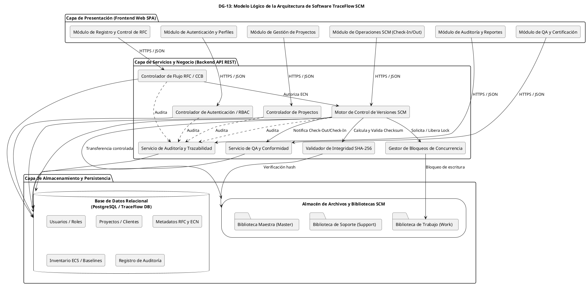
```plantuml
@startuml
skinparam shadowing false
skinparam roundcorner 8
skinparam defaultFontName Arial
skinparam componentStyle rectangle

title <b>DG-13: Modelo Lógico de la Arquitectura de Software TraceFlow SCM</b>

package "Capa de Presentación (Frontend Web SPA)" {
    component [Módulo de Autenticación y Perfiles] as UI_AUTH
    component [Módulo de Gestión de Proyectos] as UI_PROJ
    component [Módulo de Registro y Control de RFC] as UI_RFC
    component [Módulo de Operaciones SCM (Check-In/Out)] as UI_SCM
    component [Módulo de QA y Certificación] as UI_QA
    component [Módulo de Auditoría y Reportes] as UI_AUDIT
}

package "Capa de Servicios y Negocio (Backend API REST)" {
    component [Controlador de Autenticación / RBAC] as CTRL_AUTH
    component [Controlador de Proyectos] as CTRL_PROJ
    component [Controlador de Flujo RFC / CCB] as CTRL_RFC
    component [Motor de Control de Versiones SCM] as SCM_ENGINE
    component [Gestor de Bloqueos de Concurrencia] as LOCK_MGR
    component [Servicio de QA y Conformidad] as QA_SRV
    component [Validador de Integridad SHA-256] as HASH_VAL
    component [Servicio de Auditoría y Trazabilidad] as AUDIT_SRV
}

package "Capa de Almacenamiento y Persistencia" {
    database "Base de Datos Relacional\n(PostgreSQL / TraceFlow DB)" as DB {
        [Usuarios / Roles]
        [Proyectos / Clientes]
        [Metadatos RFC y ECN]
        [Inventario ECS / Baselines]
        [Registro de Auditoría]
    }
    
    storage "Almacén de Archivos y Bibliotecas SCM" as STORAGE {
        folder "Biblioteca de Trabajo (Work)" as LIB_WORK
        folder "Biblioteca de Soporte (Support)" as LIB_SUPPORT
        folder "Biblioteca Maestra (Master)" as LIB_MASTER
    }
}

UI_AUTH --> CTRL_AUTH : HTTPS / JSON
UI_PROJ --> CTRL_PROJ : HTTPS / JSON
UI_RFC --> CTRL_RFC : HTTPS / JSON
UI_SCM --> SCM_ENGINE : HTTPS / JSON
UI_QA --> QA_SRV : HTTPS / JSON
UI_AUDIT --> AUDIT_SRV : HTTPS / JSON

CTRL_RFC --> SCM_ENGINE : Autoriza ECN
SCM_ENGINE --> LOCK_MGR : Solicita / Libera Lock
SCM_ENGINE --> HASH_VAL : Calcula y Valida Checksum
SCM_ENGINE --> QA_SRV : Notifica Check-Out/Check-In

CTRL_AUTH ..> AUDIT_SRV : Audita
CTRL_PROJ ..> AUDIT_SRV : Audita
CTRL_RFC ..> AUDIT_SRV : Audita
SCM_ENGINE ..> AUDIT_SRV : Audita

CTRL_AUTH --> DB
CTRL_PROJ --> DB
CTRL_RFC --> DB
QA_SRV --> DB
AUDIT_SRV --> DB
SCM_ENGINE --> DB

SCM_ENGINE --> STORAGE : Transferencia controlada
LOCK_MGR --> LIB_WORK : Bloqueo de escritura
HASH_VAL --> STORAGE : Verificación hash

@enduml
```

<!-- Página 96 del PDF original -->

### 6.2.1. Diagrama de Secuencia

A continuación se presentan los diagramas de secuencia del modelo lógico de TraceFlow SCM, correspondientes a los escenarios de caso de uso detallados en la sección 6.1.3 y catalogados en `TB-11`:

**Diagrama DG-SEQ-01: Gestionar usuarios y roles (CU-01)**

#### Código PlantUML del Diagrama

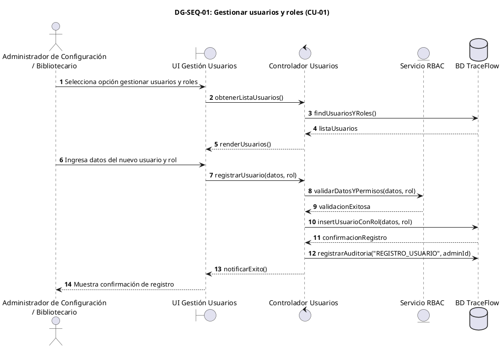
```plantuml
@startuml
skinparam shadowing false
skinparam roundcorner 8
skinparam defaultFontName Arial
autonumber

title <b>DG-SEQ-01: Gestionar usuarios y roles (CU-01)</b>

actor "Administrador de Configuración\n/ Bibliotecario" as ACT
boundary "UI Gestión Usuarios" as UI
control "Controlador Usuarios" as CTRL
entity "Servicio RBAC" as SRV
database "BD TraceFlow" as DB

ACT -> UI : Selecciona opción gestionar usuarios y roles
UI -> CTRL : obtenerListaUsuarios()
CTRL -> DB : findUsuariosYRoles()
DB --> CTRL : listaUsuarios
CTRL --> UI : renderUsuarios()

ACT -> UI : Ingresa datos del nuevo usuario y rol
UI -> CTRL : registrarUsuario(datos, rol)
CTRL -> SRV : validarDatosYPermisos(datos, rol)
SRV --> CTRL : validacionExitosa
CTRL -> DB : insertUsuarioConRol(datos, rol)
DB --> CTRL : confirmacionRegistro
CTRL -> DB : registrarAuditoria("REGISTRO_USUARIO", adminId)
CTRL --> UI : notificarExito()
UI --> ACT : Muestra confirmación de registro
@enduml
```

**Diagrama DG-SEQ-02: Crear y administrar proyectos (CU-02)**

#### Código PlantUML del Diagrama

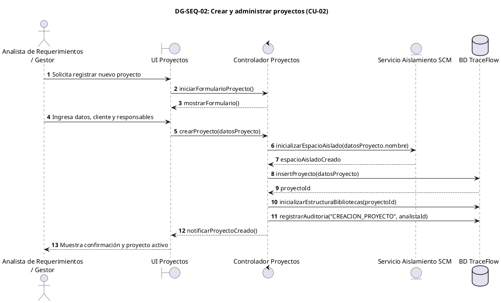
```plantuml
@startuml
skinparam shadowing false
skinparam roundcorner 8
skinparam defaultFontName Arial
autonumber

title <b>DG-SEQ-02: Crear y administrar proyectos (CU-02)</b>

actor "Analista de Requerimientos\n/ Gestor" as ACT
boundary "UI Proyectos" as UI
control "Controlador Proyectos" as CTRL
entity "Servicio Aislamiento SCM" as SRV
database "BD TraceFlow" as DB

ACT -> UI : Solicita registrar nuevo proyecto
UI -> CTRL : iniciarFormularioProyecto()
CTRL --> UI : mostrarFormulario()

ACT -> UI : Ingresa datos, cliente y responsables
UI -> CTRL : crearProyecto(datosProyecto)
CTRL -> SRV : inicializarEspacioAislado(datosProyecto.nombre)
SRV --> CTRL : espacioAisladoCreado
CTRL -> DB : insertProyecto(datosProyecto)
DB --> CTRL : proyectoId
CTRL -> DB : inicializarEstructuraBibliotecas(proyectoId)
CTRL -> DB : registrarAuditoria("CREACION_PROYECTO", analistaId)
CTRL --> UI : notificarProyectoCreado()
UI --> ACT : Muestra confirmación y proyecto activo
@enduml
```

**Diagrama DG-SEQ-03: Secuencia: Consultar proyecto (CU-03)**

#### Código PlantUML del Diagrama

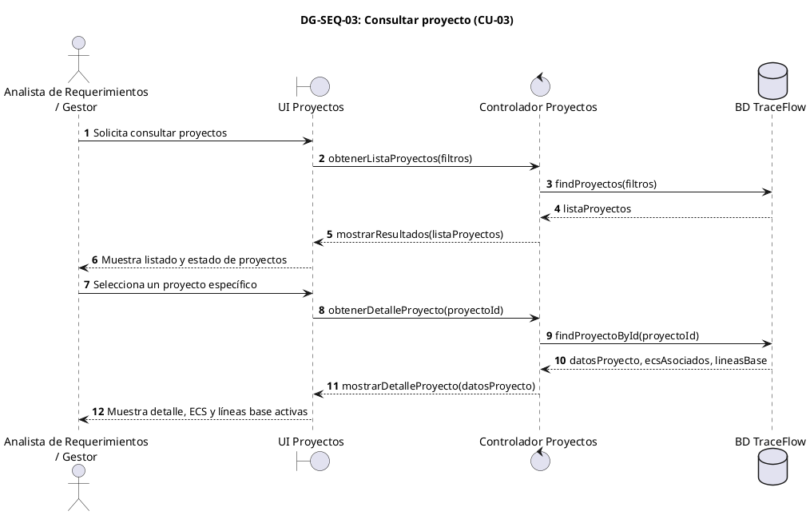
```plantuml
@startuml
skinparam shadowing false
skinparam roundcorner 8
skinparam defaultFontName Arial
autonumber

title <b>DG-SEQ-03: Consultar proyecto (CU-03)</b>

actor "Analista de Requerimientos\n/ Gestor" as ACT
boundary "UI Proyectos" as UI
control "Controlador Proyectos" as CTRL
database "BD TraceFlow" as DB

ACT -> UI : Solicita consultar proyectos
UI -> CTRL : obtenerListaProyectos(filtros)
CTRL -> DB : findProyectos(filtros)
DB --> CTRL : listaProyectos
CTRL --> UI : mostrarResultados(listaProyectos)
UI --> ACT : Muestra listado y estado de proyectos

ACT -> UI : Selecciona un proyecto específico
UI -> CTRL : obtenerDetalleProyecto(proyectoId)
CTRL -> DB : findProyectoById(proyectoId)
DB --> CTRL : datosProyecto, ecsAsociados, lineasBase
CTRL --> UI : mostrarDetalleProyecto(datosProyecto)
UI --> ACT : Muestra detalle, ECS y líneas base activas
@enduml
```

**Diagrama DG-SEQ-04: Registrar Solicitud de Cambio (RFC) (CU-04)**

#### Código PlantUML del Diagrama

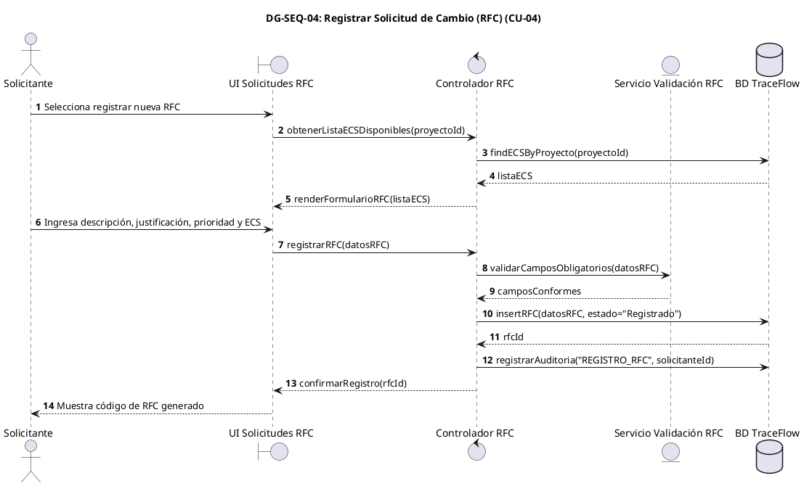
```plantuml
@startuml
skinparam shadowing false
skinparam roundcorner 8
skinparam defaultFontName Arial
autonumber

title <b>DG-SEQ-04: Registrar Solicitud de Cambio (RFC) (CU-04)</b>

actor "Solicitante" as ACT
boundary "UI Solicitudes RFC" as UI
control "Controlador RFC" as CTRL
entity "Servicio Validación RFC" as SRV
database "BD TraceFlow" as DB

ACT -> UI : Selecciona registrar nueva RFC
UI -> CTRL : obtenerListaECSDisponibles(proyectoId)
CTRL -> DB : findECSByProyecto(proyectoId)
DB --> CTRL : listaECS
CTRL --> UI : renderFormularioRFC(listaECS)

ACT -> UI : Ingresa descripción, justificación, prioridad y ECS
UI -> CTRL : registrarRFC(datosRFC)
CTRL -> SRV : validarCamposObligatorios(datosRFC)
SRV --> CTRL : camposConformes
CTRL -> DB : insertRFC(datosRFC, estado="Registrado")
DB --> CTRL : rfcId
CTRL -> DB : registrarAuditoria("REGISTRO_RFC", solicitanteId)
CTRL --> UI : confirmarRegistro(rfcId)
UI --> ACT : Muestra código de RFC generado
@enduml
```

**Diagrama DG-SEQ-05: Validar y clasificar la solicitud (CU-05)**

#### Código PlantUML del Diagrama

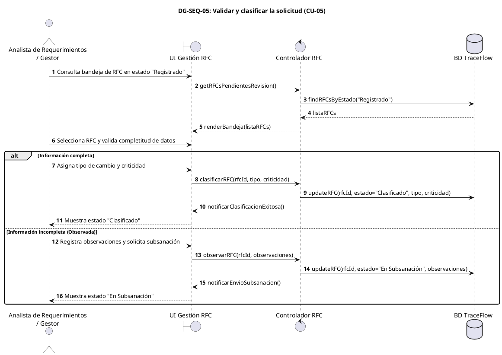
```plantuml
@startuml
skinparam shadowing false
skinparam roundcorner 8
skinparam defaultFontName Arial
autonumber

title <b>DG-SEQ-05: Validar y clasificar la solicitud (CU-05)</b>

actor "Analista de Requerimientos\n/ Gestor" as ACT
boundary "UI Gestión RFC" as UI
control "Controlador RFC" as CTRL
database "BD TraceFlow" as DB

ACT -> UI : Consulta bandeja de RFC en estado "Registrado"
UI -> CTRL : getRFCsPendientesRevision()
CTRL -> DB : findRFCsByEstado("Registrado")
DB --> CTRL : listaRFCs
CTRL --> UI : renderBandeja(listaRFCs)

ACT -> UI : Selecciona RFC y valida completitud de datos
alt Información completa
    ACT -> UI : Asigna tipo de cambio y criticidad
    UI -> CTRL : clasificarRFC(rfcId, tipo, criticidad)
    CTRL -> DB : updateRFC(rfcId, estado="Clasificado", tipo, criticidad)
    CTRL --> UI : notificarClasificacionExitosa()
    UI --> ACT : Muestra estado "Clasificado"
else Información incompleta (Observada)
    ACT -> UI : Registra observaciones y solicita subsanación
    UI -> CTRL : observarRFC(rfcId, observaciones)
    CTRL -> DB : updateRFC(rfcId, estado="En Subsanación", observaciones)
    CTRL --> UI : notificarEnvioSubsanacion()
    UI --> ACT : Muestra estado "En Subsanación"
end
@enduml
```

**Diagrama DG-SEQ-06: Realizar análisis de impacto técnico (CU-06)**

#### Código PlantUML del Diagrama

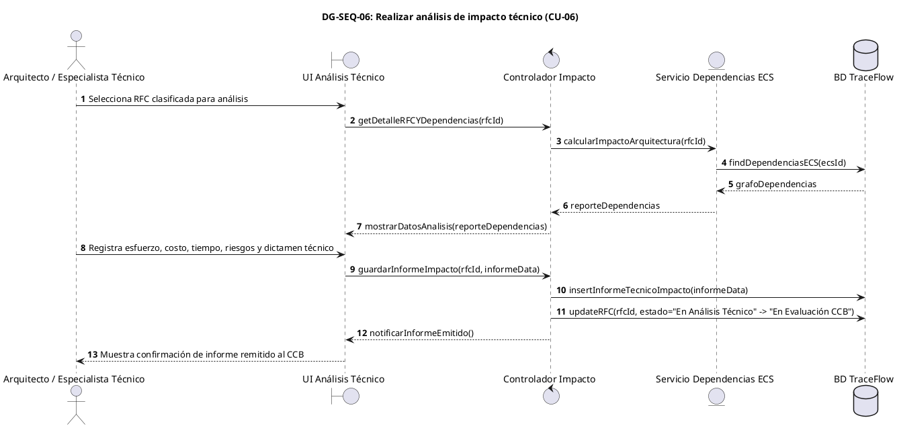
```plantuml
@startuml
skinparam shadowing false
skinparam roundcorner 8
skinparam defaultFontName Arial
autonumber

title <b>DG-SEQ-06: Realizar análisis de impacto técnico (CU-06)</b>

actor "Arquitecto / Especialista Técnico" as ACT
boundary "UI Análisis Técnico" as UI
control "Controlador Impacto" as CTRL
entity "Servicio Dependencias ECS" as SRV
database "BD TraceFlow" as DB

ACT -> UI : Selecciona RFC clasificada para análisis
UI -> CTRL : getDetalleRFCYDependencias(rfcId)
CTRL -> SRV : calcularImpactoArquitectura(rfcId)
SRV -> DB : findDependenciasECS(ecsId)
DB --> SRV : grafoDependencias
SRV --> CTRL : reporteDependencias
CTRL --> UI : mostrarDatosAnalisis(reporteDependencias)

ACT -> UI : Registra esfuerzo, costo, tiempo, riesgos y dictamen técnico
UI -> CTRL : guardarInformeImpacto(rfcId, informeData)
CTRL -> DB : insertInformeTecnicoImpacto(informeData)
CTRL -> DB : updateRFC(rfcId, estado="En Análisis Técnico" -> "En Evaluación CCB")
CTRL --> UI : notificarInformeEmitido()
UI --> ACT : Muestra confirmación de informe remitido al CCB
@enduml
```

**Diagrama DG-SEQ-07: Evaluar viabilidad y aprobación por el CCB (CU-07)**

#### Código PlantUML del Diagrama

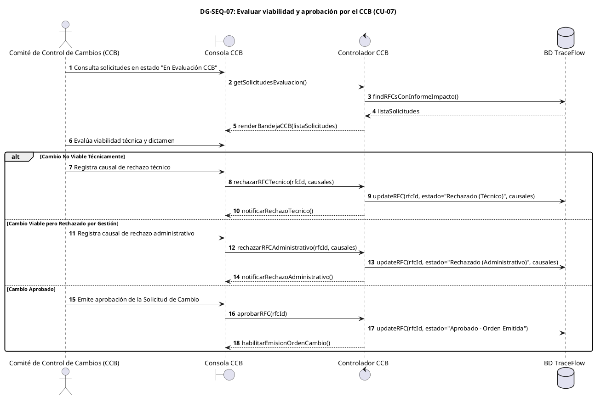
```plantuml
@startuml
skinparam shadowing false
skinparam roundcorner 8
skinparam defaultFontName Arial
autonumber

title <b>DG-SEQ-07: Evaluar viabilidad y aprobación por el CCB (CU-07)</b>

actor "Comité de Control de Cambios (CCB)" as ACT
boundary "Consola CCB" as UI
control "Controlador CCB" as CTRL
database "BD TraceFlow" as DB

ACT -> UI : Consulta solicitudes en estado "En Evaluación CCB"
UI -> CTRL : getSolicitudesEvaluacion()
CTRL -> DB : findRFCsConInformeImpacto()
DB --> CTRL : listaSolicitudes
CTRL --> UI : renderBandejaCCB(listaSolicitudes)

ACT -> UI : Evalúa viabilidad técnica y dictamen
alt Cambio No Viable Técnicamente
    ACT -> UI : Registra causal de rechazo técnico
    UI -> CTRL : rechazarRFCTecnico(rfcId, causales)
    CTRL -> DB : updateRFC(rfcId, estado="Rechazado (Técnico)", causales)
    CTRL --> UI : notificarRechazoTecnico()
else Cambio Viable pero Rechazado por Gestión
    ACT -> UI : Registra causal de rechazo administrativo
    UI -> CTRL : rechazarRFCAdministrativo(rfcId, causales)
    CTRL -> DB : updateRFC(rfcId, estado="Rechazado (Administrativo)", causales)
    CTRL --> UI : notificarRechazoAdministrativo()
else Cambio Aprobado
    ACT -> UI : Emite aprobación de la Solicitud de Cambio
    UI -> CTRL : aprobarRFC(rfcId)
    CTRL -> DB : updateRFC(rfcId, estado="Aprobado - Orden Emitida")
    CTRL --> UI : habilitarEmisionOrdenCambio()
end
@enduml
```

**Diagrama DG-SEQ-08: Emitir Orden de Cambio (ECN/ECO) (CU-08)**

#### Código PlantUML del Diagrama

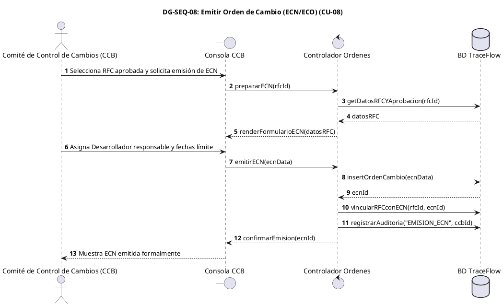
```plantuml
@startuml
skinparam shadowing false
skinparam roundcorner 8
skinparam defaultFontName Arial
autonumber

title <b>DG-SEQ-08: Emitir Orden de Cambio (ECN/ECO) (CU-08)</b>

actor "Comité de Control de Cambios (CCB)" as ACT
boundary "Consola CCB" as UI
control "Controlador Ordenes" as CTRL
database "BD TraceFlow" as DB

ACT -> UI : Selecciona RFC aprobada y solicita emisión de ECN
UI -> CTRL : prepararECN(rfcId)
CTRL -> DB : getDatosRFCYAprobacion(rfcId)
DB --> CTRL : datosRFC
CTRL --> UI : renderFormularioECN(datosRFC)

ACT -> UI : Asigna Desarrollador responsable y fechas límite
UI -> CTRL : emitirECN(ecnData)
CTRL -> DB : insertOrdenCambio(ecnData)
DB --> CTRL : ecnId
CTRL -> DB : vincularRFCconECN(rfcId, ecnId)
CTRL -> DB : registrarAuditoria("EMISION_ECN", ccbId)
CTRL --> UI : confirmarEmision(ecnId)
UI --> ACT : Muestra ECN emitida formalmente
@enduml
```

**Diagrama DG-SEQ-09: Registrar ECS (CU-09)**

#### Código PlantUML del Diagrama

```plantuml
@startuml
skinparam shadowing false
skinparam roundcorner 8
skinparam defaultFontName Arial
autonumber

title <b>DG-SEQ-09: Registrar ECS (CU-09)</b>

actor "Arquitecto / Especialista Técnico" as ACT
boundary "UI Gestión ECS" as UI
control "Controlador ECS" as CTRL
database "BD TraceFlow" as DB

ACT -> UI : Selecciona registrar nuevo Elemento de Configuración
UI -> CTRL : getProyectosYTiposECS()
CTRL -> DB : findTiposECS()
DB --> CTRL : tiposECS
CTRL --> UI : renderFormularioECS(tiposECS)

ACT -> UI : Ingresa nombre, tipo (código/doc/bd), proyecto y ruta
UI -> CTRL : registrarECS(datosECS)
CTRL -> DB : insertECS(datosECS, estado="Identificado")
DB --> CTRL : ecsId
CTRL -> DB : inicializarHistorialVersiones(ecsId, version="1.0.0")
CTRL --> UI : notificarRegistroExitoso(ecsId)
UI --> ACT : Muestra confirmación de ECS catalogado
@enduml
```

**Diagrama DG-SEQ-10: Efectuar Check-Out y bloqueo (CU-10)**

#### Código PlantUML del Diagrama

```plantuml
@startuml
skinparam shadowing false
skinparam roundcorner 8
skinparam defaultFontName Arial
autonumber

title <b>DG-SEQ-10: Efectuar Check-Out y aplicar bloqueo (CU-10)</b>

actor "Administrador de Configuración\n/ Bibliotecario" as ACT
boundary "UI Gestión Bibliotecas" as UI
control "Controlador Bibliotecas" as CTRL
entity "Servicio Bloqueos SCM" as SRV
database "BD TraceFlow" as DB

ACT -> UI : Selecciona ECN autorizada y solicita Check-Out del ECS
UI -> CTRL : ejecutarCheckOut(ecnId, ecsId)
CTRL -> SRV : verificarDisponibilidadBloqueo(ecsId)
alt ECS ya se encuentra bloqueado
    SRV --> CTRL : error("ECS bloqueado por otro usuario")
    CTRL --> UI : mostrarErrorBloqueoActivo()
    UI --> ACT : Informa que el ECS está en edición concurrente
else ECS disponible
    SRV -> DB : insertBloqueoSincronizacion(ecsId, ecnId, devId)
    CTRL -> DB : transferirECS(ecsId, "Biblioteca Soporte", "Biblioteca Trabajo")
    CTRL -> DB : updateEstadoRFC(rfcId, "En Implementación")
    CTRL -> DB : registrarAuditoria("CHECK_OUT", ecsId, adminId)
    CTRL --> UI : confirmarCheckOutExitoso()
    UI --> ACT : Muestra ECS transferido con bloqueo activo
end
@enduml
```

**Diagrama DG-SEQ-11: Aplicar bloqueo de sincronización (CU-11)**

#### Código PlantUML del Diagrama

```plantuml
@startuml
skinparam shadowing false
skinparam roundcorner 8
skinparam defaultFontName Arial
autonumber

title <b>DG-SEQ-11: Aplicar bloqueo de sincronización (CU-11)</b>

actor "Administrador de Configuración\n/ Bibliotecario" as ACT
boundary "UI Bloqueos SCM" as UI
control "Controlador Bloqueos" as CTRL
database "BD TraceFlow" as DB

ACT -> UI : Consulta estado de bloqueos del ECS
UI -> CTRL : getEstadoBloqueo(ecsId)
CTRL -> DB : findBloqueoByECS(ecsId)
DB --> CTRL : estadoBloqueo
CTRL --> UI : mostrarDetalleBloqueo(estadoBloqueo)

ACT -> UI : Confirma imposición / verificación de bloqueo
UI -> CTRL : aplicarBloqueo(ecsId, motivo)
CTRL -> DB : updateBloqueo(ecsId, estado="ACTIVO", motivo)
CTRL -> DB : registrarAuditoria("BLOQUEO_APLICADO", ecsId)
CTRL --> UI : notificarBloqueoActivo()
UI --> ACT : Muestra bloqueo activo en Biblioteca de Trabajo
@enduml
```

**Diagrama DG-SEQ-12: Efectuar Check-In a Biblioteca Maestra (CU-12)**

#### Código PlantUML del Diagrama

```plantuml
@startuml
skinparam shadowing false
skinparam roundcorner 8
skinparam defaultFontName Arial
autonumber

title <b>DG-SEQ-12: Efectuar Check-In a Biblioteca Maestra (CU-12)</b>

actor "Administrador de Configuración\n/ Bibliotecario" as ACT
boundary "UI Gestión Bibliotecas" as UI
control "Controlador Bibliotecas" as CTRL
entity "Servicio Certificación QA" as SRV_QA
database "BD TraceFlow" as DB

ACT -> UI : Selecciona ECS certificado para Check-In
UI -> CTRL : solicitarCheckIn(ecsId, ecnId, mensajeVersion)
CTRL -> SRV_QA : verificarCertificacionConformidad(ecnId)
SRV_QA -> DB : findCertificacionByECN(ecnId)
DB --> SRV_QA : certificacionValida
SRV_QA --> CTRL : autorizacionConforme

CTRL -> DB : transferirECS(ecsId, "Biblioteca Trabajo", "Biblioteca Maestra")
CTRL -> DB : releaseBloqueoSincronizacion(ecsId)
CTRL -> DB : insertVersionHistorial(ecsId, mensajeVersion)
CTRL -> DB : registrarAuditoria("CHECK_IN_MAESTRA", ecsId, adminId)
CTRL --> UI : notificarCheckInCompletado()
UI --> ACT : Muestra ECS integrado y bloqueo liberado
@enduml
```

**Diagrama DG-SEQ-13: Consultar historial de versiones (CU-13)**

#### Código PlantUML del Diagrama

```plantuml
@startuml
skinparam shadowing false
skinparam roundcorner 8
skinparam defaultFontName Arial
autonumber

title <b>DG-SEQ-13: Consultar historial de versiones (CU-13)</b>

actor "Administrador de Configuración\n/ Bibliotecario" as ACT
boundary "UI Trazabilidad Versiones" as UI
control "Controlador Historial" as CTRL
database "BD TraceFlow" as DB

ACT -> UI : Selecciona ECS y solicita ver historial
UI -> CTRL : getHistorialVersiones(ecsId)
CTRL -> DB : findVersionesByECS(ecsId)
DB --> CTRL : listaVersionesConHashYAutor
CTRL --> UI : renderHistorial(listaVersiones)

ACT -> UI : Selecciona versión específica para comparar
UI -> CTRL : compararVersiones(versionA, versionB)
CTRL -> DB : getDiffEntreVersiones(versionA, versionB)
DB --> CTRL : diffData
CTRL --> UI : renderComparador(diffData)
UI --> ACT : Muestra diferencias y trazabilidad de cambios
@enduml
```

**Diagrama DG-SEQ-14: Implementar cambio en el ECS (CU-14)**

#### Código PlantUML del Diagrama

```plantuml
@startuml
skinparam shadowing false
skinparam roundcorner 8
skinparam defaultFontName Arial
autonumber

title <b>DG-SEQ-14: Implementar cambio en el ECS (CU-14)</b>

actor "Ingeniero de Software\n/ Desarrollador" as ACT
boundary "UI Espacio de Trabajo" as UI
control "Controlador Trabajo" as CTRL
database "Biblioteca de Trabajo" as LIB_WRK

ACT -> UI : Accede al ECS autorizado bajo Check-Out
UI -> CTRL : obtenerCopiaTrabajo(ecsId, ecnId)
CTRL -> LIB_WRK : getArchivoECS(ecsId)
LIB_WRK --> CTRL : archivoFuente
CTRL --> UI : cargarEntornoEdicion(archivoFuente)

ACT -> UI : Realiza modificaciones requeridas por la ECN
ACT -> UI : Guarda avances intermedios
UI -> CTRL : guardarCambiosEnTrabajo(ecsId, contenidoModificado)
CTRL -> LIB_WRK : updateArchivoTrabajo(ecsId, contenidoModificado)
LIB_WRK --> CTRL : guardadoExitoso
CTRL --> UI : notificarGuardado()
UI --> ACT : Confirma actualización local en Biblioteca de Trabajo
@enduml
```

**Diagrama DG-SEQ-15: Ejecutar pruebas unitarias locales (CU-15)**

#### Código PlantUML del Diagrama

```plantuml
@startuml
skinparam shadowing false
skinparam roundcorner 8
skinparam defaultFontName Arial
autonumber

title <b>DG-SEQ-15: Ejecutar pruebas unitarias locales (CU-15)</b>

actor "Ingeniero de Software\n/ Desarrollador" as ACT
boundary "UI Pruebas Locales" as UI
control "Runner Pruebas Unitarias" as RUNNER
database "Biblioteca de Trabajo" as LIB_WRK

ACT -> UI : Solicita ejecución de suite unitaria local
UI -> RUNNER : ejecutarPruebasUnitarias(ecsId)
RUNNER -> LIB_WRK : cargarModuloModificado(ecsId)
RUNNER -> RUNNER : ejecutarTests()
RUNNER --> UI : reporteResultados(testsPasados, fallos)

alt Pruebas aprobadas (100% éxito)
    UI --> ACT : Muestra resultado conforme; habilita entrega a QA
else Pruebas con fallos
    UI --> ACT : Muestra fallos y líneas con errores para corrección
end
@enduml
```

**Diagrama DG-SEQ-16: Ejecutar pruebas de integración (CU-16)**

#### Código PlantUML del Diagrama

```plantuml
@startuml
skinparam shadowing false
skinparam roundcorner 8
skinparam defaultFontName Arial
autonumber

title <b>DG-SEQ-16: Ejecutar pruebas de integración (CU-16)</b>

actor "Equipo de Calidad / Testing" as ACT
boundary "UI Calidad y Pruebas" as UI
control "Controlador QA" as CTRL
database "Biblioteca de Soporte" as LIB_SUP

ACT -> UI : Selecciona cambio entregado para validación
UI -> CTRL : iniciarValidacionIntegracion(ecnId)
CTRL -> LIB_SUP : desplegarEntornoPruebas(ecnId)
CTRL -> CTRL : ejecutarBateriaIntegracionYFuncional()
CTRL --> UI : reporteQA(casosPrueba, conformidades, noConformidades)
UI --> ACT : Visualiza matriz de resultados de pruebas
@enduml
```

**Diagrama DG-SEQ-17: Certificar conformidad del cambio (CU-17)**

#### Código PlantUML del Diagrama

```plantuml
@startuml
skinparam shadowing false
skinparam roundcorner 8
skinparam defaultFontName Arial
autonumber

title <b>DG-SEQ-17: Certificar conformidad del cambio (CU-17)</b>

actor "Equipo de Calidad / Testing" as ACT
boundary "UI Calidad y Pruebas" as UI
control "Controlador QA" as CTRL
database "BD TraceFlow" as DB

ACT -> UI : Confirma aprobación de todas las pruebas QA
UI -> CTRL : certificarCambio(ecnId, actaPruebas)
CTRL -> DB : insertCertificacionConformidad(ecnId, actaPruebas, qaId)
CTRL -> DB : updateEstadoRFC(rfcId, "En Validación QA" -> "Certificado")
CTRL -> DB : registrarAuditoria("CERTIFICACION_CONFORMIDAD", ecnId)
CTRL --> UI : notificarCertificacionExitosa()
UI --> ACT : Muestra Certificado de Conformidad emitido
@enduml
```

<!-- PENDIENTE DE VALIDACION: El mensaje updateEstadoRFC(..., 'Certificado') utiliza un estado que no pertenece a la máquina de estados de la RFC de la sección 5.3. -->

**Diagrama DG-SEQ-18: Reportar no conformidad (CU-18)**

#### Código PlantUML del Diagrama

```plantuml
@startuml
skinparam shadowing false
skinparam roundcorner 8
skinparam defaultFontName Arial
autonumber

title <b>DG-SEQ-18: Reportar no conformidad (CU-18)</b>

actor "Equipo de Calidad / Testing" as ACT
boundary "UI Hallazgos QA" as UI
control "Controlador Hallazgos" as CTRL
database "BD TraceFlow" as DB

ACT -> UI : Registra defectos encontrados en validación
UI -> CTRL : reportarNoConformidad(ecnId, hallazgos, severidad)
CTRL -> DB : insertNoConformidad(ecnId, hallazgos, severidad)
CTRL -> DB : updateEstadoRFC(rfcId, "En Corrección")
CTRL -> DB : notificarDesarrollador(ecnId, hallazgos)
CTRL --> UI : confirmarRegistroNoConformidad()
UI --> ACT : Muestra no conformidad registrada y asignada
@enduml
```

**Diagrama DG-SEQ-19: Reevaluar y re-testear (CU-19)**

#### Código PlantUML del Diagrama

```plantuml
@startuml
skinparam shadowing false
skinparam roundcorner 8
skinparam defaultFontName Arial
autonumber

title <b>DG-SEQ-19: Reevaluar y re-testear (CU-19)</b>

actor "Equipo de Calidad / Testing" as ACT
boundary "UI Re-testeo QA" as UI
control "Controlador ReTest" as CTRL
database "BD TraceFlow" as DB

ACT -> UI : Selecciona corrección entregada por Desarrollador
UI -> CTRL : iniciarReTest(noConformidadId)
CTRL -> CTRL : ejecutarPruebasAfectadas()

alt Defecto corregido satisfactoriamente
    CTRL -> DB : updateNoConformidad(id, estado="SUBSANADA")
    CTRL --> UI : habilitarCertificacion()
    UI --> ACT : Muestra prueba superada
else Defecto persiste y se agotaron reintentos
    CTRL -> DB : updateNoConformidad(id, estado="FALLO_PERSISTENTE")
    CTRL -> DB : dispararAlertaRollback(ecnId)
    CTRL --> UI : notificarDerivacionRollback()
    UI --> ACT : Muestra alerta de fallo no subsanado
end
@enduml
```

**Diagrama DG-SEQ-20: Crear y congelar línea base (CU-20)**

#### Código PlantUML del Diagrama

```plantuml
@startuml
skinparam shadowing false
skinparam roundcorner 8
skinparam defaultFontName Arial
autonumber

title <b>DG-SEQ-20: Crear y congelar línea base (CU-20)</b>

actor "Administrador de Configuración\n/ Bibliotecario" as ACT
boundary "UI Líneas Base" as UI
control "Controlador Líneas Base" as CTRL
database "BD TraceFlow" as DB

ACT -> UI : Selecciona ECS certificado en Biblioteca Maestra
UI -> CTRL : solicitarCreacionLineaBase(proyectoId, ecsId)
CTRL --> UI : mostrarFormularioLineaBase()

ACT -> UI : Ingresa versión (mayor.menor.parche) y descripción
UI -> CTRL : congelarLineaBase(proyectoId, version, ecsLista)
CTRL -> DB : validarFormatoVersion(version)
CTRL -> DB : insertLineaBase(proyectoId, version, estado="CONGELADA")
DB --> CTRL : lineaBaseId
CTRL -> DB : vincularECSaLineaBase(lineaBaseId, ecsLista)
CTRL -> DB : registrarAuditoria("LINEA_BASE_CONGELADA", lineaBaseId, adminId)
CTRL --> UI : confirmarLineaBaseCongelada()
UI --> ACT : Muestra nueva Línea Base registrada y protegida
@enduml
```

**Diagrama DG-SEQ-21: Ejecutar rollback en Biblioteca de Trabajo (CU-21)**

#### Código PlantUML del Diagrama

```plantuml
@startuml
skinparam shadowing false
skinparam roundcorner 8
skinparam defaultFontName Arial
autonumber

title <b>DG-SEQ-21: Ejecutar rollback en Biblioteca de Trabajo (CU-21)</b>

actor "Administrador de Configuración\n/ Bibliotecario" as ACT
boundary "UI Gestión Rollback" as UI
control "Controlador Rollback" as CTRL
database "Biblioteca de Trabajo" as LIB_WRK
database "Biblioteca de Soporte" as LIB_SUP
database "BD TraceFlow" as DB

ACT -> UI : Confirma ejecución de Rollback por fallo persistente
UI -> CTRL : ejecutarRollbackTrabajo(ecsId, ecnId)
CTRL -> LIB_SUP : getCopiaOriginalPrevia(ecsId)
LIB_SUP --> CTRL : archivoOriginal
CTRL -> LIB_WRK : sobreescribirConOriginal(ecsId, archivoOriginal)
LIB_WRK --> CTRL : restauradoExitoso

CTRL -> DB : releaseBloqueoSincronizacion(ecsId)
CTRL -> DB : registrarAuditoria("ROLLBACK_TRABAJO", ecsId, ecnId)
CTRL --> UI : notificarRollbackCompletado()
UI --> ACT : Muestra estado previo restaurado y bloqueo liberado
@enduml
```

**Diagrama DG-SEQ-22: Cancelar Orden de Cambio (CU-22)**

#### Código PlantUML del Diagrama

```plantuml
@startuml
skinparam shadowing false
skinparam roundcorner 8
skinparam defaultFontName Arial
autonumber

title <b>DG-SEQ-22: Cancelar Orden de Cambio (CU-22)</b>

actor "Administrador de Configuración\n/ Bibliotecario" as ACT
boundary "UI Cancelación SCM" as UI
control "Controlador Cierre" as CTRL
database "BD TraceFlow" as DB

ACT -> UI : Selecciona ECN tras ejecución de Rollback
UI -> CTRL : cancelarOrdenCambio(ecnId, causa="Fallo No Subsanado")
CTRL -> DB : updateECN(ecnId, estado="CANCELADA")
CTRL -> DB : updateRFC(rfcId, estado="Cancelado (Fallo No Subsanado)")
CTRL -> DB : notificarSolicitante(rfcId, "Cancelado por Fallo No Subsanado")
CTRL -> DB : registrarAuditoria("CANCELACION_ECN", ecnId)
CTRL --> UI : confirmarCancelacionFormal()
UI --> ACT : Muestra ECN cancelada y trámite cerrado
@enduml
```

**Diagrama DG-SEQ-23: Registrar incidencia (CU-23)**

#### Código PlantUML del Diagrama

```plantuml
@startuml
skinparam shadowing false
skinparam roundcorner 8
skinparam defaultFontName Arial
autonumber

title <b>DG-SEQ-23: Registrar incidencia (CU-23)</b>

actor "Solicitante" as ACT
boundary "UI Mesa de Ayuda" as UI
control "Controlador Tickets" as CTRL
database "BD TraceFlow" as DB

ACT -> UI : Ingresa al portal de soporte y selecciona nueva incidencia
UI -> CTRL : getProyectosDisponibles()
CTRL -> DB : findProyectosCliente(solicitanteId)
DB --> CTRL : listaProyectos
CTRL --> UI : mostrarFormularioTicket(listaProyectos)

ACT -> UI : Ingresa título, descripción de falla y severidad
UI -> CTRL : crearTicket(ticketData)
CTRL -> DB : insertTicketIncidencia(ticketData, estado="Abierto")
DB --> CTRL : ticketId
CTRL --> UI : notificarTicketCreado(ticketId)
UI --> ACT : Muestra confirmación con número de ticket
@enduml
```

**Diagrama DG-SEQ-24: Consultar estado de ticket (CU-24)**

#### Código PlantUML del Diagrama

```plantuml
@startuml
skinparam shadowing false
skinparam roundcorner 8
skinparam defaultFontName Arial
autonumber

title <b>DG-SEQ-24: Consultar estado de ticket (CU-24)</b>

actor "Solicitante" as ACT
boundary "UI Mesa de Ayuda" as UI
control "Controlador Tickets" as CTRL
database "BD TraceFlow" as DB

ACT -> UI : Ingresa número de ticket o consulta historial
UI -> CTRL : getEstadoTicket(ticketId)
CTRL -> DB : findTicketById(ticketId)
DB --> CTRL : ticketDetalleYHistorial
CTRL --> UI : renderEstadoTicket(ticketDetalleYHistorial)
UI --> ACT : Muestra estado actual, respuestas y RFC asociada
@enduml
```

**Diagrama DG-SEQ-25: Derivar incidencia a RFC (CU-25)**

#### Código PlantUML del Diagrama

```plantuml
@startuml
skinparam shadowing false
skinparam roundcorner 8
skinparam defaultFontName Arial
autonumber

title <b>DG-SEQ-25: Derivar incidencia a RFC (CU-25)</b>

actor "Analista de Requerimientos\n/ Gestor" as ACT
boundary "UI Soporte / Analista" as UI
control "Controlador Incidencias" as CTRL
database "BD TraceFlow" as DB

ACT -> UI : Evalúa ticket de incidencia abierto
UI -> CTRL : analizarTicket(ticketId)
CTRL --> UI : mostrarDatosTicket()

ACT -> UI : Selecciona opción "Derivar a Solicitud de Cambio"
UI -> CTRL : derivarTicketARFC(ticketId, datosRFC)
CTRL -> DB : insertRFC(datosRFC, origen="TICKET", ticketId)
DB --> CTRL : rfcId
CTRL -> DB : updateTicket(ticketId, estado="Derivado", rfcId)
CTRL -> DB : registrarAuditoria("DERIVACION_INCIDENCIA_A_RFC", ticketId, rfcId)
CTRL --> UI : notificarDerivacionExitosa(rfcId)
UI --> ACT : Muestra RFC generada vinculada al ticket
@enduml
```

**Diagrama DG-SEQ-26: Validar integridad SHA-256 (CU-26)**

#### Código PlantUML del Diagrama

```plantuml
@startuml
skinparam shadowing false
skinparam roundcorner 8
skinparam defaultFontName Arial
autonumber

title <b>DG-SEQ-26: Validar integridad mediante checksum SHA-256 (CU-26)</b>

actor "Administrador de Configuración\n/ Bibliotecario" as ACT
boundary "UI Auditoría SCM" as UI
control "Controlador Integridad" as CTRL
entity "Motor Criptográfico" as HASH
database "Repositorio ECS" as REPO
database "BD TraceFlow" as DB

ACT -> UI : Solicita verificación de integridad de un ECS
UI -> CTRL : validarChecksum(ecsId, version)
CTRL -> REPO : leerArchivo(ecsId, version)
REPO --> CTRL : streamBytes
CTRL -> HASH : calcularSHA256(streamBytes)
HASH --> CTRL : hashCalculado

CTRL -> DB : getChecksumRegistrado(ecsId, version)
DB --> CTRL : hashAlmacenado

alt Hash idéntico
    CTRL --> UI : reporteIntegridad("INTEGRO", hashCalculado)
    UI --> ACT : Muestra verificación exitosa
else Hash divergente
    CTRL -> DB : registrarAlertaSeguridad("INTEGRIDAD_COMPROMETIDA", ecsId)
    CTRL --> UI : reporteIntegridad("ALTERADO", hashCalculado, hashAlmacenado)
    UI --> ACT : Alerta de corrupción o alteración no autorizada
end
@enduml
```

**Diagrama DG-SEQ-27: Auditar acciones del sistema (CU-27)**

#### Código PlantUML del Diagrama

```plantuml
@startuml
skinparam shadowing false
skinparam roundcorner 8
skinparam defaultFontName Arial
autonumber

title <b>DG-SEQ-27: Auditar acciones del sistema (CU-27)</b>

actor "Comité de Control de Cambios (CCB)" as ACT
boundary "UI Auditoría" as UI
control "Controlador Auditoría" as CTRL
database "BD TraceFlow (Logs)" as DB

ACT -> UI : Define filtros de auditoría (fechas, usuario, ECS, acción)
UI -> CTRL : consultarLogsAuditoria(filtros)
CTRL -> DB : findLogsAudit(filtros)
DB --> CTRL : registrosAuditoria
CTRL --> UI : renderResultadosAuditoria(registrosAuditoria)

ACT -> UI : Solicita exportación de pista de auditoría
UI -> CTRL : exportarPistaAuditoria(filtros)
CTRL --> UI : archivoDescarga (PDF/CSV)
UI --> ACT : Entrega reporte formal de auditoría
@enduml
```

**Diagrama DG-SEQ-28: Generar reportes de estado (CU-28)**

#### Código PlantUML del Diagrama

```plantuml
@startuml
skinparam shadowing false
skinparam roundcorner 8
skinparam defaultFontName Arial
autonumber

title <b>DG-SEQ-28: Generar reportes de estado (CU-28)</b>

actor "Administrador de Configuración\n/ Bibliotecario" as ACT
boundary "UI Reportes" as UI
control "Controlador Reportes" as CTRL
database "BD TraceFlow" as DB

ACT -> UI : Selecciona tipo de reporte (inventario ECS, estado RFC, actas)
UI -> CTRL : generarReporte(tipoReporte, proyectoId)
CTRL -> DB : consolidarDatosReporte(tipoReporte, proyectoId)
DB --> CTRL : datosConsolidados
CTRL -> CTRL : compilarDocumentoReporte(datosConsolidados)
CTRL --> UI : mostrarVistaPreviaReporte()
UI --> ACT : Presenta vista previa y botón de descarga
@enduml
```

### 6.2.2. Diagrama de Clases

Nota: Elaboración Propia

**Diagrama DG-12: Diagrama de Clases del Dominio TraceFlow SCM**

#### Código PlantUML del Diagrama

```plantuml
@startuml
skinparam shadowing false
skinparam roundcorner 8
skinparam defaultFontName Arial
skinparam classAttributeIconSize 0

title <b>DG-12: Diagrama de Clases del Dominio TraceFlow SCM</b>

class Usuario {
    - id: Long
    - nombre: String
    - email: String
    - passwordHash: String
    - rol: RolUsuario
    - estado: EstadoUsuario
    + registrar()
    + autenticar()
    + asignarRol(rol: RolUsuario)
}

enum RolUsuario {
    SOLICITANTE
    ANALISTA_REQUERIMIENTOS
    ARQUITECTO
    CCB
    ADMIN_CONFIGURACION
    INGENIERO_SOFTWARE
    EQUIPO_CALIDAD
}

class Proyecto {
    - id: Long
    - codigo: String
    - nombre: String
    - descripcion: String
    - cliente: String
    - estado: EstadoProyecto
    - fechaCreacion: DateTime
    + crearProyecto()
    + consultarProyecto()
}

class ElementoConfiguracion {
    - id: Long
    - codigo: String
    - nombre: String
    - tipo: TipoECS
    - rutaArchivo: String
    - versionActual: String
    - checksumSHA256: String
    - estadoBloqueo: EstadoBloqueo
    - bibliotecaActual: TipoBiblioteca
    + registrarECS()
    + verificarIntegridad(): Boolean
    + bloquear(ordenId: Long)
    + liberarBloqueo()
}

enum TipoBiblioteca {
    TRABAJO
    SOPORTE
    MAESTRA
}

class SolicitudCambio {
    - id: Long
    - codigo: String
    - descripcion: String
    - justificacion: String
    - prioridad: Prioridad
    - estado: EstadoRFC
    - fechaRegistro: DateTime
    + registrarRFC()
    + validar()
    + subsanar()
    + evaluarCCB()
}

class InformeImpacto {
    - id: Long
    - impactoArquitectura: String
    - esfuerzoHoras: Integer
    - costoEstimado: Decimal
    - tiempoEstimadoDias: Integer
    - nivelRiesgo: NivelRiesgo
    - fechaElaboracion: DateTime
    + registrarInforme()
}

class OrdenCambio {
    - id: Long
    - codigo: String
    - fechaEmision: DateTime
    - estado: EstadoOrden
    + emitirOrden()
    + cancelarOrden(motivo: String)
    + cerrarOrden()
}

class CertificadoConformidad {
    - id: Long
    - resultado: ResultadoPrueba
    - observaciones: String
    - fechaCertificacion: DateTime
    + emitirCertificado()
}

class NoConformidad {
    - id: Long
    - hallazgos: String
    - severidad: Severidad
    - fechaRegistro: DateTime
    + registrarNoConformidad()
}

class LineaBase {
    - id: Long
    - codigo: String
    - nombre: String
    - version: String
    - estado: EstadoLineaBase
    - fechaCongelacion: DateTime
    + crearLineaBase()
    + congelar()
}

class TicketIncidencia {
    - id: Long
    - codigo: String
    - titulo: String
    - descripcion: String
    - estado: EstadoTicket
    - fechaRegistro: DateTime
    + registrarTicket()
    + derivarARFC(): SolicitudCambio
}

class RegistroAuditoria {
    - id: Long
    - accion: String
    - modulo: String
    - ipOrigen: String
    - timestamp: DateTime
    - hashRegistro: String
    + registrarEvento()
}

Usuario "1" --> "*" Proyecto : administra / participa
Proyecto "1" *-- "*" ElementoConfiguracion : contiene
Usuario "1" --> "*" SolicitudCambio : solicita
SolicitudCambio "1" --> "1" ElementoConfiguracion : afecta
SolicitudCambio "1" --> "0..1" InformeImpacto : tiene
SolicitudCambio "1" --> "0..1" OrdenCambio : genera
OrdenCambio "1" --> "0..1" CertificadoConformidad : valida
OrdenCambio "1" --> "*" NoConformidad : registra
Proyecto "1" *-- "*" LineaBase : define
LineaBase "1" o-- "1..*" ElementoConfiguracion : congela
TicketIncidencia "0..1" --> "0..1" SolicitudCambio : deriva en
RegistroAuditoria "*" --> "1" Usuario : generado por

@enduml
```

<!-- Página 116 del PDF original -->

## 6.3. Matrices de Trazabilidad SCM

En cumplimiento del estándar de gobernanza documental definido en docs/DOCUMENTATION_RULES.md, a continuación se presentan las matrices de trazabilidad oficiales del proyecto TraceFlow SCM extraídas de la fuente oficial docs/TABLES.md, garantizando la relación bidireccional entre requerimientos, reglas de negocio, casos de uso y actores responsables:

# TB-12 — Matriz de Trazabilidad: Requerimientos Funcionales vs Casos de Uso

**Estado:** APROBADO  
**Fuente:** Derivada de las narrativas explícitas en `FD03-EPIS-Informe_SRS.md`, Sección 6.1.3  

| ID RF | Nombre del Requerimiento Funcional | Casos de Uso que lo Instrumentan (Código Oficial / Original) | Sustento Documental (Campo Requerimiento Asociado en CU) |
| :--- | :--- | :--- | :--- |
| RF-01 | Gestión de Usuarios y Roles | CU-01 (CUS01) | Explícito en CUS01 |
| RF-02 | Gestión de Proyectos | CU-02 (CUS02), CU-03 (CUS03) | Explícito en CUS02 y CUS03 |
| RF-03 | Identificación de ECS | CU-09 (CUS09) | Explícito en CUS09 |
| RF-04 | Registro de Solicitudes de Cambio (RFC) | CU-04 (CUS04), CU-05 (CUS05) | Explícito en CUS04 y CUS05 |
| RF-05 | Clasificación y Análisis de Impacto | CU-05 (CUS05), CU-06 (CUS06) | Explícito en CUS05 y CUS06 |
| RF-06 | Evaluación y Aprobación por el CCB | CU-07 (CUS07) | Explícito en CUS07 |
| RF-07 | Gestión de Órdenes de Cambio | CU-08 (CUS08), CU-14 (CUS14) | Explícito en CUS08 y CUS14 |
| RF-08 | Gestión de Bibliotecas de Software | CU-10 (CUS10), CU-12 (CUS12) | Explícito en CUS10 y CUS12 |
| RF-09 | Control de Versiones y Bloqueos de Sincronización | CU-10 (CUS10), CU-11 (CUS11), CU-12 (CUS12), CU-13 (CUS13), CU-14 (CUS14) | Explícito en CUS10, CUS11, CUS12, CUS13 y CUS14 |
| RF-10 | Gestión de Pruebas y Certificación de Conformidad | CU-15 (CUS15), CU-16 (CUS16), CU-17 (CUS17), CU-18 (CUS18) | Explícito en CUS15, CUS16, CUS17 y CUS18 |
| RF-11 | Reevaluación y Re-testeo | CU-19 (CUS19) | Explícito en CUS19 |
| RF-12 | Rollback y Cancelación de Órdenes de Cambio | CU-21 (CUS21), CU-22 (CUS22) | Explícito en CUS21 y CUS22 |
| RF-13 | Gestión de Líneas Base | CU-20 (CUS20) | Explícito en CUS20 |
| RF-14 | Cierre Formal del Cambio y Notificaciones | CU-22 (CUS22) | Explícito en CUS22 *(ver PENDIENTE DE VALIDACIÓN para cierre exitoso)* |
| RF-15 | Gestión de Incidencias y Soporte | CU-23 (CUS23), CU-24 (CUS24), CU-25 (CUS25) | Explícito en CUS23, CUS24 y CUS25 |
| RF-16 | Trazabilidad de Configuración | CU-13 (CUS13), CU-27 (CUS27) | Explícito en CUS13 y CUS27 |
| RF-17 | Auditoría e Integridad | CU-26 (CUS26), CU-27 (CUS27) | Explícito en CUS26 y CUS27 |
| RF-18 | Generación de Reportes | CU-28 (CUS28) | Explícito en CUS28 |

---

# TB-13 — Matriz de Trazabilidad: Reglas de Negocio vs Casos de Uso

**Estado:** REVISION  
**Fuente:** Derivada de las definiciones de políticas en `FD03-EPIS-Informe_SRS.md`, Sección 5.3 y de los flujos de la Sección 6.1.3  

> [!NOTE]
> Las relaciones directas se sustentan en los flujos principales, alternativos y de excepción de cada caso de uso. Las relaciones marcadas como `PENDIENTE DE VALIDACION` representan implicaciones operativas derivadas que requieren confirmación colegiada del CCB.

| ID RN | Regla de Negocio | Autoridad Responsable | Casos de Uso Directamente Vinculados | Casos de Uso con Afectación Operativa Directa | Estado de Trazabilidad |
| :--- | :--- | :--- | :--- | :--- | :--- |
| RN-01 | Aprobación Obligatoria de Integración | Comité de Control de Cambios (CCB) | CU-07 (Evaluar viabilidad y aprobar/rechazar), CU-12 (Check-In) | CU-08 (Emitir ECN/ECO) | APROBADO |
| RN-02 | Identificación Unívoca de Versiones | Administrador de Configuración / Bibliotecario | CU-20 (Crear y congelar línea base), CU-12 (Check-In) | CU-13 (Consultar historial de versiones) | APROBADO |
| RN-03 | Trazabilidad de Cambios | Analista de Requerimientos / Gestor *(ver Inconsistencias)* | CU-08 (Emitir ECN/ECO), CU-12 (Check-In), CU-14 (Implementar cambio) | CU-27 (Auditar acciones) | APROBADO |
| RN-04 | Restricción de Bibliotecas Congeladas | Administrador de Configuración / Bibliotecario | CU-04 (Registrar RFC), CU-10 (Check-Out), CU-12 (Check-In), CU-20 (Línea Base) | CU-09 (Registrar ECS) | APROBADO |
| RN-05 | Evaluación Técnica Obligatoria | Arquitecto / Especialista Técnico | CU-06 (Análisis de impacto técnico), CU-07 (Evaluar viabilidad) | CU-05 (Validar y clasificar solicitud) | APROBADO |
| RN-06 | Bloqueo de Sincronización Obligatorio | Administrador de Configuración / Bibliotecario | CU-10 (Check-Out), CU-11 (Aplicar bloqueo), CU-12 (Check-In), CU-21 (Rollback) | CU-14 (Implementar cambio en ECS) | APROBADO |
| RN-07 | Diferenciación de Resultados de Cierre | Comité de Control de Cambios (CCB) / Administrador | CU-07 (Evaluar viabilidad: Rechazo Técnico/Admin), CU-22 (Cancelar Orden de Cambio) | CU-20 (Línea base para cierre exitoso: PENDIENTE DE VALIDACION) | REVISION |
| RN-08 | Reversión Obligatoria ante Fallo No Subsanado | Administrador de Configuración / Bibliotecario | CU-19 (Reevaluar y re-testear), CU-21 (Rollback en Trabajo), CU-22 (Cancelar Orden) | CU-18 (Reportar no conformidad) | APROBADO |
| RN-09 | Validación de QA Previa al Check-In a Biblioteca Maestra | Equipo de Calidad / Testing | CU-16 (Pruebas de integración), CU-17 (Certificar conformidad), CU-12 (Check-In) | CU-18 (Reportar no conformidad) | APROBADO |

---

# TB-14 — Matriz General de Trazabilidad SCM

**Estado:** REVISION  
**Fuente:** Consolidada a partir de `TB-03`, `TB-04`, `TB-06`, `TB-09` y `TB-10`  

| Necesidad Detectada (TB-03) | Requerimiento Funcional (TB-04) | Regla de Negocio Asociada (TB-06) | Casos de Uso Instrumentadores (TB-10) | Actor / Rol Responsable Principal (TB-09) |
| :--- | :--- | :--- | :--- | :--- |
| Pérdida de fuentes (Código disperso sin control) | RF-02 (Gestión de Proyectos) RF-03 (Identificación de ECS) RF-08 (Gestión de Bibliotecas) | RN-04 (Restricción de Bibliotecas Congeladas) RN-06 (Bloqueo de Sincronización) | CU-02, CU-03, CU-09, CU-10, CU-12 | Administrador de Configuración / Bibliotecario Arquitecto / Especialista Técnico |
| Modificaciones arbitrarias (Cambios informales) | RF-04 (Registro de RFC) RF-05 (Clasificación e Impacto) RF-06 (Evaluación por CCB) RF-07 (Gestión de ECN/ECO) | RN-01 (Aprobación Obligatoria) RN-05 (Evaluación Técnica Obligatoria) RN-07 (Diferenciación de Cierre) | CU-04, CU-05, CU-06, CU-07, CU-08, CU-14 | Solicitante Analista de Requerimientos Arquitecto Comité de Control de Cambios (CCB) |
| Confusión sobre la versión vigente (Sin baselines) | RF-09 (Control de Versiones / Bloqueos) RF-13 (Gestión de Líneas Base) | RN-02 (Identificación Unívoca de Versiones) RN-04 (Restricción de Bibliotecas Congeladas) | CU-10, CU-11, CU-12, CU-13, CU-20 | Administrador de Configuración / Bibliotecario |
| No se identifica al responsable de una falla | RF-01 (Usuarios y Roles RBAC) RF-16 (Trazabilidad de Configuración) RF-17 (Auditoría e Integridad) | RN-03 (Trazabilidad de Cambios) | CU-01, CU-13, CU-26, CU-27 | Administrador de Configuración Comité de Control de Cambios (CCB) |
| Entregas al cliente sin validación previa | RF-10 (Gestión de Pruebas y Certificación) RF-11 (Reevaluación y Re-test) RF-12 (Rollback y Cancelación) RF-14 (Cierre Formal del Cambio) | RN-08 (Reversión ante Fallo No Subsanado) RN-09 (Validación de QA previa a Maestra) | CU-15, CU-16, CU-17, CU-18, CU-19, CU-21, CU-22 | Equipo de Calidad / Testing Ingeniero de Software / Desarrollador Administrador de Configuración |
| Gestión de fallas de clientes hacia cambios | RF-15 (Gestión de Incidencias y Soporte) | *PENDIENTE DE VALIDACION* (Sin regla de negocio exclusiva para incidencias en SRS) | CU-23, CU-24, CU-25 | Solicitante Analista de Requerimientos / Gestor |
| Transparencia y reportería de gestión | RF-18 (Generación de Reportes) | *PENDIENTE DE VALIDACION* (Sin regla de negocio exclusiva para reportes en SRS) | CU-28 | Administrador de Configuración / Bibliotecario |

---

## Inconsistencias Detectadas

Las siguientes inconsistencias y discrepancias fueron identificadas durante la extracción minuciosa del documento consolidado `FD03-EPIS-Informe_SRS.md`. No fueron corregidas silenciosamente y se registran aquí para su tratamiento y decisión formal:

### 1. Inconsistencia de Contexto en Perfiles de Usuario
- **Elemento:** Párrafo explicativo posterior a la tabla de perfiles de usuario.
- **Ubicación Aproximada:** `FD03-EPIS-Informe_SRS.md`, Sección 6.1 (Líneas 1070 a 1076, Págs. 30-31).
- **Descripción:** El texto menciona literalmente: *"...donde el mentoreado resuelve dudas temáticas, el mentor gestiona y dicta las clases acumulando horas, y la administración supervisa la calidad del servicio tutorial y formaliza las certificaciones."* Estos términos corresponden a un sistema de tutorías universitarias y no guardan ninguna relación funcional con el proyecto TraceFlow SCM.
- **Impacto:** Confusión conceptual severa en la documentación de perfiles de usuario y RBAC.
- **Recomendación de Revisión:** Sustituir dicho párrafo por una justificación técnica alineada a la segregación de responsabilidades entre los 7 roles canónicos de SCM (*Solicitante*, *Analista*, *Arquitecto*, *CCB*, *Administrador*, *Desarrollador*, *QA*).

### 2. Discrepancia en la Convención de Nomenclatura de Casos de Uso
- **Elemento:** Identificadores de casos de uso.
- **Ubicación Aproximada:** `FD03-EPIS-Informe_SRS.md`, Sección 6.1.3 (Págs. 35-94) y 6.2.1 (Págs. 95-114).
- **Descripción:** El SRS utiliza el código `CUS01` a `CUS28` (sin guion), mientras que `docs/DOCUMENTATION_RULES.md` establece como convención oficial mandatoria el formato `CU-XX`.
- **Impacto:** Ambigüedad en la referencia cruzada entre diagramas, matrices y especificaciones de casos de uso.
- **Recomendación de Revisión:** Adoptar `CU-XX` como identificador canónico en `TABLES.md` y `DIAGRAMS.md`, manteniendo `CUSXX` en una columna de compatibilidad transitoria hasta que el SRS consolidado sea refactorizado.

### 3. Omisión del Diagrama de Secuencia para CUS03 (Consultar proyecto)
- **Elemento:** Diagramas de secuencia del modelo lógico.
- **Ubicación Aproximada:** `FD03-EPIS-Informe_SRS.md`, Sección 6.2.1 (Págs. 97-98).
- **Descripción:** Existen diagramas de secuencia documentados para CUS01, CUS02 y luego salta directamente a CUS04. El caso de uso CUS03 ("Consultar proyecto") no cuenta con diagrama de secuencia en el documento original.
- **Impacto:** Laguna de cobertura en el modelado dinámico de las interacciones del sistema.
- **Estado de Resolución:** Subsanado e integrado formalmente mediante el diagrama `DG-SEQ-03: Secuencia: Consultar proyecto (CU-03)`, compilado a código PlantUML y gráfico renderizado en `assets/DG-SEQ-03.png`.

### 4. Malformación de Sintaxis Markdown en Encabezados de CUS19 y CUS20
- **Elemento:** Tablas narrativas de CUS19 y CUS20.
- **Ubicación Aproximada:** `FD03-EPIS-Informe_SRS.md`, Sección 6.1.3 (Líneas 2012 y 2060, Págs. 74 y 76).
- **Descripción:** Por efecto de la conversión desde PDF, los metadatos iniciales de CUS19 y CUS20 quedaron renderizados como texto corrido (`Campo Descripción Código CUS19` y `Campo Descripción Código CUS20`) antes de los saltos de página, en lugar de conservar la cabecera tabular `| Campo | Descripción |`.
- **Impacto:** Dificultad para el parseo automatizado de los escenarios de casos de uso.
- **Recomendación de Revisión:** Corregir la sintaxis Markdown en el SRS consolidado asegurando la estructura tabular estándar en todos los 28 casos de uso.

### 5. Autoridad de la Regla de Negocio RN-03 (Trazabilidad de Cambios)
- **Elemento:** Campo *Autoridad* en la tabla de Reglas de Negocio.
- **Ubicación Aproximada:** `FD03-EPIS-Informe_SRS.md`, Sección 5.3 (Línea 946, Pág. 25).
- **Descripción:** La tabla asigna la autoridad de la regla RN-03 al *"Analista de Requerimientos / Gestor"*, a pesar de que el texto de la regla establece que *"Todo Check-in registrado debe incluir un mensaje descriptivo y estar asociado a una Orden de Cambio (ECN/ECO)"*, siendo el Check-In una función estrictamente técnica y operativa del *Administrador de Configuración / Bibliotecario*.
- **Impacto:** Atribución incorrecta de responsabilidades de cumplimiento en la biblioteca de software.
- **Recomendación de Revisión:** Modificar la autoridad de RN-03 a *"Administrador de Configuración / Bibliotecario"* o declararla compartida con el Analista de Requerimientos (quien verifica la existencia de la ECN).

### 6. Duplicidad Literal entre Viabilidad Social y Viabilidad Ambiental
- **Elemento:** Secciones de Viabilidad Social y Ambiental.
- **Ubicación Aproximada:** `FD03-EPIS-Informe_SRS.md`, Sección 3.5 (Líneas 414-450, Págs. 16-17).
- **Descripción:** Los cuatro numerales de la Viabilidad Ambiental (*Optimización de Recursos de Hardware*, *Reducción de la Huella de Carbono Digital*, *Digitalización y Cero Papel*, *Promoción del Trabajo Remoto*) son una réplica exacta palabra por palabra de los cuatro numerales de la Viabilidad Social.
- **Impacto:** Redundancia que reduce el rigor técnico de la evaluación de viabilidad del sistema.
- **Recomendación de Revisión:** Reescribir la Viabilidad Ambiental enfocándose en métricas energéticas de servidores, centros de datos en la nube y consumo de red.

### 7. Cobertura del Cierre Exitoso en la Matriz RF-14
- **Elemento:** Requerimiento RF-14 (Cierre Formal del Cambio y Notificaciones).
- **Ubicación Aproximada:** `FD03-EPIS-Informe_SRS.md`, Sección 5.1 y 6.1.3.
- **Descripción:** En la narrativa de los casos de uso, el RF-14 solo aparece referenciado de manera explícita en el caso de uso CUS22 ("Cancelar Orden de Cambio"), correspondiente a cierres no exitosos o cancelaciones. El cierre formal por implementación exitosa ocurre dentro de CUS20 ("Crear y congelar línea base") o de manera complementaria en el flujo de gestión de cambios sin un caso de uso denominado exclusivamente "Cerrar cambio implementado".
- **Impacto:** Asimetría en la trazabilidad formal del cierre exitoso frente a los cierres por rechazo o cancelación.
- **Recomendación de Revisión:** Documentar explícitamente en el caso de uso CUS20 la asociación complementaria a RF-14 o crear un caso de uso específico para el cierre administrativo exitoso por parte del CCB.

# Conclusiones

Estructuración Formal del Alcance y Gobernanza SCM: Se consolidó con precisión la especificación de requerimientos funcionales (RF) y no funcionales (RNF) bajo los lineamientos del estándar internacional ISO/IEC/IEEE 29148 e ISO/IEC 25010. Esta delimitación erradica la informalidad y la dispersión operativa previa en ÉXODO S.A.C., proporcionando un marco formal para la administración controlada del ciclo de vida de los Elementos de Configuración de Software (ECS) . Estandarización del Flujo de Control de Cambios y Segregación de Roles: La definición del flujo formal de Solicitudes de Cambio (RFC), desde su registro y clasificación hasta la evaluación técnica y aprobación por el Comité de Control de Cambios (CCB), asegura que ninguna modificación sea integrada de forma arbitraria . La posterior emisión de Órdenes de Cambio (ECN/ECO) y la asignación rigurosa de responsabilidades (Solicitante, Analista, Arquitecto, CCB, Administrador SCM, Desarrollador y QA) garantizan una estricta segregación de funciones . Control de Concurrencia, Gestión de Bibliotecas e Integridad: Se estableció el esquema de tres niveles de bibliotecas (Trabajo, Soporte y Maestra) operado mediante transiciones estrictas de Check-Out y Check-In. La incorporación obligatoria de bloqueos de sincronización elimina definitivamente los incidentes de sobreescritura y pérdida de código causados por modificaciones concurrentes , mientras que el cálculo de sumas de verificación criptográficas (SHA-256) garantiza la inalterabilidad e integridad técnica de los artefactos liberados. Trazabilidad Total, Gestión de Líneas Base y Capacidad de Rollback: El sistema proporciona mecanismos robustos para congelar versiones estables como Líneas Base (baselines) identificadas unívocamente tras la certificación de conformidad de QA. Asimismo, la formalización de protocolos de reversión (rollback) en la Biblioteca de Trabajo permite mitigar oportunamente fallos no subsanados en etapas de prueba antes de comprometer los entornos en producción, reduciendo drásticamente el retrabajo y las fallas operativas. Cumplimiento Normativo y Preparación para el Diseño Lógico: La especificación resguarda los derechos de propiedad intelectual de ÉXODO S.A.C. y de sus clientes

<!-- Página 117 del PDF original -->

conforme al Decreto Legislativo N° 822 (Ley sobre el Derecho de Autor) y asegura la confidencialidad de la información gestionada en cumplimiento de la Ley N° 29733 . El modelado detallado de los casos de uso (CUS01 al CUS28) con sus respectivos flujos principales, alternativos y de excepción minimiza ambigüedades funcionales, sirviendo de base sólida para las etapas de arquitectura lógica, diseño de persistencia e implementación .

<!-- Página 118 del PDF original -->

# Bibliografía

- Congreso de la República del Perú. (2011). Ley N° 29733: Ley de Protección

de Datos Personales. Diario Oficial El Peruano, 3 de julio de 2011.

- IEEE Computer Society. (1998). IEEE Std 830-1998: IEEE Recommended

Practice for Software Requirements Specifications. IEEE Standards Association.

- ISO/IEC/IEEE. (2018). ISO/IEC/IEEE 29148:2018 Systems and software

engineering - Life cycle processes - Requirements engineering. International Organization for Standardization.

- Pressman, R. S., & Maxim, B. R. (2020). Ingeniería del software: Un enfoque

práctico (9.ª ed.). McGraw-Hill Interamericana.

- Sommerville, I. (2016). Software Engineering (10.ª ed.). Pearson Education.

- Stallings, W. (2017). Cryptography and Network Security: Principles and

Practice (7.ª ed.). Pearson.