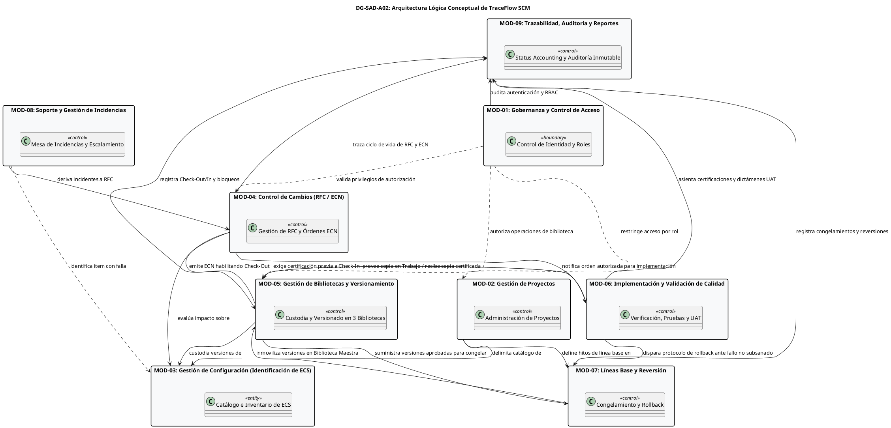
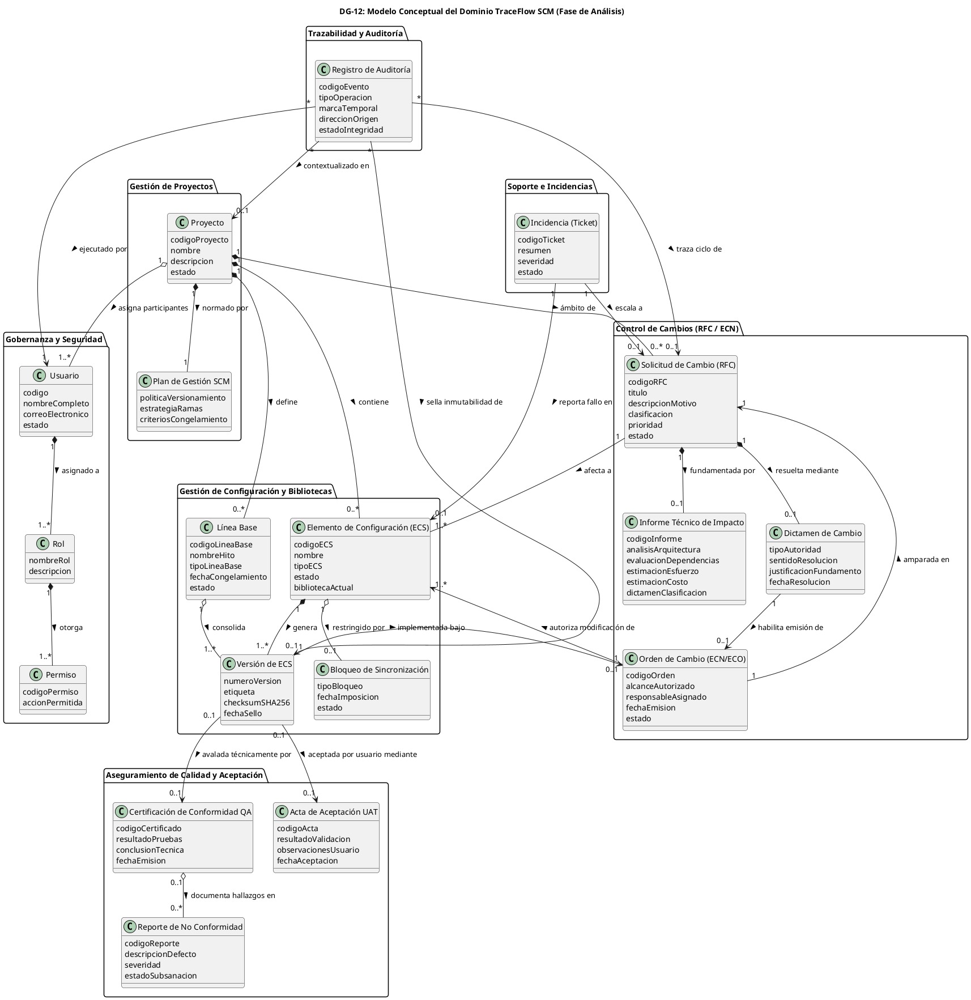

# Sistema de Gestión de Configuración de Software - TraceFlow SCM

> **Documento de Arquitectura de Software (SAD) — Fase de Análisis**  
> **Versión:** 1.0 (Baseline SAD de Análisis)  
> **Fecha:** Octubre 2026  
> **Estado:** APROBADO  
> **Repositorio Oficial:** `TraceFlow`  
> **Organización Cliente:** ÉXODO S.A.C.  
> **Equipo de Desarrollo:** C-SharkTeam  

---

```
========================================================================================
                      UNIVERSIDAD PRIVADA DE TACNA
                         FACULTAD DE INGENIERÍA
              ESCUELA PROFESIONAL DE INGENIERÍA DE SISTEMAS

        "Sistema de Gestión de Configuración de Software - TraceFlow SCM"
              DOCUMENTO DE ARQUITECTURA DE SOFTWARE (SAD)
                           FASE DE ANÁLISIS

    Curso:   Gestión de la Configuración de Software
    Docente: Dr. RICARDO EDUARDO VALCARCEL ALVARADO

    Autores (C-SharkTeam):
      - ANTAYHUA MAMANI, Renzo Antonio       (2022073504)
      - MEDINA QUISPE, Joan Cristian         (2022074255)
      - LOYOLA VILCA CHOQUE, Renzo Fernando  (2021072615)
      - RIVERA MUÑOZ, Augusto Joaquin        (2022073505)

                               TACNA – PERÚ
                                   2026
========================================================================================
```

---

## Control de Versiones

| Versión | Hecha por | Revisada por | Aprobada por | Fecha | Motivo |
| :---: | :--- | :--- | :--- | :---: | :--- |
| **1.0** | C-SharkTeam (JCM / RAA / RFL / AJR) | Dr. Ricardo Valcarcel Alvarado | Dr. Ricardo Valcarcel Alvarado | 01/10/2026 | Emisión formal y congelamiento de la Baseline del SAD de Análisis (Arquitectura Conceptual y Lógica). |

---

## Índice General

- [1. Introducción](#1-introducción)
  - [1.1 Propósito del Documento](#11-propósito-del-documento)
  - [1.2 Alcance del Sistema](#12-alcance-del-sistema)
  - [1.3 Relación con el SRS de Análisis (Baseline de Requerimientos)](#13-relación-con-el-srs-de-análisis-baseline-de-requerimientos)
  - [1.4 Definiciones, Acrónimos y Abreviaturas](#14-definiciones-acrónimos-y-abreviaturas)
  - [1.5 Referencias Documentales y Normativas](#15-referencias-documentales-y-normativas)
- [2. Drivers Arquitectónicos](#2-drivers-arquitectónicos)
  - [2.1 Drivers Funcionales (RF-01 a RF-18)](#21-drivers-funcionales-rf-01-a-rf-18)
  - [2.2 Drivers de Calidad (RNF-01 a RNF-09)](#22-drivers-de-calidad-rnf-01-a-rnf-09)
- [3. Vista de Contexto Arquitectónico](#3-vista-de-contexto-arquitectónico)
  - [3.1 Contexto del Sistema Frente a su Entorno Operativo](#31-contexto-del-sistema-frente-a-su-entorno-operativo)
  - [3.2 Frontera del Sistema y los 7 Actores Canónicos](#32-frontera-del-sistema-y-los-7-actores-canónicos)
  - [3.3 TraceFlow SCM como Núcleo de Gobernanza y Gestión](#33-traceflow-scm-como-núcleo-de-gobernanza-y-gestión)
  - [3.4 Diagrama DG-SAD-A01: Contexto Arquitectónico de TraceFlow SCM](#34-diagrama-dg-sad-a01-contexto-arquitectónico-de-traceflow-scm)
- [4. Arquitectura Lógica de Análisis](#4-arquitectura-lógica-de-análisis)
  - [4.1 Criterios de Descomposición Modular Conceptual](#41-criterios-de-descomposición-modular-conceptual)
  - [4.2 Catálogo de los 9 Módulos Arquitectónicos Conceptuales](#42-catálogo-de-los-9-módulos-arquitectónicos-conceptuales)
  - [4.3 Diagrama DG-SAD-A02: Arquitectura Lógica Conceptual de TraceFlow SCM](#43-diagrama-dg-sad-a02-arquitectura-lógica-conceptual-de-traceflow-scm)
  - [4.4 Dependencias e Interacciones entre Módulos Conceptuales](#44-dependencias-e-interacciones-entre-módulos-conceptuales)
- [5. Responsabilidades Arquitectónicas](#5-responsabilidades-arquitectónicas)
  - [5.1 MOD-01: Gobernanza y Control de Acceso (Usuarios y Roles)](#51-mod-01-gobernanza-y-control-de-acceso-usuarios-y-roles)
  - [5.2 MOD-02: Gestión de Proyectos](#52-mod-02-gestión-de-proyectos)
  - [5.3 MOD-03: Gestión de Configuración (Identificación de ECS)](#53-mod-03-gestión-de-configuración-identificación-de-ecs)
  - [5.4 MOD-04: Control de Cambios (RFC, Evaluación y ECN/ECO)](#54-mod-04-control-de-cambios-rfc-evaluación-y-ecneco)
  - [5.5 MOD-05: Gestión de Bibliotecas y Versionamiento](#55-mod-05-gestión-de-bibliotecas-y-versionamiento)
  - [5.6 MOD-06: Implementación y Validación de Calidad (Testing y Aceptación)](#56-mod-06-implementación-y-validación-de-calidad-testing-y-aceptación)
  - [5.7 MOD-07: Líneas Base y Reversión (Rollback y Cancelación)](#57-mod-07-líneas-base-y-reversión-rollback-y-cancelación)
  - [5.8 MOD-08: Soporte y Gestión de Incidencias](#58-mod-08-soporte-y-gestión-de-incidencias)
  - [5.9 MOD-09: Trazabilidad, Auditoría y Reportes (Status Accounting)](#59-mod-09-trazabilidad-auditoría-y-reportes-status-accounting)
- [6. Vista Conceptual del Dominio](#6-vista-conceptual-del-dominio)
  - [6.1 Integración del Modelo Conceptual del Dominio (DG-12)](#61-integración-del-modelo-conceptual-del-dominio-dg-12)
  - [6.2 Matriz Entidad del Dominio -> Módulo Responsable -> Módulos Consumidores](#62-matriz-entidad-del-dominio---módulo-responsable---módulos-consumidores)
  - [6.3 Reglas de Integridad y Consistencia Conceptual del Dominio](#63-reglas-de-integridad-y-consistencia-conceptual-del-dominio)
- [7. Vista del Proceso de Gestión de Cambios (TO-BE v2)](#7-vista-del-proceso-de-gestión-de-cambios-to-be-v2)
  - [7.1 Orquestación Arquitectónica del Flujo TO-BE v2 (DG-03)](#71-orquestación-arquitectónica-del-flujo-to-be-v2-dg-03)
  - [7.2 Ciclo de Vida de la RFC y Transiciones de Estado (DG-11)](#72-ciclo-de-vida-de-la-rfc-y-transiciones-de-estado-dg-11)
  - [7.3 Matriz Fase del Proceso -> Módulo Arquitectónico -> Casos de Uso](#73-matriz-fase-del-proceso---módulo-arquitectónico---casos-de-uso)
- [8. Seguridad y Control de Acceso Conceptual](#8-seguridad-y-control-de-acceso-conceptual)
  - [8.1 Modelo Conceptual RBAC y Privilegios](#81-modelo-conceptual-rbac-y-privilegios)
  - [8.2 Matriz de Segregación de Funciones (SoD)](#82-matriz-de-segregación-de-funciones-sod)
  - [8.3 Mecanismos Conceptuales de No-Repudio y Trazabilidad](#83-mecanismos-conceptuales-de-no-repudio-y-trazabilidad)
  - [8.4 Declaración de Desacoplamiento Tecnológico](#84-declaración-de-desacoplamiento-tecnológico)
- [9. Gestión Conceptual de Información y Configuración](#9-gestión-conceptual-de-información-y-configuración)
  - [9.1 Jerarquía Estructural del Sistema SCM](#91-jerarquía-estructural-del-sistema-scm)
  - [9.2 Modelo Conceptual de Bloqueos de Sincronización y Exclusión Mutua](#92-modelo-conceptual-de-bloqueos-de-sincronización-y-exclusión-mutua)
  - [9.3 Modelo de Ciclo de Vida y Trazabilidad de RFC y ECN/ECO](#93-modelo-de-ciclo-de-vida-y-trazabilidad-de-rfc-y-ecneco)
  - [9.4 Modelo Conceptual de Registro de Auditoría Inmutable (Append-Only)](#94-modelo-conceptual-de-registro-de-auditoría-inmutable-append-only)
  - [9.5 Declaración de Desacoplamiento de Esquemas Físicos y Bases de Datos](#95-declaración-de-desacoplamiento-de-esquemas-físicos-y-bases-de-datos)
- [10. Escenarios Arquitectónicos de Calidad](#10-escenarios-arquitectónicos-de-calidad)
  - [10.1 Especificación Formal de Escenarios de Calidad (RNF-01 a RNF-09)](#101-especificación-formal-de-escenarios-de-calidad-rnf-01-a-rnf-09)
  - [10.2 Análisis de Compensaciones (Trade-Offs) Arquitectónicos](#102-análisis-de-compensaciones-trade-offs-arquitectónicos)
- [11. Restricciones y Principios Arquitectónicos](#11-restricciones-y-principios-arquitectónicos)
  - [11.1 Principios Rectores de la Arquitectura](#111-principios-rectores-de-la-arquitectura)
  - [11.2 Restricciones del Negocio vs Decisiones Técnicas Diferidas](#112-restricciones-del-negocio-vs-decisiones-técnicas-diferidas)
- [12. Matriz de Trazabilidad Arquitectónica](#12-matriz-de-trazabilidad-arquitectónica)
  - [12.1 Matriz Integral: Módulo | RF | RNF | RN | CU | Entidades DG-12](#121-matriz-integral-módulo--rf--rnf--rn--cu--entidades-dg-12)
- [13. Decisiones Diferidas a la Fase de Diseño](#13-decisiones-diferidas-a-la-fase-de-diseño)
  - [13.1 Catálogo de Decisiones Posteriores (Frontend, Backend, DB, APIs, Despliegue)](#131-catálogo-de-decisiones-posteriores-frontend-backend-db-apis-despliegue)
  - [13.2 Dictamen Formal de Obsolescencia de DG-13 para la Fase de Análisis](#132-dictamen-formal-de-obsolescencia-de-dg-13-para-la-fase-de-análisis)
- [14. Auditoría del SAD de Análisis](#14-auditoría-del-sad-de-análisis)
  - [14.1 Matriz de Verificación contra Criterios de Calidad](#141-matriz-de-verificación-contra-criterios-de-calidad)
  - [14.2 Declaración Formal de Aprobación (BASELINE SAD DE ANÁLISIS)](#142-declaración-formal-de-aprobación-baseline-sad-de-análisis)

---

# 1. Introducción

### 1.1 Propósito del Documento
El presente **Documento de Arquitectura de Software (SAD) — Fase de Análisis** tiene como propósito fundamental establecer la estructura lógica, conceptual y funcional del sistema **TraceFlow SCM**, traduciendo los requerimientos funcionales, no funcionales y las reglas de negocio formalizados en la **Baseline de Requerimientos de Software (SRS)** en una organización modular coherente y rigurosa.

Este documento opera en el nivel de **ANÁLISIS DE SISTEMAS**:
1. Modela los límites conceptuales del sistema, los subsistemas intervinientes, las responsabilidades arquitectónicas y las colaboraciones lógicas entre módulos.
2. Garantiza la neutralidad e independencia tecnológica, abstrayéndose deliberadamente de decisiones de implementación física, marcos de trabajo (frameworks), esquemas relacionales de bases de datos o protocolos de red específicos.
3. Sirve como puente formal y vinculante entre el análisis funcional de requerimientos (`FD03-EPIS-Informe_SRS.md`) y el posterior Documento de Arquitectura de Software de Diseño (SAD de Diseño), preservando la trazabilidad bidireccional estricta en cada una de sus definiciones.

### 1.2 Alcance del Sistema
**TraceFlow SCM** es un sistema integral de Gestión de Configuración de Software (Software Configuration Management) diseñado para gobernar, automatizar y auditar el ciclo de vida de los activos de software desarrollados por la organización **C-SharkTeam** para el entorno empresarial de **ÉXODO S.A.C.**.

El alcance del sistema en la fase de análisis comprende nueve capacidades conceptuales esenciales:
- **Gobernanza y Control de Acceso:** Gestión centralizada de identidades de usuarios, roles institucionales y perfiles de permisos bajo el principio de menor privilegio y segregación de funciones (SoD).
- **Gestión de Proyectos:** Delimitación de proyectos de desarrollo, parámetros SCM y asignación formal de participantes.
- **Identificación y Registro de ECS:** Catalogación, metadatos y clasificación de Elementos de Configuración de Software (código fuente, documentación, scripts, modelos).
- **Control Formal de Cambios:** Captura de Solicitudes de Cambio (RFC), análisis de impacto técnico, bifurcación para cambios menores/mayores, evaluación por el Comité de Control de Cambios (CCB) y emisión de Órdenes de Cambio de Ingeniería (ECN/ECO).
- **Gestión de Bibliotecas Escalonadas y Versionamiento:** Custodia de ítems de configuración a través de tres entornos lógicos controlados (Biblioteca de Trabajo, Biblioteca de Acreditadas y Biblioteca Maestra), operaciones de extracción (Check-Out) y retorno (Check-In), junto con bloqueos pesimistas de sincronización.
- **Implementación y Validación de Calidad:** Aislamiento de modificaciones en espacios de trabajo, ejecución de pruebas unitarias locales, pruebas de integración, emisión de Certificaciones de Calidad por QA, gestión de no conformidades y validación final de aceptación por el usuario (UAT).
- **Líneas Base y Recuperación ante Desastres:** Definición, consolidación y congelamiento inmutable de Líneas Base (Base Functional, Base Diseñada, Base Producto), así como la ejecución de protocolos seguros de reversión (Rollback) y cancelación de órdenes.
- **Soporte y Gestión de Incidencias:** Captura de reportes operacionales de fallos, seguimiento de tickets y escalamiento estructurado hacia solicitudes de cambio formales.
- **Trazabilidad, Auditoría y Contabilidad del Estado (Status Accounting):** Verificación matemática de integridad mediante firmas hash SHA-256, bitácora cronológica inviolable (append-only) y generación de reportes consolidados del estado de la configuración.

### 1.3 Relación con el SRS de Análisis (Baseline de Requerimientos)
El SAD de Análisis se sustenta de manera directa y subordinada en el documento **`FD03-EPIS-Informe_SRS.md`**, el cual ha sido formalmente cerrado y congelado como **BASELINE DE ANÁLISIS**. Cada módulo, responsabilidad y escenario arquitectónico responde inequívocamente a los artefactos canónicos del SRS:
- Los **18 Requerimientos Funcionales (`RF-01` a `RF-18`)** catalogados en `docs/TABLES.md` (`TB-04`).
- Los **9 Requerimientos No Funcionales (`RNF-01` a `RNF-09`)** catalogados en `docs/TABLES.md` (`TB-05`).
- Las **9 Reglas de Negocio (`RN-01` a `RN-09`)** catalogadas en `docs/TABLES.md` (`TB-06`).
- Los **31 Casos de Uso (`CU-01` a `CU-30` y `CU-04.1`)** catalogados en `docs/TABLES.md` (`TB-10`).
- El **Modelo Conceptual del Dominio (`DG-12`)** y los **31 Diagramas de Análisis de Objetos BCE (`DG-AO-01` a `DG-AO-30` y `DG-AO-04.1`)**.

Cualquier discrepancia o ambigüedad detectada durante la elaboración del presente documento fue resuelta aplicando la jerarquía normativa fijada en `docs/DOCUMENTATION_RULES.md` Sección 3, manteniendo a `docs/TABLES.md` y `docs/DIAGRAMS.md` como las Fuentes Únicas de Verdad (SSOT).

### 1.4 Definiciones, Acrónimos y Abreviaturas
A continuación se definen los términos técnicos normativos empleados a lo largo del documento:

| Acrónimo / Término | Definición Conceptual |
| :--- | :--- |
| **BCE** | *Boundary-Control-Entity*: Patrón de análisis que segrega las clases conceptuales en Fronteras (interacción externa), Controles (lógica del caso de uso) y Entidades (datos del dominio). |
| **CCB** | *Configuration Control Board* (Comité de Control de Cambios): Órgano colegiado con autoridad exclusiva para evaluar y dictaminar Cambios Mayores en el sistema. |
| **Check-In** | Operación conceptual de ingreso y promoción de un ECS validado desde la Biblioteca de Trabajo hacia la Biblioteca de Acreditadas o Maestra. |
| **Check-Out** | Operación conceptual de extracción autorizada de una copia de trabajo de un ECS custodiado, asociada a una ECN y sujeta a bloqueo de sincronización. |
| **ECN / ECO** | *Engineering Change Notice / Engineering Change Order*: Notificación u orden formal vinculante que autoriza técnicamente la modificación de uno o más ECS. |
| **ECS** | *Elemento de Configuración de Software*: Unidad atómica o agregada de software sujeta a control de versiones, identificación formal y trazabilidad. |
| **Línea Base** | Especificación o producto de configuración que ha sido formalmente revisado y acordado, sirviendo de base inmutable para el desarrollo posterior. |
| **RBAC** | *Role-Based Access Control*: Mecanismo conceptual de control de acceso fundamentado en roles asignados y privilegios explícitos. |
| **RFC** | *Request for Change* (Solicitud de Cambio): Documento formal inicial mediante el cual un interesado solicita una modificación, corrección o mejora. |
| **Rollback** | Protocolo conceptual de reversión mediante el cual se restablece el estado de un ECS a una versión o línea base previa certificada y estable. |
| **SAD** | *Software Architecture Document*: Documento de Arquitectura de Software. |
| **SCM** | *Software Configuration Management*: Gestión de la Configuración de Software según lineamientos IEEE Std 828 e ISO/IEC/IEEE 12207. |
| **SHA-256** | *Secure Hash Algorithm 256-bit*: Función resumen criptográfica utilizada para certificar la integridad matemática e inmutabilidad de los ECS. |
| **SoD** | *Segregation of Duties* (Segregación de Funciones): Principio de control interno que impide que una misma persona ejecute acciones incompatibles (ej. desarrollar y certificar). |
| **Status Accounting** | Contabilidad del estado de la configuración: Registro y reporte formal del estado de los ECS, solicitudes de cambio y líneas base en todo momento. |
| **UAT** | *User Acceptance Testing*: Pruebas de aceptación formal conducidas por el Solicitante/Usuario final para validar la conformidad de la entrega. |
| **WORM** | *Write Once, Read Many*: Principio conceptual de persistencia donde los datos se escriben una sola vez y jamás pueden ser modificados ni eliminados. |

### 1.5 Referencias Documentales y Normativas
- **IEEE Std 830-1998:** *IEEE Recommended Practice for Software Requirements Specifications.*
- **ISO/IEC/IEEE 42010:2011 / 2022:** *Systems and software engineering — Architecture description.*
- **ISO/IEC/IEEE 12207:2017:** *Systems and software engineering — Software life cycle processes.*
- **IEEE Std 828-2012:** *Standard for Configuration Management in Systems and Software Engineering.*
- **CMMI-DEV v2.0:** *Capability Maturity Model Integration — Configuration Management (CM) & Process and Product Quality Assurance (PPQA).*
- **FD01-EPIS-Informe_Factibilidad_v2.md:** *Informe de Factibilidad Técnica, Operativa y Económica del Proyecto TraceFlow SCM.*
- **FD03-EPIS-Informe_SRS.md:** *Documento Maestro de Especificación de Requerimientos de Software (Baseline de Análisis).*
- **docs/DOCUMENTATION_RULES.md:** *Reglas de Gobernanza Documental y Marco Normativo de Trazabilidad.*
- **docs/TABLES.md:** *Catálogo Centralizado de Tablas Maestras y Matrices de Trazabilidad.*
- **docs/DIAGRAMS.md:** *Catálogo Centralizado de Diagramas PlantUML (SSOT).*

---

# 2. Drivers Arquitectónicos

Los drivers arquitectónicos son los requerimientos y fuerzas motrices que moldean decisivamente la estructura, la modularidad y el comportamiento lógico del sistema. Se clasifican en **Drivers Funcionales** y **Drivers de Calidad**.

### 2.1 Drivers Funcionales (RF-01 a RF-18)
Los 18 Requerimientos Funcionales obligatorios aprobados en el SRS impactan directamente en las decisiones de diseño conceptual del sistema:

| ID | Requerimiento Funcional | Impacto Estructural en la Arquitectura Conceptual |
| :---: | :--- | :--- |
| **RF-01** | Gestionar usuarios, roles y accesos | Impone un subsistema transversal de Gobernanza y Seguridad con modelo RBAC estricto, capaz de autenticar actores y aislar privilegios en cada operación. |
| **RF-02** | Administrar proyectos y metadatos SCM | Exige que la entidad Proyecto sea la raíz de agregación lógica del sistema; todo ECS, RFC y Línea Base pertenece obligatoriamente a un proyecto. |
| **RF-03** | Registrar y clasificar elementos de configuración (ECS) | Demanda un catálogo formal de inventario de configuración con tipificación estricta (código, documentos, binarios) y versionamiento inicial. |
| **RF-04** | Registrar Solicitud de Cambio (RFC) | Establece la compuerta formal de entrada para toda mutación en el sistema, prohibiendo modificaciones informales fuera de un expediente RFC. |
| **RF-05** | Validar y clasificar cambio | Introduce lógica de bifurcación condicional basada en el análisis de impacto: Cambios Menores (flujo expedito) vs Cambios Mayores (flujo colegiado). |
| **RF-06** | Evaluar impacto técnico | Requiere la consolidación de un artefacto formal (Informe Técnico de Impacto) que cuantifique esfuerzo, costo, riesgos y dependencias entre ECS. |
| **RF-07** | Aprobar o rechazar solicitud de cambio | Demanda soporte para dictámenes colegiados emitidos por el CCB (Cambios Mayores) o por autoridad técnica delegada (Cambios Menores). |
| **RF-08** | Controlar versiones y repositorios de ECS | Impone la segregación física y lógica de los activos de configuración en tres bibliotecas estructuradas: Trabajo, Acreditadas y Maestra. |
| **RF-09** | Gestionar check-out y check-in con bloqueo | Exige mecanismos de concurrencia pesimista (bloqueo exclusivo de sincronización) para impedir condiciones de carrera y colisiones de edición. |
| **RF-10** | Implementar y validar cambios en ECS | Demanda trazabilidad rigurosa sobre el entorno de desarrollo y la ejecución de pruebas unitarias locales antes de solicitar la integración. |
| **RF-11** | Certificar calidad y registrar no conformidades | Requiere una barrera de control independiente operada exclusivamente por el Equipo de Calidad (QA), con ciclo cerrado de no conformidades. |
| **RF-12** | Crear y congelar líneas base | Impone la capacidad de consolidar y sellar como inmutables conjuntos coherentes de versiones de ECS en hitos clave del proyecto. |
| **RF-13** | Ejecutar reversión de cambios (Rollback) | Demanda un mecanismo de contingencia para desestimar versiones defectuosas y reestablecer la última versión o línea base estable conocida. |
| **RF-14** | Emitir y notificar orden de cambio (ECN/ECO) | Exige la formalización de una orden de cambio vinculante que actúe como credencial obligatoria para habilitar el Check-Out del ECS. |
| **RF-15** | Registrar y gestionar tickets de incidencias | Requiere una mesa de servicio integrada que capture fallos operacionales y permita su derivación o escalamiento directo a una RFC formal. |
| **RF-16** | Verificar integridad mediante checksum | Demanda un componente de cálculo y cotejo de resúmenes criptográficos SHA-256 para detectar cualquier alteración no autorizada en los ECS. |
| **RF-17** | Mantener registro de auditoría inmutable | Impone una estructura de almacenamiento histórico de eventos basada en el principio append-only (solo adición, inmutable y no repudiable). |
| **RF-18** | Generar reportes de estado SCM (Status Accounting) | Exige la agregación y visualización analítica del estado de la configuración en tiempo real (estado de RFCs, versiones, líneas base y auditoría). |

### 2.2 Drivers de Calidad (RNF-01 a RNF-09)
Los 9 Requerimientos No Funcionales normativos determinan los atributos de calidad del sistema:

1. **Rendimiento y Eficiencia Temporal (RNF-01):** El sistema debe procesar transacciones comunes (Check-Out, Check-In, aprobaciones) en $\le 2$ segundos y generar reportes analíticos complejos o consolidación de líneas base en $\le 5$ segundos, minimizando la latencia operativa.
2. **Disponibilidad y Continuidad (RNF-02):** La arquitectura lógica debe garantizar un nivel de disponibilidad del servicio del $99.5\%$ durante el horario laboral, previendo tolerancia ante fallos y aislamiento de errores por módulo.
3. **Integridad y No Repudio de Información (RNF-03):** Se exige la inviolabilidad matemática de las versiones de ECS mediante algoritmos hash estándar (SHA-256) y marcas de tiempo inmutables en cada transición de estado.
4. **Seguridad y Confidencialidad de Acceso (RNF-04):** Principio de menor privilegio a través de un modelo RBAC estricto, segregación absoluta de funciones (SoD) y aislamiento de datos entre proyectos independientes.
5. **Trazabilidad Integral y Auditabilidad (RNF-05):** Capacidad de reconstruir la historia completa de cualquier modificación a un ECS, desde la incidencia originaria o RFC hasta la línea base congelada, registrando de forma inmutable quién, cuándo, por qué y bajo qué orden se ejecutó la acción.
6. **Capacidad y Escalabilidad Operativa (RNF-06):** Diseño modular desacoplado capaz de gestionar de forma concurrente múltiples proyectos, miles de ECS y un volumen creciente de registros de auditoría sin degradación estructural.
7. **Usabilidad, Ergonomía y Aprendizaje (RNF-07):** Flujos conceptuales intuitivos, reducción de complejidad cognitiva en formularios críticos (como el registro y subsanación de RFC) y mensajes de retroalimentación claros.
8. **Portabilidad y Neutralidad de Plataforma (RNF-08):** Desacoplamiento conceptual de cualquier infraestructura física, permitiendo una futura implementación en entornos web abiertos, basados en estándares internacionales y clientes heterogéneos.
9. **Mantenibilidad, Modularidad y Extensibilidad (RNF-09):** Alta cohesión interna en cada módulo y bajo acoplamiento entre subsistemas, permitiendo extender o sustituir componentes funcionales sin provocar efectos colaterales en el núcleo SCM.

---

# 3. Vista de Contexto Arquitectónico

### 3.1 Contexto del Sistema Frente a su Entorno Operativo
El sistema **TraceFlow SCM** actúa como el núcleo orquestador de la disciplina de Gestión de Configuración de Software en la empresa cliente **ÉXODO S.A.C.**, articulando la interacción entre los diferentes roles organizacionales que intervienen en el desarrollo, mantenimiento, aseguramiento de la calidad y gobierno de proyectos de software.

TraceFlow SCM no sustituye las herramientas de desarrollo local (como editores de código o compiladores), sino que establece la gobernanza, las compuertas de calidad, la inmutabilidad de los repositorios y la trazabilidad de extremo a extremo requerida por estándares internacionales como CMMI-DEV e ISO/IEC/IEEE 12207.

### 3.2 Frontera del Sistema y los 7 Actores Canónicos
La frontera del sistema delimita estrictamente las funciones provistas por **TraceFlow SCM** frente a las responsabilidades operadas por actores humanos externos.

Se han formalizado **7 Actores Canónicos**, eliminando cualquier figura genérica o ambigua:
1. **Solicitante:** Interesado o usuario que identifica una necesidad de cambio o fallo operativo, registra y subsana solicitudes de cambio (RFC), reporta incidencias y emite la validación de aceptación funcional final (UAT).
2. **Analista de Requerimientos / Gestor:** Responsable funcional que crea y administra proyectos, realiza la revisión preliminar de solicitudes (validación y clasificación), co-autoriza Cambios Menores y deriva incidencias a RFC.
3. **Arquitecto / Especialista Técnico:** Responsable técnico que cataloga y clasifica nuevos ECS, efectúa el análisis de impacto técnico multidisciplinario y co-autoriza Cambios Menores bajo autoridad delegada.
4. **Comité de Control de Cambios (CCB):** Órgano colegiado de máxima autoridad que delibera, aprueba o rechaza Cambios Mayores, emite las Órdenes de Cambio correspondientes (ECN/ECO) y audita la trazabilidad integral.
5. **Administrador de Configuración / Bibliotecario:** Custodio operativo de los repositorios SCM; gestiona identidades y roles RBAC, aplica y libera bloqueos de sincronización, ejecuta Check-Out y Check-In entre bibliotecas, congela Líneas Base, ejecuta reversiones (Rollback), cancela ECNs y valida la integridad SHA-256.
6. **Ingeniero de Software / Desarrollador:** Encargado técnico de implementar las modificaciones autorizadas en la Biblioteca de Trabajo y verificar su correcto funcionamiento mediante pruebas unitarias locales previas a la entrega.
7. **Equipo de Calidad / Testing:** Entidad de aseguramiento independiente que ejecuta pruebas de integración sobre los cambios implementados, emite Certificaciones de Calidad aprobatorias o elabora Reportes de No Conformidad para reprocesamiento.

### 3.3 TraceFlow SCM como Núcleo de Gobernanza y Gestión
En concordancia con las normas de modelado UML y los lineamientos de auditoría de cierre del SRS:
- **TraceFlow SCM es el sistema bajo estudio y NO un actor externo.**
- El sistema es la entidad central encargada de procesar las peticiones, verificar las precondiciones y reglas de negocio, transformar el estado de los objetos del dominio y resguardar la inmutabilidad de la información.
- No se permiten en los modelos actores espurios como *"Sistema TraceFlow SCM"* o *"Sistema de Pruebas Unitarias"*.

### 3.4 Diagrama DG-SAD-A01: Contexto Arquitectónico de TraceFlow SCM
A continuación se presenta el diagrama conceptual de contexto que modela la frontera del sistema y los flujos de interacción con los 7 actores canónicos:

```plantuml
@startuml DG-SAD-A01
skinparam shadowing false
skinparam roundcorner 8
skinparam defaultFontName Arial
skinparam sequenceMessageAlign center

title <b>DG-SAD-A01: Contexto Arquitectónico de TraceFlow SCM (Fase de Análisis)</b>

actor "Solicitante" as ACT_SOL
actor "Analista de Requerimientos\n/ Gestor" as ACT_ANA
actor "Arquitecto\n/ Especialista Técnico" as ACT_ARQ
actor "Comité de Control\nde Cambios (CCB)" as ACT_CCB
actor "Administrador de Configuración\n/ Bibliotecario" as ACT_ADM
actor "Ingeniero de Software\n/ Desarrollador" as ACT_DEV
actor "Equipo de Calidad\n/ Testing" as ACT_QA

rectangle "TraceFlow SCM\n(Sistema de Gestión de Configuración de Software)" as SYS #E8F0FE {
    rectangle "Gobernanza y Control de Acceso" as SUB_GOB
    rectangle "Gestión de Proyectos y ECS" as SUB_PROJ
    rectangle "Control de Cambios (RFC / ECN)" as SUB_CHG
    rectangle "Gestión de Bibliotecas y Versionamiento" as SUB_LIB
    rectangle "Implementación, QA y Aceptación (UAT)" as SUB_QA
    rectangle "Trazabilidad, Auditoría y Reportes" as SUB_AUD
}

' Interacciones de Actores Canónicos
ACT_SOL --> SUB_CHG : "Registra RFC y subsana datos (CU-04, CU-04.1)"
ACT_SOL --> SUB_QA : "Valida aceptación funcional UAT (CU-29)"
ACT_SOL --> SUB_AUD : "Registra incidencias y consulta estado (CU-23, CU-24)"

ACT_ANA --> SUB_PROJ : "Crea y administra proyectos (CU-02, CU-03)"
ACT_ANA --> SUB_CHG : "Valida y clasifica solicitudes (CU-05)"
ACT_ANA --> SUB_CHG : "Co-autoriza Cambios Menores bajo autoridad delegada (CU-30)"
ACT_ANA --> SUB_AUD : "Deriva incidencias a RFC (CU-25)"

ACT_ARQ --> SUB_PROJ : "Registra y clasifica nuevos ECS (CU-09)"
ACT_ARQ --> SUB_CHG : "Realiza análisis de impacto técnico (CU-06)"
ACT_ARQ --> SUB_CHG : "Co-autoriza Cambios Menores bajo autoridad delegada (CU-30)"

ACT_CCB --> SUB_CHG : "Evalúa y aprueba/rechaza Cambios Mayores (CU-07)"
ACT_CCB --> SUB_CHG : "Emite Órdenes de Cambio mayores ECN/ECO (CU-08)"
ACT_CCB --> SUB_AUD : "Audita acciones y trazabilidad integral (CU-27)"

ACT_ADM --> SUB_GOB : "Gestiona usuarios, roles y permisos RBAC (CU-01)"
ACT_ADM --> SUB_LIB : "Opera Check-Out y Check-In entre bibliotecas (CU-10, CU-12)"
ACT_ADM --> SUB_LIB : "Aplica y libera bloqueos de sincronización (CU-11)"
ACT_ADM --> SUB_LIB : "Congela Líneas Base y ejecuta Rollback (CU-20, CU-21, CU-22)"
ACT_ADM --> SUB_AUD : "Valida integridad SHA-256 y genera reportes (CU-26, CU-28)"

ACT_DEV --> SUB_QA : "Implementa cambios autorizados en Trabajo (CU-14)"
ACT_DEV --> SUB_QA : "Ejecuta pruebas unitarias locales (CU-15)"

ACT_QA --> SUB_QA : "Ejecuta pruebas de integración (CU-16)"
ACT_QA --> SUB_QA : "Certifica conformidad del cambio (CU-17)"
ACT_QA --> SUB_QA : "Reporta no conformidades y re-testea (CU-18, CU-19)"

@enduml
```



---

# 4. Arquitectura Lógica de Análisis

### 4.1 Criterios de Descomposición Modular Conceptual
La arquitectura lógica de análisis de **TraceFlow SCM** ha sido diseñada aplicando los principios fundamentales de la ingeniería de software clásica:
1. **Alta Cohesión:** Cada módulo agrupa funciones, procesos y datos estrechamente relacionados que responden a una misma competencia del ciclo de vida SCM.
2. **Bajo Acoplamiento:** Los módulos se comunican exclusivamente a través de contratos conceptuales explícitos (solicitudes, identificadores de objetos e intercambio de estados), minimizando dependencias directas o bidireccionales cruzadas.
3. **Principio de Responsabilidad Única (SRP):** Cada subsistema tiene una única razón de cambio bien definida en el dominio del negocio.
4. **Segregación de Funciones (SoD):** La estructura modular garantiza que los componentes responsables de emitir órdenes (Control de Cambios), ejecutarlas (Implementación), custodiarlas (Bibliotecas) y validarlas (Calidad) estén conceptualmente separados.

### 4.2 Catálogo de los 9 Módulos Arquitectónicos Conceptuales
La auditoría de la descomposición modular determinó la consolidación en **9 Módulos Arquitectónicos Conceptuales**, unificando la gobernanza y la gestión de usuarios en un único subsistema coherente para evitar módulos fragmentados:

| Módulo | Nombre Oficial | Dominio Conceptual | RF Cubiertos | Casos de Uso |
| :---: | :--- | :--- | :---: | :--- |
| **MOD-01** | Gobernanza y Control de Acceso | Identidades, roles, permisos RBAC y sesiones | RF-01 | CU-01 |
| **MOD-02** | Gestión de Proyectos | Proyectos, planes SCM y asignación de participantes | RF-02 | CU-02, CU-03 |
| **MOD-03** | Gestión de Configuración (Identificación de ECS) | Inventario, catálogo, tipificación y relaciones de ECS | RF-03 | CU-09 |
| **MOD-04** | Control de Cambios (RFC / ECN) | Captura de RFC, análisis de impacto, aprobación y emisión de ECN | RF-04, RF-05, RF-06, RF-07, RF-14 | CU-04, CU-04.1, CU-05, CU-06, CU-07, CU-08, CU-30 |
| **MOD-05** | Gestión de Bibliotecas y Versionamiento | Custodia en 3 bibliotecas, extracción, retorno y bloqueos | RF-08, RF-09 | CU-10, CU-11, CU-12, CU-13 |
| **MOD-06** | Implementación y Validación de Calidad | Desarrollo en Trabajo, pruebas unitarias, integración, QA y UAT | RF-10, RF-11 | CU-14, CU-15, CU-16, CU-17, CU-18, CU-19, CU-29 |
| **MOD-07** | Líneas Base y Reversión | Hitos de línea base, congelamiento, rollback y cancelación | RF-12, RF-13 | CU-20, CU-21, CU-22 |
| **MOD-08** | Soporte y Gestión de Incidencias | Captura de tickets de fallas y derivación a RFC | RF-15 | CU-23, CU-24, CU-25 |
| **MOD-09** | Trazabilidad, Auditoría y Reportes | Status accounting, bitácora inmutable y verificación SHA-256 | RF-16, RF-17, RF-18 | CU-26, CU-27, CU-28 |

### 4.3 Diagrama DG-SAD-A02: Arquitectura Lógica Conceptual de TraceFlow SCM
A continuación se presenta el diagrama de paquetes arquitecturales que ilustra los 9 módulos conceptuales y sus relaciones lógicas de colaboración y dependencia:



### 4.4 Dependencias e Interacciones entre Módulos Conceptuales
Las interacciones observadas en `DG-SAD-A02` responden a principios rigurosos de acoplamiento controlado:
1. **MOD-01 (Gobernanza):** Es un subsistema transversal al que todos consultan lógicamente para validar la identidad y los privilegios RBAC del actor antes de permitir cualquier mutación.
2. **MOD-02 (Proyectos):** Actúa como contenedor de alcance; ningún ECS (`MOD-03`) ni Línea Base (`MOD-07`) puede existir en el vacío, requiriendo vinculación jerárquica a un proyecto formal.
3. **MOD-08 (Incidencias):** Interacciona con `MOD-04` al convertir una incidencia técnica en una Solicitud de Cambio formal cuando la resolución excede el ámbito de soporte inmediato.
4. **MOD-04 (Control de Cambios):** Es el motor de gobierno; no existe modificación en `MOD-05` (Bibliotecas) ni implementación en `MOD-06` (Calidad) que no esté precedida por una ECN/ECO emitida válidamente por `MOD-04`.
5. **MOD-05 y MOD-06 (Bibliotecas e Implementación):** Mantienen un ciclo colaborativo cerrado: `MOD-05` entrega una copia de trabajo tras el Check-Out; `MOD-06` ejecuta la modificación y las pruebas (unitarias, integración, QA y UAT); y `MOD-05` solo acepta el Check-In final si `MOD-06` provee una Certificación QA aprobatoria.
6. **MOD-07 (Líneas Base y Reversión):** Inmoviliza conjuntos de versiones custodiadas en `MOD-05` o revierte cambios erróneos restableciendo la última versión estable.
7. **MOD-09 (Trazabilidad y Auditoría):** Es un receptor desacoplado que registra eventos de forma transparente y asincrónica desde todos los demás módulos, garantizando la observabilidad sin entrometerse en la lógica de negocio.

---

# 5. Responsabilidades Arquitectónicas

En esta sección se detalla la especificación rigurosa de cada uno de los 9 módulos conceptuales que componen la arquitectura de TraceFlow SCM.

### 5.1 MOD-01: Gobernanza y Control de Acceso (Usuarios y Roles)
- **Identificador:** `MOD-01`
- **Nombre Oficial:** Gobernanza y Control de Acceso (Usuarios y Roles)
- **Objetivo Conceptual:** Administrar el ciclo de vida de los usuarios del sistema, sus asignaciones de roles canónicos y la verificación de permisos específicos para garantizar la seguridad de acceso y la segregación de funciones.
- **Responsabilidades Clave:**
  - Registrar, modificar el estado y custodiar los datos de identidad de los usuarios institucionales.
  - Administrar el catálogo de los 7 roles canónicos del sistema y sus asociaciones de permisos de operación.
  - Validar las credenciales lógicas de acceso y gestionar el contexto de sesión de los actores.
  - Aplicar en tiempo de ejecución las políticas de Segregación de Funciones (SoD) definidas en la regla `RN-01`.
- **Colaboración con otros Módulos:**
  - Provee servicios de autorización y consulta de identidad a todos los módulos (`MOD-02` a `MOD-08`).
  - Emite eventos de autenticación, cambios de roles y accesos hacia `MOD-09` para registro en auditoría.
- **Casos de Uso Soportados:** `CU-01` (*Gestionar usuarios y roles*).
- **Reglas de Negocio Asociadas:** `RN-01` (*Segregación de Funciones y Roles*).

### 5.2 MOD-02: Gestión de Proyectos
- **Identificador:** `MOD-02`
- **Nombre Oficial:** Gestión de Proyectos
- **Objetivo Conceptual:** Delimitar el ámbito administrativo, temporal y de gobernanza bajo el cual se estructuran los activos de software, definiendo los planes de gestión SCM y asignando el equipo participante.
- **Responsabilidades Clave:**
  - Registrar nuevos proyectos de software definiendo código, denominación, alcance, fechas y estado operativo.
  - Asociar a cada proyecto su Plan de Gestión SCM (políticas de ramas, directrices de versionado y criterios de líneas base).
  - Gestionar la asignación de usuarios institucionales a los proyectos en roles específicos.
  - Servir de raíz jerárquica para la contención de ECS, RFCs, ECNs y Líneas Base.
- **Colaboración con otros Módulos:**
  - Delimita el catálogo de configuración de `MOD-03`.
  - Provee el contexto de proyecto para la evaluación de cambios en `MOD-04` y líneas base en `MOD-07`.
  - Notifica eventos de creación y cierre de proyectos a `MOD-09`.
- **Casos de Uso Soportados:** `CU-02` (*Crear y administrar proyectos*), `CU-03` (*Consultar proyecto*).
- **Reglas de Negocio Asociadas:** `RN-02` (*Jerarquía Estructural y Pertenencia a Proyecto*).

### 5.3 MOD-03: Gestión de Configuración (Identificación de ECS)
- **Identificador:** `MOD-03`
- **Nombre Oficial:** Gestión de Configuración (Identificación de ECS)
- **Objetivo Conceptual:** Proveer la identificación unívoca, clasificación taxonómica y catalogación de los Elementos de Configuración de Software (ECS) que conforman los productos de software de cada proyecto.
- **Responsabilidades Clave:**
  - Registrar formalmente nuevos ECS asignando un identificador canónico, nombre descriptivo y tipo de ítem (código fuente, documentación técnica, scripts de despliegue, modelos arquitectónicos, datos de prueba).
  - Mantener los metadatos de configuración, dependencias lógicas y estado inicial de cada ECS.
  - Asegurar que ningún artefacto sea objeto de cambio o versionado sin estar formalmente inventariado como ECS.
- **Colaboración con otros Módulos:**
  - Pertenece jerárquicamente a un proyecto de `MOD-02`.
  - Suministra la estructura de ítems a ser evaluados por `MOD-04` en análisis de impacto técnico.
  - Es el sujeto pasivo sobre el cual operan las versiones y bibliotecas de `MOD-05`.
- **Casos de Uso Soportados:** `CU-09` (*Registrar ECS*).
- **Reglas de Negocio Asociadas:** `RN-02` (*Jerarquía Estructural y Pertenencia a Proyecto*), `RN-03` (*Trazabilidad Integral de Cambios*).

### 5.4 MOD-04: Control de Cambios (RFC, Evaluación y ECN/ECO)
- **Identificador:** `MOD-04`
- **Nombre Oficial:** Control de Cambios (RFC, Evaluación y ECN/ECO)
- **Objetivo Conceptual:** Orquestar de extremo a extremo el flujo formal de control de cambios, desde la captura inicial de la solicitud hasta la emisión de la orden de cambio vinculante o su rechazo justificado.
- **Responsabilidades Clave:**
  - Registrar Solicitudes de Cambio (RFC) capturando justificación, alcance preliminar y prioridad.
  - Gestionar el flujo de subsanación de observaciones (`CU-04.1`) cuando una RFC requiere información complementaria.
  - Controlar la revisión preliminar y clasificación de cambios en Menores o Mayores (`RN-06`).
  - Registrar el Informe Técnico de Impacto elaborado por el Arquitecto (esfuerzo, costos, riesgos, dependencias).
  - Gestionar la deliberación y dictamen del CCB para Cambios Mayores (`CU-07`) o la co-autorización delegada para Cambios Menores (`CU-30`).
  - Emitir Órdenes de Cambio de Ingeniería (ECN/ECO) formales que amparen la modificación de los ECS (`CU-08`).
- **Colaboración con otros Módulos:**
  - Recibe incidentes escalados desde `MOD-08`.
  - Consulta los ECS afectados en `MOD-03`.
  - Emite la ECN que habilita el Check-Out en `MOD-05` y la implementación en `MOD-06`.
  - Envía la historia completa de estados a `MOD-09`.
- **Casos de Uso Soportados:** `CU-04` (*Registrar Solicitud de Cambio*), `CU-04.1` (*Subsanar Solicitud de Cambio*), `CU-05` (*Validar y clasificar la solicitud*), `CU-06` (*Realizar análisis de impacto técnico*), `CU-07` (*Evaluar Cambio Mayor en CCB*), `CU-08` (*Emitir Orden de Cambio ECN/ECO*), `CU-30` (*Autorizar Cambio Menor*).
- **Reglas de Negocio Asociadas:** `RN-03` (*Trazabilidad Integral de Cambios*), `RN-06` (*Evaluación Obligatoria de Impacto y Clasificación de Cambios*), `RN-01` (*Segregación de Funciones y Roles*).

### 5.5 MOD-05: Gestión de Bibliotecas y Versionamiento
- **Identificador:** `MOD-05`
- **Nombre Oficial:** Gestión de Bibliotecas y Versionamiento
- **Objetivo Conceptual:** Administrar la custodia escalonada de los ECS a través de las tres bibliotecas normalizadas (Trabajo, Acreditadas y Maestra), controlando el versionamiento, la concurrencia pesimista y los bloqueos.
- **Responsabilidades Clave:**
  - Garantizar la separación lógica entre las tres bibliotecas SCM (`RN-04`).
  - Ejecutar la operación de Check-Out validando la existencia de una ECN vigente y asignando la copia de trabajo al Desarrollador autorizado.
  - Imponer y liberar bloqueos exclusivos de sincronización (`RN-05`) sobre el ECS para prevenir colisiones y modificaciones concurrentes.
  - Ejecutar la operación de Check-In promoviendo versiones únicamente cuando cuenten con la Certificación de Calidad aprobada.
  - Registrar el historial inmutable de versiones de cada ECS (número de versión, etiqueta semántica, autor, fecha).
- **Colaboración con otros Módulos:**
  - Valida la autorización de Check-Out contra la ECN provista por `MOD-04`.
  - Entrega copia a `MOD-06` para implementación y recibe copia validada tras certificación.
  - Provee las versiones aprobadas a `MOD-07` para consolidación de Líneas Base.
  - Reporta extracciones, devoluciones y bloqueos a `MOD-09`.
- **Casos de Uso Soportados:** `CU-10` (*Efectuar Check-Out*), `CU-11` (*Aplicar bloqueo de sincronización*), `CU-12` (*Efectuar Check-In*), `CU-13` (*Consultar historial de versiones*).
- **Reglas de Negocio Asociadas:** `RN-04` (*Custodia y Promoción Escalonada en Bibliotecas*), `RN-05` (*Control de Bloqueos de Sincronización y Exclusión Mutua*), `RN-07` (*Certificación Previa Obligatoria para Check-In y Aceptación de Usuario*).

### 5.6 MOD-06: Implementación y Validación de Calidad (Testing y Aceptación)
- **Identificador:** `MOD-06`
- **Nombre Oficial:** Implementación y Validación de Calidad (Testing y Aceptación)
- **Objetivo Conceptual:** Gobernar las actividades de modificación técnica del ECS en el entorno de desarrollo, la verificación unitaria local, la integración en staging, la certificación formal independiente de QA y la validación final por el usuario (UAT).
- **Responsabilidades Clave:**
  - Registrar la ejecución de cambios técnicos en la copia de trabajo del ECS amparada en la ECN.
  - Exigir el registro satisfactorio de pruebas unitarias locales antes de solicitar la fase de integración.
  - Facilitar al Equipo de Calidad (QA) el registro de pruebas de integración exhaustivas.
  - Emitir y formalizar el Certificado de Conformidad QA (`CU-17`) como requisito sine qua non para el Check-In (`RN-07`).
  - Registrar Reportes de No Conformidad (`CU-18`) ante defectos detectados, gestionando el ciclo de reevaluación y re-testeo (`CU-19`).
  - Gestionar el proceso de Pruebas de Aceptación del Usuario (UAT) y formalizar el Acta de Aceptación suscrita por el Solicitante (`CU-29`).
- **Colaboración con otros Módulos:**
  - Opera sobre las copias de trabajo extraídas de `MOD-05`.
  - Habilita el Check-In en `MOD-05` tras emitir la certificación aprobatoria.
  - Dispara alertas de no conformidad que pueden derivar en cancelación de ECN o rollback en `MOD-07`.
  - Envía actas de pruebas y certificaciones a `MOD-09`.
- **Casos de Uso Soportados:** `CU-14` (*Implementar cambio en el ECS*), `CU-15` (*Ejecutar pruebas unitarias locales*), `CU-16` (*Ejecutar pruebas de integración*), `CU-17` (*Certificar conformidad del cambio*), `CU-18` (*Reportar no conformidad*), `CU-19` (*Reevaluar y re-testear*), `CU-29` (*Validar aceptación del cambio por el usuario UAT*).
- **Reglas de Negocio Asociadas:** `RN-01` (*Segregación de Funciones y Roles*), `RN-07` (*Certificación Previa Obligatoria para Check-In y Aceptación de Usuario*).

### 5.7 MOD-07: Líneas Base y Reversión (Rollback y Cancelación)
- **Identificador:** `MOD-07`
- **Nombre Oficial:** Líneas Base y Reversión (Rollback y Cancelación)
- **Objetivo Conceptual:** Establecer hitos inmutables de configuración consolidando versiones certificadas en la Biblioteca Maestra, y proveer mecanismos de contingencia para la reversión segura de cambios fallidos y la cancelación de órdenes.
- **Responsabilidades Clave:**
  - Definir, consolidar y congelar Líneas Base de configuración (Funcional, Diseñada, Producto) asociadas a hitos del proyecto (`RN-09`).
  - Garantizar la inmutabilidad física y lógica de los componentes agrupados en una línea base congelada.
  - Ejecutar el protocolo formal de Rollback (`CU-21`), restaurando la versión anterior estable de un ECS ante fallos críticos no subsanables y liberando bloqueos.
  - Cancelar formalmente Órdenes de Cambio (ECN/ECO) cuando la intervención se declare inviable o el dictamen sea revocado (`CU-22`).
- **Colaboración con otros Módulos:**
  - Consume versiones estables de `MOD-05` para inmovilizarlas en la Biblioteca Maestra.
  - Restablece el estado de los ECS en `MOD-05` tras un evento de Rollback.
  - Modifica el estado de las órdenes en `MOD-04` al ejecutar una cancelación.
  - Registra congelamientos y reversiones en `MOD-09`.
- **Casos de Uso Soportados:** `CU-20` (*Crear y congelar línea base*), `CU-21` (*Ejecutar rollback*), `CU-22` (*Cancelar Orden de Cambio*).
- **Reglas de Negocio Asociadas:** `RN-08` (*Inmutabilidad de Registros de Auditoría y Verificación de Integridad*), `RN-09` (*Gestión de Líneas Base y Protocolo de Rollback*).

### 5.8 MOD-08: Soporte y Gestión de Incidencias
- **Identificador:** `MOD-08`
- **Nombre Oficial:** Soporte y Gestión de Incidencias
- **Objetivo Conceptual:** Capturar, registrar y hacer seguimiento a las anomalías, fallos o dificultades operacionales reportadas por los usuarios, brindando un canal estructurado para su diagnóstico y derivación formal a solicitudes de cambio.
- **Responsabilidades Clave:**
  - Registrar tickets de incidencias asociando descripción del problema, comportamiento esperado, severidad y ECS presuntamente afectado.
  - Permitir a los usuarios consultar el estado y avance de atención de sus tickets de soporte (`CU-24`).
  - Evaluar la naturaleza de la incidencia y, si amerita modificación de software, ejecutar la derivación formal hacia una Solicitud de Cambio (RFC) en `MOD-04` (`CU-25`).
- **Colaboración con otros Módulos:**
  - Asocia el ticket al proyecto correspondiente en `MOD-02` y al ECS afectado en `MOD-03`.
  - Transfiere el expediente técnico a `MOD-04` para la apertura de una RFC.
  - Reporta apertura, derivación y cierre de incidencias a `MOD-09`.
- **Casos de Uso Soportados:** `CU-23` (*Registrar incidencia*), `CU-24` (*Consultar estado de ticket*), `CU-25` (*Derivar incidencia a RFC*).
- **Reglas de Negocio Asociadas:** `RN-02` (*Jerarquía Estructural y Pertenencia a Proyecto*), `RN-03` (*Trazabilidad Integral de Cambios*).

### 5.9 MOD-09: Trazabilidad, Auditoría y Reportes (Status Accounting)
- **Identificador:** `MOD-09`
- **Nombre Oficial:** Trazabilidad, Auditoría y Reportes (Status Accounting)
- **Objetivo Conceptual:** Proveer la contabilidad integral del estado de la configuración (Status Accounting), asegurar la auditabilidad permanente y verificar la integridad criptográfica de todos los activos de configuración.
- **Responsabilidades Clave:**
  - Mantener la bitácora histórica inmutable de eventos del sistema (quién, qué, cuándo, sobre qué entidad y con qué resultado) bajo semántica append-only (`RN-08`).
  - Ejecutar la verificación matemática de integridad de versiones de ECS mediante algoritmos hash SHA-256 (`CU-26`), alertando sobre discrepancias o corrupciones.
  - Ofrecer capacidades de auditoría de acciones del sistema para el CCB y la Dirección (`CU-27`).
  - Consolidar y generar reportes analíticos del estado de la configuración (Status Accounting) que integren métricas de cambios, versiones y líneas base (`CU-28`).
- **Colaboración con otros Módulos:**
  - Es el observador pasivo y universal de todos los módulos (`MOD-01` a `MOD-08`).
  - Provee a los roles de gobernanza (`ACT_ADM`, `ACT_CCB`, `ACT_ANA`) visibilidad global del sistema.
- **Casos de Uso Soportados:** `CU-26` (*Validar integridad checksum*), `CU-27` (*Auditar acciones del sistema*), `CU-28` (*Generar reportes de estado*).
- **Reglas de Negocio Asociadas:** `RN-03` (*Trazabilidad Integral de Cambios*), `RN-08` (*Inmutabilidad de Registros de Auditoría y Verificación de Integridad*).

---

# 6. Vista Conceptual del Dominio

### 6.1 Integración del Modelo Conceptual del Dominio (DG-12)
El modelo conceptual del dominio de **TraceFlow SCM** representa los conceptos esenciales del negocio, sus atributos semánticos significativos y sus asociaciones estructurales. En estricto cumplimiento del nivel de análisis (`docs/DOCUMENTATION_RULES.md` Sección 8), este modelo prescinde deliberadamente de tipos de datos técnicos de bases de datos, métodos de controladores, llaves foráneas y dependencias de persistencia.

A continuación se reproduce el diagrama conceptual maestro **`DG-12`**, formalizado y aprobado en el cierre de la baseline del SRS:



### 6.2 Matriz Entidad del Dominio -> Módulo Responsable -> Módulos Consumidores
La siguiente matriz formaliza la responsabilidad de gestión y el consumo de cada concepto del dominio entre los 9 módulos conceptuales:

| Entidad Conceptual (`DG-12`) | Módulo Responsable (Owner) | Módulos Consumidores | Rol en la Arquitectura Conceptual |
| :--- | :---: | :--- | :--- |
| **Usuario** | `MOD-01` | Todos (`MOD-02` a `MOD-09`) | Representa la identidad institucional del operador; requerida para autenticación, autorización y firma de auditoría. |
| **Rol** | `MOD-01` | `MOD-02`, `MOD-04`, `MOD-05`, `MOD-06` | Agrupación conceptual de capacidades operativas para la aplicación del modelo RBAC y SoD. |
| **Permiso** | `MOD-01` | Todos los módulos | Privilegio granular conceptual que autoriza la ejecución de un caso de uso específico. |
| **Proyecto** | `MOD-02` | `MOD-03`, `MOD-04`, `MOD-05`, `MOD-07`, `MOD-08`, `MOD-09` | Contenedor jerárquico de gobernanza; delimita el alcance de ECS, RFCs y Líneas Base. |
| **PlanGestionSCM** | `MOD-02` | `MOD-05`, `MOD-07` | Reglas normativas del proyecto: directrices de ramas, políticas de versión y criterios de congelamiento. |
| **ElementoConfiguracion (ECS)** | `MOD-03` | `MOD-04`, `MOD-05`, `MOD-06`, `MOD-07`, `MOD-08`, `MOD-09` | Objeto atómico o compuesto sujeto a configuración, trazabilidad y control de cambios. |
| **VersionECS** | `MOD-05` | `MOD-04`, `MOD-06`, `MOD-07`, `MOD-09` | Estado inmutable de un ECS en un instante temporal, avalado por un hash SHA-256. |
| **BloqueoSincronizacion** | `MOD-05` | `MOD-04`, `MOD-06`, `MOD-07`, `MOD-09` | Semáforo pesimista de exclusión mutua que reserva un ECS para un desarrollador bajo una ECN. |
| **LineaBase** | `MOD-07` | `MOD-05`, `MOD-09` | Conjunto inmutable de versiones de ECS formalmente congeladas en un hito del ciclo de vida. |
| **SolicitudCambio (RFC)** | `MOD-04` | `MOD-05`, `MOD-06`, `MOD-07`, `MOD-09` | Expediente formal que canaliza una propuesta de mutación de software a través de sus 14 estados. |
| **InformeImpacto** | `MOD-04` | `MOD-07`, `MOD-09` | Artefacto de evaluación técnica multidimensional que sustenta la decisión del CCB o analistas. |
| **DictamenCambio** | `MOD-04` | `MOD-07`, `MOD-09` | Resolución colegiada o delegada que declara formalmente la aprobación o rechazo de una RFC. |
| **OrdenCambio (ECN/ECO)** | `MOD-04` | `MOD-05`, `MOD-06`, `MOD-07`, `MOD-09` | Credencial operativa vinculante que habilita la extracción de copias de trabajo y su modificación. |
| **CertificacionQA** | `MOD-06` | `MOD-05`, `MOD-07`, `MOD-09` | Aval formal emitido por el Equipo de Calidad como precondición obligatoria para el Check-In. |
| **ActaAceptacionUAT** | `MOD-06` | `MOD-04`, `MOD-07`, `MOD-09` | Dictamen final emitido por el Solicitante que certifica la conformidad del software en el negocio. |
| **ReporteNoConformidad** | `MOD-06` | `MOD-04`, `MOD-05`, `MOD-09` | Documentación formal de fallos o discrepancias detectadas por QA durante las pruebas de integración. |
| **TicketIncidencia** | `MOD-08` | `MOD-04`, `MOD-09` | Reporte operativo de fallas en producción o uso, susceptible de escalar hacia una RFC. |
| **RegistroAuditoria** | `MOD-09` | Todos (Observabilidad) | Asiento inmutable append-only que traza cada mutación con sello temporal, autor y resultado. |

### 6.3 Reglas de Integridad y Consistencia Conceptual del Dominio
El modelo conceptual impone las siguientes restricciones de integridad lógica que todo módulo debe respetar:
1. **Pertenencia Estricta a Proyecto (`RN-02`):** Ningún ECS, RFC, ECN ni Línea Base puede existir sin estar asociado de forma unívoca a un Proyecto activo.
2. **Inmutabilidad Progresiva de Versiones (`RN-04`):** Una `VersionECS` promovida a la Biblioteca de Acreditadas o Maestra jamás puede ser sobreescrita ni alterada; cualquier cambio subsiguiente exige la creación de un nuevo número de versión incremental.
3. **No Check-In sin Certificación (`RN-07`):** La operación de Check-In hacia la Biblioteca de Acreditadas exige como precondición invariable la existencia de un objeto `CertificacionQA` en estado Aprobado asociado a la `OrdenCambio`.
4. **No Check-Out sin Orden (`RN-04` / `RN-05`):** La extracción de un ECS desde Acreditadas o Maestra hacia Trabajo exige una `OrdenCambio` (ECN) en estado Aprobado y la imposición inmediata de un `BloqueoSincronizacion` pesimista.
5. **No ECN sin Dictamen Aprobatorio (`RN-06`):** Una `OrdenCambio` solo puede emitirse a partir de un `DictamenCambio` con sentido favorable, emitido por el CCB (Cambios Mayores) o co-autorizado por Analista y Arquitecto (Cambios Menores).

---

# 7. Vista del Proceso de Gestión de Cambios (TO-BE v2)

### 7.1 Orquestación Arquitectónica del Flujo TO-BE v2 (DG-03)
La arquitectura de TraceFlow SCM está diseñada para materializar de manera estricta y transparente el proceso propuesto de gestión de cambios **TO-BE v2**, especificado en el diagrama de actividades con carriles **`DG-03`** del SRS de Análisis.

El flujo se orquesta a través de compuertas lógicas y responsabilidades segregadas:
1. **Fase de Solicitud y Admisión:** El Solicitante somete una RFC (`MOD-04`). El Analista valida formalmente los campos. Si la información es insuficiente, la RFC transita a estado de observación para subsanación (`CU-04.1`), impidiendo el rechazo prematuro de iniciativas válidas.
2. **Fase de Evaluación Multidisciplinaria:** Si la solicitud es admitida, el Analista clasifica preliminarmente el cambio y el Arquitecto ejecuta el análisis de impacto técnico (`CU-06`), evaluando arquitecturas, dependencias de ECS, esfuerzo y costos.
3. **Fase de Decisión y Bifurcación:**
   - **Cambio Menor:** El Analista de Requerimientos y el Arquitecto ejercen autoridad delegada conjunta (`CU-30`) y emiten directamente la ECN (`CU-08`).
   - **Cambio Mayor:** La RFC se eleva formalmente al CCB (`CU-07`), el cual delibera en sesión colegiada y emite el dictamen aprobatorio o denegatorio.
4. **Fase de Extracción y Bloqueo:** El Administrador de Configuración recibe la ECN aprobada, ejecuta el Check-Out (`CU-10`) desde la Biblioteca Maestra o Acreditadas y aplica el bloqueo exclusivo de sincronización (`CU-11`), entregando una copia de trabajo al Desarrollador asignado.
5. **Fase de Implementación y Testing Unitario:** El Desarrollador efectúa la modificación en su espacio aislado de trabajo (`CU-14`) y corre las pruebas unitarias locales (`CU-15`).
6. **Fase de Integración y Aseguramiento de Calidad:** El cambio se promueve a un entorno controlado de integración, donde el Equipo de Calidad (QA) corre pruebas de regresión e integración (`CU-16`). Si se detecta un defecto, QA emite un Reporte de No Conformidad (`CU-18`), devolviendo el ítem a implementación (`CU-19`). Si el cambio es satisfactorio, QA emite el Certificado de Conformidad (`CU-17`).
7. **Fase de Aceptación Final (UAT):** El Solicitante ejecuta la validación funcional en el entorno de pruebas de aceptación (`CU-29`) y firma el Acta de Aceptación UAT.
8. **Fase de Retorno y Promoción:** Con la certificación QA y el acta UAT suscritas, el Administrador de Configuración ejecuta el Check-In (`CU-12`) hacia la Biblioteca de Acreditadas, liberando el bloqueo de sincronización (`CU-11`).
9. **Fase de Consolidación:** El Administrador de Configuración consolida las versiones acreditadas y congela una nueva Línea Base en la Biblioteca Maestra (`CU-20`), cerrando formalmente la RFC y la ECN.

### 7.2 Ciclo de Vida de la RFC y Transiciones de Estado (DG-11)
El ciclo de vida de la Solicitud de Cambio se rige formalmente por los **14 Estados Oficiales** normados en el diagrama de estados **`DG-11`** y en la tabla `TB-07`:

```
[1. REGISTRADA] ──> [2. EN_REVISION_PRELIMINAR] ──> [3. RECHAZADA_PRELIMINAR]
       │                        │
       │ (Subsanación CU-04.1)  ├──> [4. EN_ANALISIS_IMPACTO]
       │                        │            │
       └────────────────────────┘            ├──> [5. EN_EVALUACION_CCB] (Cambio Mayor)
                                             │            │
                                             │            ├──> [6. APROBADA]
                                             │            └──> [7. RECHAZADA]
                                             │
                                             └──> [6. APROBADA] (Cambio Menor CU-30)
                                                       │
                                                       ├──> [8. EN_IMPLEMENTACION]
                                                       │            │
                                                       │            ├──> [9. EN_PRUEBAS]
                                                       │            │         │
                                                       │            │         ├──> [10. OBSERVADA] ──> (Retorno a Implementación)
                                                       │            │         └──> [11. CERTIFICADA]
                                                       │            │                    │
                                                       │            │                    └──> [12. EN_ACEPTACION_USUARIO]
                                                       │            │                                  │
                                                       │            │                                  └──> [13. CERRADA]
                                                       │            │
                                                       └────────────┴─────────────> [14. CANCELADA] (Vía Rollback / Cancelación)
```

### 7.3 Matriz Fase del Proceso -> Módulo Arquitectónico -> Casos de Uso
La siguiente matriz sintetiza la asignación de responsabilidades de cada fase del flujo de cambios:

| Fase del Proceso TO-BE v2 | Módulo Principal | Módulos Secundarios | Casos de Uso Involucrados | Actores Intervinientes |
| :--- | :---: | :---: | :--- | :--- |
| **1. Solicitud y Registro** | `MOD-04` | `MOD-09` | `CU-04`, `CU-04.1` | Solicitante |
| **2. Admisión y Clasificación Preliminar** | `MOD-04` | `MOD-09` | `CU-05` | Analista de Requerimientos |
| **3. Análisis de Impacto Técnico** | `MOD-04` | `MOD-03`, `MOD-09` | `CU-06` | Arquitecto / Especialista Técnico |
| **4. Deliberación y Aprobación** | `MOD-04` | `MOD-09` | `CU-07`, `CU-30` | CCB / Analista y Arquitecto |
| **5. Emisión de Orden de Cambio** | `MOD-04` | `MOD-09` | `CU-08` | CCB / Analista de Requerimientos |
| **6. Check-Out y Bloqueo de Sincronización** | `MOD-05` | `MOD-09` | `CU-10`, `CU-11` | Administrador de Configuración |
| **7. Implementación y Testing Unitario** | `MOD-06` | `MOD-09` | `CU-14`, `CU-15` | Ingeniero de Software / Desarrollador |
| **8. Pruebas de Integración y Certificación QA** | `MOD-06` | `MOD-09` | `CU-16`, `CU-17`, `CU-18`, `CU-19` | Equipo de Calidad / Testing |
| **9. Pruebas de Aceptación del Usuario (UAT)** | `MOD-06` | `MOD-09` | `CU-29` | Solicitante |
| **10. Check-In y Promoción a Acreditadas** | `MOD-05` | `MOD-09` | `CU-12` | Administrador de Configuración |
| **11. Congelamiento de Línea Base en Maestra** | `MOD-07` | `MOD-05`, `MOD-09` | `CU-20` | Administrador de Configuración |
| **12. Reversión de Cambios (Rollback)** | `MOD-07` | `MOD-05`, `MOD-09` | `CU-21` | Administrador de Configuración |
| **13. Cancelación de Orden de Cambio** | `MOD-07` | `MOD-04`, `MOD-09` | `CU-22` | Administrador de Configuración |
| **14. Soporte e Incidencias** | `MOD-08` | `MOD-04`, `MOD-09` | `CU-23`, `CU-24`, `CU-25` | Solicitante, Analista |
| **15. Trazabilidad y Verificación Continua** | `MOD-09` | Todos | `CU-26`, `CU-27`, `CU-28` | Administrador, CCB, Todos |

---

# 8. Seguridad y Control de Acceso Conceptual

### 8.1 Modelo Conceptual RBAC y Privilegios
La seguridad de TraceFlow SCM se modela mediante el patrón conceptual **Control de Acceso Basado en Roles (RBAC)**.
- Un **Usuario** representa un individuo autenticado dentro de la organización.
- Un **Rol** representa una función organizacional con un conjunto acotado y coherente de permisos.
- Un **Permiso** representa el derecho lógico e indivisible a invocar una operación del sistema (caso de uso o transición de estado).

El sistema aplica el principio de **Mínimo Privilegio**: ningún actor posee permisos irrestrictos de administración; cada rol tiene asignadas exclusivamente las facultades indispensables para cumplir sus funciones en el ciclo de vida SCM.

### 8.2 Matriz de Segregación de Funciones (SoD)
Para dar estricto cumplimiento a la regla de negocio **`RN-01` (Segregación de Funciones y Roles)** y mitigar riesgos de fraude, colusión o negligencia técnica, la arquitectura conceptual impone una estricta matriz SoD entre los 7 roles canónicos:

| Acción Operativa Crítica | Solicitante (`SOL`) | Analista (`ANA`) | Arquitecto (`ARQ`) | CCB (`CCB`) | Administrador (`ADM`) | Desarrollador (`DEV`) | Equipo QA (`QA`) |
| :--- | :---: | :---: | :---: | :---: | :---: | :---: | :---: |
| **Gestionar usuarios y roles (`CU-01`)** | Prohibido | Prohibido | Prohibido | Prohibido | **AUTORIZADO** | Prohibido | Prohibido |
| **Crear y administrar proyectos (`CU-02`)** | Prohibido | **AUTORIZADO** | Prohibido | Prohibido | Prohibido | Prohibido | Prohibido |
| **Registrar RFC (`CU-04`)** | **AUTORIZADO** | Prohibido | Prohibido | Prohibido | Prohibido | Prohibido | Prohibido |
| **Subsanar RFC observada (`CU-04.1`)** | **AUTORIZADO** | Prohibido | Prohibido | Prohibido | Prohibido | Prohibido | Prohibido |
| **Validar y clasificar RFC (`CU-05`)** | Prohibido | **AUTORIZADO** | Prohibido | Prohibido | Prohibido | Prohibido | Prohibido |
| **Análisis de impacto técnico (`CU-06`)** | Prohibido | Prohibido | **AUTORIZADO** | Prohibido | Prohibido | Prohibido | Prohibido |
| **Aprobar Cambio Mayor (`CU-07`)** | Prohibido | Prohibido | Prohibido | **AUTORIZADO** | Prohibido | Prohibido | Prohibido |
| **Autorizar Cambio Menor (`CU-30`)** | Prohibido | **CO-AUTOR** | **CO-AUTOR** | Prohibido | Prohibido | Prohibido | Prohibido |
| **Emitir Orden de Cambio ECN (`CU-08`)** | Prohibido | Delegado | Prohibido | **AUTORIZADO** | Prohibido | Prohibido | Prohibido |
| **Registrar y clasificar ECS (`CU-09`)** | Prohibido | Prohibido | **AUTORIZADO** | Prohibido | Prohibido | Prohibido | Prohibido |
| **Operar Check-Out (`CU-10`)** | Prohibido | Prohibido | Prohibido | Prohibido | **AUTORIZADO** | Prohibido | Prohibido |
| **Imponer/Liberar Bloqueo (`CU-11`)** | Prohibido | Prohibido | Prohibido | Prohibido | **AUTORIZADO** | Prohibido | Prohibido |
| **Implementar cambio en Trabajo (`CU-14`)** | Prohibido | Prohibido | Prohibido | Prohibido | Prohibido | **AUTORIZADO** | Prohibido |
| **Ejecutar pruebas unitarias (`CU-15`)** | Prohibido | Prohibido | Prohibido | Prohibido | Prohibido | **AUTORIZADO** | Prohibido |
| **Ejecutar pruebas de integración (`CU-16`)**| Prohibido | Prohibido | Prohibido | Prohibido | Prohibido | Prohibido | **AUTORIZADO** |
| **Emitir Certificación QA (`CU-17`)** | Prohibido | Prohibido | Prohibido | Prohibido | Prohibido | Prohibido | **AUTORIZADO** |
| **Emitir Reporte No Conformidad (`CU-18`)**| Prohibido | Prohibido | Prohibido | Prohibido | Prohibido | Prohibido | **AUTORIZADO** |
| **Validar Aceptación UAT (`CU-29`)** | **AUTORIZADO** | Prohibido | Prohibido | Prohibido | Prohibido | Prohibido | Prohibido |
| **Operar Check-In (`CU-12`)** | Prohibido | Prohibido | Prohibido | Prohibido | **AUTORIZADO** | Prohibido | Prohibido |
| **Congelar Línea Base (`CU-20`)** | Prohibido | Prohibido | Prohibido | Prohibido | **AUTORIZADO** | Prohibido | Prohibido |
| **Ejecutar Rollback (`CU-21`)** | Prohibido | Prohibido | Prohibido | Prohibido | **AUTORIZADO** | Prohibido | Prohibido |
| **Cancelar ECN (`CU-22`)** | Prohibido | Prohibido | Prohibido | Prohibido | **AUTORIZADO** | Prohibido | Prohibido |
| **Validar Integridad SHA-256 (`CU-26`)** | Prohibido | Prohibido | Prohibido | Prohibido | **AUTORIZADO** | Prohibido | Prohibido |
| **Auditar bitácora del sistema (`CU-27`)** | Prohibido | Prohibido | Prohibido | **AUTORIZADO** | **AUTORIZADO** | Prohibido | Prohibido |

**Reglas Críticas de Segregación:**
1. Quien desarrolla (`DEV`) jamás puede certificar su propio código (`QA`) ni autorizar su propia orden (`CCB` / `ANA` / `ARQ`).
2. Quien solicita (`SOL`) jamás puede aprobar técnicamente la solicitud ni ejecutar operaciones de repositorio (`ADM`).
3. El Administrador (`ADM`) opera los repositorios bajo mandato formal (ECN o Dictamen), pero no decide sobre la aprobación del cambio ni implementa código.

### 8.3 Mecanismos Conceptuales de No-Repudio y Trazabilidad
El no-repudio se asegura conceptualmente asociando a cada transacción:
- El identificador unívoco del usuario actuante.
- El rol activo en el momento de la operación.
- La marca temporal lógica del evento.
- El identificador del artefacto upstream que autoriza la acción (ej. número de ECN, ID de dictamen, ID de certificado QA).
- El cálculo del resumen criptográfico del contenido modificado.

### 8.4 Declaración de Desacoplamiento Tecnológico
En estricta observancia del alcance de la fase de análisis:
- **No se define la tecnología concreta de tokens de sesión ni de transporte seguro.** La elección entre JSON Web Tokens (JWT), sesiones con cookies de seguridad (HttpOnly/SameSite), esquemas basados en OAuth2 / OpenID Connect, o protocolos de autenticación federada (SAML/LDAP) constituye una **Decisión Diferida a la Fase de Diseño**.
- De igual modo, los algoritmos físicos de derivación de claves para almacenamiento de credenciales (como PBKDF2, bcrypt o Argon2) se reservan para la especificación del SAD de Diseño.

---

# 9. Gestión Conceptual de Información y Configuración

### 9.1 Jerarquía Estructural del Sistema SCM
La arquitectura de información se estructura bajo una estricta jerarquía conceptual orientada a objetos de configuración:

```
[Organización: ÉXODO S.A.C.]
       │
       └── [Proyecto de Software (MOD-02)]
                 │
                 ├── [Plan de Gestión SCM (Políticas, Ramas, Líneas Base)]
                 │
                 ├── [Catálogo de Elementos de Configuración - ECS (MOD-03)]
                 │         │
                 │         ├── [Metadatos, Dependencias y Tipificación]
                 │         │
                 │         └── [Historial de Versiones de ECS (MOD-05)]
                 │                   │
                 │                   ├── [Versión en Biblioteca de Trabajo (Aislada, Modificable)]
                 │                   ├── [Versión en Biblioteca de Acreditadas (Certificada QA + UAT)]
                 │                   └── [Versión en Biblioteca Maestra (Inmutable, Línea Base)]
                 │
                 ├── [Flujo de Control de Cambios (MOD-04)]
                 │         │
                 │         └── [Solicitud de Cambio (RFC)]
                 │                   │
                 │                   ├── [Informe Técnico de Impacto]
                 │                   ├── [Dictamen de Cambio (Aprobado/Rechazado)]
                 │                   └── [Orden de Cambio (ECN/ECO)]
                 │
                 └── [Hitos de Configuración (MOD-07)]
                           │
                           └── [Línea Base Congelada (Funcional, Diseñada, Producto)]
```

### 9.2 Modelo Conceptual de Bloqueos de Sincronización y Exclusión Mutua
Para satisfacer la regla de negocio **`RN-05` (Control de Bloqueos de Sincronización y Exclusión Mutua)** y prevenir condiciones de carrera y colisiones de edición entre ingenieros de software:
- El sistema implementa un modelo conceptual de **Bloqueo Pesimista Exclusivo**.
- Cuando un ECS es objeto de Check-Out bajo una ECN aprobada, el subsistema `MOD-05` transiciona el estado del ECS a `BLOQUEADO`.
- Ningún otro actor puede realizar Check-Out para modificación sobre el mismo ECS mientras el bloqueo persista.
- El bloqueo únicamente se libera mediante dos vías formales:
  1. **Retorno Exitoso (Check-In):** Tras la certificación de QA y aceptación de usuario (`CU-12`).
  2. **Cancelación o Rollback:** Mediante la ejecución de los casos de uso `CU-21` o `CU-22` autorizados formalmente.

### 9.3 Modelo de Ciclo de Vida y Trazabilidad de RFC y ECN/ECO
La relación entre una Solicitud de Cambio (RFC) y una Orden de Cambio (ECN) es unívoca y rigurosamente secuencial:
- La RFC representa la *intención de cambio* y su justificación.
- La ECN representa la *autorización técnica vinculante* para ejecutar la modificación.
- Una ECN jamás puede existir sin una RFC previa en estado Aprobado y un Informe Técnico de Impacto favorable.
- Las versiones generadas en la Biblioteca de Trabajo deben referenciar obligatoriamente el código unívoco de la ECN que las autorizó.

### 9.4 Modelo Conceptual de Registro de Auditoría Inmutable (Append-Only)
El subsistema de auditoría (`MOD-09`) responde a la regla de negocio **`RN-08`**:
- Opera bajo el principio conceptual **WORM (Write Once, Read Many)**: los registros de auditoría se insertan cronológicamente y jamás admiten operaciones de edición (UPDATE) ni eliminación (DELETE).
- Cada registro contiene el identificador de evento, marca temporal atómica, identificador del actor, rol activo, tipo de operación, entidad afectada, resumen SHA-256 de los datos y resultado de la transacción.
- La inmutabilidad garantiza que cualquier auditoría forense posterior por parte del CCB o directivos sea incontrovertible.

### 9.5 Declaración de Desacoplamiento de Esquemas Físicos y Bases de Datos
En cumplimiento del nivel de análisis:
- **No se especifican sentencias SQL, DDL (CREATE TABLE), tipos de datos físicos (VARCHAR, INT, UUID), llaves primarias/foráneas de almacenamiento ni configuraciones de motores de base de datos** (PostgreSQL, Oracle, MySQL, NoSQL).
- El modelado físico de esquemas relacionales, particionamiento de tablas, índices B-Tree, optimización de consultas y capas ORM (Object-Relational Mapping) constituyen **Decisiones Diferidas a la Fase de Diseño**.

---

# 10. Escenarios Arquitectónicos de Calidad

### 10.1 Especificación Formal de Escenarios de Calidad (RNF-01 a RNF-09)
Para operacionalizar los 9 Requerimientos No Funcionales normativos, se especifican a continuación los escenarios de calidad formalizados conforme a las mejores prácticas de la ingeniería de software arquitectónica:

| ID Escenario | Fuente RNF | Atributo de Calidad | Estímulo | Contexto Operativo | Respuesta Esperada del Sistema |
| :---: | :---: | :--- | :--- | :--- | :--- |
| **ESC-01** | `RNF-01` | Rendimiento y Eficiencia Temporal | El Administrador de Configuración solicita la operación de Check-In de un ECS con certificación aprobada. | Operación nominal con concurrencia estándar de hasta 50 usuarios simultáneos. | El sistema valida el certificado QA, calcula el hash SHA-256, promueve la versión a Acreditadas y libera el bloqueo en un tiempo de respuesta $\le 2.0$ segundos. |
| **ESC-02** | `RNF-01` | Rendimiento y Eficiencia Temporal | El CCB solicita la generación de un Reporte Consolidado de Estado SCM que agrega más de 5,000 transacciones históricas. | Carga pico de consultas de fin de ciclo o auditoría formal. | El sistema consolida la información analítica, calcula las métricas de estado y presenta el reporte en un tiempo $\le 5.0$ segundos. |
| **ESC-03** | `RNF-02` | Disponibilidad y Continuidad | Falla un componente de servicio o nodo de procesamiento en horas laborales. | Entorno de producción en horario operativo hábil (08:00 - 18:00 hrs). | El sistema garantiza la continuidad operativa mediante tolerancia a fallos lógica, alcanzando una disponibilidad mensual acumulada $\ge 99.5\%$. |
| **ESC-04** | `RNF-03` | Integridad y No Repudio | Un actor malintencionado o un fallo en el medio altera un bit del contenido custodiado de una versión de ECS. | Operación de verificación periódica o solicitud de extracción (Check-Out). | El subsistema de integridad detecta la discordancia entre el hash SHA-256 calculado y el registrado en metadatos, bloquea la versión y genera alerta inmediata de corrupción en auditoría. |
| **ESC-05** | `RNF-04` | Seguridad y Confidencialidad | Un usuario con rol de Ingeniero de Software intenta invocar la aprobación de una Solicitud de Cambio o forzar un Check-In sin certificación. | Usuario autenticado intentando escalamiento horizontal o vertical de privilegios. | El subsistema de control de acceso intercepta la petición, verifica la matriz SoD (`RN-01`), deniega la acción, mantiene el estado intacto y registra el intento no autorizado en la bitácora inmutable. |
| **ESC-06** | `RNF-05` | Trazabilidad y Auditabilidad | El auditor del CCB solicita la reconstrucción histórica integral de un ECS que se encuentra en una Línea Base congelada. | Auditoría técnica formal de cumplimiento contractual o normativo. | El sistema provee la trazabilidad bidireccional completa en tiempo real: desde el ticket de incidencia original, la RFC, informe de impacto, dictamen, ECN, pruebas unitarias, certificación QA, acta UAT, hasta el evento de congelamiento. |
| **ESC-07** | `RNF-06` | Capacidad y Escalabilidad | La organización incorpora 10 nuevos proyectos simultáneos, incrementando el catálogo en más de 20,000 ECS activos. | Escenario de crecimiento corporativo en ÉXODO S.A.C. | La arquitectura lógica gestiona el aislamiento por proyecto sin colisiones de nombres, bloqueos cruzados ni degradación estructural de las consultas. |
| **ESC-08** | `RNF-07` | Usabilidad y Ergonomía | Un Solicitante no técnico registra por primera vez una Solicitud de Cambio (RFC). | Flujo de registro guiado a través de la interfaz conceptual del sistema. | El sistema presenta un formulario estructurado con validación preliminar de campos indispensables, reduciendo la tasa de rechazo preliminar por omisión formal a menos del $5\%$. |
| **ESC-09** | `RNF-08` | Portabilidad e Independencia | Se requiere acceder a las capacidades de consulta y aprobación desde diferentes entornos operativos de cliente. | Interacción conceptual multiplataforma vía navegadores web estándar. | La arquitectura garantiza total neutralidad conceptual respecto al sistema operativo del cliente, abstrayéndose de clientes pesados o librerías privativas dependientes del SO. |
| **ESC-10** | `RNF-09` | Mantenibilidad y Modularidad | Se requiere incorporar un nuevo tipo de reporte SCM o modificar los criterios de evaluación de impacto técnico. | Mantenimiento evolutivo del sistema de gestión de configuración. | El cambio se circunscribe estrictamente al módulo correspondiente (`MOD-09` o `MOD-04`) gracias a la alta cohesión y bajo acoplamiento, sin requerir refactorizaciones en el núcleo de bibliotecas (`MOD-05`). |

### 10.2 Análisis de Compensaciones (Trade-Offs) Arquitectónicos
El diseño de la arquitectura conceptual balancea compromisos inherentes a los sistemas de alta integridad:
1. **Integridad Criptográfica vs. Latencia de Transacción:** El cálculo sistemático de firmas SHA-256 en cada operación de Check-In y congelamiento introduce una ligera sobrecarga computacional; sin embargo, se prioriza la inviolabilidad de los activos de configuración para cumplir con las normas CMMI e ISO 12207.
2. **Rigor de Segregación (SoD) vs. Velocidad de Aprobación:** La prohibición de que un único actor apruebe y certifique sus propios cambios introduce pasos adicionales en el flujo de trabajo; no obstante, elimina el riesgo crítico de propagación de software defectuoso a la Biblioteca Maestra.
3. **Bloqueo Pesimista vs. Concurrencia Optimista:** Aunque el bloqueo exclusivo de sincronización (`RN-05`) impide que dos ingenieros modifiquen el mismo ECS en paralelo, elimina por completo los conflictos destructivos de fusión (merges complejos) en componentes críticos de configuración.

---

# 11. Restricciones y Principios Arquitectónicos

### 11.1 Principios Rectores de la Arquitectura
La arquitectura lógica de análisis de **TraceFlow SCM** se fundamenta en cinco principios rectores inquebrantables:

1. **Principio de Independencia y Neutralidad Tecnológica:**
   La estructura de módulos, las entidades conceptuales y las colaboraciones lógicas no están atadas a ningún lenguaje de programación, motor de base de datos o proveedor de infraestructura en la nube. La arquitectura responde estrictamente a la semántica del negocio SCM, garantizando que futuras decisiones tecnológicas no alteren el comportamiento esencial del sistema.

2. **Principio de Segregación Estricta de Funciones (SoD):**
   Ninguna operación crítica que transforme el estado de un ECS (aprobación, extracción, modificación, certificación o congelamiento) puede concentrarse en un único rol. La arquitectura impone barreras lógicas infranqueables entre el rol que implementa (`DEV`), el que certifica (`QA`), el que autoriza (`CCB` / `ANA` / `ARQ`) y el que custodia los repositorios (`ADM`).

3. **Principio de Inmutabilidad Progresiva de las Tres Bibliotecas:**
   El flujo de activos a través de la Biblioteca de Trabajo (mutable y experimental), Biblioteca de Acreditadas (certificada y controlada) y Biblioteca Maestra (inmutable y congelada) sigue un gradiente unidireccional ascendente de rigidez. Los artefactos que alcanzan la Biblioteca Maestra o una Línea Base adquieren carácter inmutable permanente (`WORM`).

4. **Principio de Trazabilidad Bidireccional Absoluta:**
   Todo ítem de configuración, versión o registro de auditoría debe poder rastrearse en dos sentidos:
   - *Hacia adelante (Forward Traceability):* Desde la necesidad inicial o ticket de incidencia hacia la RFC, el dictamen, la ECN, el código modificado, la certificación QA y la línea base final.
   - *Hacia atrás (Backward Traceability):* Desde cualquier versión instalada en la Biblioteca Maestra hacia la orden formal y la justificación que motivó su creación.

5. **Principio de Verificación Criptográfica de la Integridad:**
   La validez de un ECS custodiado no descansa en asunciones de buena fe, sino en la corroboración algorítmica matemática de su firma hash SHA-256 en cada punto de transferencia entre bibliotecas.

### 11.2 Restricciones del Negocio vs Decisiones Técnicas Diferidas
Es imperativo distinguir las restricciones normativas del negocio de aquellas elecciones técnicas que han sido deliberadamente postergadas:

| Dimensión | Restricción del Negocio (Normativa y Vinculante) | Decisión Técnica Diferida (Fase de Diseño) |
| :--- | :--- | :--- |
| **Gobernanza de Acceso** | 7 roles canónicos obligatorios con estricta matriz SoD (`RN-01`). | Mecanismo de tokens JWT, cookies HttpOnly o federación OAuth2/SAML. |
| **Control de Cambios** | 14 estados canónicos de RFC (`DG-11`) y bifurcación Mayor vs Menor (`RN-06`). | Formato JSON/XML de payload en APIs, endpoints REST o consultas GraphQL. |
| **Custodia de ECS** | Tres bibliotecas conceptuales (Trabajo, Acreditadas, Maestra) (`RN-04`). | Sistema de archivos local, buckets S3, servidores Git u object stores. |
| **Integridad** | Firma y cotejo mediante algoritmo estándar SHA-256 (`RF-16`). | Librería criptográfica nativa (Node crypto, OpenSSL, WebCrypto API). |
| **Auditoría** | Bitácora cronológica inviolable con semántica append-only WORM (`RN-08`). | Tabla particionada en base de datos relacional, ledger append-only o elasticsearch. |
| **Concurrencia** | Bloqueo pesimista exclusivo sobre el ECS en Check-Out (`RN-05`). | Mecanismos de semáforos Redis, bloqueos por fila SQL (`SELECT FOR UPDATE`) o mutex. |

---

# 12. Matriz de Trazabilidad Arquitectónica

### 12.1 Matriz Integral: Módulo | RF | RNF | RN | CU | Entidades DG-12
La siguiente matriz consolida la trazabilidad integral y bidireccional entre todos los elementos de la arquitectura de análisis, demostrando cobertura exhaustiva del 100% de los requerimientos y reglas del SRS:

| Módulo Arquitectónico | Requerimientos Funcionales (RF) | Drivers de Calidad (RNF) | Reglas de Negocio (RN) | Casos de Uso Soportados (CU) | Entidades del Dominio (`DG-12`) |
| :--- | :--- | :--- | :--- | :--- | :--- |
| **MOD-01: Gobernanza y Control de Acceso** | `RF-01` | `RNF-04` | `RN-01` | `CU-01` | `Usuario`, `Rol`, `Permiso` |
| **MOD-02: Gestión de Proyectos** | `RF-02` | `RNF-01`, `RNF-06` | `RN-02` | `CU-02`, `CU-03` | `Proyecto`, `PlanGestionSCM` |
| **MOD-03: Gestión de Configuración (Identificación de ECS)** | `RF-03` | `RNF-01`, `RNF-06` | `RN-02`, `RN-03` | `CU-09` | `ElementoConfiguracion` |
| **MOD-04: Control de Cambios (RFC / ECN)** | `RF-04`, `RF-05`, `RF-06`, `RF-07`, `RF-14` | `RNF-01`, `RNF-04`, `RNF-07` | `RN-01`, `RN-03`, `RN-06` | `CU-04`, `CU-04.1`, `CU-05`, `CU-06`, `CU-07`, `CU-08`, `CU-30` | `SolicitudCambio`, `InformeImpacto`, `DictamenCambio`, `OrdenCambio` |
| **MOD-05: Gestión de Bibliotecas y Versionamiento** | `RF-08`, `RF-09` | `RNF-01`, `RNF-03`, `RNF-05` | `RN-02`, `RN-03`, `RN-04`, `RN-05`, `RN-07` | `CU-10`, `CU-11`, `CU-12`, `CU-13` | `VersionECS`, `BloqueoSincronizacion` |
| **MOD-06: Implementación y Validación de Calidad** | `RF-10`, `RF-11` | `RNF-01`, `RNF-03`, `RNF-04` | `RN-01`, `RN-03`, `RN-07` | `CU-14`, `CU-15`, `CU-16`, `CU-17`, `CU-18`, `CU-19`, `CU-29` | `CertificacionQA`, `ActaAceptacionUAT`, `ReporteNoConformidad` |
| **MOD-07: Líneas Base y Reversión** | `RF-12`, `RF-13` | `RNF-01`, `RNF-03`, `RNF-05` | `RN-05`, `RN-08`, `RN-09` | `CU-20`, `CU-21`, `CU-22` | `LineaBase` |
| **MOD-08: Soporte y Gestión de Incidencias** | `RF-15` | `RNF-01`, `RNF-07` | `RN-02`, `RN-03` | `CU-23`, `CU-24`, `CU-25` | `TicketIncidencia` |
| **MOD-09: Trazabilidad, Auditoría y Reportes** | `RF-16`, `RF-17`, `RF-18` | `RNF-01`, `RNF-02`, `RNF-03`, `RNF-04`, `RNF-05`, `RNF-08`, `RNF-09` | `RN-03`, `RN-08` | `CU-26`, `CU-27`, `CU-28` | `RegistroAuditoria` |

**Resumen Cuantitativo de Cobertura de Análisis:**
- **Requerimientos Funcionales:** 18 de 18 cubiertos ($100\%$).
- **Drivers de Calidad (RNF):** 9 de 9 cubiertos ($100\%$).
- **Reglas de Negocio:** 9 de 9 vinculadas y gobernadas ($100\%$).
- **Casos de Uso Canónicos:** 31 de 31 mapeados e implementados ($100\%$).
- **Entidades Conceptuales:** 15 de 15 modeladas y asignadas ($100\%$).

---

# 13. Decisiones Diferidas a la Fase de Diseño

### 13.1 Catálogo de Decisiones Posteriores (Frontend, Backend, DB, APIs, Despliegue)
En conformidad con `docs/DOCUMENTATION_RULES.md` Sección 7 y 8, se establece el catálogo explícito de definiciones arquitectónicas y técnicas cuya resolución se posterga formalmente para el **Documento de Arquitectura de Software de Diseño (SAD de Diseño)**:

1. **Capa de Presentación e Interfaz de Usuario (Frontend):**
   - Selección del framework web SPA/SSR (React, Next.js, Vue, Angular).
   - Sistema de diseño y librería de componentes gráficos (TailwindCSS, Material-UI, Shadcn/ui).
   - Manejo de estado del cliente (Redux Toolkit, Zustand, Context API).
   - Mecanismos de renderizado y optimización de bundle en el navegador.

2. **Capa de Servicios y Lógica de Aplicación (Backend):**
   - Entorno de ejecución y lenguaje concreto (Node.js con TypeScript, Java Spring Boot, Python FastAPI, Go).
   - Framework de enrutamiento y servicios HTTP (Express, Fastify, NestJS).
   - Estilo de arquitectura de servicios (Monolito Modular, Microservicios, Arquitectura Hexagonal/Clean Architecture).
   - Definición de contratos de API física (especificación OpenAPI/Swagger para REST, esquemas GraphQL o contratos gRPC en búferes de protocolo).

3. **Capa de Persistencia y Bases de Datos:**
   - Selección del motor gestor de base de datos relacional (PostgreSQL, MariaDB, Oracle).
   - Esquemas DDL físicos con tipos de datos de bajo nivel (`UUID`, `VARCHAR`, `TIMESTAMP WITH TIME ZONE`).
   - Declaración de restricciones físicas de integridad (`PRIMARY KEY`, `FOREIGN KEY`, `UNIQUE`, `CHECK`).
   - Estrategia de indexación (B-Tree, GIN, BRIN) y particionamiento de tablas históricas de auditoría.
   - Herramienta de mapeo objeto-relacional o generador de consultas (Prisma ORM, TypeORM, Drizzle, Hibernate).

4. **Custodia y Almacenamiento Físico de Artefactos de ECS:**
   - Mecanismo de persistencia de archivos fuente y binarios (almacenamiento de objetos compatible con AWS S3, MinIO, Ceph o repositorios Git bare locales).
   - Esquema de control de versiones físico (commits en Git, deltas binarios o almacenamiento de instantáneas completas).

5. **Mecanismos Físicos de Seguridad y Criptografía:**
   - Estándar de tokens de autorización y transporte seguro (Bearer JWT con firmas asimétricas RSA/ECDSA o tokens opacos en cookies seguras con directivas `HttpOnly`, `SameSite=Strict`).
   - Algoritmo de hash para derivación de claves de acceso (Argon2id, bcrypt con factor de costo $\ge 12$).
   - Implementación de TLS 1.3 con certificados X.509 para transporte cifrado de extremo a extremo.

6. **Infraestructura, Concurrencia y Despliegue:**
   - Gestor de caché y bloqueos en memoria distribuida (Redis, Memcached) para la materialización física del bloqueo de sincronización (`RN-05`).
   - Contenerización de entornos mediante Docker y orquestación con Docker Compose o Kubernetes.
   - Estrategia de integración y entrega continua (GitHub Actions, GitLab CI).

### 13.2 Dictamen Formal de Obsolescencia de DG-13 para la Fase de Análisis
Durante la auditoría del documento maestro `FD03-EPIS-Informe_SRS.md`, se identificó en la Sección 6.2 un diagrama catalogado históricamente como:
> **DG-13: Modelo Lógico de la Arquitectura TraceFlow SCM** (Página 95 del SRS original).

**Evaluación Técnica y Dictamen de Auditoría:**
1. El contenido de `DG-13` incorpora especificaciones concretas de componentes de implementación física (SPA React, Backend API REST Node.js/TypeScript, controladores técnicos, motor de base de datos PostgreSQL, caché Redis y almacenamiento S3/Supabase Storage).
2. Según el marco metodológico normativo de `docs/DOCUMENTATION_RULES.md` Sección 7, 8 y 12, los diagramas que contienen detalles tecnológicos de software o hardware pertenecen de forma exclusiva al **DISEÑO DE ARQUITECTURA** y su inclusión en la fase de análisis vulnera el principio de independencia tecnológica.
3. **Dictamen Formal:** Se declara el diagrama histórico `DG-13` como **OBSOLETO PARA EL ANÁLISIS**.
4. **Disposición Técnica:** Para la presente fase de Análisis, la arquitectura lógica queda formal y suficientemente representada por el **Diagrama de Contexto Arquitectónico (`DG-SAD-A01`)**, el **Diagrama de Paquetes Arquitecturales (`DG-04` / `DG-SAD-A02`)** y los **31 Diagramas de Análisis de Objetos BCE (`DG-AO`)**. La especificación contenida en `DG-13` queda archivada como entrada técnica de partida y candidata a revisión prioritaria durante la construcción del futuro **SAD de Diseño**.

---

# 14. Auditoría del SAD de Análisis

### 14.1 Matriz de Verificación contra Criterios de Calidad
A continuación se audita el presente Documento de Arquitectura de Software contra los 10 criterios de calidad arquitectónica normados para la fase de análisis:

| Criterio de Calidad Arquitectónica | Descripción y Evidencia de Cumplimiento | Dictamen |
| :--- | :--- | :---: |
| **1. Abstracción Conceptual Pura** | El documento se mantiene estrictamente en el nivel de análisis conceptual; no introduce tecnologías físicas, frameworks, librerías, DDL ni esquemas de persistencia. | **CUMPLE** |
| **2. Cobertura Total de RFs** | Los 18 Requerimientos Funcionales (`RF-01` a `RF-18`) se encuentran asignados y gobernados en los 9 módulos de la arquitectura. | **CUMPLE** |
| **3. Cobertura Total de RNFs** | Los 9 Drivers de Calidad (`RNF-01` a `RNF-09`) cuentan con escenarios formalizados y cuantificables en la Sección 10. | **CUMPLE** |
| **4. Cumplimiento de Reglas de Negocio** | Las 9 Reglas de Negocio (`RN-01` a `RN-09`) se reflejan en la lógica modular, la matriz SoD y las restricciones de integridad del dominio. | **CUMPLE** |
| **5. Trazabilidad con Casos de Uso** | Los 31 Casos de Uso canónicos (`CU-01` a `CU-30` y `CU-04.1`) están mapeados unívocamente a los módulos correspondientes. | **CUMPLE** |
| **6. Consistencia con Modelo de Dominio** | Se incorpora el diagrama maestro `DG-12` y se mapean todas sus entidades a módulos responsables y consumidores. | **CUMPLE** |
| **7. Alineación con Proceso TO-BE v2** | Se detalla la orquestación del flujo de cambios en concordancia estricta con `DG-03` y los 14 estados canónicos de `DG-11`. | **CUMPLE** |
| **8. Segregación de Funciones (SoD)** | Se formalizan los 7 Actores Canónicos y se define una matriz SoD exhaustiva que elimina conflictos de interés operativos. | **CUMPLE** |
| **9. Modelado Arquitectónico Riguroso** | Se incorporan y documentan los diagramas formales `DG-SAD-A01` (Contexto) y `DG-SAD-A02` (Arquitectura Lógica) en PlantUML. | **CUMPLE** |
| **10. Delimitación con la Fase de Diseño** | Se catalogan detalladamente las decisiones diferidas a diseño y se dictamina formalmente la obsolescencia de `DG-13`. | **CUMPLE** |

### 14.2 Declaración Formal de Aprobación (BASELINE SAD DE ANÁLISIS)
Habiéndose verificado el cumplimiento riguroso de la totalidad de los criterios de calidad, sin que existan inconsistencias críticas, altas o moderadas pendientes de resolución:

```
========================================================================================
                          DECLARACIÓN FORMAL DE CIERRE
                           BASELINE SAD DE ANÁLISIS
                                  APROBADO
========================================================================================

Por medio del presente documento, el equipo de desarrollo C-SharkTeam declara formalmente
cerrado, aprobado y congelado el DOCUMENTO DE ARQUITECTURA DE SOFTWARE (SAD) — FASE DE ANÁLISIS
de TraceFlow SCM en su Versión 1.0.

Este artefacto constituye la BASELINE ARQUITECTÓNICA CONCEPTUAL Y LÓGICA oficial y vinculante
del proyecto, sirviendo de fundamento inmutable para la posterior fase de Diseño de Software.

Tacna, 01 de Octubre de 2026.

Firmado Colegiadamente:

  ANTAYHUA MAMANI, Renzo Antonio       (2022073504) - Analista y Desarrollador
  MEDINA QUISPE, Joan Cristian         (2022074255) - Administrador de Configuración
  LOYOLA VILCA CHOQUE, Renzo Fernando  (2021072615) - Arquitecto y Diseñador
  RIVERA MUÑOZ, Augusto Joaquin        (2022073505) - Especialista de Calidad (QA)

Revisado y Avalado Académicamente:

  Dr. RICARDO EDUARDO VALCARCEL ALVARADO
  Docente del Curso de Gestión de la Configuración de Software
  Escuela Profesional de Ingeniería de Sistemas - UPT
========================================================================================
```

---
