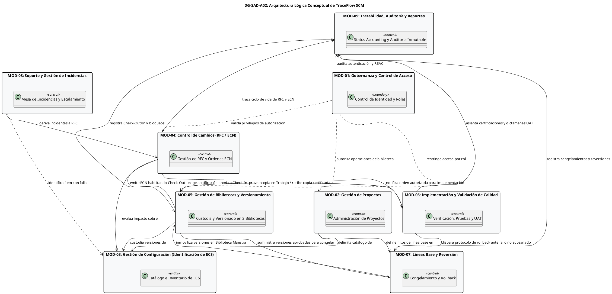
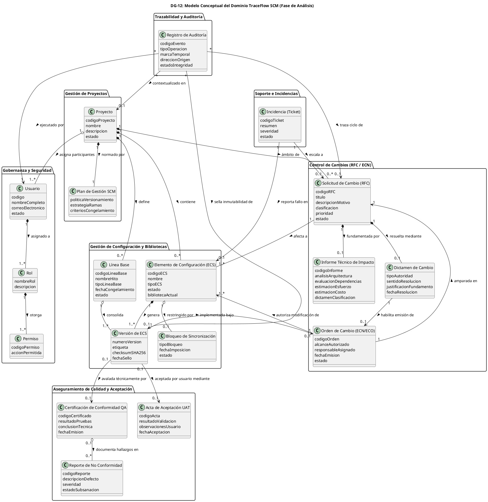

# Sistema de Gestión de Configuración de Software - TraceFlow SCM

> **Documento de Arquitectura de Software (SAD) — Fase de Análisis**  
> **Versión:** 1.1 (Baseline SAD de Análisis — Corregida y Aprobada)  
> **Fecha:** Octubre 2026  
> **Estado:** APROBADO  
> **Repositorio Oficial:** `TraceFlow`  
> **Organización Cliente:** ÉXODO S.A.C.  
> **Equipo de Desarrollo:** C-SharkTeam  

---

```
========================================================================================
                      UNIVERSIDAD PRIVADA DE TACNA
                         FACULTAD DE INGENIERÍA
              ESCUELA PROFESIONAL DE INGENIERÍA DE SISTEMAS

        "Sistema de Gestión de Configuración de Software - TraceFlow SCM"
              DOCUMENTO DE ARQUITECTURA DE SOFTWARE (SAD)
                           FASE DE ANÁLISIS

    Curso:   Gestión de la Configuración de Software
    Docente: Dr. RICARDO EDUARDO VALCARCEL ALVARADO

    Autores (C-SharkTeam):
      - ANTAYHUA MAMANI, Renzo Antonio       (2022073504)
      - MEDINA QUISPE, Joan Cristian         (2022074255)
      - LOYOLA VILCA CHOQUE, Renzo Fernando  (2021072615)
      - RIVERA MUÑOZ, Augusto Joaquin        (2022073505)

                               TACNA – PERÚ
                                   2026
========================================================================================
```

---

## Control de Versiones

| Versión | Hecha por | Revisada por | Aprobada por | Fecha | Motivo |
| :---: | :--- | :--- | :--- | :---: | :--- |
| **1.0** | C-SharkTeam (JCM / RAA / RFL / AJR) | Dr. Ricardo Valcarcel Alvarado | Dr. Ricardo Valcarcel Alvarado | 01/10/2026 | Emisión formal y congelamiento de la Baseline del SAD de Análisis (Arquitectura Conceptual y Lógica inicial). |
| **1.1** | C-SharkTeam (JCM / RAA / RFL / AJR) | Dr. Ricardo Valcarcel Alvarado | Dr. Ricardo Valcarcel Alvarado | 01/10/2026 | Corrección de coherencia y trazabilidad con Baseline SRS; normalización de 3 bibliotecas (Trabajo, Soporte, Maestra), 14 estados oficiales de RFC (TB-07), 9 RN (TB-06), 9 RNF (TB-05), retiro de métricas no normadas y preservación estricta del alcance funcional. |

---

## Índice General

- [1. Introducción](#1-introducción)
  - [1.1 Propósito del Documento](#11-propósito-del-documento)
  - [1.2 Alcance del Sistema](#12-alcance-del-sistema)
  - [1.3 Relación con el SRS de Análisis (Baseline de Requerimientos)](#13-relación-con-el-srs-de-análisis-baseline-de-requerimientos)
  - [1.4 Definiciones, Acrónimos y Abreviaturas](#14-definiciones-acrónimos-y-abreviaturas)
  - [1.5 Referencias Documentales y Normativas](#15-referencias-documentales-y-normativas)
- [2. Drivers Arquitectónicos](#2-drivers-arquitectónicos)
  - [2.1 Drivers Funcionales (RF-01 a RF-18)](#21-drivers-funcionales-rf-01-a-rf-18)
  - [2.2 Drivers de Calidad (RNF-01 a RNF-09)](#22-drivers-de-calidad-rnf-01-a-rnf-09)
- [3. Vista de Contexto Arquitectónico](#3-vista-de-contexto-arquitectónico)
  - [3.1 Contexto del Sistema Frente a su Entorno Operativo](#31-contexto-del-sistema-frente-a-su-entorno-operativo)
  - [3.2 Frontera del Sistema y los 7 Actores Canónicos](#32-frontera-del-sistema-y-los-7-actores-canónicos)
  - [3.3 TraceFlow SCM como Núcleo de Gobernanza y Gestión](#33-traceflow-scm-como-núcleo-de-gobernanza-y-gestión)
  - [3.4 Diagrama DG-SAD-A01: Contexto Arquitectónico de TraceFlow SCM](#34-diagrama-dg-sad-a01-contexto-arquitectónico-de-traceflow-scm)
- [4. Arquitectura Lógica de Análisis](#4-arquitectura-lógica-de-análisis)
  - [4.1 Criterios de Descomposición Modular Conceptual](#41-criterios-de-descomposición-modular-conceptual)
  - [4.2 Catálogo de los 9 Módulos Arquitectónicos Conceptuales](#42-catálogo-de-los-9-módulos-arquitectónicos-conceptuales)
  - [4.3 Diagrama DG-SAD-A02: Arquitectura Lógica Conceptual de TraceFlow SCM](#43-diagrama-dg-sad-a02-arquitectura-lógica-conceptual-de-traceflow-scm)
  - [4.4 Dependencias e Interacciones entre Módulos Conceptuales](#44-dependencias-e-interacciones-entre-módulos-conceptuales)
- [5. Responsabilidades Arquitectónicas](#5-responsabilidades-arquitectónicas)
  - [5.1 MOD-01: Gobernanza y Control de Acceso (Usuarios y Roles)](#51-mod-01-gobernanza-y-control-de-acceso-usuarios-y-roles)
  - [5.2 MOD-02: Gestión de Proyectos](#52-mod-02-gestión-de-proyectos)
  - [5.3 MOD-03: Gestión de Configuración (Identificación de ECS)](#53-mod-03-gestión-de-configuración-identificación-de-ecs)
  - [5.4 MOD-04: Control de Cambios (RFC, Evaluación y ECN/ECO)](#54-mod-04-control-de-cambios-rfc-evaluación-y-ecneco)
  - [5.5 MOD-05: Gestión de Bibliotecas y Versionamiento](#55-mod-05-gestión-de-bibliotecas-y-versionamiento)
  - [5.6 MOD-06: Implementación y Validación de Calidad (Testing y Aceptación)](#56-mod-06-implementación-y-validación-de-calidad-testing-y-aceptación)
  - [5.7 MOD-07: Líneas Base y Reversión (Rollback y Cancelación)](#57-mod-07-líneas-base-y-reversión-rollback-y-cancelación)
  - [5.8 MOD-08: Soporte y Gestión de Incidencias](#58-mod-08-soporte-y-gestión-de-incidencias)
  - [5.9 MOD-09: Trazabilidad, Auditoría y Reportes (Status Accounting)](#59-mod-09-trazabilidad-auditoría-y-reportes-status-accounting)
- [6. Vista Conceptual del Dominio](#6-vista-conceptual-del-dominio)
  - [6.1 Integración del Modelo Conceptual del Dominio (DG-12)](#61-integración-del-modelo-conceptual-del-dominio-dg-12)
  - [6.2 Matriz Entidad del Dominio -> Módulo Responsable -> Módulos Consumidores](#62-matriz-entidad-del-dominio---módulo-responsable---módulos-consumidores)
  - [6.3 Reglas de Integridad y Consistencia Conceptual del Dominio](#63-reglas-de-integridad-y-consistencia-conceptual-del-dominio)
- [7. Vista del Proceso de Gestión de Cambios (TO-BE v2)](#7-vista-del-proceso-de-gestión-de-cambios-to-be-v2)
  - [7.1 Orquestación Arquitectónica del Flujo TO-BE v2 (DG-03)](#71-orquestación-arquitectónica-del-flujo-to-be-v2-dg-03)
  - [7.2 Ciclo de Vida de la RFC y Transiciones de Estado (DG-11 / TB-07)](#72-ciclo-de-vida-de-la-rfc-y-transiciones-de-estado-dg-11--tb-07)
  - [7.3 Matriz Fase del Proceso -> Módulo Arquitectónico -> Casos de Uso](#73-matriz-fase-del-proceso---módulo-arquitectónico---casos-de-uso)
- [8. Seguridad y Control de Acceso Conceptual](#8-seguridad-y-control-de-acceso-conceptual)
  - [8.1 Modelo Conceptual RBAC y Privilegios](#81-modelo-conceptual-rbac-y-privilegios)
  - [8.2 Matriz de Segregación de Funciones (SoD)](#82-matriz-de-segregación-de-funciones-sod)
  - [8.3 Mecanismos Conceptuales de No-Repudio y Trazabilidad](#83-mecanismos-conceptuales-de-no-repudio-y-trazabilidad)
  - [8.4 Declaración de Desacoplamiento Tecnológico](#84-declaración-de-desacoplamiento-tecnológico)
- [9. Gestión Conceptual de Información y Configuración](#9-gestión-conceptual-de-información-y-configuración)
  - [9.1 Jerarquía Estructural del Sistema SCM](#91-jerarquía-estructural-del-sistema-scm)
  - [9.2 Modelo Conceptual de Bloqueos de Sincronización y Exclusión Mutua](#92-modelo-conceptual-de-bloqueos-de-sincronización-y-exclusión-mutua)
  - [9.3 Modelo de Ciclo de Vida y Trazabilidad de RFC y ECN/ECO](#93-modelo-de-ciclo-de-vida-y-trazabilidad-de-rfc-y-ecneco)
  - [9.4 Modelo Conceptual de Registro de Auditoría Inmutable (Append-Only)](#94-modelo-conceptual-de-registro-de-auditoría-inmutable-append-only)
  - [9.5 Declaración de Desacoplamiento de Esquemas Físicos y Bases de Datos](#95-declaración-de-desacoplamiento-de-esquemas-físicos-y-bases-de-datos)
- [10. Escenarios Arquitectónicos de Calidad](#10-escenarios-arquitectónicos-de-calidad)
  - [10.1 Especificación Formal de Escenarios de Calidad (RNF-01 a RNF-09)](#101-especificación-formal-de-escenarios-de-calidad-rnf-01-a-rnf-09)
  - [10.2 Análisis de Compensaciones (Trade-Offs) Arquitectónicos](#102-análisis-de-compensaciones-trade-offs-arquitectónicos)
- [11. Restricciones y Principios Arquitectónicos](#11-restricciones-y-principios-arquitectónicos)
  - [11.1 Principios Rectores de la Arquitectura](#111-principios-rectores-de-la-arquitectura)
  - [11.2 Restricciones del Negocio vs Decisiones Técnicas Diferidas](#112-restricciones-del-negocio-vs-decisiones-técnicas-diferidas)
- [12. Matriz de Trazabilidad Arquitectónica y Auditoría de Conceptos](#12-matriz-de-trazabilidad-arquitectónica-y-auditoría-de-conceptos)
  - [12.1 Matriz Integral: Módulo | RF | RNF | RN | CU | Entidades DG-12](#121-matriz-integral-módulo--rf--rnf--rn--cu--entidades-dg-12)
  - [12.2 Auditoría de Conceptos del SAD](#122-auditoría-de-conceptos-del-sad)
- [13. Decisiones Diferidas a la Fase de Diseño](#13-decisiones-diferidas-a-la-fase-de-diseño)
  - [13.1 Catálogo de Decisiones Posteriores (Frontend, Backend, DB, APIs, Despliegue)](#131-catálogo-de-decisiones-posteriores-frontend-backend-db-apis-despliegue)
  - [13.2 Dictamen Formal de Obsolescencia de DG-13 para la Fase de Análisis](#132-dictamen-formal-de-obsolescencia-de-dg-13-para-la-fase-de-análisis)
- [14. Auditoría de Coherencia SRS ↔ SAD y Aprobación de Baseline](#14-auditoría-de-coherencia-srs--sad-y-aprobación-de-baseline)
  - [14.1 Matriz de Coherencia Integral SRS ↔ SAD](#141-matriz-de-coherencia-integral-srs--sad)
  - [14.2 Matriz de Verificación contra Criterios de Calidad Arquitectónica](#142-matriz-de-verificación-contra-criterios-de-calidad-arquitectónica)
  - [14.3 Declaración Formal de Aprobación (BASELINE SAD DE ANÁLISIS v1.1)](#143-declaración-formal-de-aprobación-baseline-sad-de-análisis-v11)

---

# 1. Introducción

### 1.1 Propósito del Documento
El presente **Documento de Arquitectura de Software (SAD) — Fase de Análisis** tiene como propósito fundamental establecer la estructura lógica, conceptual y funcional del sistema **TraceFlow SCM**, traduciendo los requerimientos funcionales, no funcionales y las reglas de negocio formalizados en la **Baseline de Requerimientos de Software (SRS)** en una organización modular coherente y rigurosa.

Este documento opera en el nivel de **ANÁLISIS DE SISTEMAS**:
1. Modela los límites conceptuales del sistema, los subsistemas intervinientes, las responsabilidades arquitectónicas y las colaboraciones lógicas entre módulos.
2. Garantiza la neutralidad e independencia tecnológica, abstrayéndose deliberadamente de decisiones de implementación física, marcos de trabajo (frameworks), esquemas relacionales de bases de datos o protocolos de red específicos.
3. Sirve como puente formal y vinculante entre el análisis funcional de requerimientos (`FD03-EPIS-Informe_SRS.md`) y el posterior Documento de Arquitectura de Software de Diseño (SAD de Diseño), preservando la trazabilidad bidireccional estricta en cada una de sus definiciones.

### 1.2 Alcance del Sistema
**TraceFlow SCM** es un sistema integral de Gestión de Configuración de Software (Software Configuration Management) diseñado para gobernar, automatizar y auditar el ciclo de vida de los activos de software desarrollados por la organización **C-SharkTeam** para el entorno empresarial de **ÉXODO S.A.C.**.

El alcance del sistema en la fase de análisis comprende nueve capacidades conceptuales esenciales:
- **Gobernanza y Control de Acceso:** Gestión centralizada de identidades de usuarios, roles institucionales y perfiles de permisos bajo el principio de menor privilegio y segregación de funciones (SoD).
- **Gestión de Proyectos:** Delimitación de proyectos de desarrollo, parámetros SCM y asignación formal de participantes.
- **Identificación y Registro de ECS:** Catalogación, metadatos y clasificación de Elementos de Configuración de Software (código fuente, documentación, scripts, modelos).
- **Control Formal de Cambios:** Captura de Solicitudes de Cambio (RFC), análisis de impacto técnico, bifurcación para cambios menores/mayores, evaluación por el Comité de Control de Cambios (CCB) y emisión de Órdenes de Cambio de Ingeniería (ECN/ECO).
- **Gestión de Bibliotecas Escalonadas y Versionamiento:** Custodia de ítems de configuración a través de tres entornos lógicos controlados (**Biblioteca de Trabajo**, **Biblioteca de Soporte** y **Biblioteca Maestra**), operaciones de extracción (Check-Out) y retorno (Check-In), junto con bloqueos de sincronización.
- **Implementación y Validación de Calidad:** Aislamiento de modificaciones en espacios de trabajo, ejecución de pruebas unitarias locales, pruebas de integración en Biblioteca de Soporte, emisión de Certificaciones de Calidad por QA, gestión de no conformidades y validación final de aceptación por el usuario (UAT).
- **Líneas Base y Recuperación ante Desastres:** Definición, consolidación y congelamiento inmutable de Líneas Base en la Biblioteca Maestra o de Soporte, así como la ejecución de protocolos seguros de reversión (Rollback) y cancelación de órdenes.
- **Soporte y Gestión de Incidencias:** Captura de reportes operacionales de fallos, seguimiento de tickets y escalamiento estructurado hacia solicitudes de cambio formales.
- **Trazabilidad, Auditoría y Contabilidad del Estado (Status Accounting):** Verificación matemática de integridad mediante firmas hash SHA-256, bitácora cronológica inviolable (append-only) y generación de reportes consolidados del estado de la configuración.

### 1.3 Relación con el SRS de Análisis (Baseline de Requerimientos)
El SAD de Análisis se sustenta de manera directa y subordinada en el documento **`FD03-EPIS-Informe_SRS.md`**, el cual ha sido formalmente cerrado y congelado como **BASELINE DE ANÁLISIS**. Cada módulo, responsabilidad y escenario arquitectónico responde inequívocamente a los artefactos canónicos del SRS:
- Los **18 Requerimientos Funcionales (`RF-01` a `RF-18`)** catalogados en `docs/TABLES.md` (`TB-04`).
- Los **9 Requerimientos No Funcionales (`RNF-01` a `RNF-09`)** catalogados en `docs/TABLES.md` (`TB-05`).
- Las **9 Reglas de Negocio (`RN-01` a `RN-09`)** catalogadas en `docs/TABLES.md` (`TB-06`).
- Los **31 Casos de Uso (`CU-01` a `CU-30` y `CU-04.1`)** catalogados en `docs/TABLES.md` (`TB-10`).
- El **Modelo Conceptual del Dominio (`DG-12`)** y los **31 Diagramas de Análisis de Objetos BCE (`DG-AO-01` a `DG-AO-30` y `DG-AO-04.1`)**.

Cualquier discrepancia o ambigüedad detectada durante la elaboración del presente documento fue resuelta aplicando la jerarquía normativa fijada en `docs/DOCUMENTATION_RULES.md` Sección 3, manteniendo a `docs/TABLES.md` y `docs/DIAGRAMS.md` como las Fuentes Únicas de Verdad (SSOT).

### 1.4 Definiciones, Acrónimos y Abreviaturas
A continuación se definen los términos técnicos normativos empleados a lo largo del documento:

| Acrónimo / Término | Definición Conceptual |
| :--- | :--- |
| **BCE** | *Boundary-Control-Entity*: Patrón de análisis que segrega las clases conceptuales en Fronteras (interacción externa), Controles (lógica del caso de uso) y Entidades (datos del dominio). |
| **Biblioteca de Soporte** | Entorno controlado donde residen las versiones intermedias, candidatas a integración y sujetas a pruebas de QA y validación UAT (`TB-04`, `TB-06`). |
| **Biblioteca de Trabajo** | Entorno aislado y privado asignado al Desarrollador para implementar modificaciones autorizadas sobre una copia del ECS extraída mediante Check-Out. |
| **Biblioteca Maestra** | Entorno formal de máxima custodia donde residen las versiones definitivas, certificadas y congeladas en Líneas Base. |
| **CCB** | *Configuration Control Board* (Comité de Control de Cambios): Órgano colegiado con autoridad exclusiva para evaluar y dictaminar Cambios Mayores en el sistema. |
| **Check-In** | Operación conceptual de ingreso y promoción de un ECS validado desde la Biblioteca de Trabajo hacia la Biblioteca de Soporte o Maestra (`CU-12`). |
| **Check-Out** | Operación conceptual de extracción autorizada de una copia de trabajo de un ECS custodiado en Soporte o Maestra hacia la Biblioteca de Trabajo (`CU-10`). |
| **ECN / ECO** | *Engineering Change Notice / Engineering Change Order*: Notificación u orden formal vinculante que autoriza técnicamente la modificación de uno o más ECS. |
| **ECS** | *Elemento de Configuración de Software*: Unidad atómica o agregada de software sujeta a control de versiones, identificación formal y trazabilidad. |
| **Línea Base** | Especificación o producto de configuración que ha sido formalmente revisado y acordado, sirviendo de base inmutable para el desarrollo posterior. |
| **RBAC** | *Role-Based Access Control*: Mecanismo conceptual de control de acceso fundamentado en roles asignados y privilegios explícitos. |
| **RFC** | *Request for Change* (Solicitud de Cambio): Documento formal inicial mediante el cual un interesado solicita una modificación, corrección o mejora. |
| **Rollback** | Protocolo conceptual de reversión mediante el cual se desestima el cambio en Trabajo y se restablece el estado de un ECS a su versión estable previa (`CU-21`). |
| **SAD** | *Software Architecture Document*: Documento de Arquitectura de Software. |
| **SCM** | *Software Configuration Management*: Gestión de la Configuración de Software según lineamientos IEEE Std 828 e ISO/IEC/IEEE 12207. |
| **SHA-256** | *Secure Hash Algorithm 256-bit*: Función resumen criptográfica utilizada para certificar la integridad matemática e inmutabilidad de los ECS. |
| **SoD** | *Segregation of Duties* (Segregación de Funciones): Principio de control interno que impide que una misma persona ejecute acciones incompatibles (ej. desarrollar y certificar). |
| **Status Accounting** | Contabilidad del estado de la configuración: Registro y reporte formal del estado de los ECS, solicitudes de cambio y líneas base en todo momento. |
| **UAT** | *User Acceptance Testing*: Pruebas de aceptación formal conducidas por el Solicitante/Usuario final para validar la conformidad de la entrega (`CU-29`). |
| **WORM** | *Write Once, Read Many*: Principio conceptual de persistencia lógica donde los registros de auditoría se insertan cronológicamente y no admiten modificación ni eliminación. |

### 1.5 Referencias Documentales y Normativas
- **IEEE Std 830-1998:** *IEEE Recommended Practice for Software Requirements Specifications.*
- **ISO/IEC/IEEE 42010:2011 / 2022:** *Systems and software engineering — Architecture description.*
- **ISO/IEC/IEEE 12207:2017:** *Systems and software engineering — Software life cycle processes.*
- **IEEE Std 828-2012:** *Standard for Configuration Management in Systems and Software Engineering.*
- **CMMI-DEV v2.0:** *Capability Maturity Model Integration — Configuration Management (CM) & Process and Product Quality Assurance (PPQA).*
- **FD01-EPIS-Informe_Factibilidad_v2.md:** *Informe de Factibilidad Técnica, Operativa y Económica del Proyecto TraceFlow SCM.*
- **FD03-EPIS-Informe_SRS.md:** *Documento Maestro de Especificación de Requerimientos de Software (Baseline de Análisis).*
- **docs/DOCUMENTATION_RULES.md:** *Reglas de Gobernanza Documental y Marco Normativo de Trazabilidad.*
- **docs/TABLES.md:** *Catálogo Centralizado de Tablas Maestras y Matrices de Trazabilidad (SSOT).*
- **docs/DIAGRAMS.md:** *Catálogo Centralizado de Diagramas PlantUML (SSOT).*

---

# 2. Drivers Arquitectónicos

Los drivers arquitectónicos son los requerimientos y fuerzas motrices que moldean decisivamente la estructura, la modularidad y el comportamiento lógico del sistema. Se clasifican en **Drivers Funcionales** y **Drivers de Calidad**, tomados literalmente de `docs/TABLES.md` (`TB-04` y `TB-05`).

### 2.1 Drivers Funcionales (RF-01 a RF-18)
Los 18 Requerimientos Funcionales obligatorios aprobados en el SRS impactan directamente en las decisiones de diseño conceptual del sistema:

| ID | Nombre Oficial (`TB-04`) | Descripción del Requerimiento Funcional | Impacto Estructural en la Arquitectura Conceptual |
| :---: | :--- | :--- | :--- |
| **RF-01** | Gestión de Usuarios y Roles | Registrar usuarios y asignar roles del flujo de cambios, restringiendo acciones según rol. | Impone un subsistema transversal de Gobernanza y Control de Acceso con modelo RBAC estricto y segregación de funciones (SoD). |
| **RF-02** | Gestión de Proyectos | Crear y administrar múltiples proyectos de clientes de ÉXODO S.A.C. de forma aislada entre sí. | Exige que la entidad Proyecto sea la raíz de agregación lógica del sistema; todo ECS, RFC y Línea Base pertenece a un proyecto. |
| **RF-03** | Identificación de ECS | Registrar y clasificar los Elementos de Configuración (código, documentos, esquemas de BD) de cada proyecto. | Demanda un catálogo formal de inventario de configuración con tipificación estricta y metadatos unívocos. |
| **RF-04** | Registro de Solicitudes de Cambio (RFC) | Registrar Solicitud de Cambio (descripción, justificación, prioridad, ECS, fecha) y permitir subsanación si la información es incompleta. | Establece la compuerta formal de entrada para toda mutación en el sistema y el subflujo de subsanación (`CU-04.1`). |
| **RF-05** | Clasificación y Análisis de Impacto | Registrar análisis de impacto técnico (arquitectura, dependencias, riesgos, esfuerzo, tiempo, costo, Triple Restricción) y emitir dictamen de clasificación Menor/Mayor. | Introduce lógica de evaluación técnica y bifurcación condicional basada en el análisis de impacto técnico. |
| **RF-06** | Evaluación y Aprobación de Cambios Mayores por el CCB | El CCB evalúa colegiadamente solicitudes clasificadas como Cambios Mayores, delibera viabilidad, registra votación y aprueba o rechaza con acta formal. | Demanda soporte para deliberación colegiada, registro de resoluciones y dictámenes formales del CCB. |
| **RF-07** | Gestión y Emisión de Órdenes de Cambio (ECN/ECO) | Generar y formalizar la Orden de Cambio (ECN/ECO) tras autorización (por CCB para Mayor o delegada compartida para Menor), actualizando el plan del proyecto. | Exige la formalización de una credencial operativa vinculante (ECN/ECO) que actúe como requisito previo para la modificación. |
| **RF-08** | Gestión de Bibliotecas de Software | Administrar al menos tres bibliotecas por proyecto (Trabajo, Soporte y Maestra), permitiendo mover un ECS mediante Check-Out y Check-In. | Impone la partición lógica de los activos de configuración en tres bibliotecas estructuradas: Trabajo, Soporte y Maestra. |
| **RF-09** | Control de Versiones y Bloqueos de Sincronización | Registrar Check-in/Check-out con autor, fecha y descripción, y aplicar/liberar bloqueos de sincronización que impidan edición concurrente en Trabajo. | Exige mecanismos de concurrencia pesimista (bloqueo exclusivo de sincronización) para impedir colisiones de edición. |
| **RF-10** | Gestión de Pruebas, Certificación QA y Aceptación del Usuario | Registrar pruebas de integración y certificación técnica por QA, y pruebas de aceptación con Acta formal suscrita por el Solicitante previo a la liberación. | Requiere doble compuerta de validación independiente: técnica por QA y funcional por el Solicitante/Usuario Final (UAT). |
| **RF-11** | Reevaluación y Re-testeo | Registrar ciclos de corrección de defectos y re-testeo sobre un cambio no conforme, hasta certificación o agotar reintentos. | Demanda soporte para bucles de corrección y verificación controlada ante no conformidades reportadas por QA. |
| **RF-12** | Rollback y Cancelación de Órdenes de Cambio | Ejecutar rollback del ECS en Biblioteca de Trabajo y cancelar la Orden de Cambio ante fallo no superado en re-test o rechazo insubsanable en UAT. | Exige un mecanismo de contingencia para desestimar versiones defectuosas en Trabajo, restaurar la versión estable y cancelar la ECN. |
| **RF-13** | Gestión de Líneas Base | Crear y congelar líneas base a partir de un ECS verificado al momento del Check-In a Biblioteca Maestra/Soporte, tras certificación QA y aceptación UAT. | Impone la capacidad de consolidar y sellar como inmutables conjuntos coherentes de versiones de ECS en hitos del proyecto. |
| **RF-14** | Cierre Formal del Cambio y Notificaciones | Registrar cierre formal bajo 4 estados terminales (Implementada, Rechazada, Cancelada o Desestimada), consolidar trazabilidad y notificar. | Requiere consolidación de expediente histórico y notificación formal tras alcanzar el estado de cierre definitivo. |
| **RF-15** | Gestión de Incidencias y Soporte | Registrar, dar seguimiento y derivar incidencias reportadas por consultores o clientes hacia una nueva Solicitud de Cambio. | Demanda una mesa de servicio que capture fallos operacionales y permita su escalamiento directo a una RFC formal. |
| **RF-16** | Trazabilidad de Configuración | Visualizar las relaciones entre los ECS, las Solicitudes de Cambio, las Órdenes de Cambio y las líneas base a lo largo del tiempo. | Demanda la capacidad de navegación bidireccional entre todos los objetos del ciclo de vida de configuración. |
| **RF-17** | Auditoría e Integridad | Registrar acciones críticas de los usuarios en cada etapa del flujo y validar la integridad mediante checksums (SHA-256). | Impone almacenamiento histórico de eventos (append-only) y verificación algorítmica de integridad matemática. |
| **RF-18** | Generación de Reportes | Generar reportes de estado del flujo de cambios, inventario de ECS y actas de cambios, con posibilidad de exportación. | Exige la consolidación analítica del estado de la configuración (Status Accounting) en tiempo real. |

### 2.2 Drivers de Calidad (RNF-01 a RNF-09)
Los 9 Requerimientos No Funcionales normativos aprobados en `docs/TABLES.md` (`TB-05`) constituyen los drivers de calidad oficiales de la arquitectura:

| ID | Atributo de Calidad (`TB-05`) | Especificación Normativa de la Baseline | Prioridad |
| :---: | :--- | :--- | :---: |
| **RNF-01** | **Seguridad** | El sistema debe utilizar protocolos de transferencia segura (HTTPS/SSH) y control de acceso basado en roles (RBAC). | Alta |
| **RNF-02** | **Disponibilidad** | El sistema debe garantizar un tiempo de actividad (uptime) del 99.9% durante los periodos críticos de proyecto. | Alta |
| **RNF-03** | **Integridad** | El sistema debe verificar la integridad de los artefactos almacenados mediante checksums (SHA-256). | Alta |
| **RNF-04** | **Usabilidad** | La interfaz debe permitir que un nuevo consultor se familiarice con el flujo de trabajo en menos de 3 horas. | Media |
| **RNF-05** | **Escalabilidad** | El sistema debe soportar más de 50 proyectos simultáneos sin degradar el rendimiento de las operaciones. | Media |
| **RNF-06** | **Rendimiento** | Las operaciones de consulta de historial o comparación de versiones no deben exceder los 3 segundos de respuesta. | Baja |
| **RNF-07** | **Compatibilidad** | El sistema debe ser compatible con entornos de desarrollo de uso común (Visual Studio Code, IntelliJ IDEA, Android Studio). | Alta |
| **RNF-08** | **Mantenibilidad** | La arquitectura debe permitir actualizaciones y parches sin requerir la detención total del servicio. | Media |
| **RNF-09** | **Respaldo** | El sistema debe programar copias de seguridad automáticas diarias del repositorio central. | Alta |

> [!IMPORTANT]
> **Norma de Coherencia de Métricas:**
> La arquitectura conceptual respeta estrictamente los umbrales numéricos definidos en `TB-05` (99.9% uptime en periodos críticos, < 3 horas de familiarización, > 50 proyectos simultáneos, <= 3 segundos en consultas de historial/comparación y copias automáticas diarias). Todo parámetro de rendimiento transaccional adicional, volumetría de transacciones o dimensionamiento de concurrencia no especificado en el SRS se declara formalmente como **`[PENDIENTE DE DEFINICIÓN EN DISEÑO]`**.

---

# 3. Vista de Contexto Arquitectónico

### 3.1 Contexto del Sistema Frente a su Entorno Operativo
El sistema **TraceFlow SCM** actúa como el núcleo orquestador de la disciplina de Gestión de Configuración de Software en la empresa cliente **ÉXODO S.A.C.**, articulando la interacción entre los diferentes roles organizacionales que intervienen en el desarrollo, mantenimiento, aseguramiento de la calidad y gobierno de proyectos de software.

TraceFlow SCM no sustituye las herramientas de desarrollo local (como editores de código o compiladores), sino que establece la gobernanza, las compuertas de calidad, la inmutabilidad de los repositorios y la trazabilidad de extremo a extremo requerida por estándares internacionales como CMMI-DEV e ISO/IEC/IEEE 12207.

### 3.2 Frontera del Sistema y los 7 Actores Canónicos
La frontera del sistema delimita estrictamente las funciones provistas por **TraceFlow SCM** frente a las responsabilidades operadas por actores humanos externos.

Se han formalizado **7 Actores Canónicos** (`TB-09`), eliminando cualquier figura genérica o ambigua:
1. **Solicitante (`PU-01`):** Interesado o usuario que identifica una necesidad de cambio o fallo operativo, registra y subsana solicitudes de cambio (RFC), reporta incidencias y emite la validación de aceptación funcional final (UAT).
2. **Analista de Requerimientos / Gestor (`PU-02`):** Responsable funcional que crea y administra proyectos, realiza la revisión preliminar de solicitudes (validación y clasificación), co-autoriza Cambios Menores y deriva incidencias a RFC.
3. **Arquitecto / Especialista Técnico (`PU-03`):** Responsable técnico que cataloga y clasifica nuevos ECS, efectúa el análisis de impacto técnico multidisciplinario y co-autoriza Cambios Menores bajo autoridad delegada.
4. **Comité de Control de Cambios (CCB) (`PU-04`):** Órgano colegiado de máxima autoridad que delibera, aprueba o rechaza Cambios Mayores, emite las Órdenes de Cambio correspondientes (ECN/ECO) y audita la trazabilidad integral.
5. **Administrador de Configuración / Bibliotecario (`PU-05`):** Custodio operativo de los repositorios SCM; gestiona identidades y roles RBAC, administra las tres bibliotecas (Trabajo, Soporte, Maestra), aplica y libera bloqueos de sincronización, ejecuta Check-Out y Check-In, congela Líneas Base, ejecuta reversiones (Rollback), cancela ECNs y valida la integridad SHA-256.
6. **Ingeniero de Software / Desarrollador (`PU-06`):** Encargado técnico de implementar las modificaciones autorizadas en la Biblioteca de Trabajo y verificar su correcto funcionamiento mediante pruebas unitarias locales previas a la entrega.
7. **Equipo de Calidad / Testing (`PU-07`):** Entidad de aseguramiento independiente que ejecuta pruebas de integración sobre los cambios implementados desplegados en la Biblioteca de Soporte, emite Certificaciones de Calidad aprobatorias o elabora Reportes de No Conformidad para reprocesamiento.

### 3.3 TraceFlow SCM como Núcleo de Gobernanza y Gestión
En concordancia con las normas de modelado UML y los lineamientos de auditoría de cierre del SRS:
- **TraceFlow SCM es el sistema bajo estudio y NO un actor externo.**
- El sistema es la entidad central encargada de procesar las peticiones, verificar las precondiciones y reglas de negocio, transformar el estado de los objetos del dominio y resguardar la inmutabilidad de la información.
- No se permiten en los modelos actores espurios como *"Sistema TraceFlow SCM"* o *"Sistema de Pruebas Unitarias"*.

### 3.4 Diagrama DG-SAD-A01: Contexto Arquitectónico de TraceFlow SCM
A continuación se presenta el diagrama conceptual de contexto que modela la frontera del sistema y los flujos de interacción con los 7 actores canónicos:

```plantuml
@startuml DG-SAD-A01
skinparam shadowing false
skinparam roundcorner 8
skinparam defaultFontName Arial
skinparam sequenceMessageAlign center

title <b>DG-SAD-A01: Contexto Arquitectónico de TraceFlow SCM (Fase de Análisis)</b>

actor "Solicitante" as ACT_SOL
actor "Analista de Requerimientos\n/ Gestor" as ACT_ANA
actor "Arquitecto\n/ Especialista Técnico" as ACT_ARQ
actor "Comité de Control\nde Cambios (CCB)" as ACT_CCB
actor "Administrador de Configuración\n/ Bibliotecario" as ACT_ADM
actor "Ingeniero de Software\n/ Desarrollador" as ACT_DEV
actor "Equipo de Calidad\n/ Testing" as ACT_QA

rectangle "TraceFlow SCM\n(Sistema de Gestión de Configuración de Software)" as SYS #E8F0FE {
    rectangle "Gobernanza y Control de Acceso" as SUB_GOB
    rectangle "Gestión de Proyectos y ECS" as SUB_PROJ
    rectangle "Control de Cambios (RFC / ECN)" as SUB_CHG
    rectangle "Gestión de Bibliotecas y Versionamiento" as SUB_LIB
    rectangle "Implementación, QA y Aceptación (UAT)" as SUB_QA
    rectangle "Trazabilidad, Auditoría y Reportes" as SUB_AUD
}

' Interacciones de Actores Canónicos
ACT_SOL --> SUB_CHG : "Registra RFC y subsana datos (CU-04, CU-04.1)"
ACT_SOL --> SUB_QA : "Valida aceptación funcional UAT (CU-29)"
ACT_SOL --> SUB_AUD : "Registra incidencias y consulta estado (CU-23, CU-24)"

ACT_ANA --> SUB_PROJ : "Crea y administra proyectos (CU-02, CU-03)"
ACT_ANA --> SUB_CHG : "Valida y clasifica solicitudes (CU-05)"
ACT_ANA --> SUB_CHG : "Co-autoriza Cambios Menores bajo autoridad delegada (CU-30)"
ACT_ANA --> SUB_AUD : "Deriva incidencias a RFC (CU-25)"

ACT_ARQ --> SUB_PROJ : "Registra y clasifica nuevos ECS (CU-09)"
ACT_ARQ --> SUB_CHG : "Realiza análisis de impacto técnico (CU-06)"
ACT_ARQ --> SUB_CHG : "Co-autoriza Cambios Menores bajo autoridad delegada (CU-30)"

ACT_CCB --> SUB_CHG : "Evalúa y aprueba/rechaza Cambios Mayores (CU-07)"
ACT_CCB --> SUB_CHG : "Emite Órdenes de Cambio mayores ECN/ECO (CU-08)"
ACT_CCB --> SUB_AUD : "Audita acciones y trazabilidad integral (CU-27)"

ACT_ADM --> SUB_GOB : "Gestiona usuarios, roles y permisos RBAC (CU-01)"
ACT_ADM --> SUB_LIB : "Opera Check-Out y Check-In entre bibliotecas (CU-10, CU-12)"
ACT_ADM --> SUB_LIB : "Aplica y libera bloqueos de sincronización (CU-11)"
ACT_ADM --> SUB_LIB : "Congela Líneas Base y ejecuta Rollback (CU-20, CU-21, CU-22)"
ACT_ADM --> SUB_AUD : "Valida integridad SHA-256 y genera reportes (CU-26, CU-28)"

ACT_DEV --> SUB_QA : "Implementa cambios autorizados en Trabajo (CU-14)"
ACT_DEV --> SUB_QA : "Ejecuta pruebas unitarias locales (CU-15)"

ACT_QA --> SUB_QA : "Ejecuta pruebas de integración (CU-16)"
ACT_QA --> SUB_QA : "Certifica conformidad del cambio (CU-17)"
ACT_QA --> SUB_QA : "Reporta no conformidades y re-testea (CU-18, CU-19)"

@enduml
```



---

# 4. Arquitectura Lógica de Análisis

### 4.1 Criterios de Descomposición Modular Conceptual
La arquitectura lógica de análisis de **TraceFlow SCM** ha sido diseñada aplicando los principios fundamentales de la ingeniería de software clásica:
1. **Alta Cohesión:** Cada módulo agrupa funciones, procesos y datos estrechamente relacionados que responden a una misma competencia del ciclo de vida SCM.
2. **Bajo Acoplamiento:** Los módulos se comunican exclusivamente a través de contratos conceptuales explícitos (solicitudes, identificadores de objetos e intercambio de estados), minimizando dependencias directas o bidireccionales cruzadas.
3. **Principio de Responsabilidad Única (SRP):** Cada subsistema tiene una única razón de cambio bien definida en el dominio del negocio.
4. **Segregación de Funciones (SoD):** La estructura modular garantiza que los componentes responsables de emitir órdenes (Control de Cambios), ejecutarlas (Implementación), custodiarlas (Bibliotecas) y validarlas (Calidad) estén conceptualmente separados.

### 4.2 Catálogo de los 9 Módulos Arquitectónicos Conceptuales
La descomposición modular consolida **9 Módulos Arquitectónicos Conceptuales**, unificando la gobernanza y la gestión de usuarios en un único subsistema coherente para evitar fragmentación:

| Módulo | Nombre Oficial | Dominio Conceptual | RF Cubiertos (`TB-04`) | Casos de Uso (`TB-10`) |
| :---: | :--- | :--- | :---: | :--- |
| **MOD-01** | Gobernanza y Control de Acceso | Identidades, roles, permisos RBAC y sesiones | `RF-01` | `CU-01` |
| **MOD-02** | Gestión de Proyectos | Proyectos, planes SCM y asignación de participantes | `RF-02` | `CU-02`, `CU-03` |
| **MOD-03** | Gestión de Configuración (Identificación de ECS) | Inventario, catálogo, tipificación y relaciones de ECS | `RF-03` | `CU-09` |
| **MOD-04** | Control de Cambios (RFC / ECN) | Captura de RFC, análisis de impacto, aprobación y emisión de ECN | `RF-04`, `RF-05`, `RF-06`, `RF-07`, `RF-14` | `CU-04`, `CU-04.1`, `CU-05`, `CU-06`, `CU-07`, `CU-08`, `CU-30` |
| **MOD-05** | Gestión de Bibliotecas y Versionamiento | Custodia en 3 bibliotecas (Trabajo, Soporte, Maestra), extracción, retorno y bloqueos | `RF-08`, `RF-09` | `CU-10`, `CU-11`, `CU-12`, `CU-13` |
| **MOD-06** | Implementación y Validación de Calidad | Desarrollo en Trabajo, pruebas unitarias, integración en Soporte, QA y UAT | `RF-10`, `RF-11` | `CU-14`, `CU-15`, `CU-16`, `CU-17`, `CU-18`, `CU-19`, `CU-29` |
| **MOD-07** | Líneas Base y Reversión | Hitos de línea base, congelamiento, rollback y cancelación | `RF-12`, `RF-13` | `CU-20`, `CU-21`, `CU-22` |
| **MOD-08** | Soporte y Gestión de Incidencias | Captura de tickets de fallas y derivación a RFC | `RF-15` | `CU-23`, `CU-24`, `CU-25` |
| **MOD-09** | Trazabilidad, Auditoría y Reportes | Status accounting, bitácora inmutable y verificación SHA-256 | `RF-16`, `RF-17`, `RF-18` | `CU-26`, `CU-27`, `CU-28` |

### 4.3 Diagrama DG-SAD-A02: Arquitectura Lógica Conceptual de TraceFlow SCM
A continuación se reproduce el diagrama de paquetes arquitecturales `DG-SAD-A02` que ilustra los 9 módulos conceptuales y sus relaciones lógicas:



### 4.4 Dependencias e Interacciones entre Módulos Conceptuales
Las interacciones observadas en `DG-SAD-A02` responden a principios rigurosos de acoplamiento controlado:
1. **MOD-01 (Gobernanza):** Subsistema transversal consultado para validar la identidad y los privilegios RBAC del actor antes de permitir cualquier mutación (`RN-01`).
2. **MOD-02 (Proyectos):** Actúa como contenedor de alcance; ningún ECS (`MOD-03`) ni Línea Base (`MOD-07`) puede existir sin vinculación a un proyecto formal (`RF-02`).
3. **MOD-08 (Incidencias):** Interacciona con `MOD-04` al convertir una incidencia técnica en una Solicitud de Cambio formal cuando la resolución exige modificación de software (`CU-25`).
4. **MOD-04 (Control de Cambios):** Motor de gobierno; no existe modificación en `MOD-05` (Bibliotecas) ni implementación en `MOD-06` (Calidad) sin una ECN/ECO emitida válidamente (`RN-01`, `RF-07`).
5. **MOD-05 y MOD-06 (Bibliotecas e Implementación):** Ciclo colaborativo cerrado: `MOD-05` entrega copia de trabajo tras el Check-Out (`CU-10`); `MOD-06` ejecuta modificación y pruebas (unitarias, integración, QA y UAT); y `MOD-05` solo admite el Check-In final si `MOD-06` provee la doble conformidad (`RN-09`).
6. **MOD-07 (Líneas Base y Reversión):** Inmoviliza conjuntos de versiones custodiadas en `MOD-05` (`RN-04`) o ejecuta el protocolo de Rollback ante fallos no subsanados (`RN-08`).
7. **MOD-09 (Trazabilidad y Auditoría):** Receptor desacoplado que registra eventos de forma asincrónica desde todos los demás módulos (`RN-03`, `RF-17`), garantizando la observabilidad integral.

---

# 5. Responsabilidades Arquitectónicas

En esta sección se detalla la especificación rigurosa de cada uno de los 9 módulos conceptuales que componen la arquitectura de TraceFlow SCM, alineados con las tablas maestras `TB-04`, `TB-05`, `TB-06` y `TB-10`.

### 5.1 MOD-01: Gobernanza y Control de Acceso (Usuarios y Roles)
- **Identificador:** `MOD-01`
- **Nombre Oficial:** Gobernanza y Control de Acceso (Usuarios y Roles)
- **Objetivo Conceptual:** Administrar el ciclo de vida de los usuarios del sistema, sus asignaciones de roles canónicos y la verificación de permisos específicos para garantizar la seguridad de acceso y la segregación de funciones.
- **Responsabilidades Clave:**
  - Registrar, modificar el estado y custodiar los datos de identidad de los usuarios institucionales.
  - Administrar el catálogo de los 7 roles canónicos (`PU-01` a `PU-07`) y sus asociaciones de permisos de operación.
  - Validar las credenciales lógicas de acceso y gestionar el contexto de sesión de los actores (`RNF-01`).
  - Aplicar en tiempo de ejecución las políticas de autorización que garantizan que ninguna modificación se inicie sin orden válida (`RN-01`).
- **Colaboración con otros Módulos:**
  - Provee servicios de autorización y consulta de identidad a todos los módulos (`MOD-02` a `MOD-08`).
  - Emite eventos de autenticación, cambios de roles y accesos hacia `MOD-09` para registro en auditoría.
- **Casos de Uso Soportados:** `CU-01` (*Gestionar usuarios y roles*).
- **Requerimientos y Reglas Asociadas:** `RF-01`, `RNF-01`, `RN-01`.

### 5.2 MOD-02: Gestión de Proyectos
- **Identificador:** `MOD-02`
- **Nombre Oficial:** Gestión de Proyectos
- **Objetivo Conceptual:** Delimitar el ámbito administrativo, temporal y de gobernanza bajo el cual se estructuran los activos de software, gestionando múltiples proyectos aislados de clientes de ÉXODO S.A.C.
- **Responsabilidades Clave:**
  - Registrar nuevos proyectos de software definiendo código, denominación, alcance, fechas y estado operativo (`RF-02`).
  - Soportar más de 50 proyectos simultáneos de forma aislada sin degradación funcional (`RNF-05`).
  - Asociar a cada proyecto su Plan de Gestión SCM (políticas de ramas, directrices de versionado y criterios de líneas base).
  - Gestionar la asignación de usuarios institucionales a los proyectos en roles específicos.
  - Servir de raíz jerárquica para la contención de ECS, RFCs, ECNs y Líneas Base.
- **Colaboración con otros Módulos:**
  - Delimita el catálogo de configuración de `MOD-03`.
  - Provee el contexto de proyecto para la evaluación de cambios en `MOD-04` y líneas base en `MOD-07`.
  - Notifica eventos de creación y cierre de proyectos a `MOD-09`.
- **Casos de Uso Soportados:** `CU-02` (*Crear y administrar proyectos*), `CU-03` (*Consultar proyecto*).
- **Requerimientos y Reglas Asociadas:** `RF-02`, `RNF-05`, `RN-02`.

### 5.3 MOD-03: Gestión de Configuración (Identificación de ECS)
- **Identificador:** `MOD-03`
- **Nombre Oficial:** Gestión de Configuración (Identificación de ECS)
- **Objetivo Conceptual:** Proveer la identificación unívoca, clasificación taxonómica y catalogación de los Elementos de Configuración de Software (ECS) que conforman los productos de software de cada proyecto.
- **Responsabilidades Clave:**
  - Registrar formalmente nuevos ECS asignando un identificador canónico, nombre descriptivo y tipo de ítem: código fuente, documentos, esquemas de BD, scripts (`RF-03`).
  - Mantener los metadatos de configuración, dependencias lógicas y estado inicial de cada ECS.
  - Asegurar que ningún artefacto sea objeto de cambio o versionado sin estar formalmente inventariado como ECS.
- **Colaboración con otros Módulos:**
  - Pertenece jerárquicamente a un proyecto de `MOD-02`.
  - Suministra la estructura de ítems a ser evaluados por `MOD-04` en análisis de impacto técnico.
  - Es el sujeto pasivo sobre el cual operan las versiones y bibliotecas de `MOD-05`.
- **Casos de Uso Soportados:** `CU-09` (*Registrar ECS*).
- **Requerimientos y Reglas Asociadas:** `RF-03`, `RN-02`, `RN-03`.

### 5.4 MOD-04: Control de Cambios (RFC, Evaluación y ECN/ECO)
- **Identificador:** `MOD-04`
- **Nombre Oficial:** Control de Cambios (RFC, Evaluación y ECN/ECO)
- **Objetivo Conceptual:** Orquestar de extremo a extremo el flujo formal de control de cambios a través de sus 14 estados oficiales, desde la captura inicial de la solicitud hasta la emisión de la orden de cambio vinculante o su cierre formal.
- **Responsabilidades Clave:**
  - Registrar Solicitudes de Cambio (RFC) capturando descripción, justificación, prioridad, ECS y fecha (`RF-04`, `CU-04`).
  - Gestionar el flujo de subsanación de observaciones (`CU-04.1`) cuando la información esté incompleta.
  - Registrar la revisión preliminar y clasificación de la solicitud (`CU-05`).
  - Registrar el Informe Técnico de Impacto elaborado por el Arquitecto (arquitectura, dependencias, riesgos, esfuerzo, tiempo, costo, afectación de la Triple Restricción) para clasificar en Cambio Menor o Mayor (`RF-05`, `CU-06`, `RN-05`).
  - Gestionar la deliberación y dictamen del CCB para Cambios Mayores (`RF-06`, `CU-07`) o la co-autorización delegada para Cambios Menores (`CU-30`).
  - Emitir y formalizar Órdenes de Cambio de Ingeniería (ECN/ECO) (`RF-07`, `CU-08`, `RN-01`).
  - Gestionar el cierre formal del cambio bajo uno de cuatro resultados terminales (`RF-14`, `RN-07`): Implementada, Rechazada, Cancelada o Desestimada.
- **Colaboración con otros Módulos:**
  - Recibe incidentes escalados desde `MOD-08`.
  - Consulta los ECS afectados en `MOD-03`.
  - Emite la ECN que habilita el Check-Out en `MOD-05` y la implementación en `MOD-06`.
  - Envía la historia completa de estados a `MOD-09`.
- **Casos de Uso Soportados:** `CU-04` (*Registrar Solicitud de Cambio*), `CU-04.1` (*Subsanar Solicitud de Cambio*), `CU-05` (*Validar y clasificar la solicitud*), `CU-06` (*Realizar análisis de impacto técnico*), `CU-07` (*Evaluar viabilidad y aprobar/rechazar*), `CU-08` (*Emitir Orden de Cambio ECN/ECO*), `CU-30` (*Autorizar Cambio Menor*).
- **Requerimientos y Reglas Asociadas:** `RF-04`, `RF-05`, `RF-06`, `RF-07`, `RF-14`, `RN-01`, `RN-03`, `RN-05`, `RN-07`.

### 5.5 MOD-05: Gestión de Bibliotecas y Versionamiento
- **Identificador:** `MOD-05`
- **Nombre Oficial:** Gestión de Bibliotecas y Versionamiento
- **Objetivo Conceptual:** Administrar la custodia de los ECS a través de las tres bibliotecas oficiales (**Biblioteca de Trabajo**, **Biblioteca de Soporte** y **Biblioteca Maestra**), controlando el versionamiento unívoco, las extracciones, devoluciones y los bloqueos de sincronización.
- **Responsabilidades Clave:**
  - Administrar las tres bibliotecas por proyecto: Trabajo, Soporte y Maestra (`RF-08`, `RN-04`).
  - Ejecutar la operación de Check-Out desde la Biblioteca de Soporte hacia la Biblioteca de Trabajo (`CU-10`), validando la existencia de una ECN vigente (`RN-01`).
  - Aplicar y liberar bloqueos de sincronización (`CU-11`, `RF-09`, `RN-06`) que impidan la edición concurrente del mismo ECS en Trabajo.
  - Ejecutar la operación de Check-In (`CU-12`, `RF-09`) transfiriendo el ECS validado hacia la Biblioteca de Soporte o Maestra.
  - Asegurar la identificación unívoca de versiones bajo estándar mayor.menor.parche (`RN-02`).
  - Proveer la consulta del historial de versiones en un tiempo máximo de 3 segundos (`RNF-06`, `CU-13`).
- **Colaboración con otros Módulos:**
  - Valida la autorización de Check-Out contra la ECN provista por `MOD-04`.
  - Entrega copia a `MOD-06` para implementación y recibe copia validada tras pruebas en Soporte.
  - Provee las versiones aprobadas a `MOD-07` para consolidación de Líneas Base en Maestra.
  - Reporta extracciones, devoluciones y bloqueos a `MOD-09`.
- **Casos de Uso Soportados:** `CU-10` (*Efectuar Check-Out*), `CU-11` (*Aplicar bloqueo de sincronización*), `CU-12` (*Efectuar Check-In*), `CU-13` (*Consultar historial de versiones*).
- **Requerimientos y Reglas Asociadas:** `RF-08`, `RF-09`, `RNF-06`, `RN-01`, `RN-02`, `RN-03`, `RN-04`, `RN-06`.

### 5.6 MOD-06: Implementación y Validación de Calidad (Testing y Aceptación)
- **Identificador:** `MOD-06`
- **Nombre Oficial:** Implementación y Validación de Calidad (Testing y Aceptación)
- **Objetivo Conceptual:** Gobernar las actividades de modificación técnica del ECS en la Biblioteca de Trabajo, la verificación unitaria local, las pruebas de integración en la Biblioteca de Soporte, la certificación técnica por QA y la validación de aceptación final por el usuario (UAT).
- **Responsabilidades Clave:**
  - Registrar la ejecución de cambios técnicos en la copia de trabajo del ECS amparada en la ECN (`RF-07`, `RF-09`, `CU-14`).
  - Ejecutar y registrar pruebas unitarias locales por el Desarrollador (`CU-15`).
  - Desplegar el ECS en la Biblioteca de Soporte para la ejecución de pruebas de integración por QA (`CU-16`, `RF-10`).
  - Emitir la Certificación Técnica de Conformidad por QA (`CU-17`, `RF-10`).
  - Registrar Reportes de No Conformidad ante defectos detectados (`CU-18`), gestionando el ciclo de reevaluación y re-testeo (`CU-19`, `RF-11`).
  - Gestionar las pruebas de aceptación de usuario (UAT) y formalizar la suscripción del Acta de Aceptación por el Solicitante (`CU-29`, `RF-10`).
  - Garantizar el cumplimiento de la doble validación (QA + UAT) como precondición obligatoria previa a la integración a Biblioteca Maestra (`RN-09`).
- **Colaboración con otros Módulos:**
  - Opera sobre copias de trabajo extraídas de `MOD-05`.
  - Habilita el Check-In definitivo en `MOD-05` tras emitir la doble conformidad (`RN-09`).
  - Dispara alertas de no conformidad que pueden derivar en rollback o cancelación en `MOD-07`.
  - Envía actas de pruebas y certificaciones a `MOD-09`.
- **Casos de Uso Soportados:** `CU-14` (*Implementar cambio en el ECS*), `CU-15` (*Ejecutar pruebas unitarias locales*), `CU-16` (*Ejecutar pruebas de integración*), `CU-17` (*Certificar conformidad del cambio*), `CU-18` (*Reportar no conformidad*), `CU-19` (*Reevaluar y re-testear*), `CU-29` (*Validar aceptación del cambio por el usuario UAT*).
- **Requerimientos y Reglas Asociadas:** `RF-10`, `RF-11`, `RN-01`, `RN-07`, `RN-08`, `RN-09`.

### 5.7 MOD-07: Líneas Base y Reversión (Rollback y Cancelación)
- **Identificador:** `MOD-07`
- **Nombre Oficial:** Líneas Base y Reversión (Rollback y Cancelación)
- **Objetivo Conceptual:** Establecer hitos inmutables de configuración consolidando versiones certificadas en la Biblioteca Maestra o de Soporte, y proveer mecanismos de contingencia para la reversión segura de cambios fallidos y la cancelación de órdenes.
- **Responsabilidades Clave:**
  - Crear y congelar líneas base a partir de un ECS verificado al Check-In en Biblioteca Maestra/Soporte tras contar con certificación QA y aceptación UAT (`RF-13`, `CU-20`, `RN-09`).
  - Garantizar la restricción de que un ECS en Biblioteca Maestra no puede modificarse directamente (`RN-04`).
  - Ejecutar el protocolo formal de Rollback en la Biblioteca de Trabajo (`CU-21`, `RF-12`, `RN-08`), restaurando la versión anterior estable y liberando bloqueos ante fallos en re-test o rechazo insubsanable en UAT.
  - Cancelar formalmente Órdenes de Cambio (ECN/ECO) (`CU-22`, `RF-12`, `RN-07`).
- **Colaboración con otros Módulos:**
  - Inmoviliza versiones custodiadas en `MOD-05` en la Biblioteca Maestra.
  - Restablece el estado de los ECS en `MOD-05` tras un evento de Rollback.
  - Modifica el estado de las órdenes en `MOD-04` al ejecutar una cancelación.
  - Registra congelamientos y reversiones en `MOD-09`.
- **Casos de Uso Soportados:** `CU-20` (*Crear y congelar línea base*), `CU-21` (*Ejecutar rollback en Biblioteca de Trabajo*), `CU-22` (*Cancelar Orden de Cambio*).
- **Requerimientos y Reglas Asociadas:** `RF-12`, `RF-13`, `RN-02`, `RN-04`, `RN-07`, `RN-08`, `RN-09`.

### 5.8 MOD-08: Soporte y Gestión de Incidencias
- **Identificador:** `MOD-08`
- **Nombre Oficial:** Soporte y Gestión de Incidencias
- **Objetivo Conceptual:** Capturar, registrar y hacer seguimiento a las anomalías, fallos o dificultades operacionales reportadas por los usuarios, brindando un canal estructurado para su diagnóstico y derivación formal a solicitudes de cambio.
- **Responsabilidades Clave:**
  - Registrar incidencias reportadas por consultores o clientes asociando descripción, severidad y ECS afectado (`RF-15`, `CU-23`).
  - Permitir a los usuarios consultar el estado y avance de sus tickets (`CU-24`).
  - Derivar incidencias hacia una nueva Solicitud de Cambio formal en `MOD-04` cuando ameriten modificación de software (`CU-25`).
- **Colaboración con otros Módulos:**
  - Asocia el ticket al proyecto correspondiente en `MOD-02` y al ECS afectado en `MOD-03`.
  - Transfiere el expediente técnico a `MOD-04` para la apertura de una RFC.
  - Reporta apertura, derivación y cierre de incidencias a `MOD-09`.
- **Casos de Uso Soportados:** `CU-23` (*Registrar incidencia*), `CU-24` (*Consultar estado de ticket*), `CU-25` (*Derivar incidencia a RFC*).
- **Requerimientos y Reglas Asociadas:** `RF-15`, `RN-03`.

### 5.9 MOD-09: Trazabilidad, Auditoría y Reportes (Status Accounting)
- **Identificador:** `MOD-09`
- **Nombre Oficial:** Trazabilidad, Auditoría y Reportes (Status Accounting)
- **Objetivo Conceptual:** Proveer la contabilidad integral del estado de la configuración (Status Accounting), asegurar la auditabilidad permanente y verificar la integridad criptográfica de todos los activos de configuración.
- **Responsabilidades Clave:**
  - Visualizar las relaciones entre ECS, RFCs, ECNs y líneas base a lo largo del tiempo (`RF-16`, `RN-03`).
  - Registrar las acciones críticas de los usuarios en cada etapa del flujo en una bitácora inmutable append-only (`RF-17`, `RNF-01`).
  - Validar la integridad de los artefactos mediante checksums SHA-256 (`RF-17`, `RNF-03`, `CU-26`).
  - Ofrecer capacidades de auditoría de acciones del sistema para el CCB y la Dirección (`CU-27`).
  - Generar reportes de estado del flujo de cambios, inventario de ECS y actas de cambios, con posibilidad de exportación (`RF-18`, `CU-28`).
- **Colaboración con otros Módulos:**
  - Es el observador pasivo y universal de todos los módulos (`MOD-01` a `MOD-08`).
  - Provee a los roles de gobernanza (`ACT_ADM`, `ACT_CCB`, `ACT_ANA`) visibilidad global del sistema.
- **Casos de Uso Soportados:** `CU-26` (*Validar integridad checksum*), `CU-27` (*Auditar acciones del sistema*), `CU-28` (*Generar reportes de estado*).
- **Requerimientos y Reglas Asociadas:** `RF-16`, `RF-17`, `RF-18`, `RNF-01`, `RNF-03`, `RN-03`.

---

# 6. Vista Conceptual del Dominio

### 6.1 Integración del Modelo Conceptual del Dominio (DG-12)
El modelo conceptual del dominio de **TraceFlow SCM** representa los conceptos esenciales del negocio, sus atributos semánticos significativos y sus asociaciones estructurales. En estricto cumplimiento del nivel de análisis (`docs/DOCUMENTATION_RULES.md` Sección 8), este modelo prescinde deliberadamente de tipos de datos técnicos de bases de datos, métodos de controladores, llaves foráneas y dependencias de persistencia.

A continuación se reproduce el diagrama conceptual maestro **`DG-12`**, formalizado y aprobado en el cierre de la baseline del SRS:



### 6.2 Matriz Entidad del Dominio -> Módulo Responsable -> Módulos Consumidores
La siguiente matriz formaliza la responsabilidad de gestión y el consumo de cada concepto del dominio entre los 9 módulos conceptuales:

| Entidad Conceptual (`DG-12`) | Módulo Responsable (Owner) | Módulos Consumidores | Rol en la Arquitectura Conceptual |
| :--- | :---: | :--- | :--- |
| **Usuario** | `MOD-01` | Todos (`MOD-02` a `MOD-09`) | Representa la identidad institucional del operador; requerida para autenticación, autorización y firma de auditoría. |
| **Rol** | `MOD-01` | `MOD-02`, `MOD-04`, `MOD-05`, `MOD-06` | Agrupación conceptual de capacidades operativas para la aplicación del modelo RBAC y SoD (`PU-01` a `PU-07`). |
| **Permiso** | `MOD-01` | Todos los módulos | Privilegio granular conceptual que autoriza la ejecución de un caso de uso específico. |
| **Proyecto** | `MOD-02` | `MOD-03`, `MOD-04`, `MOD-05`, `MOD-07`, `MOD-08`, `MOD-09` | Contenedor jerárquico de gobernanza; delimita el alcance de ECS, RFCs y Líneas Base (`RF-02`). |
| **PlanGestionSCM** | `MOD-02` | `MOD-05`, `MOD-07` | Reglas normativas del proyecto: directrices de ramas, políticas de versión y criterios de congelamiento. |
| **ElementoConfiguracion (ECS)** | `MOD-03` | `MOD-04`, `MOD-05`, `MOD-06`, `MOD-07`, `MOD-08`, `MOD-09` | Objeto atómico o compuesto sujeto a configuración, trazabilidad y control de cambios (`RF-03`). |
| **VersionECS** | `MOD-05` | `MOD-04`, `MOD-06`, `MOD-07`, `MOD-09` | Estado inmutable de un ECS en un instante temporal, avalado por un hash SHA-256 (`RN-02`, `RF-09`). |
| **BloqueoSincronizacion** | `MOD-05` | `MOD-04`, `MOD-06`, `MOD-07`, `MOD-09` | Semáforo de exclusión mutua que reserva un ECS para un desarrollador bajo una ECN (`RN-06`). |
| **LineaBase** | `MOD-07` | `MOD-05`, `MOD-09` | Conjunto inmutable de versiones de ECS formalmente congeladas en un hito del ciclo de vida (`RF-13`, `RN-09`). |
| **SolicitudCambio (RFC)** | `MOD-04` | `MOD-05`, `MOD-06`, `MOD-07`, `MOD-09` | Expediente formal que canaliza una propuesta de mutación de software a través de sus 14 estados oficiales (`TB-07`). |
| **InformeImpacto** | `MOD-04` | `MOD-07`, `MOD-09` | Artefacto de evaluación técnica multidimensional que sustenta la decisión del CCB o analistas (`RN-05`). |
| **DictamenCambio** | `MOD-04` | `MOD-07`, `MOD-09` | Resolución colegiada o delegada que declara formalmente la aprobación o rechazo de una RFC (`RF-06`, `CU-30`). |
| **OrdenCambio (ECN/ECO)** | `MOD-04` | `MOD-05`, `MOD-06`, `MOD-07`, `MOD-09` | Credencial operativa vinculante que autoriza la extracción de copias de trabajo y su modificación (`RF-07`, `RN-01`). |
| **CertificacionQA** | `MOD-06` | `MOD-05`, `MOD-07`, `MOD-09` | Aval formal emitido por el Equipo de Calidad como precondición técnica para el Check-In (`RF-10`, `RN-09`). |
| **ActaAceptacionUAT** | `MOD-06` | `MOD-04`, `MOD-07`, `MOD-09` | Dictamen final emitido por el Solicitante que certifica la conformidad del software en el negocio (`RF-10`, `RN-09`). |
| **ReporteNoConformidad** | `MOD-06` | `MOD-04`, `MOD-05`, `MOD-09` | Documentación formal de fallos o discrepancias detectadas por QA durante las pruebas de integración (`RF-11`). |
| **TicketIncidencia** | `MOD-08` | `MOD-04`, `MOD-09` | Reporte operativo de fallas en producción o uso, susceptible de escalar hacia una RFC (`RF-15`). |
| **RegistroAuditoria** | `MOD-09` | Todos (Observabilidad) | Asiento inmutable append-only que traza cada mutación con sello temporal, autor y resultado (`RF-17`, `RN-03`). |

### 6.3 Reglas de Integridad y Consistencia Conceptual del Dominio
El modelo conceptual impone las siguientes restricciones de integridad lógica derivadas literalmente de las Reglas de Negocio oficiales (`TB-06`):
1. **Aprobación Obligatoria Previa a Modificación e Integración (`RN-01`):** Ningún ECS puede ser modificado ni transferido a la Biblioteca de Trabajo sin una Orden de Cambio (ECN/ECO) emitida formalmente por el CCB (Cambios Mayores) o bajo autoridad delegada compartida entre Analista y Arquitecto (Cambios Menores). La integración definitiva a la Biblioteca Maestra exige certificaciones de calidad y aceptación del usuario.
2. **Identificación Unívoca de Versiones (`RN-02`):** Toda línea base establecida tras un Check-In a la Biblioteca Maestra debe estar identificada con un estándar de versionamiento unívoco (mayor.menor.parche).
3. **Trazabilidad de Cambios (`RN-03`):** Todo Check-In registrado debe incluir un mensaje descriptivo y estar asociado a una Orden de Cambio (ECN/ECO) previamente emitida.
4. **Restricción de Bibliotecas Congeladas (`RN-04`):** Un ECS almacenado en la Biblioteca Maestra no puede modificarse directamente; cualquier corrección exige un nuevo ciclo completo de RFC, Check-Out y Check-In a través de las bibliotecas oficiales.
5. **Evaluación Técnica y Clasificación Obligatoria (`RN-05`):** Ninguna Solicitud de Cambio puede ser autorizada sin contar previamente con un Informe Técnico de Impacto elaborado por el Arquitecto que evalúe arquitectura, dependencias, riesgos y afectación a la Triple Restricción, dictaminando si clasifica como Cambio Menor o Mayor.
6. **Bloqueo de Sincronización Obligatorio (`RN-06`):** Todo ECS que ingresa a la Biblioteca de Trabajo mediante Check-Out debe quedar bloqueado para otros usuarios hasta su Check-In o rollback.
7. **Diferenciación de Resultados Formales de Cierre (`RN-07`):** Toda Solicitud de Cambio debe cerrarse formalmente bajo uno de cuatro resultados terminales y mutuamente excluyentes: Cerrado – Implementado, Rechazado Técnico, Rechazado Administrativo o Cancelado por Fallo No Subsanado.
8. **Reversión Obligatoria ante Fallo No Subsanado (`RN-08`):** Si el re-test posterior a una corrección no es superado exitosamente, o si se formula rechazo insubsanable en la aceptación del usuario, el Administrador de Configuración debe ejecutar un rollback del ECS en la Biblioteca de Trabajo antes de cancelar la Orden de Cambio.
9. **Doble Validación Previa al Check-In a Biblioteca Maestra (`RN-09`):** Ningún ECS modificado puede ser transferido a la Biblioteca Maestra ni congelado en una nueva Línea Base sin contar concurrentemente con la Certificación de Conformidad técnica emitida por el Equipo de Calidad/Testing y el Acta de Aceptación formal suscrita por el Solicitante/Usuario Final en el entorno controlado de validación.

---

# 7. Vista del Proceso de Gestión de Cambios (TO-BE v2)

### 7.1 Orquestación Arquitectónica del Flujo TO-BE v2 (DG-03)
La arquitectura de TraceFlow SCM está diseñada para materializar de manera estricta y transparente el proceso propuesto de gestión de cambios **TO-BE v2**, especificado en el diagrama de actividades con carriles **`DG-03`** del SRS de Análisis.

El flujo se orquesta a través de compuertas lógicas y responsabilidades segregadas:
1. **Fase de Solicitud y Registro:** El Solicitante somete una RFC (`MOD-04`, `CU-04`). El Analista valida la completitud de los datos (`CU-05`). Si la información es insuficiente, la RFC transita al estado **En Subsanación** para corrección por el Solicitante (`CU-04.1`), evitando el rechazo prematuro de iniciativas válidas.
2. **Fase de Admisión y Clasificación Preliminar:** Si la solicitud es admitida, se cataloga formalmente en estado **Clasificada** (`CU-05`).
3. **Fase de Análisis Técnico:** El Arquitecto elabora el Informe Técnico de Impacto (`CU-06`, `RN-05`), situando la solicitud en estado **En Análisis Técnico**, evaluando arquitectura, dependencias de ECS, esfuerzo, tiempo, costo y afectación a la Triple Restricción para dictaminar si clasifica como Cambio Menor o Mayor.
4. **Fase de Evaluación y Dictamen:** La solicitud transita al estado **En Evaluación**:
   - **Cambio Menor:** El Analista de Requerimientos y el Arquitecto ejercen autoridad delegada conjunta (`CU-30`) y emiten dictamen aprobatorio, situando la RFC en estado **Autorizada**.
   - **Cambio Mayor:** La RFC se eleva formalmente al CCB (`CU-07`), el cual delibera en sesión colegiada; si es aprobada, transita a estado **Autorizada**.
   - *Rutas Terminales de Rechazo:* Si la solicitud es desestimada por falta de subsanación o improcedencia en revisión inicial, transita al estado terminal **Desestimada**; si el CCB o la Autoridad Delegada emiten dictamen negativo, transita al estado terminal **Rechazada**.
5. **Fase de Emisión de Orden de Cambio:** Tras la autorización, se emite formalmente la Orden de Cambio (ECN/ECO) (`CU-08`, `RF-07`, `RN-01`), situando la RFC en estado **Orden Emitida**.
6. **Fase de Check-Out y Bloqueo:** El Administrador de Configuración recibe la ECN aprobada, ejecuta el Check-Out (`CU-10`) extrayendo una copia del ECS desde la **Biblioteca de Soporte** hacia la **Biblioteca de Trabajo**, y aplica el bloqueo de sincronización exclusivo (`CU-11`, `RN-06`), situando la RFC en estado **En Implementación**.
7. **Fase de Implementación y Pruebas Unitarias:** El Desarrollador efectúa las modificaciones en la Biblioteca de Trabajo (`CU-14`) y ejecuta las pruebas unitarias locales (`CU-15`).
8. **Fase de Integración y Aseguramiento de Calidad:** Concluidas las pruebas unitarias, el ECS modificado se despliega en la **Biblioteca de Soporte** para ejecución de pruebas de integración por el Equipo de Calidad (QA) (`CU-16`), situando la RFC en estado **En Pruebas**. Si QA detecta defectos, registra un Reporte de No Conformidad (`CU-18`) para corrección y re-testeo (`CU-19`); si los fallos son insubsanables, el Administrador ejecuta Rollback en la Biblioteca de Trabajo (`CU-21`, `RN-08`) y cancela la ECN (`CU-22`), transicionando la RFC al estado terminal **Cancelada**. Si la validación de QA es satisfactoria, se emite la Certificación Técnica de Conformidad (`CU-17`).
9. **Fase de Aceptación del Usuario (UAT):** Con la certificación QA aprobada, el cambio transita al estado **En Aceptación**. El Solicitante ejecuta las pruebas de aceptación de usuario en el entorno controlado de validación de la Biblioteca de Soporte (`CU-29`) y suscribe el Acta de Aceptación formal.
10. **Fase de Cierre Exitoso e Integración a Biblioteca Maestra:** Habiéndose cumplido concurrentemente la doble validación (`RN-09`: Certificación QA + Acta UAT), el Administrador de Configuración ejecuta el Check-In definitivo (`CU-12`) hacia la **Biblioteca Maestra y de Soporte**, registra la nueva versión unívoca (`RN-02`), crea y congela una nueva Línea Base (`CU-20`), libera el bloqueo de sincronización (`CU-11`) y el CCB formaliza el cierre definitivo (`RF-14`), alcanzando el estado terminal **Implementada**.

### 7.2 Ciclo de Vida de la RFC y Transiciones de Estado (DG-11 / TB-07)
El ciclo de vida de la Solicitud de Cambio se rige de forma literal y vinculante por los **14 Estados Oficiales** normados en la tabla `TB-07` y en el diagrama de estados `DG-11`:

| N.º | Nombre Oficial del Estado (`TB-07`) | Actor Responsable Principal | Naturaleza | Descripción y Criterio de Transición Normativo |
| :---: | :--- | :--- | :---: | :--- |
| **1** | **Registrada** | Solicitante | Inicial | La Solicitud de Cambio (RFC) ha sido creada y registrada en el sistema mediante `CU-04`, quedando pendiente de revisión inicial de completitud. |
| **2** | **En Subsanación** | Solicitante | Intermedio (Bucle) | El Analista identificó datos incompletos o inconsistentes (`CU-05`); el Solicitante dispone de un plazo reglamentario para subsanar observaciones (`CU-04.1`). |
| **3** | **Clasificada** | Analista de Requerimientos / Gestor | Intermedio | La solicitud superó el filtro inicial de completitud (`CU-05`), se categorizó preliminarmente y queda formalmente admitida para análisis técnico de impacto. |
| **4** | **En Análisis Técnico** | Arquitecto / Especialista Técnico | Intermedio | El Arquitecto elabora el Informe Técnico de Impacto (`CU-06`), evaluando arquitectura, dependencias y afectación a la Triple Restricción (`RN-05`). |
| **5** | **En Evaluación** | CCB / Autoridad Operativa Delegada | Intermedio | La solicitud y su informe de impacto son deliberados colegiadamente por el CCB (Cambio Mayor, `CU-07`) o por la Autoridad Delegada (Cambio Menor, `CU-30`). |
| **6** | **Autorizada** | CCB / Autoridad Operativa Delegada | Intermedio | El cambio recibió dictamen aprobatorio formal (`CU-07` o `CU-30`), habilitando la emisión de la orden de cambio y la asignación de recursos. |
| **7** | **Orden Emitida** | CCB / Autoridad Operativa Delegada | Intermedio | Se emitió y formalizó la Orden de Cambio (ECN/ECO) mediante `CU-08`, autorizando el Check-Out del ECS y el inicio de los trabajos en la Biblioteca de Trabajo. |
| **8** | **En Implementación** | Ingeniero de Software / Desarrollador | Intermedio | El Administrador ejecutó el Check-Out (`CU-10`) con bloqueo (`CU-11`) y el Desarrollador efectúa las modificaciones y pruebas unitarias locales (`CU-14`, `CU-15`). |
| **9** | **En Pruebas** | Equipo de Calidad / Testing | Intermedio | El ECS modificado fue entregado a QA para ejecución de pruebas de integración en Biblioteca de Soporte (`CU-16`, `CU-18`, `CU-19`). |
| **10** | **En Aceptación** | Solicitante / Usuario Final | Intermedio | Habiéndose emitido la Certificación Técnica de Conformidad por QA (`CU-17`), el Solicitante evalúa el cambio en entorno de validación (`CU-29`, UAT). |
| **11** | **Desestimada** | Analista de Requerimientos / Gestor | Terminal | Cierre formal anticipado por inviabilidad formal en revisión inicial o falta de subsanación de observaciones en el plazo reglamentario (`CU-05`). |
| **12** | **Rechazada** | CCB / Autoridad Operativa Delegada | Terminal | Cierre formal por dictamen colegiado negativo del CCB (`CU-07`) o rechazo de la Autoridad Delegada (`CU-30`), con notificación fundamentada al Solicitante. |
| **13** | **Cancelada** | Administrador de Configuración / Bibliotecario | Terminal | Cierre formal por fallo técnico no subsanado en pruebas tras re-testeo o desistimiento justificado; se ejecuta rollback en Trabajo (`CU-21`) y se cancela la ECN (`CU-22`). |
| **14** | **Implementada** | Administrador de Configuración / CCB | Terminal | Cierre formal exitoso: con la doble conformidad (QA + UAT, `RN-09`), se ejecutó Check-In a Biblioteca Maestra (`CU-12`), se congeló la Línea Base (`CU-20`) y se formalizó el cierre (`RF-14`). |

A continuación se esquematiza el flujo de transiciones lógicas entre los 14 estados canónicos:

```
[1. Registrada] ──> [2. En Subsanación]
       │                    │
       │ (CU-04.1 Subsanación)
       │                    │
       ├──> [3. Clasificada] ──> [11. Desestimada] (Cierre terminal anticipado)
       │           │
       │           └──> [4. En Análisis Técnico]
       │                        │
       │                        └──> [5. En Evaluación] ──> [12. Rechazada] (Cierre terminal negativo)
       │                                     │
       │                                     └──> [6. Autorizada]
       │                                              │
       │                                              └──> [7. Orden Emitida]
       │                                                          │
       │                                                          └──> [8. En Implementación]
       │                                                                      │
       │                                                                      └──> [9. En Pruebas] ──> [13. Cancelada] (Vía Rollback CU-21)
       │                                                                                │
       │                                                                                └──> [10. En Aceptación] ──> [13. Cancelada] (Rechazo UAT)
       │                                                                                          │
       └──────────────────────────────────────────────────────────────────────────────────────────┴──> [14. Implementada] (Cierre formal exitoso)
```

### 7.3 Matriz Fase del Proceso -> Módulo Arquitectónico -> Casos de Uso
La siguiente matriz sintetiza la asignación de responsabilidades de cada fase del flujo de cambios TO-BE v2:

| Fase del Proceso TO-BE v2 | Módulo Principal | Módulos Secundarios | Casos de Uso Involucrados | Actores Intervinientes |
| :--- | :---: | :---: | :--- | :--- |
| **1. Solicitud y Registro** | `MOD-04` | `MOD-09` | `CU-04`, `CU-04.1` | Solicitante |
| **2. Admisión y Clasificación Preliminar** | `MOD-04` | `MOD-09` | `CU-05` | Analista de Requerimientos |
| **3. Análisis de Impacto Técnico** | `MOD-04` | `MOD-03`, `MOD-09` | `CU-06` | Arquitecto / Especialista Técnico |
| **4. Deliberación y Dictamen** | `MOD-04` | `MOD-09` | `CU-07`, `CU-30` | CCB / Analista y Arquitecto |
| **5. Emisión de Orden de Cambio** | `MOD-04` | `MOD-09` | `CU-08` | CCB / Analista de Requerimientos |
| **6. Check-Out y Bloqueo de Sincronización** | `MOD-05` | `MOD-09` | `CU-10`, `CU-11` | Administrador de Configuración |
| **7. Implementación y Testing Unitario** | `MOD-06` | `MOD-09` | `CU-14`, `CU-15` | Ingeniero de Software / Desarrollador |
| **8. Pruebas de Integración y Certificación QA** | `MOD-06` | `MOD-09` | `CU-16`, `CU-17`, `CU-18`, `CU-19` | Equipo de Calidad / Testing |
| **9. Pruebas de Aceptación del Usuario (UAT)** | `MOD-06` | `MOD-09` | `CU-29` | Solicitante |
| **10. Check-In y Promoción a Biblioteca Maestra/Soporte** | `MOD-05` | `MOD-09` | `CU-12` | Administrador de Configuración |
| **11. Congelamiento de Línea Base en Maestra** | `MOD-07` | `MOD-05`, `MOD-09` | `CU-20` | Administrador de Configuración |
| **12. Reversión de Cambios (Rollback)** | `MOD-07` | `MOD-05`, `MOD-09` | `CU-21` | Administrador de Configuración |
| **13. Cancelación de Orden de Cambio** | `MOD-07` | `MOD-04`, `MOD-09` | `CU-22` | Administrador de Configuración |
| **14. Soporte e Incidencias** | `MOD-08` | `MOD-04`, `MOD-09` | `CU-23`, `CU-24`, `CU-25` | Solicitante, Analista |
| **15. Trazabilidad y Verificación Continua** | `MOD-09` | Todos | `CU-26`, `CU-27`, `CU-28` | Administrador, CCB, Todos |

---

# 8. Seguridad y Control de Acceso Conceptual

### 8.1 Modelo Conceptual RBAC y Privilegios
La seguridad de TraceFlow SCM se modela mediante el patrón conceptual **Control de Acceso Basado en Roles (RBAC)** en estricto cumplimiento de **`RNF-01` (Seguridad)**:
- Un **Usuario** representa un individuo autenticado dentro de la organización.
- Un **Rol** representa una función organizacional con un conjunto acotado y coherente de permisos (`PU-01` a `PU-07`).
- Un **Permiso** representa el derecho lógico e indivisible a invocar una operación del sistema (caso de uso o transición de estado).

El sistema aplica el principio de **Mínimo Privilegio**: ningún actor posee permisos irrestrictos; cada rol tiene asignadas exclusivamente las facultades indispensables para cumplir sus funciones en el ciclo de vida SCM.

### 8.2 Matriz de Segregación de Funciones (SoD)
Para dar cumplimiento a la regla **`RN-01` (Aprobación Obligatoria Previa a Modificación e Integración)** y evitar colisiones y conflictos de interés operativos, la arquitectura conceptual impone una estricta segregación de funciones entre los 7 roles canónicos:

| Acción Operativa Crítica | Solicitante (`PU-01`) | Analista (`PU-02`) | Arquitecto (`PU-03`) | CCB (`PU-04`) | Administrador (`PU-05`) | Desarrollador (`PU-06`) | Equipo QA (`PU-07`) |
| :--- | :---: | :---: | :---: | :---: | :---: | :---: | :---: |
| **Gestionar usuarios y roles (`CU-01`)** | Prohibido | Prohibido | Prohibido | Prohibido | **AUTORIZADO** | Prohibido | Prohibido |
| **Crear y administrar proyectos (`CU-02`)** | Prohibido | **AUTORIZADO** | Prohibido | Prohibido | Prohibido | Prohibido | Prohibido |
| **Registrar RFC (`CU-04`)** | **AUTORIZADO** | Prohibido | Prohibido | Prohibido | Prohibido | Prohibido | Prohibido |
| **Subsanar RFC observada (`CU-04.1`)** | **AUTORIZADO** | Prohibido | Prohibido | Prohibido | Prohibido | Prohibido | Prohibido |
| **Validar y clasificar RFC (`CU-05`)** | Prohibido | **AUTORIZADO** | Prohibido | Prohibido | Prohibido | Prohibido | Prohibido |
| **Análisis de impacto técnico (`CU-06`)** | Prohibido | Prohibido | **AUTORIZADO** | Prohibido | Prohibido | Prohibido | Prohibido |
| **Aprobar Cambio Mayor (`CU-07`)** | Prohibido | Prohibido | Prohibido | **AUTORIZADO** | Prohibido | Prohibido | Prohibido |
| **Autorizar Cambio Menor (`CU-30`)** | Prohibido | **CO-AUTOR** | **CO-AUTOR** | Prohibido | Prohibido | Prohibido | Prohibido |
| **Emitir Orden de Cambio ECN (`CU-08`)** | Prohibido | Delegado | Prohibido | **AUTORIZADO** | Prohibido | Prohibido | Prohibido |
| **Registrar y clasificar ECS (`CU-09`)** | Prohibido | Prohibido | **AUTORIZADO** | Prohibido | Prohibido | Prohibido | Prohibido |
| **Operar Check-Out (`CU-10`)** | Prohibido | Prohibido | Prohibido | Prohibido | **AUTORIZADO** | Prohibido | Prohibido |
| **Imponer/Liberar Bloqueo (`CU-11`)** | Prohibido | Prohibido | Prohibido | Prohibido | **AUTORIZADO** | Prohibido | Prohibido |
| **Implementar cambio en Trabajo (`CU-14`)** | Prohibido | Prohibido | Prohibido | Prohibido | Prohibido | **AUTORIZADO** | Prohibido |
| **Ejecutar pruebas unitarias (`CU-15`)** | Prohibido | Prohibido | Prohibido | Prohibido | Prohibido | **AUTORIZADO** | Prohibido |
| **Ejecutar pruebas de integración (`CU-16`)**| Prohibido | Prohibido | Prohibido | Prohibido | Prohibido | Prohibido | **AUTORIZADO** |
| **Emitir Certificación QA (`CU-17`)** | Prohibido | Prohibido | Prohibido | Prohibido | Prohibido | Prohibido | **AUTORIZADO** |
| **Emitir Reporte No Conformidad (`CU-18`)**| Prohibido | Prohibido | Prohibido | Prohibido | Prohibido | Prohibido | **AUTORIZADO** |
| **Validar Aceptación UAT (`CU-29`)** | **AUTORIZADO** | Prohibido | Prohibido | Prohibido | Prohibido | Prohibido | Prohibido |
| **Operar Check-In (`CU-12`)** | Prohibido | Prohibido | Prohibido | Prohibido | **AUTORIZADO** | Prohibido | Prohibido |
| **Congelar Línea Base (`CU-20`)** | Prohibido | Prohibido | Prohibido | Prohibido | **AUTORIZADO** | Prohibido | Prohibido |
| **Ejecutar Rollback (`CU-21`)** | Prohibido | Prohibido | Prohibido | Prohibido | **AUTORIZADO** | Prohibido | Prohibido |
| **Cancelar ECN (`CU-22`)** | Prohibido | Prohibido | Prohibido | Prohibido | **AUTORIZADO** | Prohibido | Prohibido |
| **Validar Integridad SHA-256 (`CU-26`)** | Prohibido | Prohibido | Prohibido | Prohibido | **AUTORIZADO** | Prohibido | Prohibido |
| **Auditar bitácora del sistema (`CU-27`)** | Prohibido | Prohibido | Prohibido | **AUTORIZADO** | **AUTORIZADO** | Prohibido | Prohibido |

**Reglas Críticas de Segregación:**
1. Quien desarrolla (`DEV`) jamás puede certificar su propio código (`QA`) ni autorizar su propia orden (`CCB` / `ANA` / `ARQ`).
2. Quien solicita (`SOL`) jamás puede aprobar técnicamente la solicitud ni ejecutar operaciones de repositorio (`ADM`).
3. El Administrador (`ADM`) opera los repositorios bajo mandato formal (ECN o Dictamen), pero no decide sobre la aprobación del cambio ni implementa código.

### 8.3 Mecanismos Conceptuales de No-Repudio y Trazabilidad
El no-repudio se asegura conceptualmente asociando a cada transacción:
- El identificador unívoco del usuario actuante.
- El rol activo en el momento de la operación (`TB-09`).
- La marca temporal lógica del evento.
- El identificador del artefacto upstream que autoriza la acción (código de ECN, ID de dictamen, ID de certificado QA).
- El cálculo del resumen criptográfico SHA-256 del contenido modificado (`RNF-03`).

### 8.4 Declaración de Desacoplamiento Tecnológico
En estricta observancia del alcance de la fase de análisis:
- **No se define la tecnología concreta de tokens de sesión ni de transporte seguro.** La elección entre JSON Web Tokens (JWT), sesiones con cookies de seguridad (HttpOnly/SameSite), esquemas basados en OAuth2 / OpenID Connect, o protocolos de autenticación federada (SAML/LDAP) constituye una **Decisión Diferida a la Fase de Diseño**.
- De igual modo, los algoritmos físicos de derivación de claves para almacenamiento de credenciales (como PBKDF2, bcrypt o Argon2) y los protocolos físicos de transferencia segura (HTTPS/SSH referidos en `RNF-01`) se reservan para la especificación del SAD de Diseño.

---

# 9. Gestión Conceptual de Información y Configuración

### 9.1 Jerarquía Estructural del Sistema SCM
La arquitectura de información se estructura bajo una estricta jerarquía conceptual orientada a objetos de configuración:

```
[Organización: ÉXODO S.A.C.]
       │
       └── [Proyecto de Software (MOD-02)]
                 │
                 ├── [Plan de Gestión SCM (Políticas, Ramas, Líneas Base)]
                 │
                 ├── [Catálogo de Elementos de Configuración - ECS (MOD-03)]
                 │         │
                 │         ├── [Metadatos, Dependencias y Tipificación]
                 │         │
                 │         └── [Historial de Versiones de ECS (MOD-05)]
                 │                   │
                 │                   ├── [Versión en Biblioteca de Trabajo (Aislada, Modificable)]
                 │                   ├── [Versión en Biblioteca de Soporte (Pruebas QA y UAT)]
                 │                   └── [Versión en Biblioteca Maestra (Inmutable, Línea Base)]
                 │
                 ├── [Flujo de Control de Cambios (MOD-04)]
                 │         │
                 │         └── [Solicitud de Cambio (RFC)]
                 │                   │
                 │                   ├── [Informe Técnico de Impacto]
                 │                   ├── [Dictamen de Cambio (Aprobado/Rechazado)]
                 │                   └── [Orden de Cambio (ECN/ECO)]
                 │
                 └── [Hitos de Configuración (MOD-07)]
                           │
                           └── [Línea Base Congelada (Funcional, Diseñada, Producto)]
```

### 9.2 Modelo Conceptual de Bloqueos de Sincronización y Exclusión Mutua
Para satisfacer la regla de negocio **`RN-06` (Bloqueo de Sincronización Obligatorio)** y prevenir condiciones de carrera y colisiones de edición entre ingenieros de software:
- El sistema implementa un modelo conceptual de **Bloqueo Pesimista Exclusivo**.
- Cuando un ECS es objeto de Check-Out bajo una ECN aprobada, el subsistema `MOD-05` transiciona el estado del ECS a bloqueado para otros usuarios.
- Ningún otro actor puede realizar Check-Out para modificación sobre el mismo ECS mientras el bloqueo persista.
- El bloqueo únicamente se libera mediante dos vías formales:
  1. **Retorno Exitoso (Check-In):** Tras la doble validación de QA y aceptación de usuario (`CU-12`, `RN-09`).
  2. **Cancelación o Rollback:** Mediante la ejecución de los casos de uso `CU-21` o `CU-22` autorizados formalmente (`RN-08`).

### 9.3 Modelo de Ciclo de Vida y Trazabilidad de RFC y ECN/ECO
La relación entre una Solicitud de Cambio (RFC) y una Orden de Cambio (ECN) es unívoca y rigurosamente secuencial:
- La RFC representa la *intención de cambio* y su justificación formal (`RF-04`).
- La ECN representa la *autorización técnica vinculante* para ejecutar la modificación (`RF-07`, `RN-01`).
- Una ECN jamás puede existir sin una RFC previa en estado Autorizada y un Informe Técnico de Impacto favorable (`RN-05`).
- Las versiones generadas en la Biblioteca de Trabajo deben referenciar obligatoriamente el código unívoco de la ECN que las autorizó (`RN-03`).

### 9.4 Modelo Conceptual de Registro de Auditoría Inmutable (Append-Only)
El subsistema de auditoría (`MOD-09`) responde al requerimiento **`RF-17`** y a la regla **`RN-03`**:
- Opera bajo el principio conceptual **WORM (Write Once, Read Many)**: los registros de auditoría se insertan cronológicamente y jamás admiten operaciones de edición (UPDATE) ni eliminación (DELETE).
- Cada registro contiene el identificador de evento, marca temporal atómica, identificador del actor, rol activo, tipo de operación, entidad afectada, resumen SHA-256 de los datos y resultado de la transacción.
- La inmutabilidad garantiza que cualquier auditoría forense posterior por parte del CCB o directivos sea incontrovertible (`CU-27`).

### 9.5 Declaración de Desacoplamiento de Esquemas Físicos y Bases de Datos
En cumplimiento del nivel de análisis:
- **No se especifican sentencias SQL, DDL (CREATE TABLE), tipos de datos físicos (VARCHAR, INT, UUID), llaves primarias/foráneas de almacenamiento ni configuraciones de motores de base de datos** (PostgreSQL, Oracle, MySQL, NoSQL).
- El modelado físico de esquemas relacionales, particionamiento de tablas, índices B-Tree, optimización de consultas y capas ORM (Object-Relational Mapping) constituyen **Decisiones Diferidas a la Fase de Diseño**.

---

# 10. Escenarios Arquitectónicos de Calidad

### 10.1 Especificación Formal de Escenarios de Calidad (RNF-01 a RNF-09)
Para operacionalizar los 9 Requerimientos No Funcionales normativos aprobados en `docs/TABLES.md` (`TB-05`), se especifican a continuación los escenarios de calidad con correspondencia estricta 1:1, utilizando exclusivamente los umbrales aprobados en la baseline:

| ID Escenario | Fuente RNF (`TB-05`) | Atributo de Calidad | Estímulo | Contexto Operativo | Respuesta Esperada del Sistema |
| :---: | :---: | :--- | :--- | :--- | :--- |
| **ESC-01** | `RNF-01` | **Seguridad** | Un usuario intenta acceder a funciones operativas del sistema o invocar transacciones sobre un ECS en un proyecto. | Operación nominal de usuarios con roles diferenciados a través de canales protegidos. | El sistema exige protocolos de transferencia segura (HTTPS/SSH) y aplica control de acceso basado en roles (RBAC); cualquier intento no autorizado es bloqueado y registrado en la bitácora de auditoría. |
| **ESC-02** | `RNF-02` | **Disponibilidad** | Ocurren eventos de carga o fallas operacionales durante periodos críticos de proyecto (hitos de entrega o cierre de sprint). | Periodos críticos de proyectos de ÉXODO S.A.C. | El sistema garantiza un tiempo de actividad (uptime) del 99.9% durante los periodos críticos de proyecto, minimizando tiempos fuera de servicio. |
| **ESC-03** | `RNF-03` | **Integridad** | Un artefacto almacenado es objeto de transferencia, Check-In o verificación periódica en el repositorio. | Repositorio central de configuración en operación estándar. | El sistema verifica la integridad de los artefactos almacenados mediante checksums (SHA-256); ante cualquier discordancia algorítmica, la transacción se aborta y se alerta la no conformidad. |
| **ESC-04** | `RNF-04` | **Usabilidad** | Un nuevo consultor técnico o de gestión se incorpora al equipo e interactúa con el sistema para operar el flujo de cambios. | Proceso de inducción y aprendizaje operativo sobre la interfaz de TraceFlow SCM. | La interfaz y el flujo de trabajo permiten que el nuevo consultor se familiarice plenamente con el flujo de trabajo en menos de 3 horas. |
| **ESC-05** | `RNF-05` | **Escalabilidad** | Se incrementa el número de proyectos administrados en el sistema hasta superar los 50 proyectos simultáneos. | Crecimiento de proyectos de clientes de ÉXODO S.A.C. | La arquitectura lógica soporta más de 50 proyectos simultáneos sin degradar el rendimiento de las operaciones funcionales. |
| **ESC-06** | `RNF-06` | **Rendimiento** | Un usuario autorizado solicita la consulta de historial de un ECS o la comparación de versiones entre líneas base. | Operación de consulta bajo carga operativa habitual. | Las operaciones de consulta de historial o comparación de versiones no exceden los 3 segundos de respuesta. |
| **ESC-07** | `RNF-07` | **Compatibilidad** | Los desarrolladores interactúan con los artefactos de software desde sus entornos locales de programación. | Desarrollo activo sobre entornos de uso común en la organización. | El sistema es compatible conceptualmente con los entornos de desarrollo de uso común (Visual Studio Code, IntelliJ IDEA, Android Studio). |
| **ESC-08** | `RNF-08` | **Mantenibilidad** | El equipo de TI requiere aplicar actualizaciones de software o parches de mantenimiento en el sistema. | Mantenimiento evolutivo o correctivo de la plataforma. | La arquitectura modular permite actualizaciones y parches sin requerir la detención total del servicio. |
| **ESC-09** | `RNF-09` | **Respaldo** | Se cumple el ciclo periódico diario de resguardo de información de la organización. | Operación continua del repositorio central de configuración. | El sistema programa y ejecuta copias de seguridad automáticas diarias del repositorio central para garantizar la recuperabilidad total. |

> [!NOTE]
> **Parámetros Técnicos Diferidos a Diseño:**
> Las métricas cuantitativas no normadas en `TB-05` (tales como número exacto de usuarios simultáneos, volumen de transacciones por segundo, dimensionamiento de ancho de banda o umbrales de latencia transaccional en Check-In/Check-Out más allá de los 3 segundos de `RNF-06`) quedan formalmente declaradas como **`[PENDIENTE DE DEFINICIÓN EN DISEÑO]`** y serán modeladas en el SAD de Diseño conforme a la arquitectura física y los recursos de infraestructura seleccionados.

### 10.2 Análisis de Compensaciones (Trade-Offs) Arquitectónicos
El diseño de la arquitectura conceptual balancea compromisos inherentes a los sistemas de alta integridad y gobernanza:
1. **Integridad Criptográfica (`RNF-03`) vs. Rendimiento (`RNF-06`):** La verificación algorítmica de checksums SHA-256 en cada artefacto almacenado introduce procesamiento adicional; sin embargo, se prioriza la inviolabilidad de los activos de configuración respetando el umbral normativo máximo de 3 segundos para consultas y comparaciones.
2. **Seguridad y Control de Acceso (`RNF-01`) vs. Usabilidad (`RNF-04`):** El rigor del modelo RBAC y la segregación de funciones exige credenciales y compuertas estrictas; no obstante, el diseño de interfaces conceptuales garantiza que la familiarización del consultor no supere las 3 horas.
3. **Escalabilidad Multi-proyecto (`RNF-05`) vs. Aislamiento de Repositorios:** La contención jerárquica estricta asegura que la gestión concurrente de más de 50 proyectos no genere colisiones entre catálogos de ECS ni contaminación cruzada de configuraciones.

---

# 11. Restricciones y Principios Arquitectónicos

### 11.1 Principios Rectores de la Arquitectura
La arquitectura lógica de análisis de **TraceFlow SCM** se fundamenta en cinco principios rectores inquebrantables, alineados con la gobernanza documental:

1. **Principio de Independencia y Neutralidad Tecnológica:**
   La estructura de módulos, las entidades conceptuales y las colaboraciones lógicas no están atadas a ningún lenguaje de programación, motor de base de datos o proveedor de infraestructura en la nube. La arquitectura responde estrictamente a la semántica del negocio SCM, garantizando que futuras decisiones tecnológicas no alteren el comportamiento esencial del sistema.

2. **Principio de Segregación Estricta de Funciones y Aprobación Obligatoria (`RN-01`):**
   Ninguna operación crítica que transforme el estado de un ECS (aprobación, extracción, modificación, certificación o congelamiento) puede concentrarse en un único rol. La arquitectura impone barreras lógicas infranqueables entre el rol que implementa (`PU-06 DEV`), el que certifica (`PU-07 QA`), el que autoriza (`PU-04 CCB` / `PU-02 ANA` / `PU-03 ARQ`) y el que custodia los repositorios (`PU-05 ADM`).

3. **Principio de Custodia Escalonada en Tres Bibliotecas (`RN-04` / `RF-08`):**
   El flujo de activos a través de la **Biblioteca de Trabajo** (aislada y privada para modificación), **Biblioteca de Soporte** (entorno controlado para pruebas de integración y validación UAT) y **Biblioteca Maestra** (entorno de máxima custodia e inmutabilidad para Líneas Base) sigue un gradiente unidireccional ascendente de rigidez. Los artefactos en Biblioteca Maestra no pueden modificarse directamente.

4. **Principio de Trazabilidad Bidireccional Absoluta (`RN-03` / `RF-16`):**
   Todo ítem de configuración, versión o registro de auditoría debe poder rastrearse en dos sentidos:
   - *Hacia adelante (Forward Traceability):* Desde la necesidad inicial o ticket de incidencia (`RF-15`) hacia la RFC, el informe de impacto (`RN-05`), el dictamen, la ECN (`RN-01`), el código modificado, la certificación QA y UAT (`RN-09`), y la línea base final (`RF-13`).
   - *Hacia atrás (Backward Traceability):* Desde cualquier versión en la Biblioteca Maestra hacia la orden formal y la justificación que motivó su creación.

5. **Principio de Doble Validación Previa a Biblioteca Maestra (`RN-09`):**
   Ningún ECS modificado puede ser transferido a la Biblioteca Maestra ni congelado en una nueva Línea Base sin contar concurrentemente con la Certificación de Conformidad técnica emitida por el Equipo de Calidad/Testing y el Acta de Aceptación formal suscrita por el Solicitante/Usuario Final en el entorno controlado de validación.

### 11.2 Restricciones del Negocio vs Decisiones Técnicas Diferidas
Es imperativo distinguir las restricciones normativas del negocio de aquellas elecciones técnicas que han sido deliberadamente postergadas para la fase de diseño:

| Dimensión | Restricción del Negocio (Normativa y Vinculante en SRS) | Decisión Técnica Diferida (Fase de Diseño) |
| :--- | :--- | :--- |
| **Gobernanza de Acceso** | 7 roles canónicos obligatorios (`TB-09`) con aprobación previa (`RN-01`). | Mecanismo de tokens JWT, cookies HttpOnly o federación OAuth2/SAML (`RNF-01`). |
| **Control de Cambios** | 14 estados canónicos oficiales de la RFC (`TB-07`) y evaluación de impacto (`RN-05`). | Formato JSON/XML de payload en APIs, endpoints REST o consultas GraphQL. |
| **Custodia de ECS** | Tres bibliotecas conceptuales: Trabajo, Soporte y Maestra (`TB-04`, `RF-08`, `RN-04`). | Sistema de archivos local, buckets S3, servidores Git u object stores. |
| **Integridad** | Firma y cotejo mediante checksums estándar SHA-256 (`TB-05`, `RNF-03`, `RF-17`). | Librería criptográfica nativa (Node crypto, OpenSSL, WebCrypto API). |
| **Auditoría** | Bitácora cronológica inviolable con semántica append-only (`RF-17`, `RN-03`). | Tabla particionada en base de datos relacional, ledger append-only o elasticsearch. |
| **Concurrencia** | Bloqueo de sincronización obligatorio en Check-Out a Trabajo (`RN-06`, `RF-09`). | Mecanismos de semáforos Redis, bloqueos por fila SQL (`SELECT FOR UPDATE`) o mutex. |
| **Disponibilidad** | 99.9% de uptime durante periodos críticos de proyecto (`RNF-02`). | Topología de clúster, balanceador de carga Nginx, réplicas y failover automático. |
| **Rendimiento** | Consulta de historial o comparación de versiones $\le 3$ segundos (`RNF-06`). | Índices B-Tree, optimización de consultas SQL, capas de caché en memoria. |
| **Escalabilidad** | Soportar más de 50 proyectos simultáneos sin degradación funcional (`RNF-05`). | Estrategia multi-tenant en base de datos, particionamiento de esquemas. |

---

# 12. Matriz de Trazabilidad Arquitectónica y Auditoría de Conceptos

### 12.1 Matriz Integral: Módulo | RF | RNF | RN | CU | Entidades DG-12
La siguiente matriz consolida la trazabilidad integral y bidireccional entre todos los elementos de la arquitectura de análisis, alineada estrictamente con las fuentes oficiales `TB-04`, `TB-05`, `TB-06`, `TB-07`, `TB-10` y `DG-12`:

| Módulo Arquitectónico | Requerimientos Funcionales (`TB-04`) | Drivers de Calidad (`TB-05`) | Reglas de Negocio (`TB-06`) | Casos de Uso Soportados (`TB-10`) | Entidades del Dominio (`DG-12`) |
| :--- | :--- | :--- | :--- | :--- | :--- |
| **MOD-01: Gobernanza y Control de Acceso** | `RF-01` | `RNF-01` | `RN-01` | `CU-01` | `Usuario`, `Rol`, `Permiso` |
| **MOD-02: Gestión de Proyectos** | `RF-02` | `RNF-05` | `RN-02` | `CU-02`, `CU-03` | `Proyecto`, `PlanGestionSCM` |
| **MOD-03: Gestión de Configuración (Identificación de ECS)** | `RF-03` | `RNF-05` | `RN-02`, `RN-03` | `CU-09` | `ElementoConfiguracion` |
| **MOD-04: Control de Cambios (RFC / ECN)** | `RF-04`, `RF-05`, `RF-06`, `RF-07`, `RF-14` | `RNF-01`, `RNF-04` | `RN-01`, `RN-03`, `RN-05`, `RN-07` | `CU-04`, `CU-04.1`, `CU-05`, `CU-06`, `CU-07`, `CU-08`, `CU-30` | `SolicitudCambio`, `InformeImpacto`, `DictamenCambio`, `OrdenCambio` |
| **MOD-05: Gestión de Bibliotecas y Versionamiento** | `RF-08`, `RF-09` | `RNF-03`, `RNF-06` | `RN-01`, `RN-02`, `RN-03`, `RN-04`, `RN-06` | `CU-10`, `CU-11`, `CU-12`, `CU-13` | `VersionECS`, `BloqueoSincronizacion` |
| **MOD-06: Implementación y Validación de Calidad** | `RF-10`, `RF-11` | `RNF-01`, `RNF-07` | `RN-01`, `RN-07`, `RN-08`, `RN-09` | `CU-14`, `CU-15`, `CU-16`, `CU-17`, `CU-18`, `CU-19`, `CU-29` | `CertificacionQA`, `ActaAceptacionUAT`, `ReporteNoConformidad` |
| **MOD-07: Líneas Base y Reversión** | `RF-12`, `RF-13` | `RNF-02`, `RNF-09` | `RN-02`, `RN-04`, `RN-07`, `RN-08`, `RN-09` | `CU-20`, `CU-21`, `CU-22` | `LineaBase` |
| **MOD-08: Soporte y Gestión de Incidencias** | `RF-15` | `RNF-04` | `RN-03` | `CU-23`, `CU-24`, `CU-25` | `TicketIncidencia` |
| **MOD-09: Trazabilidad, Auditoría y Reportes** | `RF-16`, `RF-17`, `RF-18` | `RNF-01`, `RNF-02`, `RNF-03`, `RNF-06`, `RNF-08`, `RNF-09` | `RN-03` | `CU-26`, `CU-27`, `CU-28` | `RegistroAuditoria` |

### 12.2 Auditoría de Conceptos del SAD
En cumplimiento del proceso de auditoría de coherencia, se analiza el catálogo de conceptos técnicos e instrumentales presentes en el SAD:

| Concepto Auditado | Fuente de Origen | Estado Dictaminado | Acción Aplicada en Versión 1.1 |
| :--- | :--- | :---: | :--- |
| **Biblioteca de Acreditadas** | SAD v1.0 (preliminar) | **NO RESPALDADO — RETIRAR** | Sustituido por la denominación oficial **Biblioteca de Soporte** en todos los apartados, diagramas y tablas para mantener coherencia 1:1 con `TB-04`, `TB-06` y `TB-10`. |
| **WORM (Write Once, Read Many)** | SAD v1.0 | **DECISIÓN ARQUITECTÓNICA DE ANÁLISIS** | Conservado como principio conceptual de inmutabilidad append-only para fundamentar el registro histórico de auditoría (`RF-17`, `RN-03`). |
| **Tipos de Línea Base (Funcional, Diseñada, Producto)** | SAD v1.0 | **DECISIÓN ARQUITECTÓNICA DE ANÁLISIS** | Conservado como taxonomía estándar de ingeniería de software (IEEE Std 828) que especializa la gestión de líneas base (`RF-13`). |
| **50 usuarios concurrentes** | SAD v1.0 | **DECISIÓN DIFERIDA A DISEÑO** | Retirado de los requisitos obligatorios de análisis; clasificado como parámetro de dimensionamiento de infraestructura para el SAD de Diseño. |
| **20,000 ECS / 5,000 transacciones** | SAD v1.0 | **DECISIÓN DIFERIDA A DISEÑO** | Retirados de los escenarios de calidad; clasificados como métricas de capacidad física para la fase de diseño. |
| **Umbrales transaccionales $\le 2$s / $\le 5$s** | SAD v1.0 | **DECISIÓN DIFERIDA A DISEÑO** | Retirados de los escenarios de calidad; rige exclusivamente el umbral oficial de `RNF-06` ($\le 3$ segundos para consultas de historial y comparación de versiones). |
| **Horario operativo 08:00–18:00** | SAD v1.0 | **DECISIÓN DIFERIDA A DISEÑO** | Retirado de los escenarios de calidad; rige la especificación oficial de `RNF-02`: "periodos críticos de proyecto". |
| **Disponibilidad del 99.5%** | SAD v1.0 | **NO RESPALDADO — RETIRAR** | Corregido al valor oficial normado en `TB-05` (`RNF-02`): **99.9% de uptime**. |
| **Tasa de rechazo preliminar $< 5\%$** | SAD v1.0 | **DECISIÓN DIFERIDA A DISEÑO** | Retirado; rige la métrica oficial de usabilidad de `RNF-04`: familiarización de nuevo consultor en menos de 3 horas. |
| **Bloqueo Pesimista como Mecanismo Conceptual** | SAD v1.0 | **DECISIÓN ARQUITECTÓNICA DE ANÁLISIS** | Conservado como la abstracción lógica formal que operacionaliza el bloqueo de sincronización obligatorio (`RF-09`, `RN-06`) para impedir colisiones de edición. |

---

# 13. Decisiones Diferidas a la Fase de Diseño

### 13.1 Catálogo de Decisiones Posteriores (Frontend, Backend, DB, APIs, Despliegue)
En conformidad con `docs/DOCUMENTATION_RULES.md` Sección 7 y 8, se establece el catálogo explícito de definiciones arquitectónicas y técnicas cuya resolución se posterga formalmente para el **Documento de Arquitectura de Software de Diseño (SAD de Diseño)**:

1. **Capa de Presentación e Interfaz de Usuario (Frontend):**
   - Selección del framework web SPA/SSR (React, Next.js, Vue, Angular).
   - Sistema de diseño y librería de componentes gráficos (TailwindCSS, Material-UI, Shadcn/ui).
   - Manejo de estado del cliente (Redux Toolkit, Zustand, Context API).
   - Mecanismos de renderizado y optimización de bundle en el navegador.

2. **Capa de Servicios y Lógica de Aplicación (Backend):**
   - Entorno de ejecución y lenguaje concreto (Node.js con TypeScript, Java Spring Boot, Python FastAPI, Go).
   - Framework de enrutamiento y servicios HTTP (Express, Fastify, NestJS).
   - Estilo de arquitectura de servicios (Monolito Modular, Microservicios, Arquitectura Hexagonal/Clean Architecture).
   - Definición de contratos de API física (especificación OpenAPI/Swagger para REST, esquemas GraphQL o contratos gRPC en búferes de protocolo).

3. **Capa de Persistencia y Bases de Datos:**
   - Selección del motor gestor de base de datos relacional (PostgreSQL, MariaDB, Oracle).
   - Esquemas DDL físicos con tipos de datos de bajo nivel (`UUID`, `VARCHAR`, `TIMESTAMP WITH TIME ZONE`).
   - Declaración de restricciones físicas de integridad (`PRIMARY KEY`, `FOREIGN KEY`, `UNIQUE`, `CHECK`).
   - Estrategia de indexación (B-Tree, GIN, BRIN) y particionamiento de tablas históricas de auditoría.
   - Herramienta de mapeo objeto-relacional o generador de consultas (Prisma ORM, TypeORM, Drizzle, Hibernate).

4. **Custodia y Almacenamiento Físico de Artefactos de ECS:**
   - Mecanismo de persistencia de archivos fuente y binarios (almacenamiento de objetos compatible con AWS S3, MinIO, Ceph o repositorios Git bare locales).
   - Esquema de control de versiones físico (commits en Git, deltas binarios o almacenamiento de instantáneas completas).

5. **Mecanismos Físicos de Seguridad y Criptografía:**
   - Estándar de tokens de autorización y transporte seguro (Bearer JWT con firmas asimétricas RSA/ECDSA o tokens opacos en cookies seguras con directivas `HttpOnly`, `SameSite=Strict`).
   - Implementación física de protocolos seguros HTTPS y SSH (`RNF-01`).
   - Algoritmo de hash para derivación de claves de acceso (Argon2id, bcrypt con factor de costo $\ge 12$).
   - Implementación de TLS 1.3 con certificados X.509 para transporte cifrado de extremo a extremo.

6. **Infraestructura, Concurrencia y Despliegue:**
   - Gestor de caché y bloqueos en memoria distribuida (Redis, Memcached) para la materialización física del bloqueo de sincronización (`RN-06`).
   - Contenerización de entornos mediante Docker y orquestación con Docker Compose o Kubernetes.
   - Estrategia de integración y entrega continua (GitHub Actions, GitLab CI).
   - Dimensionamiento de capacidad de cómputo, volumen de transacciones por segundo y concurrencia de sesiones.

### 13.2 Dictamen Formal de Obsolescencia de DG-13 para la Fase de Análisis
Durante la auditoría del documento maestro `FD03-EPIS-Informe_SRS.md`, se identificó en la Sección 6.2 un diagrama catalogado históricamente como:
> **DG-13: Modelo Lógico de la Arquitectura TraceFlow SCM** (Página 95 del SRS original).

**Evaluación Técnica y Dictamen de Auditoría:**
1. El contenido de `DG-13` incorpora especificaciones concretas de componentes de implementación física (SPA React, Backend API REST Node.js/TypeScript, controladores técnicos, motor de base de datos PostgreSQL, caché Redis y almacenamiento S3/Supabase Storage).
2. Según el marco metodológico normativo de `docs/DOCUMENTATION_RULES.md` Sección 7, 8 y 12, los diagramas que contienen detalles tecnológicos de software o hardware pertenecen de forma exclusiva al **DISEÑO DE ARQUITECTURA** y su inclusión en la fase de análisis vulnera el principio de independencia tecnológica.
3. **Dictamen Formal:** Se declara el diagrama histórico `DG-13` como **OBSOLETO PARA EL ANÁLISIS**.
4. **Disposición Técnica:** Para la presente fase de Análisis, la arquitectura lógica queda formal y suficientemente representada por el **Diagrama de Contexto Arquitectónico (`DG-SAD-A01`)**, el **Diagrama de Paquetes Arquitecturales (`DG-04` / `DG-SAD-A02`)** y los **31 Diagramas de Análisis de Objetos BCE (`DG-AO`)**. La especificación contenida en `DG-13` queda archivada como entrada técnica de partida y candidata a revisión prioritaria durante la construcción del futuro **SAD de Diseño**.

---

# 14. Auditoría de Coherencia SRS ↔ SAD y Aprobación de Baseline

### 14.1 Matriz de Coherencia Integral SRS ↔ SAD
Para verificar la total consistencia entre la Baseline de Requerimientos de Software (`FD03` / `docs/TABLES.md` / `docs/DIAGRAMS.md`) y el presente Documento de Arquitectura de Software (`FD04`), se genera la siguiente matriz de coherencia:

| Elemento / Dimensión | Especificación Oficial en SRS / SSOT | Representación en SAD de Análisis (`FD04`) | ¿Coincide? | Acción Aplicada |
| :--- | :--- | :--- | :---: | :--- |
| **Requerimientos Funcionales** | 18 RF (`RF-01` a `RF-18`) en `TB-04`. | Mapeados 1:1 en Secciones 2.1, 4.2, 5 y 12.1. | **SÍ** | Ninguna; coincidencia plena. |
| **Requerimientos No Funcionales** | 9 RNF (`RNF-01` a `RNF-09`) en `TB-05`. | Mapeados 1:1 en Secciones 2.2, 10.1 y 12.1 con umbrales oficiales. | **SÍ** | Corregida denominación y umbrales normativos de RNF-01 a RNF-09. |
| **Reglas de Negocio** | 9 RN (`RN-01` a `RN-09`) en `TB-06`. | Incorporadas 1:1 en Secciones 5, 6.3, 7.1, 8.2, 9 y 12.1. | **SÍ** | Normalizada denominación y contenido normativo de RN-01 a RN-09. |
| **Casos de Uso Canónicos** | 31 Casos de Uso (`CU-01` a `CU-30` + `CU-04.1`) en `TB-10`. | Mapeados 1:1 a los 9 módulos conceptuales en Secciones 4.2, 5 y 12.1. | **SÍ** | Cobertura exhaustiva al 100%. |
| **Actores Canónicos** | 7 Actores (`PU-01` a `PU-07`) en `TB-09`. | Modelados en Sección 3.2, `DG-SAD-A01` y matriz SoD Sección 8.2. | **SÍ** | Exclusión estricta de actores no canónicos o genéricos. |
| **Módulos Arquitectónicos** | Descomposición en 9 paquetes conceptuales. | 9 módulos (`MOD-01` a `MOD-09`) en `DG-SAD-A02` y Sección 4. | **SÍ** | Cohesión alta, acoplamiento bajo y sin solapamiento. |
| **Entidades del Dominio** | 15 Clases Conceptuales en `DG-12`. | Reutilizadas en Sección 6.1 y mapeadas en matriz Sección 6.2. | **SÍ** | Nivel conceptual puro sin atributos técnicos ni métodos. |
| **14 Estados de la RFC** | 14 estados oficiales en `TB-07` y `DG-11`. | Reflejados literalmente en Secciones 7.1, 7.2 y 7.3. | **SÍ** | Sustituidas nomenclaturas alternativas por los 14 nombres de TB-07. |
| **Nomenclatura de Bibliotecas** | Trabajo, Soporte y Maestra (`TB-04`, `TB-06`, `TB-09`, `TB-10`). | Utilizadas exclusivamente: Trabajo, Soporte y Maestra. | **SÍ** | Retirada denominación no respaldada "Acreditadas". |
| **Proceso TO-BE v2** | Flujo de actividades en swimlanes (`DG-03`). | Orquestación descrita en Sección 7.1 respetando compuertas y roles. | **SÍ** | Correspondencia rigurosa con el proceso aprobado. |
| **Escenarios de Calidad** | Derivados de `RNF-01` a `RNF-09` (`TB-05`). | `ESC-01` a `ESC-09` en Sección 10.1 con trazabilidad directa a TB-05. | **SÍ** | Escenarios alineados 1:1 con valores de la baseline; umbrales no normados declarados diferidos a diseño. |

### 14.2 Matriz de Verificación contra Criterios de Calidad Arquitectónica
A continuación se audita el presente Documento de Arquitectura de Software contra los 10 criterios de calidad arquitectónica normados para la fase de análisis:

| Criterio de Calidad Arquitectónica | Descripción y Evidencia de Cumplimiento | Dictamen |
| :--- | :--- | :---: |
| **1. Abstracción Conceptual Pura** | El documento se mantiene estrictamente en el nivel de análisis conceptual; no introduce tecnologías físicas, frameworks, librerías, DDL ni esquemas de persistencia. | **CUMPLE** |
| **2. Cobertura Total de RFs** | Los 18 Requerimientos Funcionales (`RF-01` a `RF-18`) se encuentran asignados y gobernados en los 9 módulos de la arquitectura. | **CUMPLE** |
| **3. Cobertura Total de RNFs** | Los 9 Drivers de Calidad (`RNF-01` a `RNF-09`) cuentan con escenarios formalizados y trazabilidad 1:1 en la Sección 10. | **CUMPLE** |
| **4. Cumplimiento de Reglas de Negocio** | Las 9 Reglas de Negocio (`RN-01` a `RN-09`) se reflejan literalmente en la lógica modular, la matriz SoD y las restricciones del dominio. | **CUMPLE** |
| **5. Trazabilidad con Casos de Uso** | Los 31 Casos de Uso canónicos (`CU-01` a `CU-30` y `CU-04.1`) están mapeados unívocamente a los módulos correspondientes. | **CUMPLE** |
| **6. Consistencia con Modelo de Dominio** | Se incorpora el diagrama maestro `DG-12` y se mapean todas sus entidades a módulos responsables y consumidores. | **CUMPLE** |
| **7. Alineación con Proceso TO-BE v2** | Se detalla la orquestación del flujo de cambios en concordancia estricta con `DG-03` y los 14 estados canónicos de `DG-11` / `TB-07`. | **CUMPLE** |
| **8. Segregación de Funciones (SoD)** | Se formalizan los 7 Actores Canónicos y se define una matriz SoD exhaustiva que elimina conflictos de interés operativos (`RN-01`). | **CUMPLE** |
| **9. Modelado Arquitectónico Riguroso** | Se incorporan y documentan los diagramas formales `DG-SAD-A01` (Contexto) y `DG-SAD-A02` (Arquitectura Lógica) en PlantUML. | **CUMPLE** |
| **10. Delimitación con la Fase de Diseño** | Se catalogan detalladamente las decisiones diferidas a diseño y se dictamina formalmente la obsolescencia de `DG-13`. | **CUMPLE** |

### 14.3 Declaración Formal de Aprobación (BASELINE SAD DE ANÁLISIS v1.1)
Habiéndose completado la auditoría integral de coherencia SRS ↔ SAD, verificado el cumplimiento riguroso de la totalidad de los criterios de calidad, y constatado que **no existen inconsistencias críticas, altas ni moderadas pendientes**:

```
========================================================================================
                          DECLARACIÓN FORMAL DE CIERRE
                        BASELINE SAD DE ANÁLISIS v1.1
                            CORREGIDA Y APROBADA
========================================================================================

Por medio del presente documento, el equipo de desarrollo C-SharkTeam declara formalmente
cerrado, aprobado y congelado el DOCUMENTO DE ARQUITECTURA DE SOFTWARE (SAD) — FASE DE ANÁLISIS
de TraceFlow SCM en su Versión 1.1 (con preservación de la Versión 1.0 como baseline histórica).

Motivo del Versionamiento:
"Corrección de coherencia y trazabilidad con Baseline SRS; normalización de 3 bibliotecas
(Trabajo, Soporte, Maestra), 14 estados oficiales de RFC (TB-07), 9 RN (TB-06), 9 RNF (TB-05),
retiro de métricas no normadas y preservación estricta del alcance funcional."

Este artefacto constituye la BASELINE ARQUITECTÓNICA CONCEPTUAL Y LÓGICA definitiva del
proyecto TraceFlow SCM, habilitando formalmente el inicio de la FASE DE DISEÑO DE SOFTWARE.

Tacna, 01 de Octubre de 2026.

Firmado Colegiadamente:

  ANTAYHUA MAMANI, Renzo Antonio       (2022073504) - Analista y Desarrollador
  MEDINA QUISPE, Joan Cristian         (2022074255) - Administrador de Configuración
  LOYOLA VILCA CHOQUE, Renzo Fernando  (2021072615) - Arquitecto y Diseñador
  RIVERA MUÑOZ, Augusto Joaquin        (2022073505) - Especialista de Calidad (QA)

Revisado y Avalado Académicamente:

  Dr. RICARDO EDUARDO VALCARCEL ALVARADO
  Docente del Curso de Gestión de la Configuración de Software
  Escuela Profesional de Ingeniería de Sistemas - UPT
========================================================================================
```

---
