# Sistema de Gestión de Configuración de Software - TraceFlow SCM

> **Documento de Arquitectura de Software (SAD) — Fase de Diseño**  
> **Versión:** 0.2 (Borrador de Diseño Controlado — Saneamiento Técnico de Secuencias y Trazabilidad)  
> **Fecha:** Octubre 2026  
> **Estado:** BORRADOR DE DISEÑO v0.2 (En proceso de revisión — No congelado como Baseline)  
> **Repositorio Oficial:** `TraceFlow`  
> **Organización Cliente:** ÉXODO S.A.C.  
> **Equipo de Desarrollo:** C-SharkTeam  

---

```
========================================================================================
                      UNIVERSIDAD PRIVADA DE TACNA
                         FACULTAD DE INGENIERÍA
              ESCUELA PROFESIONAL DE INGENIERÍA DE SISTEMAS

        "Sistema de Gestión de Configuración de Software - TraceFlow SCM"
              DOCUMENTO DE ARQUITECTURA DE SOFTWARE (SAD)
                            FASE DE DISEÑO

    Curso:   Gestión de la Configuración de Software
    Docente: Dr. RICARDO EDUARDO VALCARCEL ALVARADO

    Autores (C-SharkTeam):
      - ANTAYHUA MAMANI, Renzo Antonio       (2022073504)
      - MEDINA QUISPE, Joan Cristian         (2022074255)
      - LOYOLA VILCA CHOQUE, Renzo Fernando  (2021072615)
      - RIVERA MUÑOZ, Augusto Joaquin        (2022073505)

                               TACNA — PERÚ
                                   2026
========================================================================================
```

---

## Control de Versiones

| Versión | Hecha por | Revisada por | Aprobada por | Fecha | Motivo |
| :---: | :--- | :--- | :--- | :---: | :--- |
| **0.1** | C-SharkTeam (JCM / RAA / RFL / AJR) | Dr. Ricardo Valcarcel Alvarado | Dr. Ricardo Valcarcel Alvarado | 01/10/2026 | Emisión inicial del SAD de Diseño (Borrador Controlado v0.1) a partir de las Baselines de Análisis (FD03 v1.0, FD04 v1.1) y los registros de decisión aprobados (ADR-001 a ADR-010). |
| **0.2** | C-SharkTeam (JCM / RAA / RFL / AJR) | Dr. Ricardo Valcarcel Alvarado | Dr. Ricardo Valcarcel Alvarado | 01/10/2026 | **Auditoría y Saneamiento Técnico Integral**: Corrección de actores canónicos en secuencias técnicas (DG-DSEQ-10, 12, 17, 20, 21, 30); delimitación de Check-In (CU-12) vs Línea Base (CU-20); incorporación de autorización compartida para CU-30; precisión del flujo de rollback (CU-21 en Biblioteca de Trabajo); saneamiento de erratas de reglas de negocio (RN-08, RN-05, RN-04); aclaración de seguridad (Argon2id como KDF); desacoplamiento de transacciones DB+Storage con estados intermedios y compensación; y acotamiento de RNF-06. |

---

## Índice General

1. [Introducción](#1-introducción)
   - 1.1 Propósito
   - 1.2 Alcance
   - 1.3 Relación con SRS/SAD de Análisis y Jerarquía de Autoridad
   - 1.4 Relación con las Decisiones Arquitectónicas (ADR-001 a ADR-010)
   - 1.5 Convenciones Documentales y de Notación
2. [Baseline Tecnológica de Diseño](#2-baseline-tecnológica-de-diseño)
   - 2.1 Decisiones Arquitectónicas Aprobadas (ADR-001 a ADR-010)
   - 2.2 Separación entre Decisiones Arquitectónicas y Versiones de Implementación
3. [Arquitectura Física de Software](#3-arquitectura-física-de-software)
   - 3.1 Topología Física General y Flujo de Peticiones
   - 3.2 Diagrama DG-D01: Arquitectura Física de TraceFlow SCM
   - 3.3 Delimitación de Componentes Físicos
4. [Arquitectura del Backend (Monolito Modular)](#4-arquitectura-del-backend-monolito-modular)
   - 4.1 Mapeo de Módulos Conceptuales a Módulos Técnicos NestJS
   - 4.2 Anatomía Interna de Módulo Técnico
   - 4.3 Reglas Estrictas de Aislamiento y Colaboración Intermodular
   - 4.4 Diagrama DG-D02: Componentes del Monolito Modular
5. [Capas Arquitectónicas (Clean Architecture / Hexagonal)](#5-capas-arquitectónicas-clean-architecture--hexagonal)
   - 5.1 Definición de las Cuatro Capas
   - 5.2 Regla de Dependencia Unidireccional e Inversión de Control
6. [Arquitectura del Frontend (React SPA)](#6-arquitectura-del-frontend-react-spa)
   - 6.1 Estructura Modular de Carpetas
   - 6.2 Enrutamiento, Layouts y Protección por Rol Canónico
   - 6.3 Gestión de Estado, Consumo de API y Manejo de Errores
7. [Modelo de Datos de Diseño (Relacional Lógico)](#7-modelo-de-datos-de-diseño-relacional-lógico)
   - 7.1 Derivación Exhaustiva desde el Modelo Conceptual DG-12
   - 7.2 Diagrama DG-D03: Modelo Relacional Lógico de TraceFlow SCM
   - 7.3 Especificación de Tablas, Claves, Restricciones y Estados
   - 7.4 Diseño Técnico del Bloqueo de Sincronización (RN-06)
8. [Diseño de Custodia de ECS (StoragePort & Bibliotecas)](#8-diseño-de-custodia-de-ecs-storageport--bibliotecas)
   - 8.1 Interfaz de Dominio StoragePort
   - 8.2 Adaptador LocalStorageAdapter y Estructura en Disco
   - 8.3 Diagrama DG-D04: Arquitectura de Storage y Bibliotecas
   - 8.4 Protocolo de Transacciones por Etapas, Estados Intermedios y Reconciliación
9. [Diseño de API REST](#9-diseño-de-api-rest)
   - 9.1 Matriz de Correspondencia Casos de Uso (CU-01 a CU-30, CU-04.1) vs Operaciones API
   - 9.2 Catálogo Preliminar API-DRAFT-v0.2
   - 9.3 Formato Estándar de Errores (RFC 7807)
10. [Diseño de Seguridad](#10-diseño-de-seguridad)
    - 10.1 Separación entre Autenticación, Autorización y Segregación de Funciones
    - 10.2 Flujo Técnico de Autenticación y Sesión Opaca en Servidor
    - 10.3 Diagrama DG-D05: Flujo Técnico de Autenticación y Autorización
    - 10.4 Parámetros de Seguridad de Diseño (Timeout de 15 Minutos)
11. [Auditoría y Trazabilidad](#11-auditoría-y-trazabilidad)
    - 11.1 Modelo Append-Only en PostgreSQL y Triggers de Inmutabilidad
    - 11.2 Estructura del Registro de Auditoría y Encadenamiento SHA-256
12. [Secuencias de Diseño Técnicas (DG-DSEQ-XX)](#12-secuencias-de-diseño-técnicas-dg-dseq-xx)
    - 12.1 Auditoría Comparativa de las 9 Secuencias Técnicas
    - 12.2 Diagramas Críticos Corregidos (DG-DSEQ-04, 08, 10, 12, 17, 20, 21, 29, 30)
13. [Arquitectura de Despliegue](#13-arquitectura-de-despliegue)
    - 13.1 Topología Docker y Contenedores Multi-Stage
    - 13.2 Diagrama DG-D06: Deployment Diagram
    - 13.3 Análisis de Disponibilidad: Proceso vs Falla Física de Host
14. [Estrategia de Backup y Recuperación (RNF-09)](#14-estrategia-de-backup-y-recuperación-rnf-09)
    - 14.1 Definición de la Unidad Lógica de Respaldo
    - 14.2 Protocolo Coordinado de Respaldo y Verificación SHA-256
    - 14.3 Parámetros Operativos de Diseño (Horarios, Retención, RTO)
15. [Observabilidad](#15-observabilidad)
    - 15.1 Logging Estructurado, Health Checks y Métricas
    - 15.2 Alertas Operativas y de Integridad
16. [Matriz de Trazabilidad de Diseño](#16-matriz-de-trazabilidad-de-diseño)
    - 16.1 Trazabilidad Componente -> ADR -> MOD -> RF -> RNF -> RN -> CU
17. [Decisiones Pendientes para la Baseline de Implementación](#17-decisiones-pendientes-para-la-baseline-de-implementación)
18. [Auditoría SAD de Diseño v0.2](#18-auditoría-sad-de-diseño-v02)

---

# 1. Introducción

## 1.1 Propósito
El presente **Documento de Arquitectura de Software — Fase de Diseño (SAD de Diseño, FD05 v0.2)** tiene por objeto formalizar la arquitectura técnica detallada, física, modular, de datos, interfaces y despliegue del sistema **TraceFlow SCM**, transformando el modelo conceptual aprobado en la fase de análisis en especificaciones técnicas de ingeniería implementables, verificables y listas para la fase de construcción.

Esta versión **v0.2** subsana exhaustivamente las inconsistencias detectadas en la versión preliminar v0.1 respecto a la asignación de actores canónicos, correspondencia de bibliotecas SCM, trazabilidad de reglas de negocio y desacoplamiento de operaciones de almacenamiento físico frente a la base de datos relacional.

## 1.2 Alcance
El alcance de este documento abarca la especificación técnica completa de los 9 módulos de software de TraceFlow SCM:
- **MOD-01**: Gestión de Identidades, Acceso y Roles (IAM / RBAC / SoD)
- **MOD-02**: Gestión de Proyectos y Gobernanza
- **MOD-03**: Control de Configuración y Elementos de Configuración (ECS)
- **MOD-04**: Gestión de Cambios y Solicitudes de Cambio (RFC / CCB / ECN)
- **MOD-05**: Control de Versiones y Bloqueo de Sincronización (Check-Out / Check-In)
- **MOD-06**: Verificación, Pruebas y Aseguramiento de Calidad (QA / UAT)
- **MOD-07**: Gestión de Líneas Base y Rollback
- **MOD-08**: Gestión de Incidencias y Trazabilidad a Cambios
- **MOD-09**: Auditoría, Reportes e Integridad Forense

El diseño comprende la interfaz de usuario en Single Page Application (SPA), los servicios de aplicación y dominio del backend monolítico modular, los esquemas relacionales lógicos de base de datos, el protocolo de custodia física de artefactos mediante `StoragePort`, la especificación de contratos de API RESTful, las secuencias de diseño de interacción técnica entre objetos y la infraestructura de contenerización y respaldo operacional.

## 1.3 Relación con SRS/SAD de Análisis y Jerarquía de Autoridad
La arquitectura de diseño se rige por una jerarquía estricta de fuentes de verdad:

```
[Nivel 1] Baselines de Análisis Aprobadas (Inmutables)
          ├── FD03-EPIS-Informe_SRS.md (v1.0 Baseline SRS)
          │     ├── docs/TABLES.md (TB-01 a TB-14 - SSOT de Datos)
          │     └── docs/DIAGRAMS.md (DG-01 a DG-12, DG-AO-01..30, DG-SEQ-01..30)
          └── FD04-EPIS-Informe_SAD_Analisis.md (v1.1 Baseline SAD Análisis)
                      ↓
[Nivel 2] Decisiones Arquitectónicas Aprobadas
          └── docs/adr/ (ADR-001 a ADR-010 y README.md)
                      ↓
[Nivel 3] Documento de Arquitectura de Software — Fase de Diseño
          └── FD05-EPIS-Informe_SAD_Diseno.md (v0.2 Borrador Controlado)
```

### Regla Fundamental de No Divergencia Silenciosa:
1. Las **Baselines de Análisis** constituyen la referencia funcional congelada e inmutable de TraceFlow SCM (18 RF, 9 RNF, 9 RN, 31 CU, 9 MOD, 7 actores canónicos, 14 estados de RFC y 3 bibliotecas).
2. El SAD de Diseño **no puede alterar el alcance funcional ni inventar requerimientos o casos de uso**.
3. Si durante la fase de diseño se identificase una necesidad técnica que contradiga o expanda la baseline de análisis, queda terminantemente prohibido modificar silenciosamente los requerimientos. Dicho cambio deberá catalogarse formalmente como:
   $$\mathbf{IMPACTO\ EN\ BASELINE\ \Longrightarrow\ REQUIERE\ RFC\ Y\ APROBACI\acute{O}N\ DEL\ CCB}$$

## 1.4 Relación con las Decisiones Arquitectónicas (ADR-001 a ADR-010)
Los registros de decisión técnica aprobados (`docs/adr/`) constituyen el fundamento oficial que sustenta las elecciones de ingeniería de este SAD de Diseño:
- **ADR-001**: Establece el estilo global de Monolito Modular.
- **ADR-002**: Establece el frontend SPA basado en React, TypeScript y Vite.
- **ADR-003**: Establece el backend sobre Node.js 24 LTS, TypeScript y NestJS.
- **ADR-004**: Establece PostgreSQL como motor relacional transaccional.
- **ADR-005**: Establece la custodia híbrida de ECS mediante la interfaz `StoragePort`.
- **ADR-006**: Establece autenticación por sesión opaca en servidor con Cookie `HttpOnly` y Guards RBAC/SoD.
- **ADR-007**: Establece el bloqueo lógico persistente en base de datos con restricción condicional (RN-06).
- **ADR-008**: Establece la tabla append-only en PostgreSQL con integridad hash SHA-256 para auditoría.
- **ADR-009**: Establece la API RESTful sobre HTTPS, DTOs JSON y contratos OpenAPI 3.0.
- **ADR-010**: Establece la contenerización Docker multi-stage y la Unidad Lógica de Respaldo (`DB + Storage + Manifest`).

## 1.5 Convenciones Documentales y de Notación
- **Modelado Visual**: Los diagramas arquitectónicos y secuencias técnicas emplean la notación UML 2.5 y diagramas de componentes/despliegue estilizados mediante PlantUML.
- **Identificadores Técnicos**:
  - `DG-D01` a `DG-D06`: Diagramas Arquitectónicos de Diseño.
  - `DG-DSEQ-XX`: Diagramas de Secuencia Técnicos de Diseño.
- **Contratos de Datos**: Se expresan mediante tipos de TypeScript y esquemas conformes a OpenAPI 3.0.
- **Gestión de Errores**: Todas las respuestas de fallo de la API cumplen con el estándar internacional RFC 7807 (*Problem Details for HTTP APIs*).

---

# 2. Baseline Tecnológica de Diseño

## 2.1 Decisiones Arquitectónicas Aprobadas (ADR-001 a ADR-010)
En cumplimiento de la gobernanza técnica de TraceFlow SCM, la siguiente tabla consolida las decisiones formalmente aprobadas:

| Identificador | Decisión Técnica Aprobada | Resumen Arquitectónico | Estado Formal |
| :---: | :--- | :--- | :---: |
| **ADR-001** | **Monolito Modular** | Despliegue en un único artefacto backend estructurado internamente en 9 módulos fuertemente desacoplados (MOD-01 a MOD-09), garantizando transacciones ACID locales y eliminando la latencia de red inter-servicio. | **APROBADO** |
| **ADR-002** | **React + TypeScript + Vite SPA** | Interfaz de usuario interactiva como cliente enriquecido estático consumiendo la API REST. Desacoplada de servidor frontend (sin SSR) por ser una aplicación interna para los 7 actores canónicos autenticados. | **APROBADO** |
| **ADR-003** | **Node.js (LTS) + TypeScript + NestJS** | Backend basado en NestJS sobre Node.js 24 LTS con inyección de dependencias, tipado estricto, decoradores declarativos y soporte nativo de modularidad y OpenAPI. | **APROBADO** |
| **ADR-004** | **PostgreSQL Relacional Transaccional** | Motor relacional unificado para la persistencia transaccional de metadatos, soporte nativo de índices condicionales parciales y columnas JSONB para auditoría. | **APROBADO** |
| **ADR-005** | **Custodia Híbrida y Puerto `StoragePort`** | Separación entre metadatos (PostgreSQL) y contenido físico de ECS desacoplado mediante una interfaz abstracta `StoragePort`. Adaptador inicial de sistema de archivos local (`LocalStorageAdapter`). | **APROBADO** |
| **ADR-006** | **Cookie HttpOnly + Sesión Opaca en Servidor** | Gestión de sesiones seguras inmunes a XSS mediante Cookie `HttpOnly` (`SameSite=Strict`), revocación instantánea en base de datos, inactividad de 15 minutos (parámetro de diseño) y Guards de autorización RBAC y SoD. | **APROBADO** |
| **ADR-007** | **Bloqueo Persistente Condicional (RN-06)** | Bloqueo pesimista exclusivo a nivel de motor mediante índice único condicional en PostgreSQL. Liberación permitida exclusivamente mediante Check-In (CU-12), Rollback (CU-21) o Cancelación (CU-22). | **APROBADO** |
| **ADR-008** | **Auditoría Append-Only en PostgreSQL** | Registro inmutable de eventos con revocación de privilegios `UPDATE` y `DELETE` para el usuario de aplicación, triggers de inmutabilidad y encadenamiento criptográfico con SHA-256. | **APROBADO** |
| **ADR-009** | **API RESTful + JSON + OpenAPI 3.0** | Comunicación estandarizada sobre HTTPS, verbos semánticos, errores RFC 7807 y especificación OpenAPI generada automáticamente a partir del código. | **APROBADO** |
| **ADR-010** | **Docker Multi-Stage + Unidad de Respaldo** | Empaquetado reproducible en contenedores OCI, orquestación por Docker Compose con reverse proxy Nginx, réplicas stateless y respaldo coordinado y verificable de la Unidad Lógica (`DB + Storage + Manifest`). | **APROBADO** |

## 2.2 Separación entre Decisiones Arquitectónicas y Versiones de Implementación
Para garantizar una arquitectura duradera y evitar la obsolescencia técnica documental, se delimitan estrictamente los dos niveles de decisión:

### A. Decisiones Arquitectónicas (Paradigmas, Patrones y Estándares)
- **Estilo de Sistema**: Monolito Modular con arquitectura Hexagonal / Puertos y Adaptadores por módulo.
- **Presentación Web**: Single Page Application (SPA) con renderizado puramente en cliente (*Client-Side Rendering*).
- **Paradigma de Backend**: Programación Orientada a Objetos, Inversión de Control (IoC), Inyección de Dependencias (DI) y Controladores REST.
- **Paradigma de Persistencia**: Base de datos relacional conforme a Codd (ACID), integridad referencial estricta y modelos semiestructurados indexables.
- **Almacenamiento de Artefactos**: Abstracción mediante Puerto de Dominio (`StoragePort`), escritura por etapas con reconciliación y compensación.
- **Protocolo de Seguridad**: Sesión con identificador opaco en servidor, transporte protegido mediante Cookies cifradas y directivas `SameSite=Strict`.
- **Concurrencia**: Bloqueo pesimista lógico respaldado por restricciones condicionales declarativas de base de datos (`RN-06`).
- **Contratos e Intercambio**: RESTful JSON, esquemas fuertemente tipados y especificaciones OpenAPI 3.x.
- **Infraestructura Operativa**: Contenedores inmutables basados en estándares OCI y proxy inverso para terminación TLS.

### B. Versiones de Implementación Recomendadas (Ciclo de Vida Activo)
| Componente Tecnológico | Versión Recomendada para la Baseline Técnica | Ciclo de Vida / Horizonte de Soporte Oficial |
| :--- | :--- | :--- |
| **Runtime Backend** | **Node.js 24 LTS** | Versión LTS activa con soporte extendido de seguridad hasta 2028+. |
| **Lenguaje de Programación** | **TypeScript 5.x** | Tipado estricto (`strict: true`) en frontend y backend. |
| **Framework Backend** | **NestJS 10.x / 11.x** | Soporte empresarial activo y compatibilidad completa con OpenAPI. |
| **Motor de Base de Datos** | **PostgreSQL 16 o 17 (versión mayor soportada)** | Ciclo de vida comunitario oficial activo hasta noviembre 2028 / 2029. |
| **Librería Frontend UI** | **React 18 o 19 (versión mayor soportada)** | Ecosistema probado, compatible con herramientas de formularios y UI. |
| **Empaquetador Frontend** | **Vite 5.x / 6.x** | Bundler estándar de alta velocidad basado en Rollup y esbuild. |
| **Reverse Proxy / Servidor Web** | **Nginx 1.26+ (Stable / Mainline)** | Servidor de terminación SSL/TLS, proxy inverso y entrega de estáticos. |
| **Motor de Contenedores** | **Docker Engine 24+ / Docker Compose v2** | Estándar de virtualización ligera en entornos Linux/Windows. |

---

# 3. Arquitectura Física de Software

## 3.1 Topología Física General y Flujo de Peticiones
La arquitectura física de TraceFlow SCM adopta una topología de tres capas físicas optimizada para alta confiabilidad, seguridad y portabilidad. El flujo general de ejecución se estructura como sigue:

1. **Cliente Web (Navegador)**: Los 7 roles de usuario autenticados interactúan a través de un navegador moderno (Chrome, Firefox, Edge) que ejecuta la Single Page Application (SPA) en React y TypeScript.
2. **Reverse Proxy y Servidor de Contenidos Estáticos (Nginx)**:
   - Actúa como punto único de entrada perimetral seguro sobre HTTPS (puerto 443).
   - Termina las conexiones seguras SSL/TLS.
   - Sirve directamente los artefactos estáticos compilados de la aplicación React SPA (HTML, JavaScript, CSS, imágenes).
   - Enruta transparentemente las solicitudes de API que inician con `/api/v1/` hacia el grupo de réplicas del backend.
   - Aplica balanceo de carga (*round-robin*) entre las instancias del backend y mitiga ataques básicos de denegación de servicio (rate limiting).
3. **Servidor de Aplicaciones Backend (Monolito Modular NestJS)**:
   - Ejecuta sobre Node.js 24 LTS encapsulado en un contenedor Docker optimizado.
   - Se instancian réplicas independientes y sin estado (*stateless*), desacopladas de sesiones en memoria local.
   - Contiene la totalidad de los 9 módulos de lógica de negocio (MOD-01 a MOD-09).
4. **Capa de Persistencia Relacional (PostgreSQL)**:
   - Motor relacional transaccional dedicado (PostgreSQL 16 o 17) alojado en un contenedor sobre un volumen persistente de alta velocidad.
   - Custodia metadatos relacionales, control de acceso, estados de cambio, historiales, índices condicionales de bloqueo y registros append-only de auditoría.
5. **Capa de Custodia Física de Elementos de Configuración (Storage)**:
   - Desacoplada mediante la abstracción `StoragePort`.
   - Implementada inicialmente a través del adaptador `LocalStorageAdapter`, interactuando con un volumen de almacenamiento montado (`/storage/`) estructurado por proyectos, ECS y bibliotecas (Trabajo, Soporte, Maestra).
6. **Subsistema de Respaldo y Continuidad (Backup Worker)**:
   - Proceso independiente que ejecuta diariamente el empaquetado de la Unidad Lógica de Respaldo (`Snapshot DB + Snapshot Storage + Manifest`), transfiriéndola a custodia externa.

---

## 3.2 Diagrama DG-D01: Arquitectura Física de TraceFlow SCM


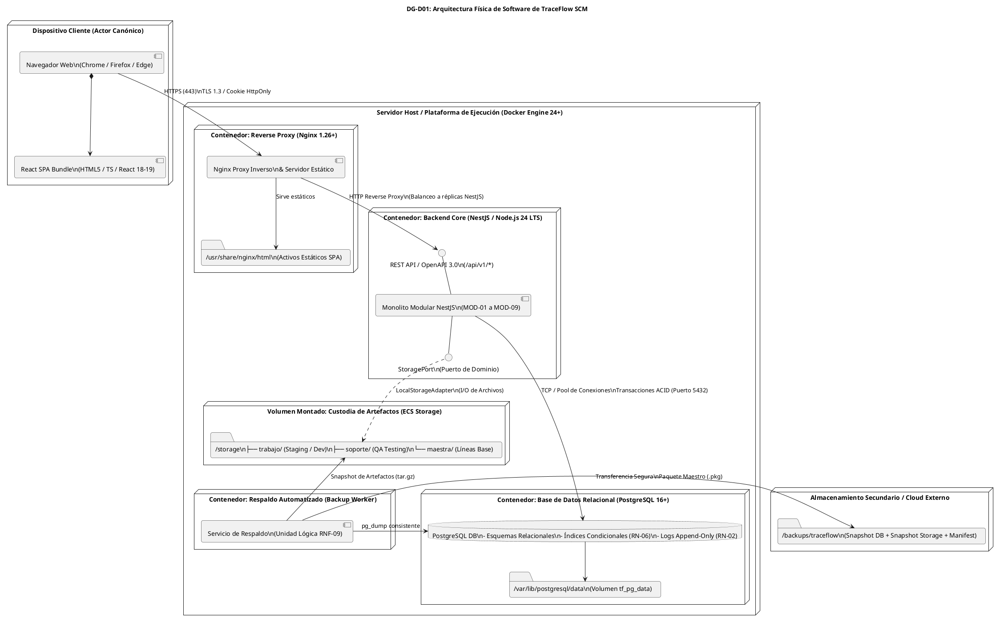

---

## 3.3 Delimitación de Componentes Físicos

| Componente Físico | Tecnología de Ejecución | Responsabilidad Operativa Principal | Mecanismo de Interconexión |
| :--- | :--- | :--- | :--- |
| **Frontend SPA** | React, TypeScript, Vite | Renderizado de interfaz, formularios reactivos, vistas de árboles de ECS, votaciones de CCB y tableros de QA. | Descargado vía Nginx; llamadas asíncronas JSON vía `fetch`/Axios. |
| **Reverse Proxy** | Nginx 1.26+ | Terminación segura HTTPS, compresión gzip/brotli, cacheo de activos estáticos, enrutamiento semántico a `/api/v1/`. | Expone puertos 80/443; conecta por red interna Docker bridge con el backend. |
| **Backend Core** | NestJS sobre Node.js 24 LTS | Orquestación transaccional de los 31 Casos de Uso, validación de reglas de negocio (RN-01 a RN-09), cómputo criptográfico SHA-256. | Protocolo HTTP/JSON; pooling relacional hacia PostgreSQL. |
| **Base de Datos** | PostgreSQL 16/17 | Almacenamiento transaccional de metadatos, control de versiones, sesiones opacas, bloqueos de concurrencia y auditoría inmutable. | Driver relacional nativo (`pg`/TypeORM/Prisma); volumen persistente montado. |
| **Custodia de ECS** | Sistema de archivos local montado | Almacenamiento seguro e inmutable de los archivos binarios y textuales de los ECS, segregados por bibliotecas SCM. | Acceso por streams de I/O mediante `LocalStorageAdapter`. |
| **Backup Worker** | Contenedor Alpine Linux con scripts cron | Generación periódica automatizada del respaldo coordinado y verificable (`DB + Storage + Manifest`) y verificación de checksums cruzados. | Acceso de solo lectura a la BD y al volumen de almacenamiento. |

---

# 4. Arquitectura del Backend (Monolito Modular)

## 4.1 Mapeo de Módulos Conceptuales a Módulos Técnicos NestJS
Para mantener una fidelidad absoluta con el SAD de Análisis (FD04), los 9 módulos conceptuales aprobados se mapean **1:1** en módulos técnicos de NestJS decorados con `@Module`:

```
┌────────────────────────────────────────────────────────────────────────┐
│                   TRACEFLOW SCM - MONOLITO MODULAR                     │
├───────────────────┬───────────────────┬────────────────────────────────┤
│ Módulo Conceptual │ Módulo NestJS     │ Responsabilidad Técnica        │
├───────────────────┼───────────────────┼────────────────────────────────┤
│ MOD-01            │ AuthModule        │ IAM, Sesiones Opacas, RBAC/SoD │
│ MOD-02            │ ProjectModule     │ Proyectos, Gobernanza          │
│ MOD-03            │ ConfigItemModule  │ Catálogo ECS, Integridad       │
│ MOD-04            │ ChangeModule      │ RFC, CCB, Dictámenes, ECN      │
│ MOD-05            │ VersionModule     │ Check-Out/In, Bloqueos RN-06   │
│ MOD-06            │ QualityModule     │ QA Testing, Certificación, UAT │
│ MOD-07            │ BaselineModule    │ Líneas Base, Rollback          │
│ MOD-08            │ IncidentModule    │ Tickets, Derivación a RFC      │
│ MOD-09            │ AuditModule       │ Log Append-Only, Reportes      │
└───────────────────┴───────────────────┴────────────────────────────────┘
```

## 4.2 Anatomía Interna de Módulo Técnico
Cada uno de los 9 módulos técnicos en NestJS implementa una estructura interna estandarizada basada en Clean Architecture y Puertos y Adaptadores:

```
src/modules/{modulo}/
├── presentation/               # Capa de Entrada / Controladores
│   ├── {modulo}.controller.ts  # Endpoints REST (Rutas y Verbos HTTP)
│   └── dtos/                   # Data Transfer Objects con validación class-validator
├── application/                # Capa de Aplicación / Casos de Uso
│   ├── services/               # Servicios de Aplicación que orquestan los Casos de Uso
│   └── use-cases/              # Clases de comando o caso de uso individual
├── domain/                     # Capa de Dominio (Pura e Independiente)
│   ├── entities/               # Entidades de dominio con reglas de negocio intrínsecas
│   ├── value-objects/          # Objetos de valor inmutables (e.g. ChecksumSHA256, EstadoRFC)
│   └── ports/                  # Interfaces abstractas (Repositorios y Servicios Externos)
└── infrastructure/             # Capa de Infraestructura / Adaptadores
    ├── persistence/            # Implementaciones de repositorios con TypeORM/Prisma
    │   ├── entities/           # Esquemas de mapeo objeto-relacional (ORM Entities)
    │   └── {modulo}.repo-impl.ts
    └── adapters/               # Adaptadores técnicos (Hashing, Storage, etc.)
```

## 4.3 Reglas Estrictas de Aislamiento y Colaboración Intermodular
Para evitar la degradación arquitectónica hacia un monolito enredado (*Big Ball of Mud*), se establecen las siguientes reglas de gobierno de código:
1. **Prohibición de Acceso Directo a Repositorios Ajenos**: Un módulo técnico jamás podrá inyectar o consultar directamente la entidad o repositorio de persistencia de otro módulo. Por ejemplo:
   $$\text{ChangeModule} \centernot\longrightarrow \text{VersionRepository (Prohibido)}$$
2. **Colaboración Exclusiva por Interfaces Públicas**: Toda interacción entre módulos debe ocurrir invocando los **servicios de aplicación exportados** en el contrato público del `@Module` correspondiente:
   $$\text{ChangeModule} \longrightarrow \text{VersionApplicationService (Permitido vía DI)}$$
3. **Desacoplamiento de Eventos de Dominio**: Para notificaciones transversales (e.g. registrar auditoría tras el Check-In o emitir notificaciones al autorizar un cambio), los módulos emitirán eventos internos en memoria (`EventEmitter2` de NestJS), permitiendo que `AuditModule` capture el evento sin que el módulo emisor quede acoplado a la infraestructura de auditoría.

---

## 4.4 Diagrama DG-D02: Componentes del Monolito Modular


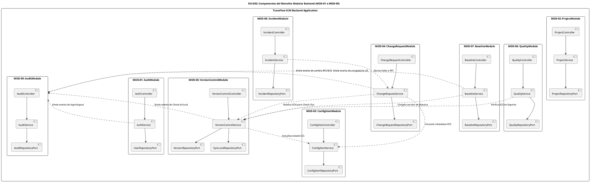

---

# 5. Capas Arquitectónicas (Clean Architecture / Hexagonal)

## 5.1 Definición de las Cuatro Capas
La organización de cada módulo responde estrictamente al paradigma de **Clean Architecture / Arquitectura Hexagonal**:

```
           ┌──────────────────────────────────────────────┐
           │        CAPA DE PRESENTACIÓN / INTERFAZ       │
           │  (Controllers, DTOs, Guards, Interceptors)   │
           └──────────────────────┬───────────────────────┘
                                  │ depende de
                                  ▼
           ┌──────────────────────────────────────────────┐
           │              CAPA DE APLICACIÓN              │
           │  (Application Services, Use Cases, Commands) │
           └──────────────────────┬───────────────────────┘
                                  │ depende de
                                  ▼
           ┌──────────────────────────────────────────────┐
           │                CAPA DE DOMINIO               │
           │  (Entities, Value Objects, Domain Ports)     │
           └──────────────────────────────────────────────┘
                                  ▲
                                  │ implementa puertos
           ┌──────────────────────┴───────────────────────┐
           │            CAPA DE INFRAESTRUCTURA           │
           │  (TypeORM Adapters, LocalStorage, NodeCrypto)│
           └──────────────────────────────────────────────┘
```

1. **Capa de Dominio (Domain Core)**:
   - Contiene la lógica esencial del negocio, entidades puras, objetos de valor y puertos de repositorio.
   - **Regla Fundamental**: El Dominio es completamente agnóstico a la tecnología; **no tiene dependencias** de NestJS, decoradores de TypeORM, base de datos PostgreSQL, HTTP, Express ni del sistema de archivos.
2. **Capa de Aplicación (Application Layer)**:
   - Orquesta los flujos de los Casos de Uso del sistema.
   - Coordina la recuperación de entidades a través de los puertos de repositorio, ejecuta las operaciones del dominio, persiste los cambios y emite eventos de auditoría.
   - Maneja transacciones relacionales mediante unidades de trabajo (*Unit of Work*).
3. **Capa de Presentación (Presentation / Interface Layer)**:
   - Expone los adaptadores de entrada HTTP (Controladores REST de NestJS).
   - Recibe los objetos de transferencia de datos (DTOs) de entrada, valida su estructura y tipos mediante `class-validator`, aplica guardas de seguridad (`AuthGuard`, `RolesGuard`, `SodGuard`) y transforma las respuestas a JSON estándar.
4. **Capa de Infraestructura (Infrastructure Layer)**:
   - Implementa los puertos abstractos definidos por el Dominio y la Aplicación.
   - Contiene los repositorios de persistencia basados en TypeORM/PostgreSQL, el adaptador de almacenamiento de archivos `LocalStorageAdapter`, y el cómputo de hashing criptográfico SHA-256 sobre Node.js nativo (`crypto`).

## 5.2 Regla de Dependencia Unidireccional e Inversión de Control
La arquitectura aplica de forma estricta el **Principio de Inversión de Dependencias (DIP)**:
- Las capas externas (Presentación e Infraestructura) conocen y dependen de las capas internas (Aplicación y Dominio).
- La capa de Dominio jamás conoce a la Infraestructura.
- Cuando el servicio de aplicación necesita persistir una entidad (e.g. `ChangeRequest`), invoca la interfaz abstracta `ChangeRequestRepositoryPort`. La implementación concreta (`ChangeRequestRepositoryImpl`) reside en la capa de Infraestructura y es inyectada en tiempo de ejecución por el contenedor de inversión de control (IoC) de NestJS.

---

# 6. Arquitectura Frontend (React SPA)

## 6.1 Estructura Modular de Carpetas
El cliente web se organiza como una Single Page Application (SPA) basada en React, TypeScript y Vite, estructurada mediante el patrón de **Módulos por Funcionalidad (Feature-Driven Structure)** para reflejar la modularidad del negocio y permitir carga bajo demanda (*code splitting*):

```
frontend/src/
├── app/                        # Configuración global, providers y temas
│   ├── App.tsx                 # Componente raíz con React Router y QueryClientProvider
│   ├── main.tsx                # Punto de entrada de renderizado en DOM
│   └── store/                  # Estado global ligero del cliente (Zustand / Context)
├── routes/                     # Definición centralizada de rutas y navegación
│   ├── AppRoutes.tsx           # Tabla de rutas protegidas y públicas
│   └── ProtectedRoute.tsx      # Route Guard que evalúa sesión y roles activos
├── layouts/                    # Plantillas visuales por perfil y contexto
│   ├── DashboardLayout.tsx     # Barra lateral, navegación superior y breadcrumbs
│   ├── AuthLayout.tsx          # Pantalla limpia centrada para autenticación
│   └── RoleBasedSidebar.tsx    # Menú dinámico filtrado por los 7 roles canónicos
├── features/                   # Módulos funcionales de negocio (Features)
│   ├── auth/                   # Login, perfil, sesión y logout
│   ├── projects/               # Creación, configuración y listado de proyectos (MOD-02)
│   ├── ecs/                    # Catálogo jerárquico de ECS y relaciones (MOD-03)
│   ├── changes/                # Flujo de RFCs, análisis de impacto y CCB (MOD-04)
│   ├── libraries/              # Visualizador de bibliotecas (Trabajo, Soporte, Maestra)
│   ├── quality/                # Tableros de pruebas, certificación QA y actas UAT (MOD-06)
│   ├── baselines/              # Historial de líneas base y congelamientos (MOD-07)
│   ├── incidents/              # Bandeja de incidencias y derivación a RFC (MOD-08)
│   ├── audit/                  # Visor de pistas de auditoría inmutable (MOD-09)
│   └── reports/                # Generador de reportes consolidados (MOD-09)
└── shared/                     # Código transversal reutilizable
    ├── api/                    # Cliente HTTP (Axios) con interceptor de cookies y errores
    ├── components/             # Componentes UI atómicos (Botones, Modales, Tablas, Badges)
    ├── hooks/                  # Custom hooks utilitarios (useAuth, useSessionTimeout)
    └── types/                  # Tipos e interfaces TypeScript sincronizados con OpenAPI
```

## 6.2 Enrutamiento, Layouts y Protección por Rol
1. **Enrutador Declarativo (React Router v6+)**:
   - `/login`: Ruta pública para autenticación.
   - `/dashboard`: Panel general con métricas e indicadores de actividad.
   - `/projects/*`: Gestión de proyectos y catálogo de ECS.
   - `/changes/*`: Gestión y tramitación del ciclo de vida de RFCs.
   - `/changes/:id/ccb-deliberation`: Consola colegiada de votación para el CCB.
   - `/quality/*`: Entorno de validación técnica de QA y actas de aceptación UAT.
   - `/baselines/*`: Visor de líneas base congeladas y ejecución de rollback.
   - `/audit/*`: Explorador de registros forenses de auditoría.
2. **Layout Basado en Rol (`RoleBasedSidebar`)**:
   - El menú lateral adapta sus opciones en tiempo de ejecución evaluando el rol del usuario autenticado entre los **7 actores canónicos de TB-09**:
     `Solicitante`, `Analista de Requerimientos / Gestor`, `Arquitecto / Especialista Técnico`, `Comité de Control de Cambios (CCB)`, `Administrador de Configuración / Bibliotecario`, `Ingeniero de Software / Desarrollador`, `Equipo de Calidad / Testing`.
3. **Route Guards (`ProtectedRoute`)**:
   - Intercepta cada cambio de ruta en el cliente.
   - Si no existe sesión activa válida, redirige automáticamente a `/login`.
   - Si el rol activo del usuario no posee autorización para la ruta solicitada, bloquea el renderizado y muestra una pantalla de `403 Acceso Denegado (Violación de RN-01)`.

## 6.3 Gestión de Estado, Consumo de API y Manejo de Errores
- **Gestión de Estado del Servidor**: Empleo de **TanStack Query (React Query)** para el consumo asíncrono, cacheo automático, invalidación de consultas y sincronización en tiempo real de los datos del backend.
- **Cliente HTTP Seguro**: Instancia configurada de Axios con `withCredentials: true`, asegurando que la cookie `HttpOnly` (`tf_session`) viaje automáticamente en cada solicitud al backend sin ser accesible por JavaScript.
- **Manejo Centralizado de Errores**:
  - Interceptor global de respuestas HTTP:
    - `401 Unauthorized`: Limpia el estado de autenticación y redirige a `/login` por inactividad o expiración de sesión.
    - `403 Forbidden`: Muestra notificación modal de violación de RBAC o de Segregación de Funciones (SoD).
    - `409 Conflict`: Captura violaciones de la regla de bloqueo exclusivo de sincronización (`RN-06`), alertando al operador con los datos de la orden que mantiene el bloqueo activo.
    - `Error Boundaries`: Componentes de contención que evitan la caída global de la interfaz gráfica ante excepciones no controladas.

---

# 7. Modelo de Datos de Diseño (Relacional Lógico)

## 7.1 Derivación Exhaustiva desde el Modelo Conceptual DG-12
El diseño relacional lógico se deriva directamente del **Modelo Conceptual del Dominio (DG-12)** aprobado en la baseline de análisis, transformando las clases de análisis en un esquema de tablas relacionales de tercera forma normal (3NF) gobernado por claves foráneas, restricciones de integridad referencial y restricciones condicionales.

No se crea ninguna tabla sin trazabilidad directa a una entidad conceptual o a una tabla asociativa necesaria para normalizar relaciones N:M:

```
┌─────────────────────────────────┬─────────────────────────────┬──────────────────────────────┐
│ Entidad Conceptual (DG-12)      │ Tabla Relacional de Diseño  │ Propósito en el Sistema SCM  │
├─────────────────────────────────┼─────────────────────────────┼──────────────────────────────┤
│ Usuario                         │ app_user                    │ Cuentas de los 7 actores     │
│ RolUsuario (Enum)               │ app_role                    │ Catálogo canónico de roles   │
│ (Asociación Usuario-Rol)        │ user_role_assignment        │ Asignación N:M de roles/SoD  │
│ Proyecto                        │ project                     │ Proyectos de clientes        │
│ ElementoConfiguracion           │ config_item                 │ Catálogo de ECS por proyecto │
│ (Historial de Versiones)        │ ecs_version                 │ Versiones inmutables + SHA256│
│ SolicitudCambio                 │ change_request              │ Expediente de RFC (14 estados│
│ InformeImpacto                  │ impact_assessment           │ Análisis técnico (Triple Res)│
│ (Dictamen CCB - Cambio Mayor)   │ ccb_resolution              │ Resoluciones y votación CCB  │
│ (Autorización - Cambio Menor)   │ change_authorization        │ Aprobación delegada (CU-30)  │
│ OrdenCambio                     │ change_order                │ ECN/ECO emitida para cambio  │
│ EstadoBloqueo (Entidad/Estado)  │ sync_lock                   │ Bloqueo persistente (RN-06)  │
│ CertificadoConformidad          │ qa_certification            │ Certificación técnica de QA  │
│ (Aceptación de Usuario / UAT)   │ uat_acceptance              │ Acta de aceptación formal    │
│ LineaBase                       │ baseline                    │ Líneas base congeladas       │
│ (Asociación LineaBase-ECS)      │ baseline_item               │ Versiones congeladas en LB   │
│ TicketIncidencia                │ incident_ticket             │ Reportes de falla externa    │
│ RegistroAuditoria               │ audit_log                   │ Pistas append-only inmutables│
│ (Control de Sesiones Técnicas)  │ user_session                │ Sesiones opacas en servidor  │
└─────────────────────────────────┴─────────────────────────────┴──────────────────────────────┘
```

---

## 7.2 Diagrama DG-D03: Modelo Relacional Lógico de TraceFlow SCM


```plantuml
@startuml
skinparam shadowing false
skinparam roundcorner 8
skinparam defaultFontName Arial
skinparam linetype ortho

title <b>DG-D03: Modelo Relacional Lógico de Base de Datos - TraceFlow SCM</b>

entity "app_user" as app_user {
    * id : UUID [PK]
    --
    * username : VARCHAR(50) [UNIQUE]
    * email : VARCHAR(100) [UNIQUE]
    * password_hash : VARCHAR(255)
    * full_name : VARCHAR(120)
    * status : VARCHAR(20) <<ACTIVE, INACTIVE, SUSPENDED>>
    * created_at : TIMESTAMP WITH TIME ZONE
    * updated_at : TIMESTAMP WITH TIME ZONE
}

entity "app_role" as app_role {
    * id : INT [PK]
    --
    * code : VARCHAR(30) [UNIQUE]
    * name : VARCHAR(80)
    * description : TEXT
}

entity "user_role_assignment" as user_role {
    * user_id : UUID [PK, FK -> app_user.id]
    * role_id : INT [PK, FK -> app_role.id]
    --
    * assigned_at : TIMESTAMP WITH TIME ZONE
    * assigned_by : UUID [FK -> app_user.id]
}

entity "user_session" as user_session {
    * id : UUID [PK]
    --
    * user_id : UUID [FK -> app_user.id]
    * session_token_hash : VARCHAR(64) [UNIQUE, INDEX]
    * ip_address : VARCHAR(45)
    * user_agent : TEXT
    * is_revoked : BOOLEAN
    * created_at : TIMESTAMP WITH TIME ZONE
    * last_activity_at : TIMESTAMP WITH TIME ZONE
    * expires_at : TIMESTAMP WITH TIME ZONE
}

entity "project" as project {
    * id : UUID [PK]
    --
    * code : VARCHAR(20) [UNIQUE]
    * name : VARCHAR(120)
    * description : TEXT
    * client_name : VARCHAR(120)
    * status : VARCHAR(20) <<ACTIVE, CLOSED, ARCHIVED>>
    * created_by : UUID [FK -> app_user.id]
    * created_at : TIMESTAMP WITH TIME ZONE
}

entity "config_item" as config_item {
    * id : UUID [PK]
    --
    * project_id : UUID [FK -> project.id]
    * code : VARCHAR(30)
    * name : VARCHAR(120)
    * item_type : VARCHAR(30) <<SOURCE_CODE, DOCUMENT, DB_SCHEMA, BUILD_SCRIPT>>
    * current_library : VARCHAR(20) <<TRABAJO, SOPORTE, MAESTRA>>
    * current_version_id : UUID [NULLABLE]
    * is_locked : BOOLEAN
    * created_at : TIMESTAMP WITH TIME ZONE
    --
    CONSTRAINT uq_project_ecs_code UNIQUE(project_id, code)
}

entity "ecs_version" as ecs_version {
    * id : UUID [PK]
    --
    * ecs_id : UUID [FK -> config_item.id]
    * version_number : VARCHAR(20) <<mayor.menor.parche - RN-02>>
    * sha256_checksum : VARCHAR(64) <<RNF-03, RF-17>>
    * storage_path : VARCHAR(255)
    * storage_status : VARCHAR(20) <<PENDING_STORAGE, COMMITTED, STORAGE_FAILED>>
    * file_size_bytes : BIGINT
    * check_in_by : UUID [FK -> app_user.id]
    * change_order_id : UUID [NULLABLE]
    * commit_message : TEXT <<RN-03>>
    * created_at : TIMESTAMP WITH TIME ZONE
    --
    CONSTRAINT uq_ecs_version UNIQUE(ecs_id, version_number)
}

entity "change_request" as change_request {
    * id : UUID [PK]
    --
    * project_id : UUID [FK -> project.id]
    * target_ecs_id : UUID [FK -> config_item.id]
    * code : VARCHAR(30) [UNIQUE]
    * title : VARCHAR(150)
    * description : TEXT
    * justification : TEXT
    * priority : VARCHAR(20) <<BAJA, MEDIA, ALTA, CRITICA>>
    * classification : VARCHAR(20) <<MENOR, MAYOR, PENDIENTE>>
    * status : VARCHAR(30) <<14 ESTADOS OFICIALES TB-07>>
    * requested_by : UUID [FK -> app_user.id]
    * created_at : TIMESTAMP WITH TIME ZONE
    * updated_at : TIMESTAMP WITH TIME ZONE
}

entity "impact_assessment" as impact_assessment {
    * id : UUID [PK]
    --
    * rfc_id : UUID [UNIQUE, FK -> change_request.id]
    * architecture_impact : TEXT
    * dependencies_impact : TEXT
    * risk_level : VARCHAR(20) <<BAJO, MEDIO, ALTO>>
    * effort_hours : INT
    * estimated_cost : NUMERIC(10,2)
    * estimated_days : INT
    * recommended_classification : VARCHAR(20) <<MENOR, MAYOR>>
    * assessed_by : UUID [FK -> app_user.id]
    * assessed_at : TIMESTAMP WITH TIME ZONE
}

entity "ccb_resolution" as ccb_resolution {
    * id : UUID [PK]
    --
    * rfc_id : UUID [FK -> change_request.id]
    * decision : VARCHAR(20) <<AUTORIZADA, RECHAZADA>>
    * resolution_act_number : VARCHAR(50)
    * votes_in_favor : INT
    * votes_against : INT
    * observations : TEXT
    * resolved_by : UUID [FK -> app_user.id]
    * resolved_at : TIMESTAMP WITH TIME ZONE
}

entity "change_authorization" as change_authorization {
    * id : UUID [PK]
    --
    * rfc_id : UUID [FK -> change_request.id]
    * authorizer_role : VARCHAR(40) <<GESTOR, ARQUITECTO>>
    * authorizer_user_id : UUID [FK -> app_user.id]
    * decision : VARCHAR(20) <<APROBADO, OBSERVADO, RECHAZADO>>
    * technical_notes : TEXT
    * authorized_at : TIMESTAMP WITH TIME ZONE
    --
    CONSTRAINT uq_rfc_authorizer_role UNIQUE(rfc_id, authorizer_role)
}

entity "change_order" as change_order {
    * id : UUID [PK]
    --
    * rfc_id : UUID [UNIQUE, FK -> change_request.id]
    * ecs_id : UUID [FK -> config_item.id]
    * code : VARCHAR(30) [UNIQUE] <<ECN/ECO-YYYY-NNN>>
    * status : VARCHAR(20) <<EMITIDA, EN_EJECUCION, CERRADA, CANCELADA>>
    * issued_by : UUID [FK -> app_user.id]
    * assigned_developer_id : UUID [FK -> app_user.id]
    * issued_at : TIMESTAMP WITH TIME ZONE
    * closed_at : TIMESTAMP WITH TIME ZONE
}

entity "sync_lock" as sync_lock {
    * id : UUID [PK]
    --
    * ecs_id : UUID [FK -> config_item.id]
    * change_order_id : UUID [FK -> change_order.id]
    * locked_by : UUID [FK -> app_user.id]
    * status : VARCHAR(20) <<ACTIVE, RELEASED>>
    * locked_at : TIMESTAMP WITH TIME ZONE
    * released_at : TIMESTAMP WITH TIME ZONE
    * release_reason : VARCHAR(30) <<CHECK_IN, ROLLBACK, CANCELED>>
}

entity "qa_certification" as qa_certification {
    * id : UUID [PK]
    --
    * change_order_id : UUID [FK -> change_order.id]
    * ecs_version_id : UUID [FK -> ecs_version.id]
    * result : VARCHAR(20) <<CONFORME, NO_CONFORME>>
    * test_suite_summary : TEXT
    * certified_by : UUID [FK -> app_user.id]
    * certified_at : TIMESTAMP WITH TIME ZONE
}

entity "uat_acceptance" as uat_acceptance {
    * id : UUID [PK]
    --
    * change_order_id : UUID [FK -> change_order.id]
    * ecs_version_id : UUID [FK -> ecs_version.id]
    * result : VARCHAR(20) <<ACEPTADO, RECHAZADO>>
    * observations : TEXT
    * accepted_by : UUID [FK -> app_user.id]
    * accepted_at : TIMESTAMP WITH TIME ZONE
}

entity "baseline" as baseline {
    * id : UUID [PK]
    --
    * project_id : UUID [FK -> project.id]
    * code : VARCHAR(30) [UNIQUE]
    * name : VARCHAR(120)
    * version_label : VARCHAR(30)
    * status : VARCHAR(20) <<CONGELADA, OBSOLETA>>
    * frozen_by : UUID [FK -> app_user.id]
    * frozen_at : TIMESTAMP WITH TIME ZONE
}

entity "baseline_item" as baseline_item {
    * baseline_id : UUID [PK, FK -> baseline.id]
    * ecs_version_id : UUID [PK, FK -> ecs_version.id]
    --
    * added_at : TIMESTAMP WITH TIME ZONE
}

entity "incident_ticket" as incident_ticket {
    * id : UUID [PK]
    --
    * project_id : UUID [FK -> project.id]
    * code : VARCHAR(30) [UNIQUE]
    * title : VARCHAR(150)
    * description : TEXT
    * reported_by : UUID [FK -> app_user.id]
    * status : VARCHAR(20) <<REGISTRADO, DERIVADO, ATENDIDO, CERRADO>>
    * derived_rfc_id : UUID [NULLABLE, FK -> change_request.id]
    * created_at : TIMESTAMP WITH TIME ZONE
}

entity "audit_log" as audit_log {
    * id : UUID [PK]
    --
    * timestamp : TIMESTAMP WITH TIME ZONE
    * actor_user_id : UUID [FK -> app_user.id]
    * actor_role : VARCHAR(50)
    * operation : VARCHAR(60)
    * entity_name : VARCHAR(50)
    * entity_id : UUID
    * related_ecn_id : UUID [NULLABLE]
    * result_status : VARCHAR(20) <<SUCCESS, FAILURE, REJECTED>>
    * payload_diff : JSONB
    * ip_address : VARCHAR(45)
    * user_agent : TEXT
    * prev_log_hash : VARCHAR(64)
    * curr_log_hash : VARCHAR(64)
}

' Relaciones
app_user ||--o{ user_role : "posee"
app_role ||--o{ user_role : "asignado a"
app_user ||--o{ user_session : "inicia"
app_user ||--o{ project : "crea"
project ||--o{ config_item : "contiene"
config_item ||--o{ ecs_version : "versionado en"
config_item ||--o{ change_request : "afectado por"
change_request ||--o| impact_assessment : "evaluado en"
change_request ||--o{ ccb_resolution : "deliberado en (CU-07)"
change_request ||--o{ change_authorization : "autorizado por (CU-30)"
change_request ||--o| change_order : "formalizado en"
change_order ||--o| sync_lock : "aplica"
change_order ||--o{ qa_certification : "probado en"
change_order ||--o{ uat_acceptance : "aprobado en"
project ||--o{ baseline : "define"
baseline ||--o{ baseline_item : "consolida"
ecs_version ||--o{ baseline_item : "incluida en"
project ||--o{ incident_ticket : "registra"
incident_ticket ||--o| change_request : "deriva en"
app_user ||--o{ audit_log : "origina"
app_user ||--o{ change_authorization : "suscribe"

@enduml
```

---

## 7.3 Especificación de Tablas, Claves, Restricciones y Estados
El modelo incorpora restricciones declarativas directas para salvaguardar las reglas de negocio canónicas:
- **Estados de RFC (`change_request.status`)**: Gobernado por un `CHECK` que admite estrictamente los **14 Estados Canónicos de TB-07**:
  `REGISTRADA`, `EN_SUBSANACION`, `CLASIFICADA`, `EN_ANALISIS_TECNICO`, `EN_EVALUACION`, `AUTORIZADA`, `ORDEN_EMITIDA`, `EN_IMPLEMENTACION`, `EN_PRUEBAS`, `EN_ACEPTACION`, `DESESTIMADA`, `RECHAZADA`, `CANCELADA`, `IMPLEMENTADA`.
- **Integridad de Versiones (`ecs_version`)**: Clave compuesta única `(ecs_id, version_number)` asegurando que ninguna versión de un ECS se sobreescriba (`RN-02`). Columna `sha256_checksum` inmutable y obligatoria (`RNF-03, RF-17`), computada en staging antes de la inserción. Columna `storage_status` (`PENDING_STORAGE`, `COMMITTED`, `STORAGE_FAILED`) que desacopla la transacción de base de datos de la persistencia de archivos físicos.
- **Autorización Compartida de Cambio Menor (`change_authorization`)**: Para cumplir estrictamente con `RN-01` y `RN-05` en la vía delegada (`CU-30`), la transición a `AUTORIZADA` exige de forma obligatoria y concurrente dos registros de conformidad en `change_authorization`: uno emitido por el `Analista de Requerimientos / Gestor` y otro por el `Arquitecto / Especialista Técnico`, garantizando la doble llave operativa sin intervención del pleno del CCB.
- **Trazabilidad de Cambios (`RN-03`)**: Columna `commit_message` y referencia foránea obligatoria a `change_order_id` en el Check-In.

## 7.4 Diseño Técnico del Bloqueo de Sincronización (RN-06)
La exclusividad absoluta del bloqueo de sincronización para evitar condiciones de carrera entre desarrolladores se blinda mediante un **índice único parcial condicional** en PostgreSQL:

```sql
-- RESTRICCIÓN ÚNICA CONDICIONAL QUE BLINDA RN-06 A NIVEL DE MOTOR:
-- Garantiza que jamás existirá más de UN bloqueo en estado ACTIVE para un mismo ECS.
CREATE UNIQUE INDEX uq_active_sync_lock_per_ecs 
ON sync_lock (ecs_id) 
WHERE status = 'ACTIVE';
```

### Reglas de Liberación Estricta:
1. El campo `sync_lock.release_reason` está restringido declarativamente:
   `CHECK (release_reason IN ('CHECK_IN', 'ROLLBACK', 'CANCELED'))`.
2. **Prohibición de Desbloqueo Arbitrario**: No existe operación de liberación administrativa directa en el sistema. La liberación solo ocurre mediante:
   - Check-In exitoso (`CU-12`, `RF-08`).
   - Rollback ejecutado por fallo en pruebas (`CU-21`, `RF-12`).
   - Cancelación formal de la Orden de Cambio (`CU-22`, `RF-12`).

---

# 8. Diseño de Custodia de ECS (StoragePort & Bibliotecas)

## 8.1 Interfaz de Dominio StoragePort
La custodia física de los archivos de código fuente, esquemas y documentos de los Elementos de Configuración (ECS) se aísla de la lógica de negocio mediante el puerto de dominio `StoragePort`. La capa de dominio define el contrato sin conocer detalles del sistema de archivos local ni de protocolos de red:

```typescript
export interface StoragePort {
  /**
   * Almacena un archivo temporal en el área de staging calculando y verificando su SHA-256.
   */
  storeTemporary(tempId: string, stream: NodeJS.ReadableStream, expectedSha256: string): Promise<{ path: string; sizeBytes: number }>;

  /**
   * Promueve un artefacto de staging a una biblioteca SCM permanente e inmutable.
   */
  promote(tempPath: string, targetLibrary: 'trabajo' | 'soporte' | 'maestra', targetSubPath: string, verifiedSha256: string): Promise<string>;

  /**
   * Obtiene un flujo de lectura del archivo custodiado.
   */
  read(storagePath: string): Promise<NodeJS.ReadableStream>;

  /**
   * Verifica la existencia física de un artefacto.
   */
  exists(storagePath: string): Promise<boolean>;

  /**
   * Copia un artefacto entre bibliotecas (e.g. de Soporte a Maestra).
   */
  copy(sourcePath: string, destinationLibrary: 'trabajo' | 'soporte' | 'maestra', destSubPath: string): Promise<string>;

  /**
   * Elimina un archivo temporal de staging en caso de fallo (operación compensatoria).
   */
  removeTemporary(tempPath: string): Promise<void>;

  /**
   * Calcula el hash criptográfico SHA-256 en tiempo real sobre el archivo físico (CU-26).
   */
  computeChecksum(storagePath: string): Promise<string>;
}
```

## 8.2 Adaptador LocalStorageAdapter y Estructura en Disco
En la fase inicial aprobada por ADR-005, el puerto es implementado por `LocalStorageAdapter`, que gestiona una jerarquía física en un volumen montado persistente (`/storage/`):

```
/storage/
├── staging/                                  # Área temporal volátil de subida
│   └── temp_{uuid}.tmp
├── trabajo/                                  # Biblioteca de Trabajo (Check-Out activo)
│   └── {projectId}/{ecsId}/
│       └── v{versionNumber}_{sha256}.artifact
├── soporte/                                  # Biblioteca de Soporte (Entorno QA / UAT)
│   └── {projectId}/{ecsId}/
│       └── v{versionNumber}_{sha256}.artifact
└── maestra/                                  # Biblioteca Maestra (Líneas Base Congeladas)
    └── {projectId}/{ecsId}/
        └── v{versionNumber}_{sha256}.artifact
```

Una vez que un archivo se promueve a las bibliotecas `soporte` o `maestra`, el adaptador remueve los permisos de escritura del sistema operativo (`chmod 444` / solo lectura) para prevenir cualquier modificación accidental en el host.

---

## 8.3 Diagrama DG-D04: Arquitectura de Storage y Bibliotecas


```plantuml
@startuml
skinparam shadowing false
skinparam roundcorner 8
skinparam defaultFontName Arial
skinparam packageStyle rectangle

title <b>DG-D04: Arquitectura de Storage y Transición entre las 3 Bibliotecas SCM</b>

package "Capa de Dominio & Aplicación" {
    interface "StoragePort" as StoragePort {
        + storeTemporary()
        + promote()
        + read()
        + copy()
        + removeTemporary()
        + computeChecksum()
    }
    
    class "VersionControlService" as VersionService
    VersionService -right-> StoragePort : consume
}

package "Capa de Infraestructura (Adaptador Físico)" {
    class "LocalStorageAdapter" as LocalStorage {
        - basePath : String = "/storage"
        + storeTemporary()
        + promote()
        + read()
        + copy()
        + removeTemporary()
        + computeChecksum()
    }
    LocalStorage .up.|> StoragePort : implementa
}

package "Volumen de Almacenamiento Físico (/storage/)" {
    folder "staging/ (Temporal)" as F_Staging
    folder "trabajo/ (Biblioteca de Trabajo)" as F_Trabajo
    folder "soporte/ (Biblioteca de Soporte)" as F_Soporte
    folder "maestra/ (Biblioteca Maestra)" as F_Maestra
}

LocalStorage --> F_Staging : 1. Escribe carga temporal
LocalStorage --> F_Trabajo : 2. Promueve tras Check-Out / Dev
LocalStorage --> F_Soporte : 3. Transfiere para pruebas QA (RN-01)
LocalStorage --> F_Maestra : 4. Congela con Doble Conformidad (RN-09)

F_Trabajo .[#blue].> F_Soporte : Entrega para Testing (Check-In Técnico)
F_Soporte .[#green].> F_Maestra : Promoción definitiva tras QA + UAT
F_Trabajo .[#red].> F_Trabajo : Rollback purga copia de trabajo (RN-08)

@enduml
```

---

## 8.4 Protocolo de Transacciones por Etapas y Reconciliación
Debido a que **no existe una transacción ACID distribuida nativa (2PC) entre PostgreSQL y el sistema de archivos**, se formaliza un protocolo de **máquina de estados intermedios y compensación** que desacopla la persistencia en base de datos del almacenamiento físico:

```
[Cliente]                    [Backend Core]                  [StoragePort]            [PostgreSQL]
   │                                │                              │                       │
   │─── 1. POST Check-In Stream ───>│                              │                       │
   │                                │── 2. storeTemporary() ──────>│                       │
   │                                │                              │── Escribe staging ───>│
   │                                │<── Retorna tempPath + SHA ───│                       │
   │                                │                                                      │
   │                                │── 3. Valida Checksum (RNF-03/RF-17)                  │
   │                                │                                                      │
   │                                │── 4. Transacción BD 1: Pre-registro ────────────────>│
   │                                │      - INSERT INTO ecs_version                       │
   │                                │        (storage_status='PENDING_STORAGE')            │
   │                                │      - COMMIT                                        │
   │                                │<── Pre-registro Confirmado ──────────────────────────│
   │                                │                                                      │
   │                                │── 5. promote() a biblioteca ─>│                       │
   │                                │      (staging -> permanente) │                       │
   │                                │<── Transferencia Exitosa ────│                       │
   │                                │                                                      │
   │                                │── 6. Transacción BD 2: Confirmación ────────────────>│
   │                                │      - UPDATE ecs_version                            │
   │                                │        SET storage_status='COMMITTED'                │
   │                                │      - UPDATE sync_lock SET status='RELEASED'        │
   │                                │      - UPDATE config_item SET current_library=...    │
   │                                │      - INSERT INTO audit_log                         │
   │                                │      - COMMIT                                        │
   │                                │<── Transacción Final Confirmada ────────────────────│
   │                                │                                                      │
   │<── 7. 201 Created Confirmado ──│                                                      │
   │                                │                                                      │
   │                                │=== OPERACIONES COMPENSATORIAS ANTE FALLO ===         │
   │                                │ (Si falla promote() o se corta la conexión):         │
   │                                │── A. removeTemporary(tempPath) / purga archivo ─────>│
   │                                │── B. Transacción BD Compensatoria: ─────────────────>│
   │                                │      - UPDATE ecs_version                            │
   │                                │        SET storage_status='STORAGE_FAILED'           │
   │                                │      - Mantiene sync_lock (ACTIVE) para protección   │
   │                                │      - Emite alerta al Bibliotecario                 │
   │<── 500 Error de Almacenamiento │                                                      │
```

### Mecanismo Técnico del Reconciliation Worker
Para garantizar que caídas repentinas del servidor o fallos de hardware no dejen inconsistencias entre la base de datos y el disco:
1. Se define un proceso técnico en segundo plano (`ReconciliationWorker`), implementado mediante un cron interno de NestJS (`@Cron('0 */6 * * *')`).
2. **Detección de Transacciones Huérfanas**: Consulta registros en `ecs_version` con `storage_status = 'PENDING_STORAGE'` con más de 15 minutos de antigüedad. Verifica si el archivo fue promovido; de ser así, actualiza a `COMMITTED`; si no, purga el staging y actualiza a `STORAGE_FAILED`.
3. **Barrido de Staging**: Escanea `/storage/staging/` y purga automáticamente archivos temporales con más de 24 horas de antigüedad que no correspondan a ninguna transacción activa.
4. **Auditoría de Correspondencia Física y Checksum**: Compara la lista de `storage_path` y `sha256_checksum` de la tabla `ecs_version` contra los archivos reales en disco. Si detecta discrepancia (archivo faltante o hash alterado), genera de inmediato un registro de alerta crítica en `audit_log` y emite una notificación prioritaria al **Administrador de Configuración / Bibliotecario**.

---

# 9. Diseño de API REST

## 9.1 Matriz de Correspondencia Casos de Uso vs Operaciones API
A continuación se mapean los **31 Casos de Uso del SRS de Análisis** hacia operaciones RESTful concretas, respetando sus actores canónicos y reglas de negocio:

| CU | Nombre Caso de Uso (Baseline Análisis) | Operación de Aplicación / Controlador | Recurso / Ruta API (v1) | Método HTTP | Código Éxito | Códigos Error |
| :---: | :--- | :--- | :--- | :---: | :---: | :--- |
| **CU-01** | Gestionar usuarios y roles | `AuthController.manageUsers` | `/api/v1/users` | `GET` / `POST` | `200` / `201` | 400, 401, 403 |
| **CU-02** | Crear y administrar proyectos | `ProjectController.createProject` | `/api/v1/projects` | `POST` | `201` | 400, 401, 403, 409 |
| **CU-03** | Consultar proyecto | `ProjectController.getProjectById` | `/api/v1/projects/{id}` | `GET` | `200` | 401, 403, 404 |
| **CU-04** | Registrar Solicitud de Cambio (RFC) | `ChangeRequestController.registerRfc` | `/api/v1/rfcs` | `POST` | `201` | 400, 401, 403 |
| **CU-04.1**| Subsanar Solicitud de Cambio (RFC) | `ChangeRequestController.rectifyRfc` | `/api/v1/rfcs/{id}/rectification` | `PATCH` | `200` | 400, 401, 403, 404 |
| **CU-05** | Validar y clasificar la solicitud | `ChangeRequestController.classifyRfc` | `/api/v1/rfcs/{id}/classify` | `PATCH` | `200` | 400, 401, 403, 404 |
| **CU-06** | Realizar análisis de impacto técnico | `ChangeRequestController.submitImpact` | `/api/v1/rfcs/{id}/impact-assessment` | `POST` | `201` | 400, 401, 403, 404 |
| **CU-07** | Evaluar viabilidad y aprobar/rechazar (CCB) | `ChangeRequestController.voteCcb` | `/api/v1/rfcs/{id}/ccb-resolution` | `POST` | `201` | 400, 401, 403, 404 |
| **CU-08** | Emitir Orden de Cambio (ECN/ECO) | `ChangeRequestController.issueEcn` | `/api/v1/rfcs/{id}/change-order` | `POST` | `201` | 400, 401, 403, 409 |
| **CU-09** | Registrar ECS | `ConfigItemController.registerEcs` | `/api/v1/projects/{id}/ecs` | `POST` | `201` | 400, 401, 403, 409 |
| **CU-10** | Efectuar Check-Out (Soporte → Trabajo) | `VersionControlController.checkOut` | `/api/v1/ecs/{id}/check-out` | `POST` | `200` | 400, 401, 403, 409 |
| **CU-11** | Aplicar bloqueo de sincronización | *Ejecutado atómicamente en CU-10* | `/api/v1/ecs/{id}/check-out` | `POST` | `200` | 409 (Lock activo) |
| **CU-12** | Efectuar Check-In (Trabajo → Maestra/Soporte) | `VersionControlController.checkIn` | `/api/v1/ecs/{id}/check-in` | `POST` | `201` | 400, 401, 403, 409 |
| **CU-13** | Consultar historial de versiones | `VersionControlController.getHistory` | `/api/v1/ecs/{id}/versions` | `GET` | `200` | 401, 403, 404 |
| **CU-14** | Implementar cambio en el ECS | `VersionControlController.saveDraft` | `/api/v1/ecs/{id}/workspace-draft` | `PUT` | `200` | 400, 401, 403, 404 |
| **CU-15** | Ejecutar pruebas unitarias locales | `QualityController.logUnitTest` | `/api/v1/change-orders/{id}/unit-tests` | `POST` | `201` | 400, 401, 403 |
| **CU-16** | Ejecutar pruebas de integración | `QualityController.logIntegrationTest` | `/api/v1/change-orders/{id}/integration-tests`| `POST` | `201` | 400, 401, 403 |
| **CU-17** | Certificar conformidad del cambio | `QualityController.certifyQa` | `/api/v1/change-orders/{id}/qa-certification` | `POST` | `201` | 400, 401, 403 (SoD) |
| **CU-18** | Reportar no conformidad | `QualityController.reportNonConformity`| `/api/v1/change-orders/{id}/non-conformity`| `POST` | `201` | 400, 401, 403 |
| **CU-19** | Reevaluar y re-testear | `QualityController.retest` | `/api/v1/change-orders/{id}/retest` | `POST` | `200` | 400, 401, 403 |
| **CU-20** | Crear y congelar línea base | `BaselineController.freezeBaseline` | `/api/v1/projects/{id}/baselines` | `POST` | `201` | 400, 401, 403, 409 |
| **CU-21** | Ejecutar rollback en Biblioteca de Trabajo | `BaselineController.rollback` | `/api/v1/change-orders/{id}/rollback` | `POST` | `200` | 400, 401, 403, 404 |
| **CU-22** | Cancelar Orden de Cambio | `ChangeRequestController.cancelEcn` | `/api/v1/change-orders/{id}/cancel` | `POST` | `200` | 400, 401, 403, 404 |
| **CU-23** | Registrar incidencia | `IncidentController.registerIncident` | `/api/v1/projects/{id}/incidents` | `POST` | `201` | 400, 401, 403 |
| **CU-24** | Consultar estado de ticket | `IncidentController.getIncidentById` | `/api/v1/incidents/{id}` | `GET` | `200` | 401, 403, 404 |
| **CU-25** | Derivar incidencia a RFC | `IncidentController.deriveToRfc` | `/api/v1/incidents/{id}/derive-rfc` | `POST` | `201` | 400, 401, 403, 409 |
| **CU-26** | Validar integridad (checksum) | `ConfigItemController.verifyChecksum` | `/api/v1/ecs/{id}/versions/{vId}/verify`| `POST` | `200` | 400, 401, 403, 404 |
| **CU-27** | Auditar acciones del sistema | `AuditController.queryLogs` | `/api/v1/audit/logs` | `GET` | `200` | 401, 403 |
| **CU-28** | Generar reportes de estado | `AuditController.generateStatusReport` | `/api/v1/reports/status` | `GET` | `200` | 400, 401, 403 |
| **CU-29** | Validar aceptación del cambio por el usuario (UAT)| `QualityController.submitUat` | `/api/v1/change-orders/{id}/uat-acceptance`| `POST` | `201` | 400, 401, 403 |
| **CU-30** | Autorizar Cambio Menor por Arquitectura/Gestión | `ChangeRequestController.authorizeMinor`| `/api/v1/rfcs/{id}/authorizations` | `POST` | `201` | 400, 401, 403, 404 |

---

## 9.2 Catálogo Preliminar API-DRAFT-v0.2
El contrato preliminar formaliza las cabeceras obligatorias, transporte seguro y convenciones REST:
- **Cabeceras Obligatorias**:
  - `Content-Type: application/json` (o `multipart/form-data` para subidas de archivos en Check-In).
  - `Accept: application/json`.
  - `X-Requested-With: XMLHttpRequest` (Protección contra CSRF).
- **Versionado Semántico**: `/api/v1/...` documentado e inspeccionable vía Swagger UI en `/api/docs`.

## 9.3 Formato Estándar de Errores (RFC 7807)
Toda respuesta de error emitida por la API adopta la especificación RFC 7807 (*Problem Details for HTTP APIs*):

```json
{
  "type": "https://traceflow.exodo.com/errors/sync-lock-conflict",
  "title": "Conflicto de Bloqueo de Sincronización (RN-06)",
  "status": 409,
  "detail": "El ECS 'AUTH-MOD-01' ya se encuentra bloqueado bajo la Orden ECN-2026-015 por el desarrollador asignado.",
  "instance": "/api/v1/ecs/3fa85f64-5717-4562-b3fc-2c963f66afa6/check-out",
  "timestamp": "2026-10-01T15:45:00.000Z",
  "code": "TF_ERR_SYNC_LOCK_ACTIVE"
}
```

---

# 10. Diseño de Seguridad

## 10.1 Separación entre Autenticación, Autorización y Segregación de Funciones
La seguridad técnica de TraceFlow SCM distingue formalmente tres dimensiones independientes:
1. **Autenticación (Identidad Inequívoca)**: Verificación de credenciales de acceso del usuario y asignación de un identificador de sesión opaco seguro en el servidor.
2. **Autorización (Control de Acceso Basado en Roles - RBAC, RN-01, RN-04)**: Verificación estática de que el usuario autenticado ostenta uno de los 7 roles canónicos de TB-09 autorizados para invocar la operación.
3. **Segregación de Funciones Dinámica (SoD, Formalizada en SAD de Análisis Secciones 3.4 y 6.3)**: Validación contextual que impide conflictos de interés en tiempo de ejecución:
   - **SoD en Calidad (`CU-17`)**: El `Ingeniero de Software / Desarrollador` asignado a la implementación de la Orden de Cambio (ECN) tiene terminantemente prohibido actuar como evaluador en el `Equipo de Calidad / Testing` para certificar la conformidad técnica de su propio cambio.
   - **SoD en CCB (`CU-07`)**: El usuario en rol `Solicitante` que originó una Solicitud de Cambio tiene prohibido votar o presidir la deliberación colegiada del `Comité de Control de Cambios (CCB)` sobre su propia solicitud.

## 10.2 Flujo Técnico de Autenticación y Sesión Opaca en Servidor
Conforme a lo resuelto en **ADR-006**, el sistema implementa sesiones opacas gestionadas en servidor respaldadas por cookies seguras:
1. El usuario envía sus credenciales (`username` / `password`) mediante `POST /api/v1/auth/login`.
2. El servicio valida la contraseña comparando el hash calculado mediante la función de derivación de claves Argon2id (RFC 9106).
3. El backend genera un token de sesión criptográficamente aleatorio de 256 bits (`crypto.randomBytes(32).toString('hex')`).
4. Se calcula el hash SHA-256 del token y se inserta en la tabla `user_session` con `last_activity_at = NOW()`.
5. El backend devuelve la respuesta inyectando la cookie de sesión:
   `Set-Cookie: tf_session={sessionToken}; HttpOnly; Secure; SameSite=Strict; Path=/api; Max-Age=900`
6. En peticiones subsecuentes, el middleware extrae la cookie, calcula su hash SHA-256, consulta la sesión en PostgreSQL, verifica que no esté revocada y valida que la inactividad no supere los 15 minutos. Si es válida, renueva `last_activity_at = NOW()`.
7. Si el usuario ejecuta logout (`POST /api/v1/auth/logout`), la sesión se marca inmediatamente como `is_revoked = true` en base de datos y se elimina la cookie, garantizando la revocación instantánea.

## 10.3 Diagrama DG-D05: Flujo Técnico de Autenticación y Autorización


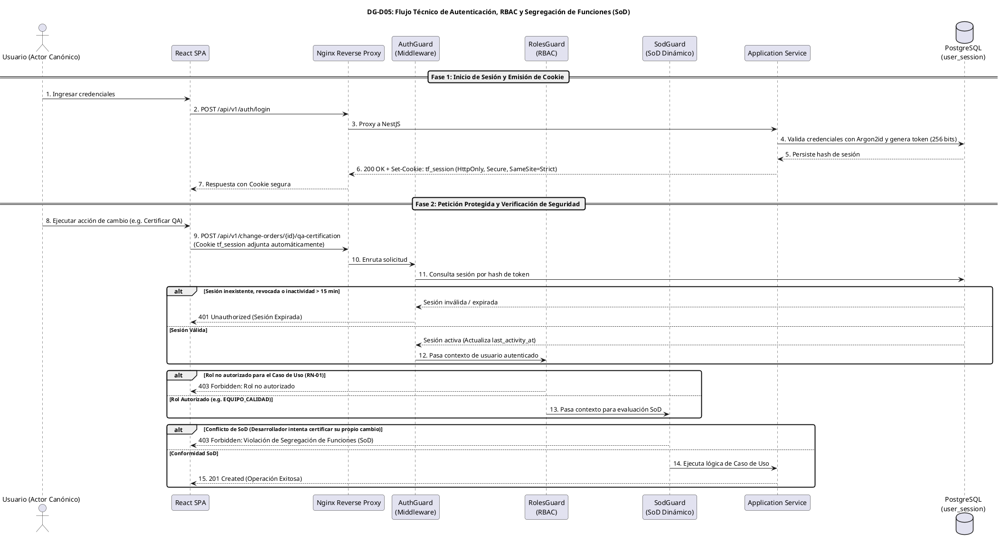

---

## 10.4 Parámetros de Seguridad de Diseño (Timeout de 15 Minutos y Cifrado)
- **Timeout de Inactividad de 15 Minutos**: Se clasifica formalmente como un **PARÁMETRO DE SEGURIDAD DE DISEÑO**, adoptado en ADR-006 para mitigar riesgos de sesión huérfana en terminales desatendidas. En la baseline SRS, `RNF-01` gobierna la seguridad y `RNF-04` corresponde a Usabilidad (< 3 horas).
- **Protección CSRF**: Requerimiento obligatorio del encabezado `X-Requested-With: XMLHttpRequest` y directiva de cookie `SameSite=Strict`.
- **Funciones Criptográficas y Cifrado en Reposo**:
  - **Argon2id (RFC 9106)**: Se emplea estrictamente como función adaptativa de derivación de claves / hashing de contraseñas con salting aleatorio por usuario (no como algoritmo de cifrado reversible).
  - **Cifrado en Reposo**: Los paquetes maestros de respaldo y credenciales sensibles se cifran mediante **AES-256-GCM**.
  - **Cifrado en Tránsito**: Forzado mediante TLS 1.3 con certificados HSTS.

---

# 11. Auditoría y Trazabilidad

## 11.1 Modelo Append-Only en PostgreSQL y Triggers de Inmutabilidad
En cumplimiento de **ADR-008**, la trazabilidad técnica de TraceFlow SCM descansa en un registro relacional en modo **estrictamente agregativo (*append-only*)**:
1. **Revocación de Permisos en Base de Datos**: El usuario de base de datos utilizado por la aplicación (`traceflow_app`) tiene concedidos exclusivamente permisos de `SELECT` e `INSERT` sobre la tabla `audit_log`:
   `REVOKE UPDATE, DELETE, TRUNCATE ON TABLE audit_log FROM traceflow_app;`
2. **Trigger Defensivo de Inmutabilidad**: Para blindar el registro ante cualquier intento de modificación incluso por usuarios con privilegios elevados:

```sql
CREATE OR REPLACE FUNCTION prevent_audit_log_tampering()
RETURNS TRIGGER AS $$
BEGIN
    RAISE EXCEPTION 'VIOLACIÓN DE INMUTABILIDAD (ADR-008): Los registros de audit_log son estrictamente inmutables.';
    RETURN NULL;
END;
$$ LANGUAGE plpgsql;

CREATE TRIGGER trg_audit_log_immutable
BEFORE UPDATE OR DELETE ON audit_log
FOR EACH ROW EXECUTE FUNCTION prevent_audit_log_tampering();
```

## 11.2 Cadena Criptográfica SHA-256 entre Entradas de Auditoría
Cada fila insertada en `audit_log` incorpora un enlace criptográfico con el registro cronológico inmediatamente anterior:

$$\mathbf{curr\_log\_hash}_i = \mathbf{SHA256}(\mathbf{curr\_log\_hash}_{i-1} \parallel \mathbf{timestamp}_i \parallel \mathbf{actor\_id}_i \parallel \mathbf{operation}_i \parallel \mathbf{payload\_diff}_i)$$

Si un atacante lograra alterar una fila histórica vulnerando el motor de base de datos, la cadena criptográfica se rompería inmediatamente, siendo detectada de forma automática por el `AuditVerificationJob` durante la auditoría periódica de configuración (`CU-27`).

---

# 12. Secuencias Técnicas de Diseño

## 12.1 Matriz de Auditoría y Saneamiento de las 9 Secuencias Críticas
En estricta sujeción a las baselines de análisis (`FD03` v1.0, `FD04` v1.1, `TABLES.md` TB-09/TB-10 y `DIAGRAMS.md`), se auditó la totalidad de los 9 flujos técnicos críticos de diseño para eliminar discrepancias de actores, bibliotecas y reglas de negocio:

| ID Secuencia | Caso de Uso | Actor Principal Canónico (TB-10) | Actor Secundario / Notificado | Transición de Bibliotecas / Estados | Reglas de Negocio Clave | Saneamiento Técnico Aplicado en v0.2 |
| :--- | :--- | :--- | :--- | :--- | :--- | :--- |
| **DG-DSEQ-04** | CU-04: Registrar Solicitud de Cambio (RFC) | `Solicitante` | `Analista de Requerimientos / Gestor` | Estado Inicial: `REGISTRADA` | RN-04 (ECS en proyecto) | Incorporada notificación de evento al Gestor; estandarización de DTOs y persistencia en `change_request`. |
| **DG-DSEQ-08** | CU-08: Emitir Orden de Cambio (ECN/ECO) | `Comité de Control de Cambios (CCB) / Analista de Requerimientos / Gestor` | `Administrador de Configuración / Bibliotecario` | `AUTORIZADA` $\rightarrow$ `ORDEN_EMITIDA` | RN-01, RN-07 | Formalizada la emisión formal con notificación al Bibliotecario y asignación al Desarrollador. |
| **DG-DSEQ-10** | CU-10: Efectuar Check-Out y Bloqueo (CU-10, CU-11) | **`Administrador de Configuración / Bibliotecario`** | `Ingeniero de Software / Desarrollador` | `Biblioteca de Soporte` $\rightarrow$ `Biblioteca de Trabajo` | **RN-06** (Bloqueo exclusivo), RN-01 | **Corrección de Actor Canónico**: Se sustituyó "Desarrollador" por el Bibliotecario (TB-10). La transición de origen es Soporte $\rightarrow$ Trabajo con adquisición de `sync_lock` (ACTIVE). |
| **DG-DSEQ-12** | CU-12: Efectuar Check-In de ECS | **`Administrador de Configuración / Bibliotecario`** | `Equipo de Calidad / Testing` (en Var. A) / `Solicitante` (en Var. B) | Var. A: Trabajo $\rightarrow$ Soporte<br>Var. B: Soporte $\rightarrow$ Maestra | **RNF-03 / RF-17** (Integridad SHA-256), **RN-09** (Doble Conformidad) | **Corrección Integral**: Actor asignado al Bibliotecario. Eliminada errata de RN-08 (RN-08 es rollback). Se formalizan dos variantes: Check-In Técnico (a Soporte para QA) y Check-In Definitivo (a Maestra tras QA+UAT). |
| **DG-DSEQ-17** | CU-17: Certificar Conformidad de Calidad | `Equipo de Calidad / Testing` | `Administrador de Configuración / Bibliotecario` | RFC: `EN_PRUEBAS` $\rightarrow$ `EN_ACEPTACION` | RN-01, SoD Dinámico | Actor estandarizado a denominación canónica de TB-09. Blindaje de segregación: rechaza al Desarrollador de la ECN. |
| **DG-DSEQ-20** | CU-20: Crear y Congelar Línea Base | `Administrador de Configuración / Bibliotecario` | `Equipo de Calidad / Testing`, `Solicitante` | Formalización en `Biblioteca Maestra` (Estado: `CONGELADA`) | **RN-02** (mayor.menor.parche), RN-09 | **Delimitación Nítida vs CU-12**: CU-12 promueve los archivos a Maestra. CU-20 formaliza la Línea Base agrupando versiones en `baseline_item`. No duplica la copia física. |
| **DG-DSEQ-21** | CU-21: Revertir Versión de ECS (Rollback) | `Administrador de Configuración / Bibliotecario` | `Ingeniero de Software / Desarrollador` | Purga en `Biblioteca de Trabajo` | **RN-08** (Reversión ante fallo), RN-06 | **Corrección de Destino**: El rollback purga los cambios de la Biblioteca de Trabajo y libera `sync_lock` (ROLLBACK), preservando Maestra intacta. |
| **DG-DSEQ-29** | CU-29: Validar Aceptación por el Usuario (UAT) | `Solicitante` (Usuario Final) | `Administrador de Configuración / Bibliotecario` | RFC: `EN_ACEPTACION` $\rightarrow$ Habilitada para Cierre | **RN-09** (Doble Conformidad), RN-07 | Valida que exista Certificación QA previa antes de admitir Acta UAT favorable. |
| **DG-DSEQ-30** | CU-30: Autorizar Cambio Menor por Vía Delegada | **`Analista de Requerimientos / Gestor` Y `Arquitecto / Especialista Técnico`** | `Solicitante`, `CCB` | `EN_EVALUACION` $\rightarrow$ `AUTORIZADA` | **RN-01**, **RN-05** (Triple Restricción) | **Modelo de Doble Llave Compartida**: Incorpora tabla `change_authorization`. Requiere que ambos roles emitan su conformidad para transicionar a `AUTORIZADA`. |

---

## 12.2 Diagramas Críticos de Diseño Refactorizados

### DG-DSEQ-04: Registrar Solicitud de Cambio (RFC) (CU-04)


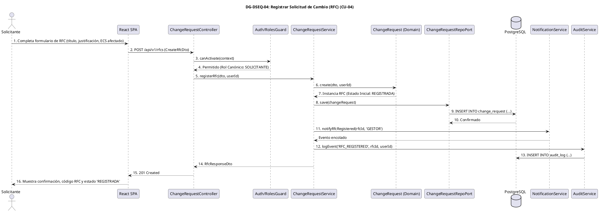

---

### DG-DSEQ-08: Emitir Orden de Cambio (ECN/ECO) (CU-08)


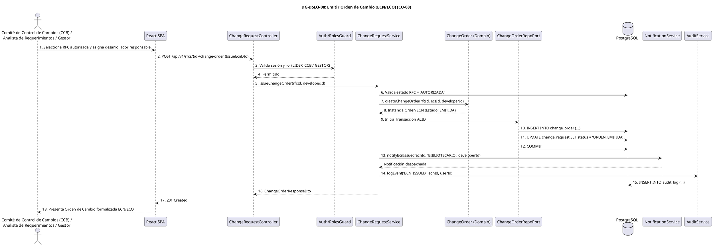

---

### DG-DSEQ-10: Efectuar Check-Out con Bloqueo de Sincronización (CU-10, CU-11, RN-06)


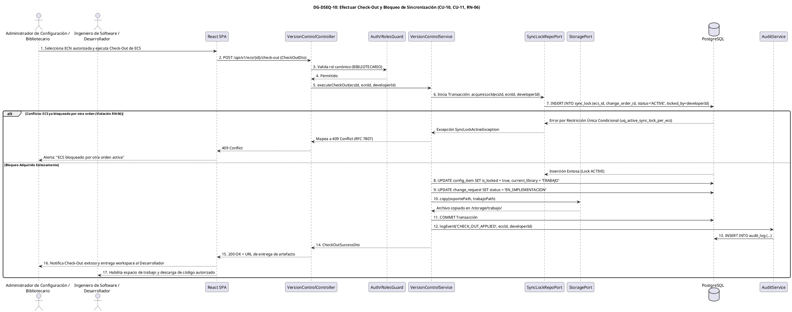

---

### DG-DSEQ-12: Efectuar Check-In de Ítem de Configuración (CU-12, RNF-03, RF-17, RN-09)


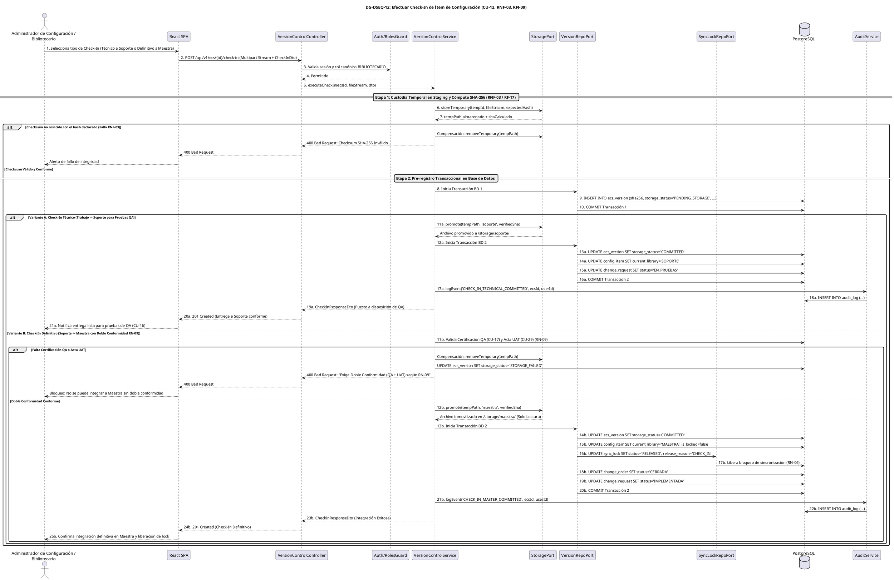

---

### DG-DSEQ-17: Certificar Conformidad de Calidad (CU-17, SoD Dinámico)


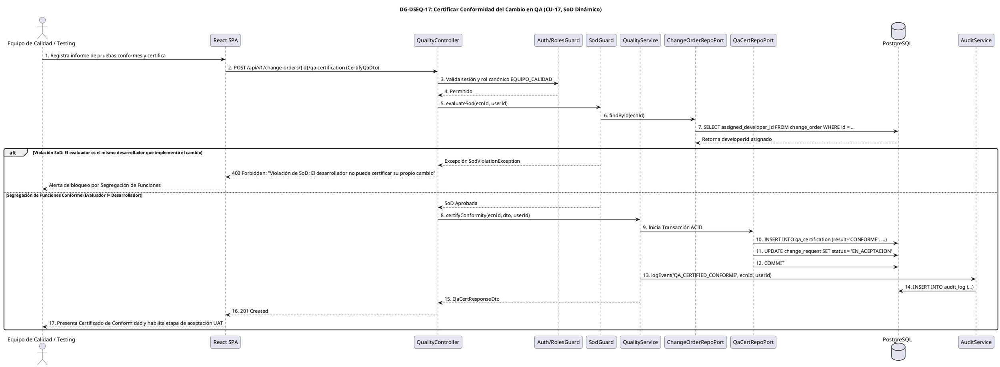

---

### DG-DSEQ-20: Crear y Congelar Línea Base (CU-20, RN-02, RN-09)


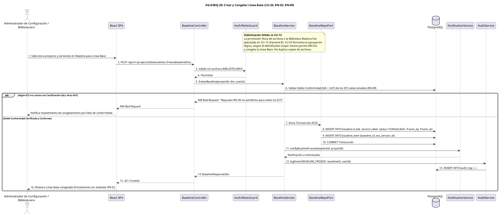

---

### DG-DSEQ-21: Revertir Versión de ECS - Rollback en Biblioteca de Trabajo (CU-21, RN-08)


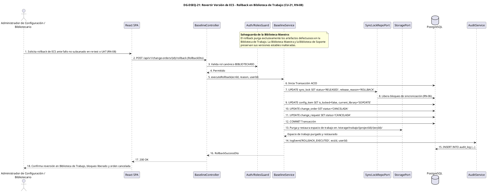

---

### DG-DSEQ-29: Validar Aceptación del Cambio por el Usuario (UAT) (CU-29, RN-09)


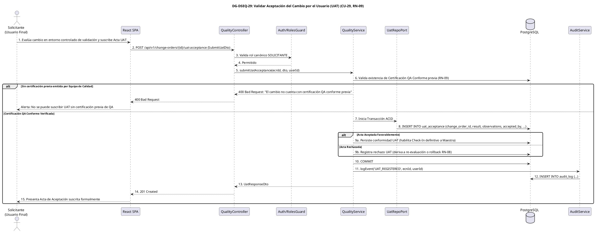

---

### DG-DSEQ-30: Autorizar Cambio Menor por Vía Delegada Compartida (CU-30, RN-01, RN-05)


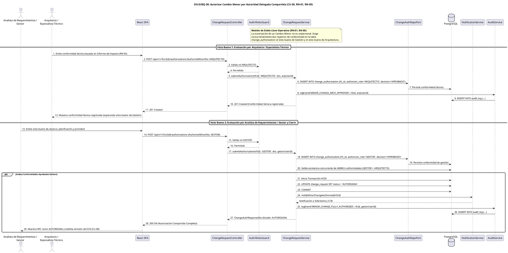

---

# 13. Arquitectura de Despliegue

## 13.1 Topología Docker y Contenedores Multi-Stage
El despliegue de TraceFlow SCM adopta el estándar de contenedores OCI mediante **Docker** y orquestación con **Docker Compose**. La arquitectura separa responsabilidades en contenedores especializados comunicados a través de una red interna bridge segura (`tf_network`), sin exponer directamente los puertos de la base de datos ni del backend al exterior:

```
[Red Externa / Internet / VPN Corporativa]
                 │
                 ▼  Puerto 443 (HTTPS)
      ┌─────────────────────┐
      │   nginx-proxy:1.26  │
      └──────────┬──────────┘
                 │ Red Interna Docker (tf_network)
         ┌───────┴───────┐
         ▼               ▼
┌─────────────────┐ ┌─────────────────┐
│ backend-app-1   │ │ backend-app-2   │ (Réplicas Stateless NestJS)
└────────┬────────┘ └────────┬────────┘
         │                   │
         └─────────┬─────────┘
                   ▼  Puerto 5432 (Interno)
         ┌───────────────────┐
         │  postgres-db:16+  │ ──> Volumen Persistente (tf_pg_data)
         └───────────────────┘
                   │
                   ▼  Montaje de Volumen
         ┌───────────────────┐
         │  ecs-storage-vol  │ (/storage/trabajo, soporte, maestra)
         └───────────────────┘
```

---

## 13.2 Diagrama DG-D06: Deployment Diagram


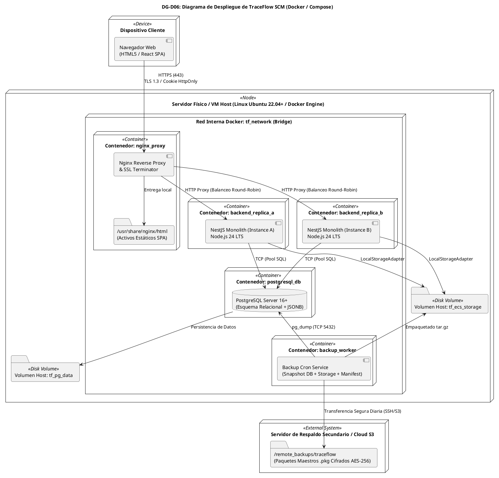

---

## 13.3 Análisis de Disponibilidad: Proceso vs Falla Física de Host
Conforme a lo evaluado en **ADR-010**, se establece la distinción formal de disponibilidad para no confundir capacidades operativas:
1. **Alta Disponibilidad ante Fallos de Proceso y Despliegues Sin Inactividad (*Zero-Downtime*)**:
   - Se ejecutan **dos réplicas stateless del backend** detrás de Nginx.
   - Cada contenedor implementa sondeos de salud continuos (`/health/liveness` y `/health/readiness`).
   - Si una instancia falla, Nginx redirige el tráfico a la réplica sana mientras Docker reinicia la afectada.
   - Las actualizaciones de versión se ejecutan en modo escalonado (*rolling updates*): se levanta la nueva imagen, se espera a que pase el health check y luego se apaga la versión anterior, garantizando cero interrupciones de software.
2. **Límites de Infraestructura y Contingencia ante Falla de Hardware Físico**:
   - **Declaración Explícita de Riesgo**: En una infraestructura basada en un único host físico, Docker Compose no puede garantizar un 99.9% de uptime ante fallo físico catastrófico de placa base o corte eléctrico total.
   - **Mitigación Aprobada**: Procedimiento formal de **Recuperación ante Desastres (Disaster Recovery)** respaldado por la Unidad Lógica de Respaldo transferida externamente, con un Objetivo de Tiempo de Recuperación de **RTO $\le 2$ horas**. La migración a clústeres multi-nodo (Docker Swarm o Kubernetes) queda definida como ruta de evolución futura.

---

# 14. Estrategia de Backup y Recuperación (RNF-09)

## 14.1 Definición de la Unidad Lógica de Respaldo
En cumplimiento obligatorio de la corrección arquitectónica de ADR-010, el sistema rechaza el respaldo aislado de PostgreSQL y define la **Unidad Lógica de Respaldo**:

$$\mathbf{Backup\ TraceFlow} = \mathbf{Snapshot\ DB} + \mathbf{Snapshot\ Storage} + \mathbf{Manifest}$$

El respaldo consolida de forma coordinada y verificable:
1. **Snapshot de Base de Datos**: Volcado transaccional consistente de PostgreSQL generado mediante:
   `pg_dump --format=custom --clean --if-exists tf_db > db_{timestamp}.dump`
2. **Snapshot de Almacenamiento Físico de ECS**: Empaquetado comprimido de las bibliotecas de artefactos (`/storage/trabajo`, `/storage/soporte`, `/storage/maestra`):
   `tar -czf storage_{timestamp}.tar.gz /storage/`
3. **Manifiesto de Consistencia**: Archivo `manifest_{timestamp}.json` que vincula el volcado relacional y el paquete físico, certificando:
   - Marca temporal exacta y versión de software.
   - Checksum SHA-256 del archivo `db_{timestamp}.dump`.
   - Checksum SHA-256 del archivo `storage_{timestamp}.tar.gz`.
   - Cantidad total de versiones de ECS respaldadas.

## 14.2 Protocolo Automatizado de Respaldo y Verificación SHA-256
El contenedor `backup_worker` ejecuta diariamente el siguiente flujo:
1. Registro en `audit_log` del inicio del proceso de respaldo.
2. Ejecución de `pg_dump` transaccional.
3. Copia snapshot comprimida del almacenamiento físico.
4. Cómputo criptográfico de los hashes SHA-256 de ambos ficheros.
5. Generación del archivo de manifiesto firmado lógicamente.
6. Empaquetado maestro cifrado en reposo con **AES-256-GCM** (`traceflow_backup_{timestamp}.pkg`).
7. Transferencia inmediata a almacenamiento secundario externo.
8. Registro en `audit_log` de la finalización conforme con el hash del paquete maestro.

## 14.3 Parámetros Operativos de Diseño (Horarios, Retención, RTO)
Los siguientes parámetros se clasifican expresamente como **PARÁMETROS OPERATIVOS DE DISEÑO**, adoptados para dar cumplimiento al requerimiento no funcional `RNF-09` (Respaldo diario automático del repositorio central):
- **Ventana de Ejecución**: Programada diariamente a las **02:00 AM (hora local)**, periodo de menor concurrencia del sistema.
- **Política de Retención Histórica**:
  - Respaldos diarios: Retención durante **30 días calendario**.
  - Respaldos mensuales de fin de ciclo: Retención durante **12 meses**.
- **Tiempo Objetivo de Recuperación (RTO)**: $\le 2$ horas para restablecer el servicio completo en un servidor alternativo.
- **Punto Objetivo de Recuperación (RPO)**: $\le 24$ horas (pérdida máxima acotada al ciclo diario).
- **Prueba Periódica de Restauración (*Drill*)**: Ejecución trimestral automatizada de restauración en un ambiente aislado para certificar que el paquete maestro se reconstruye sin artefactos huérfanos.

---

# 15. Observabilidad

## 15.1 Logging Estructurado, Health Checks y Métricas (RNF-06, RNF-08)
Para satisfacer la mantenibilidad (RNF-08) y asegurar que las operaciones críticas cumplan con el rendimiento requerido (RNF-06):
1. **Logging Estructurado en Formato JSON**:
   - Salida estándar (`stdout`) procesada por librerías nativas (`winston` o `pino`).
   - Cada línea de log incorpora: `timestamp`, `level` (`INFO`, `WARN`, `ERROR`), `context` (nombre del módulo), `correlation_id` (UUID transversal inyectado por Nginx/NestJS) y `payload`.
2. **Endpoints de Salud (Health Checks)**:
   - `GET /health/liveness`: Retorna `200 OK` si el proceso Node.js responde.
   - `GET /health/readiness`: Verifica la conectividad activa hacia el pool de PostgreSQL y el acceso de lectura/escritura al volumen `/storage/`.
3. **Métricas Clave de Rendimiento (RNF-06)**:
   - Interceptor global de tiempo de respuesta que mide la latencia de cada solicitud HTTP.
   - Las operaciones de consulta de historial de versiones (`CU-13`) y comparación de versiones están sujetas al umbral estricto de **$\le 3$ segundos** según la baseline de `RNF-06`. La verificación criptográfica (`CU-26`) y la generación de reportes (`CU-28`) se gestionan bajo objetivos internos de observabilidad para asegurar una experiencia fluida, sin constituir una obligación formal del SLA de `RNF-06`.

## 15.2 Alertas Operativas y de Integridad
El backend emite alertas automáticas enviadas a los administradores correspondientes ante:
- Tres o más intentos fallidos de autenticación en menos de 5 minutos para una misma cuenta.
- Detección de conflicto de bloqueo de sincronización activo (`RN-06`).
- Violación detectada en la reconciliación periódica del `ReconciliationWorker` (discrepancia de checksum SHA-256 o archivo faltante en disco), notificando de inmediato al **Administrador de Configuración / Bibliotecario**.
- Fallo en la rutina diaria del `BackupWorker` o espacio en disco en volumen persistente superior al 85%.

---

# 16. Matriz de Trazabilidad de Diseño

La siguiente matriz demuestra la alineación ininterrumpida entre el SRS de Análisis (`FD03`), el SAD de Análisis (`FD04`), los registros de decisión aprobados (`ADR-001..010`) y los componentes técnicos formalizados en este SAD de Diseño:

| Componente Técnico de Diseño | ADR Asociado | Módulo SAD Análisis | Requerimientos Funcionales (RF) | Atributos de Calidad (RNF) | Reglas de Negocio (RN) | Casos de Uso Gobernados |
| :--- | :---: | :---: | :--- | :--- | :--- | :--- |
| **`AuthModule` / Sessions / SoD** | ADR-003, ADR-006 | MOD-01 | RF-01, RF-17 | RNF-01 (Seguridad) | RN-01, RN-04, SoD SAD | CU-01 |
| **`ProjectModule`** | ADR-001, ADR-003 | MOD-02 | RF-02 | RNF-05 (Escalabilidad) | RN-01 | CU-02, CU-03 |
| **`ConfigItemModule`** | ADR-003, ADR-004 | MOD-03 | RF-03, RF-16, RF-17 | RNF-03 (Integridad), Observabilidad | RNF-03 / RF-17 (SHA-256) | CU-09, CU-26 |
| **`ChangeRequestModule`** | ADR-001, ADR-009 | MOD-04 | RF-04, RF-05, RF-06, RF-07, RF-14 | RNF-04 (Usabilidad) | RN-01, RN-05, RN-07 | CU-04, CU-04.1, CU-05, CU-06, CU-07, CU-08, CU-22, CU-30 |
| **`VersionControlModule` / SyncLock** | ADR-004, ADR-005, ADR-007 | MOD-05 | RF-08, RF-09 | RNF-01, RNF-06 (Historial $\le 3$s) | RN-02, RN-03, RN-04, RN-06 | CU-10, CU-11, CU-12, CU-13, CU-14 |
| **`QualityModule`** | ADR-003, ADR-006 | MOD-06 | RF-10, RF-11 | RNF-01 | RN-01, SoD Dinámico (SAD Secc. 3.4/6.3, ADR-006), RN-09 | CU-15, CU-16, CU-17, CU-18, CU-19, CU-29 |
| **`BaselineModule`** | ADR-004, ADR-005 | MOD-07 | RF-12, RF-13 | RNF-01, RNF-06 (Comparación $\le 3$s) | RN-02, RN-04, RN-08, RN-09 | CU-20, CU-21 |
| **`IncidentModule`** | ADR-001, ADR-009 | MOD-08 | RF-15 | RNF-04 | RN-03 | CU-23, CU-24, CU-25 |
| **`AuditModule` / Append-Only** | ADR-004, ADR-008 | MOD-09 | RF-16, RF-17, RF-18 | RNF-01, RNF-03, Observabilidad | RN-02, RN-03 | CU-27, CU-28 |
| **`StoragePort` / LocalStorage** | ADR-005 | Transversal (MOD-03,05,07) | RF-08, RF-09, RF-17 | RNF-03, RNF-07 (Compatibilidad) | RNF-03/RF-17 (Integridad), RN-04, RN-08 (Rollback en Trabajo) | CU-10, CU-12, CU-20, CU-21, CU-26 |
| **Docker Compose + Backup Worker**| ADR-010 | Infraestructura | Transversal | RNF-02 (Disponibilidad), RNF-08, RNF-09 | Transversal | Transversal |

---

# 17. Decisiones Pendientes para la Baseline de Implementación

Con el fin de preservar el principio de arquitectura diferida y no tomar decisiones apresuradas que aten la implementación antes de evaluar las librerías concretas en el entorno de desarrollo, se declaran formalmente las siguientes **decisiones abiertas**:

1. **Selección Definitiva del ORM / Data Mapper en NestJS**:
   - Candidatos: **TypeORM**, **Prisma** o **Kysely / node-postgres** nativo.
   - Criterio de Selección: Capacidad para ejecutar transacciones ACID manuales con bloqueo pesimista y control milimétrico de sentencias DDL (índices condicionales parciales de PostgreSQL).
2. **Fijación de la Versión Mayor de React (18 vs 19)**:
   - Supeditada a la matriz de compatibilidad de los paquetes de enrutamiento y librerías de componentes UI al congelar la baseline técnica de codificación.
3. **Selección de Librería de Componentes UI y Formularios**:
   - Candidatos UI: **Tailwind CSS + Radix UI / Shadcn UI**.
   - Candidatos Formularios: **React Hook Form + Zod / Yup** para validación en cliente alineada a los esquemas de backend.
4. **Adopción de Caché Redis para Sesiones**:
   - Actualmente sustentada sobre PostgreSQL (`user_session`). Se evaluará la inclusión de Redis únicamente si las pruebas de estrés iniciales arrojan más de 500 peticiones concurrentes/segundo.
5. **Proveedor Futuro de Almacenamiento Compatible S3 / MinIO**:
   - Desacoplado mediante `StoragePort`. El adaptador `S3StorageAdapter` se evaluará cuando el cliente ÉXODO S.A.C. determine su infraestructura de nube productiva.
6. **Entorno de Hosting Productivo Definitivo**:
   - Se evaluará entre despliegue en VM Cloud dedicada (AWS EC2 / DigitalOcean) o plataforma PaaS/CaaS administrada compatible con Docker.

---

# 18. Auditoría SAD de Diseño v0.2

Se formaliza la auditoría de control de calidad sobre el presente documento técnico, certificando el saneamiento integral de las observaciones detectadas en la versión preliminar v0.1:

| ID Hallazgo | Dimensión Evaluada | Situación en v0.1 (Borrador Inicial) | Saneamiento Técnico Aplicado en v0.2 | Estado en v0.2 |
| :---: | :--- | :--- | :--- | :---: |
| **AUD-01** | Actores Canónicos | Se utilizaban denominaciones informales como "Desarrollador" para Check-Out, "Asegurador de Calidad", etc. | Estandarización estricta a los **7 actores canónicos de TB-09**: `Solicitante`, `Analista de Requerimientos / Gestor`, `Arquitecto / Especialista Técnico`, `Comité de Control de Cambios (CCB)`, `Administrador de Configuración / Bibliotecario`, `Ingeniero de Software / Desarrollador`, `Equipo de Calidad / Testing`. | **RESUELTO** |
| **AUD-02** | Secuencia Check-Out (DG-DSEQ-10) | Se modelaba al desarrollador como actor ejecutor del Check-Out y se referenciaba la transición desde Maestra. | Se asignó la ejecución al `Administrador de Configuración / Bibliotecario` (TB-10), modelando la transición canónica `Biblioteca de Soporte` $\rightarrow$ `Biblioteca de Trabajo` con adquisición de bloqueo `sync_lock` (ACTIVE). | **RESUELTO** |
| **AUD-03** | Secuencia Check-In (DG-DSEQ-12) | Se citaba erróneamente RN-08 para integridad y se omitían las dos etapas de entrega SCM. | Se asignó al Bibliotecario; se corrigió la regla de integridad a `RNF-03 / RF-17` (SHA-256); y se documentaron nítidamente las dos variantes: **Variante A** (Trabajo $\rightarrow$ Soporte para QA) y **Variante B** (Soporte $\rightarrow$ Maestra tras doble conformidad RN-09). | **RESUELTO** |
| **AUD-04** | Delimitación CU-12 vs CU-20 | CU-20 duplicaba la copia de archivos desde Soporte a Maestra. | Se delimitó que CU-12 ejecuta la promoción física a Maestra, mientras que CU-20 formaliza la agrupación lógica en `baseline_item`, asigna la etiqueta `mayor.menor.parche` (`RN-02`) y congela la Línea Base. | **RESUELTO** |
| **AUD-05** | Secuencia Rollback (DG-DSEQ-21) | Se asignaba la reversión hacia Maestra, pudiendo alterar la línea base congelada. | Se corrigió el destino: el rollback purga exclusivamente los artefactos defectuosos en la `Biblioteca de Trabajo` (`RN-08`), libera el bloqueo en `sync_lock` y deja la Biblioteca Maestra intacta. | **RESUELTO** |
| **AUD-06** | Autorización Menor (DG-DSEQ-30) | Se modelaba una aprobación unipersonal genérica. | Se implementó el **modelo de doble llave operativa compartida** (`RN-01`, `RN-05`), requiriendo que `Analista de Requerimientos / Gestor` y `Arquitecto / Especialista Técnico` registren individualmente su conformidad en la tabla `change_authorization`. | **RESUELTO** |
| **AUD-07** | Esquema de Datos (DG-D03) | Faltaba la tabla `change_authorization` y se citaba RN-08 en el hash de versión. | Se incorporó la entidad `change_authorization` con restricción única por rol, se corrigió la referencia de checksum a `RNF-03, RF-17`, y se agregó `storage_status` a `ecs_version`. | **RESUELTO** |
| **AUD-08** | Custodia de Archivos vs BD | El protocolo dependía de un commit transaccional antes de promover el archivo físico. | Se formalizó el protocolo con estado intermedio `PENDING_STORAGE`, transferencia física y posterior confirmación a `COMMITTED`, blindado por operaciones compensatorias y `ReconciliationWorker`. | **RESUELTO** |
| **AUD-09** | Parámetros de Seguridad | Se presentaba Argon2id como un método de cifrado en reposo. | Se precisó formalmente que Argon2id es una función de derivación de claves / hashing para contraseñas (RFC 9106), y que el cifrado en reposo de respaldos se ejecuta con **AES-256-GCM**. | **RESUELTO** |
| **AUD-10** | Catálogo de API REST | Endpoint de subsanación usaba `/subsample` y se mezclaban nombres de casos de uso. | Se renombró a `/api/v1/rfcs/{id}/rectification` (`rectifyRfc`), se actualizaron los nombres de los 31 CU a la denominación canónica de TB-10 y se emitió `API-DRAFT-v0.2`. | **RESUELTO** |
| **AUD-11** | Trazabilidad en ADRs | Existían citas cruzadas imprecisas a RN-08 y atributos no funcionales. | Se sanearon integralmente los archivos `ADR-001`, `ADR-003`, `ADR-005`, `ADR-006`, `ADR-008`, `ADR-009`, `ADR-010` y `README.md`. | **RESUELTO** |

> [!IMPORTANT]
> **DICTAMEN FORMAL DE ESTADO**:  
> El presente documento se declara formalmente como **FD05 — SAD DE DISEÑO v0.2 (BORRADOR CONTROLADO)**.  
> Se certifica la ausencia de observaciones críticas o mayores de coherencia con las Baselines de Análisis (FD03 v1.0, FD04 v1.1) y los ADRs aprobados (ADR-001 a ADR-010).  
> **No se congela todavía como Baseline de Diseño v1.0**, manteniéndose como borrador controlado para sustentar el desarrollo del Modelo UWE de Navegación y Presentación.

---

# 19. Modelo UWE de Navegación

## 19.1 Principios del Modelo de Navegación UWE
El **Modelo de Navegación de TraceFlow SCM** se fundamenta en la metodología **UWE (UML-based Web Engineering)**, formalizando cómo los 7 actores canónicos autenticados exploran, consultan y operan el sistema a través de la Single Page Application (SPA).

### Reglas Metodológicas Fundamentales:
1. **Distinción Conceptual Estricta**:
   $$\mathbf{Caso\ de\ Uso\ (An\acute{a}lisis)} \neq \mathbf{Pantalla\ (Presentaci\acute{o}n)} \neq \mathbf{Nodo\ Navegacional\ (UWE)}$$
   - Un **Caso de Uso** modela un objetivo de negocio (e.g. `CU-10 Check-Out`).
   - Un **Nodo Navegacional** representa una unidad autónoma de información y decisión en el espacio navegable web (e.g. `NAV-16 Consola de Check-Out`).
   - Una **Pantalla** o vista concreta materializa la disposición física de componentes UI (formularios, modales, tablas).
   - *Corolario*: Un caso de uso complejo puede requerir múltiples nodos navegacionales secuenciales (e.g. tramitación de RFC), y múltiples operaciones conexas pueden resolverse como **acciones contextuales** dentro de un mismo nodo navegacional (e.g. `CU-11 Aplicar Bloqueo` ejecutado atómicamente dentro de `NAV-16`).
2. **Abstracción Tecnológica**:
   El modelo de navegación especifica **nodos, enlaces, índices, menús y recorridos por rol**, abstrayéndose de controladores NestJS, servicios de aplicación, endpoints HTTP internos, tablas de persistencia relacional o componentes React específicos.
3. **Estereotipos y Notación UWE Estandarizada**:
   - `<<navigationClass>>`: Nodo navegacional principal que agrupa información estructurada de una entidad o vista del sistema.
   - `<<index>>`: Índice navegacional o lista paginada/filtrable de una colección de elementos.
   - `<<query>>`: Entrada de consulta o formulario de filtrado dinámico que condiciona los resultados de un índice.
   - `<<menu>>`: Estructura de navegación que provee alternativas de acceso a distintos nodos o módulos.
   - `<<guidedTour>>`: Recorrido secuencial guiado para transacciones en múltiples pasos (e.g. registro de RFC o deliberación de CCB).
   - `<<processNode>>` / Acción Contextual: Disparador de un proceso de negocio que ejecuta una transición de estado o mutación.

```
┌─────────────────────────────────────────────────────────────────────────────┐
│                       LEYENDA DE NOTACIÓN UWE                               │
├──────────────────────────┬──────────────────────────────────────────────────┤
│ Símbolo / Estereotipo    │ Significado en TraceFlow SCM                     │
├──────────────────────────┼──────────────────────────────────────────────────┤
│ <<navigationClass>>      │ Nodo navegacional de contenido / detalle         │
│ <<index>>                │ Lista navegable de elementos (Bandeja / Catálogo)│
│ <<query>>                │ Filtro de búsqueda o consulta de colección       │
│ <<menu>>                 │ Menú lateral o barra superior de navegación      │
│ <<guidedTour>>           │ Asistente / Wizard multi-etapa guiado            │
│ <<processNode>>          │ Acción de mutación / cambio de estado SCM        │
│ ──> (Enlace Unidireccional)│ Navegación directa entre nodos                  │
│ ..> (Acción Contextual)  │ Modal o acción embebida que no cambia de página  │
└──────────────────────────┴──────────────────────────────────────────────────┘
```

---

## 19.2 Catálogo de Nodos Navegacionales y Tipología de Vistas

Se formalizan **28 Nodos Navegacionales Canónicos (`NAV-01` a `NAV-28`)** derivados directamente de los 31 Casos de Uso y los 9 Módulos Arquitectónicos del sistema:

| NAV-ID | Nombre del Nodo | Actor(es) Canónico(s) Autorizado(s) | CU Gobernados | Módulo | Tipo de Vista Preliminar | Propósito en el Espacio Navegable |
| :---: | :--- | :--- | :---: | :---: | :--- | :--- |
| **NAV-01** | Inicio de Sesión | Todos (Público / Entrada) | Autenticación | MOD-01 | Formulario Centrado | Autenticación de credenciales, selección de rol y emisión de cookie de sesión `HttpOnly`. |
| **NAV-02** | Dashboard General | Todos (Personalizado por Rol) | Múltiples | MOD-01..09 | Dashboard / Resumen | Panel principal con métricas, alertas activas y bandeja de tareas pendientes según el rol autenticado. |
| **NAV-03** | Índice de Proyectos | Gestor, CCB, Bibliotecario | CU-02 | MOD-02 | Lista / Tabla Filtrable | Directorio general de proyectos de software bajo custodia SCM. Permite búsqueda y creación. |
| **NAV-04** | Detalle de Proyecto | Gestor, CCB, Bibliotecario, Arquitecto | CU-02, CU-03 | MOD-02 | Detalle con Pestañas | Ficha integral del proyecto: datos generales, catálogo de ECS asociados, líneas base y miembros. |
| **NAV-05** | Bandeja de Solicitudes (RFC) | Todos (Vistas filtradas por SoD) | CU-04..08, CU-30 | MOD-04 | Lista / Tablero Kanban | Explorador de RFCs categorizadas por los 14 estados canónicos de TB-07. |
| **NAV-06** | Detalle de RFC | Todos (Controles por rol/estado) | CU-04..08, CU-30 | MOD-04 | Detalle con Pestañas | Expediente completo de la RFC: justificación, ECS afectado, historial de estados y acciones contextuales. |
| **NAV-07** | Formulario de Registro de RFC | Solicitante | CU-04 | MOD-04 | Formulario Estructurado | Creación formal de una nueva solicitud de cambio con asignación automática del estado `REGISTRADA`. |
| **NAV-08** | Subsanación de RFC | Solicitante | CU-04.1 | MOD-04 | Formulario de Corrección | Edición correctiva de campos observados por el Gestor cuando la RFC se encuentra `EN_SUBSANACION`. |
| **NAV-09** | Análisis de Impacto Técnico | Arquitecto / Especialista Técnico | CU-06 | MOD-04 | Formulario Analítico | Registro de la evaluación técnica de arquitectura, dependencias y Triple Restricción (Alcance, Tiempo, Costo). |
| **NAV-10** | Consola de Deliberación CCB | Comité de Control de Cambios (CCB) | CU-07 | MOD-04 | Panel Colegiado | Consola de votación y emisión de resolución formal para Cambios Mayores (`AUTORIZADA` / `RECHAZADA`). |
| **NAV-11** | Autorización de Cambio Menor | Gestor Y Arquitecto (Doble Llave) | CU-30 | MOD-04 | Panel de Doble Firma | Consola de conformidad delegada para Cambios Menores; exige visto bueno de ambos roles (`AUTORIZADA`). |
| **NAV-12** | Orden de Cambio (ECN/ECO) | CCB, Gestor, Bibliotecario, Dev, QA | CU-08, CU-22 | MOD-04 | Detalle / Ficha Oficial | Ficha de la Orden de Cambio emitida: desarrollador asignado, ECS autorizado, cronograma y estado. |
| **NAV-13** | Catálogo de ECS | Arquitecto, Bibliotecario, Gestor | CU-09 | MOD-03 | Lista Jerárquica / Árbol | Inventario de Elementos de Configuración por proyecto, tipo de artefacto y biblioteca de residencia. |
| **NAV-14** | Detalle de ECS | Arquitecto, Bibliotecario, Dev, QA | CU-09, CU-26 | MOD-03 | Detalle Técnico | Ficha técnica del ECS: metadata, biblioteca actual, estado de bloqueo (`sync_lock`) y verificación SHA-256. |
| **NAV-15** | Explorador de Bibliotecas | Bibliotecario, Desarrollador | CU-08, CU-14 | MOD-03, 05 | Explorador de Archivos | Vista de las 3 bibliotecas (`Trabajo`, `Soporte`, `Maestra`). Acceso acotado según perfil y orden. |
| **NAV-16** | Consola de Check-Out | Administrador / Bibliotecario | CU-10, CU-11 | MOD-05 | Formulario / Asignador | Transferencia de ECS de Soporte a Trabajo con adquisición del bloqueo persistente exclusivo (`RN-06`). |
| **NAV-17** | Consola de Check-In | Administrador / Bibliotecario | CU-12 | MOD-05 | Formulario Multipart | Carga de artefacto modificado, verificación de hash SHA-256 (`RNF-03`) y promoción a Soporte o Maestra. |
| **NAV-18** | Historial de Versiones y Diffs | Bibliotecario, Gestor, Dev, Arquitecto | CU-13 | MOD-05 | Línea de Tiempo / Diff | Visor cronológico inmutable de versiones de un ECS con comparador visual de cambios y metadata de orden. |
| **NAV-19** | Consola de Validación QA | Equipo de Calidad / Testing | CU-16, CU-17, CU-19 | MOD-06 | Tablero de Ejecución | Registro de pruebas de integración y emisión de la Certificación de Conformidad técnica (con SoD). |
| **NAV-20** | Registro de No Conformidades | Equipo de Calidad / Testing | CU-18 | MOD-06 | Formulario de Incidencias | Notificación formal de defectos detectados durante las pruebas, retornando el flujo a re-testeo. |
| **NAV-21** | Consola de Aceptación UAT | Solicitante (Usuario Final) | CU-29 | MOD-06 | Acta Formal de Usuario | Evaluación final en entorno controlado y suscripción del Acta de Aceptación del Usuario (`RN-09`). |
| **NAV-22** | Consola de Líneas Base | Administrador / Bibliotecario | CU-20 | MOD-07 | Catálogo / Congelador | Agrupación y congelamiento formal de versiones de ECS en Biblioteca Maestra con nomenclatura `RN-02`. |
| **NAV-23** | Consola de Rollback | Administrador / Bibliotecario | CU-21 | MOD-07 | Modal de Reversión | Reversión de emergencia ante fallo insubsanable: purga la Biblioteca de Trabajo y libera el bloqueo (`RN-08`). |
| **NAV-24** | Bandeja de Incidencias | Solicitante, Gestor | CU-23, CU-24 | MOD-08 | Lista de Tickets | Directorio de incidencias operativas reportadas por usuarios con filtro de estado de atención. |
| **NAV-25** | Detalle de Incidencia | Solicitante, Gestor | CU-24, CU-25 | MOD-08 | Detalle / Derivador | Ficha del ticket de incidencia con acción resolutiva para derivarlo formalmente a Solicitud de Cambio (RFC). |
| **NAV-26** | Visor de Auditoría Forense | CCB, Administrador / Bibliotecario | CU-27 | MOD-09 | Tabla Inmutable Append-Only| Explorador cronológico de pistas de auditoría inmutables con verificación de cadena hash SHA-256. |
| **NAV-27** | Generador de Reportes SCM | Bibliotecario, CCB, Gestor | CU-28 | MOD-09 | Reporte / Exportador | Panel de emisión de informes consolidados de configuración, matrices de trazabilidad y actas formales. |
| **NAV-28** | Administración de Usuarios y Roles| Administrador / Bibliotecario | CU-01 | MOD-01 | Lista y Formulario RBAC | Gestión administrativa de identidades, credenciales, asignación de roles canónicos y auditoría de accesos. |

---

## 19.3 Modelo General de Navegación (DG-UWE-NAV-01)

El siguiente diagrama modela el **mapa global de navegación** de TraceFlow SCM, estructurado en **8 subsistemas navegacionales**. Muestra cómo se conectan los accesos perimetrales, los menús de contexto y las transiciones intermodulares sin saturar la vista con detalles internos:


```plantuml
@startuml
skinparam shadowing false
skinparam roundcorner 8
skinparam defaultFontName Arial
skinparam packageStyle rectangle

title <b>DG-UWE-NAV-01: Modelo General de Navegación de TraceFlow SCM (UWE)</b>

' Estereotipos y estilos
skinparam class {
    BackgroundColor<<navigationClass>> #E8F4F8
    BorderColor<<navigationClass>> #2B6CB0
    BackgroundColor<<index>> #EBF8FF
    BorderColor<<index>> #3182CE
    BackgroundColor<<menu>> #EDF2F7
    BorderColor<<menu>> #4A5568
    BackgroundColor<<processNode>> #FFF5F5
    BorderColor<<processNode>> #C53030
}

package "Acceso y Sesión" {
    class "NAV-01: Inicio de Sesión" as NAV01 <<navigationClass>>
    class "NAV-02: Dashboard General" as NAV02 <<menu>>
    NAV01 -down-> NAV02 : Autenticación Exitosa\n(Cookie HttpOnly)
}

package "Subsistema Proyectos" {
    class "NAV-03: Índice de Proyectos" as NAV03 <<index>>
    class "NAV-04: Detalle de Proyecto" as NAV04 <<navigationClass>>
    NAV03 -right-> NAV04 : Seleccionar Proyecto
}

package "Subsistema Solicitudes de Cambio (RFC)" {
    class "NAV-05: Bandeja de RFCs" as NAV05 <<index>>
    class "NAV-06: Detalle de RFC" as NAV06 <<navigationClass>>
    class "NAV-07: Registrar RFC" as NAV07 <<navigationClass>>
    class "NAV-08: Subsanar RFC" as NAV08 <<navigationClass>>
    class "NAV-09: Análisis de Impacto" as NAV09 <<navigationClass>>
    class "NAV-10: Deliberación CCB" as NAV10 <<processNode>>
    class "NAV-11: Autorización Menor" as NAV11 <<processNode>>
    class "NAV-12: Orden de Cambio (ECN)" as NAV12 <<navigationClass>>

    NAV05 -right-> NAV06 : Inspeccionar Expediente
    NAV05 ..> NAV07 : Nueva Solicitud (Solicitante)
    NAV06 ..> NAV08 : Subsanación (En Subsanación)
    NAV06 ..> NAV09 : Registrar Impacto (En Análisis)
    NAV06 ..> NAV10 : Deliberar (En Evaluación - Mayor)
    NAV06 ..> NAV11 : Doble Firma (En Evaluación - Menor)
    NAV06 -down-> NAV12 : Orden Emitida (CU-08)
}

package "Subsistema Configuración y Bibliotecas SCM" {
    class "NAV-13: Catálogo ECS" as NAV13 <<index>>
    class "NAV-14: Detalle ECS" as NAV14 <<navigationClass>>
    class "NAV-15: Explorador Bibliotecas" as NAV15 <<navigationClass>>
    class "NAV-16: Consola Check-Out" as NAV16 <<processNode>>
    class "NAV-17: Consola Check-In" as NAV17 <<processNode>>
    class "NAV-18: Historial y Diffs" as NAV18 <<index>>

    NAV13 -right-> NAV14 : Seleccionar ECS
    NAV14 -down-> NAV18 : Ver Versiones
    NAV12 ..> NAV16 : Iniciar Check-Out (Bibliotecario)
    NAV16 -down-> NAV15 : Entrega a Trabajo
    NAV15 ..> NAV17 : Check-In (Técnico / Definitivo)
}

package "Subsistema Calidad y Aceptación" {
    class "NAV-19: Validación QA" as NAV19 <<navigationClass>>
    class "NAV-20: No Conformidades" as NAV20 <<processNode>>
    class "NAV-21: Aceptación UAT" as NAV21 <<navigationClass>>

    NAV12 ..> NAV19 : Pruebas de Integración (QA)
    NAV19 ..> NAV20 : Defecto Detectado
    NAV19 -right-> NAV21 : Certificación Conforme -> UAT
}

package "Subsistema Líneas Base y Reversión" {
    class "NAV-22: Consola Líneas Base" as NAV22 <<navigationClass>>
    class "NAV-23: Consola Rollback" as NAV23 <<processNode>>

    NAV21 ..> NAV22 : Congelar Línea Base (RN-09)
    NAV19 ..> NAV23 : Fallo Insubsanable (RN-08)
}

package "Subsistema Incidencias" {
    class "NAV-24: Bandeja Incidencias" as NAV24 <<index>>
    class "NAV-25: Detalle Incidencia" as NAV25 <<navigationClass>>

    NAV24 -right-> NAV25 : Ver Ticket
    NAV25 ..> NAV07 : Derivar a RFC (CU-25)
}

package "Subsistema Auditoría y Gobernanza" {
    class "NAV-26: Visor Auditoría" as NAV26 <<index>>
    class "NAV-27: Generador Reportes" as NAV27 <<navigationClass>>
    class "NAV-28: Usuarios y Roles" as NAV28 <<navigationClass>>
}

' Enlaces entre Menú Principal y subsistemas
NAV02 --> NAV03 : Proyectos
NAV02 --> NAV05 : Solicitudes
NAV02 --> NAV13 : Catálogo ECS
NAV02 --> NAV24 : Incidencias
NAV02 --> NAV26 : Auditoría
NAV02 --> NAV27 : Reportes
NAV02 --> NAV28 : Seguridad / IAM

@enduml
```

---

## 19.4 Modelos de Navegación por Actor Canónico

A continuación se formalizan los **7 modelos de navegación específicos**, modelando con rigor las rutas y permisos que cada rol canónico tiene habilitados en la Single Page Application:

---

### DG-UWE-NAV-02: Modelo de Navegación del Solicitante (PU-01)

El Solicitante posee un espacio de interacción centrado en originar cambios, subsanar observaciones, verificar tickets de soporte y suscribir la aceptación final (UAT):


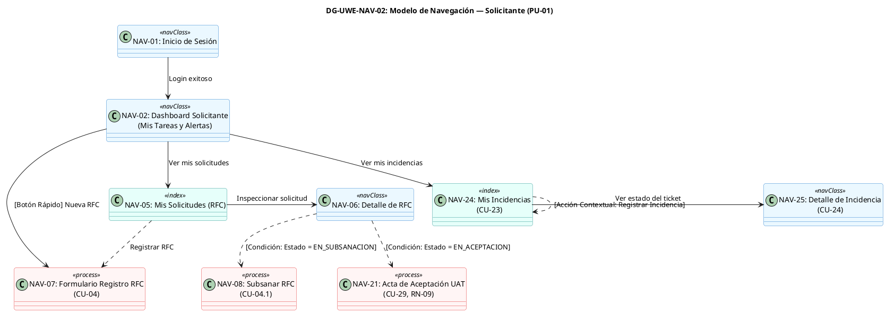

---

### DG-UWE-NAV-03: Modelo de Navegación del Analista de Requerimientos / Gestor (PU-02)

El Analista de Requerimientos / Gestor administra proyectos, clasifica solicitudes, ejerce autorización compartida para Cambios Menores, emite Órdenes de Cambio y deriva incidencias:


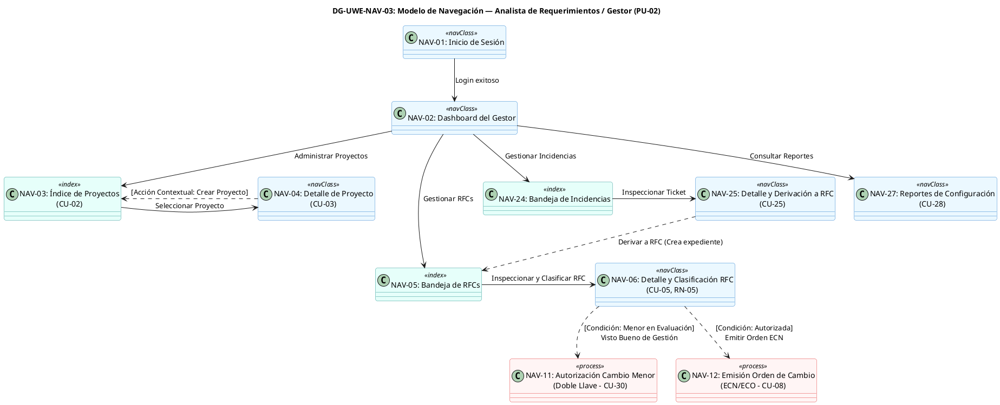

---

### DG-UWE-NAV-04: Modelo de Navegación del Arquitecto / Especialista Técnico (PU-03)

El Arquitecto / Especialista Técnico cataloga nuevos ECS, elabora el Informe Técnico de Impacto y ejerce la conformidad técnica en la autorización delegada de Cambios Menores:


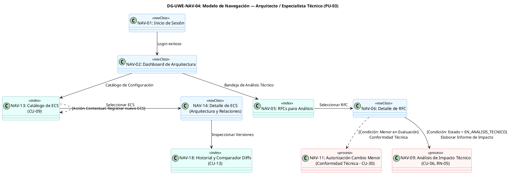

---

### DG-UWE-NAV-05: Modelo de Navegación del Comité de Control de Cambios (CCB) (PU-04)

El CCB delibera y vota colegiadamente sobre Cambios Mayores, emite Órdenes de Cambio, audita pistas forenses e inspecciona reportes consolidados:


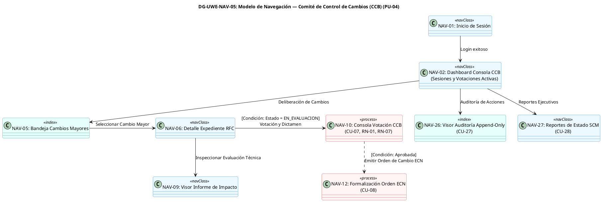

---

### DG-UWE-NAV-06: Modelo de Navegación del Administrador de Configuración / Bibliotecario (PU-05)

El Administrador de Configuración / Bibliotecario es el custodio técnico de las 3 bibliotecas, controla los bloqueos de sincronización (`sync_lock`), ejecuta Check-Out y Check-In, congela Líneas Base, ejecuta rollbacks y gestiona identidades y roles:


```plantuml
@startuml
skinparam shadowing false
skinparam roundcorner 8
skinparam defaultFontName Arial
skinparam packageStyle rectangle

title <b>DG-UWE-NAV-06: Modelo de Navegación — Administrador de Configuración / Bibliotecario (PU-05)</b>

skinparam class {
    BackgroundColor<<navClass>> #EBF8FF
    BorderColor<<navClass>> #3182CE
    BackgroundColor<<index>> #E6FFFA
    BorderColor<<index>> #319795
    BackgroundColor<<process>> #FFF5F5
    BorderColor<<process>> #E53E3E
}

class "NAV-01: Inicio de Sesión" as NAV01 <<navClass>>
class "NAV-02: Dashboard de Configuración (SCM)" as NAV02 <<navClass>>

class "NAV-13: Catálogo de ECS" as NAV13 <<index>>
class "NAV-14: Detalle ECS y Verificación SHA-256\n(CU-26)" as NAV14 <<navClass>>
class "NAV-15: Explorador de Bibliotecas\n(Trabajo, Soporte, Maestra)" as NAV15 <<navClass>>

class "NAV-16: Consola Check-Out\n(CU-10, CU-11, RN-06)" as NAV16 <<process>>
class "NAV-17: Consola Check-In\n(CU-12, RNF-03, RN-09)" as NAV17 <<process>>
class "NAV-18: Historial de Versiones\n(CU-13)" as NAV18 <<index>>

class "NAV-22: Consola Líneas Base\n(CU-20, RN-02, RN-09)" as NAV22 <<process>>
class "NAV-23: Consola de Rollback\n(CU-21, RN-08, RN-06)" as NAV23 <<process>>

class "NAV-28: Gestión Usuarios y Roles\n(CU-01)" as NAV28 <<navClass>>
class "NAV-26: Auditoría Inmutable (CU-27)" as NAV26 <<index>>
class "NAV-27: Reportes de Estado (CU-28)" as NAV27 <<navClass>>

NAV01 -down-> NAV02 : Login exitoso

NAV02 -down-> NAV13 : Catálogo y Bibliotecas
NAV02 -down-> NAV16 : Operaciones Check-Out
NAV02 -down-> NAV17 : Operaciones Check-In
NAV02 -down-> NAV22 : Líneas Base
NAV02 -down-> NAV28 : IAM y Roles
NAV02 -down-> NAV26 : Pistas Forenses
NAV02 -down-> NAV27 : Generar Reportes

NAV13 -right-> NAV14 : Inspeccionar ECS
NAV14 -down-> NAV18 : Ver Historial
NAV14 ..> NAV14 : [Acción: Validar Checksum SHA-256]

NAV16 -down-> NAV15 : Bloquea y Transfiere a Trabajo
NAV17 -down-> NAV15 : Custodia Permanente y Desbloqueo
NAV22 -down-> NAV15 : Congela en Maestra (mayor.menor.parche)
NAV23 -down-> NAV15 : Purga Trabajo y Libera sync_lock

@enduml
```

---

### DG-UWE-NAV-07: Modelo de Navegación del Ingeniero de Software / Desarrollador (PU-06)

El Desarrollador accede a sus órdenes asignadas, obtiene su espacio en la Biblioteca de Trabajo, registra pruebas unitarias locales y corrige defectos reportados por QA:


```plantuml
@startuml
skinparam shadowing false
skinparam roundcorner 8
skinparam defaultFontName Arial
skinparam packageStyle rectangle

title <b>DG-UWE-NAV-07: Modelo de Navegación — Ingeniero de Software / Desarrollador (PU-06)</b>

skinparam class {
    BackgroundColor<<navClass>> #EBF8FF
    BorderColor<<navClass>> #3182CE
    BackgroundColor<<index>> #E6FFFA
    BorderColor<<index>> #319795
    BackgroundColor<<process>> #FFF5F5
    BorderColor<<process>> #E53E3E
}

class "NAV-01: Inicio de Sesión" as NAV01 <<navClass>>
class "NAV-02: Dashboard del Desarrollador\n(Mis Órdenes en Ejecución)" as NAV02 <<navClass>>

class "NAV-12: Mis Órdenes Asignadas (ECN)" as NAV12 <<index>>
class "NAV-15: Mi Espacio de Trabajo\n(Biblioteca de Trabajo - CU-14)" as NAV15 <<navClass>>
class "NAV-18: Historial de Versiones ECS\n(CU-13)" as NAV18 <<index>>
class "NAV-20: Bandeja de No Conformidades QA\n(CU-18, CU-19)" as NAV20 <<navClass>>

NAV01 -down-> NAV02 : Login exitoso

NAV02 -down-> NAV12 : Ver Órdenes ECN
NAV02 -down-> NAV20 : Defectos Asignados

NAV12 -right-> NAV15 : [Condición: Check-Out realizado]\nAcceder a Código Fuente
NAV15 -down-> NAV18 : Comparar con versión estable
NAV15 ..> NAV15 : [Acción Contextual: Registrar Pruebas Unitarias CU-15]
NAV20 ..> NAV15 : Corregir defecto y preparar re-testeo

@enduml
```

---

### DG-UWE-NAV-08: Modelo de Navegación del Equipo de Calidad / Testing (PU-07)

El Equipo de Calidad / Testing valida las órdenes en fase de pruebas sobre la Biblioteca de Soporte, emite certificaciones de conformidad bajo Segregación de Funciones (SoD) y reporta no conformidades:


```plantuml
@startuml
skinparam shadowing false
skinparam roundcorner 8
skinparam defaultFontName Arial
skinparam packageStyle rectangle

title <b>DG-UWE-NAV-08: Modelo de Navegación — Equipo de Calidad / Testing (PU-07)</b>

skinparam class {
    BackgroundColor<<navClass>> #EBF8FF
    BorderColor<<navClass>> #3182CE
    BackgroundColor<<index>> #E6FFFA
    BorderColor<<index>> #319795
    BackgroundColor<<process>> #FFF5F5
    BorderColor<<process>> #E53E3E
}

class "NAV-01: Inicio de Sesión" as NAV01 <<navClass>>
class "NAV-02: Dashboard de QA\n(Órdenes Pendientes de Certificación)" as NAV02 <<navClass>>

class "NAV-12: Órdenes en Pruebas (ECN)" as NAV12 <<index>>
class "NAV-19: Consola de Validación QA\n(Pruebas de Integración - CU-16)" as NAV19 <<navClass>>
class "NAV-20: Formulario de No Conformidad\n(CU-18)" as NAV20 <<process>>

NAV01 -down-> NAV02 : Login exitoso

NAV02 -down-> NAV12 : Órdenes para Testing (Estado = EN_PRUEBAS)
NAV12 -right-> NAV19 : Ejecutar Validación Técnica

NAV19 ..> NAV20 : [Prueba Fallida]\nReportar No Conformidad (CU-18)
NAV19 ..> NAV19 : [Prueba Conforme]\nCertificar Conformidad con SoD (CU-17)\n(Pasa a EN_ACEPTACION)
NAV20 ..> NAV19 : Reevaluar y re-testear (CU-19)

@enduml
```

---

## 19.5 Navegación Condicionada por Estados del Ciclo de Vida (TB-07)

La navegación y habilitación de acciones en TraceFlow SCM depende estrictamente del estado canónico del expediente de RFC. La siguiente matriz formaliza la disponibilidad de accesos para cada uno de los **14 estados oficiales de TB-07**:

| Estado RFC (TB-07) | Actor(es) Canónico(s) Autorizado(s) | Acción Navegacional Habilitada | Nodo Origen | Nodo Destino | Regla de Negocio / Criterio de Transición |
| :--- | :--- | :--- | :---: | :---: | :--- |
| **1. Registrada** | Analista de Requerimientos / Gestor | Validar completitud y clasificar | `NAV-05` | `NAV-06` | Filtro formal de admisión inicial (`CU-05`). |
| **2. En Subsanación** | Solicitante | Subsanar observaciones de solicitud | `NAV-06` | `NAV-08` | Solicitante subsana datos observados (`CU-04.1`). Retorna a revisión. |
| **3. Clasificada** | Arquitecto / Especialista Técnico | Iniciar análisis técnico de impacto | `NAV-05` | `NAV-06` $\rightarrow$ `NAV-09` | Superó filtro inicial; admitida para evaluación técnica (`CU-06`). |
| **4. En Análisis Técnico** | Arquitecto / Especialista Técnico | Registrar Informe Técnico de Impacto | `NAV-06` | `NAV-09` | Evalúa arquitectura, dependencias y Triple Restricción (`RN-05`). |
| **5. En Evaluación (Mayor)** | Comité de Control de Cambios (CCB) | Deliberar y emitir dictamen colegiado | `NAV-06` | `NAV-10` | Votación colegiada con quórum y mayoría calificada (`CU-07, RN-01`). |
| **5. En Evaluación (Menor)** | Gestor Y Arquitecto (Doble Llave) | Autorizar cambio menor por vía delegada| `NAV-06` | `NAV-11` | Exige concurrencia de ambos vistos buenos (`CU-30, RN-01, RN-05`). |
| **6. Autorizada** | CCB / Analista de Requerimientos | Formalizar y emitir Orden de Cambio | `NAV-06` | `NAV-12` | Habilita asignación de desarrollador y emisión de ECN (`CU-08`). |
| **7. Orden Emitida** | Administrador de Configuración | Ejecutar Check-Out con bloqueo activo | `NAV-12` | `NAV-16` | Adquiere `sync_lock` (ACTIVE) y copia ECS a Trabajo (`CU-10, RN-06`). |
| **8. En Implementación** | Ingeniero de Software / Desarrollador | Modificar ECS y pruebas unitarias | `NAV-12` | `NAV-15` | Trabajo técnico local sobre copia autorizada (`CU-14, CU-15`). |
| **8. En Implementación (Fin)**| Administrador de Configuración | Check-In Técnico (Trabajo $\rightarrow$ Soporte)| `NAV-15` | `NAV-17` | Entrega de artefacto a Biblioteca de Soporte para QA (`CU-12`). |
| **9. En Pruebas** | Equipo de Calidad / Testing | Ejecutar integración y certificar QA | `NAV-12` | `NAV-19` | Valida pruebas. Si aprueba, emite conformidad técnica con SoD (`CU-17`). |
| **9. En Pruebas (Fallo)** | Equipo de Calidad / Testing | Reportar no conformidad técnica | `NAV-19` | `NAV-20` | Registra defectos para corrección por el desarrollador (`CU-18, CU-19`). |
| **10. En Aceptación** | Solicitante (Usuario Final) | Suscribir Acta de Aceptación UAT | `NAV-06` | `NAV-21` | Valida en entorno controlado previo a la liberación (`CU-29, RN-09`). |
| **10. En Aceptación (Fin)** | Administrador de Configuración | Check-In Definitivo (Soporte $\rightarrow$ Maestra)| `NAV-21` | `NAV-17` $\rightarrow$ `NAV-22`| Exige Doble Conformidad (QA+UAT). Congela Línea Base (`CU-12, CU-20`). |
| **11. Desestimada** | Analista de Requerimientos / Gestor | Cierre formal por inviabilidad inicial | `NAV-06` | Terminal | Solicitud improcedente o plazo de subsanación vencido (`CU-05, RN-07`). |
| **12. Rechazada** | CCB / Autoridad Delegada | Cierre formal por dictamen negativo | `NAV-10` / `NAV-11` | Terminal | Rechazo técnico o de gestión fundamentado (`CU-07, CU-30, RN-07`). |
| **13. Cancelada** | Administrador de Configuración | Rollback y cancelación de orden | `NAV-23` | Terminal | Fallo no subsanado en re-test o rechazo UAT; purga Trabajo (`CU-21, RN-08`). |
| **14. Implementada** | Administrador de Configuración / CCB | Cierre formal exitoso | `NAV-22` | Terminal | Doble conformidad, Línea Base congelada y bloqueo liberado (`RF-14, RN-07`). |

---

## 19.6 Control de Acceso Navegacional vs Seguridad Backend (RBAC/SoD)

Para garantizar un diseño de ciberseguridad sólido y cumplir rigurosamente con los principios arquitectónicos aprobados en **ADR-006**:
1. **Frontend (Capa de Presentación SPA — Experiencia y Ergonomía)**:
   - **Ocultamiento de Menús (`RoleBasedSidebar`)**: Los elementos de navegación que no correspondan al rol del usuario autenticado no se renderizan, reduciendo la carga cognitiva y evitando rutas inválidas.
   - **Route Guards Preventivos (`ProtectedRoute`)**: Interceptan navegaciones directas por URL en el cliente (e.g. acceso forzado a `/changes/:id/ccb-deliberation` por un desarrollador), redirigiendo a una vista de error amigable.
   - **Principio Fundamental**: *Ocultar o deshabilitar un enlace visual NO constituye seguridad*.
2. **Backend (Capa de Aplicación y Dominio — Seguridad Autoritativa Inviolable)**:
   - **Verificación Autoritativa por Guards de NestJS**: Toda petición HTTP entrante es interceptada secuencialmente por `AuthGuard` (valida sesión opaca activa), `RolesGuard` (valida rol canónico RBAC) y `SodGuard` (evalúa segregación dinámica de funciones en base de datos).
   - **Bloqueo Inviolable de Violaciones**: Aunque un usuario intente enviar una solicitud manipulada (mediante Postman, cURL o manipulación del DOM), el backend rechazará la operación con `401 Unauthorized` o `403 Forbidden`, registrando de inmediato un evento de sospecha en `audit_log`.

---

## 19.7 Matriz de Cobertura y Trazabilidad (CU ↔ Navegación ↔ API ↔ Módulos)

A continuación se demuestra la **cobertura del 100% de los 31 Casos de Uso del SRS de Análisis**, vinculando cada caso con su actor, su recorrido navegacional, su endpoint de API y su módulo responsable:

| CU | Nombre Caso de Uso (Baseline) | Actor Principal (TB-10) | Nodo Origen | Acción Navegacional | Nodo Destino | Resultado en UI | Endpoint API-DRAFT-v0.2 | Módulo |
| :---: | :--- | :--- | :---: | :--- | :---: | :--- | :--- | :---: |
| **CU-01** | Gestionar usuarios y roles | Administrador / Bibliotecario | `NAV-02` | Accede a IAM | `NAV-28` | Directorio de usuarios y asignación RBAC | `/api/v1/users` | MOD-01 |
| **CU-02** | Crear y administrar proyectos | Analista de Requerimientos / Gestor | `NAV-02` | Accede a Proyectos | `NAV-03` | Directorio de proyectos y modal de creación | `/api/v1/projects` | MOD-02 |
| **CU-03** | Consultar proyecto | Gestor, CCB, Bibliotecario | `NAV-03` | Selecciona proyecto | `NAV-04` | Ficha técnica y catálogo de ECS del proyecto | `/api/v1/projects/{id}` | MOD-02 |
| **CU-04** | Registrar Solicitud de Cambio (RFC) | Solicitante | `NAV-02` / `NAV-05` | Clic en "Nueva RFC" | `NAV-07` | Formulario de registro completado | `/api/v1/rfcs` | MOD-04 |
| **CU-04.1**| Subsanar Solicitud de Cambio (RFC) | Solicitante | `NAV-06` | Clic en "Subsanar" | `NAV-08` | Formulario de corrección enviado | `/api/v1/rfcs/{id}/rectification` | MOD-04 |
| **CU-05** | Validar y clasificar la solicitud | Analista de Requerimientos / Gestor | `NAV-05` | Selecciona RFC | `NAV-06` | Formulario contextual de clasificación | `/api/v1/rfcs/{id}/classify` | MOD-04 |
| **CU-06** | Realizar análisis de impacto técnico | Arquitecto / Especialista Técnico | `NAV-06` | Clic "Evaluar Impacto"| `NAV-09` | Informe de Impacto registrado | `/api/v1/rfcs/{id}/impact-assessment` | MOD-04 |
| **CU-07** | Evaluar viabilidad y dictaminar (CCB) | Comité de Control de Cambios (CCB) | `NAV-06` | Inicia Deliberación | `NAV-10` | Consola de votación y resolución oficial | `/api/v1/rfcs/{id}/ccb-resolution` | MOD-04 |
| **CU-08** | Emitir Orden de Cambio (ECN/ECO) | CCB / Gestor | `NAV-06` / `NAV-10` | Clic "Emitir ECN" | `NAV-12` | Ficha de Orden de Cambio formalizada | `/api/v1/rfcs/{id}/change-order` | MOD-04 |
| **CU-09** | Registrar ECS | Arquitecto / Especialista Técnico | `NAV-04` / `NAV-13` | Clic "Nuevo ECS" | `NAV-13` (Modal)| ECS registrado en catálogo del proyecto | `/api/v1/projects/{id}/ecs` | MOD-03 |
| **CU-10** | Efectuar Check-Out (Soporte → Trabajo)| Administrador / Bibliotecario | `NAV-12` | Clic "Check-Out" | `NAV-16` | ECS transferido a Trabajo y asignado a Dev | `/api/v1/ecs/{id}/check-out` | MOD-05 |
| **CU-11** | Aplicar bloqueo de sincronización | Administrador / Bibliotecario | `NAV-16` | *Atómico en CU-10* | `NAV-16` | Bloqueo `sync_lock` (ACTIVE) en PostgreSQL| `/api/v1/ecs/{id}/check-out` | MOD-05 |
| **CU-12** | Efectuar Check-In (Trabajo → Soporte/Maestra)| Administrador / Bibliotecario | `NAV-15` | Clic "Check-In" | `NAV-17` | Archivo verificado SHA-256 y promovido | `/api/v1/ecs/{id}/check-in` | MOD-05 |
| **CU-13** | Consultar historial de versiones | Bibliotecario, Gestor, Dev, Arquitecto| `NAV-14` | Clic "Historial" | `NAV-18` | Línea de tiempo cronológica y diffs | `/api/v1/ecs/{id}/versions` | MOD-05 |
| **CU-14** | Implementar cambio en el ECS | Ingeniero de Software / Desarrollador | `NAV-12` | Clic "Ir a Trabajo" | `NAV-15` | Archivo descargado / modificado en Trabajo | `/api/v1/ecs/{id}/workspace-draft` | MOD-05 |
| **CU-15** | Ejecutar pruebas unitarias locales | Ingeniero de Software / Desarrollador | `NAV-15` | Acción Contextual | `NAV-15` | Registro local de suite unitaria aprobado | `/api/v1/change-orders/{id}/unit-tests` | MOD-06 |
| **CU-16** | Ejecutar pruebas de integración | Equipo de Calidad / Testing | `NAV-12` | Clic "Iniciar QA" | `NAV-19` | Tablero de pruebas de integración activo | `/api/v1/change-orders/{id}/integration-tests`| MOD-06 |
| **CU-17** | Certificar conformidad del cambio | Equipo de Calidad / Testing | `NAV-19` | Clic "Certificar QA" | `NAV-19` | Certificado de Conformidad emitido (con SoD)| `/api/v1/change-orders/{id}/qa-certification` | MOD-06 |
| **CU-18** | Reportar no conformidad | Equipo de Calidad / Testing | `NAV-19` | Clic "Reportar Defecto"|`NAV-20` | No conformidad registrada y ECN en corrección| `/api/v1/change-orders/{id}/non-conformity`| MOD-06 |
| **CU-19** | Reevaluar y re-testear | Equipo de Calidad / Testing | `NAV-20` | Clic "Re-testear" | `NAV-19` | Re-testeo ejecutado y actualizado | `/api/v1/change-orders/{id}/retest` | MOD-06 |
| **CU-20** | Crear y congelar línea base | Administrador / Bibliotecario | `NAV-04` / `NAV-21` | Clic "Congelar LB" | `NAV-22` | Línea base inmutable congelada (`RN-02`) | `/api/v1/projects/{id}/baselines` | MOD-07 |
| **CU-21** | Ejecutar rollback en Biblioteca Trabajo | Administrador / Bibliotecario | `NAV-19` / `NAV-21` | Clic "Rollback" | `NAV-23` | Copia de Trabajo purgada y lock liberado | `/api/v1/change-orders/{id}/rollback` | MOD-07 |
| **CU-22** | Cancelar Orden de Cambio | Administrador / Bibliotecario | `NAV-23` | Clic "Cancelar ECN" | `NAV-12` | Orden cancelada y expediente formalizado | `/api/v1/change-orders/{id}/cancel` | MOD-04 |
| **CU-23** | Registrar incidencia | Solicitante | `NAV-02` / `NAV-24` | Clic "Nuevo Ticket" | `NAV-24` (Modal)| Ticket de incidencia registrado | `/api/v1/projects/{id}/incidents` | MOD-08 |
| **CU-24** | Consultar estado de ticket | Solicitante, Gestor | `NAV-24` | Selecciona ticket | `NAV-25` | Ficha técnica de estado de incidencia | `/api/v1/incidents/{id}` | MOD-08 |
| **CU-25** | Derivar incidencia a RFC | Analista de Requerimientos / Gestor | `NAV-25` | Clic "Derivar a RFC"| `NAV-05` $\rightarrow$ `NAV-06`| RFC creada y vinculada a la incidencia | `/api/v1/incidents/{id}/derive-rfc` | MOD-08 |
| **CU-26** | Validar integridad (checksum) | Administrador / Bibliotecario | `NAV-14` / `NAV-18` | Clic "Verificar Hash"| `NAV-14` (Modal)| Hash SHA-256 verificado en tiempo real | `/api/v1/ecs/{id}/versions/{vId}/verify`| MOD-03 |
| **CU-27** | Auditar acciones del sistema | Comité de Control de Cambios, Bibliotecario| `NAV-02` | Accede a Auditoría | `NAV-26` | Registro inmutable append-only filtrado | `/api/v1/audit/logs` | MOD-09 |
| **CU-28** | Generar reportes de estado | Bibliotecario, CCB, Gestor | `NAV-02` | Accede a Reportes | `NAV-27` | Reporte SCM exportado en PDF/CSV | `/api/v1/reports/status` | MOD-09 |
| **CU-29** | Validar aceptación del usuario (UAT)| Solicitante (Usuario Final) | `NAV-06` | Clic "Evaluar UAT" | `NAV-21` | Acta de Aceptación suscrita formalmente | `/api/v1/change-orders/{id}/uat-acceptance`| MOD-06 |
| **CU-30** | Autorizar Cambio Menor (Vía Delegada)| Gestor Y Arquitecto (Doble Llave) | `NAV-06` | Clic "Autorizar Menor"| `NAV-11` | Visto bueno registrado; autoriza si ambos aprueban| `/api/v1/rfcs/{id}/authorizations` | MOD-04 |