# Sistema de Gestión de Configuración de Software - TraceFlow SCM

> **Documento de Arquitectura de Software (SAD) — Fase de Diseño**  
> **Versión:** 0.1 (Borrador de Diseño Controlado)  
> **Fecha:** Octubre 2026  
> **Estado:** BORRADOR DE DISEÑO v0.1 (En proceso de revisión — No congelado como Baseline)  
> **Repositorio Oficial:** `TraceFlow`  
> **Organización Cliente:** ÉXODO S.A.C.  
> **Equipo de Desarrollo:** C-SharkTeam  

---

```
========================================================================================
                      UNIVERSIDAD PRIVADA DE TACNA
                         FACULTAD DE INGENIERÍA
              ESCUELA PROFESIONAL DE INGENIERÍA DE SISTEMAS

        "Sistema de Gestión de Configuración de Software - TraceFlow SCM"
              DOCUMENTO DE ARQUITECTURA DE SOFTWARE (SAD)
                            FASE DE DISEÑO

    Curso:   Gestión de la Configuración de Software
    Docente: Dr. RICARDO EDUARDO VALCARCEL ALVARADO

    Autores (C-SharkTeam):
      - ANTAYHUA MAMANI, Renzo Antonio       (2022073504)
      - MEDINA QUISPE, Joan Cristian         (2022074255)
      - LOYOLA VILCA CHOQUE, Renzo Fernando  (2021072615)
      - RIVERA MUÑOZ, Augusto Joaquin        (2022073505)

                               TACNA — PERÚ
                                   2026
========================================================================================
```

---

## Control de Versiones

| Versión | Hecha por | Revisada por | Aprobada por | Fecha | Motivo |
| :---: | :--- | :--- | :--- | :---: | :--- |
| **0.1** | C-SharkTeam (JCM / RAA / RFL / AJR) | Dr. Ricardo Valcarcel Alvarado | Dr. Ricardo Valcarcel Alvarado | 01/10/2026 | Emisión inicial del SAD de Diseño (Borrador Controlado v0.1) a partir de las Baselines de Análisis (FD03 v1.0, FD04 v1.1) y los registros de decisión aprobados (ADR-001 a ADR-010). |

---

## Índice General

1. [Introducción](#1-introducción)
   - 1.1 Propósito
   - 1.2 Alcance
   - 1.3 Relación con SRS/SAD de Análisis y Jerarquía de Autoridad
   - 1.4 Relación con las Decisiones Arquitectónicas (ADR-001 a ADR-010)
   - 1.5 Convenciones Documentales y de Notación
2. [Baseline Tecnológica de Diseño](#2-baseline-tecnológica-de-diseño)
   - 2.1 Decisiones Arquitectónicas Aprobadas (ADR-001 a ADR-010)
   - 2.2 Separación entre Decisiones Arquitectónicas y Versiones de Implementación
3. [Arquitectura Física de Software](#3-arquitectura-física-de-software)
   - 3.1 Topología Física General y Flujo de Peticiones
   - 3.2 Diagrama DG-D01: Arquitectura Física de TraceFlow SCM
   - 3.3 Delimitación de Componentes Físicos
4. [Arquitectura del Backend (Monolito Modular)](#4-arquitectura-del-backend-monolito-modular)
   - 4.1 Mapeo de Módulos Conceptuales a Módulos Técnicos NestJS
   - 4.2 Anatomía Interna de Módulo Técnico
   - 4.3 Reglas Estrictas de Aislamiento y Colaboración Intermodular
   - 4.4 Diagrama DG-D02: Componentes del Monolito Modular
5. [Capas Arquitectónicas (Clean Architecture / Hexagonal)](#5-capas-arquitectónicas-clean-architecture--hexagonal)
   - 5.1 Definición de las Cuatro Capas
   - 5.2 Regla de Dependencia Unidireccional e Inversión de Control
6. [Arquitectura del Frontend (React SPA)](#6-arquitectura-del-frontend-react-spa)
   - 6.1 Estructura Modular de Carpetas
   - 6.2 Enrutamiento, Layouts y Protección por Rol
   - 6.3 Gestión de Estado, Consumo de API y Manejo de Errores
7. [Modelo de Datos de Diseño (Relacional Lógico)](#7-modelo-de-datos-de-diseño-relacional-lógico)
   - 7.1 Derivación Exhaustiva desde el Modelo Conceptual DG-12
   - 7.2 Diagrama DG-D03: Modelo Relacional Lógico de TraceFlow SCM
   - 7.3 Especificación de Tablas, Claves, Restricciones y Estados
   - 7.4 Diseño Técnico del Bloqueo de Sincronización (RN-06)
8. [Diseño de Custodia de ECS (StoragePort & Bibliotecas)](#8-diseño-de-custodia-de-ecs-storageport--bibliotecas)
   - 8.1 Interfaz de Dominio StoragePort
   - 8.2 Adaptador LocalStorageAdapter y Estructura en Disco
   - 8.3 Diagrama DG-D04: Arquitectura de Storage y Bibliotecas
   - 8.4 Protocolo de Transacciones por Etapas y Reconciliación
9. [Diseño de API REST](#9-diseño-de-api-rest)
   - 9.1 Matriz de Correspondencia Casos de Uso (CU-01 a CU-30, CU-04.1) vs Operaciones API
   - 9.2 Catálogo Preliminar API-DRAFT-v0.1
   - 9.3 Formato Estándar de Errores (RFC 7807)
10. [Diseño de Seguridad](#10-diseño-de-seguridad)
    - 10.1 Separación entre Autenticación, Autorización y Segregación de Funciones
    - 10.2 Flujo Técnico de Autenticación y Sesión Opaca en Servidor
    - 10.3 Diagrama DG-D05: Flujo Técnico de Autenticación y Autorización
    - 10.4 Parámetros de Seguridad de Diseño (Timeout de 15 Minutos)
11. [Auditoría y Trazabilidad](#11-auditoría-y-trazabilidad)
    - 11.1 Modelo Append-Only en PostgreSQL y Triggers de Inmutabilidad
    - 11.2 Estructura del Registro de Auditoría y Encadenamiento SHA-256
12. [Secuencias de Diseño Técnicas (DG-DSEQ-XX)](#12-secuencias-de-diseño-técnicas-dg-dseq-xx)
    - 12.1 Convenciones y Participantes de Diseño
    - 12.2 Diagramas Críticos (DG-DSEQ-04, 08, 10, 12, 17, 20, 21, 29, 30)
13. [Arquitectura de Despliegue](#13-arquitectura-de-despliegue)
    - 13.1 Topología Docker y Contenedores Multi-Stage
    - 13.2 Diagrama DG-D06: Deployment Diagram
    - 13.3 Análisis de Disponibilidad: Proceso vs Falla Física de Host
14. [Estrategia de Backup y Recuperación (RNF-09)](#14-estrategia-de-backup-y-recuperación-rnf-09)
    - 14.1 Definición de la Unidad Lógica de Respaldo
    - 14.2 Protocolo Automatizado de Respaldo y Verificación SHA-256
    - 14.3 Parámetros Operativos de Diseño (Horarios, Retención, RTO)
15. [Observabilidad](#15-observabilidad)
    - 15.1 Logging Estructurado, Health Checks y Métricas
    - 15.2 Alertas Operativas y de Integridad
16. [Matriz de Trazabilidad de Diseño](#16-matriz-de-trazabilidad-de-diseño)
    - 16.1 Trazabilidad Componente -> ADR -> MOD -> RF -> RNF -> RN -> CU
17. [Decisiones Pendientes para la Baseline de Implementación](#17-decisiones-pendientes-para-la-baseline-de-implementación)
18. [Auditoría SAD de Diseño v0.1](#18-auditoría-sad-de-diseño-v01)

---

# 1. Introducción

## 1.1 Propósito
El presente **Documento de Arquitectura de Software — Fase de Diseño (SAD de Diseño, FD05)** tiene por objeto definir la arquitectura técnica detallada, física, modular, de datos, interfaces y despliegue del sistema **TraceFlow SCM**, transformando el modelo conceptual aprobado en la fase de análisis en especificaciones técnicas de ingeniería implementables, verificables y listas para la fase de construcción.

El documento provee las pautas definitivas para el equipo de desarrollo (C-SharkTeam), asegurando que cada componente de software, tabla relacional, endpoint REST, puerto de almacenamiento y mecanismo de seguridad responda con precisión matemática a los requerimientos funcionales, no funcionales y reglas de negocio del sistema.

## 1.2 Alcance
El alcance de este documento abarca la especificación técnica completa de los 9 módulos de software de TraceFlow SCM:
- **MOD-01**: Gestión de Identidades, Acceso y Roles (IAM / RBAC / SoD)
- **MOD-02**: Gestión de Proyectos y Gobernanza
- **MOD-03**: Control de Configuración y Elementos de Configuración (ECS)
- **MOD-04**: Gestión de Cambios y Solicitudes de Cambio (RFC / CCB / ECN)
- **MOD-05**: Control de Versiones y Bloqueo de Sincronización (Check-Out / Check-In)
- **MOD-06**: Verificación, Pruebas y Aseguramiento de Calidad (QA / UAT)
- **MOD-07**: Gestión de Líneas Base y Rollback
- **MOD-08**: Gestión de Incidencias y Trazabilidad a Cambios
- **MOD-09**: Auditoría, Reportes e Integridad Forense

El diseño comprende la interfaz de usuario en Single Page Application (SPA), los servicios de aplicación y dominio del backend monolítico modular, los esquemas relacionales lógicos de base de datos, el protocolo de custodia física de artefactos, la especificación de contratos de API RESTful, las secuencias de diseño de interacción técnica entre objetos y la infraestructura de contenerización y respaldo operacional.

## 1.3 Relación con SRS/SAD de Análisis y Jerarquía de Autoridad
La arquitectura de diseño se rige por una jerarquía estricta de fuentes de verdad:

```
[Nivel 1] Baselines de Análisis Aprobadas
          ├── FD03-EPIS-Informe_SRS.md (v1.0 Baseline SRS)
          │     ├── docs/TABLES.md (TB-01 a TB-14 - SSOT de Datos)
          │     └── docs/DIAGRAMS.md (DG-01 a DG-12, DG-AO-01..30, DG-SEQ-01..30)
          └── FD04-EPIS-Informe_SAD_Analisis.md (v1.1 Baseline SAD Análisis)
                      ↓
[Nivel 2] Decisiones Arquitectónicas Aprobadas
          └── docs/adr/ (ADR-001 a ADR-010 y README.md)
                      ↓
[Nivel 3] Documento de Arquitectura de Software — Fase de Diseño
          └── FD05-EPIS-Informe_SAD_Diseno.md (v0.1 Borrador Controlado)
```

### Regla Fundamental de No Divergencia Silenciosa:
1. Las **Baselines de Análisis** constituyen la referencia funcional congelada e inmutable de TraceFlow SCM (18 RF, 9 RNF, 9 RN, 31 CU, 9 MOD, 7 actores canónicos, 14 estados de RFC y 3 bibliotecas).
2. El SAD de Diseño **no puede alterar el alcance funcional ni inventar requerimientos o casos de uso**.
3. Si durante la fase de diseño se identificase una necesidad técnica que contradiga o expanda la baseline de análisis, queda terminantemente prohibido modificar silenciosamente los requerimientos. Dicho cambio deberá catalogarse formalmente como:
   $$\mathbf{IMPACTO\ EN\ BASELINE\ \Longrightarrow\ REQUIERE\ RFC\ Y\ APROBACIcute{O}N\ DEL\ CCB}$$

## 1.4 Relación con las Decisiones Arquitectónicas (ADR-001 a ADR-010)
Los registros de decisión técnica aprobados (`docs/adr/`) constituyen el fundamento oficial que sustenta las elecciones de ingeniería de este SAD de Diseño:
- **ADR-001**: Establece el estilo global de Monolito Modular.
- **ADR-002**: Establece el frontend SPA basado en React, TypeScript y Vite.
- **ADR-003**: Establece el backend sobre Node.js 24 LTS, TypeScript y NestJS.
- **ADR-004**: Establece PostgreSQL como motor relacional transaccional.
- **ADR-005**: Establece la custodia híbrida de ECS mediante la interfaz `StoragePort`.
- **ADR-006**: Establece autenticación por sesión opaca en servidor con Cookie `HttpOnly` y Guards RBAC/SoD.
- **ADR-007**: Establece el bloqueo lógico persistente en base de datos con restricción condicional (RN-06).
- **ADR-008**: Establece la tabla append-only en PostgreSQL con integridad hash SHA-256 para auditoría.
- **ADR-009**: Establece la API RESTful sobre HTTPS, DTOs JSON y contratos OpenAPI 3.0.
- **ADR-010**: Establece la contenerización Docker multi-stage y la Unidad Lógica de Respaldo (`DB + Storage + Manifest`).

## 1.5 Convenciones Documentales y de Notación
- **Modelado Visual**: Los diagramas arquitectónicos y secuencias técnicas emplean la notación UML 2.5 y diagramas de componentes/despliegue estilizados mediante PlantUML.
- **Identificadores Técnicos**:
  - `DG-D01` a `DG-D06`: Diagramas Arquitectónicos de Diseño.
  - `DG-DSEQ-XX`: Diagramas de Secuencia Técnicos de Diseño.
- **Contratos de Datos**: Se expresan mediante tipos de TypeScript y esquemas conformes a OpenAPI 3.0.
- **Gestión de Errores**: Todas las respuestas de fallo de la API cumplen con el estándar internacional RFC 7807 (*Problem Details for HTTP APIs*).

---

# 2. Baseline Tecnológica de Diseño

## 2.1 Decisiones Arquitectónicas Aprobadas (ADR-001 a ADR-010)
En cumplimiento de la gobernanza técnica de TraceFlow SCM, la siguiente tabla consolida las decisiones formalmente aprobadas:

| Identificador | Decisión Técnica Aprobada | Resumen Arquitectónico | Estado Formal |
| :---: | :--- | :--- | :---: |
| **ADR-001** | **Monolito Modular** | Despliegue en un único artefacto backend estructurado internamente en 9 módulos fuertemente desacoplados (MOD-01 a MOD-09), garantizando transacciones ACID locales y eliminando la latencia de red inter-servicio. | **APROBADO** |
| **ADR-002** | **React + TypeScript + Vite SPA** | Interfaz de usuario interactiva como cliente enriquecido estático consumiendo la API REST. Desacoplada de servidor frontend (sin SSR) por ser una aplicación interna para 7 actores autenticados. | **APROBADO** |
| **ADR-003** | **Node.js (LTS) + TypeScript + NestJS** | Backend basado en NestJS sobre Node.js 24 LTS con inyección de dependencias, tipado estricto, decoradores declarativos y soporte nativo de modularidad y OpenAPI. | **APROBADO** |
| **ADR-004** | **PostgreSQL Relacional Transaccional** | Motor relacional unificado para la persistencia transaccional de metadatos, soporte nativo de índices condicionales parciales y columnas JSONB para auditoría. | **APROBADO** |
| **ADR-005** | **Custodia Híbrida y Puerto `StoragePort`** | Separación entre metadatos (PostgreSQL) y contenido físico de ECS desacoplado mediante una interfaz abstracta `StoragePort`. Adaptador inicial de sistema de archivos local (`LocalStorageAdapter`). | **APROBADO** |
| **ADR-006** | **Cookie HttpOnly + Sesión Opaca en Servidor** | Gestión de sesiones seguras inmunes a XSS mediante Cookie `HttpOnly` (`SameSite=Strict`), revocación instantánea en base de datos, inactividad de 15 minutos y Guards de autorización RBAC y SoD. | **APROBADO** |
| **ADR-007** | **Bloqueo Persistente Condicional (RN-06)** | Bloqueo pesimista exclusivo a nivel de motor mediante índice único condicional en PostgreSQL. Liberación permitida exclusivamente mediante Check-In (CU-12), Rollback (CU-21) o Cancelación (CU-22). | **APROBADO** |
| **ADR-008** | **Auditoría Append-Only en PostgreSQL** | Registro inmutable de eventos con revocación de privilegios `UPDATE` y `DELETE` para el usuario de aplicación, triggers de inmutabilidad y encadenamiento criptográfico con SHA-256. | **APROBADO** |
| **ADR-009** | **API RESTful + JSON + OpenAPI 3.0** | Comunicación estandarizada sobre HTTPS, verbos semánticos, errores RFC 7807 y especificación OpenAPI generada automáticamente a partir del código. | **APROBADO** |
| **ADR-010** | **Docker Multi-Stage + Unidad de Respaldo** | Empaquetado reproducible en contenedores OCI, orquestación por Docker Compose con reverse proxy Nginx, réplicas stateless y respaldo consistente de la Unidad Lógica (`DB + Storage + Manifest`). | **APROBADO** |

## 2.2 Separación entre Decisiones Arquitectónicas y Versiones de Implementación
Para garantizar una arquitectura duradera y evitar la obsolescencia técnica documental, se delimitan estrictamente los dos niveles de decisión:

### A. Decisiones Arquitectónicas (Paradigmas, Patrones y Estándares)
- **Estilo de Sistema**: Monolito Modular con arquitectura Hexagonal / Puertos y Adaptadores por módulo.
- **Presentación Web**: Single Page Application (SPA) con renderizado puramente en cliente (*Client-Side Rendering*).
- **Paradigma de Backend**: Programación Orientada a Objetos, Inversión de Control (IoC), Inyección de Dependencias (DI) y Controladores REST.
- **Paradigma de Persistencia**: Base de datos relacional conforme a Codd (ACID), integridad referencial estricta y modelos semiestructurados indexables.
- **Almacenamiento de Artefactos**: Abstracción mediante Puerto de Dominio (`StoragePort`), escritura por etapas con reconciliación.
- **Protocolo de Seguridad**: Sesión con identificador opaco en servidor, transporte protegido mediante Cookies cifradas y directivas `SameSite=Strict`.
- **Concurrencia**: Bloqueo pesimista lógico respaldado por restricciones declarativas de base de datos.
- **Contratos e Intercambio**: RESTful JSON, esquemas fuertemente tipados y especificaciones OpenAPI 3.x.
- **Infraestructura Operativa**: Contenedores inmutables basados en estándares OCI y proxy inverso para terminación TLS.

### B. Versiones de Implementación Recomendadas (Ciclo de Vida Activo)
| Componente Tecnológico | Versión Recomendada para la Baseline Técnica | Ciclo de Vida / Horizonte de Soporte Oficial |
| :--- | :--- | :--- |
| **Runtime Backend** | **Node.js 24 LTS** | Versión LTS activa con soporte extendido de seguridad hasta 2028+. |
| **Lenguaje de Programación** | **TypeScript 5.x** | Tipado estricto (`strict: true`) en frontend y backend. |
| **Framework Backend** | **NestJS 10.x / 11.x** | Soporte empresarial activo y compatibilidad completa con OpenAPI. |
| **Motor de Base de Datos** | **PostgreSQL 16 o 17 (versión mayor soportada)** | Ciclo de vida comunitario oficial activo hasta noviembre 2028 / 2029. |
| **Librería Frontend UI** | **React 18 o 19 (versión mayor soportada)** | Ecosistema probado, compatible con herramientas de formularios y UI. |
| **Empaquetador Frontend** | **Vite 5.x / 6.x** | Bundler estándar de alta velocidad basado en Rollup y esbuild. |
| **Reverse Proxy / Servidor Web** | **Nginx 1.26+ (Stable / Mainline)** | Servidor de terminación SSL/TLS, proxy inverso y entrega de estáticos. |
| **Motor de Contenedores** | **Docker Engine 24+ / Docker Compose v2** | Estándar de virtualización ligera en entornos Linux/Windows. |

---

# 3. Arquitectura Física de Software

## 3.1 Topología Física General y Flujo de Peticiones
La arquitectura física de TraceFlow SCM adopta una topología de tres capas físicas optimizada para alta confiabilidad, seguridad y portabilidad. El flujo general de ejecución se estructura como sigue:

1. **Cliente Web (Navegador)**: Los 7 roles de usuario autenticados interactúan a través de un navegador moderno (Chrome, Firefox, Edge) que ejecuta la Single Page Application (SPA) en React y TypeScript.
2. **Reverse Proxy y Servidor de Contenidos Estáticos (Nginx)**:
   - Actúa como punto único de entrada perimetral seguro sobre HTTPS (puerto 443).
   - Termina las conexiones seguras SSL/TLS.
   - Sirve directamente los artefactos estáticos compilados de la aplicación React SPA (HTML, JavaScript, CSS, imágenes).
   - Enruta transparentemente las solicitudes de API que inician con `/api/v1/` hacia el grupo de réplicas del backend.
   - Aplica balanceo de carga (*round-robin*) entre las instancias del backend y mitiga ataques básicos de denegación de servicio (rate limiting).
3. **Servidor de Aplicaciones Backend (Monolito Modular NestJS)**:
   - Ejecuta sobre Node.js 24 LTS encapsulado en un contenedor Docker optimizado.
   - Se instancian réplicas independientes y sin estado (*stateless*), desacopladas de sesiones en memoria local.
   - Contiene la totalidad de los 9 módulos de lógica de negocio (MOD-01 a MOD-09).
4. **Capa de Persistencia Relacional (PostgreSQL)**:
   - Motor relacional transaccional dedicado (PostgreSQL 16 o 17) alojado en un contenedor sobre un volumen persistente de alta velocidad.
   - Custodia metadatos relacionales, control de acceso, estados de cambio, historiales, índices condicionales de bloqueo y registros append-only de auditoría.
5. **Capa de Custodia Física de Elementos de Configuración (Storage)**:
   - Desacoplada mediante la abstracción `StoragePort`.
   - Implementada inicialmente a través del adaptador `LocalStorageAdapter`, interactuando con un volumen de almacenamiento montado (`/storage/`) estructurado por proyectos, ECS y bibliotecas (Trabajo, Soporte, Maestra).
6. **Subsistema de Respaldo y Continuidad (Backup Worker)**:
   - Proceso independiente que ejecuta diariamente el empaquetado de la Unidad Lógica de Respaldo (`Snapshot DB + Snapshot Storage + Manifest`), transfiriéndola a custodia externa.

---

## 3.2 Diagrama DG-D01: Arquitectura Física de TraceFlow SCM


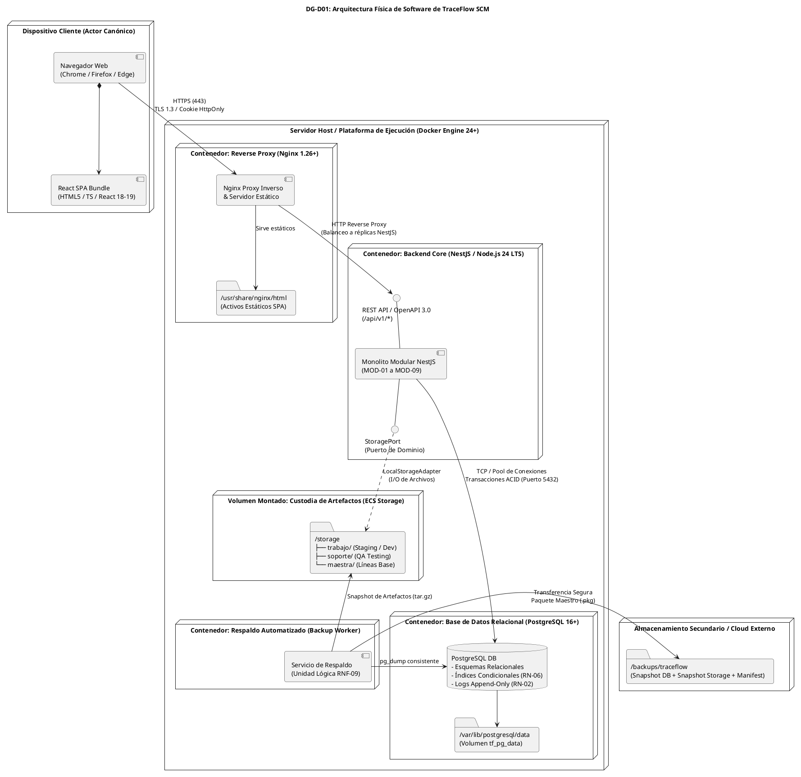

---

## 3.3 Delimitación de Componentes Físicos

| Componente Físico | Tecnología de Ejecución | Responsabilidad Operativa Principal | Mecanismo de Interconexión |
| :--- | :--- | :--- | :--- |
| **Frontend SPA** | React, TypeScript, Vite | Renderizado de interfaz, formularios reactivos, vistas de árboles de ECS, votaciones de CCB y tableros de QA. | Descargado vía Nginx; llamadas asíncronas JSON vía `fetch`/Axios. |
| **Reverse Proxy** | Nginx 1.26+ | Terminación segura HTTPS, compresión gzip/brotli, cacheo de activos estáticos, enrutamiento semántico a `/api/v1/`. | Expone puertos 80/443; conecta por red interna Docker bridge con el backend. |
| **Backend Core** | NestJS sobre Node.js 24 LTS | Orquestación transaccional de los 31 Casos de Uso, validación de reglas de negocio (RN-01 a RN-09), cómputo criptográfico SHA-256. | Protocolo HTTP/JSON; pooling relacional hacia PostgreSQL. |
| **Base de Datos** | PostgreSQL 16/17 | Almacenamiento transaccional de metadatos, control de versiones, sesiones opacas, bloqueos de concurrencia y auditoría inmutable. | Driver relacional nativo (`pg`/TypeORM/Prisma); volumen persistente montado. |
| **Custodia de ECS** | Sistema de archivos local montado | Almacenamiento seguro e inmutable de los archivos binarios y textuales de los ECS, segregados por bibliotecas SCM. | Acceso por streams de I/O mediante `LocalStorageAdapter`. |
| **Backup Worker** | Contenedor Alpine Linux con scripts cron | Generación periódica automatizada del respaldo atómico (`DB + Storage + Manifest`) y verificación de checksums cruzados. | Acceso de solo lectura a la BD y al volumen de almacenamiento. |

---

# 4. Arquitectura del Backend (Monolito Modular)

## 4.1 Mapeo de Módulos Conceptuales a Módulos Técnicos NestJS
Para mantener una fidelidad absoluta con el SAD de Análisis (FD04), los 9 módulos conceptuales aprobados se mapean **1:1** en módulos técnicos de NestJS decorados con `@Module`:

```
┌────────────────────────────────────────────────────────────────────────┐
│                   TRACEFLOW SCM - MONOLITO MODULAR                     │
├───────────────────┬───────────────────┬────────────────────────────────┤
│ Módulo Conceptual │ Módulo NestJS     │ Responsabilidad Técnica        │
├───────────────────┼───────────────────┼────────────────────────────────┤
│ MOD-01            │ AuthModule        │ IAM, Sesiones Opacas, RBAC/SoD │
│ MOD-02            │ ProjectModule     │ Proyectos, Gobernanza          │
│ MOD-03            │ ConfigItemModule  │ Catálogo ECS, Integridad       │
│ MOD-04            │ ChangeModule      │ RFC, CCB, Dictámenes, ECN      │
│ MOD-05            │ VersionModule     │ Check-Out/In, Bloqueos RN-06   │
│ MOD-06            │ QualityModule     │ QA Testing, Certificación, UAT │
│ MOD-07            │ BaselineModule    │ Líneas Base, Rollback          │
│ MOD-08            │ IncidentModule    │ Tickets, Derivación a RFC      │
│ MOD-09            │ AuditModule       │ Log Append-Only, Reportes      │
└───────────────────┴───────────────────┴────────────────────────────────┘
```

## 4.2 Anatomía Interna de Módulo Técnico
Cada uno de los 9 módulos técnicos en NestJS implementa una estructura interna estandarizada basada en Clean Architecture y Puertos y Adaptadores:

```
src/modules/{modulo}/
├── presentation/               # Capa de Entrada / Controladores
│   ├── {modulo}.controller.ts  # Endpoints REST (Rutas y Verbos HTTP)
│   └── dtos/                   # Data Transfer Objects con validación class-validator
├── application/                # Capa de Aplicación / Casos de Uso
│   ├── services/               # Servicios de Aplicación que orquestan los Casos de Uso
│   └── use-cases/              # Clases de comando o caso de uso individual
├── domain/                     # Capa de Dominio (Pura e Independiente)
│   ├── entities/               # Entidades de dominio con reglas de negocio intrínsecas
│   ├── value-objects/          # Objetos de valor inmutables (e.g. ChecksumSHA256, EstadoRFC)
│   └── ports/                  # Interfaces abstractas (Repositorios y Servicios Externos)
└── infrastructure/             # Capa de Infraestructura / Adaptadores
    ├── persistence/            # Implementaciones de repositorios con TypeORM/Prisma
    │   ├── entities/           # Esquemas de mapeo objeto-relacional (ORM Entities)
    │   └── {modulo}.repo-impl.ts
    └── adapters/               # Adaptadores técnicos (Hashing, Storage, etc.)
```

## 4.3 Reglas Estrictas de Aislamiento y Colaboración Intermodular
Para evitar la degradación arquitectónica hacia un monolito enredado (*Big Ball of Mud*), se establecen las siguientes reglas de gobierno de código:
1. **Prohibición de Acceso Directo a Repositorios Ajenos**: Un módulo técnico jamás podrá inyectar o consultar directamente la entidad o repositorio de persistencia de otro módulo. Por ejemplo:
   $$	ext{ChangeModule} \centernot\longrightarrow 	ext{VersionRepository (Prohibido)}$$
2. **Colaboración Exclusiva por Interfaces Públicas**: Toda interacción entre módulos debe ocurrir invocando los **servicios de aplicación exportados** en el contrato público del `@Module` correspondiente:
   $$	ext{ChangeModule} \longrightarrow 	ext{VersionApplicationService (Permitido vía DI)}$$
3. **Desacoplamiento de Eventos de Dominio**: Para notificaciones transversales (e.g. registrar auditoría tras el Check-In o emitir notificaciones al autorizar un cambio), los módulos emitirán eventos internos en memoria (`EventEmitter2` de NestJS), permitiendo que `AuditModule` capture el evento sin que el módulo emisor quede acoplado a la infraestructura de auditoría.

---

## 4.4 Diagrama DG-D02: Componentes del Monolito Modular


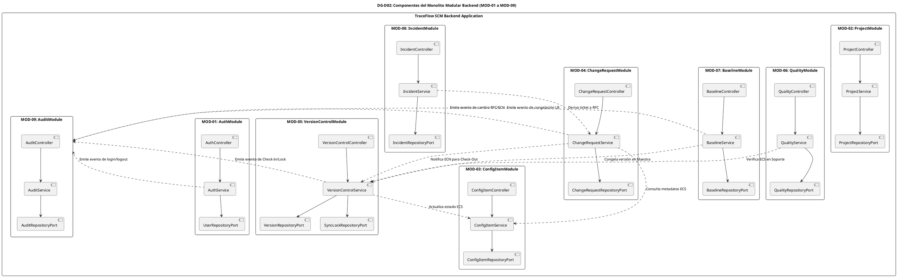

---

# 5. Capas Arquitectónicas (Clean Architecture / Hexagonal)

## 5.1 Definición de las Cuatro Capas
La organización de cada módulo responde estrictamente al paradigma de **Clean Architecture / Arquitectura Hexagonal**:

```
           ┌──────────────────────────────────────────────┐
           │        CAPA DE PRESENTACIÓN / INTERFAZ       │
           │  (Controllers, DTOs, Guards, Interceptors)   │
           └──────────────────────┬───────────────────────┘
                                  │ depende de
                                  ▼
           ┌──────────────────────────────────────────────┐
           │              CAPA DE APLICACIÓN              │
           │  (Application Services, Use Cases, Commands) │
           └──────────────────────┬───────────────────────┘
                                  │ depende de
                                  ▼
           ┌──────────────────────────────────────────────┐
           │                CAPA DE DOMINIO               │
           │  (Entities, Value Objects, Domain Ports)     │
           └──────────────────────────────────────────────┘
                                  ▲
                                  │ implementa puertos
           ┌──────────────────────┴───────────────────────┐
           │            CAPA DE INFRAESTRUCTURA           │
           │  (TypeORM Adapters, LocalStorage, NodeCrypto)│
           └──────────────────────────────────────────────┘
```

1. **Capa de Dominio (Domain Core)**:
   - Contiene la lógica esencial del negocio, entidades puras, objetos de valor y puertos de repositorio.
   - **Regla Fundamental**: El Dominio es completamente agnóstico a la tecnología; **no tiene dependencias** de NestJS, decoradores de TypeORM, base de datos PostgreSQL, HTTP, Express ni del sistema de archivos.
2. **Capa de Aplicación (Application Layer)**:
   - Orquesta los flujos de los Casos de Uso del sistema.
   - Coordina la recuperación de entidades a través de los puertos de repositorio, ejecuta las operaciones del dominio, persiste los cambios y emite eventos de auditoría.
   - Maneja transacciones relacionales mediante unidades de trabajo (*Unit of Work*).
3. **Capa de Presentación (Presentation / Interface Layer)**:
   - Expone los adaptadores de entrada HTTP (Controladores REST de NestJS).
   - Recibe los objetos de transferencia de datos (DTOs) de entrada, valida su estructura y tipos mediante `class-validator`, aplica guardas de seguridad (`AuthGuard`, `RolesGuard`, `SodGuard`) y transforma las respuestas a JSON estándar.
4. **Capa de Infraestructura (Infrastructure Layer)**:
   - Implementa los puertos abstractos definidos por el Dominio y la Aplicación.
   - Contiene los repositorios de persistencia basados en TypeORM/PostgreSQL, el adaptador de almacenamiento de archivos `LocalStorageAdapter`, y el cómputo de hashing criptográfico SHA-256 sobre Node.js nativo (`crypto`).

## 5.2 Regla de Dependencia Unidireccional e Inversión de Control
La arquitectura aplica de forma estricta el **Principio de Inversión de Dependencias (DIP)**:
- Las capas externas (Presentación e Infraestructura) conocen y dependen de las capas internas (Aplicación y Dominio).
- La capa de Dominio jamás conoce a la Infraestructura.
- Cuando el servicio de aplicación necesita persistir una entidad (e.g. `ChangeRequest`), invoca la interfaz abstracta `ChangeRequestRepositoryPort`. La implementación concreta (`ChangeRequestRepositoryImpl`) reside en la capa de Infraestructura y es inyectada en tiempo de ejecución por el contenedor de inversión de control (IoC) de NestJS.

---

# 6. Arquitectura Frontend (React SPA)

## 6.1 Estructura Modular de Carpetas
El cliente web se organiza como una Single Page Application (SPA) basada en React, TypeScript y Vite, estructurada mediante el patrón de **Módulos por Funcionalidad (Feature-Driven Structure)** para reflejar la modularidad del negocio y permitir carga bajo demanda (*code splitting*):

```
frontend/src/
├── app/                        # Configuración global, providers y temas
│   ├── App.tsx                 # Componente raíz con React Router y QueryClientProvider
│   ├── main.tsx                # Punto de entrada de renderizado en DOM
│   └── store/                  # Estado global ligero del cliente (Zustand / Context)
├── routes/                     # Definición centralizada de rutas y navegación
│   ├── AppRoutes.tsx           # Tabla de rutas protegidas y públicas
│   └── ProtectedRoute.tsx      # Route Guard que evalúa sesión y roles activos
├── layouts/                    # Plantillas visuales por perfil y contexto
│   ├── DashboardLayout.tsx     # Barra lateral, navegación superior y breadcrumbs
│   ├── AuthLayout.tsx          # Pantalla limpia centrada para autenticación
│   └── RoleBasedSidebar.tsx    # Menú dinámico filtrado por los 7 roles canónicos
├── features/                   # Módulos funcionales de negocio (Features)
│   ├── auth/                   # Login, perfil, sesión y logout
│   ├── projects/               # Creación, configuración y listado de proyectos (MOD-02)
│   ├── ecs/                    # Catálogo jerárquico de ECS y relaciones (MOD-03)
│   ├── changes/                # Flujo de RFCs, análisis de impacto y CCB (MOD-04)
│   ├── libraries/              # Visualizador de bibliotecas (Trabajo, Soporte, Maestra)
│   ├── quality/                # Tableros de pruebas, certificación QA y actas UAT (MOD-06)
│   ├── baselines/              # Historial de líneas base y congelamientos (MOD-07)
│   ├── incidents/              # Bandeja de incidencias y derivación a RFC (MOD-08)
│   ├── audit/                  # Visor de pistas de auditoría inmutable (MOD-09)
│   └── reports/                # Generador de reportes consolidados (MOD-09)
└── shared/                     # Código transversal reutilizable
    ├── api/                    # Cliente HTTP (Axios) con interceptor de cookies y errores
    ├── components/             # Componentes UI atómicos (Botones, Modales, Tablas, Badges)
    ├── hooks/                  # Custom hooks utilitarios (useAuth, useSessionTimeout)
    └── types/                  # Tipos e interfaces TypeScript sincronizados con OpenAPI
```

## 6.2 Enrutamiento, Layouts y Protección por Rol
1. **Enrutador Declarativo (React Router v6+)**:
   - `/login`: Ruta pública para autenticación.
   - `/dashboard`: Panel general con métricas e indicadores de actividad.
   - `/projects/*`: Gestión de proyectos y catálogo de ECS.
   - `/changes/*`: Gestión y tramitación del ciclo de vida de RFCs.
   - `/changes/:id/ccb-deliberation`: Consola colegiada de votación para el CCB.
   - `/quality/*`: Entorno de validación técnica de QA y actas de aceptación UAT.
   - `/baselines/*`: Visor de líneas base congeladas y ejecución de rollback.
   - `/audit/*`: Explorador de registros forenses de auditoría.
2. **Layout Basado en Rol (`RoleBasedSidebar`)**:
   - El menú lateral adapta sus opciones en tiempo de ejecución evaluando el rol del usuario autenticado (`Solicitante`, `Gestor de Configuración`, `Líder CCB`, `Miembro CCB`, `Desarrollador`, `Asegurador de Calidad`, `Administrador de Seguridad`).
3. **Route Guards (`ProtectedRoute`)**:
   - Intercepta cada cambio de ruta en el cliente.
   - Si no existe sesión activa válida, redirige automáticamente a `/login`.
   - Si el rol activo del usuario no posee autorización para la ruta solicitada, bloquea el renderizado y muestra una pantalla de `403 Acceso Denegado (Violación de RN-01)`.

## 6.3 Gestión de Estado, Consumo de API y Manejo de Errores
- **Gestión de Estado del Servidor**: Empleo de **TanStack Query (React Query)** para el consumo asíncrono, cacheo automático, invalidación de consultas y sincronización en tiempo real de los datos del backend.
- **Cliente HTTP Seguro**: Instancia configurada de Axios con `withCredentials: true`, asegurando que la cookie `HttpOnly` (`tf_session`) viaje automáticamente en cada solicitud al backend sin ser accesible por JavaScript.
- **Manejo Centralizado de Errores**:
  - Interceptor global de respuestas HTTP:
    - `401 Unauthorized`: Limpia el estado de autenticación y redirige a `/login` por inactividad o expiración de sesión.
    - `403 Forbidden`: Muestra notificación modal de violación de RBAC o de Segregación de Funciones (SoD).
    - `409 Conflict`: Captura violaciones de la regla de bloqueo exclusivo de sincronización (`RN-06`), alertando al operador con los datos de la orden que mantiene el bloqueo activo.
    - `Error Boundaries`: Componentes de contención que evitan la caída global de la interfaz gráfica ante excepciones no controladas.

---

# 7. Modelo de Datos de Diseño (Relacional Lógico)

## 7.1 Derivación Exhaustiva desde el Modelo Conceptual DG-12
El diseño relacional lógico se deriva directamente del **Modelo Conceptual del Dominio (DG-12)** aprobado en la baseline de análisis, transformando las clases de análisis en un esquema de tablas relacionales de tercera forma normal (3NF) gobernado por claves foráneas, restricciones de integridad referencial y restricciones condicionales.

No se crea ninguna tabla sin trazabilidad directa a una entidad conceptual o a una tabla asociativa necesaria para normalizar relaciones N:M:

```
┌─────────────────────────────────┬─────────────────────────────┬──────────────────────────────┐
│ Entidad Conceptual (DG-12)      │ Tabla Relacional de Diseño  │ Propósito en el Sistema SCM  │
├─────────────────────────────────┼─────────────────────────────┼──────────────────────────────┤
│ Usuario                         │ app_user                    │ Cuentas de los 7 actores     │
│ RolUsuario (Enum)               │ app_role                    │ Catálogo canónico de roles   │
│ (Asociación Usuario-Rol)        │ user_role_assignment        │ Asignación N:M de roles/SoD  │
│ Proyecto                        │ project                     │ Proyectos de clientes        │
│ ElementoConfiguracion           │ config_item                 │ Catálogo de ECS por proyecto │
│ (Historial de Versiones)        │ ecs_version                 │ Versiones inmutables + SHA256│
│ SolicitudCambio                 │ change_request              │ Expediente de RFC (14 estados│
│ InformeImpacto                  │ impact_assessment           │ Análisis técnico (Triple Res)│
│ (Dictamen CCB / Delegado)       │ ccb_resolution              │ Resoluciones y votación CCB  │
│ OrdenCambio                     │ change_order                │ ECN/ECO emitida para cambio  │
│ EstadoBloqueo (Entidad/Estado)  │ sync_lock                   │ Bloqueo persistente (RN-06)  │
│ CertificadoConformidad          │ qa_certification            │ Certificación técnica de QA  │
│ (Aceptación de Usuario / UAT)   │ uat_acceptance              │ Acta de aceptación formal    │
│ LineaBase                       │ baseline                    │ Líneas base congeladas       │
│ (Asociación LineaBase-ECS)      │ baseline_item               │ Versiones congeladas en LB   │
│ TicketIncidencia                │ incident_ticket             │ Reportes de falla externa    │
│ RegistroAuditoria               │ audit_log                   │ Pistas append-only inmutables│
│ (Control de Sesiones Técnicas)  │ user_session                │ Sesiones opacas en servidor  │
└─────────────────────────────────┴─────────────────────────────┴──────────────────────────────┘
```

---

## 7.2 Diagrama DG-D03: Modelo Relacional Lógico de TraceFlow SCM


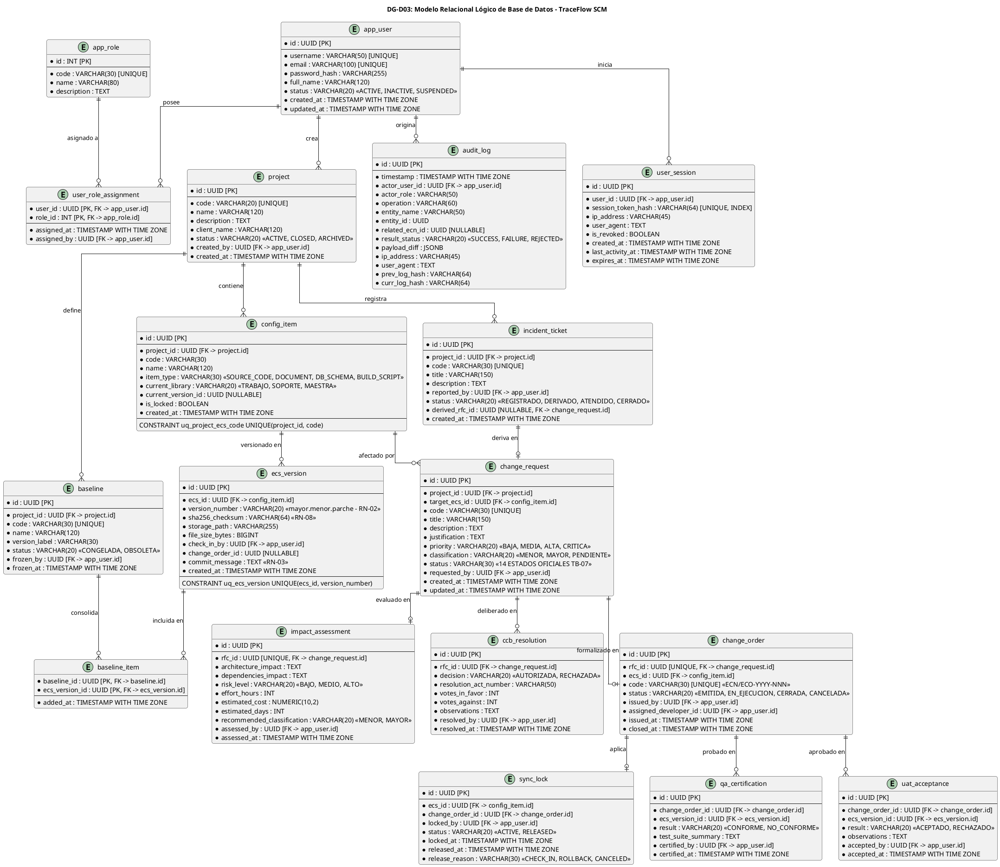

---

## 7.3 Especificación de Tablas, Claves, Restricciones y Estados
El modelo incorpora restricciones declarativas directas para salvaguardar las reglas de negocio canónicas:
- **Estados de RFC (`change_request.status`)**: Gobernado por un `CHECK` que admite estrictamente los **14 Estados Canónicos de TB-07**:
  `REGISTRADA`, `EN_SUBSANACION`, `CLASIFICADA`, `EN_ANALISIS_TECNICO`, `EN_EVALUACION`, `AUTORIZADA`, `ORDEN_EMITIDA`, `EN_IMPLEMENTACION`, `EN_PRUEBAS`, `EN_ACEPTACION`, `DESESTIMADA`, `RECHAZADA`, `CANCELADA`, `IMPLEMENTADA`.
- **Integridad de Versiones (`ecs_version`)**: Clave compuesta única `(ecs_id, version_number)` asegurando que ninguna versión de un ECS se sobreescriba (`RN-02`). Columna `sha256_checksum` inmutable y obligatoria (`RN-08`).
- **Trazabilidad de Cambios (`RN-03`)**: Columna `commit_message` y referencia foránea obligatoria a `change_order_id` en el Check-In.

## 7.4 Diseño Técnico del Bloqueo de Sincronización (RN-06)
La exclusividad absoluta del bloqueo de sincronización para evitar condiciones de carrera entre desarrolladores se blinda mediante un **índice único parcial condicional** en PostgreSQL:

```sql
-- RESTRICCIÓN ÚNICA CONDICIONAL QUE BLINDA RN-06 A NIVEL DE MOTOR:
-- Garantiza que jamás existirá más de UN bloqueo en estado ACTIVE para un mismo ECS.
CREATE UNIQUE INDEX uq_active_sync_lock_per_ecs 
ON sync_lock (ecs_id) 
WHERE status = 'ACTIVE';
```

### Reglas de Liberación Estricta:
1. El campo `sync_lock.release_reason` está restringido declarativamente:
   `CHECK (release_reason IN ('CHECK_IN', 'ROLLBACK', 'CANCELED'))`.
2. **Prohibición de Desbloqueo Arbitrario**: No existe operación de liberación administrativa directa en el sistema. La liberación solo ocurre mediante:
   - Check-In exitoso (`CU-12`, `RF-08`).
   - Rollback ejecutado por fallo en pruebas (`CU-21`, `RF-12`).
   - Cancelación formal de la Orden de Cambio (`CU-22`, `RF-12`).

---

# 8. Diseño de Custodia de ECS (StoragePort & Bibliotecas)

## 8.1 Interfaz de Dominio StoragePort
La custodia física de los archivos de código fuente, esquemas y documentos de los Elementos de Configuración (ECS) se aísla de la lógica de negocio mediante el puerto de dominio `StoragePort`. La capa de dominio define el contrato sin conocer detalles del sistema de archivos local ni de protocolos de red:

```typescript
export interface StoragePort {
  /**
   * Almacena un archivo temporal en el área de staging calculando y verificando su SHA-256.
   */
  storeTemporary(tempId: string, stream: NodeJS.ReadableStream, expectedSha256: string): Promise<{ path: string; sizeBytes: number }>;

  /**
   * Promueve un artefacto de staging a una biblioteca SCM permanente e inmutable.
   */
  promote(tempPath: string, targetLibrary: 'trabajo' | 'soporte' | 'maestra', targetSubPath: string, verifiedSha256: string): Promise<string>;

  /**
   * Obtiene un flujo de lectura del archivo custodiado.
   */
  read(storagePath: string): Promise<NodeJS.ReadableStream>;

  /**
   * Verifica la existencia física de un artefacto.
   */
  exists(storagePath: string): Promise<boolean>;

  /**
   * Copia un artefacto entre bibliotecas (e.g. de Soporte a Maestra).
   */
  copy(sourcePath: string, destinationLibrary: 'trabajo' | 'soporte' | 'maestra', destSubPath: string): Promise<string>;

  /**
   * Elimina un archivo temporal de staging en caso de fallo (operación compensatoria).
   */
  removeTemporary(tempPath: string): Promise<void>;

  /**
   * Calcula el hash criptográfico SHA-256 en tiempo real sobre el archivo físico (CU-26).
   */
  computeChecksum(storagePath: string): Promise<string>;
}
```

## 8.2 Adaptador LocalStorageAdapter y Estructura en Disco
En la fase inicial aprobada por ADR-005, el puerto es implementado por `LocalStorageAdapter`, que gestiona una jerarquía física en un volumen montado persistente (`/storage/`):

```
/storage/
├── staging/                                  # Área temporal volátil de subida
│   └── temp_{uuid}.tmp
├── trabajo/                                  # Biblioteca de Trabajo (Check-Out activo)
│   └── {projectId}/{ecsId}/
│       └── v{versionNumber}_{sha256}.artifact
├── soporte/                                  # Biblioteca de Soporte (Entorno QA / UAT)
│   └── {projectId}/{ecsId}/
│       └── v{versionNumber}_{sha256}.artifact
└── maestra/                                  # Biblioteca Maestra (Líneas Base Congeladas)
    └── {projectId}/{ecsId}/
        └── v{versionNumber}_{sha256}.artifact
```

Una vez que un archivo se promueve a las bibliotecas `soporte` o `maestra`, el adaptador remueve los permisos de escritura del sistema operativo (`chmod 444` / solo lectura) para prevenir cualquier modificación accidental en el host.

---

## 8.3 Diagrama DG-D04: Arquitectura de Storage y Bibliotecas


```plantuml
@startuml
skinparam shadowing false
skinparam roundcorner 8
skinparam defaultFontName Arial
skinparam packageStyle rectangle

title <b>DG-D04: Arquitectura de Storage y Transición entre las 3 Bibliotecas SCM</b>

package "Capa de Dominio & Aplicación" {
    interface "StoragePort" as StoragePort {
        + storeTemporary()
        + promote()
        + read()
        + copy()
        + removeTemporary()
        + computeChecksum()
    }
    
    class "VersionControlService" as VersionService
    VersionService -right-> StoragePort : consume
}

package "Capa de Infraestructura (Adaptador Físico)" {
    class "LocalStorageAdapter" as LocalStorage {
        - basePath : String = "/storage"
        + storeTemporary()
        + promote()
        + read()
        + copy()
        + removeTemporary()
        + computeChecksum()
    }
    LocalStorage .up.|> StoragePort : implementa
}

package "Volumen de Almacenamiento Físico (/storage/)" {
    folder "staging/ (Temporal)" as F_Staging
    folder "trabajo/ (Biblioteca de Trabajo)" as F_Trabajo
    folder "soporte/ (Biblioteca de Soporte)" as F_Soporte
    folder "maestra/ (Biblioteca Maestra)" as F_Maestra
}

LocalStorage --> F_Staging : 1. Escribe carga temporal
LocalStorage --> F_Trabajo : 2. Promueve tras Check-Out / Dev
LocalStorage --> F_Soporte : 3. Transfiere para pruebas QA (RN-01)
LocalStorage --> F_Maestra : 4. Congela con Doble Conformidad (RN-09)

F_Trabajo .[#blue].> F_Soporte : Entrega para Testing
F_Soporte .[#green].> F_Maestra : Promoción tras QA + UAT
F_Trabajo .[#red].> F_Trabajo : Rollback elimina copia de trabajo (RN-08)

@enduml
```

---

## 8.4 Protocolo de Transacciones por Etapas y Reconciliación
Debido a que **no existe una transacción ACID distribuida nativa (2PC) entre PostgreSQL y el sistema de archivos**, se formaliza el siguiente protocolo de escritura segura por etapas con operaciones compensatorias:

```
[Cliente]                    [Backend Core]                  [StoragePort]            [PostgreSQL]
   │                                │                              │                       │
   │─── 1. POST Check-In Stream ───>│                              │                       │
   │                                │── 2. storeTemporary() ──────>│                       │
   │                                │                              │── Escribe staging ───>│
   │                                │<── Retorna tempPath + SHA ───│                       │
   │                                │                                                      │
   │                                │── 3. Valida Checksum (RN-08)                         │
   │                                │                                                      │
   │                                │── 4. Inicia Transacción ACID ───────────────────────>│
   │                                │      - Inserta ecs_version                           │
   │                                │      - Actualiza sync_lock (RELEASED)                │
   │                                │      - Inserta audit_log                             │
   │                                │      - COMMIT                                        │
   │                                │<── Transacción Exitosa ──────────────────────────────│
   │                                │                                                      │
   │                                │── 5. promote() a biblioteca ─>│                       │
   │                                │      (staging -> permanente) │                       │
   │<── 6. 201 Created Confirmado ──│                                                      │
   │                                │                                                      │
   │                                │=== OPERACIÓN COMPENSATORIA ANTE FALLO ===            │
   │                                │ (Si falla BD o SHA-256 no coincide):                 │
   │                                │── removeTemporary(tempPath) ─>│                       │
   │<── 400/500 Error + Rollback ───│                                                      │
```

### Mecanismo Técnico del Reconciliation Worker
Para garantizar que caídas repentinas del servidor o fallos de energía no dejen archivos huérfanos o metadatos inconsistentes:
1. Se define un proceso técnico en segundo plano (`ReconciliationWorker`), implementado mediante un cron interno de NestJS (`@Cron('0 */6 * * *')`).
2. **Barrido de Staging**: Escanea `/storage/staging/` y purga automáticamente archivos temporales con más de 24 horas de antigüedad que no hayan sido promovidos.
3. **Auditoría de Correspondencia Física**: Compara la lista de `storage_path` y `sha256_checksum` de la tabla `ecs_version` contra los archivos reales en disco. Si detecta una discrepancia (archivo faltante o hash alterado), genera de inmediato un registro de alerta crítica en `audit_log` y emite una notificación al Administrador de Seguridad.

---

# 9. Diseño de API REST

## 9.1 Matriz de Correspondencia Casos de Uso vs Operaciones API
A continuación se mapean los **31 Casos de Uso del SRS de Análisis** hacia operaciones RESTful concretas, respetando sus actores canónicos y reglas de negocio:

| CU | Nombre Caso de Uso (Baseline Análisis) | Operación de Aplicación / Controlador | Recurso / Ruta API (v1) | Método HTTP | Código Éxito | Códigos Error |
| :---: | :--- | :--- | :--- | :---: | :---: | :--- |
| **CU-01** | Gestionar usuarios y roles | `AuthController.manageUsers` | `/api/v1/users` | `GET` / `POST` | `200` / `201` | 400, 401, 403 |
| **CU-02** | Crear y administrar proyectos | `ProjectController.createProject` | `/api/v1/projects` | `POST` | `201` | 400, 401, 403, 409 |
| **CU-03** | Consultar proyecto | `ProjectController.getProjectById` | `/api/v1/projects/{id}` | `GET` | `200` | 401, 403, 404 |
| **CU-04** | Registrar Solicitud de Cambio (RFC) | `ChangeRequestController.registerRfc` | `/api/v1/rfcs` | `POST` | `201` | 400, 401, 403 |
| **CU-04.1**| Subsanar Solicitud de Cambio | `ChangeRequestController.subsampleRfc` | `/api/v1/rfcs/{id}/subsample` | `PATCH` | `200` | 400, 401, 403, 404 |
| **CU-05** | Validar y clasificar la solicitud | `ChangeRequestController.classifyRfc` | `/api/v1/rfcs/{id}/classify` | `PATCH` | `200` | 400, 401, 403, 404 |
| **CU-06** | Realizar análisis de impacto técnico | `ChangeRequestController.submitImpact` | `/api/v1/rfcs/{id}/impact-assessment` | `POST` | `201` | 400, 401, 403, 404 |
| **CU-07** | Evaluar Cambio Mayor en CCB | `ChangeRequestController.voteCcb` | `/api/v1/rfcs/{id}/ccb-resolution` | `POST` | `201` | 400, 401, 403, 404 |
| **CU-08** | Emitir Orden de Cambio (ECN/ECO) | `ChangeRequestController.issueEcn` | `/api/v1/rfcs/{id}/change-order` | `POST` | `201` | 400, 401, 403, 409 |
| **CU-09** | Registrar ECS | `ConfigItemController.registerEcs` | `/api/v1/projects/{id}/ecs` | `POST` | `201` | 400, 401, 403, 409 |
| **CU-10** | Efectuar Check-Out | `VersionControlController.checkOut` | `/api/v1/ecs/{id}/check-out` | `POST` | `200` | 400, 401, 403, 409 |
| **CU-11** | Aplicar bloqueo de sincronización | *Ejecutado atómicamente en CU-10* | `/api/v1/ecs/{id}/check-out` | `POST` | `200` | 409 (Lock activo) |
| **CU-12** | Efectuar Check-In | `VersionControlController.checkIn` | `/api/v1/ecs/{id}/check-in` | `POST` | `201` | 400, 401, 403, 409 |
| **CU-13** | Consultar historial de versiones | `VersionControlController.getHistory` | `/api/v1/ecs/{id}/versions` | `GET` | `200` | 401, 403, 404 |
| **CU-14** | Implementar cambio en el ECS | `VersionControlController.saveDraft` | `/api/v1/ecs/{id}/workspace-draft` | `PUT` | `200` | 400, 401, 403, 404 |
| **CU-15** | Ejecutar pruebas unitarias locales | `QualityController.logUnitTest` | `/api/v1/change-orders/{id}/unit-tests` | `POST` | `201` | 400, 401, 403 |
| **CU-16** | Ejecutar pruebas de integración | `QualityController.logIntegrationTest` | `/api/v1/change-orders/{id}/integration-tests`| `POST` | `201` | 400, 401, 403 |
| **CU-17** | Certificar conformidad del cambio | `QualityController.certifyQa` | `/api/v1/change-orders/{id}/qa-certification` | `POST` | `201` | 400, 401, 403 (SoD) |
| **CU-18** | Reportar no conformidad | `QualityController.reportNonConformity`| `/api/v1/change-orders/{id}/non-conformity`| `POST` | `201` | 400, 401, 403 |
| **CU-19** | Reevaluar y re-testear | `QualityController.retest` | `/api/v1/change-orders/{id}/retest` | `POST` | `200` | 400, 401, 403 |
| **CU-20** | Crear y congelar línea base | `BaselineController.freezeBaseline` | `/api/v1/projects/{id}/baselines` | `POST` | `201` | 400, 401, 403, 409 |
| **CU-21** | Ejecutar rollback | `BaselineController.rollback` | `/api/v1/change-orders/{id}/rollback` | `POST` | `200` | 400, 401, 403, 404 |
| **CU-22** | Cancelar Orden de Cambio | `ChangeRequestController.cancelEcn` | `/api/v1/change-orders/{id}/cancel` | `POST` | `200` | 400, 401, 403, 404 |
| **CU-23** | Registrar incidencia | `IncidentController.registerIncident` | `/api/v1/projects/{id}/incidents` | `POST` | `201` | 400, 401, 403 |
| **CU-24** | Consultar estado de ticket | `IncidentController.getIncidentById` | `/api/v1/incidents/{id}` | `GET` | `200` | 401, 403, 404 |
| **CU-25** | Derivar incidencia a RFC | `IncidentController.deriveToRfc` | `/api/v1/incidents/{id}/derive-rfc` | `POST` | `201` | 400, 401, 403, 409 |
| **CU-26** | Validar integridad (checksum) | `ConfigItemController.verifyChecksum` | `/api/v1/ecs/{id}/versions/{vId}/verify`| `POST` | `200` | 400, 401, 403, 404 |
| **CU-27** | Auditar acciones del sistema | `AuditController.queryLogs` | `/api/v1/audit/logs` | `GET` | `200` | 401, 403 |
| **CU-28** | Generar reportes de estado | `AuditController.generateStatusReport` | `/api/v1/reports/status` | `GET` | `200` | 400, 401, 403 |
| **CU-29** | Validar aceptación del cambio (UAT)| `QualityController.submitUat` | `/api/v1/change-orders/{id}/uat-acceptance`| `POST` | `201` | 400, 401, 403 |
| **CU-30** | Autorizar Cambio Menor | `ChangeRequestController.authorizeMinor`| `/api/v1/rfcs/{id}/authorize-minor` | `POST` | `200` | 400, 401, 403, 404 |

---

## 9.2 Catálogo Preliminar API-DRAFT-v0.1
El contrato preliminar formaliza las cabeceras obligatorias, transporte seguro y convenciones REST:
- **Cabeceras Obligatorias**:
  - `Content-Type: application/json` (o `multipart/form-data` para subidas de archivos en Check-In).
  - `Accept: application/json`.
  - `X-Requested-With: XMLHttpRequest` (Protección contra CSRF).
- **Versionado Semántico**: `/api/v1/...` documentado e inspeccionable vía Swagger UI en `/api/docs`.

## 9.3 Formato Estándar de Errores (RFC 7807)
Toda respuesta de error emitida por la API adopta la especificación RFC 7807 (*Problem Details for HTTP APIs*):

```json
{
  "type": "https://traceflow.exodo.com/errors/sync-lock-conflict",
  "title": "Conflicto de Bloqueo de Sincronización (RN-06)",
  "status": 409,
  "detail": "El ECS 'AUTH-MOD-01' ya se encuentra bloqueado bajo la Orden ECN-2026-015 por el desarrollador 'jmedina'.",
  "instance": "/api/v1/ecs/3fa85f64-5717-4562-b3fc-2c963f66afa6/check-out",
  "timestamp": "2026-10-01T15:45:00.000Z",
  "code": "TF_ERR_SYNC_LOCK_ACTIVE"
}
```

---

# 10. Diseño de Seguridad

## 10.1 Separación entre Autenticación, Autorización y Segregación de Funciones
La seguridad técnica de TraceFlow SCM distingue formalmente tres dimensiones independientes:
1. **Autenticación (Identidad Inequívoca)**: Verificación de credenciales de acceso del usuario y asignación de un identificador de sesión opaco seguro en el servidor.
2. **Autorización (Control de Acceso Basado en Roles - RBAC, RN-01, RN-04)**: Verificación estática de que el usuario autenticado ostenta uno de los 7 roles canónicos autorizados para invocar la operación.
3. **Segregación de Funciones Dinámica (SoD, Formalizada en SAD de Análisis Secciones 3.4 y 6.3)**: Validación contextual que impide conflictos de interés en tiempo de ejecución:
   - **SoD en Calidad (`CU-17`)**: Quien implementó el cambio (desarrollador asignado a la ECN en `CU-12`) tiene estrictamente bloqueada la emisión del certificado de conformidad técnica como evaluador de QA.
   - **SoD en CCB (`CU-07`)**: El usuario que originó una Solicitud de Cambio (Solicitante) tiene prohibido votar como miembro o líder del CCB en la deliberación de su propia solicitud.

## 10.2 Flujo Técnico de Autenticación y Sesión Opaca en Servidor
Conforme a lo resuelto en **ADR-006**, el sistema implementa sesiones opacas gestionadas en servidor respaldadas por cookies seguras:
1. El usuario envía sus credenciales (`username` / `password`) mediante `POST /api/v1/auth/login`.
2. El servicio valida la contraseña comparando el hash Argon2id / bcrypt.
3. El backend genera un token de sesión criptográficamente aleatorio de 256 bits (`crypto.randomBytes(32).toString('hex')`).
4. Se calcula el hash SHA-256 del token y se inserta en la tabla `user_session` con `last_activity_at = NOW()`.
5. El backend devuelve la respuesta inyectando la cookie de sesión:
   `Set-Cookie: tf_session={sessionToken}; HttpOnly; Secure; SameSite=Strict; Path=/api; Max-Age=900`
6. En peticiones subsecuentes, el middleware extrae la cookie, calcula su hash SHA-256, consulta la sesión en PostgreSQL, verifica que no esté revocada y valida que la inactividad no supere los 15 minutos. Si es válida, renueva `last_activity_at = NOW()`.
7. Si el usuario ejecuta logout (`POST /api/v1/auth/logout`), la sesión se marca inmediatamente como `is_revoked = true` en base de datos y se elimina la cookie, garantizando la revocación instantánea.

## 10.3 Diagrama DG-D05: Flujo Técnico de Autenticación y Autorización


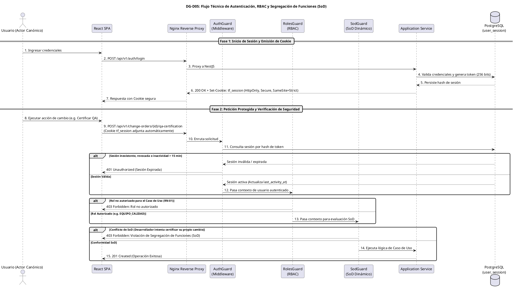

---

## 10.4 Parámetros de Seguridad de Diseño (Timeout de 15 Minutos)
- **Timeout de Inactividad de 15 Minutos**: Se clasifica formalmente como un **PARÁMETRO DE SEGURIDAD DE DISEÑO**, adoptado en ADR-006 para mitigar riesgos de sesión huérfana en terminales desatendidas. En la baseline SRS, `RNF-01` gobierna la seguridad y `RNF-04` corresponde a Usabilidad (< 3 horas).
- **Protección CSRF**: Requerimiento obligatorio del encabezado `X-Requested-With: XMLHttpRequest` y directiva `SameSite=Strict`.
- **Cifrado en Reposo y Tránsito**: Todas las contraseñas se almacenan mediante funciones de derivación de claves adaptativas (Argon2id). La comunicación en tránsito es forzada mediante TLS 1.3.

---

# 11. Auditoría y Trazabilidad

## 11.1 Modelo Append-Only en PostgreSQL y Triggers de Inmutabilidad
En cumplimiento de **ADR-008**, la trazabilidad técnica de TraceFlow SCM descansa en un registro relacional en modo **estrictamente agregativo (*append-only*)**:
1. **Revocación de Permisos en Base de Datos**: El usuario de base de datos utilizado por la aplicación (`traceflow_app`) tiene concedidos exclusivamente permisos de `SELECT` e `INSERT` sobre la tabla `audit_log`:
   ```sql
   REVOKE UPDATE, DELETE, TRUNCATE ON TABLE audit_log FROM traceflow_app;
   GRANT SELECT, INSERT ON TABLE audit_log FROM traceflow_app;
   ```
2. **Trigger Inviolable a Nivel de Motor**: Se define un trigger en PostgreSQL que cancela con excepción cualquier intento de modificación física:
   ```sql
   CREATE OR REPLACE FUNCTION trg_prevent_audit_tampering()
   RETURNS TRIGGER AS $$
   BEGIN
       RAISE EXCEPTION 'VIOLACIÓN DE INTEGRIDAD FORENSE: audit_log es inmutable.';
   END;
   $$ LANGUAGE plpgsql;

   CREATE TRIGGER trg_audit_immutable
   BEFORE UPDATE OR DELETE OR TRUNCATE ON audit_log
   FOR EACH STATEMENT EXECUTE FUNCTION trg_prevent_audit_tampering();
   ```

## 11.2 Estructura del Registro de Auditoría y Encadenamiento SHA-256
Cada evento crítico genera un registro inmutable con los siguientes atributos:
- `id`: UUID único del evento.
- `timestamp`: Marca temporal UTC de microsegundos (`CURRENT_TIMESTAMP`).
- `actor_user_id`: UUID del actor canónico que ejecutó la acción.
- `actor_role`: Rol activo verificado en la ejecución.
- `operation`: Código de operación (e.g. `RFC_REGISTERED`, `ECN_ISSUED`, `SYNC_LOCK_ACQUIRED`, `CHECK_IN_COMMITTED`, `QA_CERTIFIED`, `BASELINE_FROZEN`, `ROLLBACK_EXECUTED`).
- `entity_name` y `entity_id`: Recurso afectado (`change_request`, `config_item`, `change_order`, `baseline`).
- `related_ecn_id`: Identificador de la orden de cambio vinculada (garantizando trazabilidad `RN-03`).
- `result_status`: `SUCCESS`, `FAILURE`, `REJECTED`.
- `payload_diff`: Objeto JSONB con los datos modificados (delta del cambio). Se omiten expresamente datos sensibles como credenciales o tokens.
- `ip_address` y `user_agent`: Metadatos de red del cliente.
- `prev_log_hash`: Hash SHA-256 del registro de auditoría anterior.
- `curr_log_hash`: Hash SHA-256 calculado sobre la concatenación canónica de los atributos del evento y el `prev_log_hash`, garantizando detección inmediata de manipulación o alteración de registros intermedios.

---

# 12. Secuencias de Diseño Técnicas (DG-DSEQ-XX)

## 12.1 Convenciones y Participantes de Diseño
A diferencia de los diagramas de secuencia del SRS de Análisis (que modelan la interacción conceptual `Actor -> TraceFlow SCM`), los **Diagramas de Secuencia de Diseño (`DG-DSEQ-XX`)** desglosan la interacción técnica interna entre los objetos del software:
- `Actor`: Usuario autenticado interactuando con la interfaz.
- `React`: Cliente frontend SPA.
- `Controller`: Adaptador de entrada REST de NestJS.
- `Guard`: Guardas de seguridad (`AuthGuard`, `RolesGuard`, `SodGuard`).
- `Service`: Servicio de aplicación que orquesta el Caso de Uso.
- `Domain`: Entidad de dominio que valida las invariantes de negocio.
- `RepoPort`: Puerto abstracto de persistencia.
- `PostgreSQL`: Motor de base de datos relacional.
- `StoragePort`: Puerto abstracto de custodia física de archivos.
- `Audit`: Interceptor de auditoría inmutable.

A continuación se formalizan los **9 flujos críticos iniciales de diseño**:

---

## 12.2 Diagramas Críticos de Diseño

### DG-DSEQ-04: Registrar Solicitud de Cambio (RFC) (CU-04)


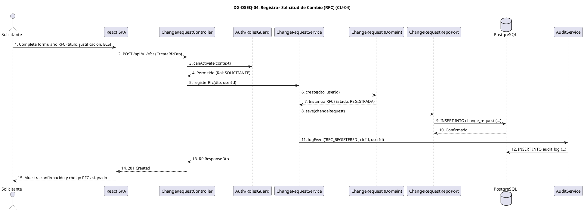

---

### DG-DSEQ-08: Emitir Orden de Cambio (ECN/ECO) (CU-08)


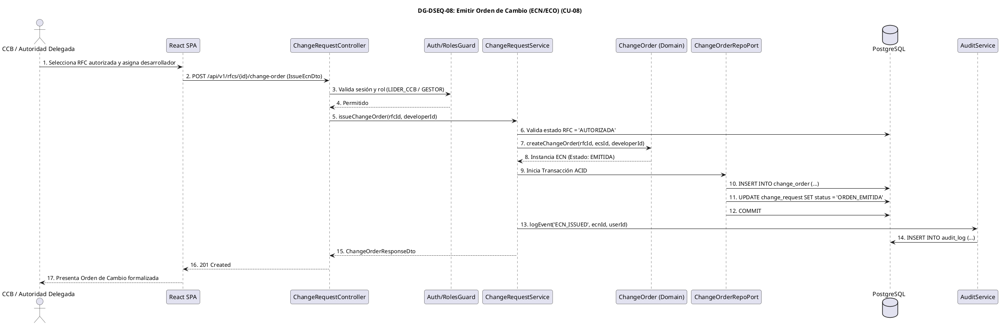

---

### DG-DSEQ-10: Efectuar Check-Out con Bloqueo de Sincronización (CU-10, CU-11, RN-06)


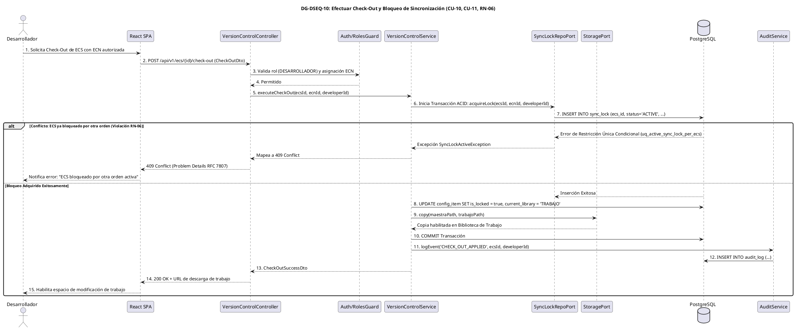

---

### DG-DSEQ-12: Efectuar Check-In con Verificación SHA-256 (CU-12, RN-08)


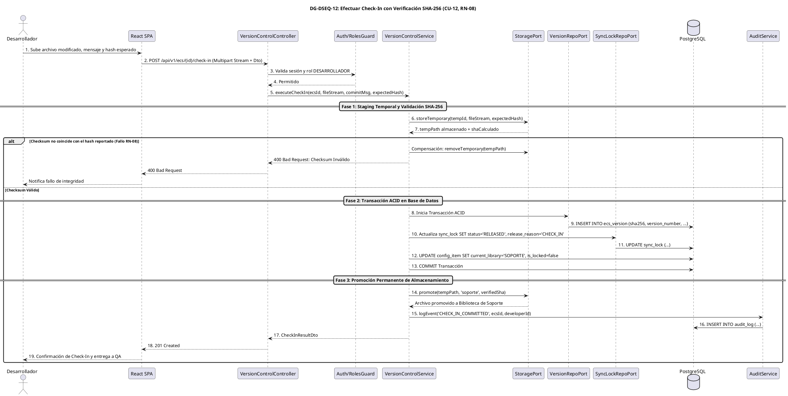

---

### DG-DSEQ-17: Certificar Conformidad de Calidad (CU-17, SoD Dinámico)


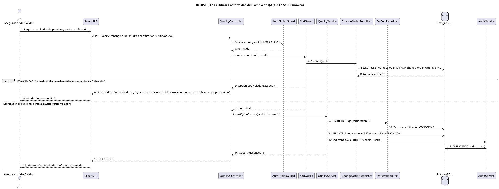

---

### DG-DSEQ-20: Crear y Congelar Línea Base (CU-20, RN-09)


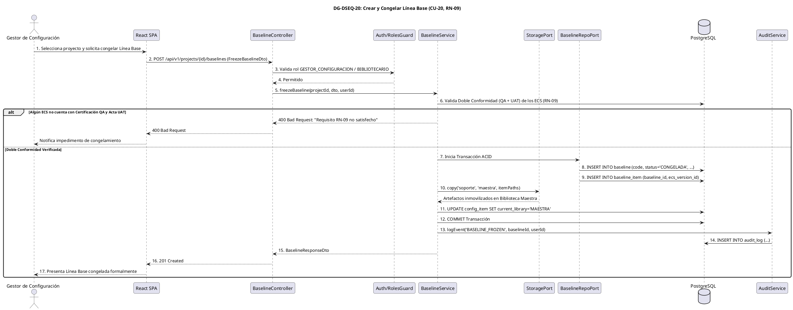

---

### DG-DSEQ-21: Ejecutar Rollback ante Fallo No Subsanado (CU-21, RN-08)


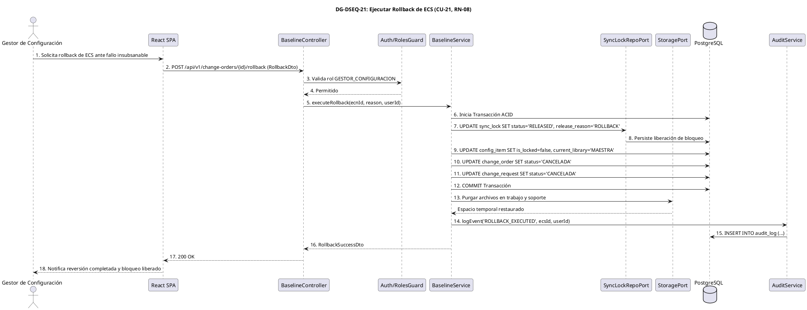

---

### DG-DSEQ-29: Validar Aceptación del Cambio por el Usuario (UAT) (CU-29, RN-09)


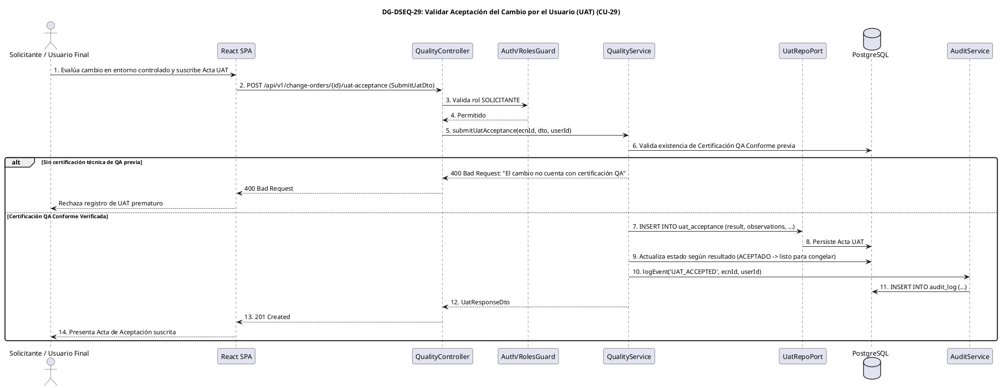

---

### DG-DSEQ-30: Autorizar Cambio Menor por Vía Delegada (CU-30, RN-01, RN-05)


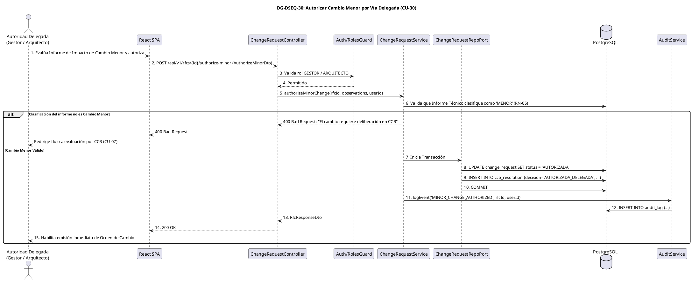

---

# 13. Arquitectura de Despliegue

## 13.1 Topología Docker y Contenedores Multi-Stage
El despliegue de TraceFlow SCM adopta el estándar de contenedores OCI mediante **Docker** y orquestación con **Docker Compose**. La arquitectura separa responsabilidades en contenedores especializados comunicados a través de una red interna bridge segura (`tf_network`), sin exponer directamente los puertos de la base de datos ni del backend al exterior:

```
[Red Externa / Internet / VPN Corporativa]
                 │
                 ▼  Puerto 443 (HTTPS)
      ┌─────────────────────┐
      │   nginx-proxy:1.26  │
      └──────────┬──────────┘
                 │ Red Interna Docker (tf_network)
         ┌───────┴───────┐
         ▼               ▼
┌─────────────────┐ ┌─────────────────┐
│ backend-app-1   │ │ backend-app-2   │ (Réplicas Stateless NestJS)
└────────┬────────┘ └────────┬────────┘
         │                   │
         └─────────┬─────────┘
                   ▼  Puerto 5432 (Interno)
         ┌───────────────────┐
         │  postgres-db:16+  │ ──> Volumen Persistente (tf_pg_data)
         └───────────────────┘
                   │
                   ▼  Montaje de Volumen
         ┌───────────────────┐
         │  ecs-storage-vol  │ (/storage/trabajo, soporte, maestra)
         └───────────────────┘
```

---

## 13.2 Diagrama DG-D06: Deployment Diagram


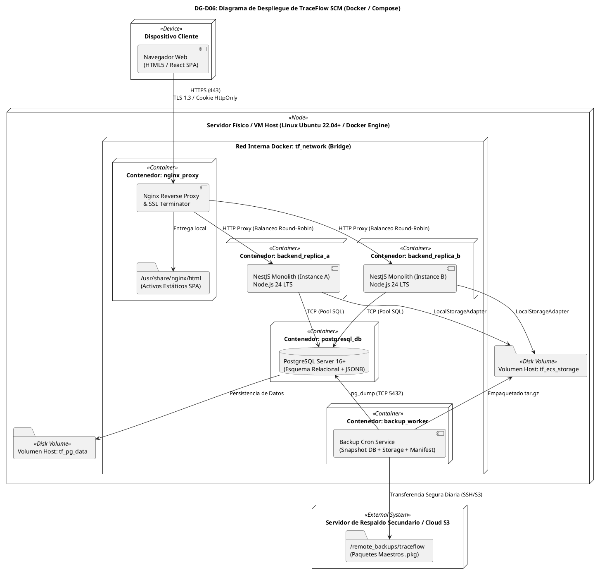

---

## 13.3 Análisis de Disponibilidad: Proceso vs Falla Física de Host
Conforme a lo evaluado en **ADR-010**, se establece la distinción formal de disponibilidad para no confundir capacidades operativas:
1. **Alta Disponibilidad ante Fallos de Proceso y Despliegues Sin Inactividad (*Zero-Downtime*)**:
   - Se ejecutan **dos réplicas stateless del backend** detrás de Nginx.
   - Cada contenedor implementa sondeos de salud continuos (`/health/liveness` y `/health/readiness`).
   - Si una instancia falla, Nginx redirige el tráfico a la réplica sana mientras Docker reinicia la afectada.
   - Las actualizaciones de versión se ejecutan en modo escalonado (*rolling updates*): se levanta la nueva imagen, se espera a que pase el health check y luego se apaga la versión anterior, garantizando cero interrupciones de software.
2. **Límites de Infraestructura y Contingencia ante Falla de Hardware Físico**:
   - **Declaración Explícita de Riesgo**: En una infraestructura basada en un único host físico, Docker Compose no puede garantizar un 99.9% de uptime ante fallo físico catastrófico de placa base o corte eléctrico total.
   - **Mitigación Aprobada**: Procedimiento formal de **Recuperación ante Desastres (Disaster Recovery)** respaldado por la Unidad Lógica de Respaldo transferida externamente, con un Objetivo de Tiempo de Recuperación de **RTO $\le 2$ horas**. La migración a clústeres multi-nodo (Docker Swarm o Kubernetes) queda definida como ruta de evolución futura.

---

# 14. Estrategia de Backup y Recuperación (RNF-09)

## 14.1 Definición de la Unidad Lógica de Respaldo
En cumplimiento obligatorio de la corrección arquitectónica de ADR-010, el sistema rechaza el respaldo aislado de PostgreSQL y define la **Unidad Lógica de Respaldo**:

$$\mathbf{Backup\ TraceFlow} = \mathbf{Snapshot\ DB} + \mathbf{Snapshot\ Storage} + \mathbf{Manifest}$$

El respaldo consolida de forma atómica:
1. **Snapshot de Base de Datos**: Volcado transaccional consistente de PostgreSQL generado mediante:
   `pg_dump --format=custom --clean --if-exists tf_db > db_{timestamp}.dump`
2. **Snapshot de Almacenamiento Físico de ECS**: Empaquetado comprimido de las bibliotecas de artefactos (`/storage/trabajo`, `/storage/soporte`, `/storage/maestra`):
   `tar -czf storage_{timestamp}.tar.gz /storage/`
3. **Manifiesto de Consistencia**: Archivo `manifest_{timestamp}.json` que vincula el volcado relacional y el paquete físico, certificando:
   - Marca temporal exacta y versión de software.
   - Checksum SHA-256 del archivo `db_{timestamp}.dump`.
   - Checksum SHA-256 del archivo `storage_{timestamp}.tar.gz`.
   - Cantidad total de versiones de ECS respaldadas.

## 14.2 Protocolo Automatizado de Respaldo y Verificación SHA-256
El contenedor `backup_worker` ejecuta diariamente el siguiente flujo:
1. Registro en `audit_log` del inicio del proceso de respaldo.
2. Ejecución de `pg_dump` transaccional.
3. Copia snapshot comprimida del almacenamiento físico.
4. Cómputo criptográfico de los hashes SHA-256 de ambos ficheros.
5. Generación del archivo de manifiesto firmado lógicamente.
6. Empaquetado maestro en `traceflow_backup_{timestamp}.pkg`.
7. Transferencia inmediata a almacenamiento secundario externo.
8. Registro en `audit_log` de la finalización conforme con el hash del paquete maestro.

## 14.3 Parámetros Operativos de Diseño (Horarios, Retención, RTO)
Los siguientes parámetros se clasifican expresamente como **PARÁMETROS OPERATIVOS DE DISEÑO**, adoptados para dar cumplimiento al requerimiento funcional `RNF-09` (Respaldo diario automático del repositorio central):
- **Ventana de Ejecución**: Programada diariamente a las **02:00 AM (hora local)**, periodo de menor concurrencia del sistema.
- **Política de Retención Histórica**:
  - Respaldos diarios: Retención durante **30 días calendario**.
  - Respaldos mensuales de fin de ciclo: Retención durante **12 meses**.
- **Tiempo Objetivo de Recuperación (RTO)**: $\le 2$ horas para restablecer el servicio completo en un servidor alternativo.
- **Punto Objetivo de Recuperación (RPO)**: $\le 24$ horas (pérdida máxima acotada al ciclo diario).
- **Prueba Periódica de Restauración (*Drill*)**: Ejecución trimestral automatizada de restauración en un ambiente aislado para certificar que el paquete maestro se reconstruye sin artefactos huérfanos.

---

# 15. Observabilidad

## 15.1 Logging Estructurado, Health Checks y Métricas
Para satisfacer la mantenibilidad (RNF-08) y fiabilidad operativa sin introducir infraestructura pesada de monitoreo:
1. **Logging Estructurado en Formato JSON**:
   - Salida estándar (`stdout`) procesada por librerías nativas (`winston` o `pino`).
   - Cada línea de log incorpora: `timestamp`, `level` (`INFO`, `WARN`, `ERROR`), `context` (nombre del módulo), `correlation_id` (UUID transversal inyectado por Nginx/NestJS) y `payload`.
2. **Endpoints de Salud (Health Checks)**:
   - `GET /health/liveness`: Retorna `200 OK` si el proceso Node.js responde.
   - `GET /health/readiness`: Verifica la conectividad activa hacia el pool de PostgreSQL y el acceso de lectura/escritura al volumen `/storage/`.
3. **Métricas Clave de Rendimiento (RNF-06)**:
   - Registro de tiempos de respuesta en cada endpoint mediante interceptor global de NestJS, alertando si consultas de historial (`CU-13`) o auditoría (`CU-27`) se aproximan al umbral de 3 segundos.

## 15.2 Alertas Operativas y de Integridad
El backend emite alertas automáticas enviadas a los administradores de seguridad y configuración ante:
- Tres o más intentos fallidos de autenticación en menos de 5 minutos para una misma cuenta.
- Detección de conflicto de bloqueo de sincronización activo (`RN-06`).
- Violación detectada en la reconciliación periódica del `ReconciliationWorker` (discrepancia de checksum SHA-256 o archivo faltante en disco).
- Fallo en la rutina diaria del `BackupWorker` o espacio en disco en volumen persistente superior al 85%.

---

# 16. Matriz de Trazabilidad de Diseño

La siguiente matriz demuestra la alineación ininterrumpida entre el SRS de Análisis (`FD03`), el SAD de Análisis (`FD04`), los registros de decisión aprobados (`ADR-001..010`) y los componentes técnicos formalizados en este SAD de Diseño:

| Componente Técnico de Diseño | ADR Asociado | Módulo SAD Análisis | Requerimientos Funcionales (RF) | Atributos de Calidad (RNF) | Reglas de Negocio (RN) | Casos de Uso Gobernados |
| :--- | :---: | :---: | :--- | :--- | :--- | :--- |
| **`AuthModule` / Sessions / SoD** | ADR-003, ADR-006 | MOD-01 | RF-01, RF-17 | RNF-01 (Seguridad) | RN-01, RN-04, SoD SAD | CU-01 |
| **`ProjectModule`** | ADR-001, ADR-003 | MOD-02 | RF-02 | RNF-05 (Escalabilidad) | RN-01 | CU-02, CU-03 |
| **`ConfigItemModule`** | ADR-003, ADR-004 | MOD-03 | RF-03, RF-16, RF-17 | RNF-03 (Integridad), RNF-06 | RN-08 (SHA-256) | CU-09, CU-26 |
| **`ChangeRequestModule`** | ADR-001, ADR-009 | MOD-04 | RF-04, RF-05, RF-06, RF-07, RF-14 | RNF-04 (Usabilidad) | RN-01, RN-05, RN-07 | CU-04, CU-04.1, CU-05, CU-06, CU-07, CU-08, CU-22, CU-30 |
| **`VersionControlModule` / SyncLock** | ADR-004, ADR-005, ADR-007 | MOD-05 | RF-08, RF-09 | RNF-01, RNF-06 | RN-02, RN-03, RN-04, RN-06 | CU-10, CU-11, CU-12, CU-13, CU-14 |
| **`QualityModule`** | ADR-003, ADR-006 | MOD-06 | RF-10, RF-11 | RNF-01 | RN-01, RN-05 (SoD QA), RN-09 | CU-15, CU-16, CU-17, CU-18, CU-19, CU-29 |
| **`BaselineModule`** | ADR-004, ADR-005 | MOD-07 | RF-12, RF-13 | RNF-01, RNF-06 | RN-02, RN-04, RN-08, RN-09 | CU-20, CU-21 |
| **`IncidentModule`** | ADR-001, ADR-009 | MOD-08 | RF-15 | RNF-04 | RN-03 | CU-23, CU-24, CU-25 |
| **`AuditModule` / Append-Only** | ADR-004, ADR-008 | MOD-09 | RF-16, RF-17, RF-18 | RNF-01, RNF-03, RNF-06 | RN-02, RN-03 | CU-27, CU-28 |
| **`StoragePort` / LocalStorage** | ADR-005 | Transversal (MOD-03,05,07) | RF-08, RF-09, RF-17 | RNF-03, RNF-07 (Compatibilidad) | RN-04, RN-08 | CU-10, CU-12, CU-20, CU-21, CU-26 |
| **Docker Compose + Backup Worker**| ADR-010 | Infraestructura | Transversal | RNF-02 (Disponibilidad), RNF-08, RNF-09 | Transversal | Transversal |

---

# 17. Decisiones Pendientes para la Baseline de Implementación

Con el fin de preservar el principio de arquitectura diferida y no tomar decisiones apresuradas que aten la implementación antes de evaluar las librerías concretas en el entorno de desarrollo, se declaran formalmente las siguientes **decisiones abiertas**:

1. **Selección Definitiva del ORM / Data Mapper en NestJS**:
   - Candidatos: **TypeORM**, **Prisma** o **Kysely / node-postgres** nativo.
   - Criterio de Selección: Capacidad para ejecutar transacciones ACID manuales con bloqueo pesimista y control milimétrico de sentencias DDL (índices condicionales parciales de PostgreSQL).
2. **Fijación de la Versión Mayor de React (18 vs 19)**:
   - Supeditada a la matriz de compatibilidad de los paquetes de enrutamiento y librerías de componentes UI al congelar la baseline técnica de codificación.
3. **Selección de Librería de Componentes UI y Formularios**:
   - Candidatos UI: **Tailwind CSS + Radix UI / Shadcn UI**.
   - Candidatos Formularios: **React Hook Form + Zod / Yup** para validación en cliente alineada a los esquemas de backend.
4. **Adopción de Caché Redis para Sesiones**:
   - Actualmente sustentada sobre PostgreSQL (`user_session`). Se evaluará la inclusión de Redis únicamente si las pruebas de estrés iniciales arrojan más de 500 peticiones concurrentes/segundo.
5. **Proveedor Futuro de Almacenamiento Compatible S3 / MinIO**:
   - Desacoplado mediante `StoragePort`. El adaptador `S3StorageAdapter` se evaluará cuando el cliente ÉXODO S.A.C. determine su infraestructura de nube productiva.
6. **Entorno de Hosting Productivo Definitivo**:
   - Se evaluará entre despliegue en VM Cloud dedicada (AWS EC2 / DigitalOcean) o plataforma PaaS/CaaS administrada compatible con Docker.

---

# 18. Auditoría SAD de Diseño v0.1

Se ejecuta la auditoría de control de calidad sobre el presente documento técnico antes de su entrega:

| Área Evaluada | Trazabilidad con Baselines | Coherencia con ADRs | Completitud Técnica | Hallazgos y Dictamen de Auditoría |
| :--- | :---: | :---: | :---: | :--- |
| **Gobernanza y Jerarquía** | Plena (FD03 v1.0, FD04 v1.1) | Plena | Completo | Jerarquía respetada; ninguna regla ni CU fue alterado. Sin contradicciones. |
| **Decisiones Técnicas** | Plena (18 RF, 9 RNF, 9 RN) | Plena (ADR-001..010) | Completo | Separación rigurosa entre Decisiones Arquitectónicas y Versiones de Implementación. |
| **Arquitectura Física** | Plena | Plena (ADR-010) | Completo | Diagrama DG-D01 modela Nginx, React, NestJS, PostgreSQL, Storage y Backup. |
| **Monolito Modular** | Plena (MOD-01 a MOD-09) | Plena (ADR-001, ADR-003)| Completo | Mapeo 1:1, reglas estrictas de no acceso a repositorios ajenos y diagrama DG-D02. |
| **Capas Arquitectónicas** | Plena | Plena | Completo | Clean Architecture con inversión de control estricta en 4 capas. |
| **Diseño Frontend** | Plena (7 actores canónicos) | Plena (ADR-002) | Completo | Organización modular por features, route guards, TanStack Query y manejo de errores. |
| **Modelo de Datos** | Plena (Derivado de DG-12) | Plena (ADR-004, ADR-007)| Completo | 18 tablas relacionales sin entidades inventadas. Restricción única para RN-06. DG-D03. |
| **Custodia de Artefactos** | Plena (3 bibliotecas SCM) | Plena (ADR-005) | Completo | Puerto `StoragePort`, LocalStorageAdapter, protocolo por etapas y reconciliador. DG-D04. |
| **Diseño de API REST** | Plena (31 Casos de Uso) | Plena (ADR-009) | Completo | Matriz de correspondencia exhaustiva para los 31 CU y formato RFC 7807. |
| **Seguridad y SoD** | Plena (RN-01, RN-04, SoD) | Plena (ADR-006) | Completo | Cookie HttpOnly, sesión opaca en BD, Guard SoD y timeout de 15 min de diseño. DG-D05. |
| **Auditoría Forense** | Plena (RF-16, RF-17, RN-03) | Plena (ADR-008) | Completo | Tabla append-only, revocación de UPDATE/DELETE, triggers y encadenamiento SHA-256. |
| **Secuencias Técnicas** | Plena (Flujos críticos) | Plena | Completo | 9 diagramas DG-DSEQ-XX cubriendo los casos más complejos de ingeniería SCM. |
| **Despliegue y Respaldo** | Plena (RNF-02, RNF-08, RNF-09) | Plena (ADR-010) | Completo | Unidad Lógica (`DB + Storage + Manifest`), DG-D06 y delimitación de disponibilidad. |

> [!IMPORTANT]
> **DICTAMEN FORMAL DE ESTADO**:  
> El presente documento se declara formalmente como **FD05 — SAD DE DISEÑO v0.1 (BORRADOR CONTROLADO)**.  
> No se congela todavía como Baseline de Diseño v1.0. La congelación como Baseline formal se efectuará una vez que el equipo y la cátedra validen exhaustivamente los contratos de datos, las firmas de API y las secuencias de interacción técnica.