# Catálogo Centralizado de Diagramas PlantUML - TraceFlow SCM

> **Sistema de Gestión de Configuración de Software - TraceFlow SCM**  
> **Repositorio:** `TraceFlow`  
> **Documento:** `docs/DIAGRAMS.md`  
> **Fuente Oficial de Diagramas (SSOT)**  
> **Versión:** 1.0  
> **Fecha:** 2026-09-30  
> **Estado General:** APROBADO  

---

## Auditoría Inicial de Diagramas en el SRS

Durante la auditoría del documento maestro `FD03-EPIS-Informe_SRS.md` y de los artefactos visuales referenciados (`assets/page-XXX.png`), se identificaron los siguientes hallazgos:

1. **Pérdida de Imágenes Originales en la Conversión:** El repositorio original contenía únicamente referencias a imágenes extraídas del PDF (`assets/page-007.png`, `page-018.png`, `page-031.png`, etc.) sin que los archivos de imagen existieran físicamente en el directorio `assets/`.
2. **Diagramas Totalmente Especificados:** El flujo propuesto de gestión de cambios (Sección 4.2), los perfiles de usuario, el ciclo de vida de la RFC, los paquetes arquitecturales y los 28 casos de uso cuentan con suficiente detalle narrativo y tabular para ser reconstruidos con total fidelidad en código PlantUML.
3. **Diagramas Omitidos en el Documento Fuente:** En la sección 6.2.1 de diagramas de secuencia existe una discontinuidad: se documenta `CUS01`, `CUS02` y luego se salta directamente a `CUS04`, omitiendo por completo el diagrama de secuencia para `CUS03` (*Consultar proyecto*).
4. **Diagramas sin Especificación Textual de Detalle:** El Diagrama de Clases (Sección 6.2.2, Pág. 115) y el Modelo Lógico (Sección 6.2, Pág. 95) solo contaban con referencias gráficas sin tablas de atributos ni métodos en el texto. Para cumplir con la regla de no inventar información técnica, se registran formalmente como pendientes de reconstrucción.

---

## Índice General de Diagramas

| ID | Nombre del Diagrama | Tipo | Estado | Versión |
| :--- | :--- | :--- | :---: | :---: |
| [DG-01](#dg-01--organigrama-del-c-sharkteam-y-entorno-cliente) | Organigrama del C-SharkTeam y Entorno Cliente | Estructura Organizacional | APROBADO | 1.0 |
| [DG-02](#dg-02--diagrama-de-actividades-del-proceso-actual-as-is) | Diagrama de Actividades del Proceso Actual (AS-IS) | Actividades | REVISION | 1.0 |
| [DG-03](#dg-03--diagrama-del-proceso-propuesto-de-gestión-de-cambios-to-be-v2) | Diagrama del Proceso Propuesto de Gestión de Cambios (TO-BE v2) | Actividades (Swimlanes) | APROBADO | 2.0 |
| [DG-04](#dg-04--diagrama-de-paquetes-arquitecturales) | Diagrama de Paquetes Arquitecturales de TraceFlow SCM | Paquetes | APROBADO | 1.1 |
| [DG-05](#dg-05--diagrama-general-de-casos-de-uso) | Diagrama General de Casos de Uso | Casos de Uso | APROBADO | 1.1 |
| [DG-06](#dg-06--casos-de-uso-administración-de-usuarios-y-proyectos) | Casos de Uso: Administración de Usuarios y Proyectos | Casos de Uso | APROBADO | 1.0 |
| [DG-07](#dg-07--casos-de-uso-registro-y-evaluación-de-rfc-e-incidencias) | Casos de Uso: Registro y Evaluación de RFC e Incidencias | Casos de Uso | APROBADO | 1.1 |
| [DG-08](#dg-08--casos-de-uso-scm-core-ecs-bibliotecas-y-líneas-base) | Casos de Uso: SCM Core (ECS, Bibliotecas y Líneas Base) | Casos de Uso | APROBADO | 1.0 |
| [DG-09](#dg-09--casos-de-uso-implementación-y-validación-de-calidad) | Casos de Uso: Implementación y Validación de Calidad | Casos de Uso | APROBADO | 1.1 |
| [DG-10](#dg-10--casos-de-uso-trazabilidad-auditoría-e-integridad) | Casos de Uso: Trazabilidad, Auditoría e Integridad | Casos de Uso | APROBADO | 1.0 |
| [DG-11](#dg-11--diagrama-de-estados-del-ciclo-de-vida-de-la-rfc) | Diagrama de Estados del Ciclo de Vida de la RFC (14 Estados Oficiales) | Estados | APROBADO | 2.0 |
| [DG-SEQ-01](#dg-seq-01--gestionar-usuarios-y-roles-cu-01) | Secuencia: Gestionar usuarios y roles (CU-01) | Secuencia | APROBADO | 2.0 |
| [DG-SEQ-02](#dg-seq-02--crear-y-administrar-proyectos-cu-02) | Secuencia: Crear y administrar proyectos (CU-02) | Secuencia | APROBADO | 2.0 |
| [DG-SEQ-03](#dg-seq-03--consultar-proyecto-cu-03) | Secuencia: Consultar proyecto (CU-03) | Secuencia | APROBADO | 2.0 |
| [DG-SEQ-04](#dg-seq-04--registrar-solicitud-de-cambio-rfc-cu-04) | Secuencia: Registrar Solicitud de Cambio (RFC) (CU-04) | Secuencia | APROBADO | 2.0 |
| [DG-SEQ-04.1](#dg-seq-04.1--subsanar-solicitud-de-cambio-rfc-cu-04.1) | Secuencia: Subsanar Solicitud de Cambio (RFC) (CU-04.1) | Secuencia | APROBADO | 2.0 |
| [DG-SEQ-05](#dg-seq-05--validar-y-clasificar-la-solicitud-cu-05) | Secuencia: Validar y clasificar la solicitud (CU-05) | Secuencia | APROBADO | 2.0 |
| [DG-SEQ-06](#dg-seq-06--realizar-análisis-de-impacto-técnico-cu-06) | Secuencia: Realizar análisis de impacto técnico (CU-06) | Secuencia | APROBADO | 2.0 |
| [DG-SEQ-07](#dg-seq-07--evaluar-cambio-mayor-en-ccb-cu-07) | Secuencia: Evaluar Cambio Mayor en CCB (CU-07) | Secuencia | APROBADO | 2.0 |
| [DG-SEQ-08](#dg-seq-08--emitir-orden-de-cambio-ecneco-cu-08) | Secuencia: Emitir Orden de Cambio (ECN/ECO) (CU-08) | Secuencia | APROBADO | 2.0 |
| [DG-SEQ-09](#dg-seq-09--registrar-ecs-cu-09) | Secuencia: Registrar ECS (CU-09) | Secuencia | APROBADO | 2.0 |
| [DG-SEQ-10](#dg-seq-10--efectuar-check-out-cu-10) | Secuencia: Efectuar Check-Out (CU-10) | Secuencia | APROBADO | 2.0 |
| [DG-SEQ-11](#dg-seq-11--aplicar-bloqueo-de-sincronización-cu-11) | Secuencia: Aplicar bloqueo de sincronización (CU-11) | Secuencia | APROBADO | 2.0 |
| [DG-SEQ-12](#dg-seq-12--efectuar-check-in-cu-12) | Secuencia: Efectuar Check-In (CU-12) | Secuencia | APROBADO | 2.0 |
| [DG-SEQ-13](#dg-seq-13--consultar-historial-de-versiones-cu-13) | Secuencia: Consultar historial de versiones (CU-13) | Secuencia | APROBADO | 2.0 |
| [DG-SEQ-14](#dg-seq-14--implementar-cambio-en-el-ecs-cu-14) | Secuencia: Implementar cambio en el ECS (CU-14) | Secuencia | APROBADO | 2.0 |
| [DG-SEQ-15](#dg-seq-15--ejecutar-pruebas-unitarias-locales-cu-15) | Secuencia: Ejecutar pruebas unitarias locales (CU-15) | Secuencia | APROBADO | 2.0 |
| [DG-SEQ-16](#dg-seq-16--ejecutar-pruebas-de-integración-cu-16) | Secuencia: Ejecutar pruebas de integración (CU-16) | Secuencia | APROBADO | 2.0 |
| [DG-SEQ-17](#dg-seq-17--certificar-conformidad-del-cambio-cu-17) | Secuencia: Certificar conformidad del cambio (CU-17) | Secuencia | APROBADO | 2.0 |
| [DG-SEQ-18](#dg-seq-18--reportar-no-conformidad-cu-18) | Secuencia: Reportar no conformidad (CU-18) | Secuencia | APROBADO | 2.0 |
| [DG-SEQ-19](#dg-seq-19--reevaluar-y-re-testear-cu-19) | Secuencia: Reevaluar y re-testear (CU-19) | Secuencia | APROBADO | 2.0 |
| [DG-SEQ-20](#dg-seq-20--crear-y-congelar-línea-base-cu-20) | Secuencia: Crear y congelar línea base (CU-20) | Secuencia | APROBADO | 2.0 |
| [DG-SEQ-21](#dg-seq-21--ejecutar-rollback-cu-21) | Secuencia: Ejecutar rollback (CU-21) | Secuencia | APROBADO | 2.0 |
| [DG-SEQ-22](#dg-seq-22--cancelar-orden-de-cambio-cu-22) | Secuencia: Cancelar Orden de Cambio (CU-22) | Secuencia | APROBADO | 2.0 |
| [DG-SEQ-23](#dg-seq-23--registrar-incidencia-cu-23) | Secuencia: Registrar incidencia (CU-23) | Secuencia | APROBADO | 2.0 |
| [DG-SEQ-24](#dg-seq-24--consultar-estado-de-ticket-cu-24) | Secuencia: Consultar estado de ticket (CU-24) | Secuencia | APROBADO | 2.0 |
| [DG-SEQ-25](#dg-seq-25--derivar-incidencia-a-rfc-cu-25) | Secuencia: Derivar incidencia a RFC (CU-25) | Secuencia | APROBADO | 2.0 |
| [DG-SEQ-26](#dg-seq-26--validar-integridad-checksum-cu-26) | Secuencia: Validar integridad (checksum) (CU-26) | Secuencia | APROBADO | 2.0 |
| [DG-SEQ-27](#dg-seq-27--auditar-acciones-del-sistema-cu-27) | Secuencia: Auditar acciones del sistema (CU-27) | Secuencia | APROBADO | 2.0 |
| [DG-SEQ-28](#dg-seq-28--generar-reportes-de-estado-cu-28) | Secuencia: Generar reportes de estado (CU-28) | Secuencia | APROBADO | 2.0 |
| [DG-SEQ-29](#dg-seq-29--validar-aceptación-del-cambio-por-el-usuario-uat-cu-29) | Secuencia: Validar aceptación del cambio por el usuario (UAT) (CU-29) | Secuencia | APROBADO | 2.0 |
| [DG-SEQ-30](#dg-seq-30--autorizar-cambio-menor-cu-30) | Secuencia: Autorizar Cambio Menor (CU-30) | Secuencia | APROBADO | 2.0 |
| [DG-AO-01](#dg-ao-01-análisis-de-objetos-gestionar-usuarios-y-roles-cu-01) | Análisis de Objetos: Gestionar usuarios y roles (CU-01) | Análisis (BCE) | APROBADO | 1.0 |
| [DG-AO-02](#dg-ao-02-análisis-de-objetos-crear-y-administrar-proyectos-cu-02) | Análisis de Objetos: Crear y administrar proyectos (CU-02) | Análisis (BCE) | APROBADO | 1.0 |
| [DG-AO-03](#dg-ao-03-análisis-de-objetos-consultar-proyecto-cu-03) | Análisis de Objetos: Consultar proyecto (CU-03) | Análisis (BCE) | APROBADO | 1.0 |
| [DG-AO-04](#dg-ao-04-análisis-de-objetos-registrar-solicitud-de-cambio-rfc-cu-04) | Análisis de Objetos: Registrar Solicitud de Cambio (RFC) (CU-04) | Análisis (BCE) | APROBADO | 1.0 |
| [DG-AO-04.1](#dg-ao-041-análisis-de-objetos-subsanar-solicitud-de-cambio-rfc-cu-041) | Análisis de Objetos: Subsanar Solicitud de Cambio (RFC) (CU-04.1) | Análisis (BCE) | APROBADO | 1.0 |
| [DG-AO-05](#dg-ao-05-análisis-de-objetos-validar-y-clasificar-la-solicitud-cu-05) | Análisis de Objetos: Validar y clasificar la solicitud (CU-05) | Análisis (BCE) | APROBADO | 1.0 |
| [DG-AO-06](#dg-ao-06-análisis-de-objetos-realizar-an-lisis-de-impacto-t-cnico-cu-06) | Análisis de Objetos: Realizar análisis de impacto técnico (CU-06) | Análisis (BCE) | APROBADO | 1.0 |
| [DG-AO-07](#dg-ao-07-análisis-de-objetos-evaluar-cambio-mayor-en-ccb-cu-07) | Análisis de Objetos: Evaluar Cambio Mayor en CCB (CU-07) | Análisis (BCE) | APROBADO | 1.0 |
| [DG-AO-08](#dg-ao-08-análisis-de-objetos-emitir-orden-de-cambio-ecn-eco-cu-08) | Análisis de Objetos: Emitir Orden de Cambio (ECN/ECO) (CU-08) | Análisis (BCE) | APROBADO | 1.0 |
| [DG-AO-09](#dg-ao-09-análisis-de-objetos-registrar-ecs-cu-09) | Análisis de Objetos: Registrar ECS (CU-09) | Análisis (BCE) | APROBADO | 1.0 |
| [DG-AO-10](#dg-ao-10-análisis-de-objetos-efectuar-check-out-cu-10) | Análisis de Objetos: Efectuar Check-Out (CU-10) | Análisis (BCE) | APROBADO | 1.0 |
| [DG-AO-11](#dg-ao-11-análisis-de-objetos-aplicar-bloqueo-de-sincronizaci-n-cu-11) | Análisis de Objetos: Aplicar bloqueo de sincronización (CU-11) | Análisis (BCE) | APROBADO | 1.0 |
| [DG-AO-12](#dg-ao-12-análisis-de-objetos-efectuar-check-in-cu-12) | Análisis de Objetos: Efectuar Check-In (CU-12) | Análisis (BCE) | APROBADO | 1.0 |
| [DG-AO-13](#dg-ao-13-análisis-de-objetos-consultar-historial-de-versiones-cu-13) | Análisis de Objetos: Consultar historial de versiones (CU-13) | Análisis (BCE) | APROBADO | 1.0 |
| [DG-AO-14](#dg-ao-14-análisis-de-objetos-implementar-cambio-en-el-ecs-cu-14) | Análisis de Objetos: Implementar cambio en el ECS (CU-14) | Análisis (BCE) | APROBADO | 1.0 |
| [DG-AO-15](#dg-ao-15-análisis-de-objetos-ejecutar-pruebas-unitarias-locales-cu-15) | Análisis de Objetos: Ejecutar pruebas unitarias locales (CU-15) | Análisis (BCE) | APROBADO | 1.0 |
| [DG-AO-16](#dg-ao-16-análisis-de-objetos-ejecutar-pruebas-de-integraci-n-cu-16) | Análisis de Objetos: Ejecutar pruebas de integración (CU-16) | Análisis (BCE) | APROBADO | 1.0 |
| [DG-AO-17](#dg-ao-17-análisis-de-objetos-certificar-conformidad-del-cambio-cu-17) | Análisis de Objetos: Certificar conformidad del cambio (CU-17) | Análisis (BCE) | APROBADO | 1.0 |
| [DG-AO-18](#dg-ao-18-análisis-de-objetos-reportar-no-conformidad-cu-18) | Análisis de Objetos: Reportar no conformidad (CU-18) | Análisis (BCE) | APROBADO | 1.0 |
| [DG-AO-19](#dg-ao-19-análisis-de-objetos-reevaluar-y-re-testear-cu-19) | Análisis de Objetos: Reevaluar y re-testear (CU-19) | Análisis (BCE) | APROBADO | 1.0 |
| [DG-AO-20](#dg-ao-20-análisis-de-objetos-crear-y-congelar-l-nea-base-cu-20) | Análisis de Objetos: Crear y congelar línea base (CU-20) | Análisis (BCE) | APROBADO | 1.0 |
| [DG-AO-21](#dg-ao-21-análisis-de-objetos-ejecutar-rollback-cu-21) | Análisis de Objetos: Ejecutar rollback (CU-21) | Análisis (BCE) | APROBADO | 1.0 |
| [DG-AO-22](#dg-ao-22-análisis-de-objetos-cancelar-orden-de-cambio-cu-22) | Análisis de Objetos: Cancelar Orden de Cambio (CU-22) | Análisis (BCE) | APROBADO | 1.0 |
| [DG-AO-23](#dg-ao-23-análisis-de-objetos-registrar-incidencia-cu-23) | Análisis de Objetos: Registrar incidencia (CU-23) | Análisis (BCE) | APROBADO | 1.0 |
| [DG-AO-24](#dg-ao-24-análisis-de-objetos-consultar-estado-de-ticket-cu-24) | Análisis de Objetos: Consultar estado de ticket (CU-24) | Análisis (BCE) | APROBADO | 1.0 |
| [DG-AO-25](#dg-ao-25-análisis-de-objetos-derivar-incidencia-a-rfc-cu-25) | Análisis de Objetos: Derivar incidencia a RFC (CU-25) | Análisis (BCE) | APROBADO | 1.0 |
| [DG-AO-26](#dg-ao-26-análisis-de-objetos-validar-integridad-checksum-cu-26) | Análisis de Objetos: Validar integridad (checksum) (CU-26) | Análisis (BCE) | APROBADO | 1.0 |
| [DG-AO-27](#dg-ao-27-análisis-de-objetos-auditar-acciones-del-sistema-cu-27) | Análisis de Objetos: Auditar acciones del sistema (CU-27) | Análisis (BCE) | APROBADO | 1.0 |
| [DG-AO-28](#dg-ao-28-análisis-de-objetos-generar-reportes-de-estado-cu-28) | Análisis de Objetos: Generar reportes de estado (CU-28) | Análisis (BCE) | APROBADO | 1.0 |
| [DG-AO-29](#dg-ao-29-análisis-de-objetos-validar-aceptaci-n-del-cambio-por-el-usuario-uat-cu-29) | Análisis de Objetos: Validar aceptación del cambio por el usuario (UAT) (CU-29) | Análisis (BCE) | APROBADO | 1.0 |
| [DG-AO-30](#dg-ao-30-análisis-de-objetos-autorizar-cambio-menor-cu-30) | Análisis de Objetos: Autorizar Cambio Menor (CU-30) | Análisis (BCE) | APROBADO | 1.0 |
| [DG-12](#dg-12--modelo-conceptual-del-dominio-traceflow-scm) | Modelo Conceptual del Dominio TraceFlow SCM | Clases Conceptuales (Análisis) | APROBADO | 2.0 |
| [DG-13](#dg-13--modelo-lógico-de-la-arquitectura-traceflow-scm) | Modelo Lógico de la Arquitectura TraceFlow SCM | Componentes / Arquitectura Física | PENDIENTE (SAD) | 1.0 |
| [DG-SAD-A01](#dg-sad-a01--contexto-arquitectónico-de-traceflow-scm-fase-de-análisis) | Contexto Arquitectónico de TraceFlow SCM (Fase de Análisis) | Contexto / Arquitectura Conceptual | APROBADO | 1.0 |
| [DG-SAD-A02](#dg-sad-a02--arquitectura-lógica-conceptual-de-traceflow-scm) | Arquitectura Lógica Conceptual de TraceFlow SCM | Paquetes / Arquitectura Conceptual | APROBADO | 1.0 |
| [DG-D01](#dg-d01--arquitectura-física-de-traceflow-scm) | Arquitectura Física de TraceFlow SCM | Componentes / Arquitectura Física | BORRADOR (SAD Diseño) | 0.2 |
| [DG-D02](#dg-d02--componentes-del-monolito-modular-backend) | Componentes del Monolito Modular Backend (MOD-01..09) | Componentes / Modularidad | BORRADOR (SAD Diseño) | 0.2 |
| [DG-D03](#dg-d03--modelo-relacional-lógico-de-base-de-datos) | Modelo Relacional Lógico de Base de Datos | Entidad-Relación / Lógico | BORRADOR (SAD Diseño) | 0.2 |
| [DG-D04](#dg-d04--arquitectura-de-storage-y-bibliotecas) | Arquitectura de Storage y Transición entre 3 Bibliotecas | Componentes / Almacenamiento | BORRADOR (SAD Diseño) | 0.2 |
| [DG-D05](#dg-d05--flujo-técnico-de-autenticación-y-autorización) | Flujo Técnico de Autenticación, RBAC y SoD | Interacción / Seguridad | BORRADOR (SAD Diseño) | 0.2 |
| [DG-D06](#dg-d06--diagrama-de-despliegue-de-traceflow-scm) | Diagrama de Despliegue de TraceFlow SCM (Docker) | Despliegue / Nodos OCI | BORRADOR (SAD Diseño) | 0.2 |
| [DG-DSEQ-04](#dg-dseq-04--registrar-solicitud-de-cambio-rfc) | Secuencia Diseño: Registrar Solicitud de Cambio (CU-04) | Secuencia Técnica | BORRADOR (SAD Diseño) | 0.2 |
| [DG-DSEQ-08](#dg-dseq-08--emitir-orden-de-cambio-ecneco) | Secuencia Diseño: Emitir Orden de Cambio (CU-08) | Secuencia Técnica | BORRADOR (SAD Diseño) | 0.2 |
| [DG-DSEQ-10](#dg-dseq-10--efectuar-check-out-y-bloqueo-de-sincronización) | Secuencia Diseño: Efectuar Check-Out y Bloqueo (CU-10, CU-11) | Secuencia Técnica | BORRADOR (SAD Diseño) | 0.2 |
| [DG-DSEQ-12](#dg-dseq-12--efectuar-check-in-con-verificación-sha-256) | Secuencia Diseño: Efectuar Check-In con SHA-256 (CU-12) | Secuencia Técnica | BORRADOR (SAD Diseño) | 0.2 |
| [DG-DSEQ-17](#dg-dseq-17--certificar-conformidad-del-cambio-en-qa) | Secuencia Diseño: Certificar Conformidad QA (CU-17) | Secuencia Técnica | BORRADOR (SAD Diseño) | 0.2 |
| [DG-DSEQ-20](#dg-dseq-20--crear-y-congelar-línea-base) | Secuencia Diseño: Crear y Congelar Línea Base (CU-20) | Secuencia Técnica | BORRADOR (SAD Diseño) | 0.2 |
| [DG-DSEQ-21](#dg-dseq-21--ejecutar-rollback-de-ecs) | Secuencia Diseño: Ejecutar Rollback de ECS (CU-21) | Secuencia Técnica | BORRADOR (SAD Diseño) | 0.2 |
| [DG-DSEQ-29](#dg-dseq-29--validar-aceptación-del-cambio-por-el-usuario-uat) | Secuencia Diseño: Validar Aceptación UAT (CU-29) | Secuencia Técnica | BORRADOR (SAD Diseño) | 0.2 |
| [DG-DSEQ-30](#dg-dseq-30--autorizar-cambio-menor-por-vía-delegada) | Secuencia Diseño: Autorizar Cambio Menor (CU-30) | Secuencia Técnica | BORRADOR (SAD Diseño) | 0.2 |

---

# DG-01 — Organigrama del C-SharkTeam y Entorno Cliente

**ID:** DG-01  
**Nombre:** Organigrama del Equipo de Desarrollo C-SharkTeam y Entorno Cliente (ÉXODO S.A.C.)  
**Tipo:** Estructura Organizacional  
**Estado:** APROBADO  
**Versión:** 1.0  
**RF relacionados:** RF-01  
**RN relacionadas:** N/A  
**CU relacionados:** CU-01  
**Fuente:** `FD03-EPIS-Informe_SRS.md`, Sección 2.4 (Págs. 7-8)  

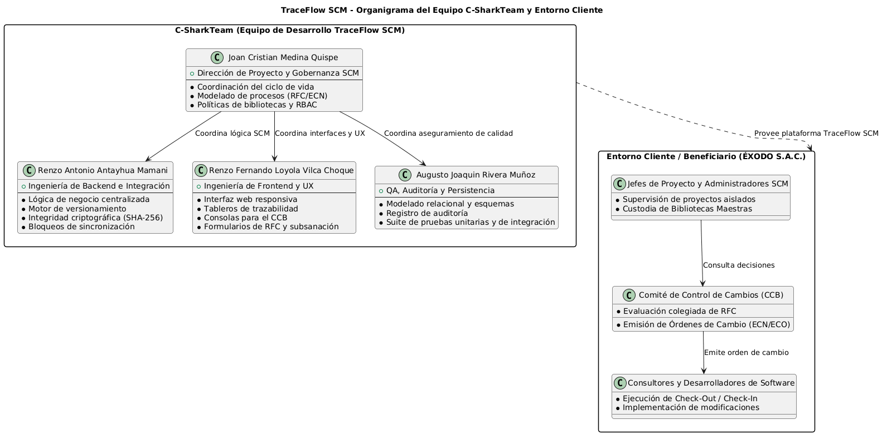

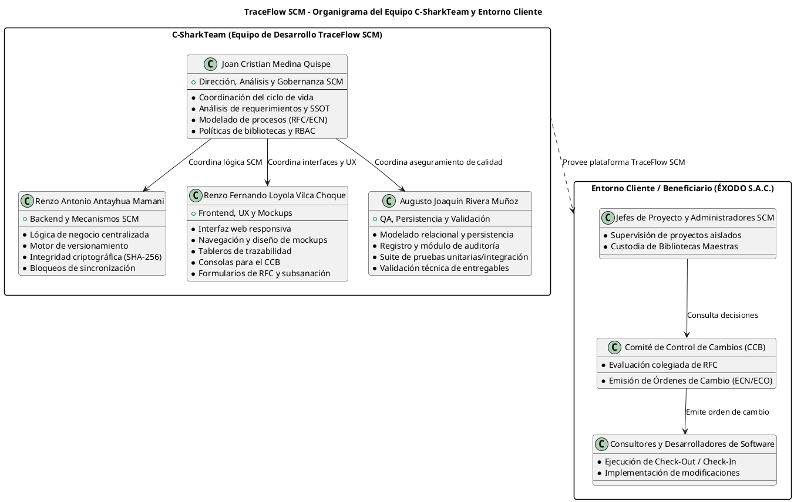
```plantuml
@startuml
skinparam shadowing false
skinparam roundcorner 8
skinparam defaultFontName Arial
skinparam packageStyle rectangle

title <b>TraceFlow SCM - Organigrama del Equipo C-SharkTeam y Entorno Cliente</b>

package "C-SharkTeam (Equipo de Desarrollo TraceFlow SCM)" as DEV {
    class "Joan Cristian Medina Quispe" as JCM {
        + Dirección, Análisis y Gobernanza SCM
        --
        * Coordinación del ciclo de vida
        * Análisis de requerimientos y SSOT
        * Modelado de procesos (RFC/ECN)
        * Políticas de bibliotecas y RBAC
    }

    class "Renzo Antonio Antayhua Mamani" as RAA {
        + Backend y Mecanismos SCM
        --
        * Lógica de negocio centralizada
        * Motor de versionamiento
        * Integridad criptográfica (SHA-256)
        * Bloqueos de sincronización
    }

    class "Renzo Fernando Loyola Vilca Choque" as RFL {
        + Frontend, UX y Mockups
        --
        * Interfaz web responsiva
        * Navegación y diseño de mockups
        * Tableros de trazabilidad
        * Consolas para el CCB
        * Formularios de RFC y subsanación
    }

    class "Augusto Joaquin Rivera Muñoz" as AJR {
        + QA, Persistencia y Validación
        --
        * Modelado relacional y persistencia
        * Registro y módulo de auditoría
        * Suite de pruebas unitarias/integración
        * Validación técnica de entregables
    }

    JCM --> RAA : Coordina lógica SCM
    JCM --> RFL : Coordina interfaces y UX
    JCM --> AJR : Coordina aseguramiento de calidad
}

package "Entorno Cliente / Beneficiario (ÉXODO S.A.C.)" as CLIENT {
    class "Jefes de Proyecto y Administradores SCM" as ADM {
        * Supervisión de proyectos aislados
        * Custodia de Bibliotecas Maestras
    }

    class "Comité de Control de Cambios (CCB)" as CCB {
        * Evaluación colegiada de RFC
        * Emisión de Órdenes de Cambio (ECN/ECO)
    }

    class "Consultores y Desarrolladores de Software" as DEV_CLI {
        * Ejecución de Check-Out / Check-In
        * Implementación de modificaciones
    }

    ADM --> CCB : Consulta decisiones
    CCB --> DEV_CLI : Emite orden de cambio
}

DEV ..> CLIENT : Provee plataforma TraceFlow SCM
@enduml
```

---

# DG-02 — Diagrama de Actividades del Proceso Actual (AS-IS)

**ID:** DG-02  
**Nombre:** Diagrama de Actividades del Proceso Empírico Actual (AS-IS) de ÉXODO S.A.C.  
**Tipo:** Actividades  
**Estado:** REVISION  
**Versión:** 1.0  
**RF relacionados:** N/A (Diagnóstico inicial)  
**RN relacionadas:** N/A  
**CU relacionados:** N/A  
**Fuente:** `FD03-EPIS-Informe_SRS.md`, Sección 3.6 (Pág. 17) y Sección 4.1 (Pág. 17)  

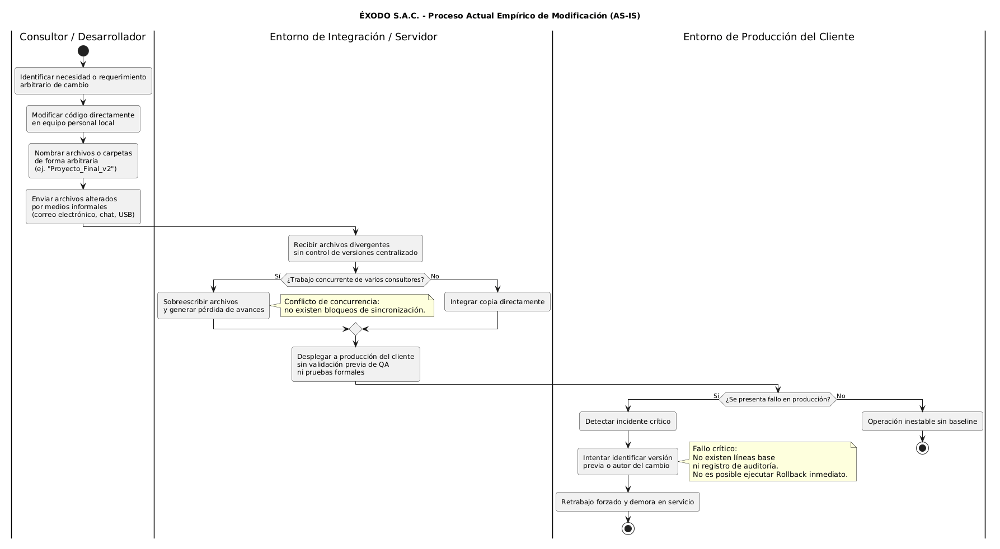

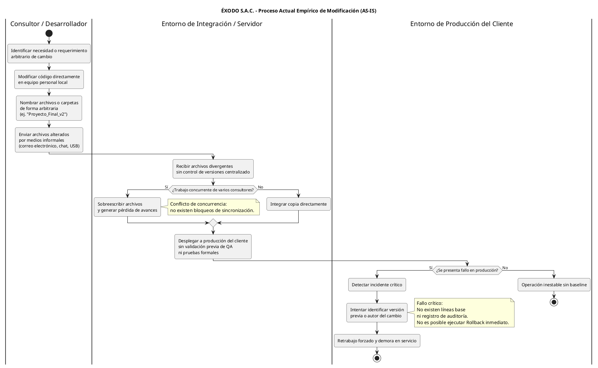
```plantuml
@startuml
skinparam shadowing false
skinparam roundcorner 8
skinparam defaultFontName Arial
skinparam ActivityMaxWidth 220
skinparam conditionStyle inside

title <b>ÉXODO S.A.C. - Proceso Actual Empírico de Modificación (AS-IS)</b>

|Consultor / Desarrollador|
start
:Identificar necesidad o requerimiento
arbitrario de cambio;

:Modificar código directamente
en equipo personal local;

:Nombrar archivos o carpetas
de forma arbitraria
(ej. "Proyecto_Final_v2");

:Enviar archivos alterados
por medios informales
(correo electrónico, chat, USB);

|Entorno de Integración / Servidor|
:Recibir archivos divergentes
sin control de versiones centralizado;

if (¿Trabajo concurrente de varios consultores?) then (Sí)
    :Sobreescribir archivos
    y generar pérdida de avances;
    note right
        Conflicto de concurrencia:
        no existen bloqueos de sincronización.
    end note
else (No)
    :Integrar copia directamente;
endif

:Desplegar a producción del cliente
sin validación previa de QA
ni pruebas formales;

|Entorno de Producción del Cliente|
if (¿Se presenta fallo en producción?) then (Sí)
    :Detectar incidente crítico;
    
    :Intentar identificar versión
    previa o autor del cambio;
    
    note right
        Fallo crítico:
        No existen líneas base
        ni registro de auditoría.
        No es posible ejecutar Rollback inmediato.
    end note
    
    :Retrabajo forzado y demora en servicio;
    stop
else (No)
    :Operación inestable sin baseline;
    stop
endif
@enduml
```

---

# DG-03 — Diagrama del Proceso Propuesto de Gestión de Cambios (TO-BE v2)

**ID:** DG-03  
**Nombre:** Proceso de Gestión de Cambios de Elementos de Configuración (TraceFlow SCM - TO-BE v2)  
**Tipo:** Actividades con Calles (Swimlanes)  
**Estado:** APROBADO  
**Versión:** 2.0  
**RF relacionados:** RF-04, RF-05, RF-06, RF-07, RF-08, RF-09, RF-10, RF-11, RF-12, RF-13, RF-14, RF-16, RF-17  
**RN relacionadas:** RN-01, RN-02, RN-03, RN-04, RN-05, RN-06, RN-07, RN-08, RN-09  
**CU relacionados:** CU-04, CU-05, CU-06, CU-07, CU-08, CU-10, CU-11, CU-12, CU-14, CU-15, CU-16, CU-17, CU-18, CU-19, CU-20, CU-21, CU-22, CU-29, CU-30  
**Fuente:** `FD03-EPIS-Informe_SRS.md`, Sección 4.2 y actualización TO-BE v2  

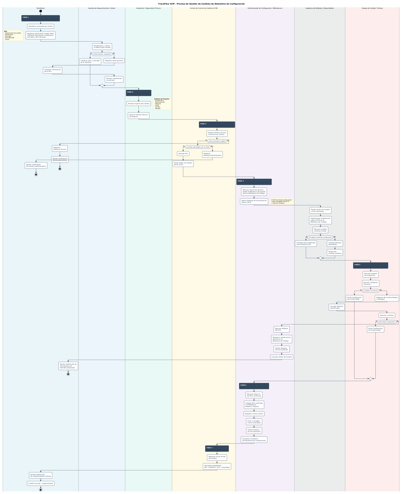

```plantuml
@startuml
title <b>TraceFlow SCM - Proceso de Gestión de Cambios de Elementos de Configuración (TO-BE v2)</b>

' =========================================================
' CONFIGURACIÓN GENERAL
' =========================================================
skinparam ActivityMaxWidth 220
skinparam ranksep 22
skinparam nodesep 18
skinparam defaultFontName Arial
skinparam defaultFontSize 11
skinparam roundCorner 8
skinparam shadowing false
skinparam conditionStyle inside

skinparam arrowColor #2C3E50
skinparam arrowThickness 1.2
skinparam swimlaneBorderColor #7F8C8D
skinparam swimlaneBorderThickness 1.2

skinparam activity {
    BackgroundColor #FFFFFF
    BorderColor #34495E
    BorderThickness 1.2
    FontColor #2C3E50
}

skinparam note {
    BackgroundColor #FFFDE7
    BorderColor #FBC02D
    FontSize 10
}

' =========================================================
' ACTORES / SWIMLANES CANÓNICOS
' =========================================================
|#E8F4F8|Solicitante|
|#EBF5FB|Analista de Requerimientos / Gestor|
|#E8F8F5|Arquitecto / Especialista Técnico|
|#FEF9E7|Comité de Control de Cambios (CCB)|
|#F5EEF8|Administrador de Configuración / Bibliotecario|
|#EAEDED|Ingeniero de Software / Desarrollador|
|#FDEDEC|Equipo de Calidad / Testing|

' =========================================================
' FASE 1 - REGISTRO DE LA RFC
' =========================================================
|Solicitante|
start
:<color:white><b>FASE 1\nRegistro de Solicitud de Cambio (RFC)</b></color>; <<#34495E>>

:Identificar necesidad o defecto;

:Registrar RFC con justificación,
prioridad y ECS afectado (CU-04);

note left
<b>RFC [Estado: Registrada]</b>
- Descripción de necesidad
- Justificación de negocio
- Nivel de prioridad inicial
- ECS y versión base afectada
end note

' =========================================================
' FASE 2 - VALIDACIÓN Y CLASIFICACIÓN INICIAL
' =========================================================
|Analista de Requerimientos / Gestor|
:<color:white><b>FASE 2\nValidación y Clasificación Inicial</b></color>; <<#34495E>>

:Recepcionar y evaluar completitud
de la RFC (CU-05);

if (¿Información suficiente y consistente?) then (No)
    :Registrar observaciones (CU-05);
    note right: RFC pasa a [En Subsanación]

    |Solicitante|
    if (¿Solicitante subsana dentro del plazo?) then (Sí)
        :Subsanar información requerida;
        |Analista de Requerimientos / Gestor|
        :Reevaluar información subsanada;
    else (No)
        |Analista de Requerimientos / Gestor|
        :Emitir dictamen de no conformidad
        inicial y desestimar solicitud;
        
        |Solicitante|
        :Recibir notificación de desestimación;
        note left
            <b>Estado Terminal 1:</b>
            <b>DESESTIMADA</b>
            (Filtro inicial no superado)
        end note
        stop
    endif
endif

|Analista de Requerimientos / Gestor|
:Validar consistencia de la RFC;
note right: RFC pasa a [Clasificada]

' =========================================================
' FASE 3 - ANÁLISIS DE IMPACTO TÉCNICO
' =========================================================
|Arquitecto / Especialista Técnico|
:<color:white><b>FASE 3\nAnálisis de Impacto Técnico</b></color>; <<#34495E>>
note right: RFC pasa a [En Análisis Técnico]

:Analizar impacto sobre arquitectura,
dependencias y trazabilidad (CU-06);

:Evaluar afectación a la Triple Restricción
(Alcance, Tiempo y Costo);

:Elaborar Informe Técnico de Impacto (CU-06);

if (¿Afecta alcance, tiempo o costo?) then (Sí)
    :Clasificar como <b>CAMBIO MAYOR</b>;
    note right
        <b>Criterio Normativo:</b>
        Afecta al menos 1 dimensión
        de la Triple Restricción.
        Requiere aprobación del CCB.
    end note
    
    ' =========================================================
    ' FASE 4A - EVALUACIÓN COLEGIADA CCB (CAMBIO MAYOR)
    ' =========================================================
    |Comité de Control de Cambios (CCB)|
    :<color:white><b>FASE 4A\nEvaluación Colegiada en CCB (Cambio Mayor)</b></color>; <<#34495E>>
    note right: RFC pasa a [En Evaluación]

    :Evaluar Informe Técnico, riesgos,
    viabilidad y conveniencia (CU-07);

    if (¿Cambio Mayor Aprobado por CCB?) then (Sí)
        :Aprobar formalmente el cambio (CU-07);
        note right: RFC pasa a [Autorizada]

        :Emitir Orden de Cambio
        formal (ECN / ECO) (CU-08);
        note right: RFC pasa a [Orden Emitida]
    else (No)
        :Registrar dictamen formal
        de rechazo (técnico o de gestión);

        |Solicitante|
        :Recibir notificación con fundamentación;
        note left
            <b>Estado Terminal 2:</b>
            <b>RECHAZADA</b>
            (Dictamen formal negativo del CCB)
        end note
        stop
    endif

else (No)
    :Clasificar como <b>CAMBIO MENOR</b>;
    note right
        <b>Criterio Normativo:</b>
        NO afecta alcance, tiempo ni costo.
        Ruta operativa delegada sin CCB.
    end note

    ' =========================================================
    ' FASE 4B - AUTORIZACIÓN OPERATIVA DELEGADA (CAMBIO MENOR)
    ' =========================================================
    |Analista de Requerimientos / Gestor|
    :<color:white><b>FASE 4B\nAutorización Operativa Delegada (Cambio Menor)</b></color>; <<#34495E>>
    note right: RFC pasa a [En Evaluación]

    :Revisar impacto operativo del Cambio Menor (CU-30);

    |Arquitecto / Especialista Técnico|
    :Revisar viabilidad técnica del Cambio Menor (CU-30);

    if (¿Conformidad de ambas autoridades delegadas?) then (Sí)
        :Autorizar Cambio Menor conjuntamente (CU-30);
        note right: RFC pasa a [Autorizada]

        :Emitir Orden de Cambio (ECN/ECO)
        bajo autoridad operativa delegada (CU-08/CU-30);
        note right: RFC pasa a [Orden Emitida]
    else (No)
        :Registrar dictamen de no autorización;

        |Solicitante|
        :Recibir notificación de rechazo operativo;
        note left
            <b>Estado Terminal 2:</b>
            <b>RECHAZADA</b>
            (Rechazo bajo autoridad delegada)
        end note
        stop
    endif
endif

' =========================================================
' FASE 5 - CHECK-OUT Y CONTROL DE CONCURRENCIA
' =========================================================
|Administrador de Configuración / Bibliotecario|
:<color:white><b>FASE 5\nCheck-Out y Bloqueo de Sincronización</b></color>; <<#34495E>>

:Verificar validez formal de la ECN/ECO;

:Efectuar Check-Out del ECS desde
Biblioteca de Soporte hacia Trabajo (CU-10);

:Aplicar bloqueo de sincronización
exclusivo sobre el ECS (CU-11);
note right: RFC pasa a [En Implementación]

' =========================================================
' FASE 6 - IMPLEMENTACIÓN Y PRUEBAS UNITARIAS
' =========================================================
|Ingeniero de Software / Desarrollador|
:<color:white><b>FASE 6\nImplementación y Pruebas Unitarias</b></color>; <<#34495E>>

:Recibir ECN/ECO y espacio en
Biblioteca de Trabajo;

:Modificar ECS según especificación (CU-14);

:Ejecutar pruebas unitarias locales (CU-15);

if (¿Pruebas unitarias conformes?) then (No)
    :Corregir defectos en código local;
    :Reejecutar pruebas unitarias locales;
endif

:Poner ECS a disposición para validación QA;

' =========================================================
' FASE 7 - VALIDACIÓN TÉCNICA DE CALIDAD (QA)
' =========================================================
|Equipo de Calidad / Testing|
:<color:white><b>FASE 7\nValidación Técnica de Calidad (QA)</b></color>; <<#34495E>>
note right: RFC pasa a [En Pruebas]

:Ejecutar pruebas de integración
y verificación técnica funcional (CU-16);

if (¿Defectos o no conformidades identificadas?) then (Sí)
    :Registrar reporte de no conformidad (CU-18);

    |Ingeniero de Software / Desarrollador|
    :Corregir defectos reportados;

    |Equipo de Calidad / Testing|
    :Reevaluar y re-testear (CU-19);

    if (¿Fallo técnico no subsanado?) then (Sí)
        |Administrador de Configuración / Bibliotecario|
        :Ejecutar Rollback en Biblioteca de Trabajo (CU-21);
        :Liberar bloqueo de sincronización;
        :Cancelar Orden de Cambio (ECN/ECO) (CU-22);

        |Solicitante|
        :Recibir notificación de cancelación;
        note left
            <b>Estado Terminal 3:</b>
            <b>CANCELADA</b>
            (Rollback por fallo no subsanado)
        end note
        stop
    endif
endif

|Equipo de Calidad / Testing|
:Emitir Certificación Técnica
de Conformidad (CU-17);

' =========================================================
' FASE 8 - VALIDACIÓN Y ACEPTACIÓN POR EL USUARIO (UAT)
' =========================================================
|Solicitante|
:<color:white><b>FASE 8\nValidación y Aceptación por el Usuario (UAT)</b></color>; <<#34495E>>
note left: RFC pasa a [En Aceptación]

:Ejecutar pruebas de aceptación en
entorno de validación (CU-29);

if (¿Comportamiento y necesidad plenamente conformes?) then (No)
    :Registrar observaciones de aceptación;
    |Ingeniero de Software / Desarrollador|
    :Ajustar implementación según observaciones;
    |Equipo de Calidad / Testing|
    :Revalidar técnicamente la corrección;
    |Solicitante|
    :Reejecutar pruebas de aceptación (CU-29);
endif

:Emitir y suscribir Aceptación
Formal del Usuario (CU-29);

' =========================================================
' FASE 9 - CHECK-IN, LÍNEA BASE Y DESBLOQUEO
' =========================================================
|Administrador de Configuración / Bibliotecario|
:<color:white><b>FASE 9\nCheck-In, Nueva Línea Base y Desbloqueo</b></color>; <<#34495E>>

:Verificar Certificación QA y Aceptación UAT;

:Efectuar Check-In del ECS hacia
Biblioteca Maestra y de Soporte (CU-12);

:Registrar nueva versión identificada unívocamente;

:Crear y congelar nueva Línea Base (CU-20);

:Liberar bloqueo de sincronización del ECS;

:Actualizar catálogo e inventario de configuración;

' =========================================================
' FASE 10 - CIERRE FORMAL Y NOTIFICACIÓN
' =========================================================
|Comité de Control de Cambios (CCB)|
:<color:white><b>FASE 10\nCierre Formal Administrativo</b></color>; <<#34495E>>

:Registrar cierre administrativo formal (RF-14);

:Consolidar trazabilidad completa
(RFC - ECN/ECO - ECS - QA - UAT - Baseline);

|Solicitante|
:Recibir notificación de cambio implementado y cerrado;

note left
    <b>Estado Terminal 4:</b>
    <b>IMPLEMENTADA</b>
    (Cambio validado, promovido a Maestra,
    congelado en Baseline y cerrado formalmente)
end note

stop
@enduml
```

---

# DG-04 — Diagrama de Paquetes Arquitecturales

**ID:** DG-04  
**Nombre:** Diagrama de Paquetes Arquitecturales de TraceFlow SCM  
**Tipo:** Paquetes  
**Estado:** APROBADO  
**Versión:** 1.1  
**RF relacionados:** RF-01 a RF-18  
**RN relacionadas:** RN-01 a RN-09  
**CU relacionados:** CU-01 a CU-30  
**Fuente:** `FD03-EPIS-Informe_SRS.md`, Sección 6.1.1 (Págs. 31-32) y actualización TO-BE v2  

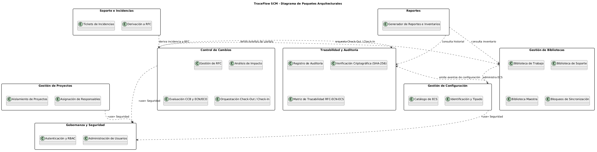

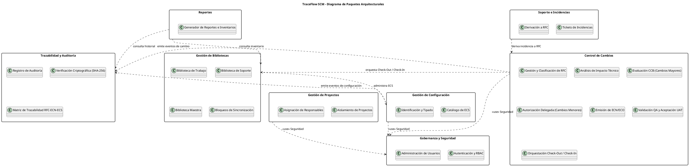
```plantuml
@startuml
skinparam shadowing false
skinparam roundcorner 8
skinparam defaultFontName Arial
skinparam packageStyle rectangle

title <b>TraceFlow SCM - Diagrama de Paquetes Arquitecturales</b>

package "Gobernanza y Seguridad" as PKG_GOB {
    class "Autenticación y RBAC" as MOD_RBAC
    class "Administración de Usuarios" as MOD_USER
}

package "Gestión de Proyectos" as PKG_PROJ {
    class "Aislamiento de Proyectos" as MOD_PROJ
    class "Asignación de Responsables" as MOD_RESP
}

package "Gestión de Configuración" as PKG_ECS {
    class "Catálogo de ECS" as MOD_ECS
    class "Identificación y Tipado" as MOD_TYPE
}

package "Gestión de Bibliotecas" as PKG_LIB {
    class "Biblioteca de Trabajo" as LIB_WRK
    class "Biblioteca de Soporte" as LIB_SUP
    class "Biblioteca Maestra" as LIB_MST
    class "Bloqueos de Sincronización" as MOD_LOCK
}

package "Control de Cambios" as PKG_CHG {
    class "Gestión y Clasificación de RFC" as MOD_RFC
    class "Análisis de Impacto Técnico" as MOD_IMP
    class "Evaluación CCB (Cambios Mayores)" as MOD_CCB
    class "Autorización Delegada (Cambios Menores)" as MOD_AUTH_MIN
    class "Emisión de ECN/ECO" as MOD_ECN
    class "Validación QA y Aceptación UAT" as MOD_QA_UAT
    class "Orquestación Check-Out / Check-In" as MOD_ORQ
}

package "Soporte e Incidencias" as PKG_SUPP {
    class "Tickets de Incidencias" as MOD_TCK
    class "Derivación a RFC" as MOD_DERIV
}

package "Trazabilidad y Auditoría" as PKG_AUD {
    class "Registro de Auditoría" as MOD_LOG
    class "Verificación Criptográfica (SHA-256)" as MOD_SHA
    class "Matriz de Trazabilidad RFC-ECN-ECS" as MOD_TRAC
}

package "Reportes" as PKG_REP {
    class "Generador de Reportes e Inventarios" as MOD_RPT
}

' Relaciones de dependencia descritas en la sección 6.1.1 del SRS
PKG_PROJ ..> PKG_GOB : <<use>> Seguridad
PKG_ECS ..> PKG_GOB : <<use>> Seguridad
PKG_CHG ..> PKG_GOB : <<use>> Seguridad

PKG_LIB ..> PKG_ECS : administra ECS
PKG_CHG ..> PKG_LIB : orquesta Check-Out / Check-In

PKG_SUPP ..> PKG_CHG : deriva incidencia a RFC
PKG_AUD <.. PKG_CHG : emite eventos de cambio
PKG_AUD <.. PKG_ECS : emite eventos de configuración

PKG_REP ..> PKG_AUD : consulta historial
PKG_REP ..> PKG_LIB : consulta inventario
@enduml
```

---

# DG-05 — Diagrama General de Casos de Uso

**ID:** DG-05  
**Nombre:** Diagrama General de Casos de Uso del Sistema TraceFlow SCM  
**Tipo:** Casos de Uso  
**Estado:** APROBADO  
**Versión:** 1.1  
**RF relacionados:** RF-01 a RF-18  
**RN relacionadas:** RN-01 a RN-09  
**CU relacionados:** CU-01 a CU-30  
**Fuente:** `FD03-EPIS-Informe_SRS.md`, Sección 6.1.2 (Pág. 33), `TB-10` y actualización TO-BE v2  

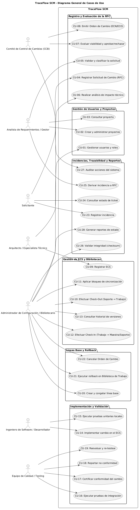

```plantuml
@startuml
skinparam shadowing false
skinparam roundcorner 8
skinparam defaultFontName Arial
left to right direction

title <b>TraceFlow SCM - Diagrama General de Casos de Uso</b>

' =========================================================
' ACTORES CANÓNICOS
' =========================================================
actor "Solicitante" as ACT_SOL
actor "Analista de Requerimientos / Gestor" as ACT_ANA
actor "Arquitecto / Especialista Técnico" as ACT_ARQ
actor "Comité de Control de Cambios (CCB)" as ACT_CCB
actor "Administrador de Configuración / Bibliotecario" as ACT_ADM
actor "Ingeniero de Software / Desarrollador" as ACT_DEV
actor "Equipo de Calidad / Testing" as ACT_QA

' =========================================================
' PAQUETES FUNCIONALES
' =========================================================
rectangle "TraceFlow SCM" {
    package "Gestión de Usuarios y Proyectos" {
        usecase "CU-01: Gestionar usuarios y roles" as UC01
        usecase "CU-02: Crear y administrar proyectos" as UC02
        usecase "CU-03: Consultar proyecto" as UC03
    }

    package "Registro y Evaluación de la RFC" {
        usecase "CU-04: Registrar Solicitud de Cambio (RFC)" as UC04
        usecase "CU-05: Validar y clasificar la solicitud" as UC05
        usecase "CU-06: Realizar análisis de impacto técnico" as UC06
        usecase "CU-07: Evaluar viabilidad y aprobar/rechazar" as UC07
        usecase "CU-08: Emitir Orden de Cambio (ECN/ECO)" as UC08
        usecase "CU-30: Autorizar Cambio Menor" as UC30
    }

    package "Gestión de ECS y Bibliotecas" {
        usecase "CU-09: Registrar ECS" as UC09
        usecase "CU-10: Efectuar Check-Out (Soporte → Trabajo)" as UC10
        usecase "CU-11: Aplicar bloqueo de sincronización" as UC11
        usecase "CU-12: Efectuar Check-In (Trabajo → Maestra/Soporte)" as UC12
        usecase "CU-13: Consultar historial de versiones" as UC13
    }

    package "Implementación y Validación" {
        usecase "CU-14: Implementar cambio en el ECS" as UC14
        usecase "CU-15: Ejecutar pruebas unitarias locales" as UC15
        usecase "CU-16: Ejecutar pruebas de integración" as UC16
        usecase "CU-17: Certificar conformidad del cambio" as UC17
        usecase "CU-18: Reportar no conformidad" as UC18
        usecase "CU-19: Reevaluar y re-testear" as UC19
        usecase "CU-29: Validar aceptación del cambio por el usuario (UAT)" as UC29
    }

    package "Líneas Base y Rollback" {
        usecase "CU-20: Crear y congelar línea base" as UC20
        usecase "CU-21: Ejecutar rollback en Biblioteca de Trabajo" as UC21
        usecase "CU-22: Cancelar Orden de Cambio" as UC22
    }

    package "Incidencias, Trazabilidad y Reportes" {
        usecase "CU-23: Registrar incidencia" as UC23
        usecase "CU-24: Consultar estado de ticket" as UC24
        usecase "CU-25: Derivar incidencia a RFC" as UC25
        usecase "CU-26: Validar integridad (checksum)" as UC26
        usecase "CU-27: Auditar acciones del sistema" as UC27
        usecase "CU-28: Generar reportes de estado" as UC28
    }
}

' Asociaciones Principales
ACT_ADM --> UC01
ACT_ANA --> UC02
ACT_ANA --> UC03

ACT_SOL --> UC04
ACT_ANA --> UC05
ACT_ARQ --> UC06
ACT_CCB --> UC07
ACT_CCB --> UC08

ACT_ANA --> UC30
ACT_ARQ --> UC30

ACT_ARQ --> UC09
ACT_ADM --> UC10
ACT_ADM --> UC11
ACT_ADM --> UC12
ACT_ADM --> UC13

ACT_DEV --> UC14
ACT_DEV --> UC15
ACT_QA --> UC16
ACT_QA --> UC17
ACT_QA --> UC18
ACT_QA --> UC19
ACT_SOL --> UC29

ACT_ADM --> UC20
ACT_ADM --> UC21
ACT_ADM --> UC22

ACT_SOL --> UC23
ACT_SOL --> UC24
ACT_ANA --> UC25
ACT_ADM --> UC26
ACT_CCB --> UC27
ACT_ADM --> UC28
@enduml
```

---

# DG-06 — Casos de Uso: Administración de Usuarios y Proyectos

**ID:** DG-06  
**Nombre:** Diagrama de Casos de Uso - Administración de Usuarios y Proyectos  
**Tipo:** Casos de Uso Específico  
**Estado:** APROBADO  
**Versión:** 1.0  
**RF relacionados:** RF-01, RF-02  
**RN relacionadas:** N/A  
**CU relacionados:** CU-01, CU-02, CU-03  
**Fuente:** `FD03-EPIS-Informe_SRS.md`, Sección 6.1.2 (Pág. 34)  

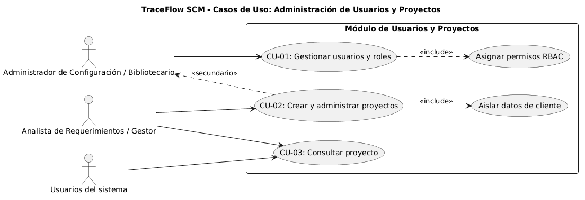

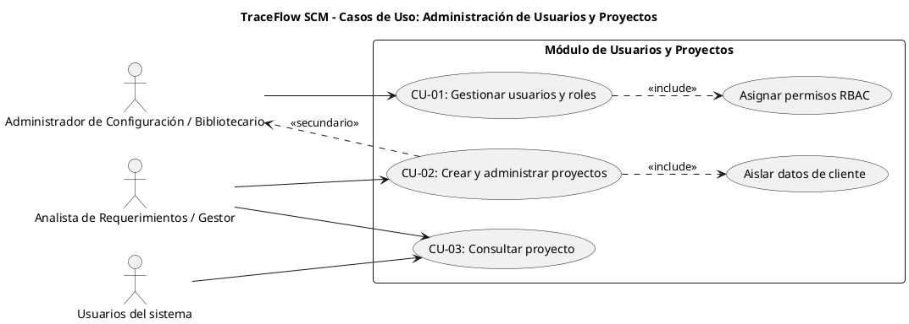
```plantuml
@startuml
skinparam shadowing false
skinparam roundcorner 8
skinparam defaultFontName Arial
left to right direction

title <b>TraceFlow SCM - Casos de Uso: Administración de Usuarios y Proyectos</b>

actor "Administrador de Configuración / Bibliotecario" as ACT_ADM
actor "Analista de Requerimientos / Gestor" as ACT_ANA
actor "Usuarios del sistema" as ACT_USR

rectangle "Módulo de Usuarios y Proyectos" {
    usecase "CU-01: Gestionar usuarios y roles" as UC01
    usecase "CU-02: Crear y administrar proyectos" as UC02
    usecase "CU-03: Consultar proyecto" as UC03

    usecase "Asignar permisos RBAC" as UC_RBAC
    usecase "Aislar datos de cliente" as UC_ISOLATE
}

ACT_ADM --> UC01
UC01 ..> UC_RBAC : <<include>>

ACT_ANA --> UC02
ACT_ANA --> UC03
ACT_USR --> UC03

UC02 ..> UC_ISOLATE : <<include>>
UC02 ..> ACT_ADM : <<secundario>>
@enduml
```

---

# DG-07 — Casos de Uso: Registro y Evaluación de RFC e Incidencias

**ID:** DG-07  
**Nombre:** Diagrama de Casos de Uso - Registro y Evaluación de RFC e Incidencias  
**Tipo:** Casos de Uso Específico  
**Estado:** APROBADO  
**Versión:** 1.1  
**RF relacionados:** RF-04, RF-05, RF-06, RF-07, RF-15  
**RN relacionadas:** RN-01, RN-05, RN-07  
**CU relacionados:** CU-04, CU-05, CU-06, CU-07, CU-08, CU-23, CU-24, CU-25, CU-30  
**Fuente:** `FD03-EPIS-Informe_SRS.md`, Sección 6.1.2 (Pág. 34) y actualización TO-BE v2  

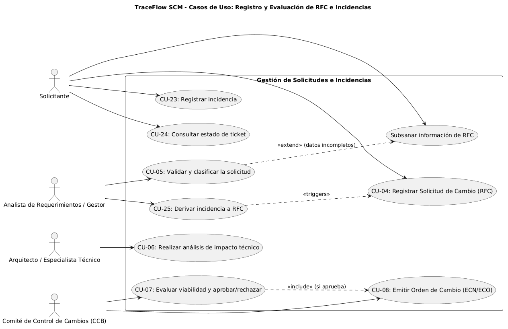

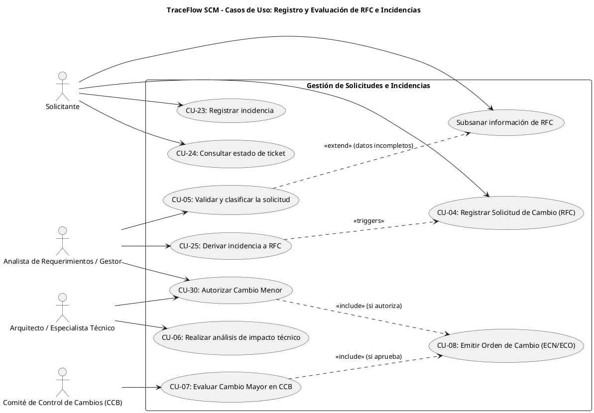
```plantuml
@startuml
skinparam shadowing false
skinparam roundcorner 8
skinparam defaultFontName Arial
left to right direction

title <b>TraceFlow SCM - Casos de Uso: Registro y Evaluación de RFC e Incidencias</b>

actor "Solicitante" as ACT_SOL
actor "Analista de Requerimientos / Gestor" as ACT_ANA
actor "Arquitecto / Especialista Técnico" as ACT_ARQ
actor "Comité de Control de Cambios (CCB)" as ACT_CCB

rectangle "Gestión de Solicitudes e Incidencias" {
    usecase "CU-23: Registrar incidencia" as UC23
    usecase "CU-24: Consultar estado de ticket" as UC24
    usecase "CU-25: Derivar incidencia a RFC" as UC25

    usecase "CU-04: Registrar Solicitud de Cambio (RFC)" as UC04
    usecase "CU-05: Validar y clasificar la solicitud" as UC05
    usecase "CU-06: Realizar análisis de impacto técnico" as UC06
    usecase "CU-07: Evaluar Cambio Mayor en CCB" as UC07
    usecase "CU-30: Autorizar Cambio Menor" as UC30
    usecase "CU-08: Emitir Orden de Cambio (ECN/ECO)" as UC08

    usecase "Subsanar información de RFC" as UC_SUBSANAR
}

ACT_SOL --> UC23
ACT_SOL --> UC24
ACT_ANA --> UC25

UC25 ..> UC04 : <<triggers>>

ACT_SOL --> UC04
ACT_ANA --> UC05
UC05 ..> UC_SUBSANAR : <<extend>> (datos incompletos)
ACT_SOL --> UC_SUBSANAR

ACT_ARQ --> UC06

' Evaluación y Decisión: Ruta Mayor (CCB) vs Menor (Delegada)
ACT_CCB --> UC07
UC07 ..> UC08 : <<include>> (si aprueba)

ACT_ANA --> UC30
ACT_ARQ --> UC30
UC30 ..> UC08 : <<include>> (si autoriza)
@enduml
```

---

# DG-08 — Casos de Uso: SCM Core (ECS, Bibliotecas y Líneas Base)

**ID:** DG-08  
**Nombre:** Diagrama de Casos de Uso - SCM Core (Gestión de ECS, Bibliotecas y Líneas Base)  
**Tipo:** Casos de Uso Específico  
**Estado:** APROBADO  
**Versión:** 1.0  
**RF relacionados:** RF-03, RF-08, RF-09, RF-12, RF-13, RF-14  
**RN relacionadas:** RN-02, RN-03, RN-04, RN-06, RN-07, RN-08  
**CU relacionados:** CU-09, CU-10, CU-11, CU-12, CU-13, CU-20, CU-21, CU-22  
**Fuente:** `FD03-EPIS-Informe_SRS.md`, Sección 6.1.2 (Pág. 35)  

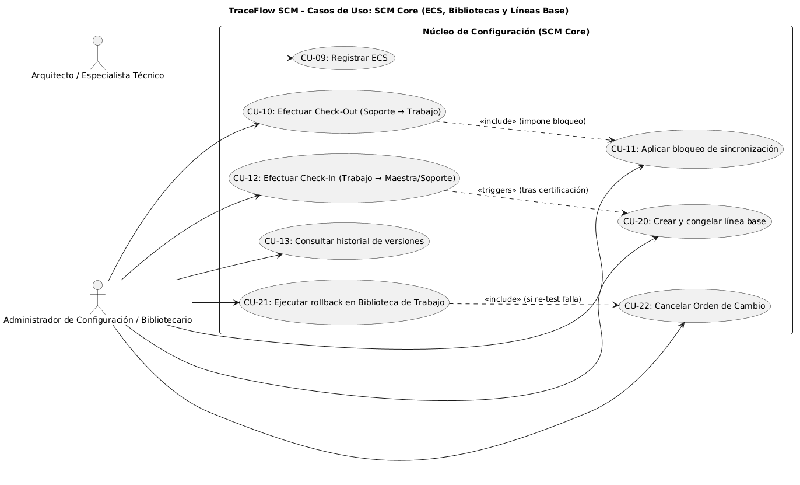

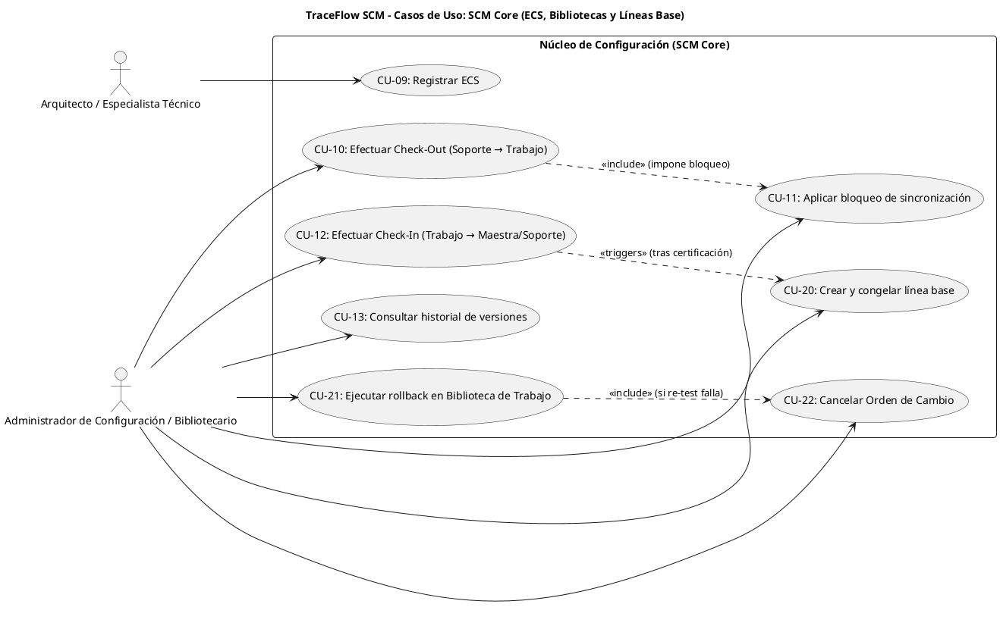
```plantuml
@startuml
skinparam shadowing false
skinparam roundcorner 8
skinparam defaultFontName Arial
left to right direction

title <b>TraceFlow SCM - Casos de Uso: SCM Core (ECS, Bibliotecas y Líneas Base)</b>

actor "Arquitecto / Especialista Técnico" as ACT_ARQ
actor "Administrador de Configuración / Bibliotecario" as ACT_ADM

rectangle "Núcleo de Configuración (SCM Core)" {
    usecase "CU-09: Registrar ECS" as UC09
    usecase "CU-10: Efectuar Check-Out (Soporte → Trabajo)" as UC10
    usecase "CU-11: Aplicar bloqueo de sincronización" as UC11
    usecase "CU-12: Efectuar Check-In (Trabajo → Maestra/Soporte)" as UC12
    usecase "CU-13: Consultar historial de versiones" as UC13
    usecase "CU-20: Crear y congelar línea base" as UC20
    usecase "CU-21: Ejecutar rollback en Biblioteca de Trabajo" as UC21
    usecase "CU-22: Cancelar Orden de Cambio" as UC22
}

ACT_ARQ --> UC09
ACT_ADM --> UC10
ACT_ADM --> UC11
ACT_ADM --> UC12
ACT_ADM --> UC13
ACT_ADM --> UC20
ACT_ADM --> UC21
ACT_ADM --> UC22

UC10 ..> UC11 : <<include>> (impone bloqueo)
UC12 ..> UC20 : <<triggers>> (tras certificación)
UC21 ..> UC22 : <<include>> (si re-test falla)
@enduml
```

---

# DG-09 — Casos de Uso: Implementación y Validación de Calidad

**ID:** DG-09  
**Nombre:** Diagrama de Casos de Uso - Implementación y Validación de la Calidad  
**Tipo:** Casos de Uso Específico  
**Estado:** APROBADO  
**Versión:** 1.1  
**RF relacionados:** RF-07, RF-09, RF-10, RF-11  
**RN relacionadas:** RN-08, RN-09  
**CU relacionados:** CU-14, CU-15, CU-16, CU-17, CU-18, CU-19, CU-29  
**Fuente:** `FD03-EPIS-Informe_SRS.md`, Sección 6.1.2 (Pág. 35) y actualización TO-BE v2  

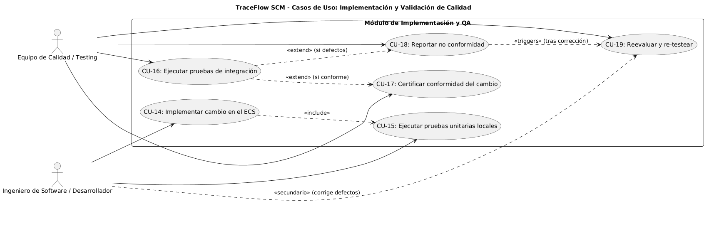

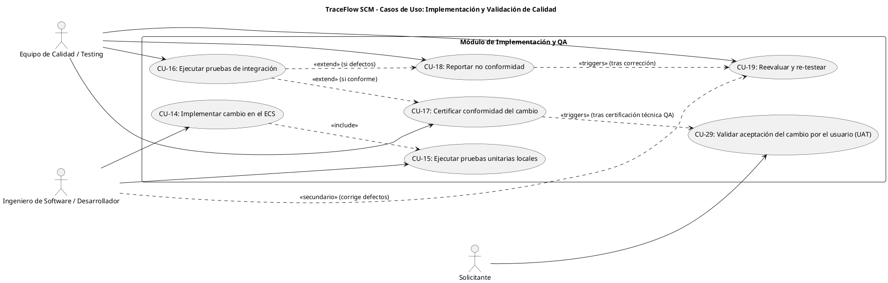
```plantuml
@startuml
skinparam shadowing false
skinparam roundcorner 8
skinparam defaultFontName Arial
left to right direction

title <b>TraceFlow SCM - Casos de Uso: Implementación y Validación de Calidad</b>

actor "Ingeniero de Software / Desarrollador" as ACT_DEV
actor "Equipo de Calidad / Testing" as ACT_QA
actor "Solicitante" as ACT_SOL

rectangle "Módulo de Implementación y QA" {
    usecase "CU-14: Implementar cambio en el ECS" as UC14
    usecase "CU-15: Ejecutar pruebas unitarias locales" as UC15
    usecase "CU-16: Ejecutar pruebas de integración" as UC16
    usecase "CU-17: Certificar conformidad del cambio" as UC17
    usecase "CU-18: Reportar no conformidad" as UC18
    usecase "CU-19: Reevaluar y re-testear" as UC19
    usecase "CU-29: Validar aceptación del cambio por el usuario (UAT)" as UC29
}

ACT_DEV --> UC14
ACT_DEV --> UC15
UC14 ..> UC15 : <<include>>

ACT_QA --> UC16
ACT_QA --> UC17
ACT_QA --> UC18
ACT_QA --> UC19

UC16 ..> UC17 : <<extend>> (si conforme)
UC16 ..> UC18 : <<extend>> (si defectos)
UC18 ..> UC19 : <<triggers>> (tras corrección)
ACT_DEV ..> UC19 : <<secundario>> (corrige defectos)

' Validación UAT del Solicitante / Usuario Final
ACT_SOL --> UC29
UC17 ..> UC29 : <<triggers>> (tras certificación técnica QA)
@enduml
```

---

# DG-10 — Casos de Uso: Trazabilidad, Auditoría e Integridad

**ID:** DG-10  
**Nombre:** Diagrama de Casos de Uso - Trazabilidad, Auditoría e Integridad  
**Tipo:** Casos de Uso Específico  
**Estado:** APROBADO  
**Versión:** 1.0  
**RF relacionados:** RF-16, RF-17, RF-18, RNF-03  
**RN relacionadas:** RN-02, RN-03  
**CU relacionados:** CU-26, CU-27, CU-28  
**Fuente:** `FD03-EPIS-Informe_SRS.md`, Sección 6.1.2 (Pág. 36)  

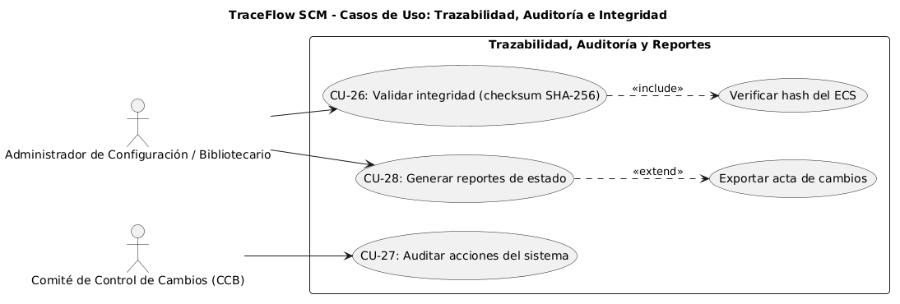

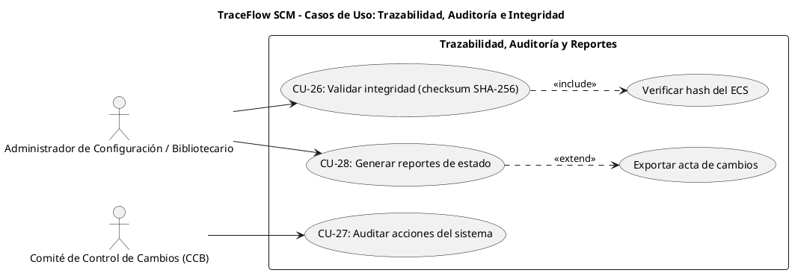
```plantuml
@startuml
skinparam shadowing false
skinparam roundcorner 8
skinparam defaultFontName Arial
left to right direction

title <b>TraceFlow SCM - Casos de Uso: Trazabilidad, Auditoría e Integridad</b>

actor "Administrador de Configuración / Bibliotecario" as ACT_ADM
actor "Comité de Control de Cambios (CCB)" as ACT_CCB

rectangle "Trazabilidad, Auditoría y Reportes" {
    usecase "CU-26: Validar integridad (checksum SHA-256)" as UC26
    usecase "CU-27: Auditar acciones del sistema" as UC27
    usecase "CU-28: Generar reportes de estado" as UC28

    usecase "Verificar hash del ECS" as UC_HASH
    usecase "Exportar acta de cambios" as UC_EXP
}

ACT_ADM --> UC26
ACT_CCB --> UC27
ACT_ADM --> UC28

UC26 ..> UC_HASH : <<include>>
UC28 ..> UC_EXP : <<extend>>
@enduml
```

---

# DG-11 — Diagrama de Estados del Ciclo de Vida de la RFC

**ID:** DG-11  
**Nombre:** Diagrama de Estados del Ciclo de Vida de una Solicitud de Cambio (RFC - 14 Estados Oficiales)  
**Tipo:** Máquina de Estados  
**Estado:** APROBADO  
**Versión:** 2.0  
**RF relacionados:** RF-04, RF-05, RF-06, RF-07, RF-08, RF-09, RF-10, RF-11, RF-12, RF-13, RF-14  
**RN relacionadas:** RN-01, RN-05, RN-07, RN-08, RN-09  
**CU relacionados:** CU-04, CU-05, CU-06, CU-07, CU-08, CU-10, CU-11, CU-12, CU-14, CU-15, CU-16, CU-17, CU-18, CU-19, CU-20, CU-21, CU-22, CU-29, CU-30  
**Fuente:** `FD03-EPIS-Informe_SRS.md`, Sección 5.3 (Págs. 26-27), `TB-07` y actualización TO-BE v2  

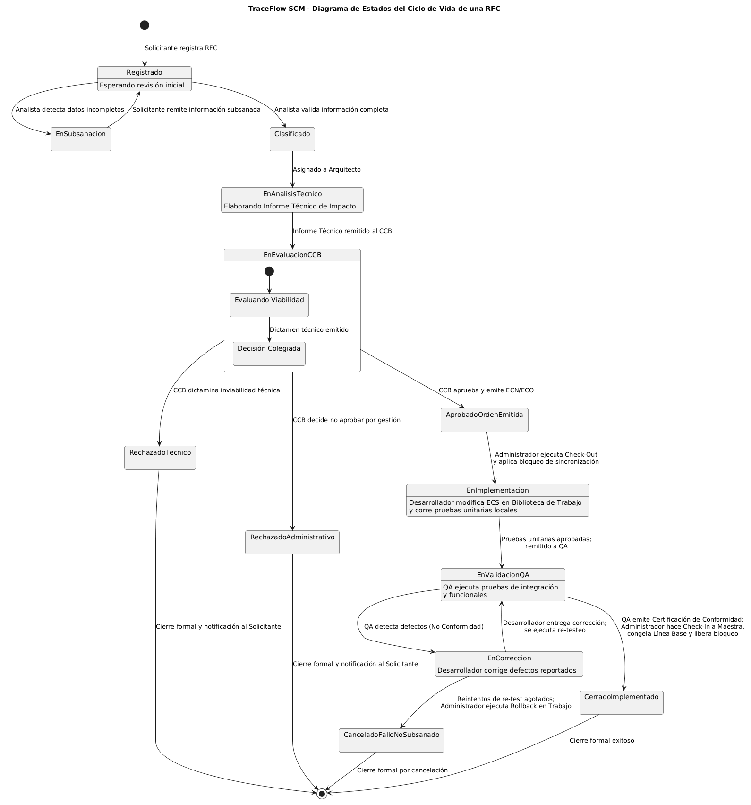

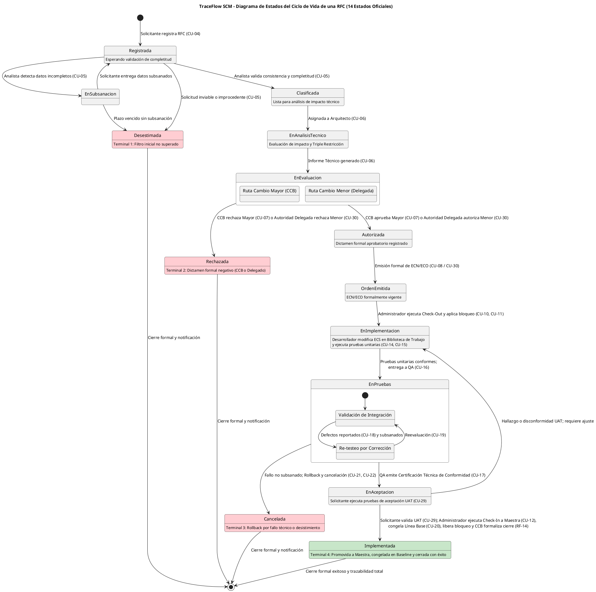
```plantuml
@startuml
skinparam shadowing false
skinparam roundcorner 8
skinparam defaultFontName Arial

title <b>TraceFlow SCM - Diagrama de Estados del Ciclo de Vida de una RFC (14 Estados Oficiales)</b>

[*] --> Registrada : Solicitante registra RFC (CU-04)

state Registrada {
    Registrada : Esperando validación de completitud
}

Registrada --> EnSubsanacion : Analista detecta datos incompletos (CU-05)
EnSubsanacion --> Registrada : Solicitante entrega datos subsanados
EnSubsanacion --> Desestimada : Plazo vencido sin subsanación

Registrada --> Clasificada : Analista valida consistencia y completitud (CU-05)
Registrada --> Desestimada : Solicitud inviable o improcedente (CU-05)

state Clasificada {
    Clasificada : Lista para análisis de impacto técnico
}

Clasificada --> EnAnalisisTecnico : Asignada a Arquitecto (CU-06)

state EnAnalisisTecnico {
    EnAnalisisTecnico : Evaluación de impacto y Triple Restricción
}

EnAnalisisTecnico --> EnEvaluacion : Informe Técnico generado (CU-06)

state EnEvaluacion {
    state "Ruta Cambio Mayor (CCB)" as S_MAYOR
    state "Ruta Cambio Menor (Delegada)" as S_MENOR
}

EnEvaluacion --> Rechazada : CCB rechaza Mayor (CU-07) o Autoridad Delegada rechaza Menor (CU-30)
EnEvaluacion --> Autorizada : CCB aprueba Mayor (CU-07) o Autoridad Delegada autoriza Menor (CU-30)

state Autorizada {
    Autorizada : Dictamen formal aprobatorio registrado
}

Autorizada --> OrdenEmitida : Emisión formal de ECN/ECO (CU-08 / CU-30)

state OrdenEmitida {
    OrdenEmitida : ECN/ECO formalmente vigente
}

OrdenEmitida --> EnImplementacion : Administrador ejecuta Check-Out y aplica bloqueo (CU-10, CU-11)

state EnImplementacion {
    EnImplementacion : Desarrollador modifica ECS en Biblioteca de Trabajo\ny ejecuta pruebas unitarias (CU-14, CU-15)
}

EnImplementacion --> EnPruebas : Pruebas unitarias conformes;\nentrega a QA (CU-16)

state EnPruebas {
    state "Validación de Integración" as S_INTEG
    state "Re-testeo por Corrección" as S_RETEST
    [*] --> S_INTEG
    S_INTEG --> S_RETEST : Defectos reportados (CU-18) y subsanados
    S_RETEST --> S_INTEG : Reevaluación (CU-19)
}

EnPruebas --> Cancelada : Fallo no subsanado; Rollback y cancelación (CU-21, CU-22)
EnPruebas --> EnAceptacion : QA emite Certificación Técnica de Conformidad (CU-17)

state EnAceptacion {
    EnAceptacion : Solicitante ejecuta pruebas de aceptación UAT (CU-29)
}

EnAceptacion --> EnImplementacion : Hallazgo o disconformidad UAT; requiere ajuste
EnAceptacion --> Implementada : Solicitante valida UAT (CU-29); Administrador ejecuta Check-In a Maestra (CU-12),\ncongela Línea Base (CU-20), libera bloqueo y CCB formaliza cierre (RF-14)

' =========================================================
' ESTADOS TERMINALES (4 Estados Normativos)
' =========================================================
state Desestimada #FFCDD2 {
    Desestimada : Terminal 1: Filtro inicial no superado
}

state Rechazada #FFCDD2 {
    Rechazada : Terminal 2: Dictamen formal negativo (CCB o Delegado)
}

state Cancelada #FFCDD2 {
    Cancelada : Terminal 3: Rollback por fallo técnico o desistimiento
}

state Implementada #C8E6C9 {
    Implementada : Terminal 4: Promovida a Maestra, congelada en Baseline y cerrada con éxito
}

Desestimada --> [*] : Cierre formal y notificación
Rechazada --> [*] : Cierre formal y notificación
Cancelada --> [*] : Cierre formal y notificación
Implementada --> [*] : Cierre formal exitoso y trazabilidad total
@enduml
```

---

---

# DG-12 — Diagrama de Clases del Dominio TraceFlow SCM

**ID:** DG-12 | **Tipo:** Clases | **Estado:** APROBADO | **Versión:** 1.0  
**RF:** RF-01 a RF-18 | **RN:** RN-01 a RN-09 | **CU:** CU-01 a CU-28 | **Fuente:** `FD03-EPIS-Informe_SRS.md`, Sección 6.2.2

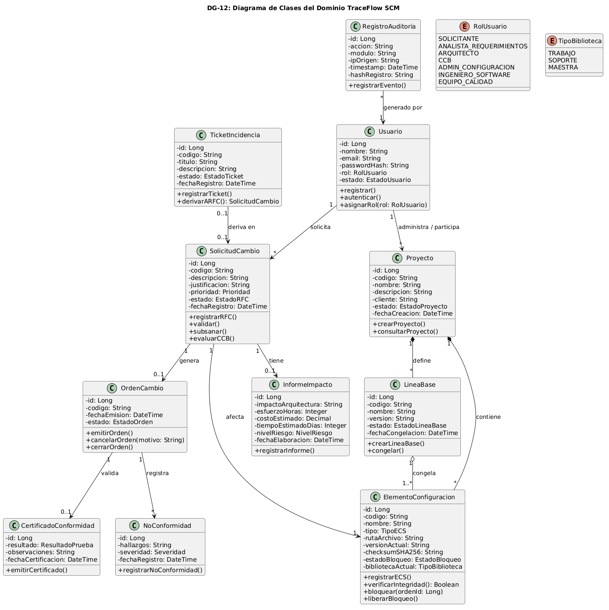

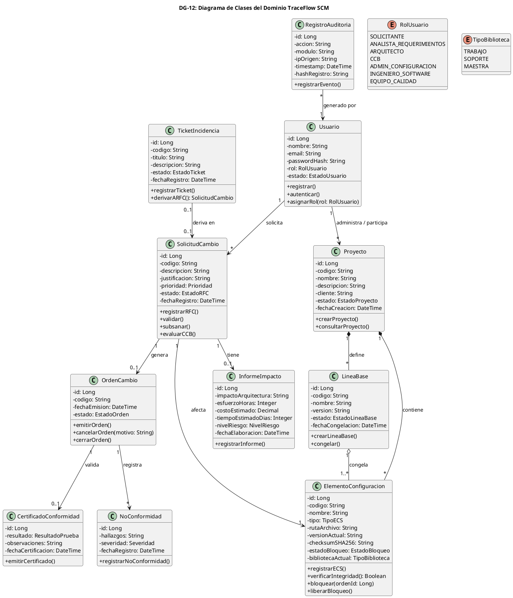
```plantuml
@startuml
skinparam shadowing false
skinparam roundcorner 8
skinparam defaultFontName Arial
skinparam classAttributeIconSize 0

title <b>DG-12: Diagrama de Clases del Dominio TraceFlow SCM</b>

class Usuario {
    - id: Long
    - nombre: String
    - email: String
    - passwordHash: String
    - rol: RolUsuario
    - estado: EstadoUsuario
    + registrar()
    + autenticar()
    + asignarRol(rol: RolUsuario)
}

enum RolUsuario {
    SOLICITANTE
    ANALISTA_REQUERIMIENTOS
    ARQUITECTO
    CCB
    ADMIN_CONFIGURACION
    INGENIERO_SOFTWARE
    EQUIPO_CALIDAD
}

class Proyecto {
    - id: Long
    - codigo: String
    - nombre: String
    - descripcion: String
    - cliente: String
    - estado: EstadoProyecto
    - fechaCreacion: DateTime
    + crearProyecto()
    + consultarProyecto()
}

class ElementoConfiguracion {
    - id: Long
    - codigo: String
    - nombre: String
    - tipo: TipoECS
    - rutaArchivo: String
    - versionActual: String
    - checksumSHA256: String
    - estadoBloqueo: EstadoBloqueo
    - bibliotecaActual: TipoBiblioteca
    + registrarECS()
    + verificarIntegridad(): Boolean
    + bloquear(ordenId: Long)
    + liberarBloqueo()
}

enum TipoBiblioteca {
    TRABAJO
    SOPORTE
    MAESTRA
}

class SolicitudCambio {
    - id: Long
    - codigo: String
    - descripcion: String
    - justificacion: String
    - prioridad: Prioridad
    - estado: EstadoRFC
    - fechaRegistro: DateTime
    + registrarRFC()
    + validar()
    + subsanar()
    + evaluarCCB()
}

class InformeImpacto {
    - id: Long
    - impactoArquitectura: String
    - esfuerzoHoras: Integer
    - costoEstimado: Decimal
    - tiempoEstimadoDias: Integer
    - nivelRiesgo: NivelRiesgo
    - fechaElaboracion: DateTime
    + registrarInforme()
}

class OrdenCambio {
    - id: Long
    - codigo: String
    - fechaEmision: DateTime
    - estado: EstadoOrden
    + emitirOrden()
    + cancelarOrden(motivo: String)
    + cerrarOrden()
}

class CertificadoConformidad {
    - id: Long
    - resultado: ResultadoPrueba
    - observaciones: String
    - fechaCertificacion: DateTime
    + emitirCertificado()
}

class NoConformidad {
    - id: Long
    - hallazgos: String
    - severidad: Severidad
    - fechaRegistro: DateTime
    + registrarNoConformidad()
}

class LineaBase {
    - id: Long
    - codigo: String
    - nombre: String
    - version: String
    - estado: EstadoLineaBase
    - fechaCongelacion: DateTime
    + crearLineaBase()
    + congelar()
}

class TicketIncidencia {
    - id: Long
    - codigo: String
    - titulo: String
    - descripcion: String
    - estado: EstadoTicket
    - fechaRegistro: DateTime
    + registrarTicket()
    + derivarARFC(): SolicitudCambio
}

class RegistroAuditoria {
    - id: Long
    - accion: String
    - modulo: String
    - ipOrigen: String
    - timestamp: DateTime
    - hashRegistro: String
    + registrarEvento()
}

Usuario "1" --> "*" Proyecto : administra / participa
Proyecto "1" *-- "*" ElementoConfiguracion : contiene
Usuario "1" --> "*" SolicitudCambio : solicita
SolicitudCambio "1" --> "1" ElementoConfiguracion : afecta
SolicitudCambio "1" --> "0..1" InformeImpacto : tiene
SolicitudCambio "1" --> "0..1" OrdenCambio : genera
OrdenCambio "1" --> "0..1" CertificadoConformidad : valida
OrdenCambio "1" --> "*" NoConformidad : registra
Proyecto "1" *-- "*" LineaBase : define
LineaBase "1" o-- "1..*" ElementoConfiguracion : congela
TicketIncidencia "0..1" --> "0..1" SolicitudCambio : deriva en
RegistroAuditoria "*" --> "1" Usuario : generado por

@enduml
```

---

---

# DG-13 — Modelo Lógico de la Arquitectura TraceFlow SCM

**ID:** DG-13 | **Tipo:** Componentes / Arquitectura Física | **Estado:** PENDIENTE DE FASE DE DISEÑO (SAD) | **Versión:** 1.0  
**RF:** RNF-01 a RNF-09 | **RN:** RN-01 a RN-09 | **CU:** Todos | **Fuente:** `FD03-EPIS-Informe_SRS.md`, Sección 6.2

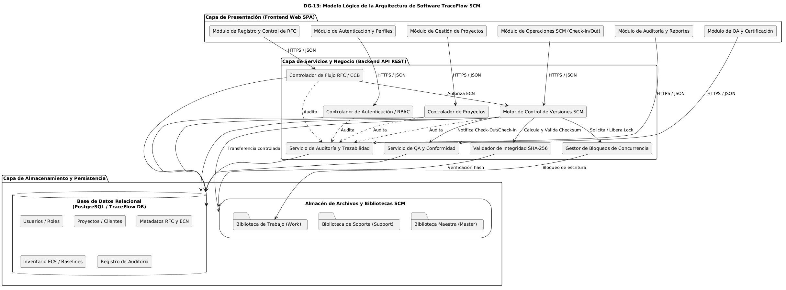

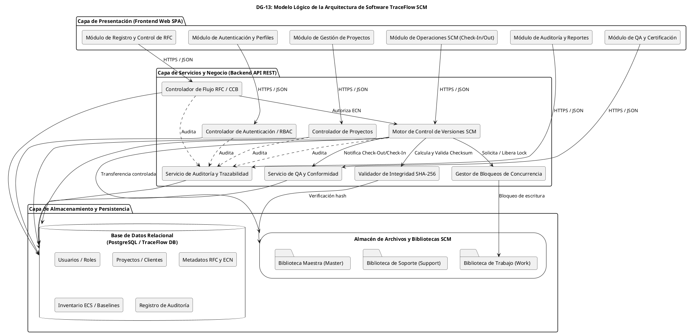
```plantuml
@startuml
skinparam shadowing false
skinparam roundcorner 8
skinparam defaultFontName Arial
skinparam componentStyle rectangle

title <b>DG-13: Modelo Lógico de la Arquitectura de Software TraceFlow SCM</b>

package "Capa de Presentación (Frontend Web SPA)" {
    component [Módulo de Autenticación y Perfiles] as UI_AUTH
    component [Módulo de Gestión de Proyectos] as UI_PROJ
    component [Módulo de Registro y Control de RFC] as UI_RFC
    component [Módulo de Operaciones SCM (Check-In/Out)] as UI_SCM
    component [Módulo de QA y Certificación] as UI_QA
    component [Módulo de Auditoría y Reportes] as UI_AUDIT
}

package "Capa de Servicios y Negocio (Backend API REST)" {
    component [Controlador de Autenticación / RBAC] as CTRL_AUTH
    component [Controlador de Proyectos] as CTRL_PROJ
    component [Controlador de Flujo RFC / CCB] as CTRL_RFC
    component [Motor de Control de Versiones SCM] as SCM_ENGINE
    component [Gestor de Bloqueos de Concurrencia] as LOCK_MGR
    component [Servicio de QA y Conformidad] as QA_SRV
    component [Validador de Integridad SHA-256] as HASH_VAL
    component [Servicio de Auditoría y Trazabilidad] as AUDIT_SRV
}

package "Capa de Almacenamiento y Persistencia" {
    database "Base de Datos Relacional\n(PostgreSQL / TraceFlow DB)" as DB {
        [Usuarios / Roles]
        [Proyectos / Clientes]
        [Metadatos RFC y ECN]
        [Inventario ECS / Baselines]
        [Registro de Auditoría]
    }
    
    storage "Almacén de Archivos y Bibliotecas SCM" as STORAGE {
        folder "Biblioteca de Trabajo (Work)" as LIB_WORK
        folder "Biblioteca de Soporte (Support)" as LIB_SUPPORT
        folder "Biblioteca Maestra (Master)" as LIB_MASTER
    }
}

UI_AUTH --> CTRL_AUTH : HTTPS / JSON
UI_PROJ --> CTRL_PROJ : HTTPS / JSON
UI_RFC --> CTRL_RFC : HTTPS / JSON
UI_SCM --> SCM_ENGINE : HTTPS / JSON
UI_QA --> QA_SRV : HTTPS / JSON
UI_AUDIT --> AUDIT_SRV : HTTPS / JSON

CTRL_RFC --> SCM_ENGINE : Autoriza ECN
SCM_ENGINE --> LOCK_MGR : Solicita / Libera Lock
SCM_ENGINE --> HASH_VAL : Calcula y Valida Checksum
SCM_ENGINE --> QA_SRV : Notifica Check-Out/Check-In

CTRL_AUTH ..> AUDIT_SRV : Audita
CTRL_PROJ ..> AUDIT_SRV : Audita
CTRL_RFC ..> AUDIT_SRV : Audita
SCM_ENGINE ..> AUDIT_SRV : Audita

CTRL_AUTH --> DB
CTRL_PROJ --> DB
CTRL_RFC --> DB
QA_SRV --> DB
AUDIT_SRV --> DB
SCM_ENGINE --> DB

SCM_ENGINE --> STORAGE : Transferencia controlada
LOCK_MGR --> LIB_WORK : Bloqueo de escritura
HASH_VAL --> STORAGE : Verificación hash

@enduml
```

---

# Diagramas de Secuencia del Modelo Lógico

Los diagramas de secuencia modelan la interacción temporal y sincrónica entre los actores y los componentes del sistema (Frontend, Controlador, Servicios de Lógica de Negocio y Persistencia/SCM Core) conforme a los escenarios de caso de uso detallados en la Sección 6.1.3 y catalogados en `TB-11`.

---

### DG-SEQ-01 — Gestionar usuarios y roles (CU-01)
**ID:** DG-SEQ-01 | **Tipo:** Secuencia | **Estado:** APROBADO — Secuencia de Análisis | **Versión:** 2.0  
**RF:** RF-01 | **RN:** RN-01 | **CU:** CU-01 | **Fuente:** `FD03-EPIS-Informe_SRS.md`, Sección 6.2.1

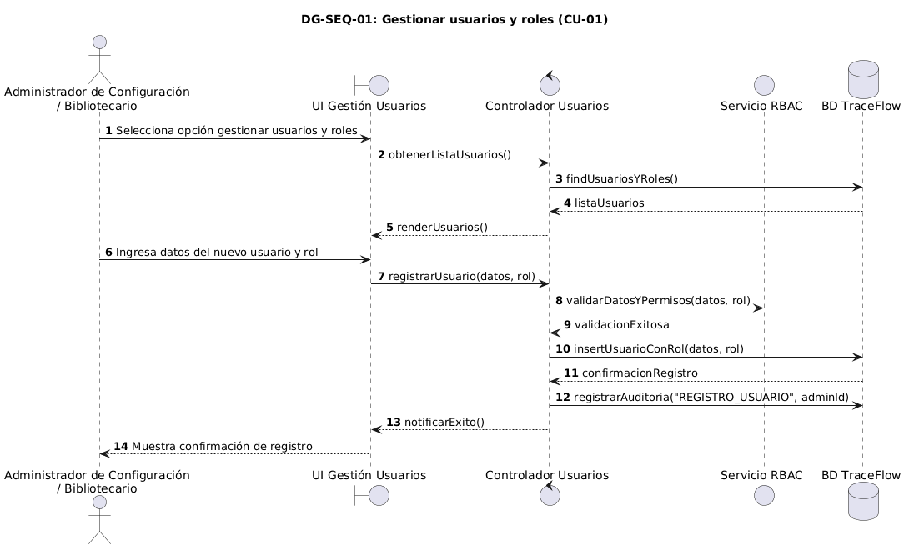

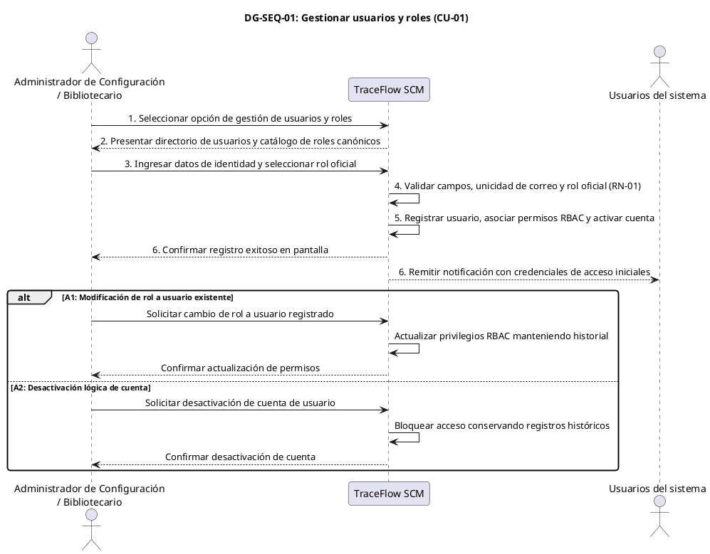
```plantuml
@startuml DG-SEQ-01
skinparam shadowing false
skinparam roundcorner 8
skinparam defaultFontName Arial
skinparam sequenceMessageAlign center

title <b>DG-SEQ-01: Gestionar usuarios y roles (CU-01)</b>

actor "Administrador de Configuración\n/ Bibliotecario" as Admin
participant "TraceFlow SCM" as Sistema
actor "Usuarios del sistema" as Usuario

Admin -> Sistema: 1. Seleccionar opción de gestión de usuarios y roles
Sistema --> Admin: 2. Presentar directorio de usuarios y catálogo de roles canónicos
Admin -> Sistema: 3. Ingresar datos de identidad y seleccionar rol oficial
Sistema -> Sistema: 4. Validar campos, unicidad de correo y rol oficial (RN-01)
Sistema -> Sistema: 5. Registrar usuario, asociar permisos RBAC y activar cuenta
Sistema --> Admin: 6. Confirmar registro exitoso en pantalla
Sistema --> Usuario: 6. Remitir notificación con credenciales de acceso iniciales

alt A1: Modificación de rol a usuario existente
  Admin -> Sistema: Solicitar cambio de rol a usuario registrado
  Sistema -> Sistema: Actualizar privilegios RBAC manteniendo historial
  Sistema --> Admin: Confirmar actualización de permisos
else A2: Desactivación lógica de cuenta
  Admin -> Sistema: Solicitar desactivación de cuenta de usuario
  Sistema -> Sistema: Bloquear acceso conservando registros históricos
  Sistema --> Admin: Confirmar desactivación de cuenta
end

@enduml
```

---

### DG-SEQ-02 — Crear y administrar proyectos (CU-02)
**ID:** DG-SEQ-02 | **Tipo:** Secuencia | **Estado:** APROBADO — Secuencia de Análisis | **Versión:** 2.0  
**RF:** RF-02 | **RN:** RN-01 | **CU:** CU-02 | **Fuente:** `FD03-EPIS-Informe_SRS.md`, Sección 6.2.1

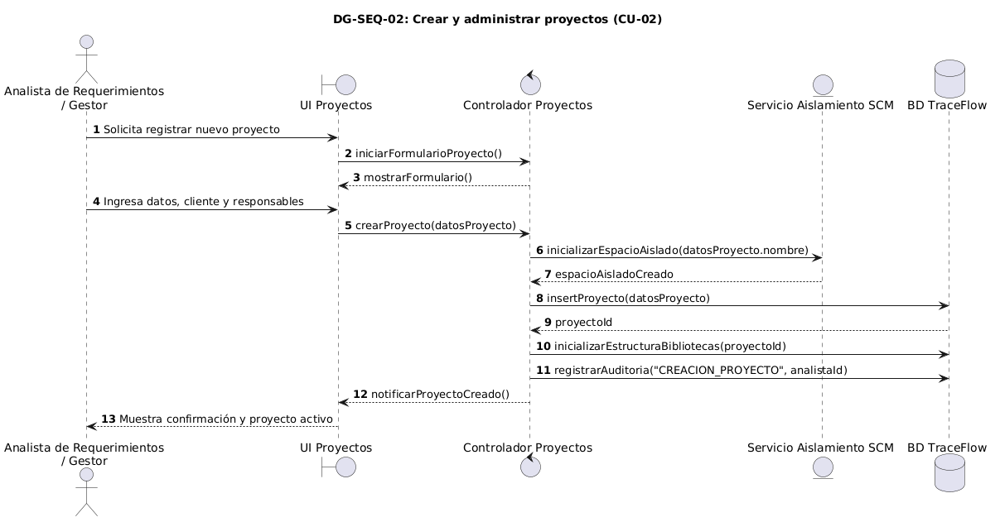

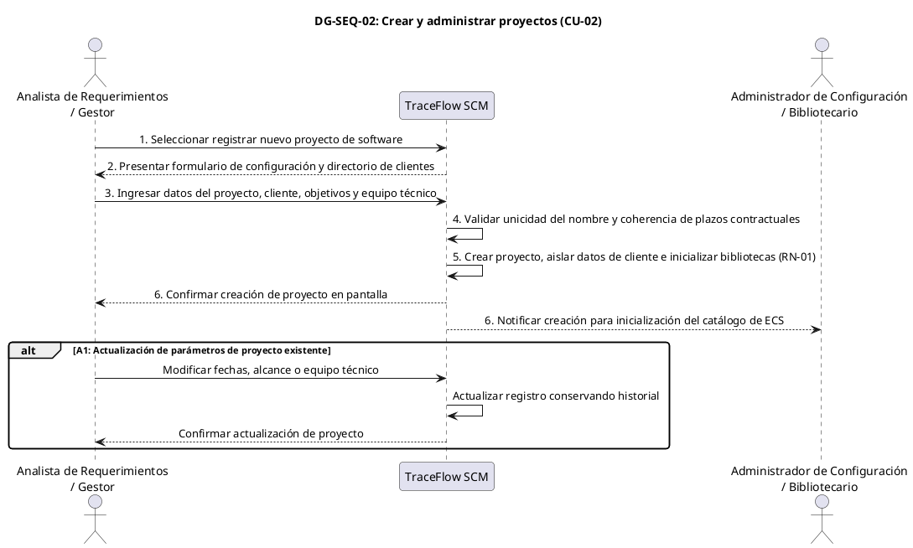
```plantuml
@startuml DG-SEQ-02
skinparam shadowing false
skinparam roundcorner 8
skinparam defaultFontName Arial
skinparam sequenceMessageAlign center

title <b>DG-SEQ-02: Crear y administrar proyectos (CU-02)</b>

actor "Analista de Requerimientos\n/ Gestor" as Analista
participant "TraceFlow SCM" as Sistema
actor "Administrador de Configuración\n/ Bibliotecario" as Admin

Analista -> Sistema: 1. Seleccionar registrar nuevo proyecto de software
Sistema --> Analista: 2. Presentar formulario de configuración y directorio de clientes
Analista -> Sistema: 3. Ingresar datos del proyecto, cliente, objetivos y equipo técnico
Sistema -> Sistema: 4. Validar unicidad del nombre y coherencia de plazos contractuales
Sistema -> Sistema: 5. Crear proyecto, aislar datos de cliente e inicializar bibliotecas (RN-01)
Sistema --> Analista: 6. Confirmar creación de proyecto en pantalla
Sistema --> Admin: 6. Notificar creación para inicialización del catálogo de ECS

alt A1: Actualización de parámetros de proyecto existente
  Analista -> Sistema: Modificar fechas, alcance o equipo técnico
  Sistema -> Sistema: Actualizar registro conservando historial
  Sistema --> Analista: Confirmar actualización de proyecto
end

@enduml
```

---

### DG-SEQ-03 — Consultar proyecto (CU-03)
**ID:** DG-SEQ-03 | **Tipo:** Secuencia | **Estado:** APROBADO — Secuencia de Análisis | **Versión:** 2.0  
**RF:** RF-02 | **RN:** RN-01 | **CU:** CU-03 | **Fuente:** `FD03-EPIS-Informe_SRS.md`, Sección 6.2.1

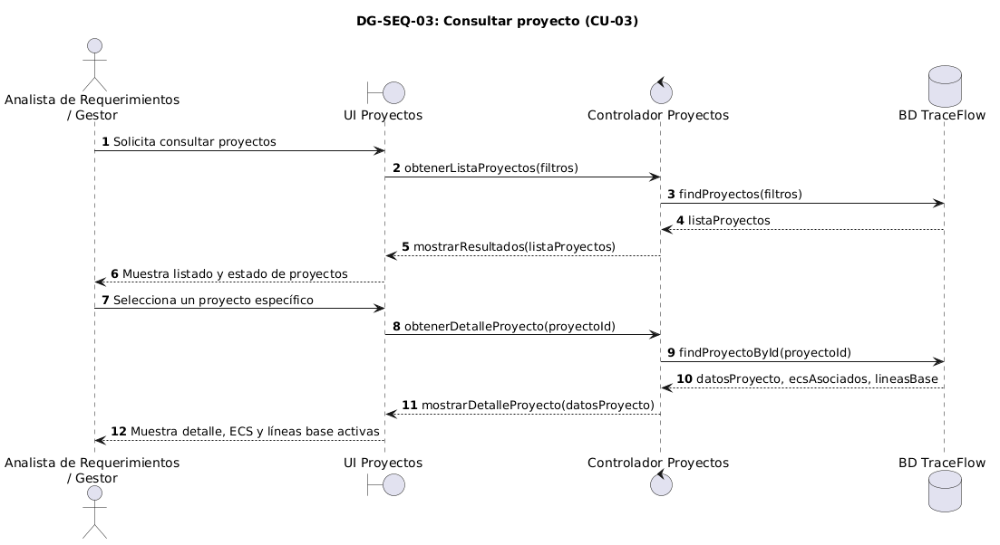

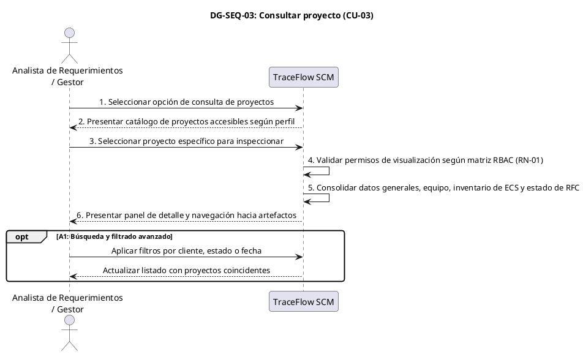
```plantuml
@startuml DG-SEQ-03
skinparam shadowing false
skinparam roundcorner 8
skinparam defaultFontName Arial
skinparam sequenceMessageAlign center

title <b>DG-SEQ-03: Consultar proyecto (CU-03)</b>

actor "Analista de Requerimientos\n/ Gestor" as Actor
participant "TraceFlow SCM" as Sistema

Actor -> Sistema: 1. Seleccionar opción de consulta de proyectos
Sistema --> Actor: 2. Presentar catálogo de proyectos accesibles según perfil
Actor -> Sistema: 3. Seleccionar proyecto específico para inspeccionar
Sistema -> Sistema: 4. Validar permisos de visualización según matriz RBAC (RN-01)
Sistema -> Sistema: 5. Consolidar datos generales, equipo, inventario de ECS y estado de RFC
Sistema --> Actor: 6. Presentar panel de detalle y navegación hacia artefactos

opt A1: Búsqueda y filtrado avanzado
  Actor -> Sistema: Aplicar filtros por cliente, estado o fecha
  Sistema --> Actor: Actualizar listado con proyectos coincidentes
end

@enduml
```

---

### DG-SEQ-04 — Registrar Solicitud de Cambio (RFC) (CU-04)
**ID:** DG-SEQ-04 | **Tipo:** Secuencia | **Estado:** APROBADO — Secuencia de Análisis | **Versión:** 2.0  
**RF:** RF-04 | **RN:** RN-01 | **CU:** CU-04 | **Fuente:** `FD03-EPIS-Informe_SRS.md`, Sección 6.2.1

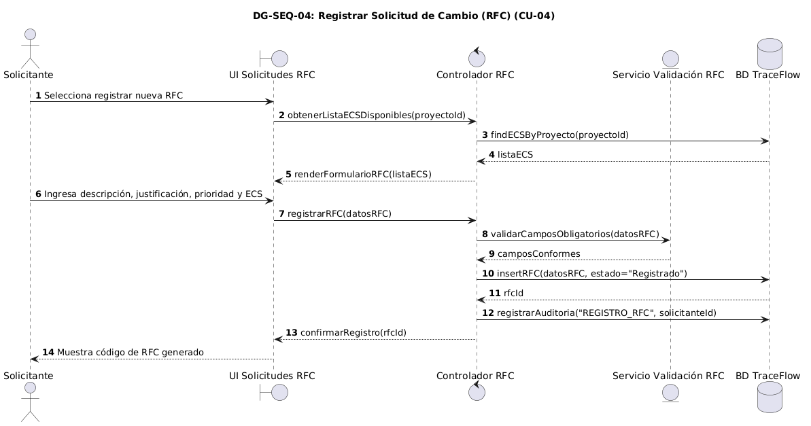

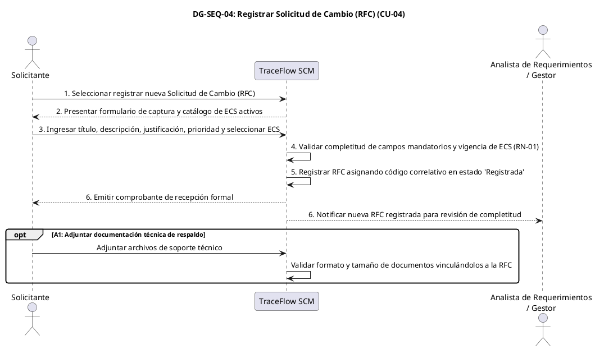
```plantuml
@startuml DG-SEQ-04
skinparam shadowing false
skinparam roundcorner 8
skinparam defaultFontName Arial
skinparam sequenceMessageAlign center

title <b>DG-SEQ-04: Registrar Solicitud de Cambio (RFC) (CU-04)</b>

actor "Solicitante" as Solicitante
participant "TraceFlow SCM" as Sistema
actor "Analista de Requerimientos\n/ Gestor" as Analista

Solicitante -> Sistema: 1. Seleccionar registrar nueva Solicitud de Cambio (RFC)
Sistema --> Solicitante: 2. Presentar formulario de captura y catálogo de ECS activos
Solicitante -> Sistema: 3. Ingresar título, descripción, justificación, prioridad y seleccionar ECS
Sistema -> Sistema: 4. Validar completitud de campos mandatorios y vigencia de ECS (RN-01)
Sistema -> Sistema: 5. Registrar RFC asignando código correlativo en estado 'Registrada'
Sistema --> Solicitante: 6. Emitir comprobante de recepción formal
Sistema --> Analista: 6. Notificar nueva RFC registrada para revisión de completitud

opt A1: Adjuntar documentación técnica de respaldo
  Solicitante -> Sistema: Adjuntar archivos de soporte técnico
  Sistema -> Sistema: Validar formato y tamaño de documentos vinculándolos a la RFC
end

@enduml
```

---

### DG-SEQ-04.1 — Subsanar Solicitud de Cambio (RFC) (CU-04.1)
**ID:** DG-SEQ-04.1 | **Tipo:** Secuencia | **Estado:** APROBADO — Secuencia de Análisis | **Versión:** 2.0  
**RF:** RF-04 | **RN:** RN-01 | **CU:** CU-04.1 | **Fuente:** `FD03-EPIS-Informe_SRS.md`, Sección 6.2.1

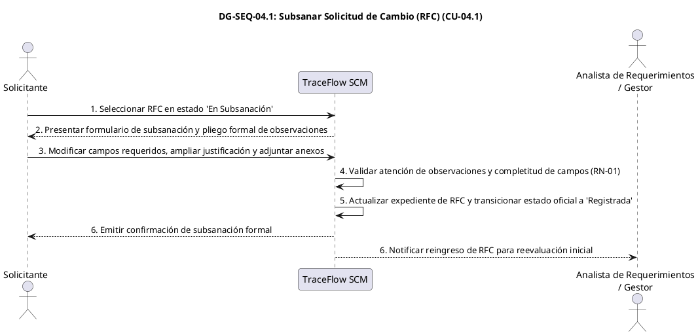
```plantuml
@startuml DG-SEQ-04.1
skinparam shadowing false
skinparam roundcorner 8
skinparam defaultFontName Arial
skinparam sequenceMessageAlign center

title <b>DG-SEQ-04.1: Subsanar Solicitud de Cambio (RFC) (CU-04.1)</b>

actor "Solicitante" as Solicitante
participant "TraceFlow SCM" as Sistema
actor "Analista de Requerimientos\n/ Gestor" as Analista

Solicitante -> Sistema: 1. Seleccionar RFC en estado 'En Subsanación'
Sistema --> Solicitante: 2. Presentar formulario de subsanación y pliego formal de observaciones
Solicitante -> Sistema: 3. Modificar campos requeridos, ampliar justificación y adjuntar anexos
Sistema -> Sistema: 4. Validar atención de observaciones y completitud de campos (RN-01)
Sistema -> Sistema: 5. Actualizar expediente de RFC y transicionar estado oficial a 'Registrada'
Sistema --> Solicitante: 6. Emitir confirmación de subsanación formal
Sistema --> Analista: 6. Notificar reingreso de RFC para reevaluación inicial

@enduml
```

---

### DG-SEQ-05 — Validar y clasificar la solicitud (CU-05)
**ID:** DG-SEQ-05 | **Tipo:** Secuencia | **Estado:** APROBADO — Secuencia de Análisis | **Versión:** 2.0  
**RF:** RF-04, RF-05 | **RN:** RN-01, RN-07 | **CU:** CU-05 | **Fuente:** `FD03-EPIS-Informe_SRS.md`, Sección 6.2.1

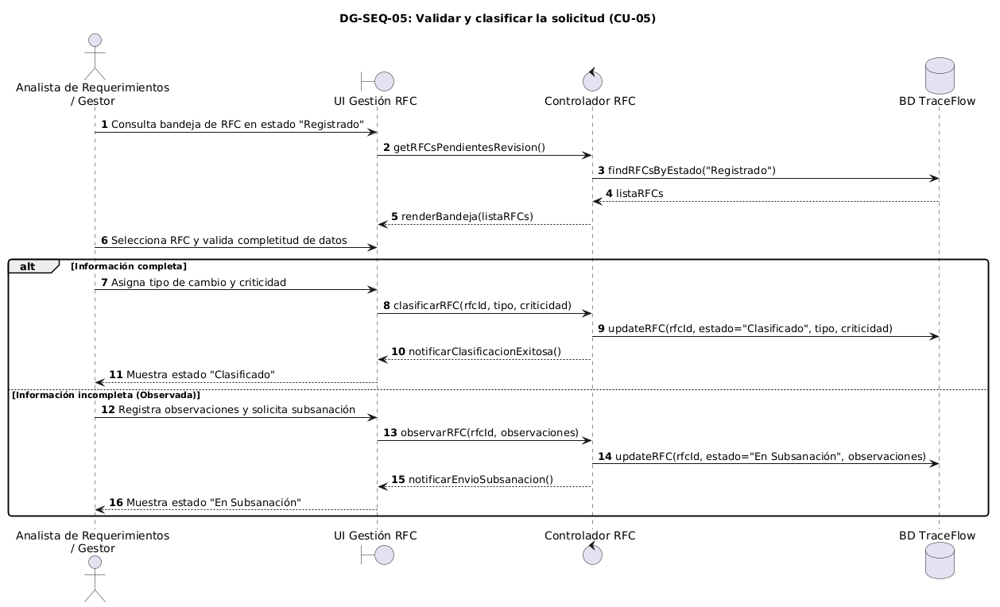

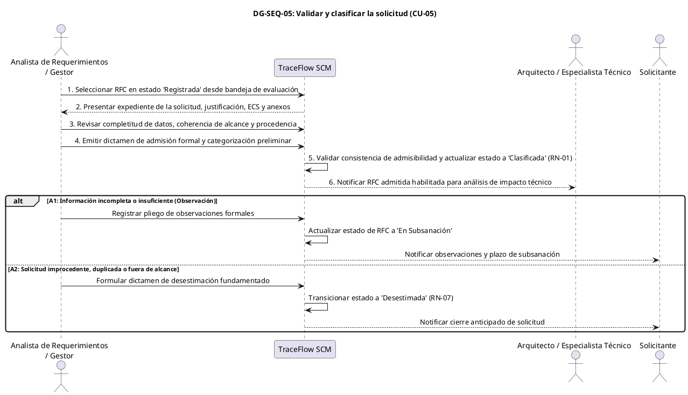
```plantuml
@startuml DG-SEQ-05
skinparam shadowing false
skinparam roundcorner 8
skinparam defaultFontName Arial
skinparam sequenceMessageAlign center

title <b>DG-SEQ-05: Validar y clasificar la solicitud (CU-05)</b>

actor "Analista de Requerimientos\n/ Gestor" as Analista
participant "TraceFlow SCM" as Sistema
actor "Arquitecto / Especialista Técnico" as Arquitecto
actor "Solicitante" as Solicitante

Analista -> Sistema: 1. Seleccionar RFC en estado 'Registrada' desde bandeja de evaluación
Sistema --> Analista: 2. Presentar expediente de la solicitud, justificación, ECS y anexos
Analista -> Sistema: 3. Revisar completitud de datos, coherencia de alcance y procedencia
Analista -> Sistema: 4. Emitir dictamen de admisión formal y categorización preliminar
Sistema -> Sistema: 5. Validar consistencia de admisibilidad y actualizar estado a 'Clasificada' (RN-01)
Sistema --> Arquitecto: 6. Notificar RFC admitida habilitada para análisis de impacto técnico

alt A1: Información incompleta o insuficiente (Observación)
  Analista -> Sistema: Registrar pliego de observaciones formales
  Sistema -> Sistema: Actualizar estado de RFC a 'En Subsanación'
  Sistema --> Solicitante: Notificar observaciones y plazo de subsanación
else A2: Solicitud improcedente, duplicada o fuera de alcance
  Analista -> Sistema: Formular dictamen de desestimación fundamentado
  Sistema -> Sistema: Transicionar estado a 'Desestimada' (RN-07)
  Sistema --> Solicitante: Notificar cierre anticipado de solicitud
end

@enduml
```

---

### DG-SEQ-06 — Realizar análisis de impacto técnico (CU-06)
**ID:** DG-SEQ-06 | **Tipo:** Secuencia | **Estado:** APROBADO — Secuencia de Análisis | **Versión:** 2.0  
**RF:** RF-05 | **RN:** RN-01, RN-05 | **CU:** CU-06 | **Fuente:** `FD03-EPIS-Informe_SRS.md`, Sección 6.2.1

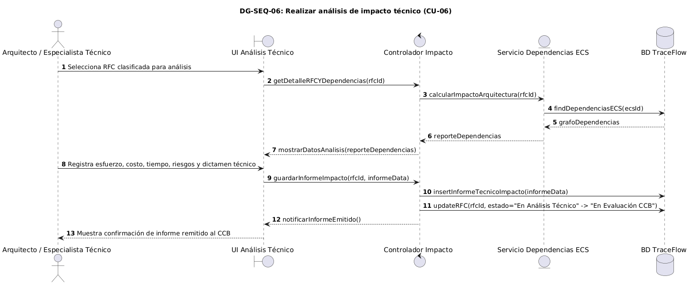

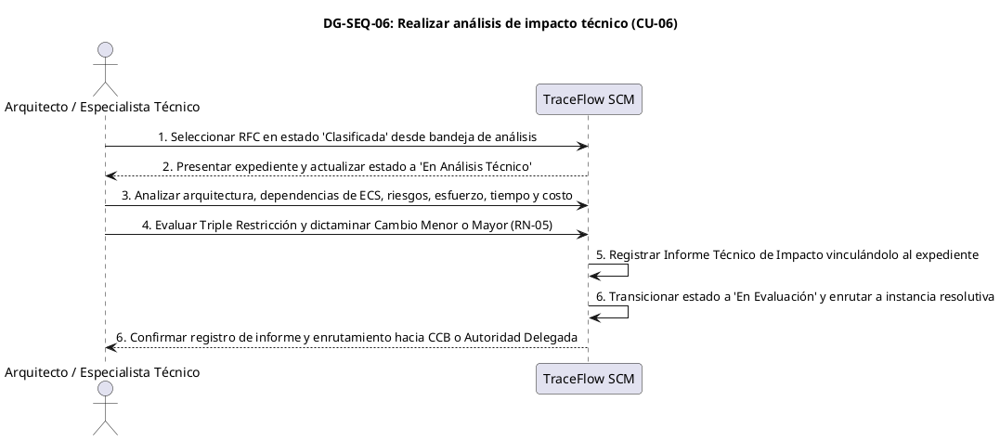
```plantuml
@startuml DG-SEQ-06
skinparam shadowing false
skinparam roundcorner 8
skinparam defaultFontName Arial
skinparam sequenceMessageAlign center

title <b>DG-SEQ-06: Realizar análisis de impacto técnico (CU-06)</b>

actor "Arquitecto / Especialista Técnico" as Arquitecto
participant "TraceFlow SCM" as Sistema

Arquitecto -> Sistema: 1. Seleccionar RFC en estado 'Clasificada' desde bandeja de análisis
Sistema --> Arquitecto: 2. Presentar expediente y actualizar estado a 'En Análisis Técnico'
Arquitecto -> Sistema: 3. Analizar arquitectura, dependencias de ECS, riesgos, esfuerzo, tiempo y costo
Arquitecto -> Sistema: 4. Evaluar Triple Restricción y dictaminar Cambio Menor o Mayor (RN-05)
Sistema -> Sistema: 5. Registrar Informe Técnico de Impacto vinculándolo al expediente
Sistema -> Sistema: 6. Transicionar estado a 'En Evaluación' y enrutar a instancia resolutiva
Sistema --> Arquitecto: 6. Confirmar registro de informe y enrutamiento hacia CCB o Autoridad Delegada

@enduml
```

---

### DG-SEQ-07 — Evaluar Cambio Mayor en CCB (CU-07)
**ID:** DG-SEQ-07 | **Tipo:** Secuencia | **Estado:** APROBADO — Secuencia de Análisis | **Versión:** 2.0  
**RF:** RF-06 | **RN:** RN-01, RN-05, RN-07 | **CU:** CU-07 | **Fuente:** `FD03-EPIS-Informe_SRS.md`, Sección 6.2.1

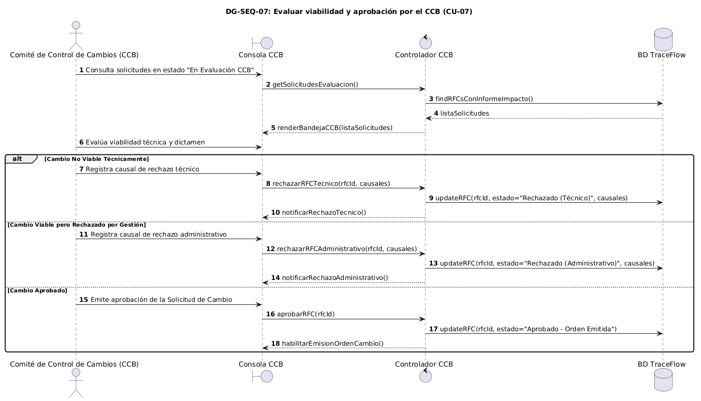

```plantuml
@startuml DG-SEQ-07
skinparam shadowing false
skinparam roundcorner 8
skinparam defaultFontName Arial
skinparam sequenceMessageAlign center

title <b>DG-SEQ-07: Evaluar Cambio Mayor en CCB (CU-07)</b>

actor "Comité de Control de Cambios (CCB)" as CCB
participant "TraceFlow SCM" as Sistema
actor "Solicitante" as Solicitante
actor "Administrador de Configuración\n/ Bibliotecario" as Admin

CCB -> Sistema: 1. Acceder al expediente de Cambio Mayor en estado 'En Evaluación'
Sistema --> CCB: 2. Presentar expediente integral, Informe de Impacto y Triple Restricción
CCB -> Sistema: 3. Deliberar colegiadamente sobre viabilidad técnica, contractual y económica
CCB -> Sistema: 4. Registrar votación formal y emitir acta resolutiva aprobatoria (RN-01, RN-05)
Sistema -> Sistema: 5. Validar cuórum legal, registrar acta formal y actualizar estado a 'Autorizada'
Sistema --> Solicitante: 6. Notificar formalmente la resolución aprobatoria del CCB
Sistema --> Admin: 6. Notificar habilitación para emisión de la Orden de Cambio (ECN/ECO)

alt A1: Dictamen de rechazo colegiado del Cambio Mayor
  CCB -> Sistema: Registrar votación denegatoria y fundamentar causales en acta
  Sistema -> Sistema: Transicionar estado de RFC a 'Rechazada' (RN-07)
  Sistema --> Solicitante: Notificar resolución de rechazo formal fundamentado
end

@enduml
```

---

### DG-SEQ-08 — Emitir Orden de Cambio (ECN/ECO) (CU-08)
**ID:** DG-SEQ-08 | **Tipo:** Secuencia | **Estado:** APROBADO — Secuencia de Análisis | **Versión:** 2.0  
**RF:** RF-07 | **RN:** RN-01 | **CU:** CU-08 | **Fuente:** `FD03-EPIS-Informe_SRS.md`, Sección 6.2.1

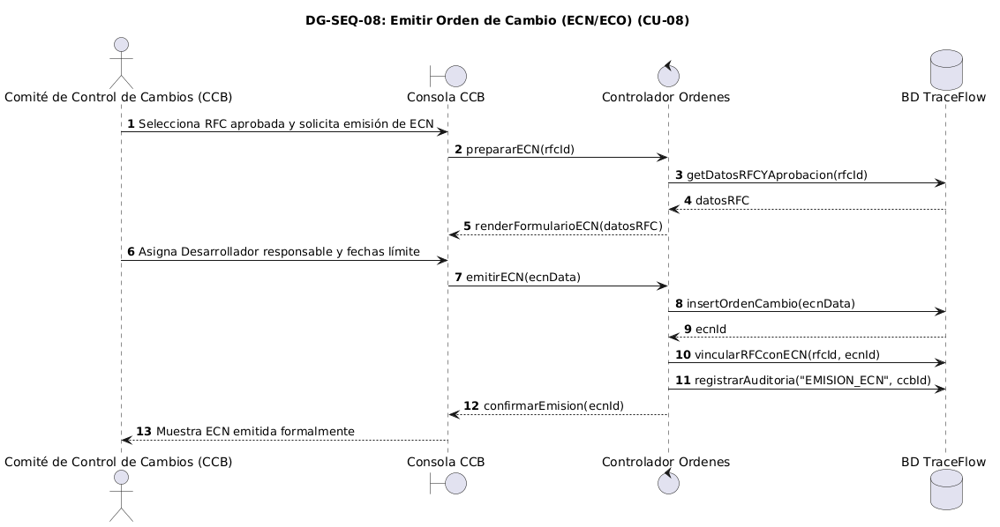

```plantuml
@startuml DG-SEQ-08
skinparam shadowing false
skinparam roundcorner 8
skinparam defaultFontName Arial
skinparam sequenceMessageAlign center

title <b>DG-SEQ-08: Emitir Orden de Cambio (ECN/ECO) (CU-08)</b>

actor "CCB / Autoridad Delegada" as Autoridad
participant "TraceFlow SCM" as Sistema
actor "Administrador de Configuración\n/ Bibliotecario" as Admin
actor "Ingeniero de Software\n/ Desarrollador" as Dev

Autoridad -> Sistema: 1. Seleccionar RFC en estado 'Autorizada'
Sistema --> Autoridad: 2. Presentar formulario de formalización de ECN/ECO con antecedentes
Autoridad -> Sistema: 3. Ingresar asignación de Desarrollador, plazos máximos y alcance de cambio
Sistema -> Sistema: 4. Validar autorización formal vigente y rol activo del Desarrollador (RN-01)
Sistema -> Sistema: 5. Expedir ECN/ECO con código unívoco y actualizar estado a 'Orden Emitida'
Sistema --> Admin: 6. Notificar formalmente la emisión de orden para proceder con Check-Out
Sistema --> Dev: 6. Notificar asignación técnica de la Orden de Cambio formal

@enduml
```

---

### DG-SEQ-09 — Registrar ECS (CU-09)
**ID:** DG-SEQ-09 | **Tipo:** Secuencia | **Estado:** APROBADO — Secuencia de Análisis | **Versión:** 2.0  
**RF:** RF-03 | **RN:** RN-01, RN-02, RN-04 | **CU:** CU-09 | **Fuente:** `FD03-EPIS-Informe_SRS.md`, Sección 6.2.1

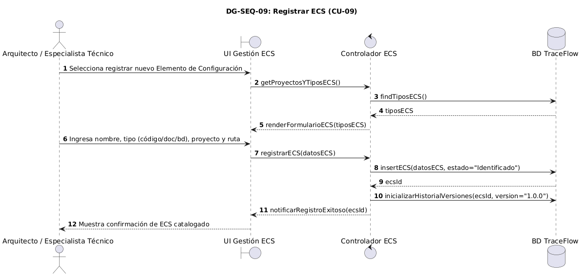

```plantuml
@startuml DG-SEQ-09
skinparam shadowing false
skinparam roundcorner 8
skinparam defaultFontName Arial
skinparam sequenceMessageAlign center

title <b>DG-SEQ-09: Registrar ECS (CU-09)</b>

actor "Arquitecto / Especialista Técnico" as Arquitecto
participant "TraceFlow SCM" as Sistema
actor "Administrador de Configuración\n/ Bibliotecario" as Admin

Arquitecto -> Sistema: 1. Seleccionar opción de registrar nuevo Elemento de Configuración (ECS)
Sistema --> Arquitecto: 2. Presentar formulario de catalogación y jerarquía de componentes
Arquitecto -> Sistema: 3. Ingresar nombre, clasificación, versión inicial, dependencias y archivo base
Sistema -> Sistema: 4. Validar unicidad de nombre, estándar mayor.menor.parche y suma de integridad (RN-02)
Sistema -> Sistema: 5. Registrar ECS con código unívoco y depositar en biblioteca designada (RN-04)
Sistema --> Arquitecto: 6. Emitir confirmación de catalogación formal del nuevo ECS
Sistema --> Admin: 6. Notificar disponibilidad del nuevo ECS para el flujo de cambios

@enduml
```

---

### DG-SEQ-10 — Efectuar Check-Out (CU-10)
**ID:** DG-SEQ-10 | **Tipo:** Secuencia | **Estado:** APROBADO — Secuencia de Análisis | **Versión:** 2.0  
**RF:** RF-08, RF-09 | **RN:** RN-01, RN-06 | **CU:** CU-10 | **Fuente:** `FD03-EPIS-Informe_SRS.md`, Sección 6.2.1

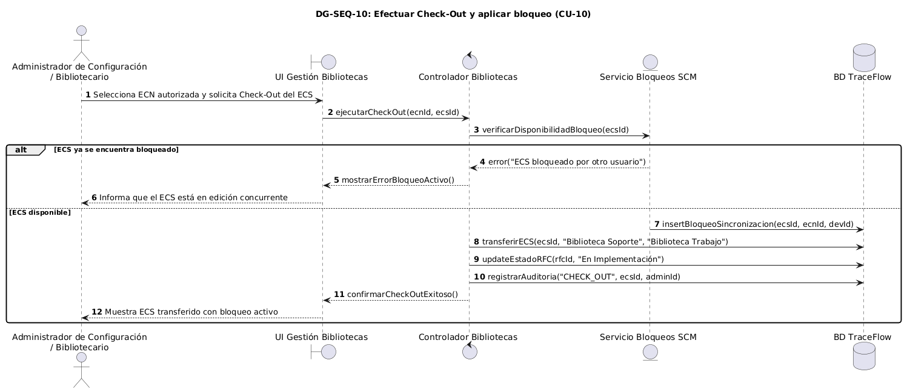

```plantuml
@startuml DG-SEQ-10
skinparam shadowing false
skinparam roundcorner 8
skinparam defaultFontName Arial
skinparam sequenceMessageAlign center

title <b>DG-SEQ-10: Efectuar Check-Out (CU-10)</b>

actor "Administrador de Configuración\n/ Bibliotecario" as Admin
participant "TraceFlow SCM" as Sistema
actor "Ingeniero de Software\n/ Desarrollador" as Dev

Admin -> Sistema: 1. Seleccionar Orden de Cambio en estado 'Orden Emitida'
Sistema --> Admin: 2. Presentar datos de ECN/ECO, ECS en Biblioteca de Soporte y Desarrollador asignado
Admin -> Sistema: 3. Confirmar operación de Check-Out hacia la Biblioteca de Trabajo
Sistema -> Sistema: 4. Validar ausencia de bloqueo previo y verificar integridad del ECS (RN-06)
Sistema -> Sistema: 5. Transferir copia a Biblioteca de Trabajo, aplicar bloqueo y actualizar a 'En Implementación'
Sistema --> Admin: 6. Registrar asiento histórico de Check-Out en bitácora de auditoría
Sistema --> Dev: 6. Notificar disponibilidad del artefacto para inicio de actividades técnicas

@enduml
```

---

### DG-SEQ-11 — Aplicar bloqueo de sincronización (CU-11)
**ID:** DG-SEQ-11 | **Tipo:** Secuencia | **Estado:** APROBADO — Secuencia de Análisis | **Versión:** 2.0  
**RF:** RF-09 | **RN:** RN-06 | **CU:** CU-11 | **Fuente:** `FD03-EPIS-Informe_SRS.md`, Sección 6.2.1

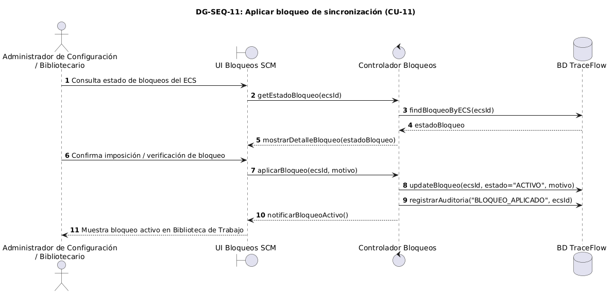

```plantuml
@startuml DG-SEQ-11
skinparam shadowing false
skinparam roundcorner 8
skinparam defaultFontName Arial
skinparam sequenceMessageAlign center

title <b>DG-SEQ-11: Aplicar bloqueo de sincronización (CU-11)</b>

actor "Administrador de Configuración\n/ Bibliotecario" as Admin
participant "TraceFlow SCM" as Sistema

Admin -> Sistema: 1. Solicitar aplicación de bloqueo de sincronización sobre ECS
Sistema -> Sistema: 2. Consultar estado actual de concurrencia del ECS en el catálogo
Sistema -> Sistema: 3. Validar ausencia de bloqueo activo preexistente sobre el ECS (RN-06)
Sistema -> Sistema: 4. Registrar bloqueo exclusivo asociando Desarrollador, ECN/ECO y estampa temporal
Sistema -> Sistema: 5. Actualizar catálogo impidiendo nuevas operaciones de Check-Out a terceros
Sistema --> Admin: 6. Confirmar aplicación de bloqueo y asentar transacción en auditoría

@enduml
```

---

### DG-SEQ-12 — Efectuar Check-In (CU-12)
**ID:** DG-SEQ-12 | **Tipo:** Secuencia | **Estado:** APROBADO — Secuencia de Análisis | **Versión:** 2.0  
**RF:** RF-08, RF-09, RF-10 | **RN:** RN-01, RN-02, RN-04, RN-06, RN-09 | **CU:** CU-12 | **Fuente:** `FD03-EPIS-Informe_SRS.md`, Sección 6.2.1

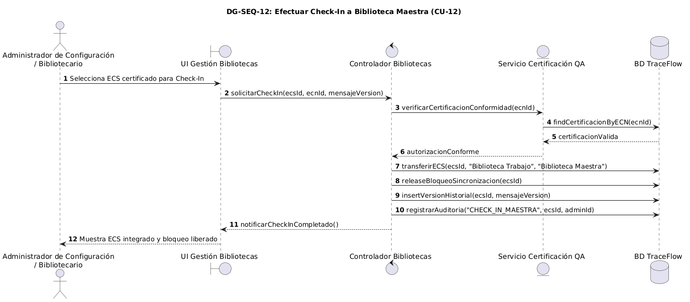

```plantuml
@startuml DG-SEQ-12
skinparam shadowing false
skinparam roundcorner 8
skinparam defaultFontName Arial
skinparam sequenceMessageAlign center

title <b>DG-SEQ-12: Efectuar Check-In (CU-12)</b>

actor "Administrador de Configuración\n/ Bibliotecario" as Admin
participant "TraceFlow SCM" as Sistema
actor "Comité de Control de Cambios (CCB)" as CCB

Admin -> Sistema: 1. Seleccionar RFC con doble validación aprobada para proceder al Check-In
Sistema --> Admin: 2. Presentar expediente técnico consolidando ECN/ECO, Certificado QA y Acta UAT
Admin -> Sistema: 3. Confirmar transferencia formal del ECS hacia la Biblioteca Maestra
Sistema -> Sistema: 4. Validar Orden Emitida, Certificado QA, Acta UAT, checksum y bloqueo vigente (RN-09)
Sistema -> Sistema: 5. Integrar ECS en Biblioteca Maestra, asignar nueva versión y liberar bloqueo (RN-02, RN-06)
Sistema --> Admin: 6. Registrar asiento histórico de Check-In en bitácora de auditoría
Sistema --> CCB: 6. Notificar integración exitosa habilitando la creación de la nueva Línea Base

@enduml
```

---

### DG-SEQ-13 — Consultar historial de versiones (CU-13)
**ID:** DG-SEQ-13 | **Tipo:** Secuencia | **Estado:** APROBADO — Secuencia de Análisis | **Versión:** 2.0  
**RF:** RF-09, RF-16 | **RN:** RN-02, RN-03 | **CU:** CU-13 | **Fuente:** `FD03-EPIS-Informe_SRS.md`, Sección 6.2.1

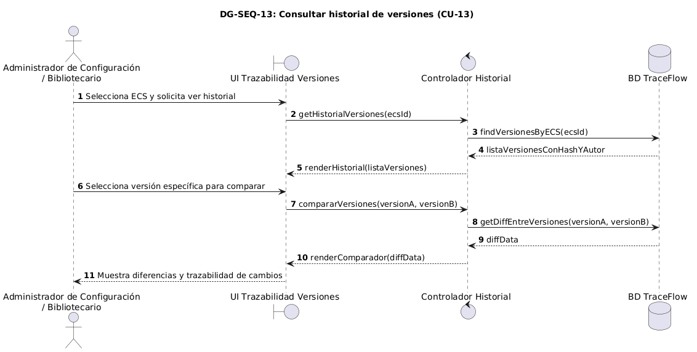

```plantuml
@startuml DG-SEQ-13
skinparam shadowing false
skinparam roundcorner 8
skinparam defaultFontName Arial
skinparam sequenceMessageAlign center

title <b>DG-SEQ-13: Consultar historial de versiones (CU-13)</b>

actor "Administrador de Configuración\n/ Bibliotecario" as Admin
participant "TraceFlow SCM" as Sistema

Admin -> Sistema: 1. Seleccionar ECS en el catálogo y solicitar consulta de historial
Sistema -> Sistema: 2. Recuperar historial de versiones y bitácora de transacciones del elemento
Sistema --> Admin: 3. Presentar lista cronológica de versiones, autor, fecha, ECN/ECO y biblioteca
Admin -> Sistema: 4. Seleccionar versión específica para inspeccionar detalles
Sistema --> Admin: 5. Presentar memoria descriptiva, firmas de auditoría e integridad (RN-03)
Sistema --> Admin: 6. Habilitar comparación conceptual de diferencias entre versiones

opt A1: Comparación de diferencias entre dos versiones históricas
  Admin -> Sistema: Seleccionar dos versiones y solicitar comparación
  Sistema --> Admin: Presentar vista comparativa de diferencias conceptuales
end

@enduml
```

---

### DG-SEQ-14 — Implementar cambio en el ECS (CU-14)
**ID:** DG-SEQ-14 | **Tipo:** Secuencia | **Estado:** APROBADO — Secuencia de Análisis | **Versión:** 2.0  
**RF:** RF-07, RF-09 | **RN:** RN-01, RN-03 | **CU:** CU-14 | **Fuente:** `FD03-EPIS-Informe_SRS.md`, Sección 6.2.1

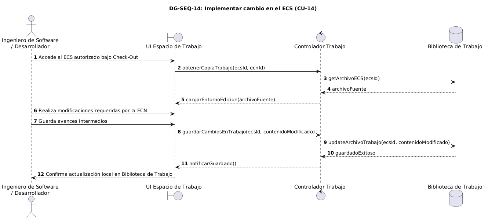

```plantuml
@startuml DG-SEQ-14
skinparam shadowing false
skinparam roundcorner 8
skinparam defaultFontName Arial
skinparam sequenceMessageAlign center

title <b>DG-SEQ-14: Implementar cambio en el ECS (CU-14)</b>

actor "Ingeniero de Software\n/ Desarrollador" as Dev
participant "TraceFlow SCM" as Sistema

Dev -> Sistema: 1. Acceder a Biblioteca de Trabajo y visualizar ECN/ECO asignada
Sistema --> Dev: 2. Presentar alcance técnico, criterios de aceptación y ECS desbloqueado
Dev -> Sistema: 3. Realizar modificaciones, adaptaciones o correcciones sobre copia de trabajo
Sistema -> Sistema: 4. Registrar progreso de cambios vinculándolos a la ECN/ECO (RN-03)
Dev -> Sistema: 5. Formular memoria descriptiva detallando componentes modificados
Sistema --> Dev: 6. Consolidar versión de trabajo dejándola dispuesta para pruebas unitarias

@enduml
```

---

### DG-SEQ-15 — Ejecutar pruebas unitarias locales (CU-15)
**ID:** DG-SEQ-15 | **Tipo:** Secuencia | **Estado:** APROBADO — Secuencia de Análisis | **Versión:** 2.0  
**RF:** RF-10 | **RN:** RN-01, RN-03 | **CU:** CU-15 | **Fuente:** `FD03-EPIS-Informe_SRS.md`, Sección 6.2.1

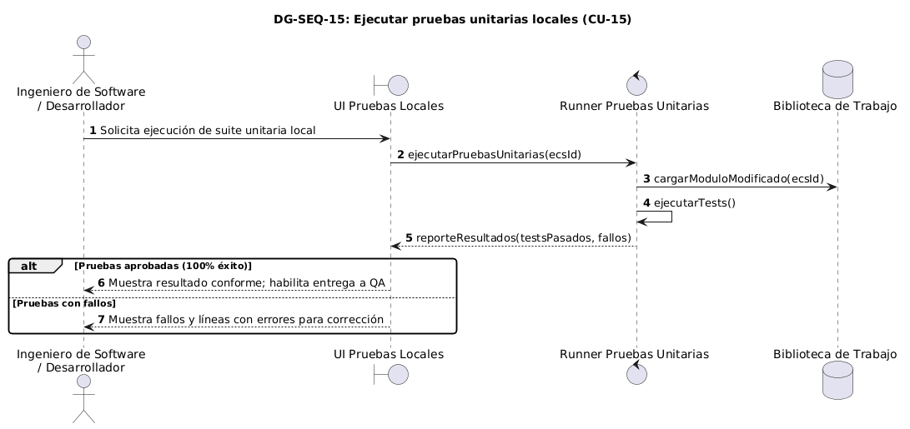

```plantuml
@startuml DG-SEQ-15
skinparam shadowing false
skinparam roundcorner 8
skinparam defaultFontName Arial
skinparam sequenceMessageAlign center

title <b>DG-SEQ-15: Ejecutar pruebas unitarias locales (CU-15)</b>

actor "Ingeniero de Software\n/ Desarrollador" as Dev
participant "TraceFlow SCM" as Sistema

Dev -> Sistema: 1. Solicitar ejecución de conjunto de pruebas unitarias sobre ECS modificado
Sistema --> Dev: 2. Presentar entorno de verificación unitaria y casos de prueba asociados
Dev -> Sistema: 3. Disparar ejecución de batería de pruebas en Biblioteca de Trabajo
Sistema -> Sistema: 4. Validar ejecución sin errores y satisfacción de criterios de cobertura (RN-01)
Sistema -> Sistema: 5. Registrar reporte de resultados unitarios en bitácora de ECN/ECO (RN-03)
Sistema --> Dev: 6. Confirmar éxito y habilitar opción de promover ECS a pruebas de integración

@enduml
```

---

### DG-SEQ-16 — Ejecutar pruebas de integración (CU-16)
**ID:** DG-SEQ-16 | **Tipo:** Secuencia | **Estado:** APROBADO — Secuencia de Análisis | **Versión:** 2.0  
**RF:** RF-10 | **RN:** RN-01, RN-09 | **CU:** CU-16 | **Fuente:** `FD03-EPIS-Informe_SRS.md`, Sección 6.2.1

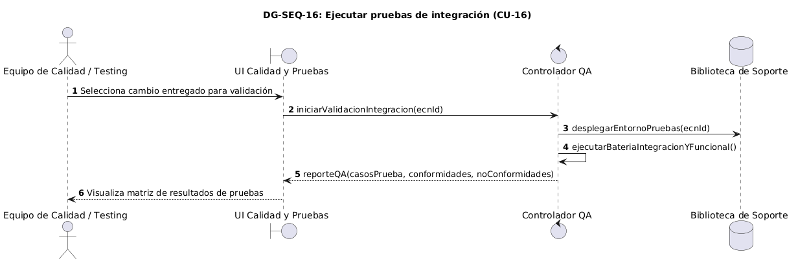

```plantuml
@startuml DG-SEQ-16
skinparam shadowing false
skinparam roundcorner 8
skinparam defaultFontName Arial
skinparam sequenceMessageAlign center

title <b>DG-SEQ-16: Ejecutar pruebas de integración (CU-16)</b>

actor "Equipo de Calidad\n/ Testing" as QA
participant "TraceFlow SCM" as Sistema

QA -> Sistema: 1. Seleccionar RFC en estado 'En Pruebas' desde panel de control
Sistema --> QA: 2. Presentar expediente, ECN/ECO, ECS en Biblioteca de Soporte y plan de pruebas
QA -> Sistema: 3. Ejecutar casos de prueba funcionales, de integración y regresión en Soporte
Sistema -> Sistema: 4. Registrar resultados de cada caso de prueba (aprobado/fallido) y evidencias
Sistema -> Sistema: 5. Consolidar informe de ejecución determinando cobertura y criterios de calidad
Sistema --> QA: 6. Confirmar cierre de batería y presentar resumen para certificar o reportar fallo

@enduml
```

---

### DG-SEQ-17 — Certificar conformidad del cambio (CU-17)
**ID:** DG-SEQ-17 | **Tipo:** Secuencia | **Estado:** APROBADO — Secuencia de Análisis | **Versión:** 2.0  
**RF:** RF-10 | **RN:** RN-01, RN-09 | **CU:** CU-17 | **Fuente:** `FD03-EPIS-Informe_SRS.md`, Sección 6.2.1

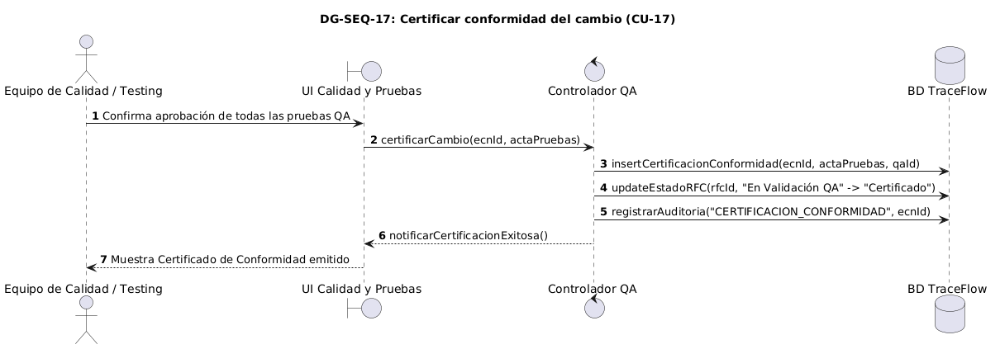

```plantuml
@startuml DG-SEQ-17
skinparam shadowing false
skinparam roundcorner 8
skinparam defaultFontName Arial
skinparam sequenceMessageAlign center

title <b>DG-SEQ-17: Certificar conformidad del cambio (CU-17)</b>

actor "Equipo de Calidad\n/ Testing" as QA
participant "TraceFlow SCM" as Sistema
actor "Solicitante" as Solicitante
actor "Administrador de Configuración\n/ Bibliotecario" as Admin

QA -> Sistema: 1. Seleccionar RFC con pruebas de integración conformes en estado 'En Pruebas'
Sistema --> QA: 2. Presentar consolidado de resultados, informe de cobertura y ausencia de defectos
QA -> Sistema: 3. Suscribir formalmente el dictamen técnico de Certificación de Conformidad
Sistema -> Sistema: 4. Validar criterios técnicos de aceptación y ausencia de incidencias (RN-09)
Sistema -> Sistema: 5. Registrar Certificado Técnico de Conformidad y actualizar estado a 'En Aceptación'
Sistema --> Solicitante: 6. Notificar formalmente para validación de aceptación funcional (UAT)
Sistema --> Admin: 6. Notificar avance a fase de aceptación del usuario

@enduml
```

---

### DG-SEQ-18 — Reportar no conformidad (CU-18)
**ID:** DG-SEQ-18 | **Tipo:** Secuencia | **Estado:** APROBADO — Secuencia de Análisis | **Versión:** 2.0  
**RF:** RF-10, RF-11 | **RN:** RN-08 | **CU:** CU-18 | **Fuente:** `FD03-EPIS-Informe_SRS.md`, Sección 6.2.1

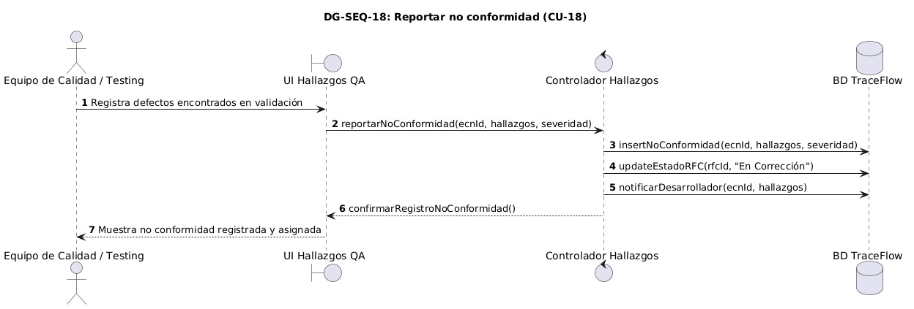

```plantuml
@startuml DG-SEQ-18
skinparam shadowing false
skinparam roundcorner 8
skinparam defaultFontName Arial
skinparam sequenceMessageAlign center

title <b>DG-SEQ-18: Reportar no conformidad (CU-18)</b>

actor "Equipo de Calidad\n/ Testing" as QA
participant "TraceFlow SCM" as Sistema
actor "Ingeniero de Software\n/ Desarrollador" as Dev

QA -> Sistema: 1. Seleccionar opción de reportar no conformidad sobre RFC en 'En Pruebas'
Sistema --> QA: 2. Presentar formulario de registro de defectos precargando pruebas fallidas
QA -> Sistema: 3. Detallar descripción del error, severidad, pasos de reproducción y evidencias
Sistema -> Sistema: 4. Validar reporte, asentar defecto e incrementar contador de ciclos (RN-08)
Sistema -> Sistema: 5. Registrar Informe de No Conformidad y suspender trámite de certificación
Sistema --> Dev: 6. Notificar formalmente para ejecutar correcciones en Biblioteca de Trabajo

@enduml
```

---

### DG-SEQ-19 — Reevaluar y re-testear (CU-19)
**ID:** DG-SEQ-19 | **Tipo:** Secuencia | **Estado:** APROBADO — Secuencia de Análisis | **Versión:** 2.0  
**RF:** RF-11 | **RN:** RN-08 | **CU:** CU-19 | **Fuente:** `FD03-EPIS-Informe_SRS.md`, Sección 6.2.1

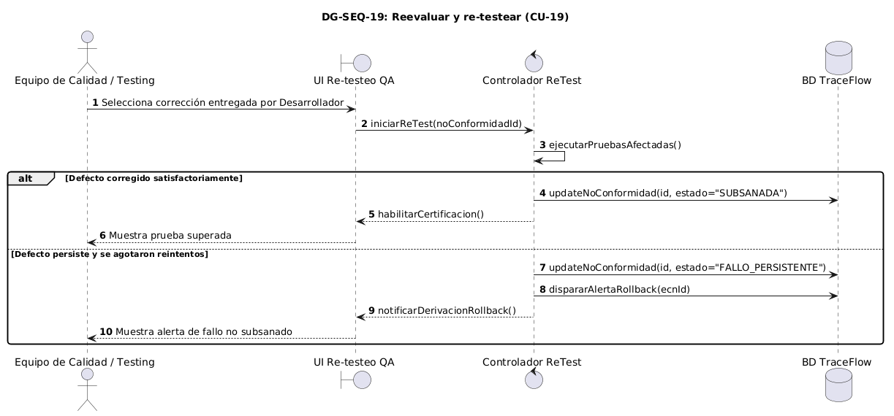

```plantuml
@startuml DG-SEQ-19
skinparam shadowing false
skinparam roundcorner 8
skinparam defaultFontName Arial
skinparam sequenceMessageAlign center

title <b>DG-SEQ-19: Reevaluar y re-testear (CU-19)</b>

actor "Equipo de Calidad\n/ Testing" as QA
participant "TraceFlow SCM" as Sistema
actor "Ingeniero de Software\n/ Desarrollador" as Dev

QA -> Sistema: 1. Seleccionar RFC con correcciones aplicadas en estado 'En Pruebas'
Sistema --> QA: 2. Presentar pliego de defectos previos y memorias técnicas de corrección
QA -> Sistema: 3. Reejecutar casos de prueba focalizados y suite de regresión en Soporte
Sistema -> Sistema: 4. Validar resultados de re-testeo y constatar levantamiento de fallas (RN-08)
Sistema -> Sistema: 5. Consolidar dictamen de re-testeo aprobatorio y actualizar expediente
Sistema --> QA: 6. Derivar flujo hacia Certificación Técnica de Conformidad (CU-17)
Sistema --> Dev: 6. Notificar resultado favorable del re-testeo de calidad

alt E1: Fallo definitivo de re-testeo por agotamiento de instancias
  Sistema -> Sistema: Declarar fallo técnico insubsanable por límite de ciclos
  Sistema --> QA: Notificar agotamiento de instancias y bloqueo de re-test
  Sistema --> Dev: Notificar activación obligatoria de Rollback (CU-21)
end

@enduml
```

---

### DG-SEQ-20 — Crear y congelar línea base (CU-20)
**ID:** DG-SEQ-20 | **Tipo:** Secuencia | **Estado:** APROBADO — Secuencia de Análisis | **Versión:** 2.0  
**RF:** RF-13, RF-14 | **RN:** RN-02, RN-04, RN-07, RN-09 | **CU:** CU-20 | **Fuente:** `FD03-EPIS-Informe_SRS.md`, Sección 6.2.1

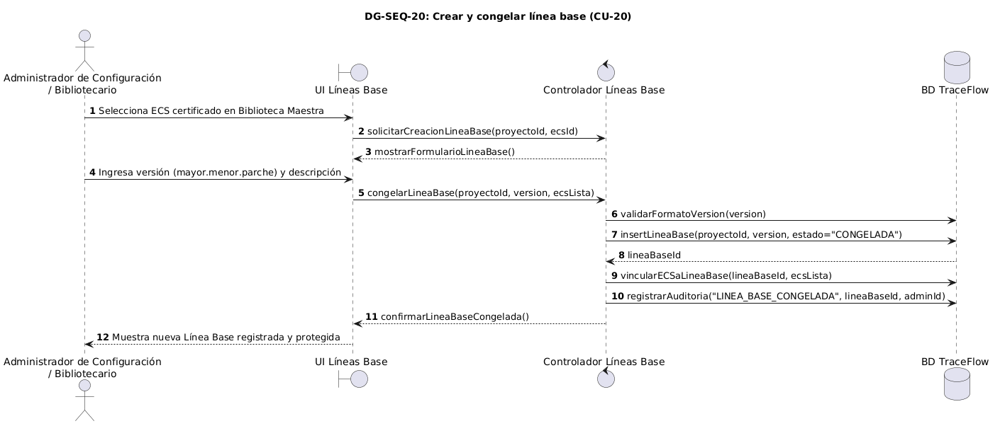

```plantuml
@startuml DG-SEQ-20
skinparam shadowing false
skinparam roundcorner 8
skinparam defaultFontName Arial
skinparam sequenceMessageAlign center

title <b>DG-SEQ-20: Crear y congelar línea base (CU-20)</b>

actor "Administrador de Configuración\n/ Bibliotecario" as Admin
participant "TraceFlow SCM" as Sistema
actor "Comité de Control de Cambios (CCB)" as CCB
actor "Solicitante" as Solicitante

Admin -> Sistema: 1. Acceder al módulo de Líneas Base y seleccionar ECS tras Check-In
Sistema --> Admin: 2. Presentar inventario con versiones integradas y doble conformidad
Admin -> Sistema: 3. Asignar etiqueta formal de versionamiento y solicitar congelamiento
Sistema -> Sistema: 4. Validar estándar de versiones y pertenencia a Biblioteca Maestra (RN-02, RN-04)
Sistema -> Sistema: 5. Congelar Línea Base contra edición, registrar firma y actualizar a 'Implementada'
Sistema --> Admin: 6. Expedir Certificado formal de nueva Línea Base congelada
Sistema --> CCB: 6. Notificar cierre exitoso del cambio en estado Implementada (RF-14, RN-07)
Sistema --> Solicitante: 6. Notificar cierre formal del cambio implementado

@enduml
```

---

### DG-SEQ-21 — Ejecutar rollback (CU-21)
**ID:** DG-SEQ-21 | **Tipo:** Secuencia | **Estado:** APROBADO — Secuencia de Análisis | **Versión:** 2.0  
**RF:** RF-12 | **RN:** RN-06, RN-08 | **CU:** CU-21 | **Fuente:** `FD03-EPIS-Informe_SRS.md`, Sección 6.2.1

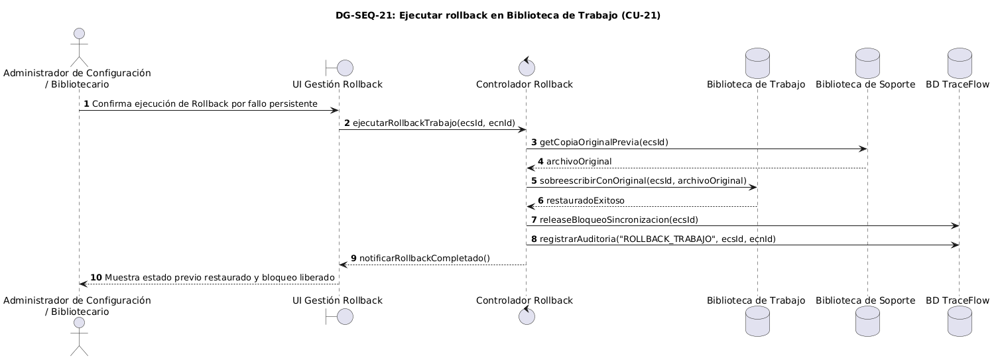

```plantuml
@startuml DG-SEQ-21
skinparam shadowing false
skinparam roundcorner 8
skinparam defaultFontName Arial
skinparam sequenceMessageAlign center

title <b>DG-SEQ-21: Ejecutar rollback (CU-21)</b>

actor "Administrador de Configuración\n/ Bibliotecario" as Admin
participant "TraceFlow SCM" as Sistema
actor "Ingeniero de Software\n/ Desarrollador" as Dev
actor "Comité de Control de Cambios (CCB)" as CCB

Admin -> Sistema: 1. Seleccionar orden no conforme sujeta a reversión en Biblioteca de Trabajo
Sistema --> Admin: 2. Presentar historial de versiones del ECS y versión de origen estable en Soporte
Admin -> Sistema: 3. Confirmar ejecución de reversión (rollback) sobre la copia de trabajo
Sistema -> Sistema: 4. Validar que ECS no ingresó a Maestra y restringir reversión a Trabajo (RN-08)
Sistema -> Sistema: 5. Descartar cambios no conformes, restituir copia previa y liberar bloqueo (RN-06)
Sistema --> Admin: 6. Asentar acta de reversión en auditoría habilitando cancelación (CU-22)
Sistema --> Dev: 6. Notificar descarte de copia de trabajo y liberación de bloqueo
Sistema --> CCB: 6. Notificar ejecución de reversión técnica en Biblioteca de Trabajo

@enduml
```

---

### DG-SEQ-22 — Cancelar Orden de Cambio (CU-22)
**ID:** DG-SEQ-22 | **Tipo:** Secuencia | **Estado:** APROBADO — Secuencia de Análisis | **Versión:** 2.0  
**RF:** RF-12, RF-14 | **RN:** RN-07, RN-08 | **CU:** CU-22 | **Fuente:** `FD03-EPIS-Informe_SRS.md`, Sección 6.2.1

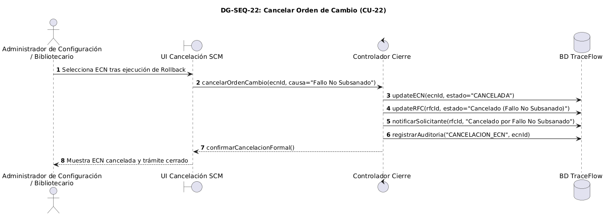

```plantuml
@startuml DG-SEQ-22
skinparam shadowing false
skinparam roundcorner 8
skinparam defaultFontName Arial
skinparam sequenceMessageAlign center

title <b>DG-SEQ-22: Cancelar Orden de Cambio (CU-22)</b>

actor "Administrador de Configuración\n/ Bibliotecario" as Admin
participant "TraceFlow SCM" as Sistema
actor "Solicitante" as Solicitante
actor "Comité de Control de Cambios (CCB)" as CCB

Admin -> Sistema: 1. Seleccionar Orden de Cambio sujeta a cancelación definitiva
Sistema --> Admin: 2. Presentar constancia de rollback ejecutado e informe de fallos no subsanados
Admin -> Sistema: 3. Registrar fundamentación administrativa y técnica de la cancelación
Sistema -> Sistema: 4. Validar rollback previo en Biblioteca de Trabajo y bloqueo liberado (RN-08)
Sistema -> Sistema: 5. Revocar formalmente ECN/ECO y actualizar estado oficial a 'Cancelada'
Sistema --> Solicitante: 6. Notificar cierre formal por fallo no subsanado (RF-14, RN-07)
Sistema --> CCB: 6. Notificar resolución formal de cancelación de la orden

@enduml
```

---

### DG-SEQ-23 — Registrar incidencia (CU-23)
**ID:** DG-SEQ-23 | **Tipo:** Secuencia | **Estado:** APROBADO — Secuencia de Análisis | **Versión:** 2.0  
**RF:** RF-15 | **RN:** RN-01 | **CU:** CU-23 | **Fuente:** `FD03-EPIS-Informe_SRS.md`, Sección 6.2.1

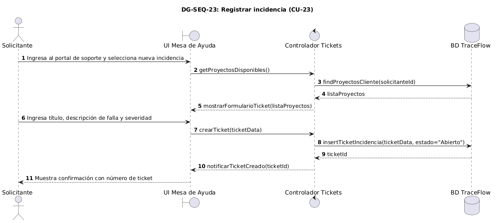

```plantuml
@startuml DG-SEQ-23
skinparam shadowing false
skinparam roundcorner 8
skinparam defaultFontName Arial
skinparam sequenceMessageAlign center

title <b>DG-SEQ-23: Registrar incidencia (CU-23)</b>

actor "Solicitante" as Solicitante
participant "TraceFlow SCM" as Sistema
actor "Analista de Requerimientos\n/ Gestor" as Analista

Solicitante -> Sistema: 1. Seleccionar registrar nuevo reporte de incidencia en el proyecto
Sistema --> Solicitante: 2. Presentar formulario de captura de ticket de incidencia
Solicitante -> Sistema: 3. Ingresar título, descripción del error, pasos, severidad y anexos
Sistema -> Sistema: 4. Validar completitud de campos y formatos de archivos autorizados
Sistema -> Sistema: 5. Registrar ticket de soporte con código correlativo en estado 'Abierta'
Sistema --> Solicitante: 6. Emitir comprobante de recepción formal de ticket
Sistema --> Analista: 6. Notificar nuevo ticket de incidencia para evaluación y atención

@enduml
```

---

### DG-SEQ-24 — Consultar estado de ticket (CU-24)
**ID:** DG-SEQ-24 | **Tipo:** Secuencia | **Estado:** APROBADO — Secuencia de Análisis | **Versión:** 2.0  
**RF:** RF-15 | **RN:** RN-01 | **CU:** CU-24 | **Fuente:** `FD03-EPIS-Informe_SRS.md`, Sección 6.2.1

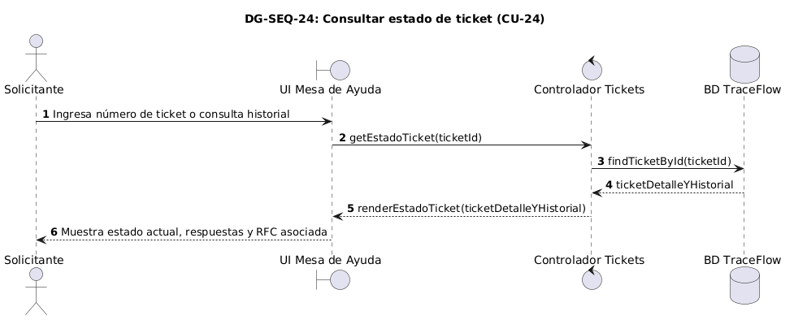

```plantuml
@startuml DG-SEQ-24
skinparam shadowing false
skinparam roundcorner 8
skinparam defaultFontName Arial
skinparam sequenceMessageAlign center

title <b>DG-SEQ-24: Consultar estado de ticket (CU-24)</b>

actor "Solicitante" as Solicitante
participant "TraceFlow SCM" as Sistema

Solicitante -> Sistema: 1. Acceder a bandeja de tickets de soporte del proyecto asignado
Sistema --> Solicitante: 2. Presentar listado de tickets registrados con estados de atención
Solicitante -> Sistema: 3. Seleccionar ticket de incidencia específico para inspeccionar
Sistema -> Sistema: 4. Recuperar bitácora de seguimiento, comentarios y estado de atención
Sistema --> Solicitante: 5. Presentar detalle completo y enlace directo hacia la RFC vinculada
Solicitante -> Sistema: 6. Visualizar evolución del caso y agregar aclaraciones complementarias

@enduml
```

---

### DG-SEQ-25 — Derivar incidencia a RFC (CU-25)
**ID:** DG-SEQ-25 | **Tipo:** Secuencia | **Estado:** APROBADO — Secuencia de Análisis | **Versión:** 2.0  
**RF:** RF-04, RF-15 | **RN:** RN-01 | **CU:** CU-25 | **Fuente:** `FD03-EPIS-Informe_SRS.md`, Sección 6.2.1

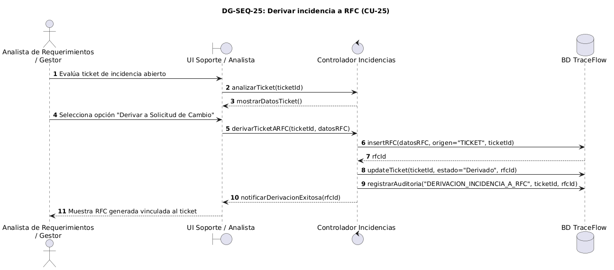

```plantuml
@startuml DG-SEQ-25
skinparam shadowing false
skinparam roundcorner 8
skinparam defaultFontName Arial
skinparam sequenceMessageAlign center

title <b>DG-SEQ-25: Derivar incidencia a RFC (CU-25)</b>

actor "Analista de Requerimientos\n/ Gestor" as Analista
participant "TraceFlow SCM" as Sistema
actor "Solicitante" as Solicitante

Analista -> Sistema: 1. Seleccionar incidencia abierta y dictaminar que requiere modificación
Sistema --> Analista: 2. Presentar opción de derivación formal hacia flujo de Solicitudes de Cambio
Analista -> Sistema: 3. Confirmar derivación identificando ECS preliminar y fundamentando causal
Sistema -> Sistema: 4. Validar no derivación previa y pre-poblar datos enlazando a CU-04
Sistema -> Sistema: 5. Registrar formalmente RFC según flujo CU-04 en estado 'Registrada' (RN-01)
Sistema -> Sistema: 6. Actualizar ticket a 'Derivada' y asentar vínculo bidireccional
Sistema --> Solicitante: 6. Notificar código de nueva RFC asignada para seguimiento

@enduml
```

---

### DG-SEQ-26 — Validar integridad (checksum) (CU-26)
**ID:** DG-SEQ-26 | **Tipo:** Secuencia | **Estado:** APROBADO — Secuencia de Análisis | **Versión:** 2.0  
**RF:** RF-17 | **RN:** RN-04, RN-09 | **CU:** CU-26 | **Fuente:** `FD03-EPIS-Informe_SRS.md`, Sección 6.2.1

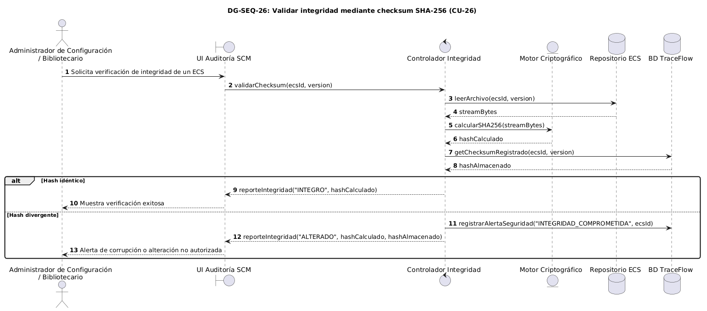

```plantuml
@startuml DG-SEQ-26
skinparam shadowing false
skinparam roundcorner 8
skinparam defaultFontName Arial
skinparam sequenceMessageAlign center

title <b>DG-SEQ-26: Validar integridad (checksum) (CU-26)</b>

actor "Administrador de Configuración\n/ Bibliotecario" as Admin
participant "TraceFlow SCM" as Sistema

Admin -> Sistema: 1. Solicitar validar la integridad del artefacto de software
Sistema -> Sistema: 2. Recuperar artefacto de biblioteca y consultar firma oficial almacenada
Sistema -> Sistema: 3. Calcular firma de comprobación actual sobre el contenido del artefacto
Sistema -> Sistema: 4. Validar equivalencia exacta entre firma calculada y firma oficial (RN-04)
Sistema -> Sistema: 5. Dictaminar conformidad de integridad y asentar estampa en auditoría
Sistema --> Admin: 6. Confirmar integridad del ECS autorizando prosecución de operaciones (RN-09)

alt E1: Discrepancia en la validación de integridad (Firma alterada)
  Sistema -> Sistema: Declarar no conformidad por alteración o corrupción
  Sistema -> Sistema: Bloquear extracción o integración del artefacto corrupto
  Sistema --> Admin: Alertar riesgo de seguridad y registrar anomalía crítica
end

@enduml
```

---

### DG-SEQ-27 — Auditar acciones del sistema (CU-27)
**ID:** DG-SEQ-27 | **Tipo:** Secuencia | **Estado:** APROBADO — Secuencia de Análisis | **Versión:** 2.0  
**RF:** RF-16, RF-17 | **RN:** RN-01, RN-07 | **CU:** CU-27 | **Fuente:** `FD03-EPIS-Informe_SRS.md`, Sección 6.2.1

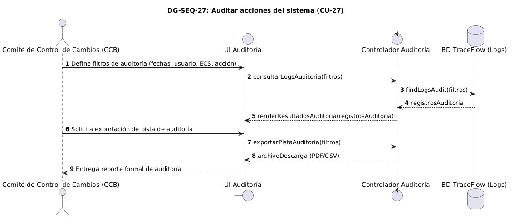

```plantuml
@startuml DG-SEQ-27
skinparam shadowing false
skinparam roundcorner 8
skinparam defaultFontName Arial
skinparam sequenceMessageAlign center

title <b>DG-SEQ-27: Auditar acciones del sistema (CU-27)</b>

actor "Comité de Control de Cambios (CCB)" as CCB
participant "TraceFlow SCM" as Sistema

CCB -> Sistema: 1. Acceder al panel de auditoría y trazabilidad del sistema
Sistema --> CCB: 2. Presentar opciones de consulta y filtrado de bitácora histórica
CCB -> Sistema: 3. Definir criterios de inspección por proyecto, rango de fechas, actor u operación
Sistema -> Sistema: 4. Validar privilegios para visualización de registros confidenciales (RBAC)
Sistema --> CCB: 5. Presentar secuencia cronológica de transacciones críticas y estados (RN-01)
CCB -> Sistema: 6. Analizar expediente de auditoría y emitir informe formal de trazabilidad

@enduml
```

---

### DG-SEQ-28 — Generar reportes de estado (CU-28)
**ID:** DG-SEQ-28 | **Tipo:** Secuencia | **Estado:** APROBADO — Secuencia de Análisis | **Versión:** 2.0  
**RF:** RF-18 | **RN:** RN-01, RN-07 | **CU:** CU-28 | **Fuente:** `FD03-EPIS-Informe_SRS.md`, Sección 6.2.1

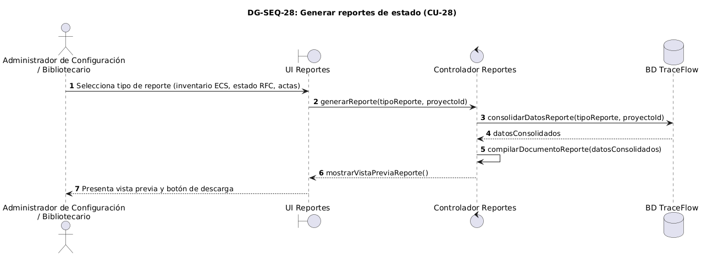

```plantuml
@startuml DG-SEQ-28
skinparam shadowing false
skinparam roundcorner 8
skinparam defaultFontName Arial
skinparam sequenceMessageAlign center

title <b>DG-SEQ-28: Generar reportes de estado (CU-28)</b>

actor "Administrador de Configuración\n/ Bibliotecario" as Admin
participant "TraceFlow SCM" as Sistema
actor "Comité de Control de Cambios (CCB)" as CCB

Admin -> Sistema: 1. Seleccionar opción de generación de reportes en panel de control
Sistema --> Admin: 2. Presentar catálogo oficial de reportes respaldados por RF-18
Admin -> Sistema: 3. Seleccionar tipo de reporte (Flujo, ECS o Actas) y definir parámetros
Sistema -> Sistema: 4. Validar parámetros de consulta y compilar información desde registros (RN-01)
Sistema -> Sistema: 5. Generar reporte estructurado con métricas, estados y firmas (RN-07)
Sistema --> Admin: 6. Presentar reporte en pantalla y habilitar exportación documental formal
Sistema --> CCB: 6. Remitir reporte consolidado oficial a dirección de proyecto y CCB

@enduml
```

---

### DG-SEQ-29 — Validar aceptación del cambio por el usuario (UAT) (CU-29)
**ID:** DG-SEQ-29 | **Tipo:** Secuencia | **Estado:** APROBADO — Secuencia de Análisis | **Versión:** 2.0  
**RF:** RF-10 | **RN:** RN-01, RN-09 | **CU:** CU-29 | **Fuente:** `FD03-EPIS-Informe_SRS.md`, Sección 6.2.1

```plantuml
@startuml DG-SEQ-29
skinparam shadowing false
skinparam roundcorner 8
skinparam defaultFontName Arial
skinparam sequenceMessageAlign center

title <b>DG-SEQ-29: Validar aceptación del cambio por el usuario (UAT) (CU-29)</b>

actor "Solicitante\n(Usuario Final)" as Solicitante
participant "TraceFlow SCM" as Sistema
actor "Administrador de Configuración\n/ Bibliotecario" as Admin

Solicitante -> Sistema: 1. Acceder a bandeja y seleccionar RFC en 'En Aceptación' certificada por QA
Sistema --> Solicitante: 2. Presentar entorno de pruebas de aceptación y resumen de necesidad original
Solicitante -> Sistema: 3. Ejecutar pruebas de aceptación verificando satisfacción de necesidades operativas
Solicitante -> Sistema: 4. Confirmar que solución satisface requerimientos y suscribir Acta UAT
Sistema -> Sistema: 5. Validar suscripción de acta, verificar certificación de QA y anexar al expediente (RN-09)
Sistema --> Solicitante: 6. Emitir constancia formal de conformidad de usuario
Sistema --> Admin: 6. Notificar cumplimiento de doble validación para Check-In a Maestra

alt E1: Rechazo funcional de usuario por insatisfacción de necesidad original
  Solicitante -> Sistema: Registrar Acta de No Aceptación UAT detallando discrepancias
  Sistema -> Sistema: Bloquear Check-In a Biblioteca Maestra (RN-09)
  Sistema --> Admin: Notificar activación obligatoria de Rollback (CU-21) y Cancelación (CU-22)
end

@enduml
```

---

### DG-SEQ-30 — Autorizar Cambio Menor (CU-30)
**ID:** DG-SEQ-30 | **Tipo:** Secuencia | **Estado:** APROBADO — Secuencia de Análisis | **Versión:** 2.0  
**RF:** RF-05, RF-07 | **RN:** RN-01, RN-05, RN-07 | **CU:** CU-30 | **Fuente:** `FD03-EPIS-Informe_SRS.md`, Sección 6.2.1

```plantuml
@startuml DG-SEQ-30
skinparam shadowing false
skinparam roundcorner 8
skinparam defaultFontName Arial
skinparam sequenceMessageAlign center

title <b>DG-SEQ-30: Autorizar Cambio Menor (CU-30)</b>

actor "Analista de Requerimientos\n/ Gestor" as Analista
actor "Arquitecto / Especialista Técnico" as Arquitecto
participant "TraceFlow SCM" as Sistema
actor "Solicitante" as Solicitante
actor "Administrador de Configuración\n/ Bibliotecario" as Admin

Analista -> Sistema: 1. Acceder a RFC de Cambio Menor en estado 'En Evaluación'
Arquitecto -> Sistema: 1. Acceder a RFC de Cambio Menor en estado 'En Evaluación'
Sistema --> Analista: 2. Presentar Informe de Impacto acreditando no afectación a Triple Restricción
Sistema --> Arquitecto: 2. Presentar Informe de Impacto acreditando no afectación a Triple Restricción
Analista -> Sistema: 3. Revisar viabilidad operativa y emitir visto bueno funcional
Arquitecto -> Sistema: 4. Validar viabilidad arquitectural y emitir visto bueno técnico
Sistema -> Sistema: 5. Validar concurrencia de ambas aprobaciones y actualizar estado a 'Autorizada' (RN-01, RN-05)
Sistema --> Solicitante: 6. Notificar autorización formal de Cambio Menor
Sistema --> Admin: 6. Notificar habilitación para emisión de ECN/ECO bajo autoridad delegada

alt A1: Rechazo por rebasamiento de límites delegados
  Analista -> Sistema: Denegar visto bueno delegado fundamentando causal
  Sistema -> Sistema: Reescalar RFC a Cambio Mayor para CCB (CU-07) o transicionar a 'Rechazada'
  Sistema --> Solicitante: Notificar reescalamiento o resolución denegatoria
end

@enduml
```

---

# Diagramas de Análisis de Objetos (Patrón BCE)

El Análisis de Objetos de TraceFlow SCM formaliza conceptualmente la realización de los 31 escenarios de casos de uso del sistema aplicando el patrón canónico **Boundary-Control-Entity (BCE)** (Ivar Jacobson / RUP / UML).

### Fundamentación del Patrón BCE en el SRS de Análisis
- **Boundary (`<<boundary>>`):** Representa el punto conceptual mediante el cual el actor interactúa con TraceFlow SCM, modelando las fronteras de diálogo, captura de parámetros, visualización de datos o notificaciones funcionales, sin invocar conceptos de implementación como páginas HTML, formularios React, controladores REST, endpoints o APIs.
- **Control (`<<control>>`):** Representa la coordinación conceptual del comportamiento, orquestación de reglas de negocio, validaciones y transiciones operativas del caso de uso. No representa clases de implementación técnica (`Controller`, `ServiceImpl`, `Handler`, `Repository` o `UseCaseService`).
- **Entity (`<<entity>>`):** Modela conceptos esenciales, persistentes y auditables del dominio de Gestión de la Configuración de Software (SCM), manteniendo su pureza conceptual sin acoplamiento a tablas de base de datos relacionales, mapeos ORM, DTOs o estructuras JSON de transporte.

### Matriz Maestra de Análisis de Objetos BCE

| DG-AO | Caso de Uso | Actor Principal | Boundary Conceptual | Control Conceptual | Entidades Clave del Dominio | RF | RN | Estado |
| :--- | :--- | :--- | :--- | :--- | :--- | :--- | :--- | :---: |
| **DG-AO-01** | CU-01 | Administrador de Configuración / Bibliotecario | Gestión de Usuarios y Roles | Control de Usuarios y Roles | Usuario, Rol, Permiso, Registro de Auditoría | RF-01 | RN-01 | APROBADO |
| **DG-AO-02** | CU-02 | Analista de Requerimientos / Gestor | Administración de Proyectos | Control de Proyectos | Proyecto, Plan de Gestión SCM, Usuario, Registro de Auditoría | RF-02 | RN-02, RN-04 | APROBADO |
| **DG-AO-03** | CU-03 | Analista de Requerimientos / Gestor | Consulta de Proyecto | Control de Consulta de Proyectos | Proyecto, Elemento de Configuración (ECS), Línea Base | RF-02 | RN-04 | APROBADO |
| **DG-AO-04** | CU-04 | Solicitante | Registro de Solicitud de Cambio | Control de Registro de RFC | Solicitud de Cambio (RFC), Proyecto, Elemento de Configuración (ECS) | RF-04 | RN-04 | APROBADO |
| **DG-AO-04.1** | CU-04.1 | Solicitante | Subsanación de Solicitud de Cambio | Control de Subsanación de RFC | Solicitud de Cambio (RFC), Observación de Solicitud, Historial de Estado RFC | RF-04 | RN-04, RN-07 | APROBADO |
| **DG-AO-05** | CU-05 | Analista de Requerimientos / Gestor | Validación y Clasificación de RFC | Control de Clasificación de RFC | Solicitud de Cambio (RFC), Clasificación de Cambio, Observación de Solicitud, Notificación de Estado | RF-04, RF-05, RF-14 | RN-05, RN-07 | APROBADO |
| **DG-AO-06** | CU-06 | Arquitecto / Especialista Técnico | Análisis de Impacto Técnico | Control de Análisis de Impacto | Informe Técnico de Impacto, Solicitud de Cambio (RFC), Elemento de Configuración (ECS), Estimación de Esfuerzo y Costo | RF-05 | RN-05 | APROBADO |
| **DG-AO-07** | CU-07 | Comité de Control de Cambios (CCB) | Evaluación Colegiada de Cambio Mayor | Control de Evaluación en CCB | Solicitud de Cambio (RFC), Informe Técnico de Impacto, Acta del CCB, Dictamen del CCB | RF-06, RF-14 | RN-01, RN-05, RN-07 | APROBADO |
| **DG-AO-08** | CU-08 | Comité de Control de Cambios (CCB) | Emisión de Orden de Cambio | Control de Emisión ECN/ECO | Orden de Cambio (ECN/ECO), Solicitud de Cambio (RFC), Elemento de Configuración (ECS), Registro de Auditoría | RF-07 | RN-01, RN-03 | APROBADO |
| **DG-AO-09** | CU-09 | Arquitecto / Especialista Técnico | Registro de Elemento de Configuración | Control de Registro de ECS | Elemento de Configuración (ECS), Proyecto, Tipo de ECS, Registro de Auditoría | RF-03 | RN-04 | APROBADO |
| **DG-AO-10** | CU-10 | Administrador de Configuración / Bibliotecario | Operación de Check-Out | Control de Check-Out | Orden de Cambio (ECN/ECO), Elemento de Configuración (ECS), Copia de Trabajo, Bloqueo de Sincronización | RF-08, RF-09 | RN-04, RN-06 | APROBADO |
| **DG-AO-11** | CU-11 | Administrador de Configuración / Bibliotecario | Gestión de Bloqueos de Sincronización | Control de Bloqueo de Sincronización | Bloqueo de Sincronización, Elemento de Configuración (ECS), Orden de Cambio (ECN/ECO), Registro de Auditoría | RF-09 | RN-06 | APROBADO |
| **DG-AO-12** | CU-12 | Administrador de Configuración / Bibliotecario | Operación de Check-In | Control de Check-In | Elemento de Configuración (ECS), Nueva Versión de ECS, Certificación de Conformidad QA, Acta de Aceptación UAT, Bloqueo de Sincronización | RF-08, RF-09, RF-10 | RN-01, RN-02, RN-03, RN-04, RN-06, RN-09 | APROBADO |
| **DG-AO-13** | CU-13 | Administrador de Configuración / Bibliotecario | Consulta de Historial de Versiones | Control de Historial y Trazabilidad | Elemento de Configuración (ECS), Versión de ECS, Orden de Cambio (ECN/ECO), Registro de Auditoría | RF-09, RF-16 | RN-02, RN-03 | APROBADO |
| **DG-AO-14** | CU-14 | Ingeniero de Software / Desarrollador | Entorno de Implementación de Cambio | Control de Modificación de ECS | Orden de Cambio (ECN/ECO), Copia de Trabajo, Bitácora de Modificación Técnica | RF-07, RF-09 | RN-03, RN-06 | APROBADO |
| **DG-AO-15** | CU-15 | Ingeniero de Software / Desarrollador | Verificación de Pruebas Unitarias | Control de Pruebas Unitarias | Copia de Trabajo, Caso de Prueba Unitaria, Resultado de Prueba Unitaria | RF-10 | RN-09 | APROBADO |
| **DG-AO-16** | CU-16 | Equipo de Calidad / Testing | Ejecución de Pruebas de Integración | Control de Pruebas de Integración | Elemento de Configuración (ECS), Batería de Pruebas de Integración, Resultado de Pruebas QA | RF-10 | RN-09 | APROBADO |
| **DG-AO-17** | CU-17 | Equipo de Calidad / Testing | Certificación de Conformidad QA | Control de Certificación de Calidad | Certificación de Conformidad QA, Resultado de Pruebas QA, Orden de Cambio (ECN/ECO), Elemento de Configuración (ECS) | RF-10 | RN-09 | APROBADO |
| **DG-AO-18** | CU-18 | Equipo de Calidad / Testing | Reporte de No Conformidad QA | Control de Defectos y No Conformidades | Reporte de No Conformidad, Defecto / Hallazgo Técnico, Orden de Cambio (ECN/ECO), Copia de Trabajo | RF-10 | RN-08, RN-09 | APROBADO |
| **DG-AO-19** | CU-19 | Equipo de Calidad / Testing | Reevaluación y Re-testeo QA | Control de Ciclo de Re-testeo | Plan de Re-testeo, Reporte de No Conformidad, Registro de Subsanación, Dictamen de Re-evaluación | RF-11 | RN-08, RN-09 | APROBADO |
| **DG-AO-20** | CU-20 | Administrador de Configuración / Bibliotecario | Gestión de Líneas Base | Control de Línea Base | Línea Base, Proyecto, Versión de ECS, Acta de Congelamiento, Registro de Auditoría | RF-13, RF-14 | RN-02, RN-04, RN-07 | APROBADO |
| **DG-AO-21** | CU-21 | Administrador de Configuración / Bibliotecario | Operación de Rollback | Control de Reversión en Trabajo | Acta de Reversión (Rollback), Copia de Trabajo, Versión Estable de ECS, Bloqueo de Sincronización | RF-12 | RN-06, RN-08 | APROBADO |
| **DG-AO-22** | CU-22 | Administrador de Configuración / Bibliotecario | Cancelación de Orden de Cambio | Control de Cancelación Definitiva | Orden de Cambio (ECN/ECO), Acta de Cancelación, Acta de Reversión (Rollback), Notificación de Cierre | RF-12, RF-14 | RN-07, RN-08 | APROBADO |
| **DG-AO-23** | CU-23 | Solicitante | Registro de Incidencia | Control de Incidencias | Incidencia (Ticket), Proyecto, Elemento de Configuración (ECS), Evidencia de Incidencia | RF-15 | RN-05 | APROBADO |
| **DG-AO-24** | CU-24 | Solicitante | Consulta de Estado de Ticket | Control de Consulta de Incidencias | Incidencia (Ticket), Historial de Estado de Ticket, Solicitud de Cambio (RFC) | RF-15 | RN-05 | APROBADO |
| **DG-AO-25** | CU-25 | Analista de Requerimientos / Gestor | Derivación de Incidencia a RFC | Control de Transición Incidencia-RFC | Incidencia (Ticket), Solicitud de Cambio (RFC), Dictamen de Derivación | RF-15 | RN-05 | APROBADO |
| **DG-AO-26** | CU-26 | Administrador de Configuración / Bibliotecario | Validación de Integridad Criptográfica | Control de Verificación de Integridad | Elemento de Configuración (ECS), Constancia de Integridad Criptográfica, Registro de Auditoría | RF-17 | RN-02, RN-04 | APROBADO |
| **DG-AO-27** | CU-27 | Comité de Control de Cambios (CCB) | Auditoría y Trazabilidad del Sistema | Control de Auditoría y Cumplimiento | Registro de Auditoría, Pista de Auditoría (Audit Trail), Informe de Auditoría SCM | RF-16, RF-17 | RN-03 | APROBADO |
| **DG-AO-28** | CU-28 | Administrador de Configuración / Bibliotecario | Generación de Reportes SCM | Control de Reportes de Configuración | Reporte de Estado de Configuración, Proyecto, Línea Base, Solicitud de Cambio (RFC), Orden de Cambio (ECN/ECO) | RF-18 | RN-07 | APROBADO |
| **DG-AO-29** | CU-29 | Solicitante (Usuario Final) | Validación de Aceptación del Cambio (UAT) | Control de Aceptación por el Usuario | Acta de Aceptación UAT, Solicitud de Cambio (RFC), Elemento de Configuración (ECS), Criterio de Aceptación Funcional | RF-10 | RN-07, RN-09 | APROBADO |
| **DG-AO-30** | CU-30 | Analista de Requerimientos / Gestor, Arquitecto / Especialista Técnico | Autorización Delegada de Cambio Menor | Control de Autorización de Cambio Menor | Dictamen de Cambio Menor, Solicitud de Cambio (RFC), Informe Técnico de Impacto, Elemento de Configuración (ECS) | RF-05, RF-07 | RN-01, RN-05, RN-07 | APROBADO |

---

---

### DG-AO-01 — Análisis de Objetos: Gestionar usuarios y roles (CU-01)
- **ID:** DG-AO-01
- **Caso de Uso:** CU-01 — Gestionar usuarios y roles
- **Tipo:** Análisis de Objetos (Patrón BCE)
- **Actor Principal:** Administrador de Configuración / Bibliotecario
- **Boundary:** Gestión de Usuarios y Roles
- **Control:** Control de Usuarios y Roles
- **Entities:** Usuario, Rol, Permiso, Registro de Auditoría
- **RF relacionados:** RF-01
- **RN relacionadas:** RN-01
- **Estado:** APROBADO — Análisis BCE

```plantuml
@startuml DG-AO-01
skinparam shadowing false
skinparam roundcorner 8
skinparam defaultFontName Arial
skinparam sequenceMessageAlign center

title <b>DG-AO-01: Análisis de Objetos — Gestionar usuarios y roles (CU-01)</b>

actor "Administrador de Configuración\n/ Bibliotecario" as ACT

boundary "Gestión de Usuarios y Roles" as B
control "Control de Usuarios y Roles" as C

entity "Usuario" as E_USR
entity "Rol" as E_ROL
entity "Permiso" as E_PERM
entity "Registro de Auditoría" as E_AUD

ACT --> B : "interactúa"
B --> C : "solicita gestión"
C --> E_USR : "crea / modifica / inhabilita"
C --> E_ROL : "asigna / revoca"
C --> E_AUD : "asienta evento de auditoría"
E_USR "1" *-- "1..*" E_ROL : "posee"
E_ROL "1" *-- "1..*" E_PERM : "incluye"
E_USR --> E_AUD : "registrado en"

@enduml
```

---

### DG-AO-02 — Análisis de Objetos: Crear y administrar proyectos (CU-02)
- **ID:** DG-AO-02
- **Caso de Uso:** CU-02 — Crear y administrar proyectos
- **Tipo:** Análisis de Objetos (Patrón BCE)
- **Actor Principal:** Analista de Requerimientos / Gestor
- **Boundary:** Administración de Proyectos
- **Control:** Control de Proyectos
- **Entities:** Proyecto, Plan de Gestión SCM, Usuario, Registro de Auditoría
- **RF relacionados:** RF-02
- **RN relacionadas:** RN-02, RN-04
- **Estado:** APROBADO — Análisis BCE

```plantuml
@startuml DG-AO-02
skinparam shadowing false
skinparam roundcorner 8
skinparam defaultFontName Arial

title <b>DG-AO-02: Análisis de Objetos — Crear y administrar proyectos (CU-02)</b>

actor "Analista de Requerimientos\n/ Gestor" as ACT

boundary "Administración de Proyectos" as B
control "Control de Proyectos" as C

entity "Proyecto" as E_PROY
entity "Plan de Gestión SCM" as E_PLAN
entity "Usuario" as E_USR
entity "Registro de Auditoría" as E_AUD

ACT --> B : "interactúa"
B --> C : "solicita creación / ajuste"
C --> E_PROY : "registra / actualiza"
C --> E_PLAN : "asocia directrices SCM"
C --> E_USR : "asigna equipo"
C --> E_AUD : "asienta trazabilidad"
E_PROY "1" *-- "1" E_PLAN : "normado por"
E_PROY "1" o-- "1..*" E_USR : "cuenta con miembros"
E_PROY --> E_AUD : "registrado en"

@enduml
```

---

### DG-AO-03 — Análisis de Objetos: Consultar proyecto (CU-03)
- **ID:** DG-AO-03
- **Caso de Uso:** CU-03 — Consultar proyecto
- **Tipo:** Análisis de Objetos (Patrón BCE)
- **Actor Principal:** Analista de Requerimientos / Gestor
- **Boundary:** Consulta de Proyecto
- **Control:** Control de Consulta de Proyectos
- **Entities:** Proyecto, Elemento de Configuración (ECS), Línea Base
- **RF relacionados:** RF-02
- **RN relacionadas:** RN-04
- **Estado:** APROBADO — Análisis BCE

```plantuml
@startuml DG-AO-03
skinparam shadowing false
skinparam roundcorner 8
skinparam defaultFontName Arial

title <b>DG-AO-03: Análisis de Objetos — Consultar proyecto (CU-03)</b>

actor "Analista de Requerimientos\n/ Gestor" as ACT

boundary "Consulta de Proyecto" as B
control "Control de Consulta de Proyectos" as C

entity "Proyecto" as E_PROY
entity "Elemento de Configuración (ECS)" as E_ECS
entity "Línea Base" as E_LB

ACT --> B : "consulta estado"
B --> C : "solicita datos del proyecto"
C --> E_PROY : "recupera información"
C --> E_ECS : "obtiene catálogo de ECS"
C --> E_LB : "obtiene líneas base activas"
E_PROY "1" o-- "0..*" E_ECS : "contiene"
E_PROY "1" o-- "0..*" E_LB : "define"

@enduml
```

---

### DG-AO-04 — Análisis de Objetos: Registrar Solicitud de Cambio (RFC) (CU-04)
- **ID:** DG-AO-04
- **Caso de Uso:** CU-04 — Registrar Solicitud de Cambio (RFC)
- **Tipo:** Análisis de Objetos (Patrón BCE)
- **Actor Principal:** Solicitante
- **Boundary:** Registro de Solicitud de Cambio
- **Control:** Control de Registro de RFC
- **Entities:** Solicitud de Cambio (RFC), Proyecto, Elemento de Configuración (ECS)
- **RF relacionados:** RF-04
- **RN relacionadas:** RN-04
- **Estado:** APROBADO — Análisis BCE

```plantuml
@startuml DG-AO-04
skinparam shadowing false
skinparam roundcorner 8
skinparam defaultFontName Arial

title <b>DG-AO-04: Análisis de Objetos — Registrar Solicitud de Cambio (RFC) (CU-04)</b>

actor "Solicitante" as ACT

boundary "Registro de Solicitud de Cambio" as B
control "Control de Registro de RFC" as C

entity "Solicitud de Cambio (RFC)" as E_RFC
entity "Proyecto" as E_PROY
entity "Elemento de Configuración (ECS)" as E_ECS

ACT --> B : "ingresa datos del cambio"
B --> C : "solicita registro formal"
C --> E_RFC : "crea en estado 'Registrada'"
C --> E_PROY : "valida pertinencia"
C --> E_ECS : "asocia ítem afectado"
E_RFC --> E_PROY : "pertenece a"
E_RFC --> E_ECS : "afecta a"

@enduml
```

---

### DG-AO-04.1 — Análisis de Objetos: Subsanar Solicitud de Cambio (RFC) (CU-04.1)
- **ID:** DG-AO-04.1
- **Caso de Uso:** CU-04.1 — Subsanar Solicitud de Cambio (RFC)
- **Tipo:** Análisis de Objetos (Patrón BCE)
- **Actor Principal:** Solicitante
- **Boundary:** Subsanación de Solicitud de Cambio
- **Control:** Control de Subsanación de RFC
- **Entities:** Solicitud de Cambio (RFC), Observación de Solicitud, Historial de Estado RFC
- **RF relacionados:** RF-04
- **RN relacionadas:** RN-04, RN-07
- **Estado:** APROBADO — Análisis BCE

```plantuml
@startuml DG-AO-04.1
skinparam shadowing false
skinparam roundcorner 8
skinparam defaultFontName Arial

title <b>DG-AO-04.1: Análisis de Objetos — Subsanar Solicitud de Cambio (RFC) (CU-04.1)</b>

actor "Solicitante" as ACT

boundary "Subsanación de Solicitud de Cambio" as B
control "Control de Subsanación de RFC" as C

entity "Solicitud de Cambio (RFC)" as E_RFC
entity "Observación de Solicitud" as E_OBS
entity "Historial de Estado RFC" as E_HIST

ACT --> B : "ingresa aclaraciones y sustentos"
B --> C : "solicita subsanación formal"
C --> E_RFC : "reabre a estado 'Registrada'"
C --> E_OBS : "marca observaciones subsanadas"
C --> E_HIST : "registra evento de reingreso"
E_RFC "1" *-- "1..*" E_OBS : "contiene"
E_RFC "1" *-- "1..*" E_HIST : "registra evolución"

@enduml
```

---

### DG-AO-05 — Análisis de Objetos: Validar y clasificar la solicitud (CU-05)
- **ID:** DG-AO-05
- **Caso de Uso:** CU-05 — Validar y clasificar la solicitud
- **Tipo:** Análisis de Objetos (Patrón BCE)
- **Actor Principal:** Analista de Requerimientos / Gestor
- **Boundary:** Validación y Clasificación de RFC
- **Control:** Control de Clasificación de RFC
- **Entities:** Solicitud de Cambio (RFC), Clasificación de Cambio, Observación de Solicitud, Notificación de Estado
- **RF relacionados:** RF-04, RF-05, RF-14
- **RN relacionadas:** RN-05, RN-07
- **Estado:** APROBADO — Análisis BCE

```plantuml
@startuml DG-AO-05
skinparam shadowing false
skinparam roundcorner 8
skinparam defaultFontName Arial

title <b>DG-AO-05: Análisis de Objetos — Validar y clasificar la solicitud (CU-05)</b>

actor "Analista de Requerimientos\n/ Gestor" as ACT

boundary "Validación y Clasificación de RFC" as B
control "Control de Clasificación de RFC" as C

entity "Solicitud de Cambio (RFC)" as E_RFC
entity "Clasificación de Cambio" as E_CLAS
entity "Observación de Solicitud" as E_OBS
entity "Notificación de Estado" as E_NOTIF

ACT --> B : "evalúa completitud formal"
B --> C : "solicita triaje y clasificación"
C --> E_RFC : "actualiza estado ('Aceptada' / 'Observada' / 'Desestimada')"
C --> E_CLAS : "asigna categoría (Menor / Mayor)"
C --> E_OBS : "registra omisiones si aplica"
C --> E_NOTIF : "emite aviso al Solicitante"
E_RFC "1" *-- "1" E_CLAS : "clasificada mediante"
E_RFC "1" o-- "0..*" E_OBS : "puede tener"
E_RFC --> E_NOTIF : "dispara"

@enduml
```

---

### DG-AO-06 — Análisis de Objetos: Realizar análisis de impacto técnico (CU-06)
- **ID:** DG-AO-06
- **Caso de Uso:** CU-06 — Realizar análisis de impacto técnico
- **Tipo:** Análisis de Objetos (Patrón BCE)
- **Actor Principal:** Arquitecto / Especialista Técnico
- **Boundary:** Análisis de Impacto Técnico
- **Control:** Control de Análisis de Impacto
- **Entities:** Informe Técnico de Impacto, Solicitud de Cambio (RFC), Elemento de Configuración (ECS), Estimación de Esfuerzo y Costo
- **RF relacionados:** RF-05
- **RN relacionadas:** RN-05
- **Estado:** APROBADO — Análisis BCE

```plantuml
@startuml DG-AO-06
skinparam shadowing false
skinparam roundcorner 8
skinparam defaultFontName Arial

title <b>DG-AO-06: Análisis de Objetos — Realizar análisis de impacto técnico (CU-06)</b>

actor "Arquitecto\n/ Especialista Técnico" as ACT

boundary "Análisis de Impacto Técnico" as B
control "Control de Análisis de Impacto" as C

entity "Informe Técnico de Impacto" as E_INF
entity "Solicitud de Cambio (RFC)" as E_RFC
entity "Elemento de Configuración (ECS)" as E_ECS
entity "Estimación de Esfuerzo y Costo" as E_EST

ACT --> B : "ingresa evaluación técnica"
B --> C : "solicita formalización de impacto"
C --> E_INF : "emite y firma informe"
C --> E_RFC : "asocia a RFC y transiciona a 'En Evaluación'"
C --> E_ECS : "identifica dependencias afectadas"
C --> E_EST : "calcula esfuerzo, costo y cronograma"
E_INF --> E_RFC : "fundamenta decisión de"
E_INF --> E_ECS : "dimensiona impacto sobre"
E_INF "1" *-- "1" E_EST : "contiene"

@enduml
```

---

### DG-AO-07 — Análisis de Objetos: Evaluar Cambio Mayor en CCB (CU-07)
- **ID:** DG-AO-07
- **Caso de Uso:** CU-07 — Evaluar Cambio Mayor en CCB
- **Tipo:** Análisis de Objetos (Patrón BCE)
- **Actor Principal:** Comité de Control de Cambios (CCB)
- **Boundary:** Evaluación Colegiada de Cambio Mayor
- **Control:** Control de Evaluación en CCB
- **Entities:** Solicitud de Cambio (RFC), Informe Técnico de Impacto, Acta del CCB, Dictamen del CCB
- **RF relacionados:** RF-06, RF-14
- **RN relacionadas:** RN-01, RN-05, RN-07
- **Estado:** APROBADO — Análisis BCE

```plantuml
@startuml DG-AO-07
skinparam shadowing false
skinparam roundcorner 8
skinparam defaultFontName Arial

title <b>DG-AO-07: Análisis de Objetos — Evaluar Cambio Mayor en CCB (CU-07)</b>

actor "Comité de Control\nde Cambios (CCB)" as ACT

boundary "Evaluación Colegiada de Cambio Mayor" as B
control "Control de Evaluación en CCB" as C

entity "Solicitud de Cambio (RFC)" as E_RFC
entity "Informe Técnico de Impacto" as E_INF
entity "Acta del CCB" as E_ACTA
entity "Dictamen del CCB" as E_DICT

ACT --> B : "delibera viabilidad técnica y negocio"
B --> C : "registra votación y resolución"
C --> E_ACTA : "confecciona acta de sesión"
C --> E_DICT : "emite resolución formal"
C --> E_RFC : "actualiza estado ('Aprobada' / 'Rechazada')"
E_ACTA "1" *-- "1..*" E_DICT : "registra acuerdos de"
E_DICT --> E_RFC : "resuelve formalmente"
E_DICT --> E_INF : "fundamentado en"

@enduml
```

---

### DG-AO-08 — Análisis de Objetos: Emitir Orden de Cambio (ECN/ECO) (CU-08)
- **ID:** DG-AO-08
- **Caso de Uso:** CU-08 — Emitir Orden de Cambio (ECN/ECO)
- **Tipo:** Análisis de Objetos (Patrón BCE)
- **Actor Principal:** Comité de Control de Cambios (CCB)
- **Boundary:** Emisión de Orden de Cambio
- **Control:** Control de Emisión ECN/ECO
- **Entities:** Orden de Cambio (ECN/ECO), Solicitud de Cambio (RFC), Elemento de Configuración (ECS), Registro de Auditoría
- **RF relacionados:** RF-07
- **RN relacionadas:** RN-01, RN-03
- **Estado:** APROBADO — Análisis BCE

```plantuml
@startuml DG-AO-08
skinparam shadowing false
skinparam roundcorner 8
skinparam defaultFontName Arial

title <b>DG-AO-08: Análisis de Objetos — Emitir Orden de Cambio (ECN/ECO) (CU-08)</b>

actor "Comité de Control\nde Cambios (CCB)" as ACT

boundary "Emisión de Orden de Cambio" as B
control "Control de Emisión ECN/ECO" as C

entity "Orden de Cambio (ECN/ECO)" as E_ECN
entity "Solicitud de Cambio (RFC)" as E_RFC
entity "Elemento de Configuración (ECS)" as E_ECS
entity "Registro de Auditoría" as E_AUD

ACT --> B : "solicita formalización de orden"
B --> C : "instruye emisión ejecutiva"
C --> E_ECN : "genera orden formal con alcance y responsable"
C --> E_RFC : "vincula a RFC aprobada"
C --> E_ECS : "habilita intervención sobre ECS"
C --> E_AUD : "asienta emisión de orden ejecutiva"
E_ECN --> E_RFC : "formaliza autorización de"
E_ECN --> E_ECS : "autoriza modificación de"
E_ECN --> E_AUD : "registrada en"

@enduml
```

---

### DG-AO-09 — Análisis de Objetos: Registrar ECS (CU-09)
- **ID:** DG-AO-09
- **Caso de Uso:** CU-09 — Registrar ECS
- **Tipo:** Análisis de Objetos (Patrón BCE)
- **Actor Principal:** Arquitecto / Especialista Técnico
- **Boundary:** Registro de Elemento de Configuración
- **Control:** Control de Registro de ECS
- **Entities:** Elemento de Configuración (ECS), Proyecto, Tipo de ECS, Registro de Auditoría
- **RF relacionados:** RF-03
- **RN relacionadas:** RN-04
- **Estado:** APROBADO — Análisis BCE

```plantuml
@startuml DG-AO-09
skinparam shadowing false
skinparam roundcorner 8
skinparam defaultFontName Arial

title <b>DG-AO-09: Análisis de Objetos — Registrar ECS (CU-09)</b>

actor "Arquitecto\n/ Especialista Técnico" as ACT

boundary "Registro de Elemento de Configuración" as B
control "Control de Registro de ECS" as C

entity "Elemento de Configuración (ECS)" as E_ECS
entity "Proyecto" as E_PROY
entity "Tipo de ECS" as E_TIPO
entity "Registro de Auditoría" as E_AUD

ACT --> B : "ingresa metadatos del ECS"
B --> C : "solicita alta de ítem"
C --> E_ECS : "registra con nomenclatura unívoca"
C --> E_PROY : "asocia al proyecto correspondiente"
C --> E_TIPO : "asigna categoría (Código, Doc, Test)"
C --> E_AUD : "asienta registro formal"
E_ECS --> E_PROY : "pertenece a"
E_ECS --> E_TIPO : "catalogado como"
E_ECS --> E_AUD : "registrado en"

@enduml
```

---

### DG-AO-10 — Análisis de Objetos: Efectuar Check-Out (CU-10)
- **ID:** DG-AO-10
- **Caso de Uso:** CU-10 — Efectuar Check-Out
- **Tipo:** Análisis de Objetos (Patrón BCE)
- **Actor Principal:** Administrador de Configuración / Bibliotecario
- **Boundary:** Operación de Check-Out
- **Control:** Control de Check-Out
- **Entities:** Orden de Cambio (ECN/ECO), Elemento de Configuración (ECS), Copia de Trabajo, Bloqueo de Sincronización
- **RF relacionados:** RF-08, RF-09
- **RN relacionadas:** RN-04, RN-06
- **Estado:** APROBADO — Análisis BCE

```plantuml
@startuml DG-AO-10
skinparam shadowing false
skinparam roundcorner 8
skinparam defaultFontName Arial

title <b>DG-AO-10: Análisis de Objetos — Efectuar Check-Out (CU-10)</b>

actor "Administrador de Configuración\n/ Bibliotecario" as ACT

boundary "Operación de Check-Out" as B
control "Control de Check-Out" as C

entity "Orden de Cambio (ECN/ECO)" as E_ECN
entity "Elemento de Configuración (ECS)" as E_ECS
entity "Copia de Trabajo" as E_COPIA
entity "Bloqueo de Sincronización" as E_LOCK

ACT --> B : "solicita extracción controlada"
B --> C : "instruye Check-Out Soporte → Trabajo"
C --> E_ECN : "verifica validez de orden"
C --> E_ECS : "obtiene versión autorizada"
C --> E_COPIA : "genera réplica en Biblioteca de Trabajo"
C --> E_LOCK : "aplica bloqueo de sincronización"
E_ECN --> E_ECS : "autoriza extracción de"
E_ECS "1" *-- "1" E_COPIA : "deriva en"
E_ECS "1" *-- "1" E_LOCK : "protegido mediante"

@enduml
```

---

### DG-AO-11 — Análisis de Objetos: Aplicar bloqueo de sincronización (CU-11)
- **ID:** DG-AO-11
- **Caso de Uso:** CU-11 — Aplicar bloqueo de sincronización
- **Tipo:** Análisis de Objetos (Patrón BCE)
- **Actor Principal:** Administrador de Configuración / Bibliotecario
- **Boundary:** Gestión de Bloqueos de Sincronización
- **Control:** Control de Bloqueo de Sincronización
- **Entities:** Bloqueo de Sincronización, Elemento de Configuración (ECS), Orden de Cambio (ECN/ECO), Registro de Auditoría
- **RF relacionados:** RF-09
- **RN relacionadas:** RN-06
- **Estado:** APROBADO — Análisis BCE

```plantuml
@startuml DG-AO-11
skinparam shadowing false
skinparam roundcorner 8
skinparam defaultFontName Arial

title <b>DG-AO-11: Análisis de Objetos — Aplicar bloqueo de sincronización (CU-11)</b>

actor "Administrador de Configuración\n/ Bibliotecario" as ACT

boundary "Gestión de Bloqueos de Sincronización" as B
control "Control de Bloqueo de Sincronización" as C

entity "Bloqueo de Sincronización" as E_LOCK
entity "Elemento de Configuración (ECS)" as E_ECS
entity "Orden de Cambio (ECN/ECO)" as E_ECN
entity "Registro de Auditoría" as E_AUD

ACT --> B : "solicita restricción de concurrencia"
B --> C : "aplica política de bloqueo exclusivo"
C --> E_LOCK : "establece restricción activa"
C --> E_ECS : "marca ítem protegido contra modificaciones"
C --> E_ECN : "asocia orden responsable del bloqueo"
C --> E_AUD : "registra imposición del bloqueo"
E_LOCK --> E_ECS : "inmoviliza versión de"
E_LOCK --> E_ECN : "amparado en"
E_LOCK --> E_AUD : "registrado en"

@enduml
```

---

### DG-AO-12 — Análisis de Objetos: Efectuar Check-In (CU-12)
- **ID:** DG-AO-12
- **Caso de Uso:** CU-12 — Efectuar Check-In
- **Tipo:** Análisis de Objetos (Patrón BCE)
- **Actor Principal:** Administrador de Configuración / Bibliotecario
- **Boundary:** Operación de Check-In
- **Control:** Control de Check-In
- **Entities:** Elemento de Configuración (ECS), Nueva Versión de ECS, Certificación de Conformidad QA, Acta de Aceptación UAT, Bloqueo de Sincronización
- **RF relacionados:** RF-08, RF-09, RF-10
- **RN relacionadas:** RN-01, RN-02, RN-03, RN-04, RN-06, RN-09
- **Estado:** APROBADO — Análisis BCE

```plantuml
@startuml DG-AO-12
skinparam shadowing false
skinparam roundcorner 8
skinparam defaultFontName Arial

title <b>DG-AO-12: Análisis de Objetos — Efectuar Check-In (CU-12)</b>

actor "Administrador de Configuración\n/ Bibliotecario" as ACT

boundary "Operación de Check-In" as B
control "Control de Check-In" as C

entity "Elemento de Configuración (ECS)" as E_ECS
entity "Nueva Versión de ECS" as E_VER
entity "Certificación de Conformidad QA" as E_CERT
entity "Acta de Aceptación UAT" as E_UAT
entity "Bloqueo de Sincronización" as E_LOCK

ACT --> B : "solicita promoción formal"
B --> C : "instruye Check-In Trabajo → Maestra"
C --> E_CERT : "valida certificación técnica previa"
C --> E_UAT : "valida aceptación de usuario"
C --> E_VER : "promueve y sella nueva versión oficial"
C --> E_LOCK : "libera bloqueo exclusivo"
E_ECS "1" *-- "1..*" E_VER : "incorpora"
E_VER --> E_CERT : "avalada por"
E_VER --> E_UAT : "aprobada mediante"
E_LOCK --> E_ECS : "liberado tras Check-In"

@enduml
```

---

### DG-AO-13 — Análisis de Objetos: Consultar historial de versiones (CU-13)
- **ID:** DG-AO-13
- **Caso de Uso:** CU-13 — Consultar historial de versiones
- **Tipo:** Análisis de Objetos (Patrón BCE)
- **Actor Principal:** Administrador de Configuración / Bibliotecario
- **Boundary:** Consulta de Historial de Versiones
- **Control:** Control de Historial y Trazabilidad
- **Entities:** Elemento de Configuración (ECS), Versión de ECS, Orden de Cambio (ECN/ECO), Registro de Auditoría
- **RF relacionados:** RF-09, RF-16
- **RN relacionadas:** RN-02, RN-03
- **Estado:** APROBADO — Análisis BCE

```plantuml
@startuml DG-AO-13
skinparam shadowing false
skinparam roundcorner 8
skinparam defaultFontName Arial

title <b>DG-AO-13: Análisis de Objetos — Consultar historial de versiones (CU-13)</b>

actor "Administrador de Configuración\n/ Bibliotecario" as ACT

boundary "Consulta de Historial de Versiones" as B
control "Control de Historial y Trazabilidad" as C

entity "Elemento de Configuración (ECS)" as E_ECS
entity "Versión de ECS" as E_VER
entity "Orden de Cambio (ECN/ECO)" as E_ECN
entity "Registro de Auditoría" as E_AUD

ACT --> B : "solicita trazabilidad de versiones"
B --> C : "solicita línea temporal de cambios"
C --> E_ECS : "recupera identificador del ECS"
C --> E_VER : "obtiene árbol histórico y etiquetas"
C --> E_ECN : "relaciona órdenes motivadoras"
C --> E_AUD : "obtiene registro cronológico"
E_ECS "1" *-- "1..*" E_VER : "evoluciona mediante"
E_VER --> E_ECN : "originada por"
E_VER --> E_AUD : "trazable mediante"

@enduml
```

---

### DG-AO-14 — Análisis de Objetos: Implementar cambio en el ECS (CU-14)
- **ID:** DG-AO-14
- **Caso de Uso:** CU-14 — Implementar cambio en el ECS
- **Tipo:** Análisis de Objetos (Patrón BCE)
- **Actor Principal:** Ingeniero de Software / Desarrollador
- **Boundary:** Entorno de Implementación de Cambio
- **Control:** Control de Modificación de ECS
- **Entities:** Orden de Cambio (ECN/ECO), Copia de Trabajo, Bitácora de Modificación Técnica
- **RF relacionados:** RF-07, RF-09
- **RN relacionadas:** RN-03, RN-06
- **Estado:** APROBADO — Análisis BCE

```plantuml
@startuml DG-AO-14
skinparam shadowing false
skinparam roundcorner 8
skinparam defaultFontName Arial

title <b>DG-AO-14: Análisis de Objetos — Implementar cambio en el ECS (CU-14)</b>

actor "Ingeniero de Software\n/ Desarrollador" as ACT

boundary "Entorno de Implementación de Cambio" as B
control "Control de Modificación de ECS" as C

entity "Orden de Cambio (ECN/ECO)" as E_ECN
entity "Copia de Trabajo" as E_COPIA
entity "Bitácora de Modificación Técnica" as E_BIT

ACT --> B : "aplica modificaciones al código / doc"
B --> C : "gestiona trabajo en espacio aislado"
C --> E_ECN : "verifica alcance autorizado"
C --> E_COPIA : "modifica ítem en Biblioteca de Trabajo"
C --> E_BIT : "asienta detalles de intervención técnica"
E_COPIA --> E_ECN : "amparada en"
E_COPIA "1" *-- "1" E_BIT : "documentada mediante"

@enduml
```

---

### DG-AO-15 — Análisis de Objetos: Ejecutar pruebas unitarias locales (CU-15)
- **ID:** DG-AO-15
- **Caso de Uso:** CU-15 — Ejecutar pruebas unitarias locales
- **Tipo:** Análisis de Objetos (Patrón BCE)
- **Actor Principal:** Ingeniero de Software / Desarrollador
- **Boundary:** Verificación de Pruebas Unitarias
- **Control:** Control de Pruebas Unitarias
- **Entities:** Copia de Trabajo, Caso de Prueba Unitaria, Resultado de Prueba Unitaria
- **RF relacionados:** RF-10
- **RN relacionadas:** RN-09
- **Estado:** APROBADO — Análisis BCE

```plantuml
@startuml DG-AO-15
skinparam shadowing false
skinparam roundcorner 8
skinparam defaultFontName Arial

title <b>DG-AO-15: Análisis de Objetos — Ejecutar pruebas unitarias locales (CU-15)</b>

actor "Ingeniero de Software\n/ Desarrollador" as ACT

boundary "Verificación de Pruebas Unitarias" as B
control "Control de Pruebas Unitarias" as C

entity "Copia de Trabajo" as E_COPIA
entity "Caso de Prueba Unitaria" as E_TEST
entity "Resultado de Prueba Unitaria" as E_RES

ACT --> B : "ejecuta batería local"
B --> C : "coordina verificación unitaria"
C --> E_COPIA : "inspecciona copia modificada"
C --> E_TEST : "ejecuta casos de prueba"
C --> E_RES : "registra métricas y aserciones"
E_COPIA "1" o-- "1..*" E_TEST : "validada con"
E_TEST "1" *-- "1" E_RES : "produce"

@enduml
```

---

### DG-AO-16 — Análisis de Objetos: Ejecutar pruebas de integración (CU-16)
- **ID:** DG-AO-16
- **Caso de Uso:** CU-16 — Ejecutar pruebas de integración
- **Tipo:** Análisis de Objetos (Patrón BCE)
- **Actor Principal:** Equipo de Calidad / Testing
- **Boundary:** Ejecución de Pruebas de Integración
- **Control:** Control de Pruebas de Integración
- **Entities:** Elemento de Configuración (ECS), Batería de Pruebas de Integración, Resultado de Pruebas QA
- **RF relacionados:** RF-10
- **RN relacionadas:** RN-09
- **Estado:** APROBADO — Análisis BCE

```plantuml
@startuml DG-AO-16
skinparam shadowing false
skinparam roundcorner 8
skinparam defaultFontName Arial

title <b>DG-AO-16: Análisis de Objetos — Ejecutar pruebas de integración (CU-16)</b>

actor "Equipo de Calidad\n/ Testing" as ACT

boundary "Ejecución de Pruebas de Integración" as B
control "Control de Pruebas de Integración" as C

entity "Elemento de Configuración (ECS)" as E_ECS
entity "Batería de Pruebas de Integración" as E_SUITE
entity "Resultado de Pruebas QA" as E_RES

ACT --> B : "inicia ciclo de pruebas formales"
B --> C : "coordina ejecución de integración"
C --> E_ECS : "obtiene paquete de trabajo"
C --> E_SUITE : "aplica suite de integración y regresión"
C --> E_RES : "registra coberturas y fallos"
E_SUITE --> E_ECS : "evalúa interacción de"
E_SUITE "1" *-- "1..*" E_RES : "genera"

@enduml
```

---

### DG-AO-17 — Análisis de Objetos: Certificar conformidad del cambio (CU-17)
- **ID:** DG-AO-17
- **Caso de Uso:** CU-17 — Certificar conformidad del cambio
- **Tipo:** Análisis de Objetos (Patrón BCE)
- **Actor Principal:** Equipo de Calidad / Testing
- **Boundary:** Certificación de Conformidad QA
- **Control:** Control de Certificación de Calidad
- **Entities:** Certificación de Conformidad QA, Resultado de Pruebas QA, Orden de Cambio (ECN/ECO), Elemento de Configuración (ECS)
- **RF relacionados:** RF-10
- **RN relacionadas:** RN-09
- **Estado:** APROBADO — Análisis BCE

```plantuml
@startuml DG-AO-17
skinparam shadowing false
skinparam roundcorner 8
skinparam defaultFontName Arial

title <b>DG-AO-17: Análisis de Objetos — Certificar conformidad del cambio (CU-17)</b>

actor "Equipo de Calidad\n/ Testing" as ACT

boundary "Certificación de Conformidad QA" as B
control "Control de Certificación de Calidad" as C

entity "Certificación de Conformidad QA" as E_CERT
entity "Resultado de Pruebas QA" as E_RES
entity "Orden de Cambio (ECN/ECO)" as E_ECN
entity "Elemento de Configuración (ECS)" as E_ECS

ACT --> B : "emite visto bueno formal"
B --> C : "solicita emisión de certificado"
C --> E_CERT : "confecciona constancia de pase a Maestra"
C --> E_RES : "valida ausencia de defectos críticos"
C --> E_ECN : "acredita cumplimiento del alcance"
C --> E_ECS : "habilita Check-In oficial"
E_CERT --> E_RES : "respaldada en"
E_CERT --> E_ECN : "certifica cumplimiento de"
E_CERT --> E_ECS : "autoriza promoción de"

@enduml
```

---

### DG-AO-18 — Análisis de Objetos: Reportar no conformidad (CU-18)
- **ID:** DG-AO-18
- **Caso de Uso:** CU-18 — Reportar no conformidad
- **Tipo:** Análisis de Objetos (Patrón BCE)
- **Actor Principal:** Equipo de Calidad / Testing
- **Boundary:** Reporte de No Conformidad QA
- **Control:** Control de Defectos y No Conformidades
- **Entities:** Reporte de No Conformidad, Defecto / Hallazgo Técnico, Orden de Cambio (ECN/ECO), Copia de Trabajo
- **RF relacionados:** RF-10
- **RN relacionadas:** RN-08, RN-09
- **Estado:** APROBADO — Análisis BCE

```plantuml
@startuml DG-AO-18
skinparam shadowing false
skinparam roundcorner 8
skinparam defaultFontName Arial

title <b>DG-AO-18: Análisis de Objetos — Reportar no conformidad (CU-18)</b>

actor "Equipo de Calidad\n/ Testing" as ACT

boundary "Reporte de No Conformidad QA" as B
control "Control de Defectos y No Conformidades" as C

entity "Reporte de No Conformidad" as E_RNC
entity "Defecto / Hallazgo Técnico" as E_DEF
entity "Orden de Cambio (ECN/ECO)" as E_ECN
entity "Copia de Trabajo" as E_COPIA

ACT --> B : "registra observaciones y fallos"
B --> C : "solicita emisión de no conformidad"
C --> E_RNC : "crea informe formal de fallas"
C --> E_DEF : "cataloga severidad de defectos"
C --> E_ECN : "asocia a orden en curso"
C --> E_COPIA : "mantiene copia retenida en Trabajo"
E_RNC "1" *-- "1..*" E_DEF : "detalla"
E_RNC --> E_ECN : "bloquea promoción de"
E_RNC --> E_COPIA : "restringe integración de"

@enduml
```

---

### DG-AO-19 — Análisis de Objetos: Reevaluar y re-testear (CU-19)
- **ID:** DG-AO-19
- **Caso de Uso:** CU-19 — Reevaluar y re-testear
- **Tipo:** Análisis de Objetos (Patrón BCE)
- **Actor Principal:** Equipo de Calidad / Testing
- **Boundary:** Reevaluación y Re-testeo QA
- **Control:** Control de Ciclo de Re-testeo
- **Entities:** Plan de Re-testeo, Reporte de No Conformidad, Registro de Subsanación, Dictamen de Re-evaluación
- **RF relacionados:** RF-11
- **RN relacionadas:** RN-08, RN-09
- **Estado:** APROBADO — Análisis BCE

```plantuml
@startuml DG-AO-19
skinparam shadowing false
skinparam roundcorner 8
skinparam defaultFontName Arial

title <b>DG-AO-19: Análisis de Objetos — Reevaluar y re-testear (CU-19)</b>

actor "Equipo de Calidad\n/ Testing" as ACT

boundary "Reevaluación y Re-testeo QA" as B
control "Control de Ciclo de Re-testeo" as C

entity "Plan de Re-testeo" as E_PLAN
entity "Reporte de No Conformidad" as E_RNC
entity "Registro de Subsanación" as E_SUBS
entity "Dictamen de Re-evaluación" as E_DICT

ACT --> B : "inicia ciclo de reverificación"
B --> C : "coordina re-testeo de correcciones"
C --> E_PLAN : "establece casos de prueba enfocados"
C --> E_RNC : "contrasta hallazgos previos"
C --> E_SUBS : "inspecciona parches aplicados"
C --> E_DICT : "emite dictamen (Conforme / Fallo Persistente)"
E_PLAN --> E_RNC : "valida corrección de"
E_PLAN --> E_SUBS : "inspecciona evidencias de"
E_PLAN "1" *-- "1" E_DICT : "concluye en"

@enduml
```

---

### DG-AO-20 — Análisis de Objetos: Crear y congelar línea base (CU-20)
- **ID:** DG-AO-20
- **Caso de Uso:** CU-20 — Crear y congelar línea base
- **Tipo:** Análisis de Objetos (Patrón BCE)
- **Actor Principal:** Administrador de Configuración / Bibliotecario
- **Boundary:** Gestión de Líneas Base
- **Control:** Control de Línea Base
- **Entities:** Línea Base, Proyecto, Versión de ECS, Acta de Congelamiento, Registro de Auditoría
- **RF relacionados:** RF-13, RF-14
- **RN relacionadas:** RN-02, RN-04, RN-07
- **Estado:** APROBADO — Análisis BCE

```plantuml
@startuml DG-AO-20
skinparam shadowing false
skinparam roundcorner 8
skinparam defaultFontName Arial

title <b>DG-AO-20: Análisis de Objetos — Crear y congelar línea base (CU-20)</b>

actor "Administrador de Configuración\n/ Bibliotecario" as ACT

boundary "Gestión de Líneas Base" as B
control "Control de Línea Base" as C

entity "Línea Base" as E_LB
entity "Proyecto" as E_PROY
entity "Versión de ECS" as E_VER
entity "Acta de Congelamiento" as E_ACTA
entity "Registro de Auditoría" as E_AUD

ACT --> B : "solicita congelamiento formal"
B --> C : "instruye fijación de línea base"
C --> E_LB : "crea hito inmutable"
C --> E_PROY : "asocia al proyecto"
C --> E_VER : "vincula versiones aprobadas en Maestra"
C --> E_ACTA : "genera acta formal de congelamiento"
C --> E_AUD : "registra evento oficial SCM"
E_LB --> E_PROY : "pertenece a"
E_LB "1" o-- "1..*" E_VER : "consolida"
E_LB "1" *-- "1" E_ACTA : "formalizada mediante"
E_LB --> E_AUD : "registrada en"

@enduml
```

---

### DG-AO-21 — Análisis de Objetos: Ejecutar rollback (CU-21)
- **ID:** DG-AO-21
- **Caso de Uso:** CU-21 — Ejecutar rollback
- **Tipo:** Análisis de Objetos (Patrón BCE)
- **Actor Principal:** Administrador de Configuración / Bibliotecario
- **Boundary:** Operación de Rollback
- **Control:** Control de Reversión en Trabajo
- **Entities:** Acta de Reversión (Rollback), Copia de Trabajo, Versión Estable de ECS, Bloqueo de Sincronización
- **RF relacionados:** RF-12
- **RN relacionadas:** RN-06, RN-08
- **Estado:** APROBADO — Análisis BCE

```plantuml
@startuml DG-AO-21
skinparam shadowing false
skinparam roundcorner 8
skinparam defaultFontName Arial

title <b>DG-AO-21: Análisis de Objetos — Ejecutar rollback (CU-21)</b>

actor "Administrador de Configuración\n/ Bibliotecario" as ACT

boundary "Operación de Rollback" as B
control "Control de Reversión en Trabajo" as C

entity "Acta de Reversión (Rollback)" as E_REV
entity "Copia de Trabajo" as E_COPIA
entity "Versión Estable de ECS" as E_ESTAB
entity "Bloqueo de Sincronización" as E_LOCK

ACT --> B : "instruye reversión de cambios no conformes"
B --> C : "ejecuta protocolo de rollback"
C --> E_REV : "confecciona acta de descarte técnico"
C --> E_COPIA : "descarta cambios fallidos en Trabajo"
C --> E_ESTAB : "restituye estado desde Soporte"
C --> E_LOCK : "libera bloqueo de sincronización"
E_REV --> E_COPIA : "ordena purga de"
E_REV --> E_ESTAB : "restaura versión de"
E_REV --> E_LOCK : "dispara liberación de"

@enduml
```

---

### DG-AO-22 — Análisis de Objetos: Cancelar Orden de Cambio (CU-22)
- **ID:** DG-AO-22
- **Caso de Uso:** CU-22 — Cancelar Orden de Cambio
- **Tipo:** Análisis de Objetos (Patrón BCE)
- **Actor Principal:** Administrador de Configuración / Bibliotecario
- **Boundary:** Cancelación de Orden de Cambio
- **Control:** Control de Cancelación Definitiva
- **Entities:** Orden de Cambio (ECN/ECO), Acta de Cancelación, Acta de Reversión (Rollback), Notificación de Cierre
- **RF relacionados:** RF-12, RF-14
- **RN relacionadas:** RN-07, RN-08
- **Estado:** APROBADO — Análisis BCE

```plantuml
@startuml DG-AO-22
skinparam shadowing false
skinparam roundcorner 8
skinparam defaultFontName Arial

title <b>DG-AO-22: Análisis de Objetos — Cancelar Orden de Cambio (CU-22)</b>

actor "Administrador de Configuración\n/ Bibliotecario" as ACT

boundary "Cancelación de Orden de Cambio" as B
control "Control de Cancelación Definitiva" as C

entity "Orden de Cambio (ECN/ECO)" as E_ECN
entity "Acta de Cancelación" as E_CANC
entity "Acta de Reversión (Rollback)" as E_REV
entity "Notificación de Cierre" as E_NOTIF

ACT --> B : "registra justificación de cierre fallido"
B --> C : "instruye cancelación formal de orden"
C --> E_ECN : "revoca orden y transiciona a 'Cancelada'"
C --> E_CANC : "asienta acta administrativa definitiva"
C --> E_REV : "verifica ejecución previa de rollback"
C --> E_NOTIF : "emite aviso de terminación a Solicitante y CCB"
E_CANC --> E_ECN : "cancela formalmente"
E_CANC --> E_REV : "fundamentada en"
E_CANC --> E_NOTIF : "dispara"

@enduml
```

---

### DG-AO-23 — Análisis de Objetos: Registrar incidencia (CU-23)
- **ID:** DG-AO-23
- **Caso de Uso:** CU-23 — Registrar incidencia
- **Tipo:** Análisis de Objetos (Patrón BCE)
- **Actor Principal:** Solicitante
- **Boundary:** Registro de Incidencia
- **Control:** Control de Incidencias
- **Entities:** Incidencia (Ticket), Proyecto, Elemento de Configuración (ECS), Evidencia de Incidencia
- **RF relacionados:** RF-15
- **RN relacionadas:** RN-05
- **Estado:** APROBADO — Análisis BCE

```plantuml
@startuml DG-AO-23
skinparam shadowing false
skinparam roundcorner 8
skinparam defaultFontName Arial

title <b>DG-AO-23: Análisis de Objetos — Registrar incidencia (CU-23)</b>

actor "Solicitante" as ACT

boundary "Registro de Incidencia" as B
control "Control de Incidencias" as C

entity "Incidencia (Ticket)" as E_INC
entity "Proyecto" as E_PROY
entity "Elemento de Configuración (ECS)" as E_ECS
entity "Evidencia de Incidencia" as E_EVID

ACT --> B : "reporta fallo u observación operativa"
B --> C : "solicita alta de ticket"
C --> E_INC : "crea ticket en estado 'Abierto'"
C --> E_PROY : "asocia al proyecto afectado"
C --> E_ECS : "vincula módulo con anomalía"
C --> E_EVID : "adjunta registros y capturas"
E_INC --> E_PROY : "afecta a"
E_INC --> E_ECS : "reporta comportamiento de"
E_INC "1" *-- "0..*" E_EVID : "respaldado con"

@enduml
```

---

### DG-AO-24 — Análisis de Objetos: Consultar estado de ticket (CU-24)
- **ID:** DG-AO-24
- **Caso de Uso:** CU-24 — Consultar estado de ticket
- **Tipo:** Análisis de Objetos (Patrón BCE)
- **Actor Principal:** Solicitante
- **Boundary:** Consulta de Estado de Ticket
- **Control:** Control de Consulta de Incidencias
- **Entities:** Incidencia (Ticket), Historial de Estado de Ticket, Solicitud de Cambio (RFC)
- **RF relacionados:** RF-15
- **RN relacionadas:** RN-05
- **Estado:** APROBADO — Análisis BCE

```plantuml
@startuml DG-AO-24
skinparam shadowing false
skinparam roundcorner 8
skinparam defaultFontName Arial

title <b>DG-AO-24: Análisis de Objetos — Consultar estado de ticket (CU-24)</b>

actor "Solicitante" as ACT

boundary "Consulta de Estado de Ticket" as B
control "Control de Consulta de Incidencias" as C

entity "Incidencia (Ticket)" as E_INC
entity "Historial de Estado de Ticket" as E_HIST
entity "Solicitud de Cambio (RFC)" as E_RFC

ACT --> B : "ingresa código de seguimiento"
B --> C : "solicita estado del ticket"
C --> E_INC : "recupera información del incidente"
C --> E_HIST : "obtiene avances y transiciones"
C --> E_RFC : "identifica RFC derivada si aplica"
E_INC "1" *-- "1..*" E_HIST : "contiene evolución de"
E_INC o-- "0..1" E_RFC : "puede derivar en"

@enduml
```

---

### DG-AO-25 — Análisis de Objetos: Derivar incidencia a RFC (CU-25)
- **ID:** DG-AO-25
- **Caso de Uso:** CU-25 — Derivar incidencia a RFC
- **Tipo:** Análisis de Objetos (Patrón BCE)
- **Actor Principal:** Analista de Requerimientos / Gestor
- **Boundary:** Derivación de Incidencia a RFC
- **Control:** Control de Transición Incidencia-RFC
- **Entities:** Incidencia (Ticket), Solicitud de Cambio (RFC), Dictamen de Derivación
- **RF relacionados:** RF-15
- **RN relacionadas:** RN-05
- **Estado:** APROBADO — Análisis BCE

```plantuml
@startuml DG-AO-25
skinparam shadowing false
skinparam roundcorner 8
skinparam defaultFontName Arial

title <b>DG-AO-25: Análisis de Objetos — Derivar incidencia a RFC (CU-25)</b>

actor "Analista de Requerimientos\n/ Gestor" as ACT

boundary "Derivación de Incidencia a RFC" as B
control "Control de Transición Incidencia-RFC" as C

entity "Incidencia (Ticket)" as E_INC
entity "Solicitud de Cambio (RFC)" as E_RFC
entity "Dictamen de Derivación" as E_DICT

ACT --> B : "analiza causa raíz y determina necesidad SCM"
B --> C : "instruye promoción a cambio formal"
C --> E_INC : "actualiza estado a 'Derivado a RFC'"
C --> E_RFC : "crea nueva RFC con trazabilidad de origen"
C --> E_DICT : "asienta justificación técnica del triaje"
E_DICT --> E_INC : "resuelve tratamiento de"
E_DICT --> E_RFC : "origina formalmente"
E_INC --> E_RFC : "trazable hacia"

@enduml
```

---

### DG-AO-26 — Análisis de Objetos: Validar integridad (checksum) (CU-26)
- **ID:** DG-AO-26
- **Caso de Uso:** CU-26 — Validar integridad (checksum)
- **Tipo:** Análisis de Objetos (Patrón BCE)
- **Actor Principal:** Administrador de Configuración / Bibliotecario
- **Boundary:** Validación de Integridad Criptográfica
- **Control:** Control de Verificación de Integridad
- **Entities:** Elemento de Configuración (ECS), Constancia de Integridad Criptográfica, Registro de Auditoría
- **RF relacionados:** RF-17
- **RN relacionadas:** RN-02, RN-04
- **Estado:** APROBADO — Análisis BCE

```plantuml
@startuml DG-AO-26
skinparam shadowing false
skinparam roundcorner 8
skinparam defaultFontName Arial

title <b>DG-AO-26: Análisis de Objetos — Validar integridad (checksum) (CU-26)</b>

actor "Administrador de Configuración\n/ Bibliotecario" as ACT

boundary "Validación de Integridad Criptográfica" as B
control "Control de Verificación de Integridad" as C

entity "Elemento de Configuración (ECS)" as E_ECS
entity "Constancia de Integridad Criptográfica" as E_HASH
entity "Registro de Auditoría" as E_AUD

ACT --> B : "solicita verificación de hash SHA-256"
B --> C : "ejecuta cálculo de suma de comprobación"
C --> E_ECS : "obtiene archivo físico y hash registrado"
C --> E_HASH : "genera constancia de coincidencia / alteración"
C --> E_AUD : "registra resultado del control de seguridad"
E_HASH --> E_ECS : "certifica integridad de"
E_HASH --> E_AUD : "asentada en"

@enduml
```

---

### DG-AO-27 — Análisis de Objetos: Auditar acciones del sistema (CU-27)
- **ID:** DG-AO-27
- **Caso de Uso:** CU-27 — Auditar acciones del sistema
- **Tipo:** Análisis de Objetos (Patrón BCE)
- **Actor Principal:** Comité de Control de Cambios (CCB)
- **Boundary:** Auditoría y Trazabilidad del Sistema
- **Control:** Control de Auditoría y Cumplimiento
- **Entities:** Registro de Auditoría, Pista de Auditoría (Audit Trail), Informe de Auditoría SCM
- **RF relacionados:** RF-16, RF-17
- **RN relacionadas:** RN-03
- **Estado:** APROBADO — Análisis BCE

```plantuml
@startuml DG-AO-27
skinparam shadowing false
skinparam roundcorner 8
skinparam defaultFontName Arial

title <b>DG-AO-27: Análisis de Objetos — Auditar acciones del sistema (CU-27)</b>

actor "Comité de Control\nde Cambios (CCB)" as ACT

boundary "Auditoría y Trazabilidad del Sistema" as B
control "Control de Auditoría y Cumplimiento" as C

entity "Registro de Auditoría" as E_AUD
entity "Pista de Auditoría (Audit Trail)" as E_TRAIL
entity "Informe de Auditoría SCM" as E_INF

ACT --> B : "solicita inspección de pistas de auditoría"
B --> C : "ejecuta consulta de eventos inmutables"
C --> E_TRAIL : "recupera bitácora cronológica"
C --> E_AUD : "valida sellos de tiempo y actores"
C --> E_INF : "emite reporte de cumplimiento normativo"
E_TRAIL "1" *-- "1..*" E_AUD : "compuesta por"
E_INF --> E_TRAIL : "consolida y analiza"

@enduml
```

---

### DG-AO-28 — Análisis de Objetos: Generar reportes de estado (CU-28)
- **ID:** DG-AO-28
- **Caso de Uso:** CU-28 — Generar reportes de estado
- **Tipo:** Análisis de Objetos (Patrón BCE)
- **Actor Principal:** Administrador de Configuración / Bibliotecario
- **Boundary:** Generación de Reportes SCM
- **Control:** Control de Reportes de Configuración
- **Entities:** Reporte de Estado de Configuración, Proyecto, Línea Base, Solicitud de Cambio (RFC), Orden de Cambio (ECN/ECO)
- **RF relacionados:** RF-18
- **RN relacionadas:** RN-07
- **Estado:** APROBADO — Análisis BCE

```plantuml
@startuml DG-AO-28
skinparam shadowing false
skinparam roundcorner 8
skinparam defaultFontName Arial

title <b>DG-AO-28: Análisis de Objetos — Generar reportes de estado (CU-28)</b>

actor "Administrador de Configuración\n/ Bibliotecario" as ACT

boundary "Generación de Reportes SCM" as B
control "Control de Reportes de Configuración" as C

entity "Reporte de Estado de Configuración" as E_REP
entity "Proyecto" as E_PROY
entity "Línea Base" as E_LB
entity "Solicitud de Cambio (RFC)" as E_RFC
entity "Orden de Cambio (ECN/ECO)" as E_ECN

ACT --> B : "selecciona parámetros e indicadores"
B --> C : "solicita consolidación ejecutiva"
C --> E_REP : "confecciona reporte formal"
C --> E_PROY : "recupera métricas de proyecto"
C --> E_LB : "incluye estado de líneas base"
C --> E_RFC : "totaliza estados de RFC"
C --> E_ECN : "analiza órdenes en ejecución"
E_REP --> E_PROY : "evalúa avance de"
E_REP o-- "0..*" E_LB : "consolida"
E_REP o-- "0..*" E_RFC : "reporta estados de"
E_REP o-- "0..*" E_ECN : "detalla ejecución de"

@enduml
```

---

### DG-AO-29 — Análisis de Objetos: Validar aceptación del cambio por el usuario (UAT) (CU-29)
- **ID:** DG-AO-29
- **Caso de Uso:** CU-29 — Validar aceptación del cambio por el usuario (UAT)
- **Tipo:** Análisis de Objetos (Patrón BCE)
- **Actor Principal:** Solicitante (Usuario Final)
- **Boundary:** Validación de Aceptación del Cambio (UAT)
- **Control:** Control de Aceptación por el Usuario
- **Entities:** Acta de Aceptación UAT, Solicitud de Cambio (RFC), Elemento de Configuración (ECS), Criterio de Aceptación Funcional
- **RF relacionados:** RF-10
- **RN relacionadas:** RN-07, RN-09
- **Estado:** APROBADO — Análisis BCE

```plantuml
@startuml DG-AO-29
skinparam shadowing false
skinparam roundcorner 8
skinparam defaultFontName Arial

title <b>DG-AO-29: Análisis de Objetos — Validar aceptación del cambio por el usuario (UAT) (CU-29)</b>

actor "Solicitante\n(Usuario Final)" as ACT

boundary "Validación de Aceptación del Cambio (UAT)" as B
control "Control de Aceptación por el Usuario" as C

entity "Acta de Aceptación UAT" as E_UAT
entity "Solicitud de Cambio (RFC)" as E_RFC
entity "Elemento de Configuración (ECS)" as E_ECS
entity "Criterio de Aceptación Funcional" as E_CRIT

ACT --> B : "ejecuta pruebas de usuario y registra conformidad"
B --> C : "solicita formalización de aceptación UAT"
C --> E_UAT : "emite acta ('Aceptada' / 'Rechazada con Observaciones')"
C --> E_RFC : "asocia dictamen de negocio a la solicitud"
C --> E_ECS : "avala entrega funcional del ítem"
C --> E_CRIT : "verifica cumplimiento de expectativas operativas"
E_UAT --> E_RFC : "certifica aceptación de"
E_UAT --> E_ECS : "aprueba versión entregada de"
E_UAT "1" *-- "1..*" E_CRIT : "respaldada en"

@enduml
```

---

### DG-AO-30 — Análisis de Objetos: Autorizar Cambio Menor (CU-30)
- **ID:** DG-AO-30
- **Caso de Uso:** CU-30 — Autorizar Cambio Menor
- **Tipo:** Análisis de Objetos (Patrón BCE)
- **Actor Principal:** Analista de Requerimientos / Gestor, Arquitecto / Especialista Técnico
- **Boundary:** Autorización Delegada de Cambio Menor
- **Control:** Control de Autorización de Cambio Menor
- **Entities:** Dictamen de Cambio Menor, Solicitud de Cambio (RFC), Informe Técnico de Impacto, Elemento de Configuración (ECS)
- **RF relacionados:** RF-05, RF-07
- **RN relacionadas:** RN-01, RN-05, RN-07
- **Estado:** APROBADO — Análisis BCE

```plantuml
@startuml DG-AO-30
skinparam shadowing false
skinparam roundcorner 8
skinparam defaultFontName Arial

title <b>DG-AO-30: Análisis de Objetos — Autorizar Cambio Menor (CU-30)</b>

actor "Analista de Requerimientos\n/ Gestor" as ACT_ANALISTA
actor "Arquitecto\n/ Especialista Técnico" as ACT_ARQUITECTO

boundary "Autorización Delegada de Cambio Menor" as B
control "Control de Autorización de Cambio Menor" as C

entity "Dictamen de Cambio Menor" as E_DICT
entity "Solicitud de Cambio (RFC)" as E_RFC
entity "Informe Técnico de Impacto" as E_INF
entity "Elemento de Configuración (ECS)" as E_ECS

ACT_ANALISTA --> B : "emite visto bueno operativo delegado"
ACT_ARQUITECTO --> B : "emite visto bueno técnico delegado"
B --> C : "solicita autorización concurrente delegada"
C --> E_DICT : "emite dictamen conjunto favorable"
C --> E_RFC : "transiciona estado oficial a 'Autorizada'"
C --> E_INF : "verifica no rebasamiento de límites delegados"
C --> E_ECS : "habilita emisión delegada de ECN/ECO"
E_DICT --> E_RFC : "autoriza formalmente"
E_DICT --> E_INF : "amparado en"
E_DICT --> E_ECS : "habilita intervención sobre"

@enduml
```

---

## Archivo Histórico de Secuencias de Diseño Preliminar

> [!NOTE]
> Las secuencias anteriores de nivel de diseño físico (que incorporaban UI, Controller, Service, Repository, Database y llamadas a métodos internos) han sido reclasificadas formalmente como **`OBSOLETO — Secuencia de Diseño Prematura`** para efectos de la fase de análisis del SRS, conforme a `docs/DOCUMENTATION_RULES.md` Sección 7 y Sección 12. Se conservan como referencia de auditoría técnica para la subsiguiente fase de diseño del SAD.

---

## Estado de Reconstrucción de Diagramas Omitidos

Todos los diagramas del SRS han sido reconstruidos formalmente con fidelidad técnica basada en los requerimientos, reglas de negocio y casos de uso aprobados en `TABLES.md`:

### DG-SEQ-03 — Diagrama de Secuencia del Caso de Uso CU-03 (Consultar proyecto)
- **ID:** DG-SEQ-03  
- **Nombre:** Diagrama de Secuencia del Caso de Uso CU-03: Consultar proyecto  
- **Tipo:** Secuencia  
- **Estado:** APROBADO — Secuencia de Análisis  
- **RF relacionados:** RF-02  
- **CU relacionados:** CU-03  
- **Fuente:** Reconstruido formalmente en `FD03-EPIS-Informe_SRS.md`, Sección 6.2.1 y `docs/DIAGRAMS.md`.  
- **Resolución:** Reconstruido y formalizado a nivel de análisis conceptual (1:1 frente a CU-03) con correspondencia estricta de 6 pasos.

### DG-12 — Modelo Conceptual del Dominio TraceFlow SCM
- **ID:** DG-12  
- **Nombre:** Modelo Conceptual del Dominio TraceFlow SCM  
- **Tipo:** Clases Conceptuales (Fase de Análisis)  
- **Estado:** APROBADO — MODELO CONCEPTUAL DE ANÁLISIS  
- **RF relacionados:** RF-01 a RF-18  
- **RN relacionadas:** RN-01 a RN-09  
- **CU relacionados:** CU-01 a CU-30 y CU-04.1  
- **Fuente:** Derivado formalmente de los 31 Diagramas de Análisis de Objetos BCE (`DG-AO-01` a `DG-AO-30` y `DG-AO-04.1`) en `docs/DIAGRAMS.md` y `FD03-EPIS-Informe_SRS.md`, Sección 6.2.3.  
- **Resolución Técnica:** Reconstruido a nivel conceptual puro según `docs/DOCUMENTATION_RULES.md` Sección 8: sin tipos técnicos de datos (`Long`, `String`), sin firmas de métodos de implementación, sin claves foráneas ni dependencias de frameworks/ORM. Modela exclusivamente los conceptos esenciales del negocio SCM, sus atributos semánticos, multiplicidades y asociaciones reales.

```plantuml
@startuml DG-12
skinparam shadowing false
skinparam roundcorner 8
skinparam defaultFontName Arial
skinparam classAttributeIconSize 0

title <b>DG-12: Modelo Conceptual del Dominio TraceFlow SCM (Fase de Análisis)</b>

package "Gobernanza y Seguridad" {
    class Usuario {
        codigo
        nombreCompleto
        correoElectronico
        estado
    }
    class Rol {
        nombreRol
        descripcion
    }
    class Permiso {
        codigoPermiso
        accionPermitida
    }
}

package "Gestión de Proyectos" {
    class Proyecto {
        codigoProyecto
        nombre
        descripcion
        estado
    }
    class "Plan de Gestión SCM" as PlanGestionSCM {
        politicaVersionamiento
        estrategiaRamas
        criteriosCongelamiento
    }
}

package "Gestión de Configuración y Bibliotecas" {
    class "Elemento de Configuración (ECS)" as ElementoConfiguracion {
        codigoECS
        nombre
        tipoECS
        estado
        bibliotecaActual
    }
    class "Versión de ECS" as VersionECS {
        numeroVersion
        etiqueta
        checksumSHA256
        fechaSello
    }
    class "Bloqueo de Sincronización" as BloqueoSincronizacion {
        tipoBloqueo
        fechaImposicion
        estado
    }
    class "Línea Base" as LineaBase {
        codigoLineaBase
        nombreHito
        tipoLineaBase
        fechaCongelamiento
        estado
    }
}

package "Control de Cambios (RFC / ECN)" {
    class "Solicitud de Cambio (RFC)" as SolicitudCambio {
        codigoRFC
        titulo
        descripcionMotivo
        clasificacion
        prioridad
        estado
    }
    class "Informe Técnico de Impacto" as InformeImpacto {
        codigoInforme
        analisisArquitectura
        evaluacionDependencias
        estimacionEsfuerzo
        estimacionCosto
        dictamenClasificacion
    }
    class "Dictamen de Cambio" as DictamenCambio {
        tipoAutoridad
        sentidoResolucion
        justificacionFundamento
        fechaResolucion
    }
    class "Orden de Cambio (ECN/ECO)" as OrdenCambio {
        codigoOrden
        alcanceAutorizado
        responsableAsignado
        fechaEmision
        estado
    }
}

package "Aseguramiento de Calidad y Aceptación" {
    class "Certificación de Conformidad QA" as CertificacionQA {
        codigoCertificado
        resultadoPruebas
        conclusionTecnica
        fechaEmision
    }
    class "Acta de Aceptación UAT" as ActaAceptacionUAT {
        codigoActa
        resultadoValidacion
        observacionesUsuario
        fechaAceptacion
    }
    class "Reporte de No Conformidad" as ReporteNoConformidad {
        codigoReporte
        descripcionDefecto
        severidad
        estadoSubsanacion
    }
}

package "Soporte e Incidencias" {
    class "Incidencia (Ticket)" as TicketIncidencia {
        codigoTicket
        resumen
        severidad
        estado
    }
}

package "Trazabilidad y Auditoría" {
    class "Registro de Auditoría" as RegistroAuditoria {
        codigoEvento
        tipoOperacion
        marcaTemporal
        direccionOrigen
        estadoIntegridad
    }
}

' Relaciones de Gobernanza
Usuario "1" *-- "1..*" Rol : asignado a >
Rol "1" *-- "1..*" Permiso : otorga >

' Relaciones de Proyecto
Proyecto "1" *-- "1" PlanGestionSCM : normado por >
Proyecto "1" o-- "1..*" Usuario : asigna participantes >
Proyecto "1" *-- "0..*" ElementoConfiguracion : contiene >
Proyecto "1" *-- "0..*" SolicitudCambio : ámbito de >
Proyecto "1" *-- "0..*" LineaBase : define >

' Relaciones de ECS y Bibliotecas
ElementoConfiguracion "1" *-- "1..*" VersionECS : genera >
ElementoConfiguracion "1" o-- "0..1" BloqueoSincronizacion : restringido por >
LineaBase "1" o-- "1..*" VersionECS : consolida >

' Relaciones de Cambio
SolicitudCambio "1" -- "1..*" ElementoConfiguracion : afecta a >
SolicitudCambio "1" *-- "0..1" InformeImpacto : fundamentada por >
SolicitudCambio "1" *-- "0..1" DictamenCambio : resuelta mediante >
DictamenCambio "1" --> "0..1" OrdenCambio : habilita emisión de >
OrdenCambio "1" --> "1" SolicitudCambio : amparada en >
OrdenCambio "1" --> "1..*" ElementoConfiguracion : autoriza modificación de >

' Relaciones de Promoción y Versiones
VersionECS "1" --> "0..1" OrdenCambio : implementada bajo >
VersionECS "0..1" --> "0..1" CertificacionQA : avalada técnicamente por >
VersionECS "0..1" --> "0..1" ActaAceptacionUAT : aceptada por usuario mediante >
CertificacionQA "0..1" o-- "0..*" ReporteNoConformidad : documenta hallazgos en >

' Relaciones de Incidencias
TicketIncidencia "1" --> "0..1" SolicitudCambio : escala a >
TicketIncidencia "1" --> "0..1" ElementoConfiguracion : reporta fallo en >

' Relaciones de Auditoría
RegistroAuditoria "*" --> "1" Usuario : ejecutado por >
RegistroAuditoria "*" --> "0..1" Proyecto : contextualizado en >
RegistroAuditoria "*" --> "0..1" SolicitudCambio : traza ciclo de >
RegistroAuditoria "*" --> "0..1" VersionECS : sella inmutabilidad de >

@enduml
```

### DG-13 — Modelo Lógico de la Arquitectura TraceFlow SCM
- **ID:** DG-13  
- **Nombre:** Modelo Lógico de la Arquitectura de Software TraceFlow SCM  
- **Tipo:** Componentes / Arquitectura Lógica y Física  
- **Estado:** PENDIENTE DE FASE DE DISEÑO (SAD)  
- **RF relacionados:** RNF-01 a RNF-09  
- **RN relacionadas:** RN-01 a RN-09  
- **Fuente:** `FD03-EPIS-Informe_SRS.md`, Sección 6.2.  
- **Dictamen de Auditoría de Cierre de Análisis:** El diagrama `DG-13` incorpora especificaciones físicas de implementación (SPA React, Backend API REST Node.js/TypeScript, controladores técnicos, motor de base de datos PostgreSQL, caché Redis y almacenamiento S3/Supabase Storage) que corresponden propiamente a la fase de **DISEÑO** según `docs/DOCUMENTATION_RULES.md` Sección 7, 8 y 12. Para la fase de **ANÁLISIS**, la descomposición modular y la estructuración del sistema quedan formalmente cubiertas por el **Diagrama de Paquetes Arquitecturales (`DG-04`)** y los **31 Diagramas de Análisis de Objetos (`DG-AO`)**. Se conserva la especificación de `DG-13` como entrada técnica directa para la construcción del futuro Documento de Arquitectura de Software (SAD).

---

# Diagramas del Documento de Arquitectura de Software (SAD - Fase de Análisis)

### DG-SAD-A01 — Contexto Arquitectónico de TraceFlow SCM (Fase de Análisis)
- **ID:** DG-SAD-A01  
- **Nombre:** Contexto Arquitectónico de TraceFlow SCM (Fase de Análisis)  
- **Tipo:** Contexto / Arquitectura Conceptual  
- **Estado:** APROBADO  
- **Versión:** 1.0  
- **RF relacionados:** RF-01 a RF-18  
- **RN relacionadas:** RN-01 a RN-09  
- **CU relacionados:** CU-01 a CU-30, CU-04.1  
- **Fuente:** `FD04-EPIS-Informe_SAD_Analisis.md`, Sección 3.  
- **Descripción:** Modela la frontera del sistema TraceFlow SCM y su interacción conceptual con los 7 actores canónicos de la organización, estableciendo con rigor que TraceFlow SCM es el sistema bajo estudio y no un actor externo.

```plantuml
@startuml DG-SAD-A01
skinparam shadowing false
skinparam roundcorner 8
skinparam defaultFontName Arial
skinparam sequenceMessageAlign center

title <b>DG-SAD-A01: Contexto Arquitectónico de TraceFlow SCM (Fase de Análisis)</b>

actor "Solicitante" as ACT_SOL
actor "Analista de Requerimientos\n/ Gestor" as ACT_ANA
actor "Arquitecto\n/ Especialista Técnico" as ACT_ARQ
actor "Comité de Control\nde Cambios (CCB)" as ACT_CCB
actor "Administrador de Configuración\n/ Bibliotecario" as ACT_ADM
actor "Ingeniero de Software\n/ Desarrollador" as ACT_DEV
actor "Equipo de Calidad\n/ Testing" as ACT_QA

rectangle "TraceFlow SCM\n(Sistema de Gestión de Configuración de Software)" as SYS #E8F0FE {
    rectangle "Gobernanza y Control de Acceso" as SUB_GOB
    rectangle "Gestión de Proyectos y ECS" as SUB_PROJ
    rectangle "Control de Cambios (RFC / ECN)" as SUB_CHG
    rectangle "Gestión de Bibliotecas y Versionamiento" as SUB_LIB
    rectangle "Implementación, QA y Aceptación (UAT)" as SUB_QA
    rectangle "Trazabilidad, Auditoría y Reportes" as SUB_AUD
}

' Interacciones de Actores Canónicos
ACT_SOL --> SUB_CHG : "Registra RFC y subsana datos (CU-04, CU-04.1)"
ACT_SOL --> SUB_QA : "Valida aceptación funcional UAT (CU-29)"
ACT_SOL --> SUB_AUD : "Registra incidencias y consulta estado (CU-23, CU-24)"

ACT_ANA --> SUB_PROJ : "Crea y administra proyectos (CU-02, CU-03)"
ACT_ANA --> SUB_CHG : "Valida y clasifica solicitudes (CU-05)"
ACT_ANA --> SUB_CHG : "Co-autoriza Cambios Menores bajo autoridad delegada (CU-30)"
ACT_ANA --> SUB_AUD : "Deriva incidencias a RFC (CU-25)"

ACT_ARQ --> SUB_PROJ : "Registra y clasifica nuevos ECS (CU-09)"
ACT_ARQ --> SUB_CHG : "Realiza análisis de impacto técnico (CU-06)"
ACT_ARQ --> SUB_CHG : "Co-autoriza Cambios Menores bajo autoridad delegada (CU-30)"

ACT_CCB --> SUB_CHG : "Evalúa y aprueba/rechaza Cambios Mayores (CU-07)"
ACT_CCB --> SUB_CHG : "Emite Órdenes de Cambio mayores ECN/ECO (CU-08)"
ACT_CCB --> SUB_AUD : "Audita acciones y trazabilidad integral (CU-27)"

ACT_ADM --> SUB_GOB : "Gestiona usuarios, roles y permisos RBAC (CU-01)"
ACT_ADM --> SUB_LIB : "Opera Check-Out y Check-In entre bibliotecas (CU-10, CU-12)"
ACT_ADM --> SUB_LIB : "Aplica y libera bloqueos de sincronización (CU-11)"
ACT_ADM --> SUB_LIB : "Congela Líneas Base y ejecuta Rollback (CU-20, CU-21, CU-22)"
ACT_ADM --> SUB_AUD : "Valida integridad SHA-256 y genera reportes (CU-26, CU-28)"

ACT_DEV --> SUB_QA : "Implementa cambios autorizados en Trabajo (CU-14)"
ACT_DEV --> SUB_QA : "Ejecuta pruebas unitarias locales (CU-15)"

ACT_QA --> SUB_QA : "Ejecuta pruebas de integración (CU-16)"
ACT_QA --> SUB_QA : "Certifica conformidad del cambio (CU-17)"
ACT_QA --> SUB_QA : "Reporta no conformidades y re-testea (CU-18, CU-19)"

@enduml
```

### DG-SAD-A02 — Arquitectura Lógica Conceptual de TraceFlow SCM
- **ID:** DG-SAD-A02  
- **Nombre:** Arquitectura Lógica Conceptual de TraceFlow SCM  
- **Tipo:** Paquetes / Dependencias Arquitectónicas Conceptuales  
- **Estado:** APROBADO  
- **Versión:** 1.0  
- **RF relacionados:** RF-01 a RF-18  
- **RN relacionadas:** RN-01 a RN-09  
- **CU relacionados:** CU-01 a CU-30, CU-04.1  
- **Fuente:** `FD04-EPIS-Informe_SAD_Analisis.md`, Sección 4.  
- **Descripción:** Representa los 9 módulos conceptuales del sistema, sus responsabilidades delimitadas y las relaciones de dependencia lógica y colaboración conceptual unidireccionales que garantizan alta cohesión y bajo acoplamiento.

```plantuml
@startuml DG-SAD-A02
skinparam shadowing false
skinparam roundcorner 8
skinparam defaultFontName Arial
skinparam packageStyle rectangle

title <b>DG-SAD-A02: Arquitectura Lógica Conceptual de TraceFlow SCM</b>

package "MOD-01: Gobernanza y Control de Acceso" as M_GOB #F8F9FA {
    class "Control de Identidad y Roles" as C_GOB <<boundary>>
}

package "MOD-02: Gestión de Proyectos" as M_PROJ #F8F9FA {
    class "Administración de Proyectos" as C_PROJ <<control>>
}

package "MOD-03: Gestión de Configuración (Identificación de ECS)" as M_ECS #F8F9FA {
    class "Catálogo e Inventario de ECS" as C_ECS <<entity>>
}

package "MOD-04: Control de Cambios (RFC / ECN)" as M_CHG #F8F9FA {
    class "Gestión de RFC y Órdenes ECN" as C_CHG <<control>>
}

package "MOD-05: Gestión de Bibliotecas y Versionamiento" as M_LIB #F8F9FA {
    class "Custodia y Versionado en 3 Bibliotecas" as C_LIB <<control>>
}

package "MOD-06: Implementación y Validación de Calidad" as M_QA #F8F9FA {
    class "Verificación, Pruebas y UAT" as C_QA <<control>>
}

package "MOD-07: Líneas Base y Reversión" as M_BASE #F8F9FA {
    class "Congelamiento y Rollback" as C_BASE <<control>>
}

package "MOD-08: Soporte y Gestión de Incidencias" as M_INC #F8F9FA {
    class "Mesa de Incidencias y Escalamiento" as C_INC <<control>>
}

package "MOD-09: Trazabilidad, Auditoría y Reportes" as M_AUD #F8F9FA {
    class "Status Accounting y Auditoría Inmutable" as C_AUD <<control>>
}

' Relaciones de dependencia y colaboración conceptual
M_GOB ..> M_PROJ : "restringe acceso por rol"
M_GOB ..> M_CHG : "valida privilegios de autorización"
M_GOB ..> M_LIB : "autoriza operaciones de biblioteca"

M_PROJ --> M_ECS : "delimita catálogo de"
M_PROJ --> M_BASE : "define hitos de línea base en"

M_INC --> M_CHG : "deriva incidentes a RFC"
M_INC ..> M_ECS : "identifica ítem con falla"

M_CHG --> M_ECS : "evalúa impacto sobre"
M_CHG --> M_LIB : "emite ECN habilitando Check-Out"
M_CHG --> M_QA : "notifica orden autorizada para implementación"

M_LIB --> M_ECS : "custodia versiones de"
M_LIB --> M_QA : "provee copia en Trabajo / recibe copia certificada"
M_LIB --> M_BASE : "suministra versiones aprobadas para congelar"

M_QA --> M_LIB : "exige certificación previa a Check-In"
M_QA --> M_BASE : "dispara protocolo de rollback ante fallo no subsanado"

M_BASE --> M_LIB : "inmoviliza versiones en Biblioteca Maestra"

M_AUD <-- M_GOB : "audita autenticación y RBAC"
M_AUD <-- M_CHG : "traza ciclo de vida de RFC y ECN"
M_AUD <-- M_LIB : "registra Check-Out/In y bloqueos"
M_AUD <-- M_QA : "asienta certificaciones y dictámenes UAT"
M_AUD <-- M_BASE : "registra congelamientos y reversiones"

@enduml
```

---

---

# ==============================================================================
# PARTE III — DIAGRAMAS ARQUITECTÓNICOS DE DISEÑO (FASE DE DISEÑO)
# ==============================================================================

> **Nota de Gobernanza SSOT**: Esta sección agrupa formalmente los diagramas técnicos de la Fase de Diseño (SAD de Diseño, `FD05-EPIS-Informe_SAD_Diseno.md`).
> Estos diagramas corresponden al nivel de diseño físico e interacción de objetos, y **no modifican ni sustituyen a los diagramas conceptuales de la Fase de Análisis** (`DG-01` a `DG-12`, `DG-AO-01..30`, `DG-SEQ-01..30`), preservando la separación estricta entre Análisis y Diseño.

---

# DG-D01 — Arquitectura Física de TraceFlow SCM

**ID:** DG-D01 | **Tipo:** Componentes / Arquitectura Física | **Estado:** BORRADOR CONTROLADO | **Versión:** 0.2  
**Trazabilidad:** ADR-001 a ADR-010 | **Fuente:** `FD05-EPIS-Informe_SAD_Diseno.md`, Sección 3.2

```plantuml
@startuml
skinparam shadowing false
skinparam roundcorner 8
skinparam defaultFontName Arial

title <b>DG-D01: Arquitectura Física de Software de TraceFlow SCM</b>

node "Dispositivo Cliente (Actor Canónico)" as ClientDevice {
    component [Navegador Web\\n(Chrome / Firefox / Edge)] as Browser
    artifact [React SPA Bundle\\n(HTML5 / TS / React 18-19)] as SPAApp
    Browser *-down-> SPAApp
}

node "Servidor Host / Plataforma de Ejecución (Docker Engine 24+)" as AppServer {
    
    node "Contenedor: Reverse Proxy (Nginx 1.26+)" as NginxContainer {
        component [Nginx Proxy Inverso\\n& Servidor Estático] as NginxEngine
        folder "/usr/share/nginx/html\\n(Activos Estáticos SPA)" as StaticFolder
        NginxEngine -down-> StaticFolder : Sirve estáticos
    }

    node "Contenedor: Backend Core (NestJS / Node.js 24 LTS)" as BackendContainer {
        component [Monolito Modular NestJS\\n(MOD-01 a MOD-09)] as ModularMonolith
        interface "REST API / OpenAPI 3.0\\n(/api/v1/*)" as RestInterface
        interface "StoragePort\\n(Puerto de Dominio)" as StoragePortInterface
        ModularMonolith -up- RestInterface
        ModularMonolith -down- StoragePortInterface
    }

    node "Contenedor: Base de Datos Relacional (PostgreSQL 16+)" as DBContainer {
        database "PostgreSQL DB\\n- Esquemas Relacionales\\n- Índices Condicionales (RN-06)\\n- Logs Append-Only (RN-02)" as PostgresDB
        folder "/var/lib/postgresql/data\\n(Volumen tf_pg_data)" as DBVolume
        PostgresDB -down-> DBVolume
    }

    node "Volumen Montado: Custodia de Artefactos (ECS Storage)" as StorageVolume {
        folder "/storage\\n├── trabajo/ (Staging / Dev)\\n├── soporte/ (QA Testing)\\n└── maestra/ (Líneas Base)" as PhysicalStorage
    }

    node "Contenedor: Respaldo Automatizado (Backup Worker)" as BackupContainer {
        component [Servicio de Respaldo\\n(Unidad Lógica RNF-09)] as BackupService
    }
}

node "Almacenamiento Secundario / Cloud Externo" as ExternalStorage {
    folder "/backups/traceflow\\n(Snapshot DB + Snapshot Storage + Manifest)" as RemoteBackups
}

Browser --> NginxEngine : HTTPS (443)\\nTLS 1.3 / Cookie HttpOnly
NginxEngine --> RestInterface : HTTP Reverse Proxy\\n(Balanceo a réplicas NestJS)
ModularMonolith --> PostgresDB : TCP / Pool de Conexiones\\nTransacciones ACID (Puerto 5432)
StoragePortInterface ..> PhysicalStorage : LocalStorageAdapter\\n(I/O de Archivos)
BackupService -left-> PostgresDB : pg_dump consistente
BackupService -up-> PhysicalStorage : Snapshot de Artefactos (tar.gz)
BackupService -right-> RemoteBackups : Transferencia Segura\\nPaquete Maestro (.pkg)

@enduml
```

---

# DG-D02 — Componentes del Monolito Modular Backend

**ID:** DG-D02 | **Tipo:** Componentes / Modularidad | **Estado:** BORRADOR CONTROLADO | **Versión:** 0.2  
**Trazabilidad:** MOD-01 a MOD-09, ADR-001, ADR-003 | **Fuente:** `FD05-EPIS-Informe_SAD_Diseno.md`, Sección 4.4

```plantuml
@startuml
skinparam shadowing false
skinparam roundcorner 8
skinparam defaultFontName Arial
skinparam packageStyle rectangle

title <b>DG-D02: Componentes del Monolito Modular Backend (MOD-01 a MOD-09)</b>

package "TraceFlow SCM Backend Application" {

    package "MOD-01: AuthModule" as M01 {
        [AuthController] as C01
        [AuthService] as S01
        [UserRepositoryPort] as R01
        C01 -down-> S01
        S01 -down-> R01
    }

    package "MOD-02: ProjectModule" as M02 {
        [ProjectController] as C02
        [ProjectService] as S02
        [ProjectRepositoryPort] as R02
        C02 -down-> S02
        S02 -down-> R02
    }

    package "MOD-03: ConfigItemModule" as M03 {
        [ConfigItemController] as C03
        [ConfigItemService] as S03
        [ConfigItemRepositoryPort] as R03
        C03 -down-> S03
        S03 -down-> R03
    }

    package "MOD-04: ChangeRequestModule" as M04 {
        [ChangeRequestController] as C04
        [ChangeRequestService] as S04
        [ChangeRequestRepositoryPort] as R04
        C04 -down-> S04
        S04 -down-> R04
    }

    package "MOD-05: VersionControlModule" as M05 {
        [VersionControlController] as C05
        [VersionControlService] as S05
        [VersionRepositoryPort] as R05
        [SyncLockRepositoryPort] as RLock
        C05 -down-> S05
        S05 -down-> R05
        S05 -down-> RLock
    }

    package "MOD-06: QualityModule" as M06 {
        [QualityController] as C06
        [QualityService] as S06
        [QualityRepositoryPort] as R06
        C06 -down-> S06
        S06 -down-> R06
    }

    package "MOD-07: BaselineModule" as M07 {
        [BaselineController] as C07
        [BaselineService] as S07
        [BaselineRepositoryPort] as R07
        C07 -down-> S07
        S07 -down-> R07
    }

    package "MOD-08: IncidentModule" as M08 {
        [IncidentController] as C08
        [IncidentService] as S08
        [IncidentRepositoryPort] as R08
        C08 -down-> S08
        S08 -down-> R08
    }

    package "MOD-09: AuditModule" as M09 {
        [AuditController] as C09
        [AuditService] as S09
        [AuditRepositoryPort] as R09
        C09 -down-> S09
        S09 -down-> R09
    }
}

' Relaciones públicas autorizadas entre servicios
S04 .down.> S03 : Consulta metadatos ECS
S04 .down.> S05 : Notifica ECN para Check-Out
S05 .down.> S03 : Actualiza estado ECS
S06 .down.> S05 : Verifica ECS en Soporte
S07 .down.> S05 : Congela versión en Maestra
S08 .down.> S04 : Deriva ticket a RFC
S01 .up.> M09 : Emite evento de login/logout
S04 .right.> M09 : Emite evento de cambio RFC/ECN
S05 .right.> M09 : Emite evento de Check-In/Lock
S07 .left.> M09 : Emite evento de congelación LB

@enduml
```

---

# DG-D03 — Modelo Relacional Lógico de Base de Datos

**ID:** DG-D03 | **Tipo:** Entidad-Relación / Lógico | **Estado:** BORRADOR CONTROLADO | **Versión:** 0.2  
**Trazabilidad:** Derivado de DG-12, ADR-004, ADR-007 | **Fuente:** `FD05-EPIS-Informe_SAD_Diseno.md`, Sección 7.2

```plantuml
@startuml
skinparam shadowing false
skinparam roundcorner 8
skinparam defaultFontName Arial
skinparam linetype ortho

title <b>DG-D03: Modelo Relacional Lógico de Base de Datos - TraceFlow SCM</b>

entity "app_user" as app_user {
    * id : UUID [PK]
    --
    * username : VARCHAR(50) [UNIQUE]
    * email : VARCHAR(100) [UNIQUE]
    * password_hash : VARCHAR(255)
    * full_name : VARCHAR(120)
    * status : VARCHAR(20) <<ACTIVE, INACTIVE, SUSPENDED>>
    * created_at : TIMESTAMP WITH TIME ZONE
    * updated_at : TIMESTAMP WITH TIME ZONE
}

entity "app_role" as app_role {
    * id : INT [PK]
    --
    * code : VARCHAR(30) [UNIQUE]
    * name : VARCHAR(80)
    * description : TEXT
}

entity "user_role_assignment" as user_role {
    * user_id : UUID [PK, FK -> app_user.id]
    * role_id : INT [PK, FK -> app_role.id]
    --
    * assigned_at : TIMESTAMP WITH TIME ZONE
    * assigned_by : UUID [FK -> app_user.id]
}

entity "user_session" as user_session {
    * id : UUID [PK]
    --
    * user_id : UUID [FK -> app_user.id]
    * session_token_hash : VARCHAR(64) [UNIQUE, INDEX]
    * ip_address : VARCHAR(45)
    * user_agent : TEXT
    * is_revoked : BOOLEAN
    * created_at : TIMESTAMP WITH TIME ZONE
    * last_activity_at : TIMESTAMP WITH TIME ZONE
    * expires_at : TIMESTAMP WITH TIME ZONE
}

entity "project" as project {
    * id : UUID [PK]
    --
    * code : VARCHAR(20) [UNIQUE]
    * name : VARCHAR(120)
    * description : TEXT
    * client_name : VARCHAR(120)
    * status : VARCHAR(20) <<ACTIVE, CLOSED, ARCHIVED>>
    * created_by : UUID [FK -> app_user.id]
    * created_at : TIMESTAMP WITH TIME ZONE
}

entity "config_item" as config_item {
    * id : UUID [PK]
    --
    * project_id : UUID [FK -> project.id]
    * code : VARCHAR(30)
    * name : VARCHAR(120)
    * item_type : VARCHAR(30) <<SOURCE_CODE, DOCUMENT, DB_SCHEMA, BUILD_SCRIPT>>
    * current_library : VARCHAR(20) <<TRABAJO, SOPORTE, MAESTRA>>
    * current_version_id : UUID [NULLABLE]
    * is_locked : BOOLEAN
    * created_at : TIMESTAMP WITH TIME ZONE
    --
    CONSTRAINT uq_project_ecs_code UNIQUE(project_id, code)
}

entity "ecs_version" as ecs_version {
    * id : UUID [PK]
    --
    * ecs_id : UUID [FK -> config_item.id]
    * version_number : VARCHAR(20) <<mayor.menor.parche - RN-02>>
    * sha256_checksum : VARCHAR(64) <<RNF-03, RF-17>>
    * storage_path : VARCHAR(255)
    * storage_status : VARCHAR(20) <<PENDING_STORAGE, COMMITTED, STORAGE_FAILED>>
    * file_size_bytes : BIGINT
    * check_in_by : UUID [FK -> app_user.id]
    * change_order_id : UUID [NULLABLE]
    * commit_message : TEXT <<RN-03>>
    * created_at : TIMESTAMP WITH TIME ZONE
    --
    CONSTRAINT uq_ecs_version UNIQUE(ecs_id, version_number)
}

entity "change_request" as change_request {
    * id : UUID [PK]
    --
    * project_id : UUID [FK -> project.id]
    * target_ecs_id : UUID [FK -> config_item.id]
    * code : VARCHAR(30) [UNIQUE]
    * title : VARCHAR(150)
    * description : TEXT
    * justification : TEXT
    * priority : VARCHAR(20) <<BAJA, MEDIA, ALTA, CRITICA>>
    * classification : VARCHAR(20) <<MENOR, MAYOR, PENDIENTE>>
    * status : VARCHAR(30) <<14 ESTADOS OFICIALES TB-07>>
    * requested_by : UUID [FK -> app_user.id]
    * created_at : TIMESTAMP WITH TIME ZONE
    * updated_at : TIMESTAMP WITH TIME ZONE
}

entity "impact_assessment" as impact_assessment {
    * id : UUID [PK]
    --
    * rfc_id : UUID [UNIQUE, FK -> change_request.id]
    * architecture_impact : TEXT
    * dependencies_impact : TEXT
    * risk_level : VARCHAR(20) <<BAJO, MEDIO, ALTO>>
    * effort_hours : INT
    * estimated_cost : NUMERIC(10,2)
    * estimated_days : INT
    * recommended_classification : VARCHAR(20) <<MENOR, MAYOR>>
    * assessed_by : UUID [FK -> app_user.id]
    * assessed_at : TIMESTAMP WITH TIME ZONE
}

entity "ccb_resolution" as ccb_resolution {
    * id : UUID [PK]
    --
    * rfc_id : UUID [FK -> change_request.id]
    * decision : VARCHAR(20) <<AUTORIZADA, RECHAZADA>>
    * resolution_act_number : VARCHAR(50)
    * votes_in_favor : INT
    * votes_against : INT
    * observations : TEXT
    * resolved_by : UUID [FK -> app_user.id]
    * resolved_at : TIMESTAMP WITH TIME ZONE
}

entity "change_authorization" as change_authorization {
    * id : UUID [PK]
    --
    * rfc_id : UUID [FK -> change_request.id]
    * authorizer_role : VARCHAR(40) <<GESTOR, ARQUITECTO>>
    * authorizer_user_id : UUID [FK -> app_user.id]
    * decision : VARCHAR(20) <<APROBADO, OBSERVADO, RECHAZADO>>
    * technical_notes : TEXT
    * authorized_at : TIMESTAMP WITH TIME ZONE
    --
    CONSTRAINT uq_rfc_authorizer_role UNIQUE(rfc_id, authorizer_role)
}

entity "change_order" as change_order {
    * id : UUID [PK]
    --
    * rfc_id : UUID [UNIQUE, FK -> change_request.id]
    * ecs_id : UUID [FK -> config_item.id]
    * code : VARCHAR(30) [UNIQUE] <<ECN/ECO-YYYY-NNN>>
    * status : VARCHAR(20) <<EMITIDA, EN_EJECUCION, CERRADA, CANCELADA>>
    * issued_by : UUID [FK -> app_user.id]
    * assigned_developer_id : UUID [FK -> app_user.id]
    * issued_at : TIMESTAMP WITH TIME ZONE
    * closed_at : TIMESTAMP WITH TIME ZONE
}

entity "sync_lock" as sync_lock {
    * id : UUID [PK]
    --
    * ecs_id : UUID [FK -> config_item.id]
    * change_order_id : UUID [FK -> change_order.id]
    * locked_by : UUID [FK -> app_user.id]
    * status : VARCHAR(20) <<ACTIVE, RELEASED>>
    * locked_at : TIMESTAMP WITH TIME ZONE
    * released_at : TIMESTAMP WITH TIME ZONE
    * release_reason : VARCHAR(30) <<CHECK_IN, ROLLBACK, CANCELED>>
}

entity "qa_certification" as qa_certification {
    * id : UUID [PK]
    --
    * change_order_id : UUID [FK -> change_order.id]
    * ecs_version_id : UUID [FK -> ecs_version.id]
    * result : VARCHAR(20) <<CONFORME, NO_CONFORME>>
    * test_suite_summary : TEXT
    * certified_by : UUID [FK -> app_user.id]
    * certified_at : TIMESTAMP WITH TIME ZONE
}

entity "uat_acceptance" as uat_acceptance {
    * id : UUID [PK]
    --
    * change_order_id : UUID [FK -> change_order.id]
    * ecs_version_id : UUID [FK -> ecs_version.id]
    * result : VARCHAR(20) <<ACEPTADO, RECHAZADO>>
    * observations : TEXT
    * accepted_by : UUID [FK -> app_user.id]
    * accepted_at : TIMESTAMP WITH TIME ZONE
}

entity "baseline" as baseline {
    * id : UUID [PK]
    --
    * project_id : UUID [FK -> project.id]
    * code : VARCHAR(30) [UNIQUE]
    * name : VARCHAR(120)
    * version_label : VARCHAR(30)
    * status : VARCHAR(20) <<CONGELADA, OBSOLETA>>
    * frozen_by : UUID [FK -> app_user.id]
    * frozen_at : TIMESTAMP WITH TIME ZONE
}

entity "baseline_item" as baseline_item {
    * baseline_id : UUID [PK, FK -> baseline.id]
    * ecs_version_id : UUID [PK, FK -> ecs_version.id]
    --
    * added_at : TIMESTAMP WITH TIME ZONE
}

entity "incident_ticket" as incident_ticket {
    * id : UUID [PK]
    --
    * project_id : UUID [FK -> project.id]
    * code : VARCHAR(30) [UNIQUE]
    * title : VARCHAR(150)
    * description : TEXT
    * reported_by : UUID [FK -> app_user.id]
    * status : VARCHAR(20) <<REGISTRADO, DERIVADO, ATENDIDO, CERRADO>>
    * derived_rfc_id : UUID [NULLABLE, FK -> change_request.id]
    * created_at : TIMESTAMP WITH TIME ZONE
}

entity "audit_log" as audit_log {
    * id : UUID [PK]
    --
    * timestamp : TIMESTAMP WITH TIME ZONE
    * actor_user_id : UUID [FK -> app_user.id]
    * actor_role : VARCHAR(50)
    * operation : VARCHAR(60)
    * entity_name : VARCHAR(50)
    * entity_id : UUID
    * related_ecn_id : UUID [NULLABLE]
    * result_status : VARCHAR(20) <<SUCCESS, FAILURE, REJECTED>>
    * payload_diff : JSONB
    * ip_address : VARCHAR(45)
    * user_agent : TEXT
    * prev_log_hash : VARCHAR(64)
    * curr_log_hash : VARCHAR(64)
}

' Relaciones
app_user ||--o{ user_role : "posee"
app_role ||--o{ user_role : "asignado a"
app_user ||--o{ user_session : "inicia"
app_user ||--o{ project : "crea"
project ||--o{ config_item : "contiene"
config_item ||--o{ ecs_version : "versionado en"
config_item ||--o{ change_request : "afectado por"
change_request ||--o| impact_assessment : "evaluado en"
change_request ||--o{ ccb_resolution : "deliberado en (CU-07)"
change_request ||--o{ change_authorization : "autorizado por (CU-30)"
change_request ||--o| change_order : "formalizado en"
change_order ||--o| sync_lock : "aplica"
change_order ||--o{ qa_certification : "probado en"
change_order ||--o{ uat_acceptance : "aprobado en"
project ||--o{ baseline : "define"
baseline ||--o{ baseline_item : "consolida"
ecs_version ||--o{ baseline_item : "incluida en"
project ||--o{ incident_ticket : "registra"
incident_ticket ||--o| change_request : "deriva en"
app_user ||--o{ audit_log : "origina"
app_user ||--o{ change_authorization : "suscribe"

@enduml
```

---

# DG-D04 — Arquitectura de Storage y Bibliotecas

**ID:** DG-D04 | **Tipo:** Componentes / Almacenamiento | **Estado:** BORRADOR CONTROLADO | **Versión:** 0.2  
**Trazabilidad:** ADR-005, RN-04, RN-08, RN-09 | **Fuente:** `FD05-EPIS-Informe_SAD_Diseno.md`, Sección 8.3

```plantuml
@startuml
skinparam shadowing false
skinparam roundcorner 8
skinparam defaultFontName Arial
skinparam packageStyle rectangle

title <b>DG-D04: Arquitectura de Storage y Transición entre las 3 Bibliotecas SCM</b>

package "Capa de Dominio & Aplicación" {
    interface "StoragePort" as StoragePort {
        + storeTemporary()
        + promote()
        + read()
        + copy()
        + removeTemporary()
        + computeChecksum()
    }
    
    class "VersionControlService" as VersionService
    VersionService -right-> StoragePort : consume
}

package "Capa de Infraestructura (Adaptador Físico)" {
    class "LocalStorageAdapter" as LocalStorage {
        - basePath : String = "/storage"
        + storeTemporary()
        + promote()
        + read()
        + copy()
        + removeTemporary()
        + computeChecksum()
    }
    LocalStorage .up.|> StoragePort : implementa
}

package "Volumen de Almacenamiento Físico (/storage/)" {
    folder "staging/ (Temporal)" as F_Staging
    folder "trabajo/ (Biblioteca de Trabajo)" as F_Trabajo
    folder "soporte/ (Biblioteca de Soporte)" as F_Soporte
    folder "maestra/ (Biblioteca Maestra)" as F_Maestra
}

LocalStorage --> F_Staging : 1. Escribe carga temporal
LocalStorage --> F_Trabajo : 2. Promueve tras Check-Out / Dev
LocalStorage --> F_Soporte : 3. Transfiere para pruebas QA (RN-01)
LocalStorage --> F_Maestra : 4. Congela con Doble Conformidad (RN-09)

F_Trabajo .[#blue].> F_Soporte : Entrega para Testing (Check-In Técnico)
F_Soporte .[#green].> F_Maestra : Promoción definitiva tras QA + UAT
F_Trabajo .[#red].> F_Trabajo : Rollback purga copia de trabajo (RN-08)

@enduml
```

---

# DG-D05 — Flujo Técnico de Autenticación, RBAC y SoD

**ID:** DG-D05 | **Tipo:** Interacción / Seguridad | **Estado:** BORRADOR CONTROLADO | **Versión:** 0.2  
**Trazabilidad:** ADR-006, RN-01, RN-04, SoD | **Fuente:** `FD05-EPIS-Informe_SAD_Diseno.md`, Sección 10.3

```plantuml
@startuml
skinparam shadowing false
skinparam roundcorner 8
skinparam defaultFontName Arial

title <b>DG-D05: Flujo Técnico de Autenticación, RBAC y Segregación de Funciones (SoD)</b>

actor "Usuario (Actor Canónico)" as User
participant "React SPA" as UI
participant "Nginx Reverse Proxy" as Nginx
participant "AuthGuard\n(Middleware)" as AuthGuard
participant "RolesGuard\n(RBAC)" as RolesGuard
participant "SodGuard\n(SoD Dinámico)" as SodGuard
participant "Application Service" as AppService
database "PostgreSQL\n(user_session)" as DB

== Fase 1: Inicio de Sesión y Emisión de Cookie ==
User -> UI : 1. Ingresar credenciales
UI -> Nginx : 2. POST /api/v1/auth/login
Nginx -> AppService : 3. Proxy a NestJS
AppService -> DB : 4. Valida credenciales con Argon2id y genera token (256 bits)
DB --> AppService : 5. Persiste hash de sesión
AppService --> Nginx : 6. 200 OK + Set-Cookie: tf_session (HttpOnly, Secure, SameSite=Strict)
Nginx --> UI : 7. Respuesta con Cookie segura

== Fase 2: Petición Protegida y Verificación de Seguridad ==
User -> UI : 8. Ejecutar acción de cambio (e.g. Certificar QA)
UI -> Nginx : 9. POST /api/v1/change-orders/{id}/qa-certification\n(Cookie tf_session adjunta automáticamente)
Nginx -> AuthGuard : 10. Enruta solicitud

AuthGuard -> DB : 11. Consulta sesión por hash de token
alt Sesión inexistente, revocada o inactividad > 15 min
    DB --> AuthGuard : Sesión inválida / expirada
    AuthGuard --> UI : 401 Unauthorized (Sesión Expirada)
else Sesión Válida
    DB --> AuthGuard : Sesión activa (Actualiza last_activity_at)
    AuthGuard -> RolesGuard : 12. Pasa contexto de usuario autenticado
end

alt Rol no autorizado para el Caso de Uso (RN-01)
    RolesGuard --> UI : 403 Forbidden: Rol no autorizado
else Rol Autorizado (e.g. EQUIPO_CALIDAD)
    RolesGuard -> SodGuard : 13. Pasa contexto para evaluación SoD
end

alt Conflicto de SoD (Desarrollador intenta certificar su propio cambio)
    SodGuard --> UI : 403 Forbidden: Violación de Segregación de Funciones (SoD)
else Conformidad SoD
    SodGuard -> AppService : 14. Ejecuta lógica de Caso de Uso
    AppService --> UI : 15. 201 Created (Operación Exitosa)
end

@enduml
```

---

# DG-D06 — Diagrama de Despliegue de TraceFlow SCM

**ID:** DG-D06 | **Tipo:** Despliegue / Nodos OCI | **Estado:** BORRADOR CONTROLADO | **Versión:** 0.2  
**Trazabilidad:** ADR-010, RNF-02, RNF-08, RNF-09 | **Fuente:** `FD05-EPIS-Informe_SAD_Diseno.md`, Sección 13.2

```plantuml
@startuml
skinparam shadowing false
skinparam roundcorner 8
skinparam defaultFontName Arial

title <b>DG-D06: Diagrama de Despliegue de TraceFlow SCM (Docker / Compose)</b>

node "Dispositivo Cliente" as ClientNode <<Device>> {
    component [Navegador Web\n(HTML5 / React SPA)] as WebClient
}

node "Servidor Físico / VM Host (Linux Ubuntu 22.04+ / Docker Engine)" as HostServer <<Node>> {
    
    node "Red Interna Docker: tf_network (Bridge)" as DockerNet {
        
        node "Contenedor: nginx_proxy" as NginxNode <<Container>> {
            component [Nginx Reverse Proxy\n& SSL Terminator] as NginxComp
            folder "/usr/share/nginx/html\n(Activos Estáticos SPA)" as StaticSPA
            NginxComp --> StaticSPA : Entrega local
        }

        node "Contenedor: backend_replica_a" as BackendANode <<Container>> {
            component [NestJS Monolith (Instance A)\nNode.js 24 LTS] as BackendA
        }

        node "Contenedor: backend_replica_b" as BackendBNode <<Container>> {
            component [NestJS Monolith (Instance B)\nNode.js 24 LTS] as BackendB
        }

        node "Contenedor: postgresql_db" as DBNode <<Container>> {
            database "PostgreSQL Server 16+\n(Esquema Relacional + JSONB)" as PGServer
        }

        node "Contenedor: backup_worker" as BackupNode <<Container>> {
            component [Backup Cron Service\n(Snapshot DB + Storage + Manifest)] as BackupWorker
        }
    }

    folder "Volumen Host: tf_pg_data" as PGVolume <<Disk Volume>>
    folder "Volumen Host: tf_ecs_storage" as StorageVolume <<Disk Volume>>
    
    PGServer -down-> PGVolume : Persistencia de Datos
    BackendA -down-> StorageVolume : LocalStorageAdapter
    BackendB -down-> StorageVolume : LocalStorageAdapter
    
    BackupWorker -up-> PGServer : pg_dump (TCP 5432)
    BackupWorker -up-> StorageVolume : Empaquetado tar.gz
}

node "Servidor de Respaldo Secundario / Cloud S3" as RemoteBackupNode <<External System>> {
    folder "/remote_backups/traceflow\n(Paquetes Maestros .pkg Cifrados AES-256)" as RemoteDisk
}

WebClient --> NginxComp : HTTPS (443)\nTLS 1.3 / Cookie HttpOnly
NginxComp --> BackendA : HTTP Proxy (Balanceo Round-Robin)
NginxComp --> BackendB : HTTP Proxy (Balanceo Round-Robin)
BackendA --> PGServer : TCP (Pool SQL)
BackendB --> PGServer : TCP (Pool SQL)
BackupWorker --> RemoteDisk : Transferencia Segura Diaria (SSH/S3)

@enduml
```

---

# DG-DSEQ-04 — Secuencia de Diseño: Registrar Solicitud de Cambio (RFC) (CU-04)

**ID:** DG-DSEQ-04 | **Tipo:** Secuencia Técnica | **Estado:** BORRADOR CONTROLADO | **Versión:** 0.2  
**Trazabilidad:** CU-04, RF-04 | **Fuente:** `FD05-EPIS-Informe_SAD_Diseno.md`, Sección 12.2

```plantuml
@startuml
skinparam shadowing false
skinparam roundcorner 8
skinparam defaultFontName Arial

title <b>DG-DSEQ-04: Registrar Solicitud de Cambio (RFC) (CU-04)</b>

actor "Solicitante" as Actor
participant "React SPA" as UI
participant "ChangeRequestController" as Ctrl
participant "Auth/RolesGuard" as Guard
participant "ChangeRequestService" as Service
participant "ChangeRequest (Domain)" as Domain
participant "ChangeRequestRepoPort" as Repo
database "PostgreSQL" as DB
participant "NotificationService" as Notify
participant "AuditService" as Audit

Actor -> UI : 1. Completa formulario de RFC (título, justificación, ECS afectado)
UI -> Ctrl : 2. POST /api/v1/rfcs (CreateRfcDto)
Ctrl -> Guard : 3. canActivate(context)
Guard --> Ctrl : 4. Permitido (Rol Canónico: SOLICITANTE)
Ctrl -> Service : 5. registerRfc(dto, userId)
Service -> Domain : 6. create(dto, userId)
Domain --> Service : 7. Instancia RFC (Estado Inicial: REGISTRADA)
Service -> Repo : 8. save(changeRequest)
Repo -> DB : 9. INSERT INTO change_request (...)
DB --> Repo : 10. Confirmado
Service -> Notify : 11. notifyRfcRegistered(rfcId, 'GESTOR')
Notify --> Service : Evento encolado
Service -> Audit : 12. logEvent('RFC_REGISTERED', rfcId, userId)
Audit -> DB : 13. INSERT INTO audit_log (...)
Service --> Ctrl : 14. RfcResponseDto
Ctrl --> UI : 15. 201 Created
UI --> Actor : 16. Muestra confirmación, código RFC y estado 'REGISTRADA'

@enduml
```

---

# DG-DSEQ-08 — Secuencia de Diseño: Emitir Orden de Cambio (ECN/ECO) (CU-08)

**ID:** DG-DSEQ-08 | **Tipo:** Secuencia Técnica | **Estado:** BORRADOR CONTROLADO | **Versión:** 0.2  
**Trazabilidad:** CU-08, RF-07 | **Fuente:** `FD05-EPIS-Informe_SAD_Diseno.md`, Sección 12.2

```plantuml
@startuml
skinparam shadowing false
skinparam roundcorner 8
skinparam defaultFontName Arial

title <b>DG-DSEQ-08: Emitir Orden de Cambio (ECN/ECO) (CU-08)</b>

actor "Comité de Control de Cambios (CCB) /\nAnalista de Requerimientos / Gestor" as Actor
participant "React SPA" as UI
participant "ChangeRequestController" as Ctrl
participant "Auth/RolesGuard" as Guard
participant "ChangeRequestService" as Service
participant "ChangeOrder (Domain)" as Domain
participant "ChangeOrderRepoPort" as Repo
database "PostgreSQL" as DB
participant "NotificationService" as Notify
participant "AuditService" as Audit

Actor -> UI : 1. Selecciona RFC autorizada y asigna desarrollador responsable
UI -> Ctrl : 2. POST /api/v1/rfcs/{id}/change-order (IssueEcnDto)
Ctrl -> Guard : 3. Valida sesión y rol (LIDER_CCB / GESTOR)
Guard --> Ctrl : 4. Permitido
Ctrl -> Service : 5. issueChangeOrder(rfcId, developerId)
Service -> DB : 6. Valida estado RFC = 'AUTORIZADA'
Service -> Domain : 7. createChangeOrder(rfcId, ecsId, developerId)
Domain --> Service : 8. Instancia Orden ECN (Estado: EMITIDA)
Service -> Repo : 9. Inicia Transacción ACID
Repo -> DB : 10. INSERT INTO change_order (...)
Repo -> DB : 11. UPDATE change_request SET status = 'ORDEN_EMITIDA'
Repo -> DB : 12. COMMIT
Service -> Notify : 13. notifyEcnIssued(ecnId, 'BIBLIOTECARIO', developerId)
Notify --> Service : Notificación despachada
Service -> Audit : 14. logEvent('ECN_ISSUED', ecnId, userId)
Audit -> DB : 15. INSERT INTO audit_log (...)
Service --> Ctrl : 16. ChangeOrderResponseDto
Ctrl --> UI : 17. 201 Created
UI --> Actor : 18. Presenta Orden de Cambio formalizada ECN/ECO

@enduml
```

---

# DG-DSEQ-10 — Secuencia de Diseño: Efectuar Check-Out y Bloqueo (CU-10, CU-11, RN-06)

**ID:** DG-DSEQ-10 | **Tipo:** Secuencia Técnica | **Estado:** BORRADOR CONTROLADO | **Versión:** 0.2  
**Trazabilidad:** CU-10, CU-11, RF-08, RF-09, RN-06 | **Fuente:** `FD05-EPIS-Informe_SAD_Diseno.md`, Sección 12.2

```plantuml
@startuml
skinparam shadowing false
skinparam roundcorner 8
skinparam defaultFontName Arial

title <b>DG-DSEQ-10: Efectuar Check-Out y Bloqueo de Sincronización (CU-10, CU-11, RN-06)</b>

actor "Administrador de Configuración /\nBibliotecario" as Actor
actor "Ingeniero de Software /\nDesarrollador" as Dev
participant "React SPA" as UI
participant "VersionControlController" as Ctrl
participant "Auth/RolesGuard" as Guard
participant "VersionControlService" as Service
participant "SyncLockRepoPort" as LockRepo
participant "StoragePort" as Storage
database "PostgreSQL" as DB
participant "AuditService" as Audit

Actor -> UI : 1. Selecciona ECN autorizada y ejecuta Check-Out de ECS
UI -> Ctrl : 2. POST /api/v1/ecs/{id}/check-out (CheckOutDto)
Ctrl -> Guard : 3. Valida rol canónico (BIBLIOTECARIO)
Guard --> Ctrl : 4. Permitido
Ctrl -> Service : 5. executeCheckOut(ecsId, ecnId, developerId)
Service -> LockRepo : 6. Inicia Transacción: acquireLock(ecsId, ecnId, developerId)
LockRepo -> DB : 7. INSERT INTO sync_lock (ecs_id, change_order_id, status='ACTIVE', locked_by=developerId)

alt Conflicto: ECS ya bloqueado por otra orden (Violación RN-06)
    DB --> LockRepo : Error por Restricción Única Condicional (uq_active_sync_lock_per_ecs)
    LockRepo --> Service : Excepción SyncLockActiveException
    Service --> Ctrl : Mapea a 409 Conflict (RFC 7807)
    Ctrl --> UI : 409 Conflict
    UI --> Actor : Alerta: "ECS bloqueado por otra orden activa"
else Bloqueo Adquirido Exitosamente
    DB --> LockRepo : Inserción Exitosa (Lock ACTIVE)
    Service -> DB : 8. UPDATE config_item SET is_locked = true, current_library = 'TRABAJO'
    Service -> DB : 9. UPDATE change_request SET status = 'EN_IMPLEMENTACION'
    Service -> Storage : 10. copy(soportePath, trabajoPath)
    Storage --> Service : Archivo copiado en /storage/trabajo/
    Service -> DB : 11. COMMIT Transacción
    Service -> Audit : 12. logEvent('CHECK_OUT_APPLIED', ecsId, developerId)
    Audit -> DB : 13. INSERT INTO audit_log (...)
    Service --> Ctrl : 14. CheckOutSuccessDto
    Ctrl --> UI : 15. 200 OK + URL de entrega de artefacto
    UI --> Actor : 16. Notifica Check-Out exitoso y entrega workspace al Desarrollador
    UI --> Dev : 17. Habilita espacio de trabajo y descarga de código autorizado
end

@enduml
```

---

# DG-DSEQ-12 — Secuencia de Diseño: Efectuar Check-In de Ítem de Configuración (CU-12)

**ID:** DG-DSEQ-12 | **Tipo:** Secuencia Técnica | **Estado:** BORRADOR CONTROLADO | **Versión:** 0.2  
**Trazabilidad:** CU-12, RF-08, RF-09, RNF-03, RN-09 | **Fuente:** `FD05-EPIS-Informe_SAD_Diseno.md`, Sección 12.2

```plantuml
@startuml
skinparam shadowing false
skinparam roundcorner 8
skinparam defaultFontName Arial

title <b>DG-DSEQ-12: Efectuar Check-In de Ítem de Configuración (CU-12, RNF-03, RN-09)</b>

actor "Administrador de Configuración /\nBibliotecario" as Actor
participant "React SPA" as UI
participant "VersionControlController" as Ctrl
participant "Auth/RolesGuard" as Guard
participant "VersionControlService" as Service
participant "StoragePort" as Storage
participant "VersionRepoPort" as VersionRepo
participant "SyncLockRepoPort" as LockRepo
database "PostgreSQL" as DB
participant "AuditService" as Audit

Actor -> UI : 1. Selecciona tipo de Check-In (Técnico a Soporte o Definitivo a Maestra)
UI -> Ctrl : 2. POST /api/v1/ecs/{id}/check-in (Multipart Stream + CheckInDto)
Ctrl -> Guard : 3. Valida sesión y rol canónico BIBLIOTECARIO
Guard --> Ctrl : 4. Permitido
Ctrl -> Service : 5. executeCheckIn(ecsId, fileStream, dto)

== Etapa 1: Custodia Temporal en Staging y Cómputo SHA-256 (RNF-03 / RF-17) ==
Service -> Storage : 6. storeTemporary(tempId, fileStream, expectedHash)
Storage --> Service : 7. tempPath almacenado + shaCalculado

alt Checksum no coincide con el hash declarado (Fallo RNF-03)
    Service -> Storage : Compensación: removeTemporary(tempPath)
    Service --> Ctrl : 400 Bad Request: Checksum SHA-256 Inválido
    Ctrl --> UI : 400 Bad Request
    UI --> Actor : Alerta de fallo de integridad
else Checksum Válido y Conforme
    == Etapa 2: Pre-registro Transaccional en Base de Datos ==
    Service -> VersionRepo : 8. Inicia Transacción BD 1
    VersionRepo -> DB : 9. INSERT INTO ecs_version (sha256, storage_status='PENDING_STORAGE', ...)
    VersionRepo -> DB : 10. COMMIT Transacción 1
    
    alt Variante A: Check-In Técnico (Trabajo -> Soporte para Pruebas QA)
        Service -> Storage : 11a. promote(tempPath, 'soporte', verifiedSha)
        Storage --> Service : Archivo promovido a /storage/soporte/
        Service -> VersionRepo : 12a. Inicia Transacción BD 2
        VersionRepo -> DB : 13a. UPDATE ecs_version SET storage_status='COMMITTED'
        VersionRepo -> DB : 14a. UPDATE config_item SET current_library='SOPORTE'
        VersionRepo -> DB : 15a. UPDATE change_request SET status='EN_PRUEBAS'
        VersionRepo -> DB : 16a. COMMIT Transacción 2
        Service -> Audit : 17a. logEvent('CHECK_IN_TECHNICAL_COMMITTED', ecsId, userId)
        Audit -> DB : 18a. INSERT INTO audit_log (...)
        Service --> Ctrl : 19a. CheckInResponseDto (Puesto a disposición de QA)
        Ctrl --> UI : 20a. 201 Created (Entrega a Soporte conforme)
        UI --> Actor : 21a. Notifica entrega lista para pruebas de QA (CU-16)
        
    else Variante B: Check-In Definitivo (Soporte -> Maestra con Doble Conformidad RN-09)
        Service -> DB : 11b. Valida Certificación QA (CU-17) y Acta UAT (CU-29) (RN-09)
        alt Falta Certificación QA o Acta UAT
            Service -> Storage : Compensación: removeTemporary(tempPath)
            Service -> DB : UPDATE ecs_version SET storage_status='STORAGE_FAILED'
            Service --> Ctrl : 400 Bad Request: "Exige Doble Conformidad (QA + UAT) según RN-09"
            Ctrl --> UI : 400 Bad Request
            UI --> Actor : Bloqueo: No se puede integrar a Maestra sin doble conformidad
        else Doble Conformidad Conforme
            Service -> Storage : 12b. promote(tempPath, 'maestra', verifiedSha)
            Storage --> Service : Archivo inmovilizado en /storage/maestra/ (Solo Lectura)
            Service -> VersionRepo : 13b. Inicia Transacción BD 2
            VersionRepo -> DB : 14b. UPDATE ecs_version SET storage_status='COMMITTED'
            VersionRepo -> DB : 15b. UPDATE config_item SET current_library='MAESTRA', is_locked=false
            VersionRepo -> LockRepo : 16b. UPDATE sync_lock SET status='RELEASED', release_reason='CHECK_IN'
            LockRepo -> DB : 17b. Libera bloqueo de sincronización (RN-06)
            VersionRepo -> DB : 18b. UPDATE change_order SET status='CERRADA'
            VersionRepo -> DB : 19b. UPDATE change_request SET status='IMPLEMENTADA'
            VersionRepo -> DB : 20b. COMMIT Transacción 2
            Service -> Audit : 21b. logEvent('CHECK_IN_MASTER_COMMITTED', ecsId, userId)
            Audit -> DB : 22b. INSERT INTO audit_log (...)
            Service --> Ctrl : 23b. CheckInResponseDto (Integración Exitosa)
            Ctrl --> UI : 24b. 201 Created (Check-In Definitivo)
            UI --> Actor : 25b. Confirma integración definitiva en Maestra y liberación de lock
        end
    end
end

@enduml
```

---

# DG-DSEQ-17 — Secuencia de Diseño: Certificar Conformidad de Calidad en QA (CU-17)

**ID:** DG-DSEQ-17 | **Tipo:** Secuencia Técnica | **Estado:** BORRADOR CONTROLADO | **Versión:** 0.2  
**Trazabilidad:** CU-17, RF-10, SoD Dinámico | **Fuente:** `FD05-EPIS-Informe_SAD_Diseno.md`, Sección 12.2

```plantuml
@startuml
skinparam shadowing false
skinparam roundcorner 8
skinparam defaultFontName Arial

title <b>DG-DSEQ-17: Certificar Conformidad del Cambio en QA (CU-17, SoD Dinámico)</b>

actor "Equipo de Calidad / Testing" as Actor
participant "React SPA" as UI
participant "QualityController" as Ctrl
participant "Auth/RolesGuard" as Guard
participant "SodGuard" as SodGuard
participant "QualityService" as Service
participant "ChangeOrderRepoPort" as EcnRepo
participant "QaCertRepoPort" as CertRepo
database "PostgreSQL" as DB
participant "AuditService" as Audit

Actor -> UI : 1. Registra informe de pruebas conformes y certifica
UI -> Ctrl : 2. POST /api/v1/change-orders/{id}/qa-certification (CertifyQaDto)
Ctrl -> Guard : 3. Valida sesión y rol canónico EQUIPO_CALIDAD
Guard --> Ctrl : 4. Permitido

Ctrl -> SodGuard : 5. evaluateSod(ecnId, userId)
SodGuard -> EcnRepo : 6. findById(ecnId)
EcnRepo -> DB : 7. SELECT assigned_developer_id FROM change_order WHERE id = ...
DB --> EcnRepo : Retorna developerId asignado

alt Violación SoD: El evaluador es el mismo desarrollador que implementó el cambio
    SodGuard --> Ctrl : Excepción SodViolationException
    Ctrl --> UI : 403 Forbidden: "Violación de SoD: El desarrollador no puede certificar su propio cambio"
    UI --> Actor : Alerta de bloqueo por Segregación de Funciones
else Segregación de Funciones Conforme (Evaluador != Desarrollador)
    SodGuard --> Ctrl : SoD Aprobada
    Ctrl -> Service : 8. certifyConformity(ecnId, dto, userId)
    Service -> CertRepo : 9. Inicia Transacción ACID
    CertRepo -> DB : 10. INSERT INTO qa_certification (result='CONFORME', ...)
    CertRepo -> DB : 11. UPDATE change_request SET status = 'EN_ACEPTACION'
    CertRepo -> DB : 12. COMMIT
    Service -> Audit : 13. logEvent('QA_CERTIFIED_CONFORME', ecnId, userId)
    Audit -> DB : 14. INSERT INTO audit_log (...)
    Service --> Ctrl : 15. QaCertResponseDto
    Ctrl --> UI : 16. 201 Created
    UI --> Actor : 17. Presenta Certificado de Conformidad y habilita etapa de aceptación UAT
end

@enduml
```

---

# DG-DSEQ-20 — Secuencia de Diseño: Crear y Congelar Línea Base (CU-20)

**ID:** DG-DSEQ-20 | **Tipo:** Secuencia Técnica | **Estado:** BORRADOR CONTROLADO | **Versión:** 0.2  
**Trazabilidad:** CU-20, RF-13, RN-02, RN-09 | **Fuente:** `FD05-EPIS-Informe_SAD_Diseno.md`, Sección 12.2

```plantuml
@startuml
skinparam shadowing false
skinparam roundcorner 8
skinparam defaultFontName Arial

title <b>DG-DSEQ-20: Crear y Congelar Línea Base (CU-20, RN-02, RN-09)</b>

actor "Administrador de Configuración /\nBibliotecario" as Actor
participant "React SPA" as UI
participant "BaselineController" as Ctrl
participant "Auth/RolesGuard" as Guard
participant "BaselineService" as Service
participant "BaselineRepoPort" as BaselineRepo
database "PostgreSQL" as DB
participant "NotificationService" as Notify
participant "AuditService" as Audit

note over Service
  <b>Delimitación Nítida vs CU-12</b>:
  La promoción física de archivos a la Biblioteca Maestra fue
  ejecutada en CU-12 (Variante B). CU-20 formaliza la agrupación
  lógica, asigna el identificador mayor.menor.parche (RN-02)
  y congela la Línea Base. No duplica copias de archivos.
end note

Actor -> UI : 1. Selecciona proyecto y versiones en Maestra para Línea Base
UI -> Ctrl : 2. POST /api/v1/projects/{id}/baselines (FreezeBaselineDto)
Ctrl -> Guard : 3. Valida rol canónico BIBLIOTECARIO
Guard --> Ctrl : 4. Permitido
Ctrl -> Service : 5. freezeBaseline(projectId, dto, userId)

Service -> DB : 6. Valida Doble Conformidad (QA + UAT) de los ECS seleccionados (RN-09)
alt Algún ECS no cuenta con Certificación QA y Acta UAT
    Service --> Ctrl : 400 Bad Request: "Requisito RN-09 no satisfecho para todos los ECS"
    Ctrl --> UI : 400 Bad Request
    UI --> Actor : Notifica impedimento de congelamiento por falta de conformidad
else Doble Conformidad Verificada y Conforme
    Service -> BaselineRepo : 7. Inicia Transacción ACID
    BaselineRepo -> DB : 8. INSERT INTO baseline (code, version_label, status='CONGELADA', frozen_by, frozen_at)
    BaselineRepo -> DB : 9. INSERT INTO baseline_item (baseline_id, ecs_version_id)
    BaselineRepo -> DB : 10. COMMIT Transacción
    Service -> Notify : 11. notifyBaselineFrozen(baselineId, projectId)
    Notify --> Service : Notificación a interesados
    Service -> Audit : 12. logEvent('BASELINE_FROZEN', baselineId, userId)
    Audit -> DB : 13. INSERT INTO audit_log (...)
    Service --> Ctrl : 14. BaselineResponseDto
    Ctrl --> UI : 15. 201 Created
    UI --> Actor : 16. Muestra Línea Base congelada formalmente con estándar RN-02
end

@enduml
```

---

# DG-DSEQ-21 — Secuencia de Diseño: Revertir Versión de ECS - Rollback en Trabajo (CU-21)

**ID:** DG-DSEQ-21 | **Tipo:** Secuencia Técnica | **Estado:** BORRADOR CONTROLADO | **Versión:** 0.2  
**Trazabilidad:** CU-21, RF-12, RN-08 | **Fuente:** `FD05-EPIS-Informe_SAD_Diseno.md`, Sección 12.2

```plantuml
@startuml
skinparam shadowing false
skinparam roundcorner 8
skinparam defaultFontName Arial

title <b>DG-DSEQ-21: Revertir Versión de ECS - Rollback en Biblioteca de Trabajo (CU-21, RN-08)</b>

actor "Administrador de Configuración /\nBibliotecario" as Actor
participant "React SPA" as UI
participant "BaselineController" as Ctrl
participant "Auth/RolesGuard" as Guard
participant "BaselineService" as Service
participant "SyncLockRepoPort" as LockRepo
participant "StoragePort" as Storage
database "PostgreSQL" as DB
participant "AuditService" as Audit

note over Service
  <b>Salvaguarda de la Biblioteca Maestra</b>:
  El rollback purga exclusivamente los artefactos defectuosos en la
  Biblioteca de Trabajo. La Biblioteca Maestra y la Biblioteca de Soporte
  preservan sus versiones estables inalteradas.
end note

Actor -> UI : 1. Solicita rollback de ECS ante fallo no subsanado en re-test o UAT (RN-08)
UI -> Ctrl : 2. POST /api/v1/change-orders/{id}/rollback (RollbackDto)
Ctrl -> Guard : 3. Valida rol canónico BIBLIOTECARIO
Guard --> Ctrl : 4. Permitido
Ctrl -> Service : 5. executeRollback(ecnId, reason, userId)

Service -> DB : 6. Inicia Transacción ACID
Service -> LockRepo : 7. UPDATE sync_lock SET status='RELEASED', release_reason='ROLLBACK'
LockRepo -> DB : 8. Libera bloqueo de sincronización (RN-06)
Service -> DB : 9. UPDATE config_item SET is_locked=false, current_library='SOPORTE'
Service -> DB : 10. UPDATE change_order SET status='CANCELADA'
Service -> DB : 11. UPDATE change_request SET status='CANCELADA'
Service -> DB : 12. COMMIT Transacción

Service -> Storage : 13. Purga y restaura espacio de trabajo en /storage/trabajo/{projectId}/{ecsId}/
Storage --> Service : Espacio de trabajo purgado y restaurado
Service -> Audit : 14. logEvent('ROLLBACK_EXECUTED', ecsId, userId)
Audit -> DB : 15. INSERT INTO audit_log (...)
Service --> Ctrl : 16. RollbackSuccessDto
Ctrl --> UI : 17. 200 OK
UI --> Actor : 18. Confirma reversión en Biblioteca de Trabajo, bloqueo liberado y orden cancelada

@enduml
```

---

# DG-DSEQ-29 — Secuencia de Diseño: Validar Aceptación UAT (CU-29)

**ID:** DG-DSEQ-29 | **Tipo:** Secuencia Técnica | **Estado:** BORRADOR CONTROLADO | **Versión:** 0.2  
**Trazabilidad:** CU-29, RF-10, RN-09 | **Fuente:** `FD05-EPIS-Informe_SAD_Diseno.md`, Sección 12.2

```plantuml
@startuml
skinparam shadowing false
skinparam roundcorner 8
skinparam defaultFontName Arial

title <b>DG-DSEQ-29: Validar Aceptación del Cambio por el Usuario (UAT) (CU-29, RN-09)</b>

actor "Solicitante\n(Usuario Final)" as Actor
participant "React SPA" as UI
participant "QualityController" as Ctrl
participant "Auth/RolesGuard" as Guard
participant "QualityService" as Service
participant "UatRepoPort" as UatRepo
database "PostgreSQL" as DB
participant "AuditService" as Audit

Actor -> UI : 1. Evalúa cambio en entorno controlado de validación y suscribe Acta UAT
UI -> Ctrl : 2. POST /api/v1/change-orders/{id}/uat-acceptance (SubmitUatDto)
Ctrl -> Guard : 3. Valida rol canónico SOLICITANTE
Guard --> Ctrl : 4. Permitido
Ctrl -> Service : 5. submitUatAcceptance(ecnId, dto, userId)

Service -> DB : 6. Valida existencia de Certificación QA Conforme previa (RN-09)
alt Sin certificación previa emitida por Equipo de Calidad
    Service --> Ctrl : 400 Bad Request: "El cambio no cuenta con certificación QA conforme previa"
    Ctrl --> UI : 400 Bad Request
    UI --> Actor : Alerta: No se puede suscribir UAT sin certificación previa de QA
else Certificación QA Conforme Verificada
    Service -> UatRepo : 7. Inicia Transacción ACID
    UatRepo -> DB : 8. INSERT INTO uat_acceptance (change_order_id, result, observations, accepted_by, ...)
    alt Acta Aceptada Favorablemente
        Service -> DB : 9a. Persiste conformidad UAT (habilita Check-In definitivo a Maestra)
    else Acta Rechazada
        Service -> DB : 9b. Registra rechazo UAT (deriva a re-evaluación o rollback RN-08)
    end
    Service -> DB : 10. COMMIT
    Service -> Audit : 11. logEvent('UAT_REGISTERED', ecnId, userId)
    Audit -> DB : 12. INSERT INTO audit_log (...)
    Service --> Ctrl : 13. UatResponseDto
    Ctrl --> UI : 14. 201 Created
    UI --> Actor : 15. Presenta Acta de Aceptación suscrita formalmente
end

@enduml
```

---

# DG-DSEQ-30 — Secuencia de Diseño: Autorizar Cambio Menor por Vía Delegada Compartida (CU-30)

**ID:** DG-DSEQ-30 | **Tipo:** Secuencia Técnica | **Estado:** BORRADOR CONTROLADO | **Versión:** 0.2  
**Trazabilidad:** CU-30, RF-07, RN-01, RN-05 | **Fuente:** `FD05-EPIS-Informe_SAD_Diseno.md`, Sección 12.2

```plantuml
@startuml
skinparam shadowing false
skinparam roundcorner 8
skinparam defaultFontName Arial

title <b>DG-DSEQ-30: Autorizar Cambio Menor por Autoridad Delegada Compartida (CU-30, RN-01, RN-05)</b>

actor "Analista de Requerimientos /\nGestor" as Gestor
actor "Arquitecto /\nEspecialista Técnico" as Arq
participant "React SPA" as UI
participant "ChangeRequestController" as Ctrl
participant "Auth/RolesGuard" as Guard
participant "ChangeRequestService" as Service
participant "ChangeAuthRepoPort" as AuthRepo
database "PostgreSQL" as DB
participant "NotificationService" as Notify
participant "AuditService" as Audit

note over Service
  <b>Modelo de Doble Llave Operativa (RN-01, RN-05)</b>:
  La autorización de un Cambio Menor no es unipersonal. Exige
  concurrentemente dos registros de conformidad en la tabla
  change_authorization: el visto bueno de Gestión y el visto bueno de Arquitectura.
end note

== Visto Bueno 1: Evaluación por Arquitecto / Especialista Técnico ==
Arq -> UI : 1. Emite conformidad técnica basada en Informe de Impacto (RN-05)
UI -> Ctrl : 2. POST /api/v1/rfcs/{id}/authorizations (AuthorizeMinorDto: ARQUITECTO)
Ctrl -> Guard : 3. Valida rol ARQUITECTO
Guard --> Ctrl : 4. Permitido
Ctrl -> Service : 5. submitAuthorization(rfcId, 'ARQUITECTO', dto, arqUserId)
Service -> AuthRepo : 6. INSERT INTO change_authorization (rfc_id, authorizer_role='ARQUITECTO', decision='APROBADO')
AuthRepo -> DB : 7. Persiste conformidad técnica
Service -> Audit : 8. logEvent('MINOR_CHANGE_ARCH_APPROVED', rfcId, arqUserId)
Audit -> DB : 9. INSERT INTO audit_log (...)
Service --> Ctrl : 10. 201 Created (Conformidad técnica registrada)
Ctrl --> UI : 11. 201 Created
UI --> Arq : 12. Muestra conformidad técnica registrada (esperando visto bueno de Gestión)

== Visto Bueno 2: Evaluación por Analista de Requerimientos / Gestor y Cierre ==
Gestor -> UI : 13. Emite visto bueno de alcance, planificación y prioridad
UI -> Ctrl : 14. POST /api/v1/rfcs/{id}/authorizations (AuthorizeMinorDto: GESTOR)
Ctrl -> Guard : 15. Valida rol GESTOR
Guard --> Ctrl : 16. Permitido
Ctrl -> Service : 17. submitAuthorization(rfcId, 'GESTOR', dto, gestorUserId)
Service -> AuthRepo : 18. INSERT INTO change_authorization (rfc_id, authorizer_role='GESTOR', decision='APROBADO')
AuthRepo -> DB : 19. Persiste conformidad de gestión

Service -> DB : 20. Valida existencia concurrente de AMBAS conformidades (GESTOR + ARQUITECTO)
alt Ambas Conformidades Aprobadas Existen
    Service -> DB : 21. Inicia Transacción ACID
    Service -> DB : 22. UPDATE change_request SET status = 'AUTORIZADA'
    Service -> DB : 23. COMMIT
    Service -> Notify : 24. notifyMinorChangeAuthorized(rfcId)
    Notify --> Service : Notificación a Solicitante y CCB
    Service -> Audit : 25. logEvent('MINOR_CHANGE_FULLY_AUTHORIZED', rfcId, gestorUserId)
    Audit -> DB : 26. INSERT INTO audit_log (...)
    Service --> Ctrl : 27. ChangeAuthResponseDto (Estado: AUTORIZADA)
    Ctrl --> UI : 28. 200 OK (Autorización Compartida Completa)
    UI --> Gestor : 29. Muestra RFC como AUTORIZADA y habilita emisión de ECN (CU-08)
end

@enduml
```
