# Catálogo Centralizado de Diagramas PlantUML - TraceFlow SCM

> **Sistema de Gestión de Configuración de Software - TraceFlow SCM**  
> **Repositorio:** `TraceFlow`  
> **Documento:** `docs/DIAGRAMS.md`  
> **Fuente Oficial de Diagramas (SSOT)**  
> **Versión:** 1.0  
> **Fecha:** 2026-09-30  
> **Estado General:** APROBADO  

---

## Auditoría Inicial de Diagramas en el SRS

Durante la auditoría del documento maestro `FD03-EPIS-Informe_SRS.md` y de los artefactos visuales referenciados (`assets/page-XXX.png`), se identificaron los siguientes hallazgos:

1. **Pérdida de Imágenes Originales en la Conversión:** El repositorio original contenía únicamente referencias a imágenes extraídas del PDF (`assets/page-007.png`, `page-018.png`, `page-031.png`, etc.) sin que los archivos de imagen existieran físicamente en el directorio `assets/`.
2. **Diagramas Totalmente Especificados:** El flujo propuesto de gestión de cambios (Sección 4.2), los perfiles de usuario, el ciclo de vida de la RFC, los paquetes arquitecturales y los 28 casos de uso cuentan con suficiente detalle narrativo y tabular para ser reconstruidos con total fidelidad en código PlantUML.
3. **Diagramas Omitidos en el Documento Fuente:** En la sección 6.2.1 de diagramas de secuencia existe una discontinuidad: se documenta `CUS01`, `CUS02` y luego se salta directamente a `CUS04`, omitiendo por completo el diagrama de secuencia para `CUS03` (*Consultar proyecto*).
4. **Diagramas sin Especificación Textual de Detalle:** El Diagrama de Clases (Sección 6.2.2, Pág. 115) y el Modelo Lógico (Sección 6.2, Pág. 95) solo contaban con referencias gráficas sin tablas de atributos ni métodos en el texto. Para cumplir con la regla de no inventar información técnica, se registran formalmente como pendientes de reconstrucción.

---

## Índice General de Diagramas

| ID | Nombre del Diagrama | Tipo | Estado | Versión |
| :--- | :--- | :--- | :---: | :---: |
| [DG-01](#dg-01--organigrama-del-c-sharkteam-y-entorno-cliente) | Organigrama del C-SharkTeam y Entorno Cliente | Estructura Organizacional | APROBADO | 1.0 |
| [DG-02](#dg-02--diagrama-de-actividades-del-proceso-actual-as-is) | Diagrama de Actividades del Proceso Actual (AS-IS) | Actividades | REVISION | 1.0 |
| [DG-03](#dg-03--diagrama-del-proceso-propuesto-de-gestión-de-cambios-to-be-v2) | Diagrama del Proceso Propuesto de Gestión de Cambios (TO-BE v2) | Actividades (Swimlanes) | APROBADO | 2.0 |
| [DG-04](#dg-04--diagrama-de-paquetes-arquitecturales) | Diagrama de Paquetes Arquitecturales de TraceFlow SCM | Paquetes | APROBADO | 1.1 |
| [DG-05](#dg-05--diagrama-general-de-casos-de-uso) | Diagrama General de Casos de Uso | Casos de Uso | APROBADO | 1.1 |
| [DG-06](#dg-06--casos-de-uso-administración-de-usuarios-y-proyectos) | Casos de Uso: Administración de Usuarios y Proyectos | Casos de Uso | APROBADO | 1.0 |
| [DG-07](#dg-07--casos-de-uso-registro-y-evaluación-de-rfc-e-incidencias) | Casos de Uso: Registro y Evaluación de RFC e Incidencias | Casos de Uso | APROBADO | 1.1 |
| [DG-08](#dg-08--casos-de-uso-scm-core-ecs-bibliotecas-y-líneas-base) | Casos de Uso: SCM Core (ECS, Bibliotecas y Líneas Base) | Casos de Uso | APROBADO | 1.0 |
| [DG-09](#dg-09--casos-de-uso-implementación-y-validación-de-calidad) | Casos de Uso: Implementación y Validación de Calidad | Casos de Uso | APROBADO | 1.1 |
| [DG-10](#dg-10--casos-de-uso-trazabilidad-auditoría-e-integridad) | Casos de Uso: Trazabilidad, Auditoría e Integridad | Casos de Uso | APROBADO | 1.0 |
| [DG-11](#dg-11--diagrama-de-estados-del-ciclo-de-vida-de-la-rfc) | Diagrama de Estados del Ciclo de Vida de la RFC (14 Estados Oficiales) | Estados | APROBADO | 2.0 |
| [DG-SEQ-01](#dg-seq-01--gestionar-usuarios-y-roles-cu-01) | Secuencia: Gestionar usuarios y roles (CU-01) | Secuencia | APROBADO | 1.0 |
| [DG-SEQ-02](#dg-seq-02--crear-y-administrar-proyectos-cu-02) | Secuencia: Crear y administrar proyectos (CU-02) | Secuencia | APROBADO | 1.0 |
| [DG-SEQ-04](#dg-seq-04--registrar-solicitud-de-cambio-rfc-cu-04) | Secuencia: Registrar Solicitud de Cambio (RFC) (CU-04) | Secuencia | APROBADO | 1.0 |
| [DG-SEQ-05](#dg-seq-05--validar-y-clasificar-la-solicitud-cu-05) | Secuencia: Validar y clasificar la solicitud (CU-05) | Secuencia | APROBADO | 1.0 |
| [DG-SEQ-06](#dg-seq-06--realizar-análisis-de-impacto-técnico-cu-06) | Secuencia: Realizar análisis de impacto técnico (CU-06) | Secuencia | APROBADO | 1.0 |
| [DG-SEQ-07](#dg-seq-07--evaluar-viabilidad-y-aprobación-por-el-ccb-cu-07) | Secuencia: Evaluar viabilidad y aprobación por el CCB (CU-07) | Secuencia | APROBADO | 1.0 |
| [DG-SEQ-08](#dg-seq-08--emitir-orden-de-cambio-ecneco-cu-08) | Secuencia: Emitir Orden de Cambio (ECN/ECO) (CU-08) | Secuencia | APROBADO | 1.0 |
| [DG-SEQ-09](#dg-seq-09--registrar-ecs-cu-09) | Secuencia: Registrar ECS (CU-09) | Secuencia | APROBADO | 1.0 |
| [DG-SEQ-10](#dg-seq-10--efectuar-check-out-y-bloqueo-cu-10) | Secuencia: Efectuar Check-Out y bloqueo (CU-10) | Secuencia | APROBADO | 1.0 |
| [DG-SEQ-11](#dg-seq-11--aplicar-bloqueo-de-sincronización-cu-11) | Secuencia: Aplicar bloqueo de sincronización (CU-11) | Secuencia | APROBADO | 1.0 |
| [DG-SEQ-12](#dg-seq-12--efectuar-check-in-a-biblioteca-maestra-cu-12) | Secuencia: Efectuar Check-In a Biblioteca Maestra (CU-12) | Secuencia | APROBADO | 1.0 |
| [DG-SEQ-13](#dg-seq-13--consultar-historial-de-versiones-cu-13) | Secuencia: Consultar historial de versiones (CU-13) | Secuencia | APROBADO | 1.0 |
| [DG-SEQ-14](#dg-seq-14--implementar-cambio-en-el-ecs-cu-14) | Secuencia: Implementar cambio en el ECS (CU-14) | Secuencia | APROBADO | 1.0 |
| [DG-SEQ-15](#dg-seq-15--ejecutar-pruebas-unitarias-locales-cu-15) | Secuencia: Ejecutar pruebas unitarias locales (CU-15) | Secuencia | APROBADO | 1.0 |
| [DG-SEQ-16](#dg-seq-16--ejecutar-pruebas-de-integración-cu-16) | Secuencia: Ejecutar pruebas de integración (CU-16) | Secuencia | APROBADO | 1.0 |
| [DG-SEQ-17](#dg-seq-17--certificar-conformidad-del-cambio-cu-17) | Secuencia: Certificar conformidad del cambio (CU-17) | Secuencia | APROBADO | 1.0 |
| [DG-SEQ-18](#dg-seq-18--reportar-no-conformidad-cu-18) | Secuencia: Reportar no conformidad (CU-18) | Secuencia | APROBADO | 1.0 |
| [DG-SEQ-19](#dg-seq-19--reevaluar-y-re-testear-cu-19) | Secuencia: Reevaluar y re-testear (CU-19) | Secuencia | APROBADO | 1.0 |
| [DG-SEQ-20](#dg-seq-20--crear-y-congelar-línea-base-cu-20) | Secuencia: Crear y congelar línea base (CU-20) | Secuencia | APROBADO | 1.0 |
| [DG-SEQ-21](#dg-seq-21--ejecutar-rollback-en-biblioteca-de-trabajo-cu-21) | Secuencia: Ejecutar rollback en Biblioteca de Trabajo (CU-21) | Secuencia | APROBADO | 1.0 |
| [DG-SEQ-22](#dg-seq-22--cancelar-orden-de-cambio-cu-22) | Secuencia: Cancelar Orden de Cambio (CU-22) | Secuencia | APROBADO | 1.0 |
| [DG-SEQ-23](#dg-seq-23--registrar-incidencia-cu-23) | Secuencia: Registrar incidencia (CU-23) | Secuencia | APROBADO | 1.0 |
| [DG-SEQ-24](#dg-seq-24--consultar-estado-de-ticket-cu-24) | Secuencia: Consultar estado de ticket (CU-24) | Secuencia | APROBADO | 1.0 |
| [DG-SEQ-25](#dg-seq-25--derivar-incidencia-a-rfc-cu-25) | Secuencia: Derivar incidencia a RFC (CU-25) | Secuencia | APROBADO | 1.0 |
| [DG-SEQ-26](#dg-seq-26--validar-integridad-sha-256-cu-26) | Secuencia: Validar integridad SHA-256 (CU-26) | Secuencia | APROBADO | 1.0 |
| [DG-SEQ-27](#dg-seq-27--auditar-acciones-del-sistema-cu-27) | Secuencia: Auditar acciones del sistema (CU-27) | Secuencia | APROBADO | 1.0 |
| [DG-SEQ-28](#dg-seq-28--generar-reportes-de-estado-cu-28) | Secuencia: Generar reportes de estado (CU-28) | Secuencia | APROBADO | 1.0 |
| [DG-SEQ-03](#dg-seq-03--secuencia-consultar-proyecto-cu-03) | Secuencia: Consultar proyecto (CU-03) | Secuencia | APROBADO | 1.0 |
| [DG-12](#dg-12--diagrama-de-clases-del-dominio-traceflow-scm) | Diagrama de Clases del Dominio TraceFlow SCM | Clases | APROBADO | 1.0 |
| [DG-13](#dg-13--modelo-lógico-de-la-arquitectura-traceflow-scm) | Modelo Lógico de la Arquitectura TraceFlow SCM | Componentes | APROBADO | 1.0 |

---

# DG-01 — Organigrama del C-SharkTeam y Entorno Cliente

**ID:** DG-01  
**Nombre:** Organigrama del Equipo de Desarrollo C-SharkTeam y Entorno Cliente (ÉXODO S.A.C.)  
**Tipo:** Estructura Organizacional  
**Estado:** APROBADO  
**Versión:** 1.0  
**RF relacionados:** RF-01  
**RN relacionadas:** N/A  
**CU relacionados:** CU-01  
**Fuente:** `FD03-EPIS-Informe_SRS.md`, Sección 2.4 (Págs. 7-8)  

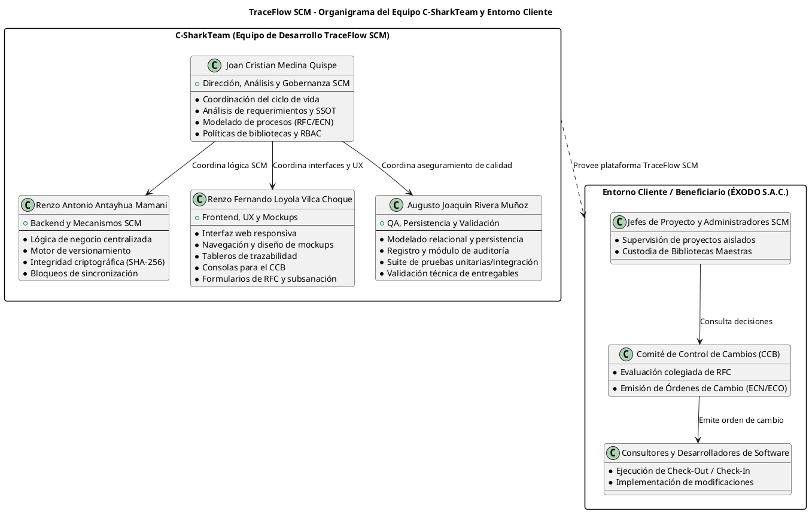
```plantuml
@startuml
skinparam shadowing false
skinparam roundcorner 8
skinparam defaultFontName Arial
skinparam packageStyle rectangle

title <b>TraceFlow SCM - Organigrama del Equipo C-SharkTeam y Entorno Cliente</b>

package "C-SharkTeam (Equipo de Desarrollo TraceFlow SCM)" as DEV {
    class "Joan Cristian Medina Quispe" as JCM {
        + Dirección, Análisis y Gobernanza SCM
        --
        * Coordinación del ciclo de vida
        * Análisis de requerimientos y SSOT
        * Modelado de procesos (RFC/ECN)
        * Políticas de bibliotecas y RBAC
    }

    class "Renzo Antonio Antayhua Mamani" as RAA {
        + Backend y Mecanismos SCM
        --
        * Lógica de negocio centralizada
        * Motor de versionamiento
        * Integridad criptográfica (SHA-256)
        * Bloqueos de sincronización
    }

    class "Renzo Fernando Loyola Vilca Choque" as RFL {
        + Frontend, UX y Mockups
        --
        * Interfaz web responsiva
        * Navegación y diseño de mockups
        * Tableros de trazabilidad
        * Consolas para el CCB
        * Formularios de RFC y subsanación
    }

    class "Augusto Joaquin Rivera Muñoz" as AJR {
        + QA, Persistencia y Validación
        --
        * Modelado relacional y persistencia
        * Registro y módulo de auditoría
        * Suite de pruebas unitarias/integración
        * Validación técnica de entregables
    }

    JCM --> RAA : Coordina lógica SCM
    JCM --> RFL : Coordina interfaces y UX
    JCM --> AJR : Coordina aseguramiento de calidad
}

package "Entorno Cliente / Beneficiario (ÉXODO S.A.C.)" as CLIENT {
    class "Jefes de Proyecto y Administradores SCM" as ADM {
        * Supervisión de proyectos aislados
        * Custodia de Bibliotecas Maestras
    }

    class "Comité de Control de Cambios (CCB)" as CCB {
        * Evaluación colegiada de RFC
        * Emisión de Órdenes de Cambio (ECN/ECO)
    }

    class "Consultores y Desarrolladores de Software" as DEV_CLI {
        * Ejecución de Check-Out / Check-In
        * Implementación de modificaciones
    }

    ADM --> CCB : Consulta decisiones
    CCB --> DEV_CLI : Emite orden de cambio
}

DEV ..> CLIENT : Provee plataforma TraceFlow SCM
@enduml
```

---

# DG-02 — Diagrama de Actividades del Proceso Actual (AS-IS)

**ID:** DG-02  
**Nombre:** Diagrama de Actividades del Proceso Empírico Actual (AS-IS) de ÉXODO S.A.C.  
**Tipo:** Actividades  
**Estado:** REVISION  
**Versión:** 1.0  
**RF relacionados:** N/A (Diagnóstico inicial)  
**RN relacionadas:** N/A  
**CU relacionados:** N/A  
**Fuente:** `FD03-EPIS-Informe_SRS.md`, Sección 3.6 (Pág. 17) y Sección 4.1 (Pág. 17)  

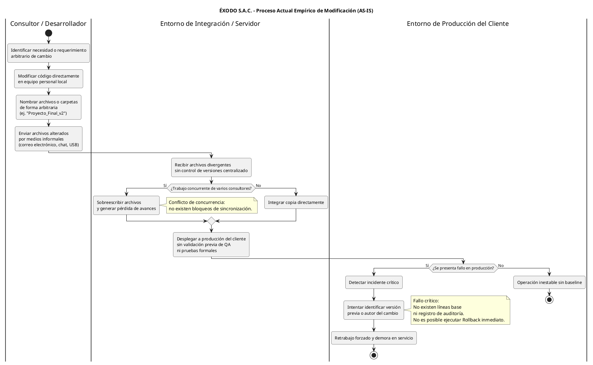
```plantuml
@startuml
skinparam shadowing false
skinparam roundcorner 8
skinparam defaultFontName Arial
skinparam ActivityMaxWidth 220
skinparam conditionStyle inside

title <b>ÉXODO S.A.C. - Proceso Actual Empírico de Modificación (AS-IS)</b>

|Consultor / Desarrollador|
start
:Identificar necesidad o requerimiento
arbitrario de cambio;

:Modificar código directamente
en equipo personal local;

:Nombrar archivos o carpetas
de forma arbitraria
(ej. "Proyecto_Final_v2");

:Enviar archivos alterados
por medios informales
(correo electrónico, chat, USB);

|Entorno de Integración / Servidor|
:Recibir archivos divergentes
sin control de versiones centralizado;

if (¿Trabajo concurrente de varios consultores?) then (Sí)
    :Sobreescribir archivos
    y generar pérdida de avances;
    note right
        Conflicto de concurrencia:
        no existen bloqueos de sincronización.
    end note
else (No)
    :Integrar copia directamente;
endif

:Desplegar a producción del cliente
sin validación previa de QA
ni pruebas formales;

|Entorno de Producción del Cliente|
if (¿Se presenta fallo en producción?) then (Sí)
    :Detectar incidente crítico;
    
    :Intentar identificar versión
    previa o autor del cambio;
    
    note right
        Fallo crítico:
        No existen líneas base
        ni registro de auditoría.
        No es posible ejecutar Rollback inmediato.
    end note
    
    :Retrabajo forzado y demora en servicio;
    stop
else (No)
    :Operación inestable sin baseline;
    stop
endif
@enduml
```

---

# DG-03 — Diagrama del Proceso Propuesto de Gestión de Cambios (TO-BE v2)

**ID:** DG-03  
**Nombre:** Proceso de Gestión de Cambios de Elementos de Configuración (TraceFlow SCM - TO-BE v2)  
**Tipo:** Actividades con Calles (Swimlanes)  
**Estado:** APROBADO  
**Versión:** 2.0  
**RF relacionados:** RF-04, RF-05, RF-06, RF-07, RF-08, RF-09, RF-10, RF-11, RF-12, RF-13, RF-14, RF-16, RF-17  
**RN relacionadas:** RN-01, RN-02, RN-03, RN-04, RN-05, RN-06, RN-07, RN-08, RN-09  
**CU relacionados:** CU-04, CU-05, CU-06, CU-07, CU-08, CU-10, CU-11, CU-12, CU-14, CU-15, CU-16, CU-17, CU-18, CU-19, CU-20, CU-21, CU-22, CU-29, CU-30  
**Fuente:** `FD03-EPIS-Informe_SRS.md`, Sección 4.2 y actualización TO-BE v2  

```plantuml
@startuml
title <b>TraceFlow SCM - Proceso de Gestión de Cambios de Elementos de Configuración (TO-BE v2)</b>

' =========================================================
' CONFIGURACIÓN GENERAL
' =========================================================
skinparam ActivityMaxWidth 220
skinparam ranksep 22
skinparam nodesep 18
skinparam defaultFontName Arial
skinparam defaultFontSize 11
skinparam roundCorner 8
skinparam shadowing false
skinparam conditionStyle inside

skinparam arrowColor #2C3E50
skinparam arrowThickness 1.2
skinparam swimlaneBorderColor #7F8C8D
skinparam swimlaneBorderThickness 1.2

skinparam activity {
    BackgroundColor #FFFFFF
    BorderColor #34495E
    BorderThickness 1.2
    FontColor #2C3E50
}

skinparam note {
    BackgroundColor #FFFDE7
    BorderColor #FBC02D
    FontSize 10
}

' =========================================================
' ACTORES / SWIMLANES CANÓNICOS
' =========================================================
|#E8F4F8|Solicitante|
|#EBF5FB|Analista de Requerimientos / Gestor|
|#E8F8F5|Arquitecto / Especialista Técnico|
|#FEF9E7|Comité de Control de Cambios (CCB)|
|#F5EEF8|Administrador de Configuración / Bibliotecario|
|#EAEDED|Ingeniero de Software / Desarrollador|
|#FDEDEC|Equipo de Calidad / Testing|

' =========================================================
' FASE 1 - REGISTRO DE LA RFC
' =========================================================
|Solicitante|
start
:<color:white><b>FASE 1\nRegistro de Solicitud de Cambio (RFC)</b></color>; <<#34495E>>

:Identificar necesidad o defecto;

:Registrar RFC con justificación,
prioridad y ECS afectado (CU-04);

note left
<b>RFC [Estado: Registrada]</b>
- Descripción de necesidad
- Justificación de negocio
- Nivel de prioridad inicial
- ECS y versión base afectada
end note

' =========================================================
' FASE 2 - VALIDACIÓN Y CLASIFICACIÓN INICIAL
' =========================================================
|Analista de Requerimientos / Gestor|
:<color:white><b>FASE 2\nValidación y Clasificación Inicial</b></color>; <<#34495E>>

:Recepcionar y evaluar completitud
de la RFC (CU-05);

if (¿Información suficiente y consistente?) then (No)
    :Registrar observaciones (CU-05);
    note right: RFC pasa a [En Subsanación]

    |Solicitante|
    if (¿Solicitante subsana dentro del plazo?) then (Sí)
        :Subsanar información requerida;
        |Analista de Requerimientos / Gestor|
        :Reevaluar información subsanada;
    else (No)
        |Analista de Requerimientos / Gestor|
        :Emitir dictamen de no conformidad
        inicial y desestimar solicitud;
        
        |Solicitante|
        :Recibir notificación de desestimación;
        note left
            <b>Estado Terminal 1:</b>
            <b>DESESTIMADA</b>
            (Filtro inicial no superado)
        end note
        stop
    endif
endif

|Analista de Requerimientos / Gestor|
:Validar consistencia de la RFC;
note right: RFC pasa a [Clasificada]

' =========================================================
' FASE 3 - ANÁLISIS DE IMPACTO TÉCNICO
' =========================================================
|Arquitecto / Especialista Técnico|
:<color:white><b>FASE 3\nAnálisis de Impacto Técnico</b></color>; <<#34495E>>
note right: RFC pasa a [En Análisis Técnico]

:Analizar impacto sobre arquitectura,
dependencias y trazabilidad (CU-06);

:Evaluar afectación a la Triple Restricción
(Alcance, Tiempo y Costo);

:Elaborar Informe Técnico de Impacto (CU-06);

if (¿Afecta alcance, tiempo o costo?) then (Sí)
    :Clasificar como <b>CAMBIO MAYOR</b>;
    note right
        <b>Criterio Normativo:</b>
        Afecta al menos 1 dimensión
        de la Triple Restricción.
        Requiere aprobación del CCB.
    end note
    
    ' =========================================================
    ' FASE 4A - EVALUACIÓN COLEGIADA CCB (CAMBIO MAYOR)
    ' =========================================================
    |Comité de Control de Cambios (CCB)|
    :<color:white><b>FASE 4A\nEvaluación Colegiada en CCB (Cambio Mayor)</b></color>; <<#34495E>>
    note right: RFC pasa a [En Evaluación]

    :Evaluar Informe Técnico, riesgos,
    viabilidad y conveniencia (CU-07);

    if (¿Cambio Mayor Aprobado por CCB?) then (Sí)
        :Aprobar formalmente el cambio (CU-07);
        note right: RFC pasa a [Autorizada]

        :Emitir Orden de Cambio
        formal (ECN / ECO) (CU-08);
        note right: RFC pasa a [Orden Emitida]
    else (No)
        :Registrar dictamen formal
        de rechazo (técnico o de gestión);

        |Solicitante|
        :Recibir notificación con fundamentación;
        note left
            <b>Estado Terminal 2:</b>
            <b>RECHAZADA</b>
            (Dictamen formal negativo del CCB)
        end note
        stop
    endif

else (No)
    :Clasificar como <b>CAMBIO MENOR</b>;
    note right
        <b>Criterio Normativo:</b>
        NO afecta alcance, tiempo ni costo.
        Ruta operativa delegada sin CCB.
    end note

    ' =========================================================
    ' FASE 4B - AUTORIZACIÓN OPERATIVA DELEGADA (CAMBIO MENOR)
    ' =========================================================
    |Analista de Requerimientos / Gestor|
    :<color:white><b>FASE 4B\nAutorización Operativa Delegada (Cambio Menor)</b></color>; <<#34495E>>
    note right: RFC pasa a [En Evaluación]

    :Revisar impacto operativo del Cambio Menor (CU-30);

    |Arquitecto / Especialista Técnico|
    :Revisar viabilidad técnica del Cambio Menor (CU-30);

    if (¿Conformidad de ambas autoridades delegadas?) then (Sí)
        :Autorizar Cambio Menor conjuntamente (CU-30);
        note right: RFC pasa a [Autorizada]

        :Emitir Orden de Cambio (ECN/ECO)
        bajo autoridad operativa delegada (CU-08/CU-30);
        note right: RFC pasa a [Orden Emitida]
    else (No)
        :Registrar dictamen de no autorización;

        |Solicitante|
        :Recibir notificación de rechazo operativo;
        note left
            <b>Estado Terminal 2:</b>
            <b>RECHAZADA</b>
            (Rechazo bajo autoridad delegada)
        end note
        stop
    endif
endif

' =========================================================
' FASE 5 - CHECK-OUT Y CONTROL DE CONCURRENCIA
' =========================================================
|Administrador de Configuración / Bibliotecario|
:<color:white><b>FASE 5\nCheck-Out y Bloqueo de Sincronización</b></color>; <<#34495E>>

:Verificar validez formal de la ECN/ECO;

:Efectuar Check-Out del ECS desde
Biblioteca de Soporte hacia Trabajo (CU-10);

:Aplicar bloqueo de sincronización
exclusivo sobre el ECS (CU-11);
note right: RFC pasa a [En Implementación]

' =========================================================
' FASE 6 - IMPLEMENTACIÓN Y PRUEBAS UNITARIAS
' =========================================================
|Ingeniero de Software / Desarrollador|
:<color:white><b>FASE 6\nImplementación y Pruebas Unitarias</b></color>; <<#34495E>>

:Recibir ECN/ECO y espacio en
Biblioteca de Trabajo;

:Modificar ECS según especificación (CU-14);

:Ejecutar pruebas unitarias locales (CU-15);

if (¿Pruebas unitarias conformes?) then (No)
    :Corregir defectos en código local;
    :Reejecutar pruebas unitarias locales;
endif

:Poner ECS a disposición para validación QA;

' =========================================================
' FASE 7 - VALIDACIÓN TÉCNICA DE CALIDAD (QA)
' =========================================================
|Equipo de Calidad / Testing|
:<color:white><b>FASE 7\nValidación Técnica de Calidad (QA)</b></color>; <<#34495E>>
note right: RFC pasa a [En Pruebas]

:Ejecutar pruebas de integración
y verificación técnica funcional (CU-16);

if (¿Defectos o no conformidades identificadas?) then (Sí)
    :Registrar reporte de no conformidad (CU-18);

    |Ingeniero de Software / Desarrollador|
    :Corregir defectos reportados;

    |Equipo de Calidad / Testing|
    :Reevaluar y re-testear (CU-19);

    if (¿Fallo técnico no subsanado?) then (Sí)
        |Administrador de Configuración / Bibliotecario|
        :Ejecutar Rollback en Biblioteca de Trabajo (CU-21);
        :Liberar bloqueo de sincronización;
        :Cancelar Orden de Cambio (ECN/ECO) (CU-22);

        |Solicitante|
        :Recibir notificación de cancelación;
        note left
            <b>Estado Terminal 3:</b>
            <b>CANCELADA</b>
            (Rollback por fallo no subsanado)
        end note
        stop
    endif
endif

|Equipo de Calidad / Testing|
:Emitir Certificación Técnica
de Conformidad (CU-17);

' =========================================================
' FASE 8 - VALIDACIÓN Y ACEPTACIÓN POR EL USUARIO (UAT)
' =========================================================
|Solicitante|
:<color:white><b>FASE 8\nValidación y Aceptación por el Usuario (UAT)</b></color>; <<#34495E>>
note left: RFC pasa a [En Aceptación]

:Ejecutar pruebas de aceptación en
entorno de validación (CU-29);

if (¿Comportamiento y necesidad plenamente conformes?) then (No)
    :Registrar observaciones de aceptación;
    |Ingeniero de Software / Desarrollador|
    :Ajustar implementación según observaciones;
    |Equipo de Calidad / Testing|
    :Revalidar técnicamente la corrección;
    |Solicitante|
    :Reejecutar pruebas de aceptación (CU-29);
endif

:Emitir y suscribir Aceptación
Formal del Usuario (CU-29);

' =========================================================
' FASE 9 - CHECK-IN, LÍNEA BASE Y DESBLOQUEO
' =========================================================
|Administrador de Configuración / Bibliotecario|
:<color:white><b>FASE 9\nCheck-In, Nueva Línea Base y Desbloqueo</b></color>; <<#34495E>>

:Verificar Certificación QA y Aceptación UAT;

:Efectuar Check-In del ECS hacia
Biblioteca Maestra y de Soporte (CU-12);

:Registrar nueva versión identificada unívocamente;

:Crear y congelar nueva Línea Base (CU-20);

:Liberar bloqueo de sincronización del ECS;

:Actualizar catálogo e inventario de configuración;

' =========================================================
' FASE 10 - CIERRE FORMAL Y NOTIFICACIÓN
' =========================================================
|Comité de Control de Cambios (CCB)|
:<color:white><b>FASE 10\nCierre Formal Administrativo</b></color>; <<#34495E>>

:Registrar cierre administrativo formal (RF-14);

:Consolidar trazabilidad completa
(RFC - ECN/ECO - ECS - QA - UAT - Baseline);

|Solicitante|
:Recibir notificación de cambio implementado y cerrado;

note left
    <b>Estado Terminal 4:</b>
    <b>IMPLEMENTADA</b>
    (Cambio validado, promovido a Maestra,
    congelado en Baseline y cerrado formalmente)
end note

stop
@enduml
```

---

# DG-04 — Diagrama de Paquetes Arquitecturales

**ID:** DG-04  
**Nombre:** Diagrama de Paquetes Arquitecturales de TraceFlow SCM  
**Tipo:** Paquetes  
**Estado:** APROBADO  
**Versión:** 1.1  
**RF relacionados:** RF-01 a RF-18  
**RN relacionadas:** RN-01 a RN-09  
**CU relacionados:** CU-01 a CU-30  
**Fuente:** `FD03-EPIS-Informe_SRS.md`, Sección 6.1.1 (Págs. 31-32) y actualización TO-BE v2  

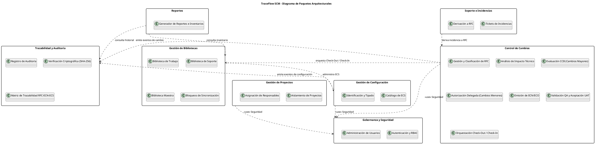
```plantuml
@startuml
skinparam shadowing false
skinparam roundcorner 8
skinparam defaultFontName Arial
skinparam packageStyle rectangle

title <b>TraceFlow SCM - Diagrama de Paquetes Arquitecturales</b>

package "Gobernanza y Seguridad" as PKG_GOB {
    class "Autenticación y RBAC" as MOD_RBAC
    class "Administración de Usuarios" as MOD_USER
}

package "Gestión de Proyectos" as PKG_PROJ {
    class "Aislamiento de Proyectos" as MOD_PROJ
    class "Asignación de Responsables" as MOD_RESP
}

package "Gestión de Configuración" as PKG_ECS {
    class "Catálogo de ECS" as MOD_ECS
    class "Identificación y Tipado" as MOD_TYPE
}

package "Gestión de Bibliotecas" as PKG_LIB {
    class "Biblioteca de Trabajo" as LIB_WRK
    class "Biblioteca de Soporte" as LIB_SUP
    class "Biblioteca Maestra" as LIB_MST
    class "Bloqueos de Sincronización" as MOD_LOCK
}

package "Control de Cambios" as PKG_CHG {
    class "Gestión y Clasificación de RFC" as MOD_RFC
    class "Análisis de Impacto Técnico" as MOD_IMP
    class "Evaluación CCB (Cambios Mayores)" as MOD_CCB
    class "Autorización Delegada (Cambios Menores)" as MOD_AUTH_MIN
    class "Emisión de ECN/ECO" as MOD_ECN
    class "Validación QA y Aceptación UAT" as MOD_QA_UAT
    class "Orquestación Check-Out / Check-In" as MOD_ORQ
}

package "Soporte e Incidencias" as PKG_SUPP {
    class "Tickets de Incidencias" as MOD_TCK
    class "Derivación a RFC" as MOD_DERIV
}

package "Trazabilidad y Auditoría" as PKG_AUD {
    class "Registro de Auditoría" as MOD_LOG
    class "Verificación Criptográfica (SHA-256)" as MOD_SHA
    class "Matriz de Trazabilidad RFC-ECN-ECS" as MOD_TRAC
}

package "Reportes" as PKG_REP {
    class "Generador de Reportes e Inventarios" as MOD_RPT
}

' Relaciones de dependencia descritas en la sección 6.1.1 del SRS
PKG_PROJ ..> PKG_GOB : <<use>> Seguridad
PKG_ECS ..> PKG_GOB : <<use>> Seguridad
PKG_CHG ..> PKG_GOB : <<use>> Seguridad

PKG_LIB ..> PKG_ECS : administra ECS
PKG_CHG ..> PKG_LIB : orquesta Check-Out / Check-In

PKG_SUPP ..> PKG_CHG : deriva incidencia a RFC
PKG_AUD <.. PKG_CHG : emite eventos de cambio
PKG_AUD <.. PKG_ECS : emite eventos de configuración

PKG_REP ..> PKG_AUD : consulta historial
PKG_REP ..> PKG_LIB : consulta inventario
@enduml
```

---

# DG-05 — Diagrama General de Casos de Uso

**ID:** DG-05  
**Nombre:** Diagrama General de Casos de Uso del Sistema TraceFlow SCM  
**Tipo:** Casos de Uso  
**Estado:** APROBADO  
**Versión:** 1.1  
**RF relacionados:** RF-01 a RF-18  
**RN relacionadas:** RN-01 a RN-09  
**CU relacionados:** CU-01 a CU-30  
**Fuente:** `FD03-EPIS-Informe_SRS.md`, Sección 6.1.2 (Pág. 33), `TB-10` y actualización TO-BE v2  

```plantuml
@startuml
skinparam shadowing false
skinparam roundcorner 8
skinparam defaultFontName Arial
left to right direction

title <b>TraceFlow SCM - Diagrama General de Casos de Uso</b>

' =========================================================
' ACTORES CANÓNICOS
' =========================================================
actor "Solicitante" as ACT_SOL
actor "Analista de Requerimientos / Gestor" as ACT_ANA
actor "Arquitecto / Especialista Técnico" as ACT_ARQ
actor "Comité de Control de Cambios (CCB)" as ACT_CCB
actor "Administrador de Configuración / Bibliotecario" as ACT_ADM
actor "Ingeniero de Software / Desarrollador" as ACT_DEV
actor "Equipo de Calidad / Testing" as ACT_QA

' =========================================================
' PAQUETES FUNCIONALES
' =========================================================
rectangle "TraceFlow SCM" {
    package "Gestión de Usuarios y Proyectos" {
        usecase "CU-01: Gestionar usuarios y roles" as UC01
        usecase "CU-02: Crear y administrar proyectos" as UC02
        usecase "CU-03: Consultar proyecto" as UC03
    }

    package "Registro y Evaluación de la RFC" {
        usecase "CU-04: Registrar Solicitud de Cambio (RFC)" as UC04
        usecase "CU-05: Validar y clasificar la solicitud" as UC05
        usecase "CU-06: Realizar análisis de impacto técnico" as UC06
        usecase "CU-07: Evaluar viabilidad y aprobar/rechazar" as UC07
        usecase "CU-08: Emitir Orden de Cambio (ECN/ECO)" as UC08
        usecase "CU-30: Autorizar Cambio Menor" as UC30
    }

    package "Gestión de ECS y Bibliotecas" {
        usecase "CU-09: Registrar ECS" as UC09
        usecase "CU-10: Efectuar Check-Out (Soporte → Trabajo)" as UC10
        usecase "CU-11: Aplicar bloqueo de sincronización" as UC11
        usecase "CU-12: Efectuar Check-In (Trabajo → Maestra/Soporte)" as UC12
        usecase "CU-13: Consultar historial de versiones" as UC13
    }

    package "Implementación y Validación" {
        usecase "CU-14: Implementar cambio en el ECS" as UC14
        usecase "CU-15: Ejecutar pruebas unitarias locales" as UC15
        usecase "CU-16: Ejecutar pruebas de integración" as UC16
        usecase "CU-17: Certificar conformidad del cambio" as UC17
        usecase "CU-18: Reportar no conformidad" as UC18
        usecase "CU-19: Reevaluar y re-testear" as UC19
        usecase "CU-29: Validar aceptación del cambio por el usuario (UAT)" as UC29
    }

    package "Líneas Base y Rollback" {
        usecase "CU-20: Crear y congelar línea base" as UC20
        usecase "CU-21: Ejecutar rollback en Biblioteca de Trabajo" as UC21
        usecase "CU-22: Cancelar Orden de Cambio" as UC22
    }

    package "Incidencias, Trazabilidad y Reportes" {
        usecase "CU-23: Registrar incidencia" as UC23
        usecase "CU-24: Consultar estado de ticket" as UC24
        usecase "CU-25: Derivar incidencia a RFC" as UC25
        usecase "CU-26: Validar integridad (checksum)" as UC26
        usecase "CU-27: Auditar acciones del sistema" as UC27
        usecase "CU-28: Generar reportes de estado" as UC28
    }
}

' Asociaciones Principales
ACT_ADM --> UC01
ACT_ANA --> UC02
ACT_ANA --> UC03

ACT_SOL --> UC04
ACT_ANA --> UC05
ACT_ARQ --> UC06
ACT_CCB --> UC07
ACT_CCB --> UC08

ACT_ANA --> UC30
ACT_ARQ --> UC30

ACT_ARQ --> UC09
ACT_ADM --> UC10
ACT_ADM --> UC11
ACT_ADM --> UC12
ACT_ADM --> UC13

ACT_DEV --> UC14
ACT_DEV --> UC15
ACT_QA --> UC16
ACT_QA --> UC17
ACT_QA --> UC18
ACT_QA --> UC19
ACT_SOL --> UC29

ACT_ADM --> UC20
ACT_ADM --> UC21
ACT_ADM --> UC22

ACT_SOL --> UC23
ACT_SOL --> UC24
ACT_ANA --> UC25
ACT_ADM --> UC26
ACT_CCB --> UC27
ACT_ADM --> UC28
@enduml
```

---

# DG-06 — Casos de Uso: Administración de Usuarios y Proyectos

**ID:** DG-06  
**Nombre:** Diagrama de Casos de Uso - Administración de Usuarios y Proyectos  
**Tipo:** Casos de Uso Específico  
**Estado:** APROBADO  
**Versión:** 1.0  
**RF relacionados:** RF-01, RF-02  
**RN relacionadas:** N/A  
**CU relacionados:** CU-01, CU-02, CU-03  
**Fuente:** `FD03-EPIS-Informe_SRS.md`, Sección 6.1.2 (Pág. 34)  

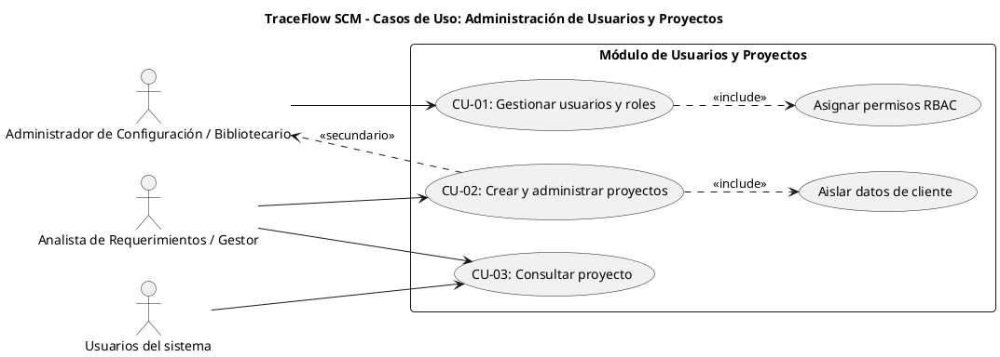
```plantuml
@startuml
skinparam shadowing false
skinparam roundcorner 8
skinparam defaultFontName Arial
left to right direction

title <b>TraceFlow SCM - Casos de Uso: Administración de Usuarios y Proyectos</b>

actor "Administrador de Configuración / Bibliotecario" as ACT_ADM
actor "Analista de Requerimientos / Gestor" as ACT_ANA
actor "Usuarios del sistema" as ACT_USR

rectangle "Módulo de Usuarios y Proyectos" {
    usecase "CU-01: Gestionar usuarios y roles" as UC01
    usecase "CU-02: Crear y administrar proyectos" as UC02
    usecase "CU-03: Consultar proyecto" as UC03

    usecase "Asignar permisos RBAC" as UC_RBAC
    usecase "Aislar datos de cliente" as UC_ISOLATE
}

ACT_ADM --> UC01
UC01 ..> UC_RBAC : <<include>>

ACT_ANA --> UC02
ACT_ANA --> UC03
ACT_USR --> UC03

UC02 ..> UC_ISOLATE : <<include>>
UC02 ..> ACT_ADM : <<secundario>>
@enduml
```

---

# DG-07 — Casos de Uso: Registro y Evaluación de RFC e Incidencias

**ID:** DG-07  
**Nombre:** Diagrama de Casos de Uso - Registro y Evaluación de RFC e Incidencias  
**Tipo:** Casos de Uso Específico  
**Estado:** APROBADO  
**Versión:** 1.1  
**RF relacionados:** RF-04, RF-05, RF-06, RF-07, RF-15  
**RN relacionadas:** RN-01, RN-05, RN-07  
**CU relacionados:** CU-04, CU-05, CU-06, CU-07, CU-08, CU-23, CU-24, CU-25, CU-30  
**Fuente:** `FD03-EPIS-Informe_SRS.md`, Sección 6.1.2 (Pág. 34) y actualización TO-BE v2  

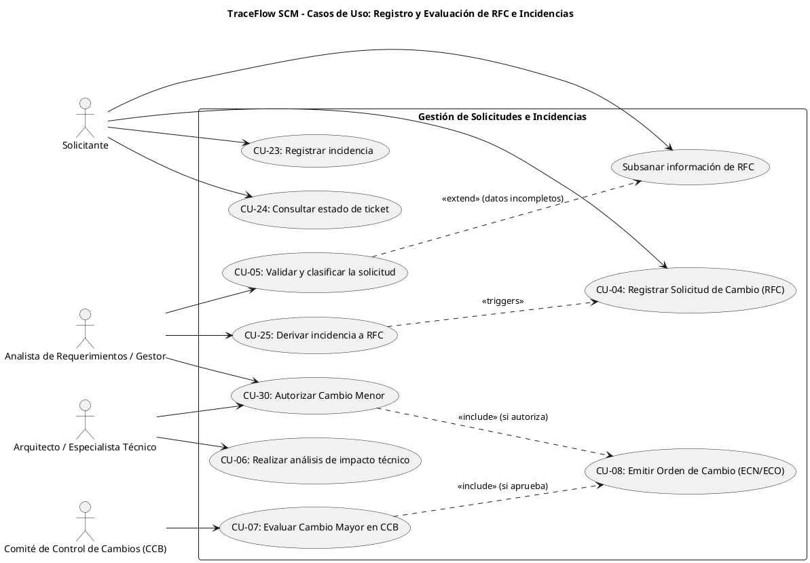
```plantuml
@startuml
skinparam shadowing false
skinparam roundcorner 8
skinparam defaultFontName Arial
left to right direction

title <b>TraceFlow SCM - Casos de Uso: Registro y Evaluación de RFC e Incidencias</b>

actor "Solicitante" as ACT_SOL
actor "Analista de Requerimientos / Gestor" as ACT_ANA
actor "Arquitecto / Especialista Técnico" as ACT_ARQ
actor "Comité de Control de Cambios (CCB)" as ACT_CCB

rectangle "Gestión de Solicitudes e Incidencias" {
    usecase "CU-23: Registrar incidencia" as UC23
    usecase "CU-24: Consultar estado de ticket" as UC24
    usecase "CU-25: Derivar incidencia a RFC" as UC25

    usecase "CU-04: Registrar Solicitud de Cambio (RFC)" as UC04
    usecase "CU-05: Validar y clasificar la solicitud" as UC05
    usecase "CU-06: Realizar análisis de impacto técnico" as UC06
    usecase "CU-07: Evaluar Cambio Mayor en CCB" as UC07
    usecase "CU-30: Autorizar Cambio Menor" as UC30
    usecase "CU-08: Emitir Orden de Cambio (ECN/ECO)" as UC08

    usecase "Subsanar información de RFC" as UC_SUBSANAR
}

ACT_SOL --> UC23
ACT_SOL --> UC24
ACT_ANA --> UC25

UC25 ..> UC04 : <<triggers>>

ACT_SOL --> UC04
ACT_ANA --> UC05
UC05 ..> UC_SUBSANAR : <<extend>> (datos incompletos)
ACT_SOL --> UC_SUBSANAR

ACT_ARQ --> UC06

' Evaluación y Decisión: Ruta Mayor (CCB) vs Menor (Delegada)
ACT_CCB --> UC07
UC07 ..> UC08 : <<include>> (si aprueba)

ACT_ANA --> UC30
ACT_ARQ --> UC30
UC30 ..> UC08 : <<include>> (si autoriza)
@enduml
```

---

# DG-08 — Casos de Uso: SCM Core (ECS, Bibliotecas y Líneas Base)

**ID:** DG-08  
**Nombre:** Diagrama de Casos de Uso - SCM Core (Gestión de ECS, Bibliotecas y Líneas Base)  
**Tipo:** Casos de Uso Específico  
**Estado:** APROBADO  
**Versión:** 1.0  
**RF relacionados:** RF-03, RF-08, RF-09, RF-12, RF-13, RF-14  
**RN relacionadas:** RN-02, RN-03, RN-04, RN-06, RN-07, RN-08  
**CU relacionados:** CU-09, CU-10, CU-11, CU-12, CU-13, CU-20, CU-21, CU-22  
**Fuente:** `FD03-EPIS-Informe_SRS.md`, Sección 6.1.2 (Pág. 35)  

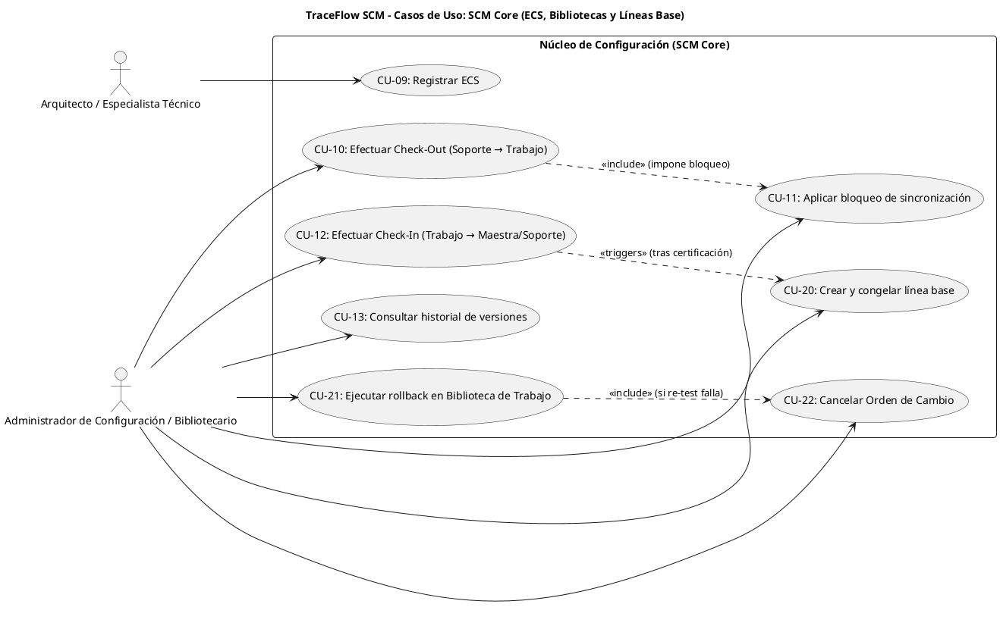
```plantuml
@startuml
skinparam shadowing false
skinparam roundcorner 8
skinparam defaultFontName Arial
left to right direction

title <b>TraceFlow SCM - Casos de Uso: SCM Core (ECS, Bibliotecas y Líneas Base)</b>

actor "Arquitecto / Especialista Técnico" as ACT_ARQ
actor "Administrador de Configuración / Bibliotecario" as ACT_ADM

rectangle "Núcleo de Configuración (SCM Core)" {
    usecase "CU-09: Registrar ECS" as UC09
    usecase "CU-10: Efectuar Check-Out (Soporte → Trabajo)" as UC10
    usecase "CU-11: Aplicar bloqueo de sincronización" as UC11
    usecase "CU-12: Efectuar Check-In (Trabajo → Maestra/Soporte)" as UC12
    usecase "CU-13: Consultar historial de versiones" as UC13
    usecase "CU-20: Crear y congelar línea base" as UC20
    usecase "CU-21: Ejecutar rollback en Biblioteca de Trabajo" as UC21
    usecase "CU-22: Cancelar Orden de Cambio" as UC22
}

ACT_ARQ --> UC09
ACT_ADM --> UC10
ACT_ADM --> UC11
ACT_ADM --> UC12
ACT_ADM --> UC13
ACT_ADM --> UC20
ACT_ADM --> UC21
ACT_ADM --> UC22

UC10 ..> UC11 : <<include>> (impone bloqueo)
UC12 ..> UC20 : <<triggers>> (tras certificación)
UC21 ..> UC22 : <<include>> (si re-test falla)
@enduml
```

---

# DG-09 — Casos de Uso: Implementación y Validación de Calidad

**ID:** DG-09  
**Nombre:** Diagrama de Casos de Uso - Implementación y Validación de la Calidad  
**Tipo:** Casos de Uso Específico  
**Estado:** APROBADO  
**Versión:** 1.1  
**RF relacionados:** RF-07, RF-09, RF-10, RF-11  
**RN relacionadas:** RN-08, RN-09  
**CU relacionados:** CU-14, CU-15, CU-16, CU-17, CU-18, CU-19, CU-29  
**Fuente:** `FD03-EPIS-Informe_SRS.md`, Sección 6.1.2 (Pág. 35) y actualización TO-BE v2  

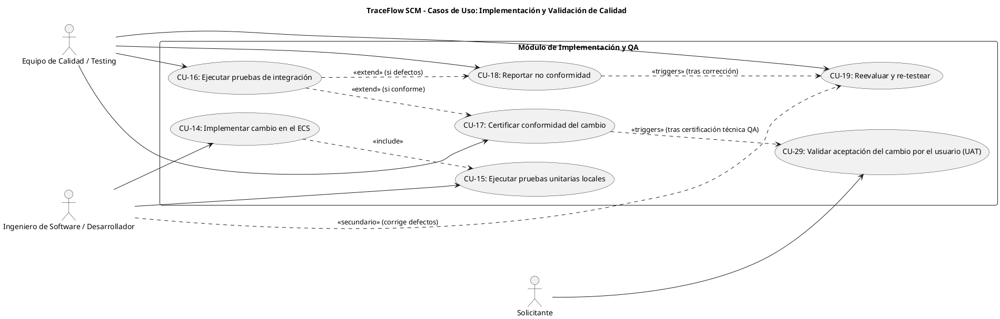
```plantuml
@startuml
skinparam shadowing false
skinparam roundcorner 8
skinparam defaultFontName Arial
left to right direction

title <b>TraceFlow SCM - Casos de Uso: Implementación y Validación de Calidad</b>

actor "Ingeniero de Software / Desarrollador" as ACT_DEV
actor "Equipo de Calidad / Testing" as ACT_QA
actor "Solicitante" as ACT_SOL

rectangle "Módulo de Implementación y QA" {
    usecase "CU-14: Implementar cambio en el ECS" as UC14
    usecase "CU-15: Ejecutar pruebas unitarias locales" as UC15
    usecase "CU-16: Ejecutar pruebas de integración" as UC16
    usecase "CU-17: Certificar conformidad del cambio" as UC17
    usecase "CU-18: Reportar no conformidad" as UC18
    usecase "CU-19: Reevaluar y re-testear" as UC19
    usecase "CU-29: Validar aceptación del cambio por el usuario (UAT)" as UC29
}

ACT_DEV --> UC14
ACT_DEV --> UC15
UC14 ..> UC15 : <<include>>

ACT_QA --> UC16
ACT_QA --> UC17
ACT_QA --> UC18
ACT_QA --> UC19

UC16 ..> UC17 : <<extend>> (si conforme)
UC16 ..> UC18 : <<extend>> (si defectos)
UC18 ..> UC19 : <<triggers>> (tras corrección)
ACT_DEV ..> UC19 : <<secundario>> (corrige defectos)

' Validación UAT del Solicitante / Usuario Final
ACT_SOL --> UC29
UC17 ..> UC29 : <<triggers>> (tras certificación técnica QA)
@enduml
```

---

# DG-10 — Casos de Uso: Trazabilidad, Auditoría e Integridad

**ID:** DG-10  
**Nombre:** Diagrama de Casos de Uso - Trazabilidad, Auditoría e Integridad  
**Tipo:** Casos de Uso Específico  
**Estado:** APROBADO  
**Versión:** 1.0  
**RF relacionados:** RF-16, RF-17, RF-18, RNF-03  
**RN relacionadas:** RN-02, RN-03  
**CU relacionados:** CU-26, CU-27, CU-28  
**Fuente:** `FD03-EPIS-Informe_SRS.md`, Sección 6.1.2 (Pág. 36)  

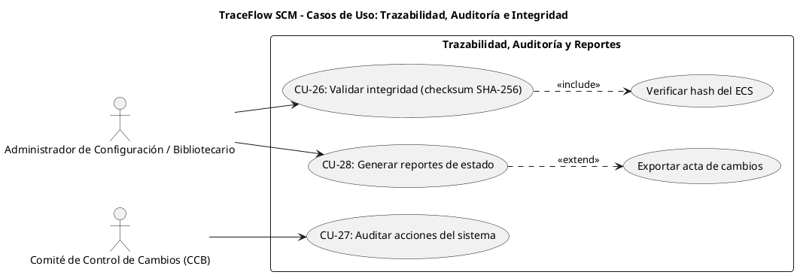
```plantuml
@startuml
skinparam shadowing false
skinparam roundcorner 8
skinparam defaultFontName Arial
left to right direction

title <b>TraceFlow SCM - Casos de Uso: Trazabilidad, Auditoría e Integridad</b>

actor "Administrador de Configuración / Bibliotecario" as ACT_ADM
actor "Comité de Control de Cambios (CCB)" as ACT_CCB

rectangle "Trazabilidad, Auditoría y Reportes" {
    usecase "CU-26: Validar integridad (checksum SHA-256)" as UC26
    usecase "CU-27: Auditar acciones del sistema" as UC27
    usecase "CU-28: Generar reportes de estado" as UC28

    usecase "Verificar hash del ECS" as UC_HASH
    usecase "Exportar acta de cambios" as UC_EXP
}

ACT_ADM --> UC26
ACT_CCB --> UC27
ACT_ADM --> UC28

UC26 ..> UC_HASH : <<include>>
UC28 ..> UC_EXP : <<extend>>
@enduml
```

---

# DG-11 — Diagrama de Estados del Ciclo de Vida de la RFC

**ID:** DG-11  
**Nombre:** Diagrama de Estados del Ciclo de Vida de una Solicitud de Cambio (RFC - 14 Estados Oficiales)  
**Tipo:** Máquina de Estados  
**Estado:** APROBADO  
**Versión:** 2.0  
**RF relacionados:** RF-04, RF-05, RF-06, RF-07, RF-08, RF-09, RF-10, RF-11, RF-12, RF-13, RF-14  
**RN relacionadas:** RN-01, RN-05, RN-07, RN-08, RN-09  
**CU relacionados:** CU-04, CU-05, CU-06, CU-07, CU-08, CU-10, CU-11, CU-12, CU-14, CU-15, CU-16, CU-17, CU-18, CU-19, CU-20, CU-21, CU-22, CU-29, CU-30  
**Fuente:** `FD03-EPIS-Informe_SRS.md`, Sección 5.3 (Págs. 26-27), `TB-07` y actualización TO-BE v2  

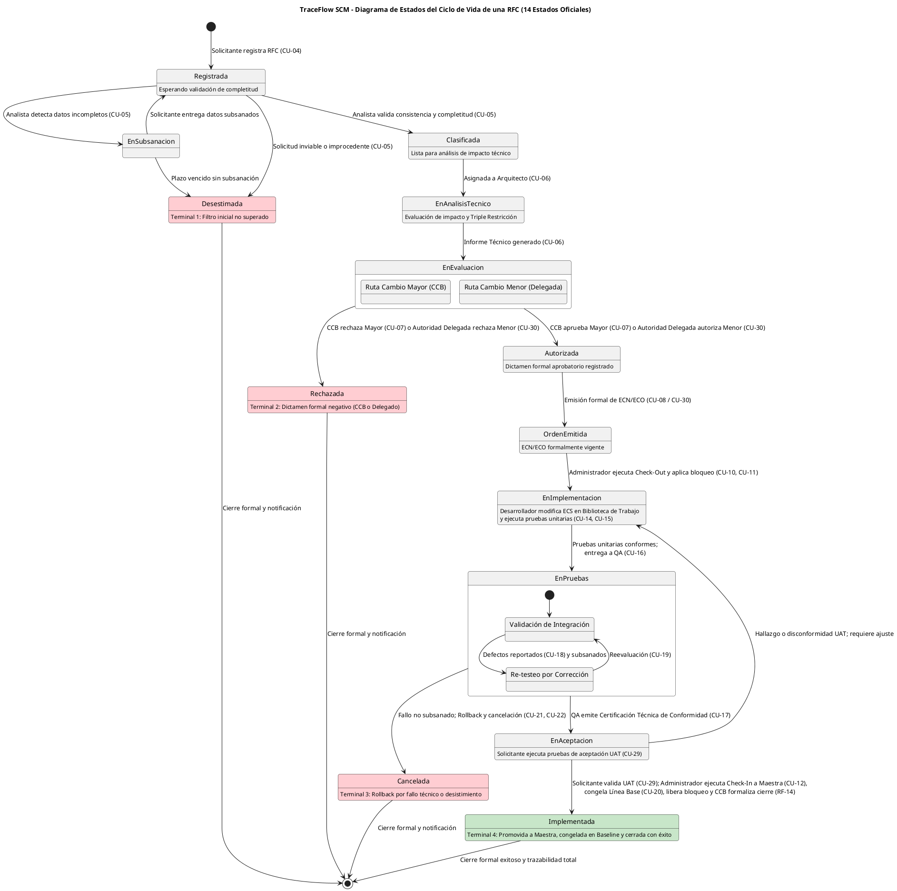
```plantuml
@startuml
skinparam shadowing false
skinparam roundcorner 8
skinparam defaultFontName Arial

title <b>TraceFlow SCM - Diagrama de Estados del Ciclo de Vida de una RFC (14 Estados Oficiales)</b>

[*] --> Registrada : Solicitante registra RFC (CU-04)

state Registrada {
    Registrada : Esperando validación de completitud
}

Registrada --> EnSubsanacion : Analista detecta datos incompletos (CU-05)
EnSubsanacion --> Registrada : Solicitante entrega datos subsanados
EnSubsanacion --> Desestimada : Plazo vencido sin subsanación

Registrada --> Clasificada : Analista valida consistencia y completitud (CU-05)
Registrada --> Desestimada : Solicitud inviable o improcedente (CU-05)

state Clasificada {
    Clasificada : Lista para análisis de impacto técnico
}

Clasificada --> EnAnalisisTecnico : Asignada a Arquitecto (CU-06)

state EnAnalisisTecnico {
    EnAnalisisTecnico : Evaluación de impacto y Triple Restricción
}

EnAnalisisTecnico --> EnEvaluacion : Informe Técnico generado (CU-06)

state EnEvaluacion {
    state "Ruta Cambio Mayor (CCB)" as S_MAYOR
    state "Ruta Cambio Menor (Delegada)" as S_MENOR
}

EnEvaluacion --> Rechazada : CCB rechaza Mayor (CU-07) o Autoridad Delegada rechaza Menor (CU-30)
EnEvaluacion --> Autorizada : CCB aprueba Mayor (CU-07) o Autoridad Delegada autoriza Menor (CU-30)

state Autorizada {
    Autorizada : Dictamen formal aprobatorio registrado
}

Autorizada --> OrdenEmitida : Emisión formal de ECN/ECO (CU-08 / CU-30)

state OrdenEmitida {
    OrdenEmitida : ECN/ECO formalmente vigente
}

OrdenEmitida --> EnImplementacion : Administrador ejecuta Check-Out y aplica bloqueo (CU-10, CU-11)

state EnImplementacion {
    EnImplementacion : Desarrollador modifica ECS en Biblioteca de Trabajo\ny ejecuta pruebas unitarias (CU-14, CU-15)
}

EnImplementacion --> EnPruebas : Pruebas unitarias conformes;\nentrega a QA (CU-16)

state EnPruebas {
    state "Validación de Integración" as S_INTEG
    state "Re-testeo por Corrección" as S_RETEST
    [*] --> S_INTEG
    S_INTEG --> S_RETEST : Defectos reportados (CU-18) y subsanados
    S_RETEST --> S_INTEG : Reevaluación (CU-19)
}

EnPruebas --> Cancelada : Fallo no subsanado; Rollback y cancelación (CU-21, CU-22)
EnPruebas --> EnAceptacion : QA emite Certificación Técnica de Conformidad (CU-17)

state EnAceptacion {
    EnAceptacion : Solicitante ejecuta pruebas de aceptación UAT (CU-29)
}

EnAceptacion --> EnImplementacion : Hallazgo o disconformidad UAT; requiere ajuste
EnAceptacion --> Implementada : Solicitante valida UAT (CU-29); Administrador ejecuta Check-In a Maestra (CU-12),\ncongela Línea Base (CU-20), libera bloqueo y CCB formaliza cierre (RF-14)

' =========================================================
' ESTADOS TERMINALES (4 Estados Normativos)
' =========================================================
state Desestimada #FFCDD2 {
    Desestimada : Terminal 1: Filtro inicial no superado
}

state Rechazada #FFCDD2 {
    Rechazada : Terminal 2: Dictamen formal negativo (CCB o Delegado)
}

state Cancelada #FFCDD2 {
    Cancelada : Terminal 3: Rollback por fallo técnico o desistimiento
}

state Implementada #C8E6C9 {
    Implementada : Terminal 4: Promovida a Maestra, congelada en Baseline y cerrada con éxito
}

Desestimada --> [*] : Cierre formal y notificación
Rechazada --> [*] : Cierre formal y notificación
Cancelada --> [*] : Cierre formal y notificación
Implementada --> [*] : Cierre formal exitoso y trazabilidad total
@enduml
```

---

---

# DG-12 — Diagrama de Clases del Dominio TraceFlow SCM

**ID:** DG-12 | **Tipo:** Clases | **Estado:** APROBADO | **Versión:** 1.0  
**RF:** RF-01 a RF-18 | **RN:** RN-01 a RN-09 | **CU:** CU-01 a CU-28 | **Fuente:** `FD03-EPIS-Informe_SRS.md`, Sección 6.2.2

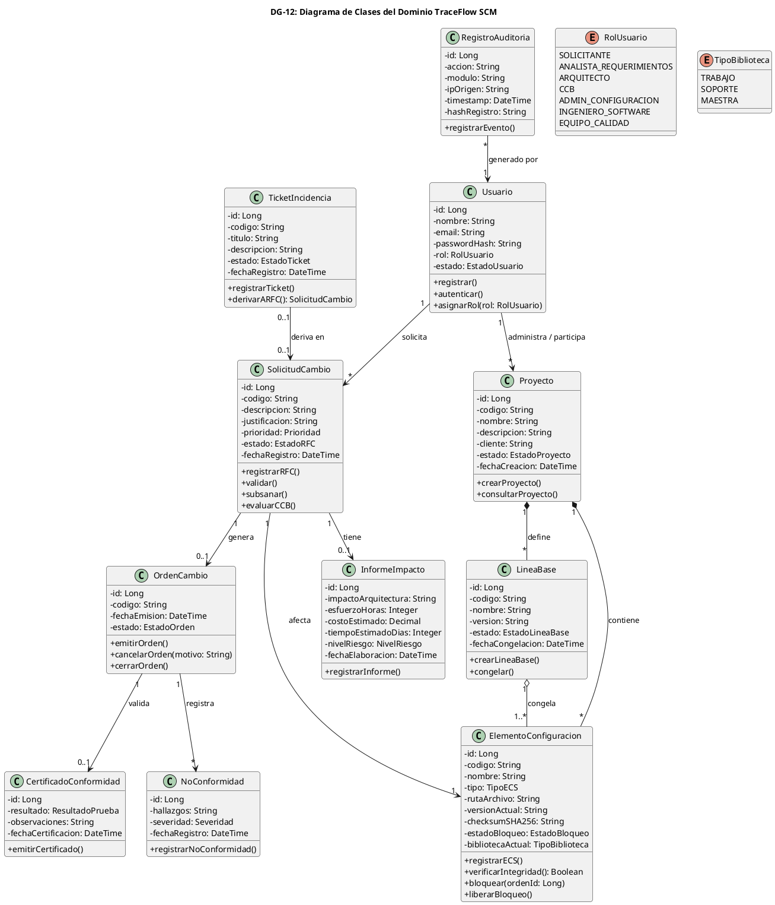
```plantuml
@startuml
skinparam shadowing false
skinparam roundcorner 8
skinparam defaultFontName Arial
skinparam classAttributeIconSize 0

title <b>DG-12: Diagrama de Clases del Dominio TraceFlow SCM</b>

class Usuario {
    - id: Long
    - nombre: String
    - email: String
    - passwordHash: String
    - rol: RolUsuario
    - estado: EstadoUsuario
    + registrar()
    + autenticar()
    + asignarRol(rol: RolUsuario)
}

enum RolUsuario {
    SOLICITANTE
    ANALISTA_REQUERIMIENTOS
    ARQUITECTO
    CCB
    ADMIN_CONFIGURACION
    INGENIERO_SOFTWARE
    EQUIPO_CALIDAD
}

class Proyecto {
    - id: Long
    - codigo: String
    - nombre: String
    - descripcion: String
    - cliente: String
    - estado: EstadoProyecto
    - fechaCreacion: DateTime
    + crearProyecto()
    + consultarProyecto()
}

class ElementoConfiguracion {
    - id: Long
    - codigo: String
    - nombre: String
    - tipo: TipoECS
    - rutaArchivo: String
    - versionActual: String
    - checksumSHA256: String
    - estadoBloqueo: EstadoBloqueo
    - bibliotecaActual: TipoBiblioteca
    + registrarECS()
    + verificarIntegridad(): Boolean
    + bloquear(ordenId: Long)
    + liberarBloqueo()
}

enum TipoBiblioteca {
    TRABAJO
    SOPORTE
    MAESTRA
}

class SolicitudCambio {
    - id: Long
    - codigo: String
    - descripcion: String
    - justificacion: String
    - prioridad: Prioridad
    - estado: EstadoRFC
    - fechaRegistro: DateTime
    + registrarRFC()
    + validar()
    + subsanar()
    + evaluarCCB()
}

class InformeImpacto {
    - id: Long
    - impactoArquitectura: String
    - esfuerzoHoras: Integer
    - costoEstimado: Decimal
    - tiempoEstimadoDias: Integer
    - nivelRiesgo: NivelRiesgo
    - fechaElaboracion: DateTime
    + registrarInforme()
}

class OrdenCambio {
    - id: Long
    - codigo: String
    - fechaEmision: DateTime
    - estado: EstadoOrden
    + emitirOrden()
    + cancelarOrden(motivo: String)
    + cerrarOrden()
}

class CertificadoConformidad {
    - id: Long
    - resultado: ResultadoPrueba
    - observaciones: String
    - fechaCertificacion: DateTime
    + emitirCertificado()
}

class NoConformidad {
    - id: Long
    - hallazgos: String
    - severidad: Severidad
    - fechaRegistro: DateTime
    + registrarNoConformidad()
}

class LineaBase {
    - id: Long
    - codigo: String
    - nombre: String
    - version: String
    - estado: EstadoLineaBase
    - fechaCongelacion: DateTime
    + crearLineaBase()
    + congelar()
}

class TicketIncidencia {
    - id: Long
    - codigo: String
    - titulo: String
    - descripcion: String
    - estado: EstadoTicket
    - fechaRegistro: DateTime
    + registrarTicket()
    + derivarARFC(): SolicitudCambio
}

class RegistroAuditoria {
    - id: Long
    - accion: String
    - modulo: String
    - ipOrigen: String
    - timestamp: DateTime
    - hashRegistro: String
    + registrarEvento()
}

Usuario "1" --> "*" Proyecto : administra / participa
Proyecto "1" *-- "*" ElementoConfiguracion : contiene
Usuario "1" --> "*" SolicitudCambio : solicita
SolicitudCambio "1" --> "1" ElementoConfiguracion : afecta
SolicitudCambio "1" --> "0..1" InformeImpacto : tiene
SolicitudCambio "1" --> "0..1" OrdenCambio : genera
OrdenCambio "1" --> "0..1" CertificadoConformidad : valida
OrdenCambio "1" --> "*" NoConformidad : registra
Proyecto "1" *-- "*" LineaBase : define
LineaBase "1" o-- "1..*" ElementoConfiguracion : congela
TicketIncidencia "0..1" --> "0..1" SolicitudCambio : deriva en
RegistroAuditoria "*" --> "1" Usuario : generado por

@enduml
```

---

---

# DG-13 — Modelo Lógico de la Arquitectura TraceFlow SCM

**ID:** DG-13 | **Tipo:** Componentes / Arquitectura | **Estado:** APROBADO | **Versión:** 1.0  
**RF:** RNF-01 a RNF-09 | **RN:** RN-01 a RN-09 | **CU:** Todos | **Fuente:** `FD03-EPIS-Informe_SRS.md`, Sección 6.2

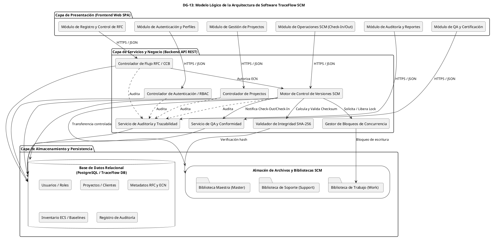
```plantuml
@startuml
skinparam shadowing false
skinparam roundcorner 8
skinparam defaultFontName Arial
skinparam componentStyle rectangle

title <b>DG-13: Modelo Lógico de la Arquitectura de Software TraceFlow SCM</b>

package "Capa de Presentación (Frontend Web SPA)" {
    component [Módulo de Autenticación y Perfiles] as UI_AUTH
    component [Módulo de Gestión de Proyectos] as UI_PROJ
    component [Módulo de Registro y Control de RFC] as UI_RFC
    component [Módulo de Operaciones SCM (Check-In/Out)] as UI_SCM
    component [Módulo de QA y Certificación] as UI_QA
    component [Módulo de Auditoría y Reportes] as UI_AUDIT
}

package "Capa de Servicios y Negocio (Backend API REST)" {
    component [Controlador de Autenticación / RBAC] as CTRL_AUTH
    component [Controlador de Proyectos] as CTRL_PROJ
    component [Controlador de Flujo RFC / CCB] as CTRL_RFC
    component [Motor de Control de Versiones SCM] as SCM_ENGINE
    component [Gestor de Bloqueos de Concurrencia] as LOCK_MGR
    component [Servicio de QA y Conformidad] as QA_SRV
    component [Validador de Integridad SHA-256] as HASH_VAL
    component [Servicio de Auditoría y Trazabilidad] as AUDIT_SRV
}

package "Capa de Almacenamiento y Persistencia" {
    database "Base de Datos Relacional\n(PostgreSQL / TraceFlow DB)" as DB {
        [Usuarios / Roles]
        [Proyectos / Clientes]
        [Metadatos RFC y ECN]
        [Inventario ECS / Baselines]
        [Registro de Auditoría]
    }
    
    storage "Almacén de Archivos y Bibliotecas SCM" as STORAGE {
        folder "Biblioteca de Trabajo (Work)" as LIB_WORK
        folder "Biblioteca de Soporte (Support)" as LIB_SUPPORT
        folder "Biblioteca Maestra (Master)" as LIB_MASTER
    }
}

UI_AUTH --> CTRL_AUTH : HTTPS / JSON
UI_PROJ --> CTRL_PROJ : HTTPS / JSON
UI_RFC --> CTRL_RFC : HTTPS / JSON
UI_SCM --> SCM_ENGINE : HTTPS / JSON
UI_QA --> QA_SRV : HTTPS / JSON
UI_AUDIT --> AUDIT_SRV : HTTPS / JSON

CTRL_RFC --> SCM_ENGINE : Autoriza ECN
SCM_ENGINE --> LOCK_MGR : Solicita / Libera Lock
SCM_ENGINE --> HASH_VAL : Calcula y Valida Checksum
SCM_ENGINE --> QA_SRV : Notifica Check-Out/Check-In

CTRL_AUTH ..> AUDIT_SRV : Audita
CTRL_PROJ ..> AUDIT_SRV : Audita
CTRL_RFC ..> AUDIT_SRV : Audita
SCM_ENGINE ..> AUDIT_SRV : Audita

CTRL_AUTH --> DB
CTRL_PROJ --> DB
CTRL_RFC --> DB
QA_SRV --> DB
AUDIT_SRV --> DB
SCM_ENGINE --> DB

SCM_ENGINE --> STORAGE : Transferencia controlada
LOCK_MGR --> LIB_WORK : Bloqueo de escritura
HASH_VAL --> STORAGE : Verificación hash

@enduml
```

---

# Diagramas de Secuencia del Modelo Lógico

Los diagramas de secuencia modelan la interacción temporal y sincrónica entre los actores y los componentes del sistema (Frontend, Controlador, Servicios de Lógica de Negocio y Persistencia/SCM Core) conforme a los escenarios de caso de uso detallados en la Sección 6.1.3 y catalogados en `TB-11`.

---

### DG-SEQ-01 — Gestionar usuarios y roles (CU-01)
**ID:** DG-SEQ-01 | **Tipo:** Secuencia | **Estado:** APROBADO | **Versión:** 1.0  
**RF:** RF-01 | **RN:** N/A | **CU:** CU-01 | **Fuente:** `FD03-EPIS-Informe_SRS.md`, Sección 6.2.1 (Pág. 96)

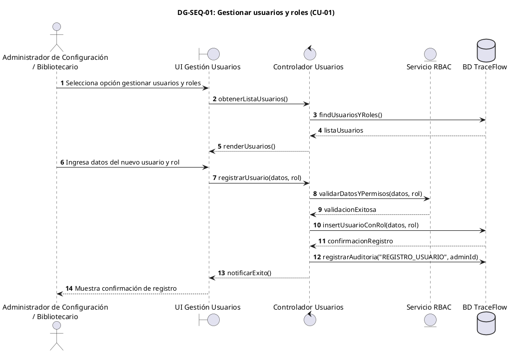
```plantuml
@startuml
skinparam shadowing false
skinparam roundcorner 8
skinparam defaultFontName Arial
autonumber

title <b>DG-SEQ-01: Gestionar usuarios y roles (CU-01)</b>

actor "Administrador de Configuración\n/ Bibliotecario" as ACT
boundary "UI Gestión Usuarios" as UI
control "Controlador Usuarios" as CTRL
entity "Servicio RBAC" as SRV
database "BD TraceFlow" as DB

ACT -> UI : Selecciona opción gestionar usuarios y roles
UI -> CTRL : obtenerListaUsuarios()
CTRL -> DB : findUsuariosYRoles()
DB --> CTRL : listaUsuarios
CTRL --> UI : renderUsuarios()

ACT -> UI : Ingresa datos del nuevo usuario y rol
UI -> CTRL : registrarUsuario(datos, rol)
CTRL -> SRV : validarDatosYPermisos(datos, rol)
SRV --> CTRL : validacionExitosa
CTRL -> DB : insertUsuarioConRol(datos, rol)
DB --> CTRL : confirmacionRegistro
CTRL -> DB : registrarAuditoria("REGISTRO_USUARIO", adminId)
CTRL --> UI : notificarExito()
UI --> ACT : Muestra confirmación de registro
@enduml
```

---

### DG-SEQ-02 — Crear y administrar proyectos (CU-02)
**ID:** DG-SEQ-02 | **Tipo:** Secuencia | **Estado:** APROBADO | **Versión:** 1.0  
**RF:** RF-02 | **RN:** N/A | **CU:** CU-02 | **Fuente:** `FD03-EPIS-Informe_SRS.md`, Sección 6.2.1 (Pág. 97)

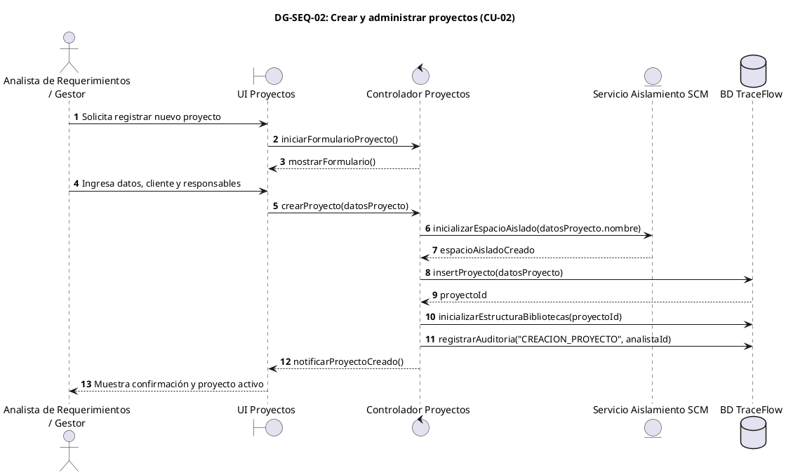
```plantuml
@startuml
skinparam shadowing false
skinparam roundcorner 8
skinparam defaultFontName Arial
autonumber

title <b>DG-SEQ-02: Crear y administrar proyectos (CU-02)</b>

actor "Analista de Requerimientos\n/ Gestor" as ACT
boundary "UI Proyectos" as UI
control "Controlador Proyectos" as CTRL
entity "Servicio Aislamiento SCM" as SRV
database "BD TraceFlow" as DB

ACT -> UI : Solicita registrar nuevo proyecto
UI -> CTRL : iniciarFormularioProyecto()
CTRL --> UI : mostrarFormulario()

ACT -> UI : Ingresa datos, cliente y responsables
UI -> CTRL : crearProyecto(datosProyecto)
CTRL -> SRV : inicializarEspacioAislado(datosProyecto.nombre)
SRV --> CTRL : espacioAisladoCreado
CTRL -> DB : insertProyecto(datosProyecto)
DB --> CTRL : proyectoId
CTRL -> DB : inicializarEstructuraBibliotecas(proyectoId)
CTRL -> DB : registrarAuditoria("CREACION_PROYECTO", analistaId)
CTRL --> UI : notificarProyectoCreado()
UI --> ACT : Muestra confirmación y proyecto activo
@enduml
```

---

---

### DG-SEQ-03 — Secuencia: Consultar proyecto (CU-03)
**ID:** DG-SEQ-03 | **Tipo:** Secuencia | **Estado:** APROBADO | **Versión:** 1.0  
**RF:** RF-02 | **RN:** N/A | **CU:** CU-03 | **Fuente:** `FD03-EPIS-Informe_SRS.md`, Sección 6.1.3 (CU-03) y 6.2.1

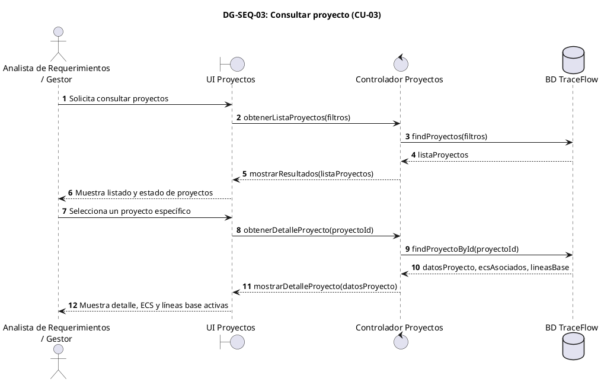
```plantuml
@startuml
skinparam shadowing false
skinparam roundcorner 8
skinparam defaultFontName Arial
autonumber

title <b>DG-SEQ-03: Consultar proyecto (CU-03)</b>

actor "Analista de Requerimientos\n/ Gestor" as ACT
boundary "UI Proyectos" as UI
control "Controlador Proyectos" as CTRL
database "BD TraceFlow" as DB

ACT -> UI : Solicita consultar proyectos
UI -> CTRL : obtenerListaProyectos(filtros)
CTRL -> DB : findProyectos(filtros)
DB --> CTRL : listaProyectos
CTRL --> UI : mostrarResultados(listaProyectos)
UI --> ACT : Muestra listado y estado de proyectos

ACT -> UI : Selecciona un proyecto específico
UI -> CTRL : obtenerDetalleProyecto(proyectoId)
CTRL -> DB : findProyectoById(proyectoId)
DB --> CTRL : datosProyecto, ecsAsociados, lineasBase
CTRL --> UI : mostrarDetalleProyecto(datosProyecto)
UI --> ACT : Muestra detalle, ECS y líneas base activas
@enduml
```

### DG-SEQ-04 — Registrar Solicitud de Cambio (RFC) (CU-04)
**ID:** DG-SEQ-04 | **Tipo:** Secuencia | **Estado:** APROBADO | **Versión:** 1.0  
**RF:** RF-04 | **RN:** RN-04 | **CU:** CU-04 | **Fuente:** `FD03-EPIS-Informe_SRS.md`, Sección 6.2.1 (Pág. 98)

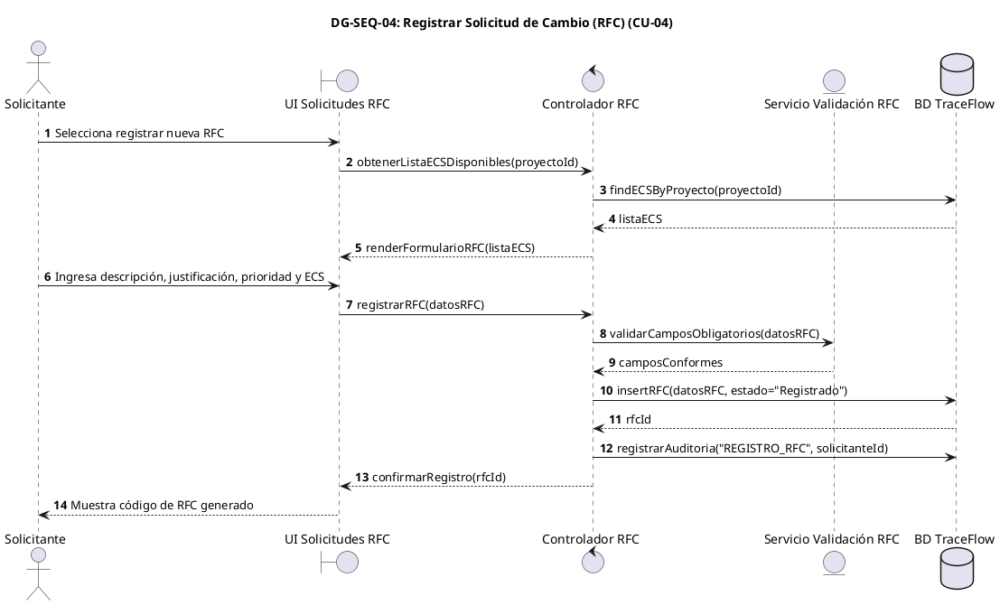
```plantuml
@startuml
skinparam shadowing false
skinparam roundcorner 8
skinparam defaultFontName Arial
autonumber

title <b>DG-SEQ-04: Registrar Solicitud de Cambio (RFC) (CU-04)</b>

actor "Solicitante" as ACT
boundary "UI Solicitudes RFC" as UI
control "Controlador RFC" as CTRL
entity "Servicio Validación RFC" as SRV
database "BD TraceFlow" as DB

ACT -> UI : Selecciona registrar nueva RFC
UI -> CTRL : obtenerListaECSDisponibles(proyectoId)
CTRL -> DB : findECSByProyecto(proyectoId)
DB --> CTRL : listaECS
CTRL --> UI : renderFormularioRFC(listaECS)

ACT -> UI : Ingresa descripción, justificación, prioridad y ECS
UI -> CTRL : registrarRFC(datosRFC)
CTRL -> SRV : validarCamposObligatorios(datosRFC)
SRV --> CTRL : camposConformes
CTRL -> DB : insertRFC(datosRFC, estado="Registrado")
DB --> CTRL : rfcId
CTRL -> DB : registrarAuditoria("REGISTRO_RFC", solicitanteId)
CTRL --> UI : confirmarRegistro(rfcId)
UI --> ACT : Muestra código de RFC generado
@enduml
```

---

### DG-SEQ-05 — Validar y clasificar la solicitud (CU-05)
**ID:** DG-SEQ-05 | **Tipo:** Secuencia | **Estado:** APROBADO | **Versión:** 1.0  
**RF:** RF-04, RF-05 | **RN:** RN-05 | **CU:** CU-05 | **Fuente:** `FD03-EPIS-Informe_SRS.md`, Sección 6.2.1 (Pág. 99)

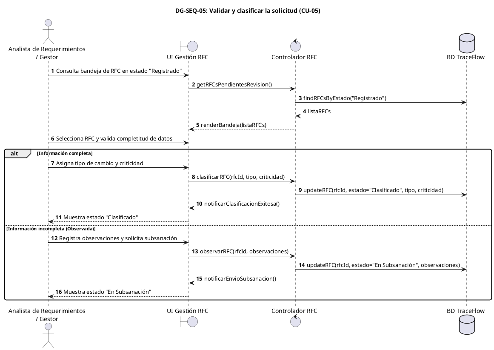
```plantuml
@startuml
skinparam shadowing false
skinparam roundcorner 8
skinparam defaultFontName Arial
autonumber

title <b>DG-SEQ-05: Validar y clasificar la solicitud (CU-05)</b>

actor "Analista de Requerimientos\n/ Gestor" as ACT
boundary "UI Gestión RFC" as UI
control "Controlador RFC" as CTRL
database "BD TraceFlow" as DB

ACT -> UI : Consulta bandeja de RFC en estado "Registrado"
UI -> CTRL : getRFCsPendientesRevision()
CTRL -> DB : findRFCsByEstado("Registrado")
DB --> CTRL : listaRFCs
CTRL --> UI : renderBandeja(listaRFCs)

ACT -> UI : Selecciona RFC y valida completitud de datos
alt Información completa
    ACT -> UI : Asigna tipo de cambio y criticidad
    UI -> CTRL : clasificarRFC(rfcId, tipo, criticidad)
    CTRL -> DB : updateRFC(rfcId, estado="Clasificado", tipo, criticidad)
    CTRL --> UI : notificarClasificacionExitosa()
    UI --> ACT : Muestra estado "Clasificado"
else Información incompleta (Observada)
    ACT -> UI : Registra observaciones y solicita subsanación
    UI -> CTRL : observarRFC(rfcId, observaciones)
    CTRL -> DB : updateRFC(rfcId, estado="En Subsanación", observaciones)
    CTRL --> UI : notificarEnvioSubsanacion()
    UI --> ACT : Muestra estado "En Subsanación"
end
@enduml
```

---

### DG-SEQ-06 — Realizar análisis de impacto técnico (CU-06)
**ID:** DG-SEQ-06 | **Tipo:** Secuencia | **Estado:** APROBADO | **Versión:** 1.0  
**RF:** RF-05 | **RN:** RN-05 | **CU:** CU-06 | **Fuente:** `FD03-EPIS-Informe_SRS.md`, Sección 6.2.1 (Pág. 100)

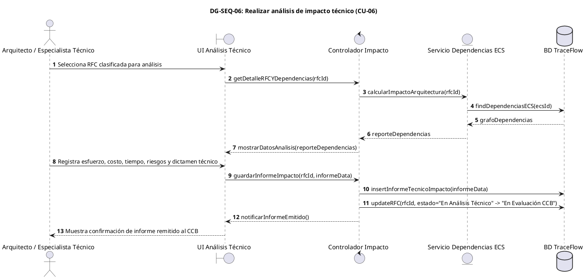
```plantuml
@startuml
skinparam shadowing false
skinparam roundcorner 8
skinparam defaultFontName Arial
autonumber

title <b>DG-SEQ-06: Realizar análisis de impacto técnico (CU-06)</b>

actor "Arquitecto / Especialista Técnico" as ACT
boundary "UI Análisis Técnico" as UI
control "Controlador Impacto" as CTRL
entity "Servicio Dependencias ECS" as SRV
database "BD TraceFlow" as DB

ACT -> UI : Selecciona RFC clasificada para análisis
UI -> CTRL : getDetalleRFCYDependencias(rfcId)
CTRL -> SRV : calcularImpactoArquitectura(rfcId)
SRV -> DB : findDependenciasECS(ecsId)
DB --> SRV : grafoDependencias
SRV --> CTRL : reporteDependencias
CTRL --> UI : mostrarDatosAnalisis(reporteDependencias)

ACT -> UI : Registra esfuerzo, costo, tiempo, riesgos y dictamen técnico
UI -> CTRL : guardarInformeImpacto(rfcId, informeData)
CTRL -> DB : insertInformeTecnicoImpacto(informeData)
CTRL -> DB : updateRFC(rfcId, estado="En Análisis Técnico" -> "En Evaluación CCB")
CTRL --> UI : notificarInformeEmitido()
UI --> ACT : Muestra confirmación de informe remitido al CCB
@enduml
```

---

### DG-SEQ-07 — Evaluar viabilidad y aprobación por el CCB (CU-07)
**ID:** DG-SEQ-07 | **Tipo:** Secuencia | **Estado:** APROBADO | **Versión:** 1.0  
**RF:** RF-06 | **RN:** RN-01, RN-05, RN-07 | **CU:** CU-07 | **Fuente:** `FD03-EPIS-Informe_SRS.md`, Sección 6.2.1 (Pág. 101)

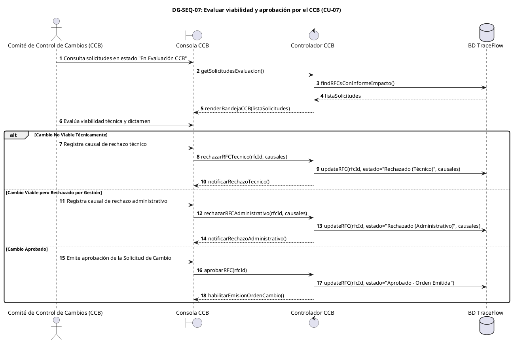
```plantuml
@startuml
skinparam shadowing false
skinparam roundcorner 8
skinparam defaultFontName Arial
autonumber

title <b>DG-SEQ-07: Evaluar viabilidad y aprobación por el CCB (CU-07)</b>

actor "Comité de Control de Cambios (CCB)" as ACT
boundary "Consola CCB" as UI
control "Controlador CCB" as CTRL
database "BD TraceFlow" as DB

ACT -> UI : Consulta solicitudes en estado "En Evaluación CCB"
UI -> CTRL : getSolicitudesEvaluacion()
CTRL -> DB : findRFCsConInformeImpacto()
DB --> CTRL : listaSolicitudes
CTRL --> UI : renderBandejaCCB(listaSolicitudes)

ACT -> UI : Evalúa viabilidad técnica y dictamen
alt Cambio No Viable Técnicamente
    ACT -> UI : Registra causal de rechazo técnico
    UI -> CTRL : rechazarRFCTecnico(rfcId, causales)
    CTRL -> DB : updateRFC(rfcId, estado="Rechazado (Técnico)", causales)
    CTRL --> UI : notificarRechazoTecnico()
else Cambio Viable pero Rechazado por Gestión
    ACT -> UI : Registra causal de rechazo administrativo
    UI -> CTRL : rechazarRFCAdministrativo(rfcId, causales)
    CTRL -> DB : updateRFC(rfcId, estado="Rechazado (Administrativo)", causales)
    CTRL --> UI : notificarRechazoAdministrativo()
else Cambio Aprobado
    ACT -> UI : Emite aprobación de la Solicitud de Cambio
    UI -> CTRL : aprobarRFC(rfcId)
    CTRL -> DB : updateRFC(rfcId, estado="Aprobado - Orden Emitida")
    CTRL --> UI : habilitarEmisionOrdenCambio()
end
@enduml
```

---

### DG-SEQ-08 — Emitir Orden de Cambio (ECN/ECO) (CU-08)
**ID:** DG-SEQ-08 | **Tipo:** Secuencia | **Estado:** APROBADO | **Versión:** 1.0  
**RF:** RF-07 | **RN:** RN-01, RN-03 | **CU:** CU-08 | **Fuente:** `FD03-EPIS-Informe_SRS.md`, Sección 6.2.1 (Pág. 102)

```plantuml
@startuml
skinparam shadowing false
skinparam roundcorner 8
skinparam defaultFontName Arial
autonumber

title <b>DG-SEQ-08: Emitir Orden de Cambio (ECN/ECO) (CU-08)</b>

actor "Comité de Control de Cambios (CCB)" as ACT
boundary "Consola CCB" as UI
control "Controlador Ordenes" as CTRL
database "BD TraceFlow" as DB

ACT -> UI : Selecciona RFC aprobada y solicita emisión de ECN
UI -> CTRL : prepararECN(rfcId)
CTRL -> DB : getDatosRFCYAprobacion(rfcId)
DB --> CTRL : datosRFC
CTRL --> UI : renderFormularioECN(datosRFC)

ACT -> UI : Asigna Desarrollador responsable y fechas límite
UI -> CTRL : emitirECN(ecnData)
CTRL -> DB : insertOrdenCambio(ecnData)
DB --> CTRL : ecnId
CTRL -> DB : vincularRFCconECN(rfcId, ecnId)
CTRL -> DB : registrarAuditoria("EMISION_ECN", ccbId)
CTRL --> UI : confirmarEmision(ecnId)
UI --> ACT : Muestra ECN emitida formalmente
@enduml
```

---

### DG-SEQ-09 — Registrar ECS (CU-09)
**ID:** DG-SEQ-09 | **Tipo:** Secuencia | **Estado:** APROBADO | **Versión:** 1.0  
**RF:** RF-03 | **RN:** RN-02 | **CU:** CU-09 | **Fuente:** `FD03-EPIS-Informe_SRS.md`, Sección 6.2.1 (Pág. 103)

```plantuml
@startuml
skinparam shadowing false
skinparam roundcorner 8
skinparam defaultFontName Arial
autonumber

title <b>DG-SEQ-09: Registrar ECS (CU-09)</b>

actor "Arquitecto / Especialista Técnico" as ACT
boundary "UI Gestión ECS" as UI
control "Controlador ECS" as CTRL
database "BD TraceFlow" as DB

ACT -> UI : Selecciona registrar nuevo Elemento de Configuración
UI -> CTRL : getProyectosYTiposECS()
CTRL -> DB : findTiposECS()
DB --> CTRL : tiposECS
CTRL --> UI : renderFormularioECS(tiposECS)

ACT -> UI : Ingresa nombre, tipo (código/doc/bd), proyecto y ruta
UI -> CTRL : registrarECS(datosECS)
CTRL -> DB : insertECS(datosECS, estado="Identificado")
DB --> CTRL : ecsId
CTRL -> DB : inicializarHistorialVersiones(ecsId, version="1.0.0")
CTRL --> UI : notificarRegistroExitoso(ecsId)
UI --> ACT : Muestra confirmación de ECS catalogado
@enduml
```

---

### DG-SEQ-10 — Efectuar Check-Out y bloqueo (CU-10)
**ID:** DG-SEQ-10 | **Tipo:** Secuencia | **Estado:** APROBADO | **Versión:** 1.0  
**RF:** RF-08, RF-09 | **RN:** RN-04, RN-06 | **CU:** CU-10 | **Fuente:** `FD03-EPIS-Informe_SRS.md`, Sección 6.2.1 (Pág. 104)

```plantuml
@startuml
skinparam shadowing false
skinparam roundcorner 8
skinparam defaultFontName Arial
autonumber

title <b>DG-SEQ-10: Efectuar Check-Out y aplicar bloqueo (CU-10)</b>

actor "Administrador de Configuración\n/ Bibliotecario" as ACT
boundary "UI Gestión Bibliotecas" as UI
control "Controlador Bibliotecas" as CTRL
entity "Servicio Bloqueos SCM" as SRV
database "BD TraceFlow" as DB

ACT -> UI : Selecciona ECN autorizada y solicita Check-Out del ECS
UI -> CTRL : ejecutarCheckOut(ecnId, ecsId)
CTRL -> SRV : verificarDisponibilidadBloqueo(ecsId)
alt ECS ya se encuentra bloqueado
    SRV --> CTRL : error("ECS bloqueado por otro usuario")
    CTRL --> UI : mostrarErrorBloqueoActivo()
    UI --> ACT : Informa que el ECS está en edición concurrente
else ECS disponible
    SRV -> DB : insertBloqueoSincronizacion(ecsId, ecnId, devId)
    CTRL -> DB : transferirECS(ecsId, "Biblioteca Soporte", "Biblioteca Trabajo")
    CTRL -> DB : updateEstadoRFC(rfcId, "En Implementación")
    CTRL -> DB : registrarAuditoria("CHECK_OUT", ecsId, adminId)
    CTRL --> UI : confirmarCheckOutExitoso()
    UI --> ACT : Muestra ECS transferido con bloqueo activo
end
@enduml
```

---

### DG-SEQ-11 — Aplicar bloqueo de sincronización (CU-11)
**ID:** DG-SEQ-11 | **Tipo:** Secuencia | **Estado:** APROBADO | **Versión:** 1.0  
**RF:** RF-09 | **RN:** RN-06 | **CU:** CU-11 | **Fuente:** `FD03-EPIS-Informe_SRS.md`, Sección 6.2.1 (Pág. 104)

```plantuml
@startuml
skinparam shadowing false
skinparam roundcorner 8
skinparam defaultFontName Arial
autonumber

title <b>DG-SEQ-11: Aplicar bloqueo de sincronización (CU-11)</b>

actor "Administrador de Configuración\n/ Bibliotecario" as ACT
boundary "UI Bloqueos SCM" as UI
control "Controlador Bloqueos" as CTRL
database "BD TraceFlow" as DB

ACT -> UI : Consulta estado de bloqueos del ECS
UI -> CTRL : getEstadoBloqueo(ecsId)
CTRL -> DB : findBloqueoByECS(ecsId)
DB --> CTRL : estadoBloqueo
CTRL --> UI : mostrarDetalleBloqueo(estadoBloqueo)

ACT -> UI : Confirma imposición / verificación de bloqueo
UI -> CTRL : aplicarBloqueo(ecsId, motivo)
CTRL -> DB : updateBloqueo(ecsId, estado="ACTIVO", motivo)
CTRL -> DB : registrarAuditoria("BLOQUEO_APLICADO", ecsId)
CTRL --> UI : notificarBloqueoActivo()
UI --> ACT : Muestra bloqueo activo en Biblioteca de Trabajo
@enduml
```

---

### DG-SEQ-12 — Efectuar Check-In a Biblioteca Maestra (CU-12)
**ID:** DG-SEQ-12 | **Tipo:** Secuencia | **Estado:** APROBADO | **Versión:** 1.0  
**RF:** RF-08, RF-09 | **RN:** RN-01, RN-03, RN-09 | **CU:** CU-12 | **Fuente:** `FD03-EPIS-Informe_SRS.md`, Sección 6.2.1 (Pág. 105)

```plantuml
@startuml
skinparam shadowing false
skinparam roundcorner 8
skinparam defaultFontName Arial
autonumber

title <b>DG-SEQ-12: Efectuar Check-In a Biblioteca Maestra (CU-12)</b>

actor "Administrador de Configuración\n/ Bibliotecario" as ACT
boundary "UI Gestión Bibliotecas" as UI
control "Controlador Bibliotecas" as CTRL
entity "Servicio Certificación QA" as SRV_QA
database "BD TraceFlow" as DB

ACT -> UI : Selecciona ECS certificado para Check-In
UI -> CTRL : solicitarCheckIn(ecsId, ecnId, mensajeVersion)
CTRL -> SRV_QA : verificarCertificacionConformidad(ecnId)
SRV_QA -> DB : findCertificacionByECN(ecnId)
DB --> SRV_QA : certificacionValida
SRV_QA --> CTRL : autorizacionConforme

CTRL -> DB : transferirECS(ecsId, "Biblioteca Trabajo", "Biblioteca Maestra")
CTRL -> DB : releaseBloqueoSincronizacion(ecsId)
CTRL -> DB : insertVersionHistorial(ecsId, mensajeVersion)
CTRL -> DB : registrarAuditoria("CHECK_IN_MAESTRA", ecsId, adminId)
CTRL --> UI : notificarCheckInCompletado()
UI --> ACT : Muestra ECS integrado y bloqueo liberado
@enduml
```

---

### DG-SEQ-13 — Consultar historial de versiones (CU-13)
**ID:** DG-SEQ-13 | **Tipo:** Secuencia | **Estado:** APROBADO | **Versión:** 1.0  
**RF:** RF-09, RF-16 | **RN:** RN-02, RN-03 | **CU:** CU-13 | **Fuente:** `FD03-EPIS-Informe_SRS.md`, Sección 6.2.1 (Pág. 105)

```plantuml
@startuml
skinparam shadowing false
skinparam roundcorner 8
skinparam defaultFontName Arial
autonumber

title <b>DG-SEQ-13: Consultar historial de versiones (CU-13)</b>

actor "Administrador de Configuración\n/ Bibliotecario" as ACT
boundary "UI Trazabilidad Versiones" as UI
control "Controlador Historial" as CTRL
database "BD TraceFlow" as DB

ACT -> UI : Selecciona ECS y solicita ver historial
UI -> CTRL : getHistorialVersiones(ecsId)
CTRL -> DB : findVersionesByECS(ecsId)
DB --> CTRL : listaVersionesConHashYAutor
CTRL --> UI : renderHistorial(listaVersiones)

ACT -> UI : Selecciona versión específica para comparar
UI -> CTRL : compararVersiones(versionA, versionB)
CTRL -> DB : getDiffEntreVersiones(versionA, versionB)
DB --> CTRL : diffData
CTRL --> UI : renderComparador(diffData)
UI --> ACT : Muestra diferencias y trazabilidad de cambios
@enduml
```

---

### DG-SEQ-14 — Implementar cambio en el ECS (CU-14)
**ID:** DG-SEQ-14 | **Tipo:** Secuencia | **Estado:** APROBADO | **Versión:** 1.0  
**RF:** RF-07, RF-09 | **RN:** RN-06 | **CU:** CU-14 | **Fuente:** `FD03-EPIS-Informe_SRS.md`, Sección 6.2.1 (Pág. 106)

```plantuml
@startuml
skinparam shadowing false
skinparam roundcorner 8
skinparam defaultFontName Arial
autonumber

title <b>DG-SEQ-14: Implementar cambio en el ECS (CU-14)</b>

actor "Ingeniero de Software\n/ Desarrollador" as ACT
boundary "UI Espacio de Trabajo" as UI
control "Controlador Trabajo" as CTRL
database "Biblioteca de Trabajo" as LIB_WRK

ACT -> UI : Accede al ECS autorizado bajo Check-Out
UI -> CTRL : obtenerCopiaTrabajo(ecsId, ecnId)
CTRL -> LIB_WRK : getArchivoECS(ecsId)
LIB_WRK --> CTRL : archivoFuente
CTRL --> UI : cargarEntornoEdicion(archivoFuente)

ACT -> UI : Realiza modificaciones requeridas por la ECN
ACT -> UI : Guarda avances intermedios
UI -> CTRL : guardarCambiosEnTrabajo(ecsId, contenidoModificado)
CTRL -> LIB_WRK : updateArchivoTrabajo(ecsId, contenidoModificado)
LIB_WRK --> CTRL : guardadoExitoso
CTRL --> UI : notificarGuardado()
UI --> ACT : Confirma actualización local en Biblioteca de Trabajo
@enduml
```

---

### DG-SEQ-15 — Ejecutar pruebas unitarias locales (CU-15)
**ID:** DG-SEQ-15 | **Tipo:** Secuencia | **Estado:** APROBADO | **Versión:** 1.0  
**RF:** RF-10 | **RN:** N/A | **CU:** CU-15 | **Fuente:** `FD03-EPIS-Informe_SRS.md`, Sección 6.2.1 (Pág. 107)

```plantuml
@startuml
skinparam shadowing false
skinparam roundcorner 8
skinparam defaultFontName Arial
autonumber

title <b>DG-SEQ-15: Ejecutar pruebas unitarias locales (CU-15)</b>

actor "Ingeniero de Software\n/ Desarrollador" as ACT
boundary "UI Pruebas Locales" as UI
control "Runner Pruebas Unitarias" as RUNNER
database "Biblioteca de Trabajo" as LIB_WRK

ACT -> UI : Solicita ejecución de suite unitaria local
UI -> RUNNER : ejecutarPruebasUnitarias(ecsId)
RUNNER -> LIB_WRK : cargarModuloModificado(ecsId)
RUNNER -> RUNNER : ejecutarTests()
RUNNER --> UI : reporteResultados(testsPasados, fallos)

alt Pruebas aprobadas (100% éxito)
    UI --> ACT : Muestra resultado conforme; habilita entrega a QA
else Pruebas con fallos
    UI --> ACT : Muestra fallos y líneas con errores para corrección
end
@enduml
```

---

### DG-SEQ-16 — Ejecutar pruebas de integración (CU-16)
**ID:** DG-SEQ-16 | **Tipo:** Secuencia | **Estado:** APROBADO | **Versión:** 1.0  
**RF:** RF-10 | **RN:** RN-09 | **CU:** CU-16 | **Fuente:** `FD03-EPIS-Informe_SRS.md`, Sección 6.2.1 (Pág. 107)

```plantuml
@startuml
skinparam shadowing false
skinparam roundcorner 8
skinparam defaultFontName Arial
autonumber

title <b>DG-SEQ-16: Ejecutar pruebas de integración (CU-16)</b>

actor "Equipo de Calidad / Testing" as ACT
boundary "UI Calidad y Pruebas" as UI
control "Controlador QA" as CTRL
database "Biblioteca de Soporte" as LIB_SUP

ACT -> UI : Selecciona cambio entregado para validación
UI -> CTRL : iniciarValidacionIntegracion(ecnId)
CTRL -> LIB_SUP : desplegarEntornoPruebas(ecnId)
CTRL -> CTRL : ejecutarBateriaIntegracionYFuncional()
CTRL --> UI : reporteQA(casosPrueba, conformidades, noConformidades)
UI --> ACT : Visualiza matriz de resultados de pruebas
@enduml
```

---

### DG-SEQ-17 — Certificar conformidad del cambio (CU-17)
**ID:** DG-SEQ-17 | **Tipo:** Secuencia | **Estado:** APROBADO | **Versión:** 1.0  
**RF:** RF-10 | **RN:** RN-09 | **CU:** CU-17 | **Fuente:** `FD03-EPIS-Informe_SRS.md`, Sección 6.2.1 (Pág. 108)

```plantuml
@startuml
skinparam shadowing false
skinparam roundcorner 8
skinparam defaultFontName Arial
autonumber

title <b>DG-SEQ-17: Certificar conformidad del cambio (CU-17)</b>

actor "Equipo de Calidad / Testing" as ACT
boundary "UI Calidad y Pruebas" as UI
control "Controlador QA" as CTRL
database "BD TraceFlow" as DB

ACT -> UI : Confirma aprobación de todas las pruebas QA
UI -> CTRL : certificarCambio(ecnId, actaPruebas)
CTRL -> DB : insertCertificacionConformidad(ecnId, actaPruebas, qaId)
CTRL -> DB : updateEstadoRFC(rfcId, "En Validación QA" -> "Certificado")
CTRL -> DB : registrarAuditoria("CERTIFICACION_CONFORMIDAD", ecnId)
CTRL --> UI : notificarCertificacionExitosa()
UI --> ACT : Muestra Certificado de Conformidad emitido
@enduml
```

---

### DG-SEQ-18 — Reportar no conformidad (CU-18)
**ID:** DG-SEQ-18 | **Tipo:** Secuencia | **Estado:** APROBADO | **Versión:** 1.0  
**RF:** RF-10 | **RN:** RN-08 | **CU:** CU-18 | **Fuente:** `FD03-EPIS-Informe_SRS.md`, Sección 6.2.1 (Pág. 108)

```plantuml
@startuml
skinparam shadowing false
skinparam roundcorner 8
skinparam defaultFontName Arial
autonumber

title <b>DG-SEQ-18: Reportar no conformidad (CU-18)</b>

actor "Equipo de Calidad / Testing" as ACT
boundary "UI Hallazgos QA" as UI
control "Controlador Hallazgos" as CTRL
database "BD TraceFlow" as DB

ACT -> UI : Registra defectos encontrados en validación
UI -> CTRL : reportarNoConformidad(ecnId, hallazgos, severidad)
CTRL -> DB : insertNoConformidad(ecnId, hallazgos, severidad)
CTRL -> DB : updateEstadoRFC(rfcId, "En Corrección")
CTRL -> DB : notificarDesarrollador(ecnId, hallazgos)
CTRL --> UI : confirmarRegistroNoConformidad()
UI --> ACT : Muestra no conformidad registrada y asignada
@enduml
```

---

### DG-SEQ-19 — Reevaluar y re-testear (CU-19)
**ID:** DG-SEQ-19 | **Tipo:** Secuencia | **Estado:** APROBADO | **Versión:** 1.0  
**RF:** RF-11 | **RN:** RN-08 | **CU:** CU-19 | **Fuente:** `FD03-EPIS-Informe_SRS.md`, Sección 6.2.1 (Pág. 109)

```plantuml
@startuml
skinparam shadowing false
skinparam roundcorner 8
skinparam defaultFontName Arial
autonumber

title <b>DG-SEQ-19: Reevaluar y re-testear (CU-19)</b>

actor "Equipo de Calidad / Testing" as ACT
boundary "UI Re-testeo QA" as UI
control "Controlador ReTest" as CTRL
database "BD TraceFlow" as DB

ACT -> UI : Selecciona corrección entregada por Desarrollador
UI -> CTRL : iniciarReTest(noConformidadId)
CTRL -> CTRL : ejecutarPruebasAfectadas()

alt Defecto corregido satisfactoriamente
    CTRL -> DB : updateNoConformidad(id, estado="SUBSANADA")
    CTRL --> UI : habilitarCertificacion()
    UI --> ACT : Muestra prueba superada
else Defecto persiste y se agotaron reintentos
    CTRL -> DB : updateNoConformidad(id, estado="FALLO_PERSISTENTE")
    CTRL -> DB : dispararAlertaRollback(ecnId)
    CTRL --> UI : notificarDerivacionRollback()
    UI --> ACT : Muestra alerta de fallo no subsanado
end
@enduml
```

---

### DG-SEQ-20 — Crear y congelar línea base (CU-20)
**ID:** DG-SEQ-20 | **Tipo:** Secuencia | **Estado:** APROBADO | **Versión:** 1.0  
**RF:** RF-13 | **RN:** RN-02, RN-04 | **CU:** CU-20 | **Fuente:** `FD03-EPIS-Informe_SRS.md`, Sección 6.2.1 (Pág. 110)

```plantuml
@startuml
skinparam shadowing false
skinparam roundcorner 8
skinparam defaultFontName Arial
autonumber

title <b>DG-SEQ-20: Crear y congelar línea base (CU-20)</b>

actor "Administrador de Configuración\n/ Bibliotecario" as ACT
boundary "UI Líneas Base" as UI
control "Controlador Líneas Base" as CTRL
database "BD TraceFlow" as DB

ACT -> UI : Selecciona ECS certificado en Biblioteca Maestra
UI -> CTRL : solicitarCreacionLineaBase(proyectoId, ecsId)
CTRL --> UI : mostrarFormularioLineaBase()

ACT -> UI : Ingresa versión (mayor.menor.parche) y descripción
UI -> CTRL : congelarLineaBase(proyectoId, version, ecsLista)
CTRL -> DB : validarFormatoVersion(version)
CTRL -> DB : insertLineaBase(proyectoId, version, estado="CONGELADA")
DB --> CTRL : lineaBaseId
CTRL -> DB : vincularECSaLineaBase(lineaBaseId, ecsLista)
CTRL -> DB : registrarAuditoria("LINEA_BASE_CONGELADA", lineaBaseId, adminId)
CTRL --> UI : confirmarLineaBaseCongelada()
UI --> ACT : Muestra nueva Línea Base registrada y protegida
@enduml
```

---

### DG-SEQ-21 — Ejecutar rollback en Biblioteca de Trabajo (CU-21)
**ID:** DG-SEQ-21 | **Tipo:** Secuencia | **Estado:** APROBADO | **Versión:** 1.0  
**RF:** RF-12 | **RN:** RN-06, RN-08 | **CU:** CU-21 | **Fuente:** `FD03-EPIS-Informe_SRS.md`, Sección 6.2.1 (Pág. 110)

```plantuml
@startuml
skinparam shadowing false
skinparam roundcorner 8
skinparam defaultFontName Arial
autonumber

title <b>DG-SEQ-21: Ejecutar rollback en Biblioteca de Trabajo (CU-21)</b>

actor "Administrador de Configuración\n/ Bibliotecario" as ACT
boundary "UI Gestión Rollback" as UI
control "Controlador Rollback" as CTRL
database "Biblioteca de Trabajo" as LIB_WRK
database "Biblioteca de Soporte" as LIB_SUP
database "BD TraceFlow" as DB

ACT -> UI : Confirma ejecución de Rollback por fallo persistente
UI -> CTRL : ejecutarRollbackTrabajo(ecsId, ecnId)
CTRL -> LIB_SUP : getCopiaOriginalPrevia(ecsId)
LIB_SUP --> CTRL : archivoOriginal
CTRL -> LIB_WRK : sobreescribirConOriginal(ecsId, archivoOriginal)
LIB_WRK --> CTRL : restauradoExitoso

CTRL -> DB : releaseBloqueoSincronizacion(ecsId)
CTRL -> DB : registrarAuditoria("ROLLBACK_TRABAJO", ecsId, ecnId)
CTRL --> UI : notificarRollbackCompletado()
UI --> ACT : Muestra estado previo restaurado y bloqueo liberado
@enduml
```

---

### DG-SEQ-22 — Cancelar Orden de Cambio (CU-22)
**ID:** DG-SEQ-22 | **Tipo:** Secuencia | **Estado:** APROBADO | **Versión:** 1.0  
**RF:** RF-12, RF-14 | **RN:** RN-07, RN-08 | **CU:** CU-22 | **Fuente:** `FD03-EPIS-Informe_SRS.md`, Sección 6.2.1 (Pág. 111)

```plantuml
@startuml
skinparam shadowing false
skinparam roundcorner 8
skinparam defaultFontName Arial
autonumber

title <b>DG-SEQ-22: Cancelar Orden de Cambio (CU-22)</b>

actor "Administrador de Configuración\n/ Bibliotecario" as ACT
boundary "UI Cancelación SCM" as UI
control "Controlador Cierre" as CTRL
database "BD TraceFlow" as DB

ACT -> UI : Selecciona ECN tras ejecución de Rollback
UI -> CTRL : cancelarOrdenCambio(ecnId, causa="Fallo No Subsanado")
CTRL -> DB : updateECN(ecnId, estado="CANCELADA")
CTRL -> DB : updateRFC(rfcId, estado="Cancelado (Fallo No Subsanado)")
CTRL -> DB : notificarSolicitante(rfcId, "Cancelado por Fallo No Subsanado")
CTRL -> DB : registrarAuditoria("CANCELACION_ECN", ecnId)
CTRL --> UI : confirmarCancelacionFormal()
UI --> ACT : Muestra ECN cancelada y trámite cerrado
@enduml
```

---

### DG-SEQ-23 — Registrar incidencia (CU-23)
**ID:** DG-SEQ-23 | **Tipo:** Secuencia | **Estado:** APROBADO | **Versión:** 1.0  
**RF:** RF-15 | **RN:** N/A | **CU:** CU-23 | **Fuente:** `FD03-EPIS-Informe_SRS.md`, Sección 6.2.1 (Pág. 111)

```plantuml
@startuml
skinparam shadowing false
skinparam roundcorner 8
skinparam defaultFontName Arial
autonumber

title <b>DG-SEQ-23: Registrar incidencia (CU-23)</b>

actor "Solicitante" as ACT
boundary "UI Mesa de Ayuda" as UI
control "Controlador Tickets" as CTRL
database "BD TraceFlow" as DB

ACT -> UI : Ingresa al portal de soporte y selecciona nueva incidencia
UI -> CTRL : getProyectosDisponibles()
CTRL -> DB : findProyectosCliente(solicitanteId)
DB --> CTRL : listaProyectos
CTRL --> UI : mostrarFormularioTicket(listaProyectos)

ACT -> UI : Ingresa título, descripción de falla y severidad
UI -> CTRL : crearTicket(ticketData)
CTRL -> DB : insertTicketIncidencia(ticketData, estado="Abierto")
DB --> CTRL : ticketId
CTRL --> UI : notificarTicketCreado(ticketId)
UI --> ACT : Muestra confirmación con número de ticket
@enduml
```

---

### DG-SEQ-24 — Consultar estado de ticket (CU-24)
**ID:** DG-SEQ-24 | **Tipo:** Secuencia | **Estado:** APROBADO | **Versión:** 1.0  
**RF:** RF-15 | **RN:** N/A | **CU:** CU-24 | **Fuente:** `FD03-EPIS-Informe_SRS.md`, Sección 6.2.1 (Pág. 112)

```plantuml
@startuml
skinparam shadowing false
skinparam roundcorner 8
skinparam defaultFontName Arial
autonumber

title <b>DG-SEQ-24: Consultar estado de ticket (CU-24)</b>

actor "Solicitante" as ACT
boundary "UI Mesa de Ayuda" as UI
control "Controlador Tickets" as CTRL
database "BD TraceFlow" as DB

ACT -> UI : Ingresa número de ticket o consulta historial
UI -> CTRL : getEstadoTicket(ticketId)
CTRL -> DB : findTicketById(ticketId)
DB --> CTRL : ticketDetalleYHistorial
CTRL --> UI : renderEstadoTicket(ticketDetalleYHistorial)
UI --> ACT : Muestra estado actual, respuestas y RFC asociada
@enduml
```

---

### DG-SEQ-25 — Derivar incidencia a RFC (CU-25)
**ID:** DG-SEQ-25 | **Tipo:** Secuencia | **Estado:** APROBADO | **Versión:** 1.0  
**RF:** RF-15 | **RN:** N/A | **CU:** CU-25 | **Fuente:** `FD03-EPIS-Informe_SRS.md`, Sección 6.2.1 (Pág. 112)

```plantuml
@startuml
skinparam shadowing false
skinparam roundcorner 8
skinparam defaultFontName Arial
autonumber

title <b>DG-SEQ-25: Derivar incidencia a RFC (CU-25)</b>

actor "Analista de Requerimientos\n/ Gestor" as ACT
boundary "UI Soporte / Analista" as UI
control "Controlador Incidencias" as CTRL
database "BD TraceFlow" as DB

ACT -> UI : Evalúa ticket de incidencia abierto
UI -> CTRL : analizarTicket(ticketId)
CTRL --> UI : mostrarDatosTicket()

ACT -> UI : Selecciona opción "Derivar a Solicitud de Cambio"
UI -> CTRL : derivarTicketARFC(ticketId, datosRFC)
CTRL -> DB : insertRFC(datosRFC, origen="TICKET", ticketId)
DB --> CTRL : rfcId
CTRL -> DB : updateTicket(ticketId, estado="Derivado", rfcId)
CTRL -> DB : registrarAuditoria("DERIVACION_INCIDENCIA_A_RFC", ticketId, rfcId)
CTRL --> UI : notificarDerivacionExitosa(rfcId)
UI --> ACT : Muestra RFC generada vinculada al ticket
@enduml
```

---

### DG-SEQ-26 — Validar integridad SHA-256 (CU-26)
**ID:** DG-SEQ-26 | **Tipo:** Secuencia | **Estado:** APROBADO | **Versión:** 1.0  
**RF:** RF-17, RNF-03 | **RN:** N/A | **CU:** CU-26 | **Fuente:** `FD03-EPIS-Informe_SRS.md`, Sección 6.2.1 (Pág. 113)

```plantuml
@startuml
skinparam shadowing false
skinparam roundcorner 8
skinparam defaultFontName Arial
autonumber

title <b>DG-SEQ-26: Validar integridad mediante checksum SHA-256 (CU-26)</b>

actor "Administrador de Configuración\n/ Bibliotecario" as ACT
boundary "UI Auditoría SCM" as UI
control "Controlador Integridad" as CTRL
entity "Motor Criptográfico" as HASH
database "Repositorio ECS" as REPO
database "BD TraceFlow" as DB

ACT -> UI : Solicita verificación de integridad de un ECS
UI -> CTRL : validarChecksum(ecsId, version)
CTRL -> REPO : leerArchivo(ecsId, version)
REPO --> CTRL : streamBytes
CTRL -> HASH : calcularSHA256(streamBytes)
HASH --> CTRL : hashCalculado

CTRL -> DB : getChecksumRegistrado(ecsId, version)
DB --> CTRL : hashAlmacenado

alt Hash idéntico
    CTRL --> UI : reporteIntegridad("INTEGRO", hashCalculado)
    UI --> ACT : Muestra verificación exitosa
else Hash divergente
    CTRL -> DB : registrarAlertaSeguridad("INTEGRIDAD_COMPROMETIDA", ecsId)
    CTRL --> UI : reporteIntegridad("ALTERADO", hashCalculado, hashAlmacenado)
    UI --> ACT : Alerta de corrupción o alteración no autorizada
end
@enduml
```

---

### DG-SEQ-27 — Auditar acciones del sistema (CU-27)
**ID:** DG-SEQ-27 | **Tipo:** Secuencia | **Estado:** APROBADO | **Versión:** 1.0  
**RF:** RF-16, RF-17 | **RN:** RN-03 | **CU:** CU-27 | **Fuente:** `FD03-EPIS-Informe_SRS.md`, Sección 6.2.1 (Pág. 113)

```plantuml
@startuml
skinparam shadowing false
skinparam roundcorner 8
skinparam defaultFontName Arial
autonumber

title <b>DG-SEQ-27: Auditar acciones del sistema (CU-27)</b>

actor "Comité de Control de Cambios (CCB)" as ACT
boundary "UI Auditoría" as UI
control "Controlador Auditoría" as CTRL
database "BD TraceFlow (Logs)" as DB

ACT -> UI : Define filtros de auditoría (fechas, usuario, ECS, acción)
UI -> CTRL : consultarLogsAuditoria(filtros)
CTRL -> DB : findLogsAudit(filtros)
DB --> CTRL : registrosAuditoria
CTRL --> UI : renderResultadosAuditoria(registrosAuditoria)

ACT -> UI : Solicita exportación de pista de auditoría
UI -> CTRL : exportarPistaAuditoria(filtros)
CTRL --> UI : archivoDescarga (PDF/CSV)
UI --> ACT : Entrega reporte formal de auditoría
@enduml
```

---

### DG-SEQ-28 — Generar reportes de estado (CU-28)
**ID:** DG-SEQ-28 | **Tipo:** Secuencia | **Estado:** APROBADO | **Versión:** 1.0  
**RF:** RF-18 | **RN:** N/A | **CU:** CU-28 | **Fuente:** `FD03-EPIS-Informe_SRS.md`, Sección 6.2.1 (Pág. 114)

```plantuml
@startuml
skinparam shadowing false
skinparam roundcorner 8
skinparam defaultFontName Arial
autonumber

title <b>DG-SEQ-28: Generar reportes de estado (CU-28)</b>

actor "Administrador de Configuración\n/ Bibliotecario" as ACT
boundary "UI Reportes" as UI
control "Controlador Reportes" as CTRL
database "BD TraceFlow" as DB

ACT -> UI : Selecciona tipo de reporte (inventario ECS, estado RFC, actas)
UI -> CTRL : generarReporte(tipoReporte, proyectoId)
CTRL -> DB : consolidarDatosReporte(tipoReporte, proyectoId)
DB --> CTRL : datosConsolidados
CTRL -> CTRL : compilarDocumentoReporte(datosConsolidados)
CTRL --> UI : mostrarVistaPreviaReporte()
UI --> ACT : Presenta vista previa y botón de descarga
@enduml
```

---

## Estado de Reconstrucción de Diagramas Omitidos

Todos los diagramas del SRS han sido reconstruidos formalmente con fidelidad técnica basada en los requerimientos, reglas de negocio y casos de uso aprobados en `TABLES.md`:

### DG-SEQ-03 — Diagrama de Secuencia del Caso de Uso CU-03 (Consultar proyecto)
- **ID:** DG-SEQ-03  
- **Nombre:** Diagrama de Secuencia del Caso de Uso CU-03: Consultar proyecto  
- **Tipo:** Secuencia  
- **Estado:** PENDIENTE DE RECONSTRUCCION  
- **RF relacionados:** RF-02  
- **CU relacionados:** CU-03  
- **Fuente:** Omitido en `FD03-EPIS-Informe_SRS.md`, Sección 6.2.1 (Págs. 97-98).  
- **Motivo de Pendiente:** En el documento original se presenta `CUS01`, `CUS02` y luego se salta a `CUS04`. El caso `CUS03` no cuenta con diagrama de secuencia en el SRS. Requiere que el equipo técnico decida si se formula formalmente o si se declara exceptuado por tratarse de una consulta de lectura sincrónica sin lógica transaccional.

### DG-12 — Diagrama de Clases del Dominio TraceFlow SCM
- **ID:** DG-12  
- **Nombre:** Diagrama de Clases del Dominio TraceFlow SCM  
- **Tipo:** Clases  
- **Estado:** PENDIENTE DE RECONSTRUCCION  
- **RF relacionados:** RF-01 a RF-18  
- **RN relacionadas:** RN-01 a RN-09  
- **CU relacionados:** CU-01 a CU-28  
- **Fuente:** `FD03-EPIS-Informe_SRS.md`, Sección 6.2.2 (Pág. 115, `assets/page-115.png`).  
- **Motivo de Pendiente:** El archivo gráfico original `page-115.png` no fue conservado en el repositorio y la sección 6.2.2 no contiene tablas de atributos, visibilidad ni firmas de métodos de las clases (`Usuario`, `Rol`, `Proyecto`, `ECS`, `RFC`, `ECN`, `InformeImpacto`, `LineaBase`, `BloqueoSincronizacion`, etc.). Reconstruirlo en este punto implicaría inventar contratos de clases. Se requiere validar las firmas definitivas con los responsables de Backend (Renzo Antayhua) y QA (Augusto Rivera).

### DG-13 — Modelo Lógico Arquitectural
- **ID:** DG-13  
- **Nombre:** Modelo Lógico de la Arquitectura TraceFlow SCM  
- **Tipo:** Componentes / Despliegue  
- **Estado:** PENDIENTE DE RECONSTRUCCION  
- **RF relacionados:** RNF-01, RNF-02, RNF-05, RNF-07  
- **Fuente:** `FD03-EPIS-Informe_SRS.md`, Sección 6.2 (Pág. 95, `assets/page-095.png`).  
- **Motivo de Pendiente:** La imagen original `page-095.png` no está presente y no existe una descripción textual explícita de los nodos físicos (Frontend React, Backend Node.js/TypeScript, PaaS Render/Supabase) en dicha sección. Se formalizará una vez validada la arquitectura de despliegue en la nube.
